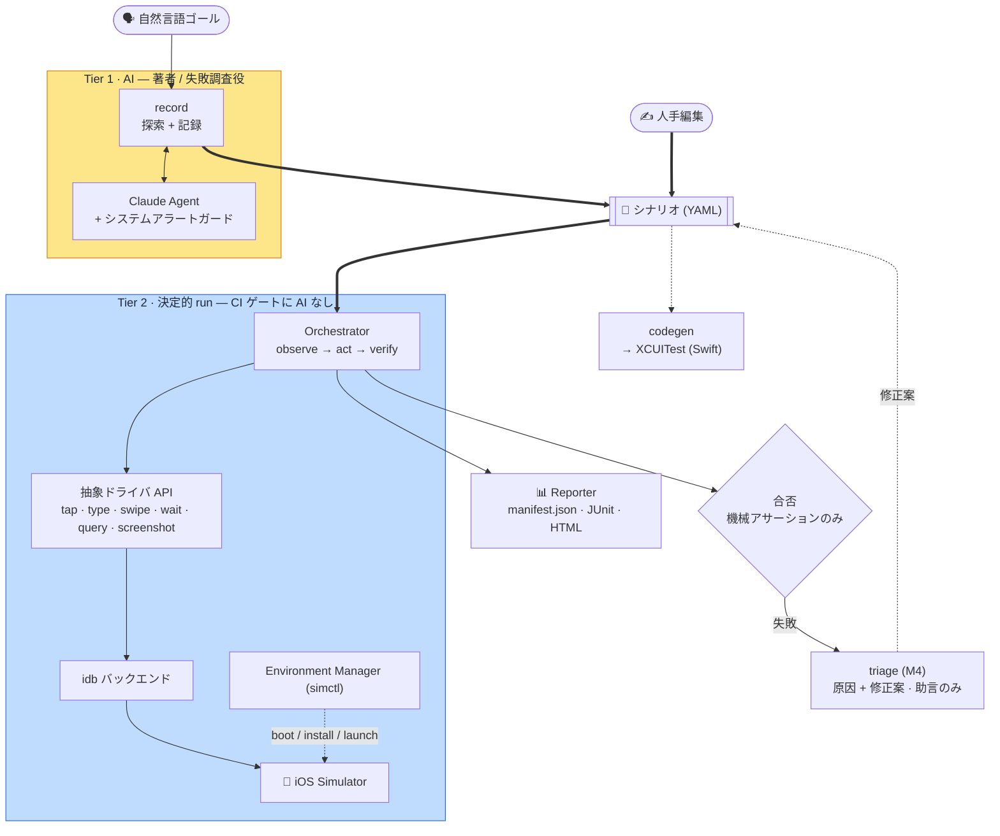

[English](README.md) · **日本語**

<p align="center">
  
</p>

# Bajutsu

> iOS Simulator 向けの自然言語駆動 E2E（端から端まで）テスト。
> **ステータス: pre-alpha。** 決定的コア、AI オーサリングループ（`record`）、証跡サブシステム、
> XCUITest codegen、自己修復トリアージはいずれも実装・ユニットテスト済みで、idb バックエンドは
> **実機 Simulator で end-to-end に検証済み**です。シナリオ実行、証跡取得、triage の自己修復ループは
> いずれも実機で動きます。

Bajutsu は自然言語で書かれた（または記録された）テストシナリオを受け取り、iOS Simulator 上の
アプリに対して実行します。tap・type・swipe・wait を行い、**機械チェック可能なアサーション**で
結果を検証します。

> **名前について。** *Bajutsu*（馬術）は馬を扱う技術を指す日本語です。この名前は、ツールが
> **iOS Simulator** 上で扱うテスト不安定要因（フレーキーなタイミング、非同期遷移、想定外のシステム
> アラート）に由来します。Bajutsu は Simulator をシナリオ通りに決定的に操作し、毎回同じ結果に
> なるようにします。

中核となる設計判断は、**LLM（大規模言語モデル）を CI（継続的インテグレーション）ゲートに
持ち込まない**ことです。

- **AI は著者と失敗時の調査役であり、判定者ではありません。** シナリオを *書く*（探索 + 記録）・
  失敗を *調べる* のは助けますが、`run` は完全に決定的で AI を含みません。合否は機械アサーションの
  みで決まります。
- **2 層構成。** Tier 1 は AI のライブ操作（探索 / オーサリング）、Tier 2 は CI 回帰向けの決定的
  ランナーです。

設計指針（日本語）は [`DESIGN.md`](DESIGN.md) にあります。実装ベースの機能別ドキュメント（英語、
日本語ミラーは [`docs/ja/`](docs/ja/README.md)）は [`docs/`](docs/README.md) にあります。

## 中核原則

- **決定性ファースト。** 固定 `sleep` は使わず、条件待機のみを使います。曖昧なセレクタは「最初の
  一致を叩く」のではなく即失敗します。各テストはクリーン環境から開始します。
- **安定セレクタ。** `accessibilityIdentifier`（非ローカライズ・データ由来）を優先します。座標は最終手段です。
- **安定度順ラダー。** UI 操作は最も安定する手段から試します（id による semantic tap → 座標 tap → …）。
  選ぶバックエンドも、利用可能な中で最も安定なものにします。
- **アプリ非依存。** アプリ固有差分はすべて config（`apps.<name>`）に置き、ツール・ドライバ・
  ランナーはアプリをまたいで不変です。
- **証跡はルール。** 「X のたびに取得」を再利用可能なルールへ正規化し、2 度目以降は AI なしで
  同じ証跡を再現します。

## アーキテクチャ



同じフローをテキストで:

```
自然言語ゴール ──(record, Tier 1 / AI)──▶ シナリオ (YAML) ◀──(人手編集)
                                                       │
                                                       ▼
   Orchestrator  ── observe → act → verify (run, Tier 2; 決定的・AI 非依存)
        │ 抽象ドライバ API (tap/type/swipe/wait/query/screenshot)
        ▼
 idb バックエンド   ← 1 つの Driver IF に統一（テストは fake driver）
        │
        ▼
 Environment Manager (simctl)  +  Mock Server (決定的ネットワーク; 予定)
        │
        ▼
 Evidence/Trace  →  Reporter (manifest.json + JUnit + HTML)
                                                       │
                                                       ▼
                                  codegen ──▶ 同等の XCUITest (Swift)
```

3 つのエントリポイントがシナリオ形式を共有します。`record`（AI オーサリング）・`run`（決定的
リプレイ）・`codegen`（ネイティブ XCUITest を出力）です。機能別の詳細は
[`docs/ja/`](docs/ja/README.md) を参照してください。

## ステータス

実装済み・テスト済み（405 のユニットテスト。Simulator 不要で実行できます）:

- ドライバ抽象と **セレクタ解決**（決定性の核）
- **シナリオスキーマ**（ステップ / 待機 / アサーション）の厳格検証 + YAML ラウンドトリップ
- **アサーション評価**（exists / value / label / count / enabled / disabled / selected / request）
- **Tier 2 run ループ**（act → wait → verify）、インメモリ fake driver で検証
- **証跡サブシステム**: 瞬時（screenshot / elements）、`video` / `deviceLog` 区間証跡（simctl）、
  `capturePolicy` トリガールール
- **レポート**（`manifest.json` + JUnit XML + 自己完結 HTML）
- **config 解決**（チーム既定 × アプリ別）と **バックエンド選択**（安定度順）
- **simctl コマンド層**、**idb 出力パーサ**、**doctor** 規約スコア
- **AI オーサリングループ**（`record`）: Agent 抽象 + Claude 実装 + システムアラートガード
- **XCUITest codegen**（構造マッピング・テスト時 AI 不要）
- 配線済み CLI: `run` / `doctor` / `record` / `codegen` / `trace` / `triage` / `serve` / `mcp` / `lint` / `schema`
- **MCP サーバ**（`bajutsu mcp`）: `run` と `doctor` を MCP ツールとして、run の証跡をリソースとして公開し、Claude Desktop / Code のエージェント連携に使えます

実機 Simulator で検証済み（iPhone 17 Pro・近年の iOS）:

- idb バックエンドの subprocess 実行（`describe-all` パース、フレーム中心の tap / text / swipe、
  simctl launch 手順）を、インストール済みの `idb` / `idb_companion` に対し `sample` シナリオ実行・
  証跡取得・triage 自己修復ループを実機で走らせて確認済み。

未配線: 外部 `mockServer` コマンド（シナリオ `mocks` で代替済み）。
完全な「実装済み vs 未配線」表は [`docs/ja/architecture.md`](docs/ja/architecture.md) にあります。

## 要件

- macOS + Xcode（iOS Simulator 用）。デバイスを動かすのに必須です。
- Python 3.13（[uv](https://github.com/astral-sh/uv) で管理）

## セットアップ

```bash
uv sync --extra dev      # .venv（Python 3.13）を作成し、依存 + 開発ツールを導入
```

## 使い方

CLI の概要（完全リファレンスは [`docs/ja/cli.md`](docs/ja/cli.md)）:

```bash
bajutsu run    --app <name> [--scenario file.yaml]        # 既定: アプリのシナリオディレクトリ全体
bajutsu record --app <name> --goal "..." [--out file]     # 探索 + 記録（Tier 1・要 API キー）
bajutsu doctor --app <name>                               # 現在画面の規約スコア
bajutsu codegen <scenario.yaml> --app <name> -o UITests/Foo.swift   # ネイティブ XCUITest を出力
bajutsu serve  [--port 8765] [--config c.yaml]            # ローカル Web UI: シナリオ実行 + レポート閲覧（Tier 1）
bajutsu mcp    [--config c.yaml] [--transport stdio]      # エージェント連携用 MCP サーバ（要 `bajutsu[mcp]`）
bajutsu lint   <scenario.yaml>                            # 実行せずにシナリオを検証
bajutsu schema                                            # エディタ連携用の JSON Schema を出力
```

> `make serve`（または `scripts/serve.sh`）は `bajutsu serve` をラップし、idb バックエンドの
> 依存を必要時に導入します。これにより、クリーンなチェックアウトでも
> `no available actuator among ['idb']` に当たりません。フラグは `make serve ARGS="--port 8766"`
> のように渡します。

アプリ別設定は `bajutsu.config.yaml` に置きます（リポジトリ同梱の `sample` アプリ、下記）:

```yaml
defaults:
  backend: [idb]   # UI 安定度順; 最初に利用可能なものが actuator
  device: "iPhone 15"
  locale: en_US

apps:
  sample:
    bundleId: com.bajutsu.sample
    deeplinkScheme: bajutsusample
    launchEnv: { SAMPLE_UITEST: "1" }
    idNamespaces: [home, list, counter, settings, onboarding, auth, nav, comp, ctrl, text, lists]
```

## デモ

セットアップの軽い順に 3 本（[`demos/`](demos/README.md)）:

- **[tour](demos/tour/README.md)**（`uv run python demos/tour/tour.py`）。著作 → 実行 → 改変 →
  診断のライフサイクル全体を本物のパイプラインで通す、**セットアップ不要**のデモです。Simulator も
  idb も API キーも要らない、60 秒で済む最初の一歩です。
- **[features](demos/features/WEBUI.md)**（`make -C demos/features serve`）。**Web UI** のツアーです。
  実機 Simulator を操作し、あらゆる証跡（スクリーンショット・動画・ログ・通信・ビジュアル
  リグレッション・システムアラート突破）をブラウザで辿ります。iOS 開発者向けの目玉デモです。
- **[record](demos/record/README.md)**（`./demos/record/demo.sh`）。起動中アプリに対する本物の
  Claude による著作と、改変 → 自己修復（`triage`）ループです。

## 開発

```bash
uv run pytest -q          # テスト
uv run ruff check .       # lint
uv run mypy bajutsu      # 型チェック（strict）
```

## プロジェクト構成

```
bajutsu/
├── drivers/base.py        # Driver プロトコル + セレクタ解決（決定性の核）
├── drivers/fake.py        # テスト用インメモリ fake driver
├── drivers/idb.py         # idb バックエンド（ヘッドレス・フレーム中心の座標 tap）
├── scenario.py            # シナリオスキーマ + YAML ラウンドトリップ
├── assertions.py          # 機械チェック可能なアサーション評価
├── orchestrator.py        # 決定的 Tier 2 run ループ
├── runner.py              # config + シナリオ -> レポート; デバイス factory
├── report.py              # manifest.json + JUnit + HTML
├── evidence.py            # 証跡: 瞬時（screenshot / elements）+ Sink
├── intervals.py           # 区間証跡（video / deviceLog）via simctl
├── config.py              # チーム既定 × アプリ別の解決
├── backends.py            # バックエンド選択 + ドライバ生成
├── env.py                 # simctl コマンド層
├── doctor.py              # 規約スコア
├── agent.py               # オーサリング Agent 抽象（Tier 1）
├── claude_agent.py        # Claude バックの Agent（ツール強制 / prompt cache）
├── record.py              # record ループ: 探索 -> シナリオ出力
├── alerts.py              # システムアラートガード（視覚ロケータ）
├── codegen.py             # シナリオ -> XCUITest (Swift)
├── lint.py                # シナリオ linter + JSON Schema 生成
├── mcp/                   # MCP サーバ（エージェント連携用のツール + リソース）
├── dotenv.py              # 最小 .env ローダ
├── _yaml.py               # on/off を文字列のまま読む YAML ローダ
└── cli.py                 # CLI (typer)
```

## ロードマップ

マイルストーン M1–M4 は完了しています。決定的ランナー、AI `record` ループ + `capturePolicy` 証跡
ルール、XCUITest codegen + CI、自己修復トリアージのいずれも実機 Simulator で検証済みです（実装済み
の範囲は上の[ステータス](#ステータス)を参照してください）。

今後の優先順位付きバックログ（次に作りたいもの）は [`roadmaps/`](roadmaps/README-ja.md) にあります。
