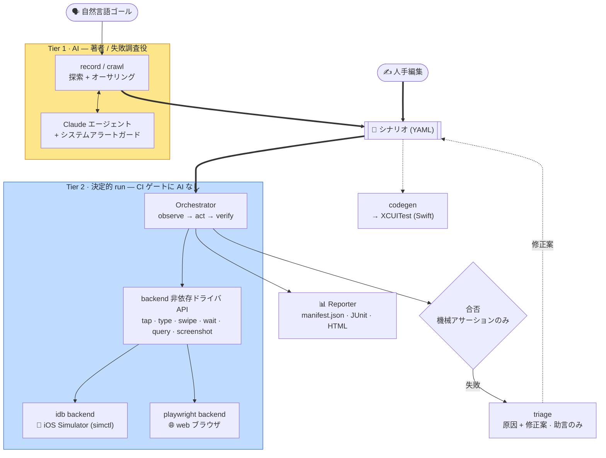

[English](README.md) · **日本語**

<p align="center">
  
</p>

# Bajutsu

> backend 非依存のドライバを土台とする自然言語駆動 E2E（端から端まで）テスト。シナリオ形式と決定的
> ランナーは 1 つで、**プラットフォームはその 1 つのインターフェースの背後の backend に過ぎません**。
> backend を差し替えれば同じシナリオが別のターゲットで動きます。今は iOS Simulator（idb）、web
> （Playwright）backend は実装済み、Android は次です。
> **ステータス: pre-alpha。** 決定的コア、AI オーサリングループ（`record` / `crawl`）、証跡
> サブシステム、XCUITest codegen、自己修復トリアージはいずれも実装・ユニットテスト済みです
> （Simulator 不要）。iOS の **idb backend** は **実機 Simulator で
> end-to-end に検証済み**で、シナリオ実行・証跡取得・triage の自己修復ループはいずれも実機で
> 動きます。**web（Playwright）backend** も第一段を実装済みで、ブラウザに対する決定的な `run` を
> Linux のゲート上で動かせます（[`demos/web`](demos/web/README.md)）。

Bajutsu は自然言語で書かれた（または記録された）テストシナリオを受け取り、アプリを操作（tap / type /
swipe / wait）して、**機械チェック可能なアサーション**で結果を検証します。1 つの継ぎ目を除いてすべてが
プラットフォーム非依存です。シナリオ形式、セレクタ解決、決定的ランナー、証跡サブシステム、レポーターは
どれもプラットフォームを名指ししません。その 1 つの継ぎ目が、UI を操作する **backend** です。ランナーを
別の backend に向ければ、同じシナリオが別のターゲットで動きます。対象は今のところ iOS Simulator（idb）と
ブラウザ（Playwright）で、次は Android です。プラットフォームを選ぶとは backend を選ぶことであり、別の
ツールへ乗り換えることではありません。

> **名前について。** *Bajutsu*（馬術）は馬を扱う技術を指す日本語です。この名前は、ツールが扱う
> テスト不安定要因（フレーキーなタイミング、非同期遷移、想定外のシステムアラート）に由来します。
> これらは **iOS Simulator** で顕著に現れます。Bajutsu は対象をシナリオ通りに決定的に操作し、毎回
> 同じ結果になるようにします。Simulator でも、同じドライバの下にあるどの backend でも同じです。

中核となる設計判断は、**LLM（大規模言語モデル）を CI（継続的インテグレーション）ゲートに
持ち込まない**ことです。

- **AI は著者と失敗時の調査役であり、判定者ではありません。** シナリオを *書く*（探索 + 記録）・
  失敗を *調べる* のは助けますが、`run` は完全に決定的で AI を含みません。合否は機械アサーションの
  みで決まります。
- **2 層構成。** Tier 1 は AI のライブ操作（探索 / オーサリング）、Tier 2 は CI 回帰向けの決定的
  ランナーです。

設計指針（日本語）は [`DESIGN.md`](DESIGN.md) にあります。実装ベースの機能別ドキュメント（英語、
日本語ミラーは [`docs/ja/`](docs/ja/README.md)）は [`docs/`](docs/README.md) にあります。

## 中核原則

- **決定性ファースト。** 固定 `sleep` は使わず、条件待機のみを使います。曖昧なセレクタは「最初の
  一致を叩く」のではなく即失敗します。各テストはクリーン環境から開始します。
- **安定セレクタ。** 非ローカライズでデータ由来の id を優先します。iOS なら `accessibilityIdentifier`、
  web なら `data-testid` です。テキストより id を選び、座標は最終手段です。
- **安定度順ラダー。** UI 操作は最も安定する手段から試します（id による semantic tap → 座標 tap → …）。
  選ぶ backend も、利用可能な中で最も安定なものにします。
- **プラットフォームは backend。** 決定的コアはプラットフォームを名指ししません。プラットフォーム固有の
  継ぎ目は `Driver` インターフェースの背後の backend（idb / playwright / …）ただ 1 つです。backend を
  足したり差し替えたりするだけで、同じシナリオ形式、ランナー、CLI が新しいプラットフォームを不変のまま
  対象にします。アプリやプラットフォームに固有の差分は config と選んだ backend にだけ置きます。
- **証跡はルール。** 「X のたびに取得」を再利用可能なルールへ正規化し、2 度目以降は AI なしで
  同じ証跡を再現します。

## アーキテクチャ



同じフローをテキストで:

```
自然言語ゴール ──(record / crawl, Tier 1 · AI)──▶ シナリオ (YAML) ◀──(人手編集)
                                                       │
                                                       ▼
   Orchestrator  ── observe → act → verify (run, Tier 2; 決定的・AI 非依存)
        │ backend 非依存ドライバ API (tap/type/swipe/wait/query/screenshot)
        ▼
   ┌─ idb backend ───────▶ 📱 iOS Simulator (simctl が boot / install / launch)
   ├─ playwright backend ─▶ 🌐 web ブラウザ
   └─ fake driver ────────▶ インメモリ（テスト / セットアップ不要のデモ）
        │
        ▼
 Evidence / Trace  →  Reporter (manifest.json + JUnit + HTML)
                                                       │
                                                       ▼
                                  codegen ──▶ 同等の XCUITest (Swift)
```

エントリポイントはシナリオ形式を共有します。`record` と `crawl`（AI オーサリング / 探索）、
`run`（決定的リプレイ）、`codegen`（ネイティブ XCUITest を出力）です。機能別の詳細は
[`docs/ja/`](docs/ja/README.md) を参照してください。

## ステータス

実装済み・テスト済み（Simulator 不要で実行できます）:

- ドライバ抽象と **セレクタ解決**（決定性の核）
- **プラットフォーム対応の backend レジストリ**。`--backend` / `backend:` は `ios` / `web` / `fake`
  を受け取り（Android `adb` は予定）、それぞれが安定度順に actuator へ展開されます
- **シナリオスキーマ**: ステップ、待機、アサーション、再利用可能なコンポーネント（`use`）、
  制御フロー（`if` / `forEach`）、変数（`extract` → `${vars.*}`）、パラメータ化（`data` / `dataFile`）、
  ネットワーク `mocks`、`network` フィルタ、`capturePolicy` 証跡ルール、`redact`。厳格検証・
  YAML ラウンドトリップ・生成された JSON Schema 付き
- **アサーション評価**（exists / value / label / count / enabled / disabled / selected / request / **visual**）
- **Tier 2 run ループ**（act → wait → verify）、インメモリ fake driver で検証
- **証跡サブシステム**: 瞬時（screenshot / elements / actionLog）、`video` / `deviceLog` の区間証跡
  （simctl）、ネットワーク観測 + `mocks`、**ビジュアルリグレッション**（baseline + `approve`）、
  `capturePolicy` トリガールール、シークレットの **redaction**
- **レポート**（`manifest.json` + JUnit XML + 自己完結のインタラクティブ HTML）
- **config 解決**（チーム既定 × アプリ別。iOS は `bundleId`、web は `baseUrl`）と **backend 選択**
  （安定度順）
- **simctl コマンド層**、**idb 出力パーサ**、**Playwright web ドライバ**（第一段）、**doctor**
  規約スコアと環境 preflight
- **AI オーサリング**: `record`（ゴール志向）と `crawl`（幅優先のスクリーンマップ）。Agent 抽象は
  2 つの backend（Anthropic API + Claude Code）を持ち、システムアラートガードを伴います
- **XCUITest codegen**（構造マッピング・テスト時 AI 不要）
- **自己修復トリアージ**（原因 + 最小修正案。助言のみ、AI は任意）
- 配線済み CLI: `run` / `doctor` / `record` / `crawl` / `codegen` / `trace` /
  `triage` / `approve` / `serve` / `mcp` / `worker` / `lint` / `schema`
- **MCP サーバ**（`bajutsu mcp`）: `run` と `doctor` を MCP ツールとして、run の証跡
  （manifest / report / JUnit / artifact）をリソースとして公開し、Claude Desktop / Code 連携に
  使えます
- **Web UI**（`bajutsu serve`）: シナリオのオーサリング（`record` / `crawl`）・編集・実行、レポートと
  あらゆる証跡の閲覧、ビジュアル baseline の承認、SSE によるジョブのライブ配信。各タブの操作方法は
  [docs/ja/web-ui.md](docs/ja/web-ui.md) を参照してください

実機 Simulator で検証済み（iPhone 17 Pro・近年の iOS）:

- idb backend の subprocess 実行（`describe-all` パース、フレーム中心の tap / text / swipe、
  simctl launch 手順）を、インストール済みの `idb` / `idb_companion` に対し `showcase` シナリオ実行・
  証跡取得・triage 自己修復ループを実機で走らせて確認済み。

ブラウザで検証済み（Linux・Mac 不要）:

- Playwright backend は [`demos/web`](demos/web/README.md) のシナリオを決定的に実行し、CI と同じ
  ゲートの中で動きます。コアがプラットフォーム非依存であることの裏付けです。リッチ寄りの web 機能
  （ネットワーク取得 / 動画 / マルチタッチ / 並列）は今後の予定です（[ロードマップ](roadmaps/README-ja.md)）。

未配線: 外部 `mockServer` コマンド（シナリオ内 `mocks` で代替済み）、Android（`adb`）と Flutter の
backend（予定）。完全な「実装済み vs 未配線」表は [`docs/ja/architecture.md`](docs/ja/architecture.md)
にあります。

## 要件

- Python 3.13（[uv](https://github.com/astral-sh/uv) で管理）。決定的コアとゲート全体は Linux を
  含むどこでも動きます。
- **iOS の場合:** macOS + Xcode（iOS Simulator）と `idb` / `idb_companion`。
- **web の場合:** Playwright の Chromium（`playwright install chromium`）が入った任意の OS。Mac は
  不要です。

## セットアップ

> **はじめての方へ。** [Getting started チュートリアル](docs/ja/getting-started.md)は一連のループを
> iOS Simulator で辿ります。**Mac がない場合は**、[web トラック](docs/ja/getting-started-web.md)が同じ
> ループをブラウザ（Playwright backend）に対してどの OS でも辿ります。Xcode も Simulator も要りません。

```bash
make setup                 # 土台: .venv（Python 3.13）+ 開発ツール + git hooks（backend なし・どこでも動く）
make install               # 土台に加えて、config が使う backend だけを導入（config 対応、BE-0164）
```

`make setup` は決定的ゲートが必要とする backend 非依存の土台です。`make install` はその上に重ねます。
`--config`（`make install ARGS="--config demos/showcase/showcase.config.yaml"` のように渡します）を読み、
`targets.*` が実際に使う backend と、AI プロバイダが設定されているかどうかを解決し、必要な pip extra と
外部ツールだけを導入します（iOS なら `idb` クライアントと `idb_companion`、web なら Playwright のブラウザ、
AI が設定されていれば `anthropic` SDK）。冪等なので再実行しても安全です。作業ディレクトリに config が
なければ、土台以外は何も導入しません。導入元の要件は単一のマッピング
（[`bajutsu/requirements.py`](bajutsu/requirements.py)）にまとまっており、`doctor` の pre-flight と共有する
ので両者がずれることはありません。

## 使い方

CLI の概要（完全リファレンスは [`docs/ja/cli.md`](docs/ja/cli.md)）:

```bash
bajutsu run    --target <name> [--scenario file.yaml]        # 既定: アプリのシナリオディレクトリ全体
bajutsu record --target <name> --goal "..." [--out file]     # AI 探索 + 記録（Tier 1・要 API キー / ログイン）
bajutsu crawl  --target <name> [--max-screens N]             # AI 幅優先クロール → スクリーンマップ（Tier 1）
bajutsu doctor --target <name>                               # 環境チェック + 現在画面の規約スコア
bajutsu codegen <scenario.yaml> --target <name> -o UITests/Foo.swift   # ネイティブ XCUITest を出力
bajutsu approve --baselines <dir> [--scenario s.yaml]     # 取得済みスクリーンショットを visual baseline に昇格
bajutsu serve  [--port 8765] [--config c.yaml]            # ローカル Web UI: オーサリング + 実行 + レポート（Tier 1）
bajutsu mcp    [--config c.yaml] [--transport stdio]      # エージェント連携用 MCP サーバ（要 `bajutsu[mcp]`）
bajutsu lint   <scenario.yaml>                            # 実行せずにシナリオを検証
bajutsu schema                                            # エディタ連携用の JSON Schema を出力
```

`trace`（完了した run の確認）・`triage`（失敗の診断）・`worker`（ホスティング backend 向けに
キュー済み run をリース）も揃っています。[CLI リファレンス](docs/ja/cli.md) を参照してください。

> `make serve`（または `scripts/serve.sh`）は `bajutsu serve` をラップし、idb backend の
> 依存を必要時に導入します。これにより、クリーンなチェックアウトでも
> `no available actuator among ['idb']` に当たりません。フラグは `make serve ARGS="--port 8766"`
> のように渡します。

アプリ別・プラットフォーム別の設定は、`--config` で渡す config ファイルに置きます。デモにはすぐ動く
ものが同梱されています（例: [`demos/showcase/showcase.config.yaml`](demos/showcase/showcase.config.yaml)、
[`demos/web/demo.config.yaml`](demos/web/demo.config.yaml)）。アプリは `bundleId` で iOS を、`baseUrl`
で web を対象にします:

```yaml
defaults:
  backend: [idb]            # 安定度順; 最初に利用可能な backend が actuator
  device: "iPhone 17 Pro"
  locale: en_US

targets:
  showcase-swiftui:         # iOS アプリ — idb 経由で Simulator を操作
    bundleId: com.bajutsu.showcase.ios.swiftui
    deeplinkScheme: showcaseswiftui
    launchEnv: { SHOWCASE_UITEST: "1" }
    idNamespaces: [stable, horse, search, log, notice, perm, sys, net]
    scenarios: demos/showcase/scenarios

  web:                      # web アプリ — Playwright 経由でブラウザを操作
    baseUrl: "http://127.0.0.1:8787/index.html"
    backend: [web]
    scenarios: demos/web/scenarios
```

## デモ

実行できるデモは、すべて 1 つのエントリポイント `make -C demos <target>` から動かせます
（[`demos/`](demos/README.md)）:

- **[tour](demos/tour/README.md)**（`make -C demos tour`）。実行 → 改変 → 診断のライフサイクル全体を
  実機 Simulator で完全に決定的に通します。**API キー不要**です。（インメモリの fake デバイスに対して
  **セットアップ不要**でも動きます: `uv run python demos/tour/tour.py`。）
- **[features](demos/showcase/README.ja.md)**（`make -C demos features`）。シナリオ著作の機能（タグ、
  パラメータ化した共有ステップ、シークレット）を実機 Simulator で示します。
- **[webui](demos/showcase/WEBUI.ja.md)**（`make -C demos webui`）。**Web UI** で Simulator を操作し、
  あらゆる証跡（スクリーンショット、動画、ログ、通信（観測 + モック）、ビジュアルリグレッション、
  システムアラート突破）をブラウザで集めます。iOS 開発者向けの目玉デモです。
- **[record](demos/showcase/README.ja.md)**（`make -C demos record`）。起動中アプリに対する本物の Claude に
  よる著作と、改変 → 自己修復（`triage`）ループです。
- **[web](demos/web/README.md)**（`make -C demos/web e2e`）。**Playwright backend** で静的な web アプリ
  に対しシナリオを実行します。Mac も Simulator も不要で、Linux で動きます。このデモを手順を追って辿る
  なら、[web getting-started トラック](docs/ja/getting-started-web.md)を参照してください。

## 開発

```bash
make check                # 完全なゲート: format + lint + 型チェック + テスト（CI と同一）
uv run pytest -q          # テストのみ（Simulator 不要）
```

作業規約は [`CLAUDE.md`](CLAUDE.md) と [`CONTRIBUTING.ja.md`](CONTRIBUTING.ja.md) を参照してください。

## プロジェクト構成

```
bajutsu/
├── drivers/              # Driver プロトコル + セレクタ解決（決定性の核）; fake / idb (iOS) / playwright (web)
├── backends.py           # プラットフォーム対応の backend レジストリ + ドライバ生成（安定度順）
├── scenario/             # シナリオスキーマ（models）, YAML ロード / ラウンドトリップ, 展開, JSON Schema
├── assertions.py         # 機械チェック可能なアサーション評価
├── interp.py             # data / vars / secrets に対する ${namespace.key} 補間
├── orchestrator/         # 決定的 Tier 2 run ループ（act → wait → verify）
├── runner/               # config + シナリオ -> レポート; デバイスプール経由
├── report/               # manifest.json + JUnit + インタラクティブ HTML
├── evidence.py           # 瞬時証跡（screenshot / elements）+ Sink
├── intervals.py          # 区間証跡（video / deviceLog）via simctl
├── network.py            # ネットワーク観測（exchange モデル + collector）
├── visual.py             # ビジュアルリグレッションの画像比較
├── redaction.py          # 取得証跡内のシークレットをマスク
├── config.py             # チーム既定 × アプリ別の解決（iOS bundleId / web baseUrl）
├── simctl.py             # simctl コマンド層（iOS 環境）
├── preflight.py          # doctor / CI 向けの環境 runnability ゲート
├── doctor.py             # 規約スコア
├── agent.py · agents.py  # オーサリング Agent 抽象 + 構築（Tier 1）
├── claude_agent.py       # SDK オーサリングエージェント（Anthropic API / Bedrock / ant）
├── record.py             # record ループ: 探索 -> シナリオ出力
├── crawl/                # 自律的な幅優先クロール -> スクリーンマップ（core + guide/tabs/report/repro/flows）
├── alerts.py             # システムアラートガード（視覚ロケータ）
├── codegen/              # シナリオ -> ネイティブテスト (XCUITest / Playwright / UI Automator)
├── trace.py              # 完了した run をテキストのタイムラインで確認
├── triage.py             # 自己修復トリアージ: 失敗 run を診断し修正案を提示
├── lint.py               # シナリオ linter + JSON Schema 生成
├── github.py             # `run` の GitHub Actions 連携
├── mcp/                  # MCP サーバ（エージェント連携用のツール + リソース）
├── serve/                # ローカル Web UI（オーサリング + 実行 + レポート; Tier 1）
├── cli/                  # CLI (typer) — コマンドごとに cli/commands/ 配下の 1 ファイル
├── dotenv.py             # 最小 .env ローダ
└── _yaml.py              # on/off を文字列のまま読む YAML ローダ
```

## ロードマップ

マイルストーン M1–M4 は完了しています。決定的ランナー、AI `record` ループ + `capturePolicy` 証跡
ルール、XCUITest codegen + CI、自己修復トリアージのいずれも実機 Simulator で検証済みです（実装済み
の範囲は上の[ステータス](#ステータス)を参照してください）。プラットフォームは 1 つのドライバインター
フェースの背後にある backend にすぎないため、同じコアが対象をまたいで動きます。**web（Playwright）
backend** は第一段を実装済みで、**Android（`adb`）** と **Flutter** を予定しています
（[`docs/ja/multi-platform.md`](docs/ja/multi-platform.md)）。

今後の優先順位付きバックログ（次に作りたいもの）は [`roadmaps/`](roadmaps/README-ja.md) にあります。

## ライセンス

このプロジェクトは [Apache License, Version 2.0](LICENSE) の下で提供されています。帰属表示については [`NOTICE`](NOTICE) を参照してください。
