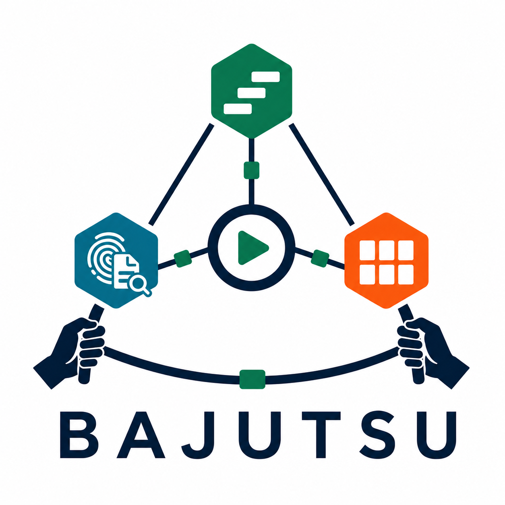

**English** · [日本語](README.ja.md)

<p align="center">
  
</p>

# Bajutsu

[](https://github.com/bajutsu-e2e/bajutsu/actions/workflows/ci.yml) [](https://github.com/bajutsu-e2e/bajutsu/actions/workflows/ios-e2e.yml) [](https://github.com/bajutsu-e2e/bajutsu/actions/workflows/web-e2e.yml) [](https://github.com/bajutsu-e2e/bajutsu/actions/workflows/android-e2e.yml)

> Natural-language-driven E2E (end-to-end) testing built on a **backend-agnostic driver**: one
> scenario format and one deterministic runner, where **a platform is a backend** behind that
> one interface. Swap the backend and the same scenarios run on a different target — the iOS
> Simulator (XCUITest), a web (Playwright) backend, and an Android (adb) backend are all
> landed, with Flutter next.
> **Status: pre-alpha.** The deterministic core, the AI authoring loop (`record` / `crawl`),
> the evidence subsystem, codegen, and self-healing triage are all implemented and
> unit-tested (no Simulator needed). The iOS **XCUITest backend** is **validated
> end-to-end on a real Simulator** — scenarios, evidence capture, and the triage self-heal loop
> all run on-device. The **web (Playwright) backend** runs a deterministic `run` against a
> browser on the Linux gate ([`demos/web`](demos/web/README.md)), and the **Android (adb)
> backend** is validated end-to-end on an emulator ([`android-e2e.yml`](.github/workflows/android-e2e.yml)).

Bajutsu takes test scenarios written in (or recorded from) natural language, drives your app —
taps / text / swipes / waits — and verifies the result with **machine-checkable assertions**.
Everything but one seam is platform-neutral: the scenario format, selector resolution, the
deterministic runner, the evidence subsystem, and the reporter never name a platform. That one seam
is the **backend** — the driver that actuates the UI. Point the runner at a different backend and
the same scenario runs on a different target: the **iOS Simulator** (XCUITest), a **browser**
(Playwright), or **Android** (adb), with **Flutter** next. Choosing a platform is choosing a
backend, not adopting a different tool.

> **The name.** *Bajutsu* (馬術) is Japanese for *horsemanship / equestrianism*. The name
> refers to the sources of test instability the tool tames — flaky timing, async transitions,
> and unexpected system alerts on the **iOS Simulator**. Bajutsu drives the target
> deterministically through a scenario so that each run produces the same result — on the
> Simulator, and on every backend behind the same driver.

The central design decision is to keep the LLM (large language model) out of the CI
(continuous integration) gate:

- **AI is the author and the failure investigator, never the judge.** It helps *write*
  scenarios (explore + record) and *investigate* failures, but a `run` is fully
  deterministic with no AI involved — pass/fail comes only from machine assertions.
- **Two tiers.** Tier 1 = AI live operation (exploration / authoring). Tier 2 = a
  deterministic runner for CI regression.

Design rationale (in Japanese) lives in [`DESIGN.md`](DESIGN.md). Implementation-grounded,
per-feature documentation lives in [`docs/`](docs/README.md) — English, with a Japanese mirror
under [`docs/ja/`](docs/ja/README.md).

## Core principles

- **Determinism first.** No fixed `sleep` (condition waits only); an ambiguous selector
  fails immediately instead of "tapping whatever matched first"; each test starts from a
  clean environment.
- **Stable selectors.** Prefer a non-localized, data-derived id — `accessibilityIdentifier`
  on iOS, `data-testid` on the web — over text; coordinates are the last resort.
- **Stability ladder.** Bajutsu attempts UI actions most-stable-first (semantic tap by id →
  coordinate tap → … ), and the chosen backend is the most stable one available.
- **A platform is a backend.** The deterministic core names no platform; the one platform-specific
  seam is the **backend** (xcuitest / playwright / …) behind the `Driver` interface. Add or swap a
  backend and the same scenario format, runner, and CLI target a new platform unchanged —
  per-target and per-platform differences live only in config and the chosen backend.
- **Evidence as rules.** "Capture on every X" is normalized into reusable rules so the
  second run reproduces the same evidence without AI.

## Architecture


Entry points share the scenario format: `record` and `crawl` (AI authoring / exploration),
`run` (deterministic replay), and `codegen` (emit a native test). The full breakdown — module
list, dependency layers, and the editable mermaid source — is in
[docs/architecture.md](docs/architecture.md); see [`docs/`](docs/README.md) for the per-feature
breakdown.

## Status

Implemented and covered by tests (run without a Simulator):

- Driver abstraction and **selector resolution** (the determinism core)
- **Platform-aware backend registry** — `--backend` / `backend:` accept `ios` / `android` / `web` /
  `fake`, each expanding to its actuator in stability order
- **Scenario schema**: steps, waits, assertions, reusable components (`use`), control flow
  (`if` / `forEach`), variables (`extract` → `${vars.*}`), parametrization (`data` / `dataFile`),
  network `mocks`, a `network` filter, `capturePolicy` evidence rules, and `redact` — with
  strict validation, YAML round-trip, and a generated JSON Schema
- **Assertion evaluation** (exists / value / label / count / enabled / disabled / selected /
  request / **visual**)
- **Tier 2 run loop** (act → wait → verify), tested via an in-memory fake driver
- **Evidence subsystem**: instant captures (screenshot / elements / actionLog), `video` /
  `deviceLog` interval captures (simctl), network observation + `mocks`, **visual regression**
  (baselines + `approve`), `capturePolicy` trigger rules, and secret **redaction**
- **Reporting** (`manifest.json` + JUnit XML + self-contained interactive HTML)
- **Config resolution** (team defaults × per-target; iOS `bundleId` or web `baseUrl`) and
  **backend selection** (stability order)
- **simctl command layer**, the **XCUITest channel** (the resident runner's `/elements` snapshot), the **Playwright web driver**, the **adb driver**
  (`uiautomator dump` parsing), and the **doctor** convention score + environment preflight
- **AI authoring**: `record` (goal-directed) and `crawl` (breadth-first screen map) — the Agent
  abstraction with two backends (Anthropic API + Claude Code) + system-alert guard
- **Codegen**: scenario → native test, three targets — XCUITest (Swift, iOS), Playwright
  (TypeScript, web), UI Automator (Kotlin, Android); structural mapping, no AI at test time
- **Self-healing triage** (root cause + minimal-fix suggestions; advisory, AI optional)
- The wired CLI: `run` / `doctor` / `record` / `crawl` / `codegen` / `trace` /
  `triage` / `approve` / `serve` / `mcp` / `worker` / `lint` / `schema`
- **MCP server** (`bajutsu mcp`): exposes `run` and `doctor` as MCP tools and run evidence
  (manifest / report / JUnit / artifacts) as resources, for Claude Desktop / Code integration
- **Web UI** (`bajutsu serve`): author (`record` / `crawl`), edit, and run scenarios; browse
  reports and every evidence type; approve visual baselines; live job streaming over SSE. How to
  drive each tab: [docs/web-ui.md](docs/web-ui.md)

Validated on a real Simulator (iPhone 17 Pro, recent iOS):

- The XCUITest backend — the resident runner's `/elements` snapshot of the XCTest automation
  tree, semantic tap / text / multi-touch / text selection driven by bundle id, and the simctl
  launch sequencing — confirmed by running the `showcase` scenarios, evidence capture, and the
  triage self-heal loop on-device via the XCUITest runner (built from the repo with Xcode's
  `xcodebuild`).

Validated in a browser (Linux, no Mac):

- The Playwright backend runs the [`demos/web`](demos/web/README.md) scenarios deterministically
  inside the same gate as CI — proving the core is platform-neutral, including the richer web-only
  capabilities (network capture / video / multi-touch / parallel).

Validated on an Android emulator (Linux, no Mac):

- The adb backend's `uiautomator dump` parsing, frame-center tap, and launch sequencing —
  actuation-fidelity parity with XCUITest — are confirmed against a booted emulator (API 34, under KVM)
  in [`android-e2e.yml`](.github/workflows/android-e2e.yml), driving the same shared scenarios
  XCUITest runs.

Not yet wired: the external `mockServer` command (superseded by in-scenario `mocks`); the
Flutter backend (planned). See
[`docs/architecture.md`](docs/architecture.md) for the full implemented-vs-unwired table.

## Requirements

- Python 3.13 (managed via [uv](https://github.com/astral-sh/uv)) — the deterministic core and
  the whole gate run anywhere, Linux included
- **For iOS:** macOS with Xcode (the iOS Simulator and `xcodebuild`) — the XCUITest runner builds from the repo
- **For web:** any OS with Playwright's Chromium (`playwright install chromium`) — no Mac needed

## Setup

> **New here?** The [Getting started tutorial](docs/getting-started/index.md) walks the whole loop on an
> iOS Simulator. **No Mac?** The [web track](docs/getting-started/web.md) does the same loop against
> a browser (Playwright backend) on any OS — no Xcode or Simulator.

```bash
make setup                 # base: .venv (Python 3.13) + dev tools + git hooks (no backend, runs anywhere)
make install               # base PLUS exactly the backends your config needs (config-aware, BE-0164)
```

`make setup` is the config-agnostic floor the deterministic gate needs. `make install` builds on it:
it reads your `--config` (pass one via `make install ARGS="--config demos/showcase/showcase.config.yaml"`),
resolves which backends its `targets.*` actually use plus whether an AI provider is configured, and
installs only those pip extras and external tools (the XCUITest runner built via Xcode's
`xcodebuild` for iOS, Playwright's browser for web, the `anthropic` SDK when AI is configured) — idempotently, so it is
safe to re-run. With no config in the working directory it installs nothing beyond the base. The
requirements it draws from live in one mapping ([`bajutsu/requirements.py`](bajutsu/requirements.py)),
shared with `doctor`'s pre-flight so the two never drift.

Installing from PyPI instead? The base package is AI-free: `pip install bajutsu` gets the
deterministic authoring / running paths with no AI SDK, and `pip install bajutsu[ai]` (or
`bajutsu[bedrock]`) adds the SDK for the Claude paths — see
[What uses Claude](docs/ai-boundary.md#installing-the-claude-paths).

## Usage

The CLI surface (full reference in [`docs/cli.md`](docs/cli.md)):

```bash
bajutsu run    --target <name> [--scenario file.yaml]        # default: the app's whole scenarios dir
bajutsu record --target <name> --goal "..." [--out file]     # AI explore + record (Tier 1, needs API key/login)
bajutsu crawl  --target <name> [--max-screens N]             # AI breadth-first crawl → screen map (Tier 1)
bajutsu doctor --target <name>                               # environment + convention score for the current screen
bajutsu codegen <scenario.yaml> --target <name> -o UITests/Foo.swift   # emit a native XCUITest
bajutsu approve --baselines <dir> [--scenario s.yaml]     # promote captured screenshots to visual baselines
bajutsu serve  [--port 8765] [--config c.yaml]            # local web UI: author + run + reports (Tier 1)
bajutsu mcp    [--config c.yaml] [--transport stdio]      # MCP server for agent integration (needs `bajutsu[mcp]`)
bajutsu lint   <scenario.yaml>                            # validate a scenario without running it
bajutsu schema                                            # print the JSON Schema for editor integration
```

`trace` (inspect a finished run), `triage` (diagnose a failure), and `worker` (lease queued runs
for the hosted backend) round out the set — see the [CLI reference](docs/cli.md).

> `make serve` (or `scripts/serve.sh`) wraps `bajutsu serve` and installs the configured
> backend's dependencies on demand, so a fresh checkout will not hit
> `no available actuator among ['xcuitest']`. Pass flags via `make serve ARGS="--port 8766"`.

Per-app (and per-platform) settings live in a config file you pass with `--config`; the demos
ship ready-to-run ones (e.g. [`demos/showcase/showcase.config.yaml`](demos/showcase/showcase.config.yaml),
[`demos/web/demo.config.yaml`](demos/web/demo.config.yaml)). An app targets iOS by `bundleId` or
the web by `baseUrl`:

```yaml
defaults:
  backend: [ios]            # stability order; first available backend is the actuator
  device: "iPhone 17 Pro"
  locale: en_US

targets:
  showcase-swiftui:         # iOS app — driven on the Simulator via XCUITest
    bundleId: com.bajutsu.showcase.ios.swiftui
    deeplinkScheme: showcaseswiftui
    launchEnv: { SHOWCASE_UITEST: "1" }
    idNamespaces: [stable, horse, search, log, notice, perm, sys, net]
    scenarios: demos/showcase/scenarios

  web:                      # web app — driven in a browser via Playwright
    baseUrl: "http://127.0.0.1:8787/index.html"
    backend: [web]
    scenarios: demos/web/scenarios
```

## Demos

Runnable demos, all through one entry point — `make -C demos <target>` ([`demos/`](demos/README.md)):

- **[tour](demos/tour/README.md)** — `make -C demos tour`. The whole lifecycle (run → modify →
  diagnose) on a real Simulator, fully deterministic, **no API key**. (It also runs against an
  in-memory fake device with **zero setup**: `uv run python demos/tour/tour.py`.)
- **[features](demos/showcase/README.md)** — `make -C demos features`. The scenario-authoring
  features (tags, parameterized shared steps, secrets) on a real Simulator.
- **[webui](demos/showcase/WEBUI.md)** — `make -C demos webui`. The **Web UI** driving a Simulator
  and collecting every evidence type: screenshots, video, logs, network (observed + mocked),
  visual regression, system-alert handling. The headline demo for iOS developers.
- **[record](demos/showcase/README.md)** — `make -C demos record`. AI authoring with real Claude on
  a booted app, then the modify-and-self-heal (`triage`) loop.
- **[web](demos/web/README.md)** — `make -C demos/web e2e`. The **Playwright backend** running
  scenarios against a static web app — no Mac or Simulator, runs on Linux. For a step-by-step
  walkthrough of this demo, see the [web getting-started track](docs/getting-started/web.md).

## Development

```bash
make check                # the full gate: format + lint + typecheck + tests (mirrors CI exactly)
uv run pytest -q          # just the tests (no Simulator)
```

See [`CLAUDE.md`](CLAUDE.md) and [`CONTRIBUTING.md`](CONTRIBUTING.md) for the working agreement.

## Project layout

```
bajutsu/
├── drivers/              # Driver protocol + selector resolution (determinism core); fake / xcuitest (iOS) / playwright (web) / adb (Android)
├── backends.py           # platform-aware backend registry + driver construction (stability order)
├── scenario/             # scenario schema (models), YAML load/round-trip, expansion, JSON Schema
├── assertions.py         # machine-checkable assertion evaluation
├── interp.py             # ${namespace.key} interpolation over data / vars / secrets
├── orchestrator/         # deterministic Tier 2 run loop (act → wait → verify)
├── runner/               # config + scenarios -> report via a device pool
├── report/               # manifest.json + JUnit + interactive HTML
├── evidence/              # instant capture (core), interval capture (intervals) via simctl, network
│                          #   observation, visual-regression comparison, golden element-tree comparison,
│                          #   secret redaction
├── analysis/              # read-only advisory analysis: coverage, determinism audit, run-stats
├── config.py             # team defaults × per-target resolution (iOS bundleId / web baseUrl)
├── simctl.py             # simctl command layer (iOS environment)
├── preflight.py          # environment runnability gate for doctor / CI
├── doctor.py             # convention score
├── agents/                # AI/agent periphery: protocols + factory, the Claude authoring/enrich/triage
│                          #   agents + their shared claude_backed base, ai_config/anthropic_client,
│                          #   availability, enrich loop, alert guard
├── record.py             # record loop: explore -> emit a scenario
├── crawl/                # autonomous breadth-first crawl -> screen map (core + guide/tabs/report/repro/flows)
├── analytics/             # token/cost accounting: usage, the attributed ledger, the usage dashboard
├── codegen/               # scenario -> native tests (XCUITest / Playwright / UI Automator)
├── trace.py              # inspect a finished run as a text timeline
├── triage.py             # self-healing triage: diagnose a failed run, propose a fix
├── lint.py               # scenario linter + JSON Schema generation
├── github/               # GitHub integration: actions (CI annotations), app (App install token), errors
├── mcp/                  # MCP server (tools + resources for agent integration)
├── serve/                # local web UI (author + run + reports; Tier 1)
├── cli/                  # CLI (typer) — one file per command under cli/commands/
├── dotenv.py             # minimal .env loader
└── _yaml.py              # YAML loader (keeps on/off as strings)
```

## Roadmap

Milestones M1–M4 are complete — the deterministic runner, the AI `record` loop + `capturePolicy`
evidence rules, codegen + CI, and self-healing triage — all validated on a real
Simulator (see [Status](#status) above for the implemented surface). Because a platform is just a
backend behind the one driver interface, the same core spans targets: the **web (Playwright)** and
**Android (`adb`)** backends have both landed, with **Flutter** planned
(see [`docs/vision.md`](docs/vision.md#1-reach--more-platforms-and-surfaces)).

The forward-looking, prioritized backlog (what we want to build next) lives in
[`roadmaps/`](roadmaps/README.md).

## License

Licensed under the [Apache License, Version 2.0](LICENSE). See [`NOTICE`](NOTICE) for attribution.
