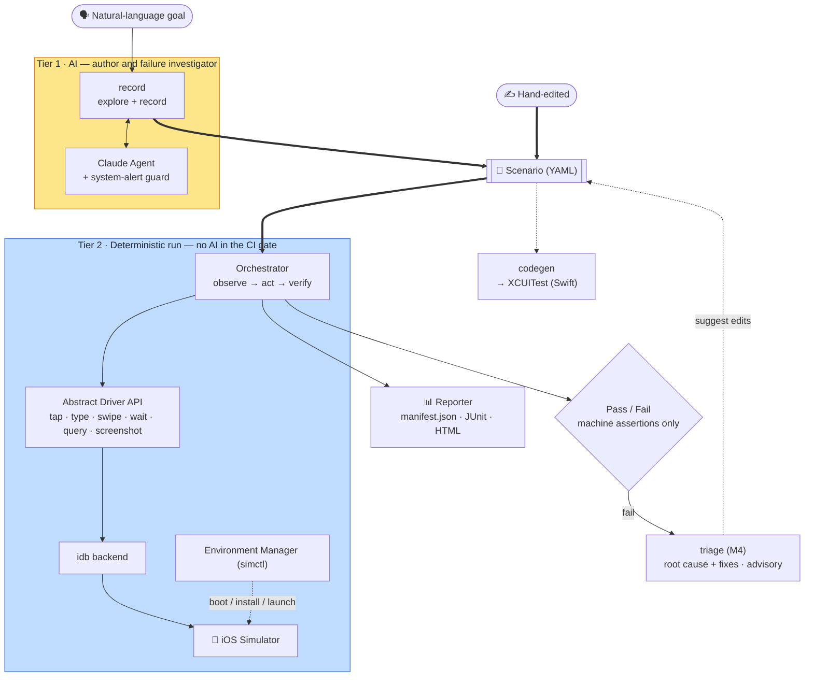

**English** · [日本語](README.ja.md)

<p align="center">
  
</p>

# Bajutsu

> Natural-language-driven E2E (end-to-end) testing for iOS Simulators.
> **Status: pre-alpha** — the deterministic core, the AI authoring loop (`record`), the
> evidence subsystem, XCUITest codegen, and self-healing triage are all implemented and
> unit-tested, and the idb backend is **validated end-to-end on a real Simulator**: scenarios,
> evidence capture, and the triage self-heal loop all run on-device.

Bajutsu takes test scenarios written in (or recorded from) natural language and runs
them against an app on the iOS Simulator: it performs taps / typing / swipes / waits and
verifies the result with **machine-checkable assertions**.

> **The name.** *Bajutsu* (馬術) is Japanese for *horsemanship / equestrianism*. The
> name refers to the sources of test instability that the tool addresses on the **iOS
> Simulator**: flaky timing, async transitions, and unexpected system alerts. Bajutsu
> drives the Simulator through a scenario deterministically so that each run produces the
> same result.

The central design decision is to keep the LLM (large language model) out of the CI
(continuous integration) gate:

- **AI is the author and the failure investigator, never the judge.** It helps *write*
  scenarios (explore + record) and *investigate* failures, but a `run` is fully
  deterministic with no AI involved — pass/fail comes only from machine assertions.
- **Two tiers.** Tier 1 = AI live operation (exploration / authoring). Tier 2 = a
  deterministic runner for CI regression.

Design rationale (in Japanese) lives in [`DESIGN.md`](DESIGN.md). Implementation-grounded,
per-feature documentation lives in [`docs/`](docs/README.md) — English, with a Japanese mirror
under [`docs/ja/`](docs/ja/README.md).

## Core principles

- **Determinism first.** No fixed `sleep` (condition waits only); an ambiguous selector
  fails immediately instead of "tapping whatever matched first"; each test starts from a
  clean environment.
- **Stable selectors.** Prefer `accessibilityIdentifier` (non-localized, data-derived);
  coordinates are the last resort.
- **Stability ladder.** UI actions are attempted most-stable-first (semantic tap by id →
  coordinate tap → … ), and the chosen backend is the most stable one available.
- **App-agnostic tool.** Per-app differences live entirely in config (`apps.<name>`); the
  tool, drivers, and runner stay unchanged across apps.
- **Evidence as rules.** "Capture on every X" is normalized into reusable rules so the
  second run reproduces the same evidence without AI.

## Architecture



The same flow as text:

```
Natural-language goal ──(record, Tier 1 / AI)──▶ Scenario (YAML) ◀──(hand-edited)
                                                       │
                                                       ▼
   Orchestrator  ── observe → act → verify (run, Tier 2; deterministic, no AI)
        │ abstract driver API (tap/type/swipe/wait/query/screenshot)
        ▼
 idb backend   ← unified behind one Driver interface (fake driver for tests)
        │
        ▼
 Environment Manager (simctl)  +  Mock Server (deterministic network; planned)
        │
        ▼
 Evidence/Trace  →  Reporter (manifest.json + JUnit + HTML)
                                                       │
                                                       ▼
                                  codegen ──▶ equivalent XCUITest (Swift)
```

Three entry points share the scenario format: `record` (AI authoring), `run` (deterministic
replay), and `codegen` (emit a native XCUITest). See [`docs/`](docs/README.md) for the per-feature
breakdown.

## Status

Implemented and covered by tests (405 unit tests, run without a Simulator):

- Driver abstraction and **selector resolution** (the determinism core)
- **Scenario schema** (steps, waits, assertions) with strict validation + YAML round-trip
- **Assertion evaluation** (exists / value / label / count / enabled / disabled / selected / request)
- **Tier 2 run loop** (act → wait → verify), tested via an in-memory fake driver
- **Evidence subsystem**: instant captures (screenshot / elements), `video` / `deviceLog`
  interval captures (simctl), and `capturePolicy` trigger rules
- **Reporting** (`manifest.json` + JUnit XML + self-contained HTML)
- **Config resolution** (team defaults × per-app) and **backend selection** (stability order)
- **simctl command layer**, **idb output parsers**, and the **doctor** convention score
- **AI authoring loop** (`record`): Agent abstraction + Claude implementation + system-alert guard
- **XCUITest codegen** (structural mapping; no AI at test time)
- The wired CLI: `run` / `doctor` / `record` / `codegen` / `trace` / `triage` / `serve` / `mcp` / `lint` / `schema`
- **MCP server** (`bajutsu mcp`): exposes `run` and `doctor` as MCP tools + run evidence as resources, for Claude Desktop / Code agent integration

Validated on a real Simulator (iPhone 17 Pro, recent iOS):

- The idb backend's subprocess execution — `describe-all` parsing, frame-center
  tap / text / swipe, and the simctl launch sequencing — confirmed against the installed
  `idb` / `idb_companion` by running the `sample` scenarios, evidence capture, and the
  triage self-heal loop on-device.

Not yet wired: the external `mockServer` command (superseded by scenario `mocks`). See
[`docs/architecture.md`](docs/architecture.md) for the full implemented-vs-unwired table.

## Requirements

- macOS with Xcode (for the iOS Simulator) — required to drive a device
- Python 3.13 (managed via [uv](https://github.com/astral-sh/uv))

## Setup

```bash
uv sync --extra dev      # creates .venv (Python 3.13) and installs deps + dev tools
```

## Usage

The CLI surface (full reference in [`docs/cli.md`](docs/cli.md)):

```bash
bajutsu run    --app <name> [--scenario file.yaml]        # default: the app's whole scenarios dir
bajutsu record --app <name> --goal "..." [--out file]     # explore + record (Tier 1, needs API key)
bajutsu doctor --app <name>                               # convention score for the current screen
bajutsu codegen <scenario.yaml> --app <name> -o UITests/Foo.swift   # emit a native XCUITest
bajutsu serve  [--port 8765] [--config c.yaml]            # local web UI: run scenarios + view reports (Tier 1)
bajutsu mcp    [--config c.yaml] [--transport stdio]      # MCP server for agent integration (needs `bajutsu[mcp]`)
bajutsu lint   <scenario.yaml>                            # validate a scenario without running it
bajutsu schema                                            # print the JSON Schema for editor integration
```

> `make serve` (or `scripts/serve.sh`) wraps `bajutsu serve` and installs the idb
> backend's dependencies on demand, so a fresh checkout won't hit
> `no available actuator among ['idb']`. Pass flags via `make serve ARGS="--port 8766"`.

Per-app settings live in `bajutsu.config.yaml` (the repo ships the `sample` app, below):

```yaml
defaults:
  backend: [idb]   # UI-stability order; first available is the actuator
  device: "iPhone 15"
  locale: en_US

apps:
  sample:
    bundleId: com.bajutsu.sample
    deeplinkScheme: bajutsusample
    launchEnv: { SAMPLE_UITEST: "1" }
    idNamespaces: [home, list, counter, settings, onboarding, auth, nav, comp, ctrl, text, lists]
```

## Demos

Three runnable demos, ordered by setup ([`demos/`](demos/README.md)):

- **[tour](demos/tour/README.md)** — `uv run python demos/tour/tour.py`. The whole lifecycle
  (author → run → modify → diagnose) on the real pipeline, with **zero setup**: no Simulator,
  no idb, no API key. The 60-second first look.
- **[features](demos/features/WEBUI.md)** — `make -C demos/features serve`. The **Web UI** tour:
  drive a real Simulator and browse every evidence type (screenshots, video, logs, network,
  visual regression, system-alert handling). The headline demo for iOS developers.
- **[record](demos/record/README.md)** — `./demos/record/demo.sh`. AI authoring with real
  Claude on a booted app, then the modify-and-self-heal (`triage`) loop.

## Development

```bash
uv run pytest -q          # tests
uv run ruff check .       # lint
uv run mypy bajutsu      # type check (strict)
```

## Project layout

```
bajutsu/
├── drivers/base.py        # Driver protocol + selector resolution (determinism core)
├── drivers/fake.py        # in-memory fake driver for tests
├── drivers/idb.py         # idb backend (headless, frame-center coordinate tap)
├── scenario.py            # scenario schema + YAML round-trip
├── assertions.py          # machine-checkable assertion evaluation
├── orchestrator.py        # deterministic Tier 2 run loop
├── runner.py              # config + scenarios -> report; device factory
├── report.py              # manifest.json + JUnit + HTML
├── evidence.py            # capture: instant (screenshot / elements) + Sinks
├── intervals.py           # interval capture (video / deviceLog) via simctl
├── config.py              # team defaults × per-app resolution
├── backends.py            # backend selection + driver construction
├── env.py                 # simctl command layer
├── doctor.py              # convention score
├── agent.py               # authoring Agent abstraction (Tier 1)
├── claude_agent.py        # Claude-backed Agent (forced tool use, prompt cache)
├── record.py              # record loop: explore -> emit a scenario
├── alerts.py              # system-alert guard (vision locator)
├── codegen.py             # scenario -> XCUITest (Swift)
├── lint.py                # scenario linter + JSON Schema generation
├── mcp/                   # MCP server (tools + resources for agent integration)
├── dotenv.py              # minimal .env loader
├── _yaml.py               # YAML loader (keeps on/off as strings)
└── cli.py                 # CLI (typer)
```

## Roadmap

Milestones M1–M4 are complete — the deterministic runner, the AI `record` loop + `capturePolicy`
evidence rules, XCUITest codegen + CI, and self-healing triage — all validated on a real
Simulator (see [Status](#status) above for the implemented surface).

The forward-looking, prioritized backlog (what we want to build next) lives in
[`roadmaps/`](roadmaps/README.md).
