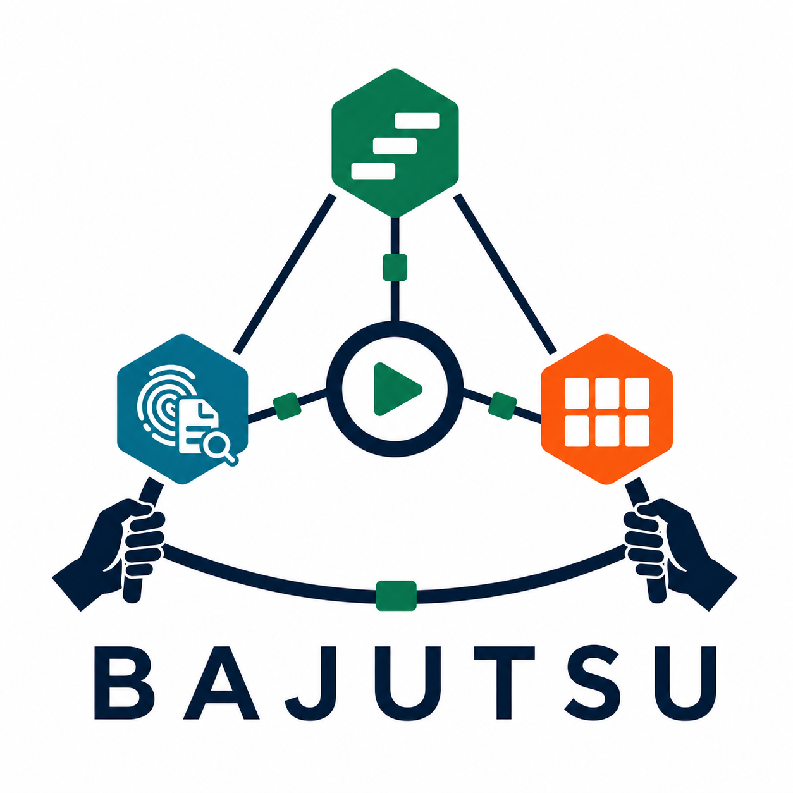

**English** · [日本語](README.ja.md)

<p align="center">
  
</p>

# Bajutsu

[](https://github.com/bajutsu-e2e/bajutsu/actions/workflows/ci.yml) [](https://github.com/bajutsu-e2e/bajutsu/actions/workflows/ios-e2e.yml) [](https://github.com/bajutsu-e2e/bajutsu/actions/workflows/web-e2e.yml) [](https://github.com/bajutsu-e2e/bajutsu/actions/workflows/android-e2e.yml) [](https://github.com/bajutsu-e2e/bajutsu/actions/workflows/serve-db.yml)

> Natural-language-driven E2E (end-to-end) testing built on a **backend-agnostic driver**: one
> scenario format and one deterministic runner, where **a platform is a backend** behind that
> one interface. Swap the backend and the same scenarios run on a different target — the iOS
> Simulator (XCUITest), a web (Playwright) backend, and an Android (adb) backend are all
> landed; Flutter apps run on those same iOS/Android backends unchanged, needing no new backend
> ([BE-0008](roadmaps/BE-0008-flutter-support/BE-0008-flutter-support.md)).
> **Status: pre-alpha.** The deterministic core, the AI authoring loop (`record` / `crawl`),
> the evidence subsystem, codegen, and self-healing triage are all implemented and
> unit-tested (no Simulator needed). The iOS **XCUITest backend** is **validated
> end-to-end on a real Simulator** — scenarios, evidence capture, and the triage self-heal loop
> all run on-device. The **web (Playwright) backend** runs a deterministic `run` against a
> browser on the Linux gate ([`demos/web`](demos/web/README.md)), and the **Android (adb)
> backend** is validated end-to-end on an emulator ([`android-e2e.yml`](.github/workflows/android-e2e.yml)).
> A hosted **server backend** — a hostable control plane plus Mac and Linux workers, for teams
> that want `serve` shared instead of local — has also landed
> ([`docs/self-hosting.md`](docs/self-hosting.md)).

Bajutsu takes test scenarios written in (or recorded from) natural language, drives your app —
taps / text / swipes / waits — and verifies the result with **machine-checkable assertions**.
Everything but one seam is platform-neutral: the scenario format, selector resolution, the
deterministic runner, the evidence subsystem, and the reporter never name a platform. That one seam
is the **backend** — the driver that actuates the UI. Point the runner at a different backend and
the same scenario runs on a different target: the **iOS Simulator** (XCUITest), a **browser**
(Playwright), or **Android** (adb). **Flutter** apps ride those same iOS/Android backends
unchanged, needing no new backend. Choosing a platform is choosing a backend, not adopting a
different tool.

> **The name.** *Bajutsu* (馬術) is Japanese for *horsemanship / equestrianism*. The name
> refers to the sources of test instability the tool tames — flaky timing, async transitions,
> and unexpected system alerts on the **iOS Simulator**. Bajutsu drives the target
> deterministically through a scenario so that each run produces the same result — on the
> Simulator, and on every backend behind the same driver.

The central design decision is to keep the LLM (large language model) out of the CI
(continuous integration) gate:

- **AI is the author and the failure investigator, never the judge.** It helps *write*
  scenarios (explore + record) and *investigate* failures, but a `run` is fully
  deterministic with no AI involved — pass/fail comes only from machine assertions.
- **Two tiers.** Tier 1 = AI live operation (exploration / authoring). Tier 2 = a
  deterministic runner for CI regression.

Design rationale (in Japanese) lives in [`DESIGN.md`](DESIGN.md). Implementation-grounded,
per-feature documentation lives in [`docs/`](docs/README.md) — English, with a Japanese mirror
under [`docs/ja/`](docs/ja/README.md).

## Core principles

- **Determinism first.** No fixed `sleep` (condition waits only); an ambiguous selector
  fails immediately instead of "tapping whatever matched first"; each test starts from a
  clean environment.
- **Stable selectors.** Prefer a non-localized, data-derived id — `accessibilityIdentifier`
  on iOS, `data-testid` on the web — over text; coordinates are the last resort.
- **Stability ladder.** Bajutsu attempts UI actions most-stable-first (semantic tap by id →
  coordinate tap → … ), and the chosen backend is the most stable one available.
- **A platform is a backend.** The deterministic core names no platform; the one platform-specific
  seam is the **backend** (xcuitest / playwright / adb / …) behind the `Driver` interface. Add or
  swap a backend and the same scenario format, runner, and CLI target a new platform unchanged —
  per-target and per-platform differences live only in config and the chosen backend.
- **Evidence as rules.** "Capture on every X" is normalized into reusable rules so the
  second run reproduces the same evidence without AI.

## Architecture


Entry points share the scenario format: `record` and `crawl` (AI authoring / exploration),
`run` (deterministic replay), and `codegen` (emit a native test). The deterministic core —
selector resolution, the orchestrator, evidence, config, and reporting — lives under
[`bajutsu/common/`](bajutsu/common). The hosted control plane and the local web UI that can invoke
it live under [`bajutsu/serve/`](bajutsu/serve). An import-linter contract keeps the two apart, so
the core never depends on the hosting layer. The module list, the dependency layers, and the
editable mermaid source are all in [docs/architecture.md](docs/architecture.md); the per-feature
breakdown is in [`docs/`](docs/README.md).

## Status

Implemented and covered by tests (run without a Simulator):

- Driver abstraction and **selector resolution** (the determinism core)
- **Platform-aware backend registry** — `--backend` / `backend:` accept `ios` / `android` / `web` /
  `fake`, each expanding to its actuator in stability order (`ios` expands to `xcuitest`, the sole
  iOS actuator since idb was retired)
- **Scenario schema**: steps — tap / type / swipe / drag / scroll / double-tap / pinch / rotate /
  `web` for WebView content / device control / `http` / `totp` / `email` / `generate` / `manual` —
  waits, mid-step `assert`, reusable components (`use`), control flow (`if` / `forEach`), variables
  (`extract` → `${vars.*}`), parametrization (`data` / `dataFile`), `preconditions`, `permissions`,
  `interrupts`, `systemAlertHandling`, network `mocks`, a `network` filter, `capturePolicy` evidence
  rules, and `redact` — with strict validation, YAML round-trip, and a generated JSON Schema
- **Assertion evaluation** (exists / value / label / count / enabled / disabled / selected /
  request / requestSequence / event / responseSchema / clipboard / golden / **visual**)
- **Tier 2 run loop** (act → wait → verify), tested via an in-memory fake driver
- **Evidence subsystem**: instant captures (screenshot / elements / actionLog), `video` /
  `deviceLog` / `appTrace` interval captures, network observation + `mocks`, **visual regression**
  (baselines + `approve`), a golden element-tree comparison, `capturePolicy` trigger rules, and
  secret **redaction**
- **Reporting** (`manifest.json` + JUnit XML + CTRF JSON + self-contained interactive HTML)
- **Config resolution** (team defaults × per-target; iOS `bundleId` or web `baseUrl`) and
  **backend selection** (stability order)
- The **backend command layer** (simctl for iOS, adb for Android), the **XCUITest channel** (the
  resident runner's element snapshot), the **Playwright web driver**, the **adb driver**
  (a resident UI Automator server, with a `uiautomator dump` fallback), and the **doctor**
  convention score + environment preflight
- **Advisory analysis** (never gates CI): `audit` (static/observed determinism score), `coverage`
  (id-namespace coverage map), `impact` (test-impact analysis from a `git diff`), `flakiness`
  (cross-run flaky-scenario ranking), and `stats` (a run-history dashboard)
- **AI authoring**: `record` (goal-directed) and `crawl` (deterministic breadth-first screen map,
  with an AI-assisted `guide`/`tabs` fallback) — a vendor-neutral `AiBackend` seam with five
  providers (Anthropic API, Amazon Bedrock, the Anthropic CLI, the Claude Code CLI, or `none` to
  disable AI entirely) + system-alert guard
- **Codegen**: scenario → native test, three targets — XCUITest (Swift, iOS), Playwright
  (TypeScript, web), UI Automator (Kotlin, Android); structural mapping, no AI at test time
- **Self-healing triage**: a rule-based heuristic agent by default, or `--ai` for a Claude-backed
  agent — root cause + minimal-fix suggestions; advisory, off the CI path
- The wired CLI: `run` / `doctor` / `audit` / `coverage` / `impact` / `stats` / `flakiness` /
  `export` / `trace` / `report` / `triage` / `record` / `crawl` / `repl` / `codegen` / `approve` /
  `serve` / `mcp` / `worker` / `lint` / `schema`
- **MCP server** (`bajutsu mcp`): exposes `run` and `doctor` as MCP tools and run evidence
  (manifest / report / JUnit / artifacts) as resources, for Claude Desktop / Code integration
- **Web UI** (`bajutsu serve`): author (`record` / `crawl`), edit, and run scenarios; browse
  reports and every evidence type; approve visual baselines; live job streaming over SSE; usage,
  flakiness, and coverage dashboards. How to drive each tab:
  [docs/web-ui.md](docs/web-ui.md)
- **Hosted server backend** (`serve --backend server`, `bajutsu worker`): a self-hostable control
  plane — FastAPI, Postgres, S3-compatible object storage, GitHub OAuth login, RBAC
  (role-based access control), and quotas — that Mac and Linux workers poll over plain HTTP for
  queued runs, carrying only the control-plane URL and a token (no cloud SDK or object-store
  secrets), so a team can share one `serve` instead of running it per machine.
  Guide: [`docs/self-hosting.md`](docs/self-hosting.md)

Validated on a real Simulator (iPhone 17 Pro, recent iOS):

- The XCUITest backend — the resident runner's element snapshot of the XCTest automation
  tree, semantic tap / text / multi-touch / text selection driven by bundle id, and the simctl
  launch sequencing — confirmed by running the `showcase` scenarios, evidence capture, and the
  triage self-heal loop on-device via the XCUITest runner (built from the repo with Xcode's
  `xcodebuild`).

Validated in a browser (Linux, no Mac):

- The Playwright backend runs the [`demos/web`](demos/web/README.md) scenarios deterministically
  inside the same gate as CI — proving the core is platform-neutral, including the richer web-only
  capabilities (network capture / video / multi-touch / parallel).

Validated on an Android emulator (Linux, no Mac):

- The adb backend's element reads (a resident UI Automator server, with `uiautomator dump` as the
  fallback), device-side re-resolved tap (falling back to a host-computed frame-center coordinate
  tap), and launch sequencing — actuation-fidelity parity with XCUITest — are confirmed against a
  booted emulator (API 34, under KVM) in
  [`android-e2e.yml`](.github/workflows/android-e2e.yml), driving the same shared scenarios
  XCUITest runs.

Validated against a real Postgres (Linux, no Mac):

- The hosted server backend's Alembic migrations and its object-relational mapper (ORM) repository
  layer run against an ephemeral `postgres:16` container in
  [`serve-db.yml`](.github/workflows/serve-db.yml) — a **required check**, promoted from signal
  once it proved stable.

Not yet wired: the external `mockServer` command (superseded by in-scenario `mocks`); `appTrace`
interval evidence on the web backend (iOS-only; the web backend has its own `video` /
`deviceLog`-equivalent captures instead); `nativeZ` z-order reporting on SwiftUI/Compose screens
(a declarative-toolkit limitation, not a Bajutsu gap). See [`docs/architecture.md`](docs/architecture.md#implementation-status)
for the full implemented-vs-unwired table.

## Requirements

- Python 3.13 (managed via [uv](https://github.com/astral-sh/uv)) — the deterministic core and
  the whole gate run anywhere, Linux included
- **For iOS:** macOS with Xcode (the iOS Simulator and `xcodebuild`) — the XCUITest runner builds from the repo
- **For web:** any OS with Playwright's Chromium (`playwright install chromium`) — no Mac needed
- **For Android:** any OS with `adb` and a booted device or emulator — no Mac needed (CI validates on API 34)
- **For the hosted server backend:** a Linux node for the control plane (Postgres, S3-compatible
  storage) plus Mac or Linux workers, or both — see [`docs/self-hosting.md`](docs/self-hosting.md).
  Optional: the local `bajutsu serve` needs none of it

## Setup

> **New here?** The [Getting started tutorial](docs/getting-started/index.md) walks the whole loop on an
> iOS Simulator. **No Mac?** The [web track](docs/getting-started/web.md) does the same loop against
> a browser (Playwright backend) on any OS — no Xcode or Simulator.

```bash
make setup                 # base: .venv (Python 3.13) + dev tools + git hooks (no backend, runs anywhere)
make install               # base PLUS exactly the backends your config needs (config-aware)
```

`make setup` is the config-agnostic floor the deterministic gate needs. `make install` builds on it:
it reads your `--config` (pass one via `make install ARGS="--config demos/showcase/showcase.config.yaml"`),
resolves which backends its `targets.*` actually use plus whether an AI provider is configured, and
installs only those pip extras and external tools (the XCUITest runner built via Xcode's
`xcodebuild` for iOS, Playwright's browser for web, the `anthropic` SDK when AI is configured) — idempotently, so it is
safe to re-run. With no config in the working directory it installs nothing beyond the base. The
requirements it draws from live in one mapping
([`bajutsu/common/provisioning/`](bajutsu/common/provisioning)), shared with `doctor`'s pre-flight
so the two never drift.

Installing from PyPI instead? The base package is AI-free: `pip install bajutsu` gets the
deterministic authoring / running paths with no AI SDK, and `pip install bajutsu[ai]` (or
`bajutsu[bedrock]`) adds the SDK for the Claude paths — see
[What uses Claude](docs/ai-boundary.md#installing-the-claude-paths).

## Usage

The CLI surface (full reference in [`docs/cli.md`](docs/cli.md)):

```bash
bajutsu run    --target <name> [--scenario file.yaml]        # default: the app's whole scenarios dir
bajutsu record --target <name> --goal "..." [--out file]     # AI explore + record (Tier 1, needs API key/login)
bajutsu crawl  --target <name> [--max-screens N]             # breadth-first crawl → screen map (Tier 1)
bajutsu doctor --target <name>                               # environment + convention score for the current screen
bajutsu codegen <scenario.yaml> --target <name> -o UITests/Foo.swift   # emit a native XCUITest
bajutsu approve --baselines <dir> [--scenario s.yaml]     # promote captured screenshots to visual baselines
bajutsu serve  [--port 8765] [--config c.yaml]            # local web UI: author + run + reports (Tier 1)
bajutsu mcp    [--config c.yaml] [--transport stdio]      # MCP server for agent integration (needs `bajutsu[mcp]`)
bajutsu lint   <scenario.yaml>                            # validate a scenario without running it
bajutsu schema                                            # print the JSON Schema for editor integration
```

`trace` (inspect a finished run), `report` (re-render `report.html` / JUnit / CTRF from stored
data), `triage` (diagnose a failure), and `worker` (lease queued runs from the hosted server
backend) round out this walkthrough. The CLI also wires `audit` / `coverage` / `export` /
`flakiness` / `impact` / `stats` — see the [CLI reference](docs/cli.md) for the full command set.

> `make serve` (or `scripts/serve.sh`) wraps `bajutsu serve` and installs the configured
> backend's dependencies on demand, so a fresh checkout will not hit
> `no available actuator among ['xcuitest']`. Pass flags via `make serve ARGS="--port 8766"`.

Per-app (and per-platform) settings live in a config file you pass with `--config`; the demos
ship ready-to-run ones (e.g. [`demos/showcase/showcase.config.yaml`](demos/showcase/showcase.config.yaml),
[`demos/web/demo.config.yaml`](demos/web/demo.config.yaml)). An app targets iOS by `bundleId` or
the web by `baseUrl`:

```yaml
defaults:
  backend: [ios]            # stability order; first available backend is the actuator
  device: "iPhone 17 Pro"
  locale: en_US

targets:
  showcase-swiftui:         # iOS app — driven on the Simulator via XCUITest
    bundleId: com.bajutsu.showcase.ios.swiftui
    deeplinkScheme: showcaseswiftui
    launchEnv: { SHOWCASE_UITEST: "1" }
    idNamespaces: [stable, horse, search, log, notice, perm, sys, net]
    scenarios: demos/showcase/scenarios

  web:                      # web app — driven in a browser via Playwright
    baseUrl: "http://127.0.0.1:8787/index.html"
    backend: [web]
    scenarios: demos/web/scenarios
```

## Demos

Runnable demos, all through one entry point — `make -C demos <target>` ([`demos/`](demos/README.md)):

- **[tour](demos/tour/README.md)** — `make -C demos tour`. The whole lifecycle (run → modify →
  diagnose) on a real Simulator, fully deterministic, **no API key**. (It also runs against an
  in-memory fake device with **zero setup**: `uv run python demos/tour/tour.py`.)
- **[features](demos/showcase/README.md)** — `make -C demos features`. The scenario-authoring
  features (tags, parameterized shared steps, secrets) on a real Simulator.
- **[webui](demos/showcase/WEBUI.md)** — `make -C demos webui`. The **Web UI** driving a Simulator
  and collecting every evidence type: screenshots, video, logs, network (observed + mocked),
  visual regression, system-alert handling. The headline demo for iOS developers.
- **[record](demos/showcase/README.md)** — `make -C demos record`. AI authoring with real Claude on
  a booted app, then the modify-and-self-heal (`triage`) loop.
- **[web](demos/web/README.md)** — `make -C demos/web e2e`. The **Playwright backend** running
  scenarios against a static web app — no Mac or Simulator, runs on Linux. For a step-by-step
  walkthrough of this demo, see the [web getting-started track](docs/getting-started/web.md).
- **[docs-site](demos/docs-site/README.md)** — `bajutsu run --target docs --backend web --config
  demos/docs-site/docs-site.config.yaml`. The Playwright backend driving the public, live
  [docs site](https://bajutsu-e2e.github.io/bajutsu/) itself — no local app to serve, the target
  is a live URL.
- **[serve-ui](demos/serve-ui/README.md)** — `make -C demos/serve-ui e2e`. The Playwright
  backend dogfooding the `serve` web UI's own single-page app, a deterministic regression net for
  the Web UI, no Mac or Simulator needed.

## Development

```bash
make check                # the full gate: format + lint + typecheck + tests (mirrors CI exactly)
uv run pytest -q          # just the tests (no Simulator)
```

See [`CLAUDE.md`](CLAUDE.md) and [`CONTRIBUTING.md`](CONTRIBUTING.md) for the working agreement.

## Project layout

```
bajutsu/
├── common/               # deterministic core + shared periphery: drivers, scenario schema,
│                         #   orchestrator, evidence, config, backend command layer, AI seam,
│                         #   provisioning, analytics, github integration, cancellation, devices
│   ├── drivers/          #   Driver protocol + selector resolution; fake / xcuitest (iOS,
│   │                     #     incl. a live-device route) / playwright (web) / adb (Android)
│   ├── scenario/         #   scenario schema (models), YAML round-trip, expansion, JSON Schema,
│   │                     #     ${namespace.key} interpolation, system-alert config
│   ├── orchestrator/     #   deterministic Tier 2 run loop (act → wait → verify)
│   ├── runner/           #   config + scenarios -> report via a device pool
│   ├── evidence/         #   instant / interval capture, network observation, visual
│   │                     #     regression, golden element-tree comparison, secret redaction
│   ├── report/           #   manifest.json + JUnit + CTRF + interactive HTML
│   ├── config/           #   team defaults × per-target resolution
│   ├── ai/               #   vendor-neutral AiBackend seam (Anthropic API / Bedrock / CLI /
│   │                     #     Claude Code / disabled)
│   ├── agents/           #   authoring-agent periphery built on the ai/ seam: record / enrich
│   │                     #     / triage agents, system-alert guard
│   ├── backend_cli/      #   simctl (iOS) + adb (Android) command layers
│   ├── doctor/           #   convention score
│   ├── capability/       #   environment preflight for doctor / CI
│   └── github/           #   GitHub integration: Actions annotations, App install token
├── run/                  # `bajutsu run`'s CLI dispatch: target/backend resolution, device
│                         #   leasing, report dispatch, run-completion notifications (notify/)
├── record/               # AI record loop: observe -> propose -> execute -> emit a scenario
├── crawl/                # breadth-first crawl -> screen map (deterministic core/, AI-assisted
│                         #   guide/ and tabs/, report/ layout)
├── repl/                 # AI-free manual shell: read the element tree, act on an id
├── triage/               # self-healing triage: a rule-based heuristic agent (default) plus a
│                         #   Claude-backed agent (--ai)
├── codegen/              # scenario -> native tests (XCUITest / Playwright / UI Automator)
├── analysis/             # read-only advisory analysis, never gates CI: audit / coverage /
│                         #   flakiness / impact / stats / trace
├── serve/                # local web UI (author + run + reports; Tier 1) and, in server/, the
│                         #   hosted control plane (FastAPI + Postgres + OAuth) behind
│                         #   `serve --backend server`
├── mcp/                  # MCP server (tools + resources for agent integration)
├── templates/            # Jinja report/dashboard templates + the web UI's own JS/CSS
├── cli/                  # CLI (typer) — one file per command
└── __main__.py
```

## Roadmap

Bajutsu grows along three axes that compose independently: **reach** (more platforms and
surfaces), **scale & collaboration** (from a local tool to a shared, hosted service), and
**authoring & maintenance** (lowering the cost of owning tests). The deterministic runner, the AI
`record` loop, `capturePolicy` evidence rules, codegen, and self-healing triage were the first to
land — see [Status](#status) above for the implemented surface. Since then, the **web
(Playwright)** and **Android (`adb`)** backends and **Flutter** support have shipped on the reach
axis. Both a public and a self-hosted control-plane topology have shipped on the scale axis. Every
direction still holds to the same invariant: no future feature may put AI into the Tier 2 `run` /
CI gate. The rationale behind each axis, and how far each has progressed, is in
[`docs/vision.md`](docs/vision.md).

The forward-looking, prioritized backlog (what we want to build next) lives in
[`roadmaps/`](roadmaps/README.md).

## License

Licensed under the [Apache License, Version 2.0](LICENSE). See [`NOTICE`](NOTICE) for attribution.
