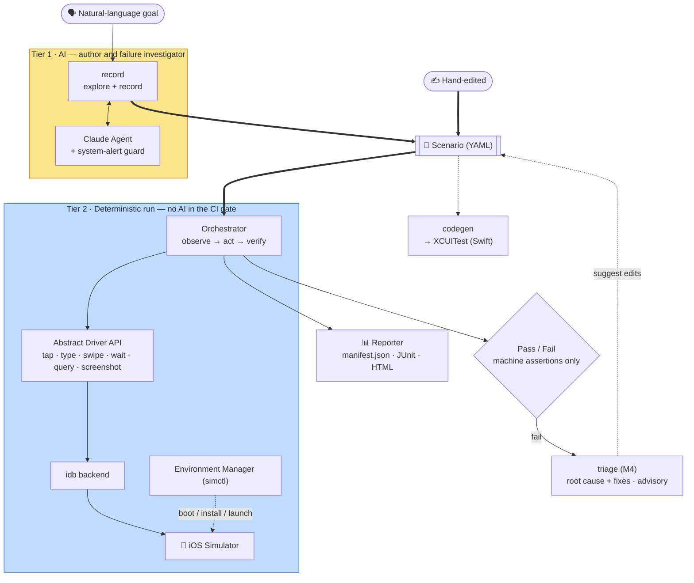

**English** · [日本語](ja/architecture.md)

# Architecture and module relationships

> Which module does what, where it depends, and **which features described in
> the design ([`DESIGN.md`](../DESIGN.md)) are not yet wired up** in the current code.

Related: [concepts](concepts.md) · the per-feature pages (linked below)

---

## Overview (data flow)

A scenario (authored by AI or by hand) is the shared artifact. `run` replays it deterministically with no AI in the gate. `codegen` and `triage` also consume the scenario.
Tier 1 (AI — yellow) authors and investigates only; Tier 2 (deterministic — blue) decides pass/fail from machine assertions alone.



The [dependency-layer view](#dependencies-layers) below is the same system seen as module layers
rather than data flow.

---

## Module list and roles

The `bajutsu/` package (Python 3.13+, pydantic v2 / typer / anthropic / pyyaml / jinja2).

| Module | Role | Page |
|---|---|---|
| `drivers/base.py` | Driver Protocol + shared types (`Element`/`Selector`/`Point`) + **selector resolution** (the determinism core) | [selectors](selectors.md) / [drivers](drivers.md) |
| `drivers/fake.py` | In-memory `FakeDriver` (for tests without a device) | [drivers](drivers.md#fakedriver) |
| `drivers/idb.py` | idb backend (headless, coordinate tap) | [drivers](drivers.md#idb) |
| `scenario.py` | Scenario schema (strict pydantic validation) + YAML load / dump | [scenarios](scenarios.md) |
| `assertions.py` | Machine assertion evaluation (total function — never raises) | [selectors](selectors.md#assertion-evaluation) |
| `orchestrator.py` | The deterministic Tier 2 run loop (act → wait → verify) | [run-loop](run-loop.md) |
| `evidence.py` | Evidence capture (instant / interval) and Sinks | [evidence](evidence.md) |
| `intervals.py` | Interval evidence (video / deviceLog) as simctl child processes | [evidence](evidence.md#interval-evidence-video--devicelog) |
| `report.py` | `manifest.json` + JUnit XML + HTML | [reporting](reporting.md) |
| `network.py` | Network collector + in-protocol deterministic mocks | [evidence](evidence.md) |
| `redaction.py` | Redaction of evidence (labels / headers / fields + secret values) | [evidence](evidence.md) |
| `interp.py` | `${ns.key}` interpolation primitive (`params.` / `row.` / `secrets.`) | [scenarios](scenarios.md) |
| `config.py` | Team defaults × per-app resolution (`Effective`) | [configuration](configuration.md) |
| `backends.py` | Backend availability check · actuator selection · driver construction | [drivers](drivers.md#backend-selection-and-the-actuator) |
| `env.py` | `simctl` wrapper (erase/boot/launch/openurl/io) | [drivers](drivers.md#environment-management-simctl) |
| `preflight.py` | Runnability gate (required CLIs + a booted Simulator) | [configuration](configuration.md) |
| `runner.py` | config + scenarios → report. Device factory (launch sequence) | [run-loop](run-loop.md#runner-the-run-pipeline) |
| `doctor.py` | Convention score (id coverage, etc.) | [configuration](configuration.md#doctor-the-convention-score) |
| `agent.py` | Authoring Agent abstraction (`Observation`/`Proposal`/`Agent`) | [recording](recording.md) |
| `claude_agent.py` | Claude implementation (forced tool use · prompt cache) | [recording](recording.md#claudeagent) |
| `record.py` | The record loop (observe → propose → execute → emit) | [recording](recording.md#the-record-loop) |
| `alerts.py` | System-alert detection / dismissal (vision locator) | [recording](recording.md#dismissing-system-alerts-automatically) |
| `codegen.py` | Scenario → XCUITest (Swift) generation | [codegen](codegen.md) |
| `trace.py` | Text timeline over a saved run (the `trace` command) | [cli](cli.md) |
| `triage.py` | M4 self-heal: rule-based `HeuristicTriageAgent` + structured fixes (`renameId`/`addIndex`/`raiseTimeout`), `--apply`/`--write`/`--rerun` | [cli](cli.md) |
| `claude_triage.py` | Claude-backed `TriageAgent` (`--ai`, failure screenshot) | [cli](cli.md) |
| `github.py` | GitHub helpers (CI, continuous integration) | [ci](ci.md) |
| `serve.py` | Local web UI (the `serve` command) | [cli](cli.md) |
| `mcp/` | MCP server: exposes `run`/`doctor` as tools + run evidence as resources | [cli](cli.md) |
| `lint.py` | Scenario linter + JSON Schema generation (`lint` / `schema` commands) | [cli](cli.md) |
| `cli.py` | Typer-based CLI (`run`/`record`/`doctor`/`codegen`/`trace`/`triage`/`serve`/`mcp`/`lint`/`schema`) | [cli](cli.md) |
| `dotenv.py` | Minimal `.env` loader (never overrides an existing var) | [cli](cli.md#environment-variables-env) |
| `_yaml.py` | YAML loader that keeps `on`/`off`/`yes`/`no` as strings | [scenarios](scenarios.md#yaml-caveat) |

## Dependencies (layers)

Lower layers are more stable; upper layers depend on lower ones. The core is `drivers/base.py`
(selector resolution), which every execution path depends on.

```
                       cli.py            ← user entry (Typer): run / record / doctor / codegen / trace / triage / serve
        ┌─────────────┬───┴───────┬───────────────┬───────────┐
     runner.py    record.py    codegen.py     trace.py     triage.py / claude_triage.py
        │       (Tier 1 / AI)  (structural)   (timeline)   (M4 self-heal · advisory)
   orchestrator.py   agent.py / claude_agent.py / alerts.py        serve.py · github.py (web UI · CI)
        │                 │
   ┌────┼────────┬────────┘
assertions.py  evidence.py ── intervals.py · network.py · redaction.py
        │         │
   scenario.py  report.py     config.py · preflight.py   backends.py   env.py
        │ (interp.py)             │              │            │
        └──────────────┬─────────────┴──────────────┴────────────┘
                       ▼
                drivers/base.py  ←── the determinism core (Element / Selector / resolve_unique)
                       ▲
        ┌──────────────┴──────────────┐
   drivers/fake                   drivers/idb
```

- `orchestrator.py` depends only on `base.Driver` and **is not coupled to any concrete driver**.
  That is why it can be tested with `FakeDriver` without a device, while in production the same
  loop drives idb.
- `runner.py` provides the factory that launches the app and returns a ready driver,
  decoupling the loop from a real device.
- `scenario.py` (the pydantic authoring model) and `drivers/base.py` (the runtime TypedDict)
  are different things. `Selector.as_selector()` converts the former to the latter.

## Test layout

`tests/` holds **405 unit tests** (`uv run pytest -q`). None require a real Simulator: command
builders are verified as pure functions, and execution paths are tested with `FakeDriver` /
injected runners (`RunFn` · `Spawn` · `Clock`). Real-device E2E against the sample app is
`make -C demos/features e2e` / `make -C demos/features ui-test` ([sample-app](sample-app.md)).

---

## Implementation status

> The design ([`DESIGN.md`](../DESIGN.md)) also includes the future vision. Here we separate
> **what the current code actually runs** from **what is not yet wired up**.

### Implemented (tested; the path works end-to-end in code)

- Selector resolution and ambiguity detection (the determinism core)
- Scenario schema (strict validation) and YAML round-trip
- Evaluation of the 8 assertion kinds
- The Tier 2 run loop (act → wait → verify), verified with `FakeDriver`
- DSL: the `within` selector (geometric scoping), the `relaunch` step (validated on-device),
  reusable `setup` preludes, `locale` applied at launch, and parallel runs (`--workers`) over a
  device pool
- DSL authoring reuse: reusable parameterized components (`use` / `${params.*}`), data-driven
  scenarios (`data` / `dataFile` with `${row.*}`), secret variables (`${secrets.X}` with value
  masking), scenario tags + `--tag` / `--exclude` selection, the `setLocation` / `push` device
  steps, the `doubleTap` action, and file-level + scenario-level `description`
- Evidence: instant (`screenshot`/`elements`) + interval (`video`/`deviceLog`/`appTrace`) + the
  network collector (`network.json`) + `capturePolicy` firing + **redaction applied** to logs /
  element trees / network exchanges before they are written
- Network observation + **deterministic mocks** (scenario `mocks` → in-protocol stubs, validated
  on-device): `request` assertions, `wait: { until: request }`, and offline stubbed responses
- Reporting (`manifest.json` / `junit.xml` / `report.html`)
- Config resolution (defaults × apps, redact merge) and actuator selection
- The `simctl` command layer · the idb output parser · the `doctor` score + runnability gate
  (`preflight.py`: required CLIs + a booted Simulator)
- The `trace` command (`trace.py`): a text timeline over a saved run (steps + network + appTrace)
- M4 self-healing triage (`triage.py` + `claude_triage.py`): assemble a failed run's context +
  a `TriageAgent` diagnosis (rule-based `HeuristicTriageAgent`, or `--ai` Claude with the failure
  screenshot). An agent can propose a structured fix (`renameId` / `addIndex` / `raiseTimeout`);
  `--apply`/`--write` patches the scenario source (diff-previewed, opt-in) and `--rerun` re-runs it
- The CLI `run` / `doctor` / `codegen` / `trace` / `triage` / `serve` / `mcp` / `lint` / `schema`, plus `record` (AI authoring) + the alert guard
- The `serve` local web UI (Tier 1): run scenarios and view their reports from a browser (not for CI)
- **MCP server** (`bajutsu mcp`): `bajutsu_run` and `bajutsu_doctor` as MCP tools + run evidence as resources, for Claude Desktop / Code integration (optional dependency `fastmcp`)
- **Scenario linter** (`bajutsu lint` / `bajutsu schema`): validate scenarios without running them; JSON Schema output for editor integration
- XCUITest code generation

### Validated on a real Simulator (iPhone 17 Pro, recent iOS)

- The idb backend's subprocess execution — `describe-all` parsing, frame-center tap / text /
  swipe, and the simctl launch sequencing — confirmed against the installed `idb` /
  `idb_companion` by running the sample scenarios, evidence capture, and the triage self-heal
  loop on-device (`make -C demos/features e2e`; the `e2e.yml` CI workflow also exercises the idb smoke path).

### Not yet wired (schema/flags exist but have no runtime effect)

| Feature | Status | Location |
|---|---|---|
| `mockServer` (external mock command) | config schema only; the `cmd`/`port` external server is **not implemented** — superseded by scenario `mocks` (declarative in-protocol stubs, implemented) | `config.py` `MockServer` |

These are also flagged inline on the relevant feature pages.
