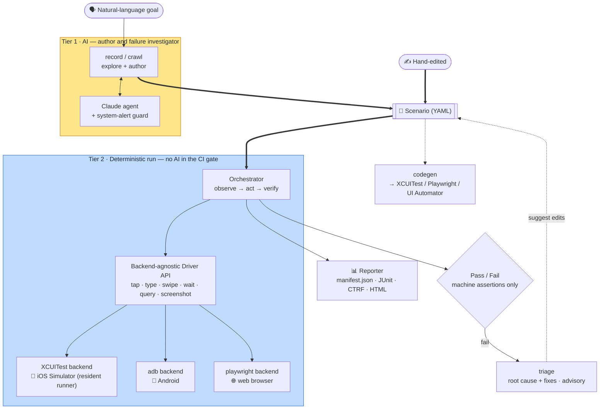
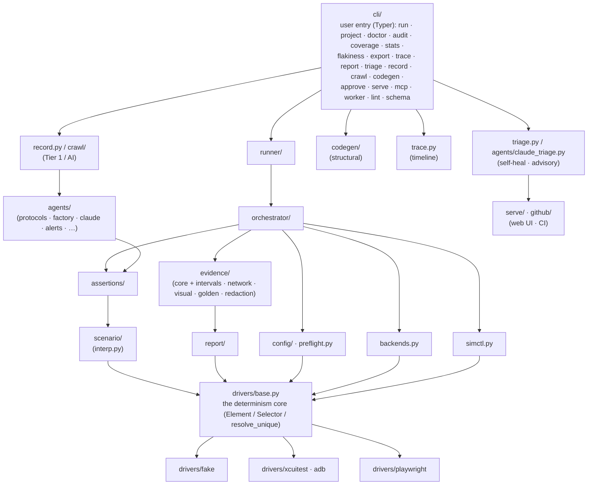

**English** · [日本語](ja/architecture.md)

# Architecture and module relationships

> Which module does what, where it depends, and **which features described in
> the design ([`DESIGN.md`](../DESIGN.md)) are not yet wired up** in the current code.

Related: [concepts](concepts.md) · the per-feature pages (linked below)

---

## Overview (data flow)

A [scenario](glossary.md#scenario-authoring) (authored by AI or by hand) is the shared artifact. `run` replays it deterministically with no AI in the gate. `codegen` and `triage` also consume the scenario.
Tier 1 (AI — yellow) authors and investigates only; Tier 2 (deterministic — blue) decides pass/fail from machine assertions alone.
The whole spine is platform-neutral; the only platform-specific seam is the **backend** the orchestrator drives (XCUITest for iOS, adb for Android, playwright for web, … behind one `Driver` interface), so a new platform is a new backend, not a fork of the core.

Mermaid source

<!-- mermaid-svg: assets/diagrams/architecture-data-flow.svg -->

The [dependency-layer view](#dependencies-layers) below is the same system seen as module layers
rather than data flow.

---

## Module list and roles

The `bajutsu/` package (Python 3.13+, pydantic v2 / typer / anthropic / pyyaml / jinja2).

| Module | Role | Page |
|---|---|---|
| `drivers/base.py` | Driver Protocol + shared types (`Element`/`Selector`/`Point`) + **selector resolution** (the determinism core) | [selectors](selectors.md) / [drivers](drivers.md) |
| `drivers/coordinate_tree.py` | `CoordinateTreeDriver` — the shared transient-empty retry / stable-key settle / `_resolve` / `wait_for` base class the coordinate backend (adb) inherits (BE-0254) | [drivers](drivers.md#adb-android) |
| `drivers/fake.py` | In-memory `FakeDriver` (for tests without a device) | [drivers](drivers.md#fakedriver) |
| `drivers/xcuitest.py` | XCUITest backend (iOS; the sole iOS backend since BE-0290 retired idb — semantic tap, native condition-wait, text selection, and multi-touch via a resident on-device runner; BE-0019) | [drivers](drivers.md#xcuitest-ios) |
| `drivers/adb.py` | adb backend (Android; `uiautomator dump` frame-center coordinate tap) | [drivers](drivers.md#adb-android) |
| `drivers/playwright.py` | Playwright web backend (browser; first slice — deterministic run) | [drivers](drivers.md#playwright-web) |
| `scenario/` | Scenario schema (strict pydantic validation) + YAML load / dump (package: `models` / `load` / `expand` / `select` / `serialize`) | [scenarios](scenarios.md) |
| `assertions/` | Machine assertion evaluation (total function — never raises) (package: `evaluate` / `network` / `visual` / `schema` / `_common`, BE-0250) | [selectors](selectors.md#assertion-evaluation) |
| `orchestrator/` | The deterministic Tier 2 run loop (act → wait → verify) (package: `loop` / `waits` / `substitution` / `evidence_rules` / `actions`) | [run-loop](run-loop.md) |
| `evidence/` | Evidence capture, split by role (BE-0257): `core` (instant / interval capture and Sinks), `intervals` (video / deviceLog as simctl child processes), `network` (collector + in-protocol deterministic mocks), `visual` (visual-regression image comparison), `golden` (element-tree comparison), `redaction` (labels / headers / fields + secret values) | [evidence](evidence.md) |
| `report/` | `manifest.json` + JUnit XML + CTRF JSON + interactive HTML (package: `format` / `manifest` / `ctrf` / `rows` / `panels` / `html`) | [reporting](reporting.md) |
| `interp.py` | `${ns.key}` interpolation primitive (`params.` / `row.` / `secrets.` / `vars.`) | [scenarios](scenarios.md) |
| `config/` | Team defaults × per-target resolution (`Effective`) (package: `schema` / `effective` / `resolve` / `accessors`) | [configuration](configuration.md) |
| `backends.py` | Backend availability check · actuator selection (platform-aware registry: `ios` / `android` / `web` / `fake`) · driver construction | [drivers](drivers.md#backend-selection-and-the-actuator) |
| `simctl.py` | `simctl` wrapper (erase/boot/launch/openurl/io) | [drivers](drivers.md#environment-management-simctl) |
| `preflight.py` | Runnability gate, per backend (iOS: required CLIs + a booted Simulator; web: Playwright + its Chromium browser) | [configuration](configuration.md) |
| `requirements.py` | One declarative mapping: backend/capability → pip extra + external-tool probe + install method (BE-0164), shared by `preflight` and `provision` | — |
| `provision.py` | Config-aware environment installer (BE-0164): resolve a config's backends + AI provider, install only their extras/tools idempotently (`make install`) | — |
| `runner/` | config + scenarios → report; device pool + launch sequence; `device_provider` seam resolves where the run's devices come from — a local pass-through today, cloud adapters later (package: `pipeline` / `pool` / `launch` / `device_provider`) | [run-loop](run-loop.md#runner-the-run-pipeline) |
| `doctor.py` | Convention score (id coverage, etc.) | [configuration](configuration.md#doctor-the-convention-score) |
| `agents/` | AI / authoring-agent periphery (BE-0257): `protocols` + `factory` (the `Observation`/`Proposal`/`Agent` abstraction + construction of the one SDK-backed agent), `claude` (the authoring agent), `claude_backed` (shared base, BE-0246), `claude_enrich`, `claude_triage`, `ai_config` (provider/model/effort/language resolution), `anthropic_client` (SDK client construction), `availability` (credential-gap messaging), `enrich` (the enrichment loop), `alerts` (system-alert guard) | [recording](recording.md) |
| `ai/` | Vendor-neutral AI backend seam (BE-0104): `AiBackend` protocol + normalized request/response types (`base`), provider registry (`registry`), Anthropic reference adapter over `agents.anthropic_client` (`anthropic`) — the Anthropic API, Amazon Bedrock, and the Anthropic CLI `ant` (BE-0163) | [configuration](configuration.md#ai-provider-ai-be-0047) |
| `record.py` | The record loop (observe → propose → execute → emit) | [recording](recording.md#the-record-loop) |
| `crawl/` | Autonomous breadth-first crawl → screen map: `core` engine + `serialize`, with `guide` / `tabs` / `report` / `repro` / `flows` | [recording](recording.md) |
| `codegen/` | Scenario → native test generation: XCUITest (Swift), Playwright (TypeScript), UI Automator (Kotlin) | [codegen](codegen.md) |
| `trace.py` | Text timeline over a saved run (the `trace` command) | [cli](cli.md) |
| `triage.py` | M4 self-heal: rule-based `HeuristicTriageAgent` + structured fixes (`renameId`/`addIndex`/`raiseTimeout`), `--apply`/`--write`/`--rerun` | [cli](cli.md) |
| `github/` | GitHub helpers: `actions` (CI, continuous integration, annotations + job summary), `app` (App installation token for the private-repo config source), `errors` (the shared access error) | [ci](ci.md) |
| `serve/` | Local web UI (the `serve` command): author / run / reports / triage a failed run | [cli](cli.md) |
| `mcp/` | MCP server: exposes `run`/`doctor` as tools + run evidence as resources | [cli](cli.md) |
| `lint.py` | Scenario linter + JSON Schema generation (`lint` / `schema` commands) | [cli](cli.md) |
| `analysis/` · `serve/flakiness.py` | Read-only advisory analysis (BE-0257), no device/AI, never gates CI: `audit` (determinism/flakiness audit, BE-0049), `coverage` (scenario id-namespace coverage, BE-0050), `stats` (the aggregate run-stats dashboard, BE-0102), plus cross-run flakiness ranking (`flakiness`, BE-0220) | [cli](cli.md) |
| `cli/` | Typer-based CLI; one file per command in `cli/commands/` (`run`/`project`/`doctor`/`audit`/`coverage`/`stats`/`flakiness`/`export`/`trace`/`report`/`triage`/`record`/`crawl`/`codegen`/`approve`/`serve`/`mcp`/`worker`/`lint`/`schema`) | [cli](cli.md) |
| `dotenv.py` | Minimal `.env` loader (never overrides an existing var) | [cli](cli.md#environment-variables-env) |
| `_yaml.py` | YAML loader that keeps `on`/`off`/`yes`/`no` as strings | [scenarios](scenarios.md#yaml-caveat) |

## Dependencies (layers)

Lower layers are more stable; upper layers depend on lower ones. The core is `drivers/base.py`
(selector resolution), which every execution path depends on.

![Dependency-layer diagram: cli/ is the user entry point, from which runner/, record.py/crawl/, codegen/, trace.py, and triage.py descend directly (codegen/ and trace.py have no further dependencies drawn). runner/ depends on orchestrator/; record.py/crawl/ depends on the AI agent helpers; triage.py depends on the serve/CI helpers. orchestrator/ and the agent helpers depend on assertions/ and evidence/, and orchestrator/ additionally depends on config.py, backends.py, and simctl.py. assertions/ depends on scenario/ and evidence/ depends on report/; scenario/, report/, config.py, backends.py, and simctl.py all converge on drivers/base.py, the determinism core, from which drivers/fake, the iOS drivers, and the Playwright driver all derive.](assets/diagrams/architecture-dependency-layers.svg)

Mermaid source

<!-- mermaid-svg: assets/diagrams/architecture-dependency-layers.svg -->

- `orchestrator/` depends only on `base.Driver` and **is not coupled to any concrete driver**.
  That is why it can be tested with `FakeDriver` without a device, while in production the same
  loop drives XCUITest (iOS) or playwright (web).
- `runner/` provides the factory that launches the app and returns a ready driver,
  decoupling the loop from a real device.
- `scenario/` (the pydantic authoring model) and `drivers/base.py` (the runtime TypedDict)
  are different things. `Selector.as_selector()` converts the former to the latter.

### Enforced layer boundaries (BE-0112)

The layering above is not only a convention — it is an **executable contract in the gate**.
`make lint-imports` (part of `make check`, and a CI step) runs [import-linter](https://import-linter.readthedocs.io/)
against the declared layers, so a forbidden import fails the gate instead of surviving until someone
notices. The configuration lives in `[tool.importlinter]` in `pyproject.toml`. Three layers are
declared:

1. **Deterministic core** — the path that derives a verdict and evidence with no model and no
   periphery stack: `orchestrator/`, `runner/`, `drivers/base.py`, `assertions/`, `evidence/`,
   `report/`, `config/`, `scenario/`, `preflight.py` / `capability_preflight.py` /
   `capabilities.py`, `doctor.py`, `lint.py`. It carries the prime directives.
2. **Contract** — the stable surfaces a consumer depends on: the scenario schema (`scenario/`) and
   the `Driver` Protocol (`drivers/base.py`).
3. **Periphery** — the consumers of the contract, each removable behind an optional extra:
   `serve/`, `mcp/`, the codegen emitters, the AI / agent paths (`agents/` — `protocols`, `ai_config`,
   `anthropic_client`, `enrich`, `alerts`, … — plus `record.py`, `triage.py`, `crawl/guide.py`, …),
   and the `github/actions.py` / `notify.py` helpers (the rest of `github/` — `app` / `errors` — is
   core-safe, so `config_source` reaches it without pulling the periphery in).

Three contracts are enforced:

- **The deterministic core must not import the periphery.** This contract enforces prime directives
  #1 and #3 statically: the verdict/evidence path stays free of the serve, AI, and codegen stacks, and
  cannot silently grow a dependency on them. A pure element-tree helper a core module needs (e.g.
  `screen_size_from_elements`, `shows_app_ui`) lives in the core (`bajutsu/elements.py`), not in a
  periphery module such as `record.py`; likewise the resolved `ai` block (`AiConfig`) lives in
  `config/`, so the core reads it without importing the AI client.
- **The core must stay host-agnostic (BE-0129).** Multi-tenant hosting concerns — organizations,
  roles, tenancy — and the `db` (SQLAlchemy/Alembic/psycopg/cryptography) and `oauth` (Authlib)
  extras belong to `bajutsu/serve/` alone. The org model (`OrgConfig`, `org_for_*`,
  `targets_for_org`, `load_serve_config`) lives in `bajutsu/serve/orgs.py`, not `config/`; `Config`
  carries no `orgs` field, and the core loader drops a top-level `orgs:` before validation so a run
  in the hosted topology (which reads an org-bearing config) keeps working while the core never
  models orgs. The same mechanism also drops a top-level `ui:` key (BE-0191) — the serve UI's
  presentation settings (`ui.default_theme`) are a serve concern and are parsed in
  `bajutsu/serve/themes.py`, not modeled in `Config`. A forbidden import-linter contract keeps `config/`, `drivers/`, `runner/`, and
  `scenario/` off those extras (`include_external_packages` lets it see the external import), on top
  of the periphery contract that already keeps them off `bajutsu.serve`.
- **The scenario schema and `Driver` Protocol stay a portable inner contract** — independent of the
  runtime core (`orchestrator/`, `runner/`, `config/`, …) as well as the periphery. This independence
  keeps the contract a stable layer a consumer can depend on without pulling the runtime, underpinning
  cross-version schema reads (BE-0119) and any future split of the periphery from the core.

The check is static analysis on the import graph — no model, nothing on the `run` / CI verdict path
beyond a deterministic pass/fail. When a new module is added, its layer decides where it belongs: if
it is on the verdict/evidence path it is core and must not reach the periphery; if it consumes the
contract it is periphery and belongs behind an extra.

## Test layout

`tests/` holds the **unit-test suite** (`uv run pytest -q`). None require a real Simulator: command
builders are verified as pure functions, and execution paths are tested with `FakeDriver` /
injected runners (`RunFn` · `Spawn` · `Clock`). Real-device E2E against the showcase app is
`make -C demos/showcase run-swiftui` / `make -C demos/showcase ui-test` ([showcase](showcase.md)).

### Driver conformance suite (BE-0114)

Prime directive #3 says every backend sits behind one `Driver` interface, so the determinism-core
invariants must hold identically on all of them. Per-backend tests alone cannot guarantee that: a
backend that tapped the first match on an ambiguous selector, or returned success on a zero-match,
would pass its own tests and fail no shared one. The **driver conformance suite** closes that gap —
one executable contract (a TCK, a technology compatibility kit) that runs the *same* test body
against every backend, driving the real driver instance (including code that bypasses
`drivers/base`), not the shared base alone.

The contract (`tests/driver_conformance.py`) is the "done" definition a new backend meets:

- an ambiguous selector (two or more matches) fails rather than acting on the first match;
- a zero-match selector fails rather than reporting success;
- selector failures share one error type (`SelectorError`), uniform across backends;
- a unique match acts without error, and `query()` reports the on-screen elements;
- `capabilities()` matches observed behavior — the `QUERY` / `ELEMENTS` baseline is declared,
  multi-touch gestures work exactly when `MULTI_TOUCH` is declared, and select-all / clipboard copy
  work exactly when `TEXT_SELECTION` is declared (else each raises `UnsupportedAction`, BE-0280);
- text editing round-trips on the focused field (typing then deleting reduces its reported length),
  and `tap_point` — a raw coordinate tap, the alert-dismissal path — focuses the field when aimed at
  its center, the same observable effect as a semantic tap (BE-0280);
- `wait_for` is a single-shot check of the current screen, with the shared `wait_until` loop
  turning it into a condition wait with no fixed sleep.

To add a backend to the suite, implement a `ConformanceHarness` (given a screen, return a driver
showing it) and subclass `DriverConformanceContract`; pytest then runs the inherited contract
against it. `FakeDriver` runs on the fast Linux gate (`make check`); Playwright runs in the web CI
job, XCUITest under the iOS on-device E2E path (`ios-e2e.yml`), and the **adb backend** on a
booted Android emulator (`android-e2e.yml`'s `conformance (adb)` job, BE-0270) — the same contract,
no second spec. Each harness realizes a screen its own way: `FakeDriver` takes the elements directly,
Playwright renders them as HTML, and the on-device harnesses launch the showcase app into conformance
mode once (`SHOWCASE_CONFORMANCE`) and then reseed each screen — so the real backend query and act
code is exercised, not the shared base alone. The iOS harness reseeds by writing a spec file the app
polls (`conformance-spec.txt` in its Documents directory): a file write rather than a per-screen
relaunch or deeplink, because `simctl openurl` raises iOS's "Open in app?" dialog and relaunching
per screen crashes the resident XCUITest runner after a handful of `app.launch()` cycles. The adb
harness instead re-launches the app's `singleTask` activity with a new `SHOWCASE_CONFORMANCE` intent
extra, delivered via `onNewIntent` — `adb push` cannot reach the app sandbox, and the intent reuses
the `launchEnv`→intent-extras convention (BE-0007); it is scoped to the Compose toolkit, the one that
can render a spec-driven arbitrary-id screen (`testTag` takes any runtime string, while a Views
`resource-id` must be a compile-time `R` entry). The suite carries an `ondevice` pytest marker
(deselected by the gate's default) so it never runs in `make check`, and runs serially on a single
device (the shared device is reseeded via one channel, so parallel workers would collide).

---

## Implementation status

> The design ([`DESIGN.md`](../DESIGN.md)) also includes the future vision. Here we separate
> **what the current code actually runs** from **what is not yet wired up**.

### Implemented (tested; the path works end-to-end in code)

- Selector resolution and ambiguity detection (the determinism core)
- Platform-aware backend registry: `--backend` / `backend:` accept `ios` / `android` / `web` /
  `fake` tokens, each expanding to its actuators (`backends.py`) — `ios` expands to `xcuitest`, the
  sole iOS actuator since BE-0290 retired idb (`--backend ios` and `--backend xcuitest` are
  equivalent). A platform with more than one actuator would resolve **per scenario** in cost order
  (BE-0240); with iOS now single-actuator, no platform's cost order differs from its stability order
- The **XCUITest backend** (`drivers/xcuitest.py`): the sole iOS actuator (BE-0290) — a resident
  on-device runner (`BajutsuKit`) driven over a loopback HTTP channel, providing semantic
  (identifier) tap, a native condition-wait, text selection, and the `pinch`/`rotate` multi-touch
  gestures, and reading the XCTest automation snapshot (which descends into group containers, so it
  renders a fully-expanded element tree). The generic runner (`XCUIApplication(bundleIdentifier:)`)
  drives an arbitrary app by bundle id with no app-side integration; it needs Xcode's `xcodebuild`
  (BE-0019). A Simulator target needs no runner config at all: when neither `xcuitest.testRunner` nor
  `xcuitest.build` is named, the environment resolves to the Simulator runner bundled in the wheel as
  package data, materialized into a content-hash-keyed writable cache on first use — an explicit
  `testRunner`/`build` still overrides it, and `deviceType: device` still requires an explicit signed
  runner (BE-0292)
- The **Playwright web backend** (`drivers/playwright.py`): a deterministic `run` against a browser
  on the Linux gate (`demos/web`), raised to the rich end of the capability model (BE-0054) — native
  `network` observation + stubbing (`page.route()`), `video` and `deviceLog`-equivalent console /
  page-error interval evidence through the shared `driver_interval` seam, emulated `multiTouch`
  (pinch / rotate), parallel runs across N `BrowserContext` lanes, and a target-level `deviceMode`
  (desktop default, or a Playwright device preset for mobile emulation; BE-0228); `appTrace` stays
  iOS-only (`os_log`/simctl-based)
- The **Android adb backend** (`drivers/adb.py` + `adb.py`): the coordinate driver
  (`uiautomator dump` → frame-center tap), the `AndroidEnvironment` launch sequence, `doctor`
  reporting, interval evidence (`video` via `screenrecord`, `deviceLog` via `logcat`, both through
  the driver-supplied `driver_interval` seam) plus in-app **network capture** — `request` assertions
  over an OkHttp interceptor (`BajutsuAndroid`) reporting to the host collector, bridged to the
  emulator with `adb reverse` (BE-0283; `mocks` stay a follow-up), and
  fast-gate unit tests over captured XML fixtures; on-device actuation fidelity — system
  `back`, deeplink, a single-round-trip `doubleTap`, scroll-into-view resolution, and up-front
  runtime-permission grants (BE-0210); a device-control subset — `setLocation` and clipboard
  read/write/clear, gated by per-operation capability tokens (BE-0211 / BE-0212), the clipboard
  through an in-app receiver (`BajutsuAndroid`, BE-0233) since a shell process cannot reach the
  clipboard on Android 10+, while `push` / `clearKeychain` / status-bar overrides / `background` /
  `foreground` stay unsupported (no emulator equivalent); the per-scenario `permissions` field
  (`pm grant`/`pm revoke`, BE-0276) backs the whole permission vocabulary, including `notifications`
  (`POST_NOTIFICATIONS`, API 33+) — unlike iOS's `simctl privacy`, which has no TCC (Transparency,
  Consent, and Control) service for it; `pinch`/`rotate` two-finger multi-touch
  gated on a rooted device (protocol-B `sendevent`, no single-touch fallback; BE-0232); a UI
  Automator (Kotlin) codegen target (BE-0209); an Android e2e CI lane (emulator under KVM,
  `android-e2e.yml`; BE-0208) that now runs the shared scenario set outside the still-excluded mocked-network flows — the adb driver reaches
  every tab by driving the native tab bar with the same cross-backend selector iOS uses (a clickable
  `NavigationBarItem` derives the `button` trait and its child text as `label`; BE-0223), the one
  portability gap that used to hold tab-scoped scenarios out of the lane. **Id matching** stays verbatim in the driver: where a
  native id syntax cannot reproduce the SPEC id (Android Views `android:id` maps `stable.refresh` →
  `stable_refresh`), the scenario's selector lists **both id forms** and the shared resolver matches
  either as an OR — an explicit scenario-side convention, not a driver-side `.`↔`_` rewrite (BE-0221)
- Scenario schema (strict validation) and YAML round-trip; `id` / `idMatches` accept a list of OR
  candidates for cross-platform id forms (BE-0221)
- Evaluation of the assertion kinds (`exists` / `value` / `label` / `count` / `enabled` / `disabled` /
  `selected` / `request` / `requestSequence` / `event` / `responseSchema` / `visual` / `clipboard` /
  `golden`)
- The Tier 2 run loop (act → wait → verify), verified with `FakeDriver`
- DSL: the `within` selector (geometric scoping), the `relaunch` step (validated on-device),
  reusable `setup` preludes, `locale` applied at launch, and parallel runs (`--workers`) over a
  device pool
- DSL authoring reuse: reusable parameterized components (`use` / `${params.*}`), data-driven
  scenarios (`data` / `dataFile` with `${row.*}`), secret variables (`${secrets.X}` with value
  masking), scenario tags + `--tag` / `--exclude` selection, the `setLocation` / `push` device
  steps, the pre-launch `permissions` field (`simctl privacy` / `pm grant`|`pm revoke`, BE-0276),
  the `doubleTap` action, and file-level + scenario-level `description`
- DSL control flow & data capture: conditional `if` and `forEach` loops (deterministic; the
  condition is a machine assertion), and `extract` (capture an element's value / label / identifier
  into `${vars.*}`)
- DSL `interrupts` (BE-0314): a config-level (app-wide default) and scenario-level (appended) list
  of `{ condition, steps }` entries, checked opportunistically — reusing the assertion-DSL
  `condition` shape `if` already uses — against the tree a `screenChanged`-policy step or a `wait`
  poll has already fetched, for a screen that can surface at an unpredictable point (an onboarding
  step, a permission prompt the accessibility tree can see) rather than one known spot in the step
  sequence; on a match, runs the entry's `steps` then resumes the interrupted step (a `wait` keeps
  its original deadline; an act step retries once), with a re-entrancy cap falling back to the
  step's ordinary outcome
- DSL text-editing steps (BE-0265): `clear` / `delete` / `select` / `copy` close the gap left by
  `type` on every backend (adb, Playwright, XCUITest, fake); the web context raises
  `UnsupportedAction` for `select`/`copy` (codegen routes those to XCUITest instead), and the web
  context raises for `clear`/`delete` too. A cross-step `SelectionState` enforces the
  copy-requires-a-prior-select precondition, verified only through the existing `clipboard`
  read-back since no backend exposes selection as queryable state
- DSL device & system actions (iOS): `background`, `clearKeychain`, `clearClipboard`,
  `overrideStatusBar` / `clearStatusBar` (deterministic status bar), and the `http` action for
  test-data setup / webhooks
- DSL `handleSystemAlert` (BE-0316): a deterministic, iOS-only step that taps a SpringBoard
  permission-prompt button by a native accessibility query (the runner's second, on-demand
  SpringBoard handle) — resolution stays Python-side in `resolve_unique`, so it is the determinism-first
  counterpart to the reactive vision `dismissAlerts` guard; only the XCUITest backend declares the
  capability, so Android and web fail preflight
- Evidence: instant (`screenshot`/`elements`/`actionLog`) + interval (`video`/`deviceLog`/`appTrace`)
  + the network collector (`network.json`) + **visual regression** (`visual` vs. a baseline; the
  `approve` command promotes baselines) + `capturePolicy` firing + **redaction applied** to logs /
  element trees / network exchanges before they are written
- Network observation + **deterministic mocks** (scenario `mocks` → in-protocol stubs, validated
  on-device): `request` assertions, `wait: { until: request }`, and offline stubbed responses
- The **screen-transition signal** (BE-0310, iOS): an opt-in `BajutsuScreen` observer in
  `BajutsuKit` reports each `UIAccessibility.screenChangedNotification` to the collector's
  `/transitions` endpoint, independent of the network-exchange store it shares a process with. The
  post-launch readiness gate (`_await_ready`) consults it as a new strongest rung above the BE-0218
  ladder, and the `settled` wait consults it as a quiescence-window debounce, in place of tree-diff
  polling; a target that doesn't link the observer (or hasn't yet transitioned) gets the unchanged
  tree-diff behavior on both. Fast-gate tested with a fake signal source; on-device confirmation
  across UIKit and SwiftUI is this item's own gate, tracked in
  [`demos/showcase/BE-0310-screen-transition-verification.md`](../demos/showcase/BE-0310-screen-transition-verification.md).
- Reporting (`manifest.json` / `junit.xml` / `ctrf.json` / `report.html`)
- Config resolution (defaults × targets, redact merge) and actuator selection
- The `simctl` command layer · the XCUITest automation-snapshot parser · the `doctor` score + per-backend runnability
  gate (`preflight.py`: iOS needs the required CLIs + a booted Simulator; web needs Playwright + its
  Chromium browser)
- The `trace` command (`trace.py`): a text timeline over a saved run (steps + network + appTrace)
- M4 self-healing triage (`triage.py` + `agents/claude_triage.py`): assemble a failed run's context +
  a `TriageAgent` diagnosis (rule-based `HeuristicTriageAgent`, or `--ai` Claude with the failure
  screenshot). An agent can propose a structured fix (`renameId` / `addIndex` / `raiseTimeout`);
  `--apply`/`--write` patches the scenario source (diff-previewed, opt-in) and `--rerun` re-runs it
- The CLI: `run` / `project` / `doctor` / `audit` / `coverage` / `stats` / `flakiness` / `export` / `trace` / `report` / `triage` / `record` / `crawl` / `codegen` / `approve` / `serve` / `mcp` / `worker` / `lint` / `schema` — with `record` + `crawl` as the Tier 1 AI authoring paths and the alert guard
- Read-only advisory analysis commands (no device, no AI, never gate CI — only a missing/unreadable input exits non-zero): a determinism/flakiness **audit** with static, repeat-and-diff, and longitudinal modes (`audit`, BE-0049); a scenario id-namespace **coverage** map (`coverage`, BE-0050); the aggregate run-stats dashboard as CLI/HTML output (`stats`, BE-0102); cross-run **flakiness** ranking, from a runs directory or the `serve` database (`flakiness`, BE-0220); a finished run's **export** as a portable `.zip` (`export`, BE-0060); and **report** re-rendering (`report.html`/`junit.xml`/`ctrf.json`) from stored run data with no re-run (`report`, BE-0068)
- The **config project hub** (`project add`/`ls`/`use`/`rm` and `run --project`, BE-0225): a named registry binding a project name to a config source, shared between the CLI and the `serve` web UI (DB-backed when configured, on-disk JSON otherwise); `serve` carries a header **project switcher** plus a top-level **Projects** page (BE-0275) that lists, adds, removes, and switches projects, rebinding the active config with no restart
- The **cross-project metrics comparison dashboard** (BE-0226): a `serve` **Metrics** tab that ranks the registered projects side by side — pass-rate, flaky-rate, and p50/p95 run duration, plus a per-project trend sparkline — reusing BE-0102's per-config aggregation computed once per project (`GET /api/metrics/projects`); read-only and advisory, like BE-0102
- AI **crawl** (`crawl/`): autonomous breadth-first exploration of an app → a screen map (`screenmap.json`)
- The `serve` local web UI (Tier 1): author (`record` / `crawl`), edit, and run scenarios; **open a `.zip` bundle** of config + scenarios + the built app binary as the active config the tabs run from (BE-0073) — the server also accepts those same three pieces as independent content-addressed artifacts and composes them into that tree at bind time (`POST /api/artifacts/{config,scenarios,binary}`, BE-0268), with a **Compose & load** panel in the UI — a drop zone per artifact, each hashed in the browser and uploaded only on a content miss, composed into a bound config on demand; browse reports and evidence; a per-row or bulk **delete** on the Replay or Crawl history list moves a run to a shared **Trash**, restorable within a retention window before permanent removal (BE-0239); a past crawl's screen map can also be **resumed live** — continuing its remaining frontier with the same budget and worker controls, or re-exploring one pruned branch with the same budget (BE-0181); a read-only aggregate **run-stats dashboard** across the run history (BE-0102), with every axis — date, backend, scenario, and step/assertion hotspot — now a deep link into the matching runs in the history list (BE-0241); a pre-run **readiness panel** (`doctor`: environment runnability + the current screen's convention score) in the Record and Replay forms (BE-0148); a read-only **scenario viewer** in the Replay form that shows the selected scenario's raw YAML and its runner-parsed structured steps before a run — the scenario-level mirror of the config viewer, non-gating and AI-free (BE-0273); a **scenario secrets** panel that provisions the bound config's declared `${secrets.X}` names as write-once values from the browser, inherited by a spawned Record / Replay / Crawl run (BE-0274); a **pluggable theme system** — drop-in visual tokens + swappable transitions, a header picker, and an in-UI editor with live preview and local-draft/server-upload persistence (BE-0191); a header **version badge** reporting which build of bajutsu is serving the page — the version string always, plus a short commit SHA / branch / dirty flag when serve runs from a Git checkout, or a build-time-embedded commit (`BAJUTSU_BUILD_COMMIT`, surfaced with `source: "build-arg"`) for a self-hosted Docker image shipping no `.git` (the checkout detail admin-gated, since a branch name can encode an in-progress topic; `GET /api/version` open, `GET /api/version/checkout` admin, read fresh per request via `git` plumbing with an environment-variable fallback — no LLM; BE-0272, BE-0277); approve visual baselines; live job streaming — from a browser (not for CI)
- **MCP server** (`bajutsu mcp`): `bajutsu_run` and `bajutsu_doctor` as MCP tools + run evidence as resources, for Claude Desktop / Code integration (optional dependency `fastmcp`)
- **Scenario linter** (`bajutsu lint` / `bajutsu schema`): validate scenarios without running them; JSON Schema output for editor integration
- Codegen: scenario → native test, three targets behind a shared scenario walk (BE-0083) — XCUITest
  (Swift, iOS), Playwright (TypeScript, web), UI Automator (Kotlin, Android; BE-0209)

### Validated on a real Simulator (iPhone 17 Pro, recent iOS)

- The XCUITest backend's resident runner (`BajutsuKit`) — reading the XCTest automation snapshot,
  element resolution by snapshot handle, semantic (identifier) tap, text / swipe, the simctl launch
  sequencing, and the `simctl io` screenshot — confirmed against Xcode's `xcodebuild` by running the
  showcase scenarios, evidence capture, and the triage self-heal loop on-device
  (`make -C demos/showcase run-swiftui`; the `ios-e2e.yml` CI workflow exercises the smoke path). Since
  [BE-0290](../roadmaps/BE-0290-xcuitest-default-ios-backend/BE-0290-xcuitest-default-ios-backend.md)
  retired idb, XCUITest is the only iOS backend under this path.
- `back` and device control (`setLocation` / clipboard / `push`) on the XCUITest backend, exercised
  on-device per PR by `ios-e2e.yml`
  ([BE-0281](../roadmaps/BE-0281-ios-on-device-actuation-coverage/BE-0281-ios-on-device-actuation-coverage.md)).
- The `pinch`/`rotate` multi-touch gestures — confirmed on-device via the `ios-e2e.yml`
  `xcuitest (multi-touch)` job (`demos/showcase/scenarios/gestures_multitouch.yaml`, `--backend ios`).

### Validated in a browser (Linux, no Mac)

- The Playwright web backend runs the `demos/web` scenarios deterministically inside the same
  `make check` gate as CI (the `web-e2e` job in `ci.yml`), confirming the deterministic core is
  platform-neutral. Rich-end web capture (network / video / multi-touch) has since shipped
  (BE-0054); a parallel web crawl across N browser processes ([BE-0077](../roadmaps/BE-0077-parallel-web-crawl/BE-0077-parallel-web-crawl.md)) runs on this same gate.
- The real network path — `page.route` interception, `requestfinished` capture, the `mocked`
  provenance flag, and redaction of really-captured evidence — is driven against a real browser by
  the `network (playwright)` job (`web-e2e.yml`; [BE-0282](../roadmaps/BE-0282-real-backend-network-coverage/BE-0282-real-backend-network-coverage.md)),
  which runs `demos/web/scenarios/network.yaml` **with network on** and then asserts the persisted
  `network.json` masks a captured secret. It landed as signal first and, having proven stable in CI,
  now feeds the required `E2E (web)` gate. The iOS half (wiring `network_mock.yaml` /
  `network_live.yaml` as a Simulator job) is not
  yet done. Android now has app-side network capture (BE-0283): `BajutsuAndroid`'s OkHttp
  interceptor reports each exchange to the host collector over an `adb reverse` tunnel, the same
  app-side-cooperation shape `BajutsuKit` uses on iOS. The adb driver itself still declares no
  native `NETWORK` capability — there is no native network monitor to actuate — so `network (adb)`
  (`android-e2e.yml`) validates the app-side path directly rather than through a driver capability.

### Validated on an Android emulator (Linux, no Mac)

- The adb backend's subprocess execution — `uiautomator dump` parsing, frame-center tap, the
  `AndroidEnvironment` launch sequence, on-device actuation fidelity, and the `pinch`/`rotate`
  multi-touch and device-control slices — is confirmed against a booted x86_64 API 34 AVD under KVM
  (`android-e2e.yml`; BE-0208), driving both the Compose and Views showcase builds over the same
  shared scenarios iOS runs, plus a golden element-tree check and a pixel visual-regression baseline
  for the Compose catalog. The lane also builds the resident UI Automator server
  ([BE-0245](../roadmaps/BE-0245-adb-resident-uiautomator-server/BE-0245-adb-resident-uiautomator-server.md)),
  so those reads run over the resident channel (`GET /source` over `adb forward`, replacing the
  ≈ 2.4 s per-read `uiautomator dump` startup) by default there, with a dump-fallback golden run
  guarding the `uiautomator dump` path.

### Not yet wired (schema/flags exist but have no runtime effect)

| Feature | Status | Location |
|---|---|---|
| `mockServer` (external mock command) | config schema only; the `cmd`/`port` external server is **not implemented** — superseded by scenario `mocks` (declarative in-protocol stubs, implemented) | `config/schema.py` `MockServer` |
| `appTrace` interval evidence on the **web** backend | `appTrace` is `os_log`/simctl-based (iOS only); the Playwright backend implements the `video` and `deviceLog`-equivalent (console / page-error) interval kinds instead (BE-0054), but has no `appTrace` analogue | `evidence/intervals.py` · `drivers/playwright.py` |

Both features are also flagged inline on the relevant feature pages.
