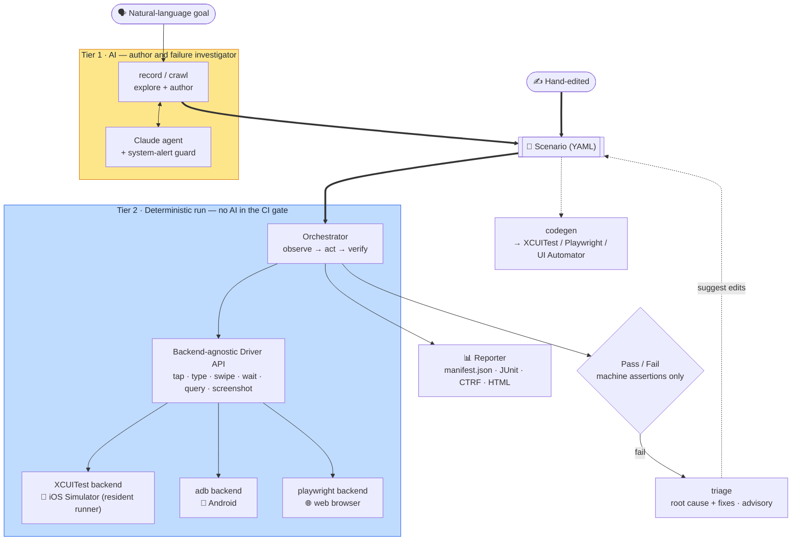
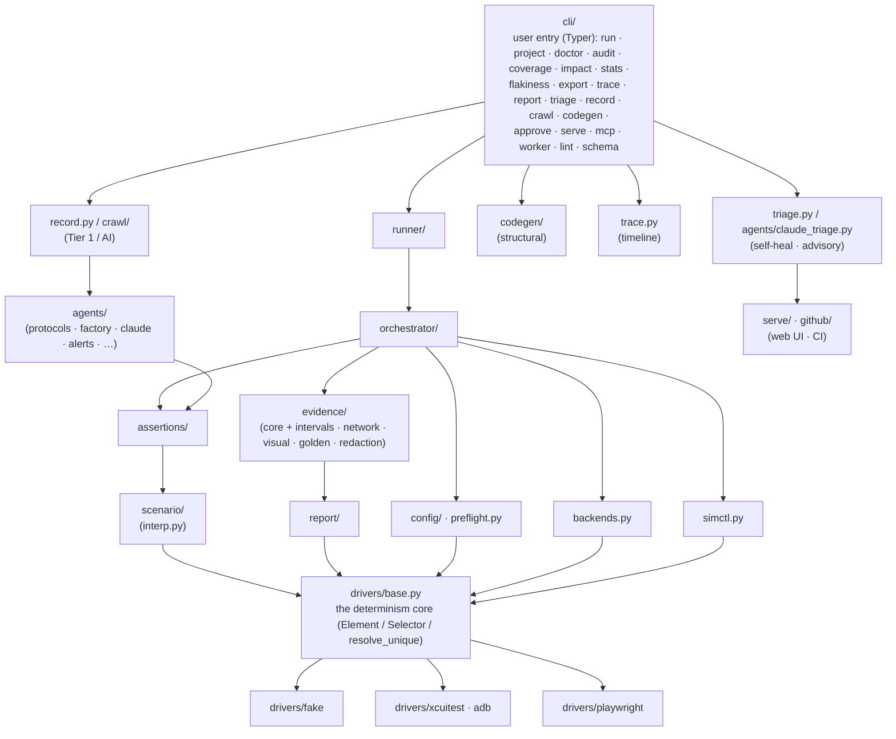

**English** · [日本語](ja/architecture.md)

# Architecture and module relationships

> Which module does what, where it depends, and **which features described in
> the design ([`DESIGN.md`](../DESIGN.md)) are not yet wired up** in the current code.

Related: [concepts](concepts.md) · the per-feature pages (linked below)

---

## Overview (data flow)

A [scenario](glossary.md#scenario-authoring) (authored by AI or by hand) is the shared artifact. `run` replays it deterministically with no AI in the gate. `codegen` and `triage` also consume the scenario.
Tier 1 (AI — yellow) authors and investigates only; Tier 2 (deterministic — blue) decides pass/fail from machine assertions alone.
The whole spine is platform-neutral; the only platform-specific seam is the **backend** the orchestrator drives (XCUITest for iOS, adb for Android, playwright for web, … behind one `Driver` interface), so a new platform is a new backend, not a fork of the core.

Mermaid source

<!-- mermaid-svg: assets/diagrams/architecture-data-flow.svg -->

```mermaid
flowchart TB
    goal(["🗣️ Natural-language goal"])
    hand(["✍️ Hand-edited"])
    scenario[["📄 Scenario (YAML)"]]

    subgraph tier1["Tier 1 · AI — author and failure investigator"]
        record["record / crawl<br/>explore + author"]
        agent["Claude agent<br/>+ system-alert guard"]
        record <--> agent
    end

    subgraph tier2["Tier 2 · Deterministic run — no AI in the CI gate"]
        orch["Orchestrator<br/>observe → act → verify"]
        driver["Backend-agnostic Driver API<br/>tap · type · swipe · wait · query · screenshot"]
        xcuitest["XCUITest backend<br/>📱 iOS Simulator (resident runner)"]
        adb["adb backend<br/>🤖 Android"]
        pw["playwright backend<br/>🌐 web browser"]
        orch --> driver
        driver --> xcuitest
        driver --> adb
        driver --> pw
    end

    verdict{"Pass / Fail<br/>machine assertions only"}
    report["📊 Reporter<br/>manifest.json · JUnit · CTRF · HTML"]
    codegen["codegen<br/>→ XCUITest / Playwright / UI Automator"]
    triage["triage<br/>root cause + fixes · advisory"]

    goal --> record
    record ==> scenario
    hand ==> scenario
    scenario ==> orch
    scenario -.-> codegen
    orch --> verdict
    orch --> report
    verdict -->|fail| triage
    triage -.->|suggest edits| scenario

    classDef ai fill:#fde68a,stroke:#d97706,color:#1f2937;
    classDef det fill:#bfdbfe,stroke:#2563eb,color:#1f2937;
    class tier1 ai
    class tier2 det
```

The [dependency-layer view](#dependencies-layers) below is the same system seen as module layers
rather than data flow.

---

## Module list and roles

The `bajutsu/` package (Python 3.13+, pydantic v2 / typer / anthropic / pyyaml / jinja2).

| Module | Role | Page |
|---|---|---|
| `drivers/base.py` | Driver Protocol + shared types (`Element`/`Selector`/`Point`) + **selector resolution** (the determinism core) | [selectors](selectors.md) / [drivers](drivers.md) |
| `drivers/actuation.py` | `Actuation`/`ActuationLog` — the concrete-gesture record every driver appends to a step's outcome (coordinate, channel, whether the platform accepted it), backing the `actionLog` evidence kind (BE-0345) | [evidence](evidence.md#actionlog--what-each-step-actually-did-to-the-screen) |
| `drivers/coordinate_tree.py` | `CoordinateTreeDriver` — the shared transient-empty retry / stable-key settle / `_resolve` / `wait_for` base class the coordinate backend (adb) inherits (BE-0254) | [drivers](drivers.md#adb-android) |
| `drivers/fake.py` | In-memory `FakeDriver` (for tests without a device) | [drivers](drivers.md#fakedriver) |
| `drivers/xcuitest.py` | XCUITest backend (iOS; the sole iOS backend since BE-0290 retired idb — semantic tap, native condition-wait, text selection, and multi-touch via a resident on-device runner; BE-0019) | [drivers](drivers.md#xcuitest-ios) |
| `drivers/adb.py` | adb backend (Android; `tap`/`long_press`/`double_tap` resolve and inject device-side via the resident server's `POST /act`, falling back to a `uiautomator dump` frame-center coordinate tap when that channel is unavailable, BE-0339) | [drivers](drivers.md#adb-android) |
| `drivers/playwright.py` | Playwright web backend (browser; first slice — deterministic run) | [drivers](drivers.md#playwright-web) |
| `drivers/xcuitest_live.py` | The live-route XCUITest driver: W3C WebDriver (Appium's XCUITest driver) against a reserved device-cloud iOS device, in place of the resident-runner channel, for the `appium` device provider (BE-0238) — session lifecycle, query/tap/screenshot/readiness, gestures, and text entry are wired; `selectAll`/`copy` fail loudly (no Appium XCUITest equivalent); verification against a real device-cloud grid is still open ([BE-0303](../roadmaps/BE-0303-xcuitest-live-real-grid-verification/BE-0303-xcuitest-live-real-grid-verification.md)) | — |
| `scenario/` | Scenario schema (strict pydantic validation) + YAML load / dump (package: `models` / `load` / `load_expanded` / `expand` / `select` / `serialize` / `edit`) | [scenarios](scenarios.md) |
| `assertions/` | Machine assertion evaluation (total function — never raises) (package: `evaluate` / `network` / `visual` / `schema` / `_common`, BE-0250) | [selectors](selectors.md#assertion-evaluation) |
| `orchestrator/` | The deterministic Tier 2 run loop (act → wait → verify) (package: `loop` / `waits` / `substitution` / `evidence_rules` / `actions`) | [run-loop](run-loop.md) |
| `cancellation.py` | Cooperative cancellation (BE-0370): the read-only `CancelSource` the orchestrator's wait loops and the runner poll, the `RunCancelled` unwind exception a poll loop raises to the nearest safe boundary, and the `SIGTERM`→event bridge `bajutsu run`'s entry point installs — imports nothing from Bajutsu, so the deterministic core, the CLI, and `serve` all reach it | [run-loop](run-loop.md) |
| `evidence/` | Evidence capture, split by role (BE-0257): `core` (instant / interval capture and Sinks), `intervals` (video / deviceLog as simctl child processes), `network` (collector + in-protocol deterministic mocks), `visual` (visual-regression image comparison), `golden` (element-tree comparison), `redaction` (labels / headers / fields + secret values) | [evidence](evidence.md) |
| `report/` | `manifest.json` + JUnit XML + CTRF JSON + interactive HTML, plus a finished run's `.zip` export and its offline reload for re-rendering (package: `format` / `manifest` / `ctrf` / `rows` / `panels` / `html` / `richtext` / `archive` / `load`) | [reporting](reporting.md) |
| `interp.py` | `${ns.key}` interpolation primitive (`params.` / `row.` / `secrets.` / `vars.`) | [scenarios](scenarios.md) |
| `mailbox.py` | Pure, network-free matching/extraction logic for the `email` step (BE-0046): normalize a mailbox provider's messages, match on `to`/`subject`/`subjectMatches`, select only a message that arrived after the step started, and extract a value by regex into `${vars.*}` | [scenarios](scenarios.md) |
| `config/` | Team defaults × per-target resolution (`Effective`) (package: `schema` / `effective` / `resolve` / `accessors`) | [configuration](configuration.md) |
| `backends.py` | Backend availability check · actuator selection (platform-aware registry: `ios` / `android` / `web` / `fake`) · driver construction | [drivers](drivers.md#backend-selection-and-the-actuator) |
| `simctl.py` | `simctl` wrapper (erase/boot/launch/openurl/io) | [drivers](drivers.md#environment-management-simctl) |
| `platform_lifecycle/` | The `Environment` seam (BE-0009): one `RunEnvironment`/`CrawlEnvironment` Protocol per platform for per-run app bring-up, readiness, relaunch, device control, and teardown, so `runner/` and `cli/commands/crawl.py` drive iOS/Android/web through one interface instead of branching on the actuator name (package: `protocols` / `factories` / `readiness` / `relaunchers` / `device_control` / `read_session`, plus `environments/` — `ios` / `xcuitest` / `xcuitest_live` / `android` / `web` / `fake`) | — |
| `preflight.py` | Runnability gate, per backend (iOS: required CLIs + a booted Simulator; web: Playwright + its Chromium browser) | [configuration](configuration.md) |
| `requirements.py` | One declarative mapping: backend/capability → pip extra + external-tool probe + install method (BE-0164), shared by `preflight` and `provision` | — |
| `provision.py` | Config-aware environment installer (BE-0164): resolve a config's backends + AI provider, install only their extras/tools idempotently (`make install`) | — |
| `runner/` | config + scenarios → report; device pool + launch sequence; `device_provider` seam resolves where the run's devices come from — the built-in `local` pass-through, plus an `appium` provider driving a reserved iOS device end to end behind a live Appium/WebDriver endpoint (BE-0238); a further cloud-vendor kind (e.g. Firebase Device Streaming) stays a future addition; `recovery` holds the backend-crash retry-count/wall-clock-budget decision shared with the on-device driver conformance suite (BE-0334), plus the two predicates that classify a failure for it — `recovers_by_respawn` decides a retry, `is_host_fault` diagnoses a failure the host caused, and a wedged CoreSimulator answers the two differently (BE-0378), plus the guarded-teardown policy that the pool's teardown sites, `launch_driver`, and the on-device suites' lease discard all share (BE-0342); `mailbox` resolves the `email` step's transport by a registry keyed on `kind` (the shipped `http` JSON adapter; BE-0186), mirroring `ai/registry.py`'s shape (package: `pipeline` / `pool` / `launch` / `device_provider` / `recovery` / `mailbox`) | [run-loop](run-loop.md#runner-the-run-pipeline) |
| `doctor.py` | Convention score (id coverage, etc.) | [configuration](configuration.md#doctor-the-convention-score) |
| `agents/` | AI / authoring-agent periphery (BE-0257): `protocols` + `factory` (the `Observation`/`Proposal`/`Agent` abstraction + construction of the one SDK-backed agent), `claude` (the authoring agent), `claude_backed` (shared base, BE-0246), `claude_enrich`, `claude_triage`, `ai_config` (provider/model/effort/language resolution), `anthropic_client` (SDK client construction), `availability` (credential-gap messaging), `enrich` (the enrichment loop), `alerts` (system-alert guard) | [recording](recording.md) |
| `ai/` | Vendor-neutral AI backend seam (BE-0104): `AiBackend` protocol + normalized request/response types (`base`), provider registry (`registry`) covering four registered providers — the Anthropic API and Amazon Bedrock via the reference adapter over `agents.anthropic_client` (`anthropic`), the Anthropic CLI `ant` (also via the `anthropic` adapter, BE-0163), and the Claude Code CLI (`claude_code`, BE-0176) | [configuration](configuration.md#ai-provider-ai-be-0047) |
| `record.py` | The record loop (observe → propose → execute → emit) | [recording](recording.md#the-record-loop) |
| `crawl/` | Autonomous breadth-first crawl → screen map: `core` engine + `serialize`, with `guide` / `tabs` / `report` / `repro` / `flows` | [recording](recording.md) |
| `codegen/` | Scenario → native test generation: XCUITest (Swift), Playwright (TypeScript), UI Automator (Kotlin) | [codegen](codegen.md) |
| `trace.py` | Text timeline over a saved run (the `trace` command) | [cli](cli.md) |
| `triage.py` | M4 self-heal: rule-based `HeuristicTriageAgent` + structured fixes (`renameId`/`addIndex`/`raiseTimeout`), `--apply`/`--write`/`--rerun` | [cli](cli.md) |
| `github/` | GitHub helpers: `actions` (CI, continuous integration, annotations + job summary), `app` (App installation token for the private-repo config source), `errors` (the shared access error) | [ci](ci.md) |
| `analytics/` | Token/cost accounting, split by role (BE-0257): `usage` (process-global, in-memory, best-effort) / `ledger` (attributed, persistent AI usage/cost ledger, BE-0196) / `stats` (aggregates the ledger for the serve usage dashboard, BE-0195) | [web-ui](web-ui.md#usage--the-ai-token-usage-and-cost-dashboard) |
| `cloud/` | Cloud device backends reached as batch submitters, off the deterministic `run`/CI verdict path (`devicefarm.py`, the first concrete provider) | [devicefarm](devicefarm.md) |
| `serve/` | Local web UI (the `serve` command): author / run / reports / triage a failed run | [cli](cli.md) |
| `mcp/` | MCP server: exposes `run`/`doctor` as tools + run evidence as resources | [cli](cli.md) |
| `lint.py` | Scenario linter + JSON Schema generation (`lint` / `schema` commands) | [cli](cli.md) |
| `analysis/` · `serve/flakiness.py` | Read-only advisory analysis (BE-0257), no device/AI, never gates CI: `audit` (determinism/flakiness audit, BE-0049), `coverage` (scenario id-namespace coverage, BE-0050), `impact` (test impact analysis — affected steps from a diff, BE-0321), `stats` (the aggregate run-stats dashboard, BE-0102), plus cross-run flakiness ranking (`flakiness`, BE-0220) | [cli](cli.md) |
| `cli/` | Typer-based CLI; one file per command in `cli/commands/` (`run`/`project`/`doctor`/`audit`/`coverage`/`impact`/`stats`/`flakiness`/`export`/`trace`/`report`/`triage`/`record`/`crawl`/`codegen`/`approve`/`serve`/`mcp`/`worker`/`lint`/`schema`) | [cli](cli.md) |
| `dotenv.py` | Minimal `.env` loader (never overrides an existing var) | [cli](cli.md#environment-variables-env) |
| `_yaml.py` | YAML loader that keeps `on`/`off`/`yes`/`no` as strings | [scenarios](scenarios.md#yaml-caveat) |

## Dependencies (layers)

Lower layers are more stable; upper layers depend on lower ones. The core is `drivers/base.py`
(selector resolution), which every execution path depends on.

![Dependency-layer diagram: cli/ is the user entry point, from which runner/, record.py/crawl/, codegen/, trace.py, and triage.py descend directly (codegen/ and trace.py have no further dependencies drawn). runner/ depends on orchestrator/; record.py/crawl/ depends on the AI agent helpers; triage.py depends on the serve/CI helpers. orchestrator/ and the agent helpers depend on assertions/ and evidence/, and orchestrator/ additionally depends on config.py, backends.py, and simctl.py. assertions/ depends on scenario/ and evidence/ depends on report/; scenario/, report/, config.py, backends.py, and simctl.py all converge on drivers/base.py, the determinism core, from which drivers/fake, the iOS drivers, and the Playwright driver all derive.](assets/diagrams/architecture-dependency-layers.svg)

Mermaid source

<!-- mermaid-svg: assets/diagrams/architecture-dependency-layers.svg -->

```mermaid
flowchart TB
    cli["cli/<br/>user entry (Typer): run · project · doctor · audit · coverage · impact · stats ·<br/>flakiness · export · trace · report · triage · record · crawl · codegen ·<br/>approve · serve · mcp · worker · lint · schema"]

    runner["runner/"]
    record["record.py / crawl/<br/>(Tier 1 / AI)"]
    codegen["codegen/<br/>(structural)"]
    trace["trace.py<br/>(timeline)"]
    triage["triage.py / agents/claude_triage.py<br/>(self-heal · advisory)"]

    orch["orchestrator/"]
    agentStuff["agents/<br/>(protocols · factory · claude · alerts · …)"]
    serveGh["serve/ · github/<br/>(web UI · CI)"]

    assertions["assertions/"]
    evidence["evidence/<br/>(core + intervals · network · visual · golden · redaction)"]

    scenario["scenario/<br/>(interp.py)"]
    report["report/"]
    config["config/ · preflight.py"]
    backends["backends.py"]
    simctl["simctl.py"]

    base["drivers/base.py<br/>the determinism core (Element / Selector / resolve_unique)"]

    fake["drivers/fake"]
    ios["drivers/xcuitest · adb"]
    pw["drivers/playwright"]

    cli --> runner
    cli --> record
    cli --> codegen
    cli --> trace
    cli --> triage

    runner --> orch
    record --> agentStuff
    triage --> serveGh

    orch --> assertions
    orch --> evidence
    agentStuff --> assertions

    assertions --> scenario
    evidence --> report
    orch --> config
    orch --> backends
    orch --> simctl

    scenario --> base
    report --> base
    config --> base
    backends --> base
    simctl --> base

    base --> fake
    base --> ios
    base --> pw
```

- `orchestrator/` depends only on `base.Driver` and **is not coupled to any concrete driver**.
  That is why it can be tested with `FakeDriver` without a device, while in production the same
  loop drives XCUITest (iOS) or playwright (web).
- `runner/` provides the factory that launches the app and returns a ready driver,
  decoupling the loop from a real device.
- `scenario/` (the pydantic authoring model) and `drivers/base.py` (the runtime TypedDict)
  are different things. `Selector.as_selector()` converts the former to the latter.

### Enforced layer boundaries (BE-0112)

The layering above is not only a convention — it is an **executable contract in the gate**.
`make lint-imports` (part of `make check`, and a CI step) runs [import-linter](https://import-linter.readthedocs.io/)
against the declared layers, so a forbidden import fails the gate instead of surviving until someone
notices. The configuration lives in `[tool.importlinter]` in `pyproject.toml`. Three layers are
declared:

1. **Deterministic core** — the path that derives a verdict and evidence with no model and no
   periphery stack: `orchestrator/`, `runner/`, `drivers/base.py`, `assertions/`, `evidence/`,
   `report/`, `config/`, `scenario/`, `preflight.py` / `capability_preflight.py` /
   `capabilities.py`, `doctor.py`, `lint.py`. It carries the prime directives.
2. **Contract** — the stable surfaces a consumer depends on: the scenario schema (`scenario/`) and
   the `Driver` Protocol (`drivers/base.py`).
3. **Periphery** — the consumers of the contract, each removable behind an optional extra:
   `serve/`, `mcp/`, the codegen emitters, the AI / agent paths (`agents/` — `protocols`, `ai_config`,
   `anthropic_client`, `enrich`, `alerts`, … — plus `record.py`, `triage.py`, `crawl/guide.py`, …),
   and the `github/actions.py` / `notify.py` helpers (the rest of `github/` — `app` / `errors` — is
   core-safe, so `config_source` reaches it without pulling the periphery in).

Three contracts are enforced:

- **The deterministic core must not import the periphery.** This contract enforces prime directives
  #1 and #3 statically: the verdict/evidence path stays free of the serve, AI, and codegen stacks, and
  cannot silently grow a dependency on them. A pure element-tree helper a core module needs (e.g.
  `screen_size_from_elements`, `shows_app_ui`) lives in the core (`bajutsu/elements.py`), not in a
  periphery module such as `record.py`; likewise the resolved `ai` block (`AiConfig`) lives in
  `config/`, so the core reads it without importing the AI client.
- **The core must stay host-agnostic (BE-0129).** Multi-tenant hosting concerns — organizations,
  roles, tenancy — and the `db` (SQLAlchemy/Alembic/psycopg/cryptography) and `oauth` (Authlib)
  extras belong to `bajutsu/serve/` alone. The org model (`OrgConfig`, `org_for_*`,
  `targets_for_org`, `load_serve_config`) lives in `bajutsu/serve/orgs.py`, not `config/`; `Config`
  carries no `orgs` field, and the core loader drops a top-level `orgs:` before validation so a run
  in the hosted topology (which reads an org-bearing config) keeps working while the core never
  models orgs. The same mechanism also drops a top-level `ui:` key (BE-0191) — the serve UI's
  presentation settings (`ui.default_theme`) are a serve concern and are parsed in
  `bajutsu/serve/themes.py`, not modeled in `Config`. A forbidden import-linter contract keeps `config/`, `drivers/`, `runner/`, and
  `scenario/` off those extras (`include_external_packages` lets it see the external import), on top
  of the periphery contract that already keeps them off `bajutsu.serve`.
- **The scenario schema and `Driver` Protocol stay a portable inner contract** — independent of the
  runtime core (`orchestrator/`, `runner/`, `config/`, …) as well as the periphery. This independence
  keeps the contract a stable layer a consumer can depend on without pulling the runtime, underpinning
  cross-version schema reads (BE-0119) and any future split of the periphery from the core.

The check is static analysis on the import graph — no model, nothing on the `run` / CI verdict path
beyond a deterministic pass/fail. When a new module is added, its layer decides where it belongs: if
it is on the verdict/evidence path it is core and must not reach the periphery; if it consumes the
contract it is periphery and belongs behind an extra.

## Test layout

`tests/` holds the **unit-test suite** (`uv run pytest -q`). None require a real Simulator: command
builders are verified as pure functions, and execution paths are tested with `FakeDriver` /
injected runners (`RunFn` · `Spawn` · `Clock`). Real-device E2E against the showcase app is
`make -C demos/showcase run-swiftui` / `make -C demos/showcase ui-test` ([showcase](showcase.md)).

### Driver conformance suite (BE-0114)

Prime directive #3 says every backend sits behind one `Driver` interface, so the determinism-core
invariants must hold identically on all of them. Per-backend tests alone cannot guarantee that: a
backend that tapped the first match on an ambiguous selector, or returned success on a zero-match,
would pass its own tests and fail no shared one. The **driver conformance suite** closes that gap —
one executable contract (a TCK, a technology compatibility kit) that runs the *same* test body
against every backend, driving the real driver instance (including code that bypasses
`drivers/base`), not the shared base alone.

The contract (`tests/driver_conformance.py`) is the "done" definition a new backend meets:

- an ambiguous selector (two or more matches) fails rather than acting on the first match;
- a zero-match selector fails rather than reporting success;
- selector failures share one error type (`SelectorError`), uniform across backends;
- a unique match acts without error, and `query()` reports the on-screen elements;
- `capabilities()` matches observed behavior — the `QUERY` / `ELEMENTS` baseline is declared,
  multi-touch gestures work exactly when `MULTI_TOUCH` is declared, select-all / clipboard copy
  work exactly when `TEXT_SELECTION` is declared, and setting a native `<select>` by value works
  exactly when `SELECT_OPTION` is declared (else each raises `UnsupportedAction`, BE-0280);
- text editing round-trips on the focused field (typing then deleting reduces its reported length),
  and `tap_point` — a raw coordinate tap, the alert-dismissal path — focuses the field when aimed at
  its center, the same observable effect as a semantic tap (BE-0280);
- `wait_for` is a single-shot check of the current screen, with the shared `wait_until` loop
  turning it into a condition wait with no fixed sleep.

To add a backend to the suite, implement a `ConformanceHarness` (given a screen, return a driver
showing it) and subclass `DriverConformanceContract`; pytest then runs the inherited contract
against it. `FakeDriver` runs on the fast Linux gate (`make check`); Playwright runs in the web CI
job, XCUITest under the iOS on-device E2E path (`ios-e2e.yml`), and the **adb backend** on a
booted Android emulator (`android-e2e.yml`'s `conformance (adb)` job, BE-0270) — the same contract,
no second spec. Each harness realizes a screen its own way: `FakeDriver` takes the elements directly,
Playwright renders them as HTML, and the on-device harnesses launch the showcase app into conformance
mode once (`SHOWCASE_CONFORMANCE`) and then reseed each screen — so the real backend query and act
code is exercised, not the shared base alone. The iOS harness reseeds by writing a spec file the app
polls (`conformance-spec.txt` in its Documents directory): a file write rather than a per-screen
relaunch or deeplink, because `simctl openurl` raises iOS's "Open in app?" dialog and relaunching
per screen crashes the resident XCUITest runner after a handful of `app.launch()` cycles. The adb
harness instead re-launches the app's `singleTask` activity with a new `SHOWCASE_CONFORMANCE` intent
extra, delivered via `onNewIntent` — `adb push` cannot reach the app sandbox, and the intent reuses
the `launchEnv`→intent-extras convention (BE-0007); it is scoped to the Compose toolkit, the one that
can render a spec-driven arbitrary-id screen (`testTag` takes any runtime string, while a Views
`resource-id` must be a compile-time `R` entry). The suite carries an `ondevice` pytest marker
(deselected by the gate's default) so it never runs in `make check`, and runs serially on a single
device (the shared device is reseeded via one channel, so parallel workers would collide).

### Fault-injection lanes (BE-0305)

Two mechanisms in the drivers exist only for a real device fault, and the suites above never meet
one: the conformance suite waits every screen ready before it reads, and no job breaks the runner on
purpose. `CoordinateTreeDriver`'s transient-empty retry (BE-0254) rides over the degenerate
accessibility tree a device serves mid-transition; the XCUITest channel's transient retry (BE-0207)
and crash recovery (BE-0287) ride out a runner that stops answering. Their fast-suite tests feed a
fabricated element count and raise a synthetic exception — real coverage of the control flow, and no
evidence that the real condition reaches it, since a real device does not raise a Python exception
and a detection heuristic keyed on an element count can be broken while a fabricated count still
trips it.

The **fault-injection lanes** inject the real condition instead. `fault-injection (adb)`
(`android-e2e.yml`) puts the emulator's display to sleep, which makes the real read source — the
resident UI Automator channel, and the `uiautomator dump` fallback behind it — serve a genuinely
empty tree, and checks the retry rides over it rather than raising a false "element not found"; a
second case holds the display down so the retry budget runs out, and pins that outcome as a loud
`ElementNotFound` rather than a silent one. `fault-injection (xcuitest)` (`ios-e2e.yml`) signals the
runner's own host process: `SIGSTOP` leaves its socket accepting while nothing answers — what a
wedged runner looks like from the host — so a short freeze is absorbed by the transient retry and a
freeze past the retry budget is ridden out by crash recovery, while `SIGKILL` must end the run on a
crash diagnosis that names a mid-run runner fault, never an unrelated timeout.

Neither lane guesses how long to hold a fault: each lifts it on the driver's *own* log record that it
reached the layer under test (`tests/fault_injection.py`), so which mechanism a case exercises is
decided by observed behavior rather than by the length of a sleep.

Both lanes now feed their lane's required aggregate check. They landed outside it — the
signal-then-required path BE-0282 established, applied to lanes that break the device on purpose and
so carry more inherent flakiness risk than the ones driving a healthy one — and that caution was
earned. Over its first ten days `fault-injection (xcuitest)` failed 78 times against 52 passes.

What retired the caution was not the rate falling but the cause being found. Every one of those 78
failures precedes the commit that fixed the runner's HTTP server against replying to a peer that had
gone away, which killed the XCTest host with SIGPIPE. The lane holds the runner under `SIGSTOP`,
which is how a connection comes to be abandoned in the first place, so it was tripping that defect
far more often than any suite driving a healthy runner — the lane finding a real runner-channel bug,
which is what it exists to do. Since that fix it has run 64 times without a failure, against
`conformance (xcuitest)`'s 58-and-2 over the same span; `fault-injection (adb)` ran 73 times for one
failure there, and that one was the emulator never coming up rather than anything the lane asserts,
against `conformance (adb)`'s four in 67. Both lanes now sit at or better than a suite that has been
on the gate throughout.

A regression in `_is_transient_empty`'s threshold or in the crash classifier's matching is the
precise failure these lanes exist to catch, and a signal is something a merge can ignore — so the
promotion is what makes the coverage mean anything. `tests/test_e2e_gate_needs.py` pins it on the fast
suite in three layers: which jobs each gate depends on, that every one of them has its result read,
and — by running the verdict script itself — that each of those results actually reddens the check. A
gate can otherwise be narrowed, or left permanently green, without a single test noticing.

### The concurrent-device lane (BE-0298)

Every job described above boots exactly one device, so none of them can observe what
`runner/pool.py`'s `device_pool` claims for a parallel run: that under `--workers N` each worker
leases its own device and writes evidence only under its own `run_dir/<sid>` subdirectory of the one
shared run directory, sharing no mock port or index with any other worker's scenario (the
no-shared-state invariant [`DESIGN.md`](../DESIGN.md) §3.3 states). The fast suite proves that claim
of the pool's own bookkeeping alone: `tests/runner/test_pool.py` monkeypatches `make_driver` to hand
`FakeDriver` instances fabricated udids like `"UDID-A"`, which shows worker A's resources really are
separate from worker B's *in the data structures the pool manages* and says nothing about contention
at the OS and subprocess level outside them — two real `simctl` or `adb` invocations racing on a boot
lock, a host port allocated per device, an artifact path computed before a worker's subdirectory
exists.

The **concurrent-device lane** boots two real devices instead. `pool (adb)` (`android-e2e.yml`)
boots two emulators and runs four state-neutral showcase scenario files through one
`bajutsu run --workers 2`, so the pool has to share the work out and keep both workers busy at once.

`scripts/assert_pool_isolation.py` is what turns the outcome into a verdict, read from the finished
run's `manifest.json` and the run directory's own subdirectory listing: it fails on an artifact
recorded under another worker's slug, two results sharing one slug, a subdirectory no result claims, a
recorded evidence directory the run never wrote, one device having quietly taken every scenario, or no
two scenarios on different devices having overlapped in wall-clock. The check is a file read and a set
comparison, and it runs after `bajutsu run` has returned its own verdict, so it observes
the run's artifacts and never feeds any scenario's pass/fail.

The job takes a change filter of its own — `touches_pool` in `scripts/e2e_changes.py`, narrower
than the lane-wide signal every other job reads — because it boots twice what the Android lane's
other jobs boot. It stays a per-PR signal outside that lane's required aggregate check, on
BE-0282's signal-then-required path that the fault-injection lanes above also take, for a reason of its own:
two emulators against one runner is the most resource-sensitive work the lane carries.

An iOS twin, `pool (xcuitest)`, booted two Simulators on the macOS lane until BE-0298 withdrew it.
That job returned one isolation verdict in five runs. The other four collapsed on the host rather
than on any pool check. `SimRenderServer` crashed on its own dispatch queue; `simctl uninstall` timed
out against a wedged CoreSimulator; the runner channel became unreachable mid-run. Each red run
spent about half an hour of a runner billed at 10x. BE-0361 measured that runner as 3 cores
and 7 GiB, with a *single* booted Simulator bringing up 257 guest processes and leaving 189 MB of
physical memory unused, so a second Simulator doubles the guest population against an already
saturated ceiling. Dropping the video recording, the touch markers, and half the scenarios moved the
collapse earlier without removing it. So the isolation claim now rests on real concurrent devices on
Android; on iOS it rests on the fast suite's bookkeeping proof alone.

---

## Implementation status

> The design ([`DESIGN.md`](../DESIGN.md)) also includes the future vision. Here we separate
> **what the current code actually runs** from **what is not yet wired up**.

### Implemented (tested; the path works end-to-end in code)

#### Drivers and backend selection

- Selector resolution and ambiguity detection (the determinism core)
- Platform-aware backend registry: `--backend` / `backend:` accept `ios` / `android` / `web` /
  `fake` tokens, each expanding to its actuators (`backends.py`) — `ios` expands to `xcuitest`, the
  sole iOS actuator since BE-0290 retired idb (`--backend ios` and `--backend xcuitest` are
  equivalent). A platform with more than one actuator would resolve **per scenario** in cost order
  (BE-0240); with iOS now single-actuator, no platform's cost order differs from its stability order
- The **XCUITest backend** (`drivers/xcuitest.py`): the sole iOS actuator (BE-0290) — a resident
  on-device runner (`BajutsuKit`) driven over a loopback HTTP channel, providing semantic
  (identifier) tap, a native condition-wait, text selection, and the `pinch`/`rotate` multi-touch
  gestures, and reading the XCTest automation snapshot (which descends into group containers, so it
  renders a fully-expanded element tree). The generic runner (`XCUIApplication(bundleIdentifier:)`)
  drives an arbitrary app by bundle id with no app-side integration; it needs Xcode's `xcodebuild`
  (BE-0019). A Simulator target needs no runner config at all: when neither `xcuitest.testRunner` nor
  `xcuitest.build` is named, the environment resolves to the Simulator runner bundled in the wheel as
  package data, materialized into a content-hash-keyed writable cache on first use — an explicit
  `testRunner`/`build` still overrides it, and `deviceType: device` still requires an explicit signed
  runner (BE-0292)
- The **Playwright web backend** (`drivers/playwright.py`): a deterministic `run` against a browser
  on the Linux gate (`demos/web`), raised to the rich end of the capability model (BE-0054) — native
  `network` observation + stubbing (`page.route()`), `video` and `deviceLog`-equivalent console /
  page-error interval evidence through the shared `driver_interval` seam, emulated `multiTouch`
  (pinch / rotate), parallel runs across N `BrowserContext` lanes, and a target-level `deviceMode`
  (desktop default, or a Playwright device preset for mobile emulation; BE-0228); `appTrace` stays
  iOS-only (`os_log`/simctl-based)
- The **Android adb backend** (`drivers/adb.py` + `adb.py`): `tap`/`long_press`/`double_tap` send
  the resolved element's identity to the resident server's `POST /act`, which re-resolves and
  injects device-side so the gesture lands on the bounds the device holds at inject time, falling
  back to a host-computed frame-center coordinate tap once retries exhaust or the channel has no
  `/act` endpoint (BE-0339, in progress); the `AndroidEnvironment` launch sequence, `doctor`
  reporting, interval evidence (`video` via `screenrecord`, `deviceLog` via `logcat`, both through
  the driver-supplied `driver_interval` seam) plus in-app **network capture** — `request` assertions
  over an OkHttp interceptor (`BajutsuAndroid`) reporting to the host collector, bridged to the
  emulator with `adb reverse` (BE-0283; `mocks` stay a follow-up), and
  fast-gate unit tests over captured XML fixtures; on-device actuation fidelity — system
  `back`, deeplink, a single-round-trip `doubleTap`, scroll-into-view resolution, and up-front
  runtime-permission grants (BE-0210); a device-control subset — `setLocation` and clipboard
  read/write/clear, gated by per-operation capability tokens (BE-0211 / BE-0212), the clipboard
  through an in-app receiver (`BajutsuAndroid`, BE-0233) since a shell process cannot reach the
  clipboard on Android 10+, while `push` / `clearKeychain` / status-bar overrides / `background` /
  `foreground` stay unsupported (no emulator equivalent); the per-scenario `permissions` field
  (`pm grant`/`pm revoke`, BE-0276) backs the whole permission vocabulary, including `notifications`
  (`POST_NOTIFICATIONS`, API 33+) — unlike iOS's `simctl privacy`, which has no TCC (Transparency,
  Consent, and Control) service for it; `pinch`/`rotate` two-finger multi-touch
  gated on a rooted device (protocol-B `sendevent`, no single-touch fallback; BE-0232); a UI
  Automator (Kotlin) codegen target (BE-0209); an Android e2e CI lane (emulator under KVM,
  `android-e2e.yml`; BE-0208) that now runs the shared scenario set outside the still-excluded mocked-network flows — the adb driver reaches
  every tab by driving the native tab bar with the same cross-backend selector iOS uses (a clickable
  `NavigationBarItem` derives the `button` trait and its child text as `label`; BE-0223), the one
  portability gap that used to hold tab-scoped scenarios out of the lane. **Id matching** stays verbatim in the driver: where a
  native id syntax cannot reproduce the SPEC id (Android Views `android:id` maps `stable.refresh` →
  `stable_refresh`), the scenario's selector lists **both id forms** and the shared resolver matches
  either as an OR — an explicit scenario-side convention, not a driver-side `.`↔`_` rewrite (BE-0221)
- **Flutter apps, driven by the existing XCUITest / adb backends unchanged** (BE-0008): Flutter adds
  no new backend — `Semantics(identifier: …)` (Flutter 3.19+) surfaces into the same OS accessibility
  tree XCUITest and adb already read, so the platform-neutral `id` selector resolves and actuates
  exactly as on a native app, confirmed on-device against a Flutter showcase twin
  ([drivers.md#flutter-via-the-native-backends](drivers.md#flutter-via-the-native-backends) has the
  id convention, the lazy-semantics precondition, and the confirmed gaps — no `network`/`mocks`
  observation, and Android clipboard needs the in-app receiver the plugin-free Flutter app doesn't
  link)

#### Scenarios, assertions, and the run loop

- Scenario schema (strict validation) and YAML round-trip; `id` / `idMatches` accept a list of OR
  candidates for cross-platform id forms (BE-0221)
- Evaluation of the assertion kinds (`exists` / `value` / `label` / `count` / `enabled` / `disabled` /
  `selected` / `request` / `requestSequence` / `event` / `responseSchema` / `visual` / `clipboard` /
  `golden`)
- The Tier 2 run loop (act → wait → verify), verified with `FakeDriver`
- Backend-crash recovery in the run pipeline: a mid-scenario backend crash
  (`base.BackendCrashError`, backend-agnostic) discards the dead lease and re-runs the whole
  scenario on a freshly respawned one, bounded by a retry count (`crash_retries`, default 1) and an
  optional wall-clock ceiling on total respawn time (`crash_recovery_budget`, unset by default) so a
  scenario that keeps crashing — or a runner that never comes back — still fails loudly rather than
  being retried into a silent pass or a hung job. A retry forces the same `erase` precondition a
  scenario already gets by declaring `erase: true` — a Simulator restart (`simctl shutdown → erase →
  boot`) on the XCUITest backend, an app-level clean state on adb — instead of a bare in-place
  respawn onto the very device that just crashed it. Skipped when the scenario declares `reinstall:
  overwrite` to keep its app's data across the lease (a plain `erase: false` is not enough to skip
  it: the CLI resolves every scenario's `erase` to a concrete bool, most commonly `false`, before the
  pipeline ever sees it, so a guard on that value would disable the forced retry on the very path it
  was written for), and on the two XCUITest routes that reject any `erase` precondition outright (a
  real device, `xcuitest.deviceType: device`; the live WebDriver endpoint) — forcing it there would
  abort the run instead of retrying the one scenario. If the forced-erase lease itself fails with a
  device-level fault (`simctl.DeviceError`/`adb.DeviceError`, a sibling type to
  `BackendCrashError`, not a subclass of it), the retry degrades to that same bare in-place respawn
  instead of letting the fault escape the retry loop and abort the whole run. A second,
  run-scoped wall-clock budget (`run_crash_recovery_budget`, also unset by
  default) bounds crash-recovery time across the whole run rather than resetting per scenario, so a
  device that keeps degrading fails the run loudly instead of each scenario silently re-spending its
  own budget until an external CI timeout cancels the job. Spending the run-level budget on a
  recovery that ultimately succeeds latches nothing — that only shows the device still works — but
  once a scenario's own crash-retry loop has actually failed because that budget was the binding
  constraint, every later scenario fails immediately, before its own first lease is even attempted —
  a latch checked at the top of each scenario, not only inside the crash-retry loop — so a device
  that has already proven it cannot recover does not still cost every remaining scenario one full
  cold-spawn attempt apiece on the way to the same cancellation. The on-device driver conformance suite
  shares the per-scenario decision (`runner/recovery.py`) so a Simulator infrastructure fault there
  recovers the same way, rather than reddening the required check on an unrelated PR (BE-0334). On
  the Simulator XCUITest route the retry has one rung above the erase (BE-0354): a **replacement
  device**, minted through the same path a vanished device's replacement uses and leaving the
  degraded one shut down and out of the pool. An erase resets the device's data, not a wedged capture
  pipeline, so a forced-erase retry that crashes again escalates to it — and an attempt whose video
  recording never confirmed it started writing escalates from its *first* crash, since that symptom
  identifies the degradation class the erase does not clear. The replacement attempt drops the forced
  erase (a device about to be created has nothing to erase), and the rung is scoped to an unpinned
  run with an `appPath` to install, so `--udid` keeps the erase-level retry on the device the
  operator named. Because a replacement resets strictly more than an erase does, it also honors the
  two opt-outs the erase rung honors: `reinstall: overwrite` and `bajutsu run --no-erase`

#### DSL authoring, control flow, and data

- DSL: the `within` selector (geometric scoping), the `relaunch` step (validated on-device),
  reusable `setup` preludes, `locale` applied at launch, and parallel runs (`--workers`) over a
  device pool
- DSL authoring reuse: reusable parameterized components (`use` / `${params.*}`), data-driven
  scenarios (`data` / `dataFile` with `${row.*}`), secret variables (`${secrets.X}` with value
  masking), scenario tags + `--tag` / `--exclude` selection, the `setLocation` / `push` device
  steps, the pre-launch `permissions` field (`simctl privacy` / `pm grant`|`pm revoke`, BE-0276),
  the `doubleTap` action, and file-level + scenario-level `description`
- DSL control flow & data capture: conditional `if` and `forEach` loops (deterministic; the
  condition is a machine assertion), and `extract` (capture an element's value / label / identifier
  into `${vars.*}`)
- DSL `totp` and `email` steps (BE-0046): `totp` generates an RFC 6238 one-time password from a
  shared secret (commonly `${secrets.*}`) into `${vars.*}`, local and deterministic — no network, no
  model; `email` polls a mailbox (config `targets.<name>.mailbox`, a registry-based transport —
  `http` is the shipped adapter, BE-0186) until a message matching `to` / `subject` /
  `subjectMatches` arrives after the step started, then extracts a value via a `bodyMatches` regex
  into `${vars.*}` — a condition wait bounded by `timeout`, never a fixed sleep
- DSL `generate` step (BE-0377): computes a random value (a string over a chosen character set, an
  integer, a float with an optional precision, or a version-4 UUID) or the current datetime (an
  optional `strftime` `format`, additive signed offsets, and an optional IANA `timezone`, defaulting
  to UTC) into `${vars.*}` — a generator draw or a clock read in the runner, no network and no model.
  An unrenderable `format` or an unknown `timezone` is rejected when the scenario loads, so an
  accepted step always executes and always succeeds; the produced value is recorded on the step's
  manifest entry and shown in the report, and every codegen target emits a labeled `// TODO`
- DSL `interrupts` (BE-0314): a config-level (app-wide default) and scenario-level (appended) list
  of `{ condition, steps }` entries, checked opportunistically — reusing the assertion-DSL
  `condition` shape `if` already uses — for a screen that can surface at an unpredictable point (an
  onboarding step, a permission prompt the accessibility tree can see) rather than one known spot in
  the step sequence. The check is free where it rides a tree already read for this step — a
  `wait` poll, or the fresh `before` a `screenChanged`-policy step reads with no carried-over tree to
  reuse; every other non-`wait` step pays one extra `driver.query()`, a step reusing a carried-over
  `prev_after` (BE-0234) included. On a match, the runner runs the entry's `steps` and then resumes
  the interrupted step (a `wait` keeps its original deadline; an act step retries once), with a
  re-entrancy cap falling back to the step's ordinary outcome

#### DSL gestures, text entry, and device actions

- DSL `scroll` action (BE-0326): scroll a region — the whole screen, or a `within` container — until
  a target selector's frame center lands inside the viewport, or fail deterministically at a
  `maxScrolls` bound (default 15) or once two consecutive reads *show* the region standing still
  (end-of-content). What counts as showing it is BE-0329's subject: an element the loop watched move
  is still there, unclipped, has stopped, and is not chrome sitting outside the scrolling region (a
  collapsing app bar shifts once and then pins, which would otherwise stand for a list still scrolling
  behind it); or the region's bounds cut nothing off, so no frame can be hiding motion — a tree
  reporting a window or root view spanning the screen never meets this; or, where the tree can show
  neither — a backend that clips an element taller than the screen to the screen reports the same frame
  while content scrolls behind it — the captured screen's checksum, taken only on such a step and
  trusted only once two captures agree, did not change across the step either. A step after which
  nothing that had been in view is on screen at all (partly counts) is read as a possible overshoot: the
  loop halves the step fraction (floor 0.125), takes one look-back step to read the span that passed,
  and fails naming the overshoot at the floor.
  The re-read confirmation exists
  because a queried tree can lag a gesture that has already moved the content. Android publishes the
  accessibility update after the scroll, so a read taken meanwhile describes the pre-scroll screen,
  and one read cannot tell that screen from a bottomed-out region. A backend that admits such a lag
  reports the budget a step's result has to arrive in (`ReadLagProvider`; adb is the one backend
  reporting a lag today). A backend reporting none still fails on the first unchanged read that carries
  the evidence above, so the synchronous
  backends stay as fail-fast as before. The same budget now governs two further reads on such a
  backend (BE-0332): a coordinate resolve after a content-moving `tap` / `longPress` / `doubleTap`
  (not only after a pan) postdates that actuation before it trusts the tree, and a mid-scenario
  `extract` waits for the value it copies out to postdate the action that produced it — closing the
  `gestures` long-press flake and the `extract.yaml` stale-value flake. A device-side read mark turns
  this ceiling into an early-releasing wait: the resident Android reader stamps each read with the
  device-clock time of the newest accessibility event it has seen, and the driver takes a device-clock
  mark before an actuation, so a read is trusted the instant its mark postdates the action rather than
  idling to the budget. The budget then stands only for a one-shot `uiautomator dump`, which carries no
  such mark (BE-0332 Units 3–4); see [drivers](drivers.md#adb-android). Each step is non-inertial (a bounded
  advance with no fling), realized per backend behind `Driver.scroll` and a `ViewportProvider` (web,
  fake report the true viewport directly; a native backend's on-screen-only tree already is one) —
  closing the BE-0210 asymmetry
  where only adb recovered an off-screen `tap`. Codegen maps it onto Playwright's
  `scrollIntoViewIfNeeded()` and UI Automator's `UiScrollable.scrollIntoView` natively, and emits a
  labeled `TODO` for XCUITest, which has no single robust scroll-to-element primitive
- Tap-target tappability check with a bounded scroll safety net (BE-0349): before `tap` /
  `double_tap` / `long_press` (and the focus-tap inside `type`/`clear`/`delete`/`select`) act, each
  backend asks, in its own idiomatic way, whether the resolved element is reachable at its own point
  — the local XCUITest route's native `isHittable`, web's `document.elementFromPoint`
  ancestor-chain hit test, and a document-order `topmost_at_point` geometric proxy on both adb and
  the live XCUITest route, which has no `isHittable` to read over Appium (the proxy is correct for
  Compose's `zIndex`, with known blind spots on View `elevation` and a stale-bounds case under a
  lightweight Compose offset
  modifier). When the check fails, the orchestrator tries a small, bounded scroll (`down` first,
  then a wider `up` fallback for a top-anchored obstruction) and re-checks before retrying the
  actuation once; if the target is still unreachable, the step fails with a dedicated
  `ElementNotTappable` error instead of the misleading `ElementNotFound`. On the XCUITest backend the
  driver acts before that scroll: when a `tap` is refused — the shape a scroll cannot fix, since the
  target is already on screen, as when iOS inflates a container's accessibility element over the
  control it wraps — it examines the target's named descendants, and where exactly one is reachable
  it taps that one and records `substitution: soleHittableDescendant`; where none or several are, it
  fails naming the candidates rather than choosing between them (BE-0373)
- DSL text-editing steps (BE-0265): `clear` / `delete` / `select` / `copy` close the gap left by
  `type` on every backend (adb, Playwright, XCUITest, fake); the web context raises
  `UnsupportedAction` for `select`/`copy` (codegen routes those to XCUITest instead), and the web
  context raises for `clear`/`delete` too. A cross-step `SelectionState` enforces the
  copy-requires-a-prior-select precondition, verified only through the existing `clipboard`
  read-back since no backend exposes selection as queryable state
- DSL device & system actions (iOS): `background`, `clearKeychain`, `clearClipboard`,
  `overrideStatusBar` / `clearStatusBar` (deterministic status bar), and the `http` action for
  test-data setup / webhooks
- DSL `setPickerValue` (BE-0356): move a wheel-style picker (`UIPickerView`, or a `UIDatePicker`
  switched to a wheel-only mode) to a named row by calling XCUITest's own
  `adjust(toPickerWheelValue:)` on the resolved wheel — handle-based like `tap`, not
  coordinate-based like `swipe`/`drag`/`scroll`, since a wheel's rows are not separately
  addressable elements a coordinate drag could reliably stop on. A value the wheel does not carry
  fails the step naming that value rather than leaving the wheel wherever it stopped. A
  multi-component picker (a year wheel beside a month wheel) addresses each component through the
  selector's existing `within`/`traits`/`index` fields, one step per component. Gated on the
  `PICKER_WHEEL` capability, which only the resident-runner XCUITest backend and `FakeDriver`
  declare, so Android and web are rejected at preflight before any device work

#### DSL system-alert handling

- DSL `handleSystemAlert` (BE-0316): a deterministic, iOS-only step that taps a SpringBoard
  permission-prompt button by a native accessibility query (the runner's second, on-demand
  SpringBoard handle) — resolution stays Python-side in `resolve_unique`; only the XCUITest backend
  declares the capability, so Android and web fail preflight. Its label is deterministic because the
  XCUITest lifecycle pins the *Simulator's own* system language to the run's `locale` on every cold
  spawn — a global-domain write plus one reboot, since SpringBoard is a separate process no app
  launch argument reaches — and gates warm-runner reuse on that locale still matching; for the
  prompts `permissions` cannot pre-answer (notification authorization, ATT, and the cross-process
  paste consent — BE-0369), the step also takes
  `prompt` + `choice` in place of `sel` and the run resolves the label the pinned locale renders
  (BE-0320)
- DSL `systemAlertHandling` (BE-0315), the reactive counterpart: an alert guard that fires only when
  a step or `wait` is blocked, polling `handleSystemAlert`'s SpringBoard query on its own interval
  (default 1s, decoupled from the wait's poll cadence) and dismissing by a deterministic
  candidate-label policy — no model call, reusing BE-0316's plumbing rather than a parallel API — with
  the AI-vision guard demoted to a fallback for what the native path can't name (a backend lacking the
  capability, a non-enumerable blocking surface, or a free-text `instruction` the native path can't
  resolve to one label); on by default, `false` disables it per scenario

#### Evidence, network observation, and reporting

- DSL `iosTipKitHandling` (BE-0389), an opt-in guard for a blocking Apple TipKit tip: TipKit's
  presentation marks the content it covers accessibility-hidden rather than merely occluding it, so a
  blocked tap can fail as `ElementNotFound`, not only `ElementNotTappable`. The XCUITest backend alone
  declares `Capability.HANDLE_TIPKIT_TIP` and implements `Driver.dismiss_blocking_tip()` by resolving
  the tip's own `PopoverDismissRegion` scrim — no Swift runner change, since the tip already surfaces
  in the same accessibility tree every wait poll and tap resolution already fetches. The step loop
  retries a step once when the dismiss actually found and cleared a tip, beside the alert guard's own
  end-of-step branch, and the dismiss also composes onto BE-0314's `on_interrupt_poll` hook so a tip
  does not hold a wait to its full timeout either. Defaults off (unlike `systemAlertHandling`) because a
  scenario sometimes asserts on the tip itself; `--ios-tipkit-handling`/`--no-ios-tipkit-handling`
  follows the same flag > scenario > target > default precedence as `systemAlertHandling` (BE-0177)
- Evidence: instant (`screenshot`/`elements`/`actionLog`/`rawTree` — `actionLog` carries each step's
  concrete actuations: the coordinate sent, the gesture's geometry, the channel that carried it;
  `rawTree` carries the raw dump behind `elements`, opt-in, adb and XCUITest) + interval
  (`video`/`deviceLog`/`appTrace`)
  + the network collector (`network.json`) + **visual regression** (`visual` vs. a baseline; the
  `approve` command promotes baselines) + `capturePolicy` firing + **redaction applied** to logs /
  element trees / network exchanges before they are written; `bajutsu run --touch-markers`
  (BE-0371, iOS only, needs an app linking `BajutsuKit`) draws a marker at each touch the app's
  `UIEvent` queue actually delivers — evidence that a gesture was received, not only sent — into the
  recorded video and each step's screenshot; off by default, on in the repo's own iOS CI lanes, and
  skipped for a scenario whose verdict compares a screenshot
- Network observation + **deterministic mocks** (scenario `mocks` → in-protocol stubs, validated
  on-device): `request` assertions, `wait: { until: request }`, and offline stubbed responses
- The **screen-transition signal** (BE-0310, iOS): an opt-in `BajutsuScreen` in `BajutsuKit`
  swizzles `UIViewController.viewDidAppear(_:)` and reports each completed view-controller
  appearance to the collector's `/transitions` endpoint (UIKit and SwiftUI alike, since
  every `NavigationStack` push, sheet presentation, and tab switch is `UIHostingController`-backed),
  independent of the network-exchange store it shares a process with. The
  post-launch readiness gate (`_await_ready`) consults it as a new rung above the BE-0218
  namespace/count heuristics (an explicit `readyWhen` still outranks it, so a base-screen transition
  never preempts the modal `readyWhen` waits for), and the `settled` wait consults it as a
  quiescence-window debounce, in place of tree-diff polling; a target that doesn't link the observer
  (or hasn't yet transitioned) gets the unchanged tree-diff behavior on both. Fast-gate tested with a fake signal source; on-device confirmation
  across UIKit and SwiftUI is this item's own gate, tracked in
  [`demos/showcase/BE-0310-screen-transition-verification.md`](../demos/showcase/BE-0310-screen-transition-verification.md).
- Reporting (`manifest.json` / `junit.xml` / `ctrf.json` / `report.html`)
- Config resolution (defaults × targets, redact merge) and actuator selection
- The `simctl` command layer · the XCUITest automation-snapshot parser · the `doctor` score + per-backend runnability
  gate (`preflight.py`: iOS needs the required CLIs + a booted Simulator; web needs Playwright + its
  Chromium browser)
- The `trace` command (`trace.py`): a text timeline over a saved run (steps + network + appTrace)
- M4 self-healing triage (`triage.py` + `agents/claude_triage.py`): assemble a failed run's context +
  a `TriageAgent` diagnosis (rule-based `HeuristicTriageAgent`, or `--ai` Claude with the failure
  screenshot). An agent can propose a structured fix (`renameId` / `addIndex` / `raiseTimeout`);
  `--apply`/`--write` patches the scenario source (diff-previewed, opt-in) and `--rerun` re-runs it

#### The CLI, `serve`, and codegen

- The CLI: `run` / `project` / `doctor` / `audit` / `coverage` / `impact` / `stats` / `flakiness` / `export` / `trace` / `report` / `triage` / `record` / `crawl` / `codegen` / `approve` / `serve` / `mcp` / `worker` / `lint` / `schema` — with `record` + `crawl` as the Tier 1 AI authoring paths and the alert guard
- The **parsed device OS** (`device_os.py`, BE-0358): the device's operating-system (OS) version as a small parsed fact — platform, major, minor — read from the `device_runtime` label a run already records per scenario. An absent or unrecognized label parses to "unknown" rather than to a guessed version. Both flakiness surfaces carry the parsed OS in their grouping key, so a scenario's verdict history is per OS version, and a reproducible cross-version difference no longer scores as flakiness. The XCUITest driver receives it as a `make_driver` keyword — not a `Driver` member, which every backend and every test double would then have to declare — so a driver-level report can name the OS it ran on. **Reading the OS is not a licence to branch on it**: this repository fixes a behavioural OS difference version-agnostically, and a per-OS branch must earn its place in its own roadmap item against that alternative
- Read-only advisory analysis commands (no device, no AI, never gate CI — only a missing/unreadable input exits non-zero): a determinism/flakiness **audit** with static, repeat-and-diff, and longitudinal modes (`audit`, BE-0049); a scenario id-namespace **coverage** map (`coverage`, BE-0050); **test impact analysis** — the affected scenario steps a `git` diff selects, by inverting the coverage index (`impact`, BE-0321); the aggregate run-stats dashboard as CLI/HTML output (`stats`, BE-0102); cross-run **flakiness** ranking, from a runs directory or the `serve` database (`flakiness`, BE-0220); a finished run's **export** as a portable `.zip` (`export`, BE-0060); and **report** re-rendering (`report.html`/`junit.xml`/`ctrf.json`) from stored run data with no re-run (`report`, BE-0068)
- The **config project hub** (`project add`/`ls`/`use`/`rm` and `run --project`, BE-0225): a named registry binding a project name to a config source, shared between the CLI and the `serve` web UI (DB-backed when configured, on-disk JSON otherwise); `serve` carries a header **project switcher** plus a top-level **Projects** page (BE-0275) that lists, adds, removes, and switches projects, rebinding the active config with no restart
- **Database-backed org lifecycle and membership** (BE-0375): once a database is wired, an org's `members` / `githubOrgs` / `githubTeams` / `editorTeams` live in the `orgs` table rather than in the config file's `orgs:` block — seeded from that block once per org at startup and at every config rebind, then owned by the database — so `serve` gains four admin-only `/api/orgs…` endpoints and an **Orgs** page that create, re-member, and soft-delete a tenant without a redeploy; sign-in resolves against the table alone there, so an unreadable config no longer denies every user and an unreadable database answers with a 5xx naming the store; a target's identity becomes `(org, target)`, so two orgs may each claim one name. Target ownership itself stays in configuration (prime directive 3), and a database-less deployment keeps reading `orgs:` unchanged
- The **cross-project metrics comparison dashboard** (BE-0226): a `serve` **Metrics** tab that ranks the registered projects side by side — pass-rate, flaky-rate, and p50/p95 run duration, plus a per-project trend sparkline — reusing BE-0102's per-config aggregation computed once per project (`GET /api/metrics/projects`); read-only and advisory, like BE-0102
- AI **crawl** (`crawl/`): autonomous breadth-first exploration of an app → a screen map (`screenmap.json`)
- The `serve` local web UI (Tier 1): author (`record` / `crawl`), edit, and run scenarios; **open a `.zip` bundle** of config + scenarios + the built app binary as the active config the tabs run from (BE-0073) — the server also accepts those same three pieces as independent content-addressed artifacts and composes them into that tree at bind time (`POST /api/artifacts/{config,scenarios,binary}`, BE-0268), with a **Compose & load** panel in the UI — a drop zone per artifact, each hashed in the browser and uploaded only on a content miss, composed into a bound config on demand, reopening the panel pre-fills each zone from the active composition (with a per-zone **Clear**) so only the legs that changed need re-uploading, while `POST /api/compose` stays a pure function of its request body (`GET /api/compose/current`, BE-0325); browse reports and evidence; a per-row or bulk **delete** on the Replay or Crawl history list moves a run to a shared **Trash**, restorable within a retention window before permanent removal (BE-0239); a past crawl's screen map can also be **resumed live** — continuing its remaining frontier with the same budget and worker controls, or re-exploring one pruned branch with the same budget (BE-0181); a read-only aggregate **run-stats dashboard** across the run history (BE-0102), with every axis — date, backend, scenario, and step/assertion hotspot — now a deep link into the matching runs in the history list (BE-0241); a pre-run **readiness panel** (`doctor`: environment runnability + the current screen's convention score) in the Record and Replay forms (BE-0148); a read-only **scenario viewer** in the Replay form that shows the selected scenario's raw YAML and its runner-parsed structured steps before a run — the scenario-level mirror of the config viewer, non-gating and AI-free (BE-0273); an **upload scenario** control in the same form that adds a local `.yaml` file (via the existing `POST /api/scenario`) or a `.zip` of more than one (`POST /api/scenarios/upload`) straight into the bound config's target scope with no config rebind — reporting a same-named file as overwritten rather than replacing it silently, and parsing every zip entry before writing any of them, so one bad entry aborts the whole upload rather than leaving a partial batch behind (BE-0340); a **scenario secrets** panel that provisions the bound config's declared `${secrets.X}` names as write-once values from the browser, inherited by a spawned Record / Replay / Crawl run (BE-0274); a read-only **Server** settings tab reporting the running server's resolved configuration (deployment mode, bound config provenance, backends, run-storage/retention/concurrency settings) plus whether this build ships the bundled iOS XCUITest Simulator runner and what toolchain it was built against (`GET /api/server`, BE-0318); a **pluggable theme system** — drop-in visual tokens + swappable transitions, a header picker, and an in-UI editor with live preview and local-draft/server-upload persistence (BE-0191); a header **version badge** reporting which build of bajutsu is serving the page — the version string always, plus a short commit SHA / branch / dirty flag when serve runs from a Git checkout, or a build-time-embedded commit (`BAJUTSU_BUILD_COMMIT`, surfaced with `source: "build-arg"`) for a self-hosted Docker image shipping no `.git` (the checkout detail admin-gated, since a branch name can encode an in-progress topic; `GET /api/version` open, `GET /api/version/checkout` admin, read fresh per request via `git` plumbing with an environment-variable fallback — no LLM; BE-0272, BE-0277); approve visual baselines; live job streaming — from a browser (not for CI)
- **MCP server** (`bajutsu mcp`): `bajutsu_run` and `bajutsu_doctor` as MCP tools + run evidence as resources, for Claude Desktop / Code integration (optional dependency `fastmcp`)
- **Scenario linter** (`bajutsu lint` / `bajutsu schema`): validate scenarios without running them; JSON Schema output for editor integration
- Codegen: scenario → native test, three targets behind a shared scenario walk (BE-0083) — XCUITest
  (Swift, iOS), Playwright (TypeScript, web), UI Automator (Kotlin, Android; BE-0209)

### Validated on a real Simulator (iPhone 17 Pro, recent iOS)

- The XCUITest backend's resident runner (`BajutsuKit`) — reading the XCTest automation snapshot,
  element resolution by snapshot handle, semantic (identifier) tap, text / swipe, the simctl launch
  sequencing, and the `simctl io` screenshot — confirmed against Xcode's `xcodebuild` by running the
  showcase scenarios, evidence capture, and the triage self-heal loop on-device
  (`make -C demos/showcase run-swiftui`; the `ios-e2e.yml` CI workflow exercises the smoke path). Since
  [BE-0290](../roadmaps/BE-0290-xcuitest-default-ios-backend/BE-0290-xcuitest-default-ios-backend.md)
  retired idb, XCUITest is the only iOS backend under this path.
- `back` and device control (`setLocation` / clipboard / `push`) on the XCUITest backend, exercised
  on-device per PR by `ios-e2e.yml`
  ([BE-0281](../roadmaps/BE-0281-ios-on-device-actuation-coverage/BE-0281-ios-on-device-actuation-coverage.md)).
- The `pinch`/`rotate` multi-touch gestures — confirmed on-device via the `ios-e2e.yml`
  `run (xcuitest)` job (`demos/showcase/scenarios/gestures_multitouch.yaml`, `--backend ios`).
- `setPickerValue` on both a `UIPickerView` and a wheel-mode `UIDatePicker`, including its
  multi-component `within`/`traits`/`index` addressing — confirmed on-device via the `ios-e2e.yml`
  `run (xcuitest)` job (`demos/showcase/scenarios/picker_wheel.yaml`, BE-0356).
- The scenario-authoring features — `extract`, `forEach` over a list whose tree mutates between
  iterations, data-driven rows, and `relaunch` — exercised on-device per PR by `ios-e2e.yml`'s
  `actuation (xcuitest)` job, so none of them rests on adb and Playwright alone
  ([BE-0285](../roadmaps/BE-0285-scenario-feature-real-backend-coverage/BE-0285-scenario-feature-real-backend-coverage.md)).
- The network path over the iOS transport — `BajutsuKit`'s in-app `URLProtocol` serving a mocked
  request from its own stub and reporting each exchange to the collector on loopback — driven per PR
  by `ios-e2e.yml`'s
  `network (xcuitest)` job (`make -C demos/showcase e2e-network`, [BE-0282](../roadmaps/BE-0282-real-backend-network-coverage/BE-0282-real-backend-network-coverage.md)).
  It runs `network_mock.yaml` (a stubbed `POST /post` answered 201, where a live server would answer
  200) and `network_live.yaml` (an unstubbed catalog `GET`, asserted only to have been observed), then
  asserts the persisted `network.json` (`demos/showcase/network/assert_network_evidence.py`): the mocked
  exchange marked `mocked` with its `Authorization` header and `password` body field masked and no
  raw secret anywhere in the file, and the unstubbed exchange carrying `mocked` false, so an
  over-broad mock matcher cannot claim traffic nothing stubbed. On iOS, whether a *really captured*
  credential is masked in shipped evidence is observed only here — every pure redaction test feeds
  the algorithm a hand-built exchange. Non-gating: new on-device coverage lands as
  a signal first, the path the web twin below took before joining `E2E (web)`.

### Validated in a browser (Linux, no Mac)

- The Playwright web backend runs the `demos/web` scenarios deterministically inside the same
  `make check` gate as CI (the `web-e2e` job in `ci.yml`), confirming the deterministic core is
  platform-neutral. Rich-end web capture (network / video / multi-touch) has since shipped
  (BE-0054); a parallel web crawl across N browser processes ([BE-0077](../roadmaps/BE-0077-parallel-web-crawl/BE-0077-parallel-web-crawl.md)) runs on this same gate.
- The real network path — `page.route` interception, `requestfinished` capture, the `mocked`
  provenance flag, and redaction of really-captured evidence — is driven against a real browser by
  the `network (playwright)` job (`web-e2e.yml`; [BE-0282](../roadmaps/BE-0282-real-backend-network-coverage/BE-0282-real-backend-network-coverage.md)),
  which runs `demos/web/scenarios/network.yaml` **with network on** and then asserts the persisted
  `network.json` masks a captured secret. It landed as signal first and, having proven stable in CI,
  now feeds the required `E2E (web)` gate. The iOS half is the `network (xcuitest)` job described
  under "Validated on a real Simulator" above, so all three backends now drive the network runtime
  they implement. Android now has app-side network capture (BE-0283): `BajutsuAndroid`'s OkHttp
  interceptor reports each exchange to the host collector over an `adb reverse` tunnel, the same
  app-side-cooperation shape `BajutsuKit` uses on iOS. The adb driver itself still declares no
  native `NETWORK` capability — there is no native network monitor to actuate — so `network (adb)`
  (`android-e2e.yml`) validates the app-side path directly rather than through a driver capability.

### Validated on an Android emulator (Linux, no Mac)

- The adb backend's subprocess execution — `uiautomator dump` parsing, the resident server's
  `POST /act` identity-addressed tap with its frame-center coordinate fallback (BE-0339), the
  `AndroidEnvironment` launch sequence, on-device actuation fidelity, and the `pinch`/`rotate`
  multi-touch and device-control slices — is confirmed against a booted x86_64 API 34 AVD under KVM
  (`android-e2e.yml`; BE-0208), driving both the Compose and Views showcase builds over the same
  shared scenarios iOS runs, plus a golden element-tree check and a pixel visual-regression baseline
  for the Compose catalog. The lane also builds the resident UI Automator server
  ([BE-0245](../roadmaps/BE-0245-adb-resident-uiautomator-server/BE-0245-adb-resident-uiautomator-server.md)),
  so those reads run over the resident channel (`GET /source` over `adb forward`, replacing the
  ≈ 2.4 s per-read `uiautomator dump` startup) by default there, with a dump-fallback golden run
  guarding the `uiautomator dump` path.

### Validated against a real Postgres (Linux, no Mac)

- The serve DB layer's Alembic migrations — including migration 0010's `dialect.name == "postgresql"`
  foreign-key branch and the `JSONB` column variants that `models.py` and several migrations select
  only on Postgres — plus the wider DB-touching suite across `tests/serve/` (models, repository, and
  OAuth persistence — every file that opts into the shared `serve_engine` fixture) all run against an
  ephemeral `postgres:16` service container by the `serve db (postgres)` job (`serve-db.yml`;
  [BE-0309](../roadmaps/BE-0309-serve-postgres-ci-lane/BE-0309-serve-postgres-ci-lane.md)). Every one
  of those tests is parametrized over both dialects through the shared `serve_engine` fixture
  (`tests/conftest.py`) — the fast `check` gate exercises SQLite and this lane exercises Postgres
  behind the `postgres` marker (`pytest tests/serve -m postgres -n0`) — giving migration 0010's
  dialect-specific code, and the ORM/repository layer above it, their first coverage against the
  dialect the hosted deployment actually targets. It landed as signal first (BE-0282's precedent)
  and has since been promoted to a **required check** (a repository ruleset setting, not a code
  change), so a Postgres regression now blocks the merge like `check` and the `E2E (…)` aggregators.

### Not yet wired (schema/flags exist but have no runtime effect)

| Feature | Status | Location |
|---|---|---|
| `mockServer` (external mock command) | config schema only; the `cmd`/`port` external server is **not implemented** — superseded by scenario `mocks` (declarative in-protocol stubs, implemented) | `config/schema.py` `MockServer` |
| `appTrace` interval evidence on the **web** backend | `appTrace` is `os_log`/simctl-based (iOS only); the Playwright backend implements the `video` and `deviceLog`-equivalent (console / page-error) interval kinds instead (BE-0054), but has no `appTrace` analogue | `evidence/intervals.py` · `drivers/playwright.py` |
| `nativeZ` on a **SwiftUI** or **Jetpack Compose** screen | Both reporting paths are shipped (BE-0355), but each declarative toolkit generates its own accessibility elements and exposes no underlying one to measure: SwiftUI materializes its elements only for an assistive technology attached to the process, so the app's own view tree carries no identifiers, and Compose forwards no app-declared extra-data key through its node generation. UIKit and Android `View` screens in an opted-in app report a position; SwiftUI and Compose screens read `None`. Diagnostic only — no selector or occlusion check reads it | `BajutsuKit/Sources/BajutsuKit/BajutsuZOrder.swift` · `BajutsuAndroid/…/BajutsuZOrder.kt` |

Every feature above is also flagged inline on its relevant feature page.
