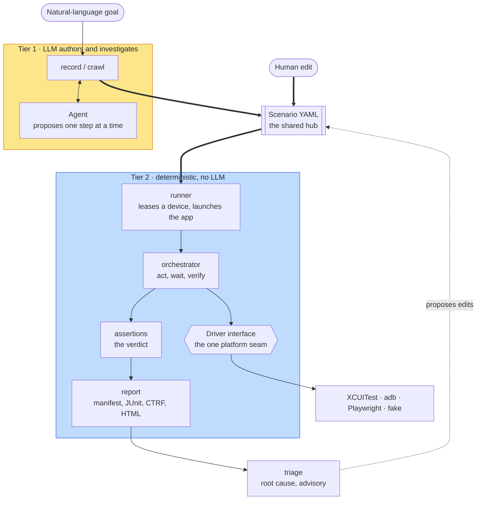
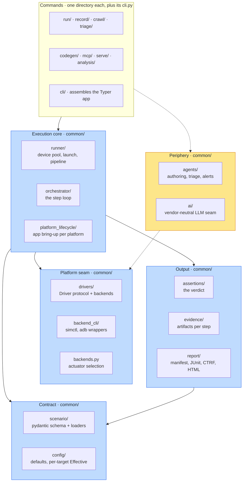
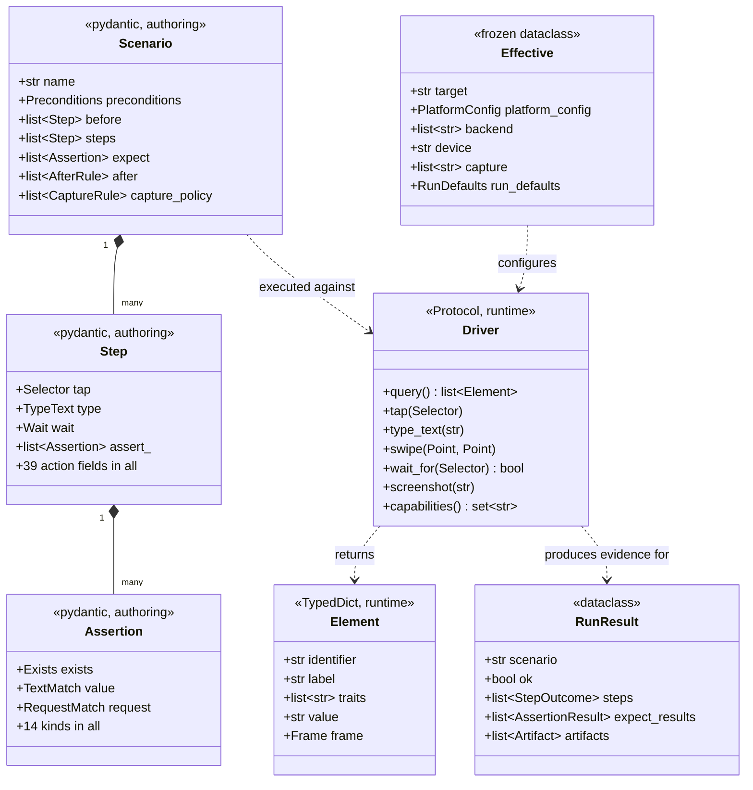
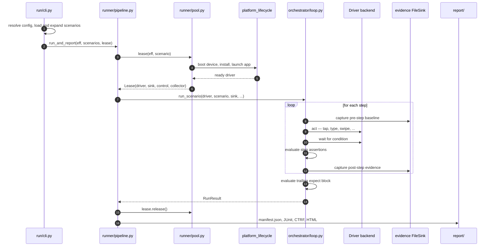
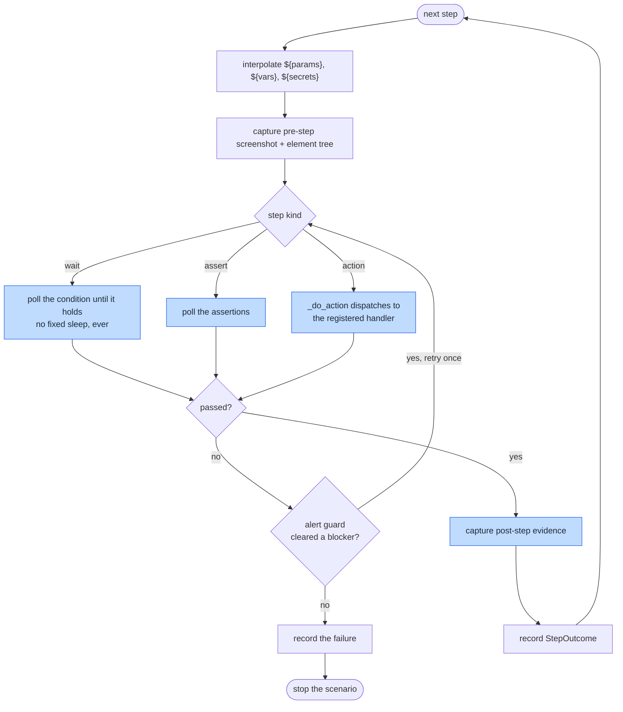
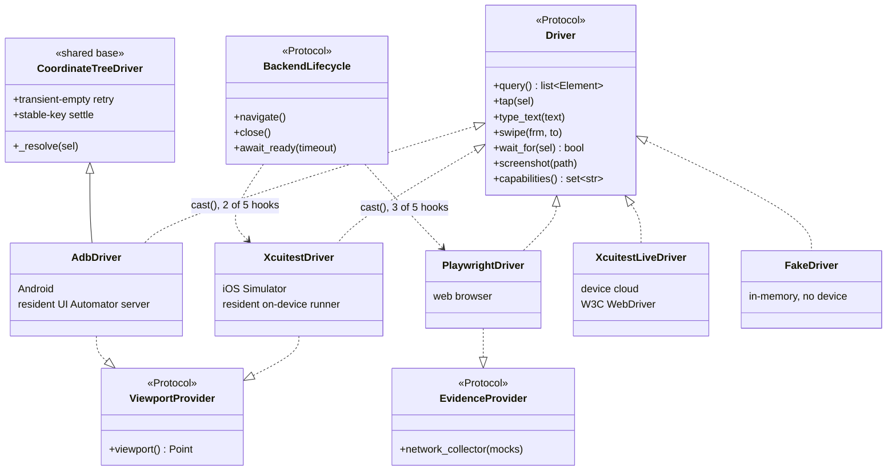
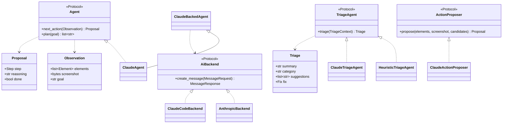

**English** · [日本語](ja/code-structure.md)

# Code structure: files, classes, and the path a run takes

> A reading guide to the source tree. Where each file sits, which classes live in it, how those
> classes combine into the features Bajutsu advertises, and what each class does while a scenario
> runs.

Related: [architecture](architecture.md) · [concepts](concepts.md) · [run loop](run-loop.md) ·
[drivers](drivers.md) · [glossary](glossary.md)

---

## How to read this page

The page runs in one direction, from the outside in. It opens with a picture of the whole system,
then locates every file, then names the handful of types that carry the rest of the code. After
that it follows a single command through the code and describes each class in turn. A
reader who starts at the top and stops anywhere still ends with a complete, if coarser, picture.

Three companion pages carry the depth this reading guide leaves out.
[Architecture](architecture.md) holds the module table and the dependency-layer contract.
[Run loop](run-loop.md) explains the deterministic runner's semantics. [Drivers](drivers.md)
explains each backend's platform seam. The [glossary](glossary.md) defines the domain vocabulary
term by term.

Two vocabulary notes make the rest readable. A **[scenario](glossary.md#scenario-authoring)** is one
YAML file describing a user flow as a list of steps. A
**[backend](glossary.md#driver-backend-actuator-platform)** is one platform's implementation of the driver
interface — XCUITest for the iOS Simulator, adb for Android, Playwright for a web browser.

---

## 1. The shape of the system

Bajutsu splits into two tiers that never mix. Tier 1 uses a large language model (LLM) to *author* a
scenario and to *investigate* a failure. Tier 2 replays that scenario deterministically and derives
the verdict from machine-checkable assertions, with no model anywhere on the path. The scenario file
is the hub between the two: Tier 1 writes it, humans own and edit it afterwards, and Tier 2 consumes
it.

![Conceptual diagram. A natural-language goal enters Tier 1, where the record and crawl commands drive an agent that writes a scenario YAML file. Humans edit that file directly. Tier 2 reads the same file: the runner leases a device, the orchestrator executes each step through one Driver interface, the assertion evaluator produces the verdict, and the reporter writes the run artifacts. The Driver interface is the single platform seam, behind which sit the XCUITest, adb, Playwright, and fake backends. On failure the triage command reads the run artifacts and proposes edits back to the scenario.](assets/diagrams/code-structure-concept.svg)

<details>
<summary>Mermaid source</summary>

<!-- mermaid-svg: assets/diagrams/code-structure-concept.svg -->


</details>

Three properties of the picture explain most of the code's shape.

- **The verdict path holds no model.** Prime directive 1 forbids an LLM anywhere in `run` or in the
  continuous integration (CI) gate, so the whole Tier 2 column stays free of the AI packages.
- **One seam, many platforms.** Every platform difference hides behind the `Driver` interface, so a
  new platform means a new backend rather than a fork of the core.
- **The scenario is the durable artifact.** Nothing else persists between sessions, so the scenario
  schema doubles as the contract every feature reads.

---

## 2. Where the files live

### 2.1 The repository's top level

| Path | What lives there |
|---|---|
| [`bajutsu/`](https://github.com/bajutsu-e2e/bajutsu/tree/main/bajutsu) | The Python logic core: 324 files, roughly 78,000 lines. Everything the rest of this page describes. |
| [`tests/`](https://github.com/bajutsu-e2e/bajutsu/tree/main/tests) | The deterministic test suite: 381 files, roughly 125,000 lines. Larger than the code it covers. |
| [`BajutsuKit/`](https://github.com/bajutsu-e2e/bajutsu/tree/main/BajutsuKit) | The Swift test-support package: the resident XCUITest runner, the in-app collector, the WebView and z-order channels. |
| `BajutsuAndroid/` · `BajutsuAndroidUIAutomatorServer/` | The Kotlin counterparts: the in-app hooks and the resident UI Automator server. |
| [`demos/`](https://github.com/bajutsu-e2e/bajutsu/tree/main/demos) | Runnable examples, including the showcase fixture built five times across platforms. |
| [`scenarios/`](https://github.com/bajutsu-e2e/bajutsu/tree/main/scenarios) | Scenario YAML files the repository runs against its own fixtures. |
| [`docs/`](https://github.com/bajutsu-e2e/bajutsu/tree/main/docs) · `docs/ja/` | This documentation, English and its Japanese mirror. |
| [`roadmaps/`](https://github.com/bajutsu-e2e/bajutsu/tree/main/roadmaps) | One directory per roadmap item, bilingual, carrying the rationale behind each decision. |
| [`scripts/`](https://github.com/bajutsu-e2e/bajutsu/tree/main/scripts) | Repository tooling: the linters, the diagram renderer, the repository map. |

### 2.2 The `bajutsu/` package

The package splits into a shared `common/` core and one directory per user-facing command. A command
directory holds that command's own logic plus its `cli.py`, which registers the Typer command. The
map below groups the directories by the job they do rather than alphabetically.

![Package map. The command layer holds cli, run, record, crawl, triage, codegen, mcp, serve, and analysis. Below it, the execution core holds common/runner, common/orchestrator, and common/platform_lifecycle. Below that, the platform seam holds common/drivers, common/backend_cli, and common/backends. To the side, the contract layer holds common/scenario and common/config, and the output layer holds common/assertions, common/evidence, and common/report. A separate periphery column holds common/agents and common/ai, which the command layer reaches but the execution core never does.](assets/diagrams/code-structure-packages.svg)

<details>
<summary>Mermaid source</summary>

<!-- mermaid-svg: assets/diagrams/code-structure-packages.svg -->


</details>

`common/` holds a further set of single-purpose helpers: `capability/` (what a backend supports),
`run_meta/` (run identity and artifact storage), `analytics/` (token and cost accounting),
`evidence/`, `devices/`, `provisioning/`, `github/`, and `cloud/`. The
[module table in architecture.md](architecture.md#module-list-and-roles) describes each in one row.

### 2.3 Finding a file without reading the tree

Three commands print a fresh map on every run, so no committed index goes stale.

```bash
make repo-map ARGS="--code"              # every package and top-level module
make repo-map ARGS="--docs"              # every docs page, with its own summary
make repo-map ARGS="--headings docs/x.md" # one file's headings and their spans
```

---

## 3. The four contracts everything else builds on

Four types carry the load. Most of the remaining classes exist to produce one of the four, consume
one, or move one across a boundary. Learning the four first makes every later class legible.

![Class diagram of the four contracts. Scenario holds a name, preconditions, before, steps, expect, after, and capturePolicy, and aggregates Step, which in turn holds Assertion and Selector. Driver is a protocol with query, tap, type_text, swipe, wait_for, screenshot, and capabilities, and it returns Element values and accepts runtime Selector values. Effective is the resolved configuration for one target, holding a target name, a platform_config discriminated union, a backend list, and run defaults. RunResult holds a scenario name, an ok flag, StepOutcome values, the trailing assertion results, and artifacts, and the reporter renders it.](assets/diagrams/code-structure-contracts.svg)

<details>
<summary>Mermaid source</summary>

<!-- mermaid-svg: assets/diagrams/code-structure-contracts.svg -->


</details>

**`Scenario`** ([`common/scenario/models/`](https://github.com/bajutsu-e2e/bajutsu/tree/main/bajutsu/common/scenario/models))
is the authoring model, built on pydantic with `extra="forbid"`, so an unknown key fails the load
rather than passing unnoticed. A `Step` carries one of 39 action fields, an `Assertion` one of 14
kinds. The strictness matters because the scenario is the single artifact that outlives a session.

**`Driver`** ([`common/drivers/base.py`](https://github.com/bajutsu-e2e/bajutsu/blob/main/bajutsu/common/drivers/base.py))
is the runtime contract: a `Protocol` of 23 methods that every backend satisfies. Beside it
sit the runtime `Element` and `Selector`, both `TypedDict` rather than pydantic models, because the
step loop touches them thousands of times per run. The authoring `Selector` converts to the runtime
one through `as_selector()`.

**`Effective`** ([`common/config/effective.py`](https://github.com/bajutsu-e2e/bajutsu/blob/main/bajutsu/common/config/effective.py))
is one target's fully resolved configuration: the team defaults overlaid by that target's own block,
frozen so nothing downstream rewrites it. The platform-specific knobs narrow behind a single
`platform_config: PlatformConfig` field — a discriminated union of `IosConfig | WebConfig |
AndroidConfig` — rather than one optional field per platform, so a new platform adds a union member
instead of a new sibling field every reader must learn to ignore. Every app-specific difference
lives here, which keeps the tool itself app-agnostic.

**`RunResult`** ([`common/orchestrator/types.py`](https://github.com/bajutsu-e2e/bajutsu/blob/main/bajutsu/common/orchestrator/types.py))
is one scenario's outcome: the verdict, one `StepOutcome` per step, the trailing assertion results,
and every artifact captured along the way. The reporter renders a list of them and nothing else.

---

## 4. Layers, and the boundary the gate enforces

The packages sort into three layers, and the gate checks the sort. `make lint-imports` runs
[import-linter](https://import-linter.readthedocs.io/) against layers declared in `pyproject.toml`,
so a forbidden import fails `make check` rather than surviving until someone notices.

| Layer | Members | Rule |
|---|---|---|
| **Deterministic core** | `orchestrator/`, `runner/`, `drivers/base.py`, `assertions/`, `evidence/`, `report/`, `config/`, `scenario/`, `capability/` | Must not import the periphery, and must stay free of the hosting extras. |
| **Contract** | `scenario/` and `drivers/base.py` | Must not import the runtime core, so a consumer can depend on the schema without pulling the runner in. |
| **Periphery** | `serve/`, `mcp/`, `codegen/`, `agents/`, `ai/`, `record/`, `crawl/`, `triage/` | Each removable behind an optional install extra. |

The core-must-not-import-periphery rule enforces prime directive 1 statically. A pure element-tree
helper that a core module needs lives in the core rather than in `record/`, and the resolved AI
settings live in `config/` as a plain `AiConfig`, so the core reads them without importing an AI
client. [Architecture](architecture.md#enforced-layer-boundaries-be-0112) records the full contract
set.

---

## 5. What happens when a scenario runs

`bajutsu run` is the command every other Tier 2 path resembles. Following it once explains the
runner, the orchestrator, the driver layer, and the reporter together.

![Sequence diagram of one run. The CLI resolves the config and loads the scenarios, then asks the runner pipeline to run them all. The pipeline asks the device pool for a lease; the pool asks the platform environment to boot the device and launch the app, and returns a Lease bundling a live Driver with the evidence sink and the network collector. The pipeline hands the scenario to the orchestrator, which loops per step: it captures a pre-step baseline, dispatches the action to the driver, waits for a condition, evaluates assertions, and captures post-step evidence. After the last step the orchestrator evaluates the trailing expect block and returns a RunResult. The pipeline releases the lease and the reporter writes manifest.json, JUnit XML, CTRF JSON, and the HTML report.](assets/diagrams/code-structure-run-sequence.svg)

<details>
<summary>Mermaid source</summary>

<!-- mermaid-svg: assets/diagrams/code-structure-run-sequence.svg -->


</details>

The numbered walk below names the file behind each arrow.

1. **Resolve the configuration.** `run/cli.py` reads the config file, overlays the target's block,
   and produces one frozen `Effective`. Command-line flags override the file.
2. **Load and expand the scenarios.** `common/scenario/load.py` parses each YAML file into
   `Scenario` models. `expand.py` then resolves the compile-time constructs: `use:` macros expand
   into their component's steps, and a data-driven scenario becomes one instance per data row.
3. **Select the backend.** `common/backends.py` picks the actuator. Given several candidates it
   picks the cheapest one whose capability set covers the scenario's needs.
4. **Lease a device.** `common/runner/pool.py` bounds concurrency and hands out a `Lease`, which
   bundles the live driver with that device's evidence sink, relaunch function, device control, and
   network collector. `common/platform_lifecycle/` performs the platform-specific bring-up behind
   one `RunEnvironment` protocol, so the pool never branches on the backend name.
5. **Run the scenario.** `common/orchestrator/loop.py` executes the step list. Section 5.1 covers
   one step in detail.
6. **Decide the verdict.** `common/assertions/evaluate.py` evaluates every assertion. The function
   is total: it returns a failing `AssertionResult` rather than raising, so one bad assertion never
   aborts the run.
7. **Write the report.** `common/report/` renders the `RunResult` list into `manifest.json`, JUnit
   XML, Common Test Report Format (CTRF) JSON, and a self-contained HTML page. The manifest is the single source of truth the
   other three derive from.

### 5.1 One step, from the inside

Each step follows the same three beats: act, then wait, then verify. The orchestrator captures
evidence around the beats and guards the screen against interruptions between them.

![Flowchart of one step. The loop interpolates the step's variable references, captures a pre-step screenshot and element tree, then branches on the step kind. A wait step polls its condition; an assert step polls its assertions; every other kind dispatches to a registered one-shot action handler. Any of the three can fail. On failure the alert guard checks for a blocking system dialog, and if it clears one the step retries once. Success or exhausted retry both lead to capturing post-step evidence, recording a StepOutcome, and moving to the next step. A failure stops the scenario at the first failing step.](assets/diagrams/code-structure-step-loop.svg)

<details>
<summary>Mermaid source</summary>

<!-- mermaid-svg: assets/diagrams/code-structure-step-loop.svg -->


</details>

Two rules of the loop follow directly from prime directive 2, determinism first. A wait never sleeps
for a fixed duration; it polls a condition until the condition holds or the budget expires. An
ambiguous selector fails immediately rather than acting on whichever element matched first.

---

## 6. The classes, layer by layer

### 6.1 The scenario model

[`common/scenario/`](https://github.com/bajutsu-e2e/bajutsu/tree/main/bajutsu/common/scenario) holds
the authoring schema in `models/` and the pipeline that turns text into runnable objects around it.

| File | Classes and functions | Job |
|---|---|---|
| `models/scenario.py` | `Scenario`, `Component`, `ScenarioFile`, `Preconditions`, `SystemAlertHandling` | The top-level document and the per-scenario setup. |
| `models/steps.py` | `Step`, `If`, `ForEach`, `Use`, `Web`, `Interrupt`, `AfterRule`, `Extract` | One step, plus the control-flow and lifecycle wrappers. |
| `models/assertions.py` | `Assertion`, `Exists`, `TextMatch`, `CountMatch`, `RequestMatch`, `VisualMatch`, `GoldenMatch` | The 14 assertion kinds. |
| `models/actions.py` | `TypeText`, `Swipe`, `Scroll`, `HttpRequest`, `Generate`, `Email`, `Totp`, and more | One model per action's arguments. |
| `models/selector.py` | `Selector` | The authoring selector, converted to the runtime one by `as_selector()`. |
| `load.py` · `load_expanded.py` | `load_scenario_file`, `load_scenarios` | Parse YAML, check the schema version. |
| `expand.py` | `expand_components`, `expand_data`, `apply_setups` | Resolve `use:` macros and data rows before the run. |
| `interp.py` | `interpolate` | Substitute `${params.x}`, `${row.x}`, `${secrets.x}`, and `${vars.x}`. |
| `select.py` · `edit.py` · `serialize.py` | filtering, programmatic edits, YAML output | Support `--only`, triage's fixes, and the authoring paths. |

The split between compile time and run time matters. `expand.py` runs once, before any device is
touched, so the step list the orchestrator sees holds no macros. The run loop therefore never needs
to resolve a component mid-scenario.

### 6.2 The driver layer

[`common/drivers/base.py`](https://github.com/bajutsu-e2e/bajutsu/blob/main/bajutsu/common/drivers/base.py)
is the determinism core, and it is the one file worth reading in full. Beyond the `Driver` protocol
it holds the resolution functions every backend shares.

![Class diagram of the driver layer. The Driver protocol declares query, tap, type_text, swipe, wait_for, screenshot, and capabilities. XcuitestDriver, AdbDriver, PlaywrightDriver, XcuitestLiveDriver, and FakeDriver all satisfy it. AdbDriver additionally inherits the shared CoordinateTreeDriver base, which supplies retry, settle, and resolve behavior for coordinate backends. Alongside the main protocol sit narrow optional protocols such as EvidenceProvider and ViewportProvider, each satisfied structurally by the backends that support the behavior. BackendLifecycle is drawn separately: it is a typing umbrella over five lifecycle hooks split disjointly across backends, reached through an explicit cast rather than an isinstance check, so PlaywrightDriver and XcuitestDriver each implement only their own subset of its hooks.](assets/diagrams/code-structure-driver-classes.svg)

<details>
<summary>Mermaid source</summary>

<!-- mermaid-svg: assets/diagrams/code-structure-driver-classes.svg -->


</details>

**`resolve_unique(elements, sel)`** carries prime directive 2 on its own. It narrows one `query()`
snapshot to exactly one element. Nothing matched raises `ElementNotFound`; two content-distinct
matches raise `AmbiguousSelector`. The function never picks a winner by position *on its own*,
because acting on whichever element matched first is the flakiness the whole design exists to
prevent; only an author's explicit `index` selects the nth of several content-distinct candidates,
the documented last resort ([selectors](selectors.md)). Two refinements soften the rule without
weakening it: candidates reporting identical content collapse to one, since nothing distinguishes
them for an author to disambiguate on, and a generic `other`-trait wrapper drops out when a
classified sibling shares its label.

**Narrow optional protocols** carry the capability differences between platforms. Rather than one
fat interface every backend must stub out, `base.py` declares small protocols — `EvidenceProvider`,
`ViewportProvider`, `ReadLagProvider`, `ReadOrderProvider`, `SettledReadProvider`,
`RawSourceProvider`, `SettledCacheInvalidator` — and a caller checks membership at runtime. A
backend implements a narrow protocol purely when its platform genuinely supports the behavior.
`BackendLifecycle` is the deliberate exception: the concrete drivers own disjoint subsets of its
five hooks (`PlaywrightDriver` implements `navigate`/`close`/`reset_context`; `XcuitestDriver`
implements `await_ready`/`health_ready`), so none of them satisfies a structural `isinstance`. The
`platform_lifecycle` environments reach each hook through `cast(BackendLifecycle, driver)` instead
— a typing umbrella over the call sites, not a conformance target.

**`FakeDriver`** deserves its own note. The in-memory backend lets the entire orchestrator run
without a device, which is why the deterministic gate runs on Linux in seconds and needs no
Simulator.

### 6.3 The environment layer

[`common/platform_lifecycle/`](https://github.com/bajutsu-e2e/bajutsu/tree/main/bajutsu/common/platform_lifecycle)
answers a question the driver deliberately does not: how does the app get onto a device and become
ready? `protocols.py` declares `RunEnvironment` and `CrawlEnvironment`, and `environments/` supplies
one implementation per platform — `ios`, `xcuitest`, `xcuitest_live`, `android`, `web`, and `fake`.

The protocol covers bring-up (`start`), readiness, relaunch, device control, teardown, and the
per-platform answers to questions the runner needs — whether the platform records video up front,
whether it observes network traffic through the driver, and whether its resident runner survives
between scenarios. Because the answers live behind the protocol, `runner/pool.py` and `crawl/cli.py`
drive iOS, Android, and web through one interface rather than branching on the actuator name.

### 6.4 The runner

[`common/runner/`](https://github.com/bajutsu-e2e/bajutsu/tree/main/bajutsu/common/runner) turns a
config plus a scenario list into a report.

| File | Key classes | Job |
|---|---|---|
| `pipeline.py` | `_ScenarioRunner`, `run_all`, `run_and_report`, `run_matrix_and_report` | One run's shared context, applied to each scenario in turn. |
| `pool.py` | `device_pool` | Bound concurrency, hand out leases, tear down cleanly. |
| `types.py` | `Lease` | A live driver bundled with its sink, relaunch, control, and collector. |
| `device_provider.py` | `DeviceProvider`, `DeviceLease`, `_LocalProvider`, `_AppiumProvider` | Where the run's devices come from: local, or a reserved cloud device. |
| `recovery.py` | `RetryDecision`, `CrashRecoveryBudget`, `RunCrashRecoveryBudget` | Whether a crashed backend earns a retry, and how much wall-clock time recovery may spend. |
| `launch.py` · `launch_server.py` | `launch_driver` | Build the driver and bring the app up. |
| `mailbox.py` | transport registry | Resolve the `email` step's transport by kind. |

**`_ScenarioRunner`** is a frozen dataclass holding one run's shared context: the resolved config,
the lease factory, the redactor, the capability set, and the output knobs. Freezing it, and keeping
every per-scenario value local to `run_one`, is what lets two or more `ThreadPoolExecutor` workers share
one instance safely when `workers > 1`.

**Crash recovery sits beside the verdict, never inside it.** A backend crash is infrastructure, not
a test result, so `recovery.py` retries the scenario on a freshly leased device up to a bounded count
and a bounded wall-clock budget. Once the budget runs out the scenario fails loudly, which keeps a
genuinely crash-inducing scenario visible.

### 6.5 The orchestrator

[`common/orchestrator/`](https://github.com/bajutsu-e2e/bajutsu/tree/main/bajutsu/common/orchestrator)
holds the step loop. `loop.py` is the largest file in the core, and its structure repays a moment.

| Class or function | Role |
|---|---|
| `run_scenario()` | The entry point. Starts the requested evidence intervals, runs the `before`, main, and `after` phases, evaluates the trailing `expect`, and assembles the `RunResult`. |
| `StepLoopState` | The mutable state one phase carries: the accumulated variable bindings, the previous step's element tree, and the read counters. |
| `_LoopConfig` | The frozen half: the driver, sink, clock, alert guard, and scenario. |
| `_StepRunner` | The dispatcher. `exec_steps` walks the list; `_handle_if`, `_handle_for_each`, `_handle_web`, and `_handle_action` handle each step shape. |
| `_run_step_body()` | One step's effect, returning `(ok, reason, assertion_results, snapshot)`. Never raises for an expected failure. |
| `_InterruptGuard` | Fires a scenario's `interrupts` handlers when an interstitial screen appears mid-run. |
| `_ScreenRead` | A lazily cached element-tree read, so one step never queries the same screen twice. |

`types.py` holds the loop's vocabulary: `StepOutcome`, `RunResult`, `AlertEvent`, `AlertGuardConfig`,
`SelectionState`, and the `Clock` protocol that lets tests run without real sleeps. `waits.py` holds
the polling machinery and `WaitTrace`, which records a wait's poll timeline so a timeout stays
diagnosable from the artifacts alone.

**Action dispatch is a registry, not a conditional chain.**
[`actions/_registry.py`](https://github.com/bajutsu-e2e/bajutsu/blob/main/bajutsu/common/orchestrator/actions/_registry.py)
derives the runtime action list from the `Step` model itself, so declaring a field on `Step` makes
the action visible automatically. Handlers live in `actions/handlers/` grouped by theme — `gestures`,
`scroll`, `device`, `navigation`, `http`, `generate`, `totp`, and `manual` — and register themselves
with an `@_handler(kind)` decorator. The dispatcher also owns the text-selection contract in one
place: `copy` requires an active selection, `select` establishes one, and every other action
invalidates it, which keeps the handlers stateless across backends.

### 6.6 Assertion evaluation

[`common/assertions/`](https://github.com/bajutsu-e2e/bajutsu/tree/main/bajutsu/common/assertions)
holds the verdict, and holds nothing else. `evaluate.py` keeps one evaluator per kind behind an
`@_evaluator("kind")` decorator, mirroring the action registry. `network.py` matches `request`,
`event`, and `requestSequence` against observed traffic; `visual.py` compares images; `schema.py`
validates a response body; `_common.py` defines the shared `AssertionResult`.

Two properties matter more than the individual evaluators. **Evaluation is total** — it returns a
failing result rather than raising, so a malformed assertion fails its own check without aborting the
run. And **`EvalContext` bundles the ambient inputs** an evaluator may need: the baseline directory
for a visual comparison, the schema directory, the golden directory, and the clipboard. A step-level
`assert` deliberately receives a narrowed context, since no fresh screenshot exists mid-step for a
visual comparison to read.

### 6.7 Evidence

[`common/evidence/`](https://github.com/bajutsu-e2e/bajutsu/tree/main/bajutsu/common/evidence)
answers what a run leaves behind.

- **`core.py`** declares the `EvidenceSink` protocol with two implementations. `NullSink` records
  nothing and costs nothing, and the run loop checks for it before paying for an extra query.
  `FileSink` writes artifacts under the run directory.
- **`intervals.py`** runs the scenario-wide recordings — video and the device log — as child
  processes, started before the first step and finalized after verification. Every interval kind is
  opt-in, so a scenario requesting none records none.
- **`network.py`** holds `NetworkExchange`, the observed-request model both the in-app collectors and
  the Playwright hook produce, plus the deterministic in-protocol mocks.
- **`redaction.py`** holds `Redactor`, which masks secret values, configured labels, headers, and
  fields before anything reaches disk.
- **`visual.py`** and **`golden.py`** compare a screenshot against a baseline image and an element
  tree against a recorded tree.

Evidence capture is expressed as a rule that fires repeatedly, not as a one-shot instruction. A
scenario's `capturePolicy` names triggers, and the loop fires the matching rules at every step, so a
second run collects the same evidence with no AI involved.

### 6.8 Reporting

[`common/report/`](https://github.com/bajutsu-e2e/bajutsu/tree/main/bajutsu/common/report) renders
the `RunResult` list four ways. `manifest.py` writes `manifest.json` and the JUnit XML; `ctrf.py`
writes the CTRF JSON; `html.py`, `rows.py`, `panels.py`, and `richtext.py` build the interactive HTML
page; `archive.py` and `load.py` export a finished run as a `.zip` and reload it offline for
re-rendering. `manifest.json` is the single source of truth, and CI reads it rather than parsing the
HTML.

---

## 7. The Tier 1 paths: authoring and investigation

Three commands reach a model, and each keeps the model behind a narrow protocol so the deterministic
core never sees it.

![Class diagram of the Tier 1 paths. The Agent protocol declares next_action, taking an Observation and returning a Proposal, and plan, taking a goal. ClaudeAgent implements it on top of ClaudeBackedAgent, which in turn talks to the AiBackend protocol. AiBackend has three adapters: AnthropicBackend for the API and Bedrock, ClaudeCodeBackend for the Claude Code CLI, and a disabled backend whose factory raises. The record loop drives the Agent. The crawl engine drives an ActionProposer, implemented deterministically or by ClaudeActionProposer. The triage command drives a TriageAgent, implemented by the rule-based HeuristicTriageAgent or by ClaudeTriageAgent, and both produce a Triage verdict holding a summary, a category, plain-text suggestions, and at most one structured Fix.](assets/diagrams/code-structure-tier1.svg)

<details>
<summary>Mermaid source</summary>

<!-- mermaid-svg: assets/diagrams/code-structure-tier1.svg -->


</details>

**`record/`** authors a scenario from a natural-language goal.
[`loop.py`](https://github.com/bajutsu-e2e/bajutsu/blob/main/bajutsu/record/loop.py) runs observe →
propose → execute → emit: it reads the screen into an `Observation`, asks the `Agent` for a
`Proposal`, executes the proposed `Step` through the same `_do_action` dispatcher the deterministic
loop uses, and appends the step to the growing scenario. Reusing the dispatcher is what makes a
recorded step replayable. `capture.py` covers the proxy-actuation path, where a human drives the app
and the recorder captures the resulting steps.

**`crawl/`** explores an app breadth-first and emits a screen map.
[`core.py`](https://github.com/bajutsu-e2e/bajutsu/blob/main/bajutsu/crawl/core.py) holds the graph
types — `Fingerprint`, `Node`, `Edge`, `Action`, `ScreenMap` — and the `_Coordinator` that walks
them. A screen's `Fingerprint` decides whether the crawl has been there before, so the walk
terminates. `guide.py` declares `ActionProposer` with a deterministic implementation beside the
model-backed `ClaudeActionProposer`, which keeps a crawl runnable with no credentials at all.

**`triage/`** investigates a failed run.
[`heuristic.py`](https://github.com/bajutsu-e2e/bajutsu/blob/main/bajutsu/triage/heuristic.py)
assembles a `TriageContext` from the run directory, and `HeuristicTriageAgent` derives a `Triage`
from rules alone. Each `Fix` carries structure rather than prose — `renameId`, `addIndex`, `raiseTimeout`
— so `--apply` can rewrite the scenario and `--rerun` can check the rewrite. `triage --ai` swaps in
`ClaudeTriageAgent` behind the same protocol. Triage is advisory in both forms: it proposes an edit
and never changes a verdict.

**`common/ai/`** keeps the vendor behind one seam. `AiBackend` normalizes the request and response
types, and `registry.py` maps a provider name onto an adapter: the Anthropic API and Amazon Bedrock
through `anthropic.py`, the Claude Code command-line interface through `claude_code.py`, and a
`disabled` provider whose factory raises so no AI path can construct a backend by accident.

---

## 8. codegen, serve, mcp, and analysis

**`codegen/`** turns a passing scenario into a native test.
[`common.py`](https://github.com/bajutsu-e2e/bajutsu/blob/main/bajutsu/codegen/common.py) declares
the `CodeGenerator` protocol — `file_preamble`, `scenario_open`, `step_lines`, `assertion_lines`,
`scenario_close`, `file_footer` — and `render_test_file` walks the scenario once, calling the
protocol. Three emitters implement it: `xcuitest.py` for Swift, `playwright.py` for TypeScript, and
`uiautomator.py` for Kotlin. A step whose behavior exists purely at run time raises rather than
emitting wrong code without a word.

**`serve/`** is the browser application. `state.py` holds `ServeState`, the process-wide state
bundling the job registry, the session manager, the scenario store, and the provider settings.
`routes.py` declares the routes as data, so both the standard-library handler (`handler.py`) and the
FastAPI application (`server/app.py`) serve the same route table. `executor.py` declares the
`RunExecutor` seam where local and hosted deployment diverge: `LocalExecutor` runs each job on a
daemon thread, while `DbQueueExecutor` enqueues it for a remote `bajutsu worker`. The execution body
in `jobs.py` stays identical on both sides.

**`mcp/`** exposes `run` and `doctor` as Model Context Protocol (MCP) tools and a run's evidence as
MCP resources, so an editor-side agent reaches the deterministic paths without a shell.

**`analysis/`** holds the read-only advisory reports, none of which gates CI: `audit` (a determinism
and flakiness audit), `coverage` (identifier-namespace coverage), `impact` (which steps a diff
affects), `stats` (run statistics in aggregate), `flakiness` (cross-run ranking), and `trace` (one run's
timeline).

---

## 9. Where to add something new

The map below turns the structure above into a starting point for the most common changes.

| Goal | Start here | Then |
|---|---|---|
| Support a new platform | `common/drivers/` — a new class satisfying `Driver` | Add a `RunEnvironment` under `platform_lifecycle/environments/`, register the actuator in `backends.py`, and run the driver conformance suite. |
| Add a step action | `common/scenario/models/steps.py` — a field on `Step` | Add a handler in `orchestrator/actions/handlers/`, then an emitter arm in each `codegen/` generator. |
| Add an assertion kind | `common/scenario/models/assertions.py` | Add an evaluator in `assertions/evaluate.py` behind `@_evaluator`. |
| Add a config knob | `common/config/schema.py`, then `effective.py` | Read it wherever the resolved `Effective` already reaches. |
| Add a CLI command | A `cli.py` beside the feature it belongs to | Register it in `cli/__init__.py`'s module list and classify it in `capability/capabilities.py`. |
| Add an evidence kind | `common/evidence/core.py` | Extend the `capturePolicy` schema and the report renderer. |

Two rules hold across every row. A change on the verdict path must not reach an AI package, and the
gate checks the rule mechanically. A change that adds behavior needs a test that would fail without
it, since the deterministic suite is the regression net.

---

## 10. Further reading

- [Architecture](architecture.md) — the module table, the dependency layers, and the implementation
  status of everything the design describes.
- [Run loop](run-loop.md) — the deterministic runner's semantics in depth.
- [Drivers](drivers.md) — each backend's platform seam and capability set.
- [Selectors](selectors.md) — deterministic resolution, the determinism core in detail.
- [Scenarios](scenarios.md) and [DSL grammar](dsl-grammar.md) — the authoring reference and the
  normative grammar.
- [API reference](api/index.md) — generated from the docstrings and typed signatures.
- [`DESIGN.md`](https://github.com/bajutsu-e2e/bajutsu/blob/main/DESIGN.md) — the design rationale,
  in Japanese.
