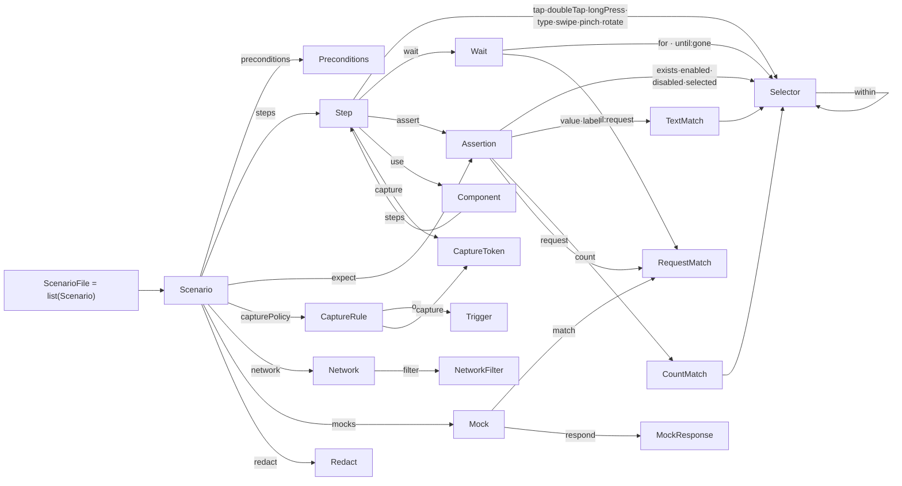

**English** · [日本語](ja/dsl-grammar.md)

# Scenario DSL grammar (formal reference)

This page is the **normative grammar** of the scenario DSL (domain-specific language): every production, type, default, and validation constraint, derived directly from the pydantic models in `bajutsu/scenario/` (the `models/` subpackage; `extra="forbid"`, so unknown keys are rejected). Where [scenarios](scenarios.md) is the authoring guide (how to write a scenario, with examples), this page is the language spec (what parses and what is rejected). It also covers the templating and macro layer — components, data-driven rows, and `setup` preludes — that surrounds the core grammar.

Related: [scenarios](scenarios.md) (authoring guide) · [selectors](selectors.md) (how selectors/assertions evaluate) · [evidence](evidence.md) · [getting-started](getting-started/index.md)

---

## 1. Notation

The DSL is a tree of YAML nodes, so the grammar is written over the **abstract structure**
(mappings / sequences / scalars), not a character stream.

| Form | Meaning |
|---|---|
| `X ::= …` | production: `X` is defined as … |
| `A \| B` | alternation: `A` or `B` |
| `T?` (on a value) | optional value |
| `{ k: T }` | a YAML mapping with key `k` of type `T` |
| `{ k?: T }` | key `k` is optional |
| `A & B` | a mapping carrying the keys of **both** `A` and `B` |
| `list(T)` | a YAML sequence whose items are `T` |
| `map(K, V)` | a YAML mapping from `K` to `V` |
| `"literal"` | an exact string (a key name or an enum value) |
| `<Name>` | a non-terminal (defined elsewhere on this page) |

Scalar terminals: `string`, `integer`, `number` (int or float), `boolean` (**only** `true` /
`false` — see [§3](#3-the-lexical-layer-yaml)), `any` (any YAML value).

Every mapping rejects keys it does not declare (`_Model`, `scenario/models/_base.py`).

---

## 2. Grammar at a glance

The **reference graph** below shows which non-terminal references which. It makes visible the recursion and sharing that are harder to trace in the EBNF text: `Selector`'s `within` self-loop, and how `RequestMatch` is shared by the `request` assertion, the `until: { request }` wait, and `Mock.match`. (Actions that carry only scalars and reference no shared non-terminal — `relaunch`, `setLocation`, `push`, `http`, and the device / status-bar steps — are omitted.)



And the productions in full:

```ebnf
# ── Files ──────────────────────────────────────────────────────────────
ScenarioFile  ::= list(<Scenario>)          # top level MUST be a sequence
ComponentFile ::= <Component>               # a single mapping (loaded separately)

# ── Scenario ───────────────────────────────────────────────────────────
Scenario ::= {
  name:            string,                  # required
  tags?:           list(string),            # default []  — selection (§6.4)
  data?:           list(map(string,string)),# inline rows   ┐ XOR
  dataFile?:       string,                  # CSV path      ┘ (§6.3)
  preconditions?:  <Preconditions>,         # default {}
  steps:           list(<Step>),            # required
  expect?:         list(<Assertion>),       # default []  — final checks
  capturePolicy?:  list(<CaptureRule>),     # default []
  network?:        <Network>,
  mocks?:          list(<Mock>),            # default []
  redact?:         <Redact>,
  alertHandling?:  <AlertHandling>,         # alert guard; on when unset
  permissions?:    <Permissions>,           # pre-launch OS permission state; default {}
}

Component ::= { params?: list(string), steps: list(<Step>) }

# ── Preconditions ──────────────────────────────────────────────────────
Preconditions ::= {
  erase?:      boolean,                     # default false — simctl erase first
  reinstall?:  ("clean" | "overwrite"),     # default "clean" — app reinstall when config sets appPath
  launchArgs?: list(string),                # default []
  launchEnv?:  map(string,string),          # default {}    — injected as SIMCTL_CHILD_*
  deeplink?:   string,
  locale?:     string,
  setup?:      string,                      # a reusable prelude file (§6.4)
}

# ── AlertHandling (vision alert guard; on by default) ──────────────────
AlertHandling ::= boolean                                   # shorthand for { enabled: <bool> }
               | { enabled?: boolean,                       # default true
                   instruction?: string }                   # button to tap (else dismiss)

Permissions ::= map(PermissionService, PermissionAction)    # applied before the app launches
PermissionService ::= "location" | "camera" | "microphone" | "contacts"
                     | "photos" | "calendar" | "notifications"
PermissionAction  ::= "grant" | "revoke"

# ── Step = exactly one Action + optional modifiers ─────────────────────
Step      ::= <Action> & <StepMods>
StepMods  ::= { capture?: list(<CaptureToken>), extract?: map(string, <Extract>), name?: string }
Extract   ::= { sel: <Selector>, prop?: ("value"|"label"|"identifier") }   # default "value"
Action    ::=
    { tap:         <Selector> }
  | { tapPoint:    { x: number, y: number } }   # normalized 0..1 (top-left origin); vision fallback for a control absent from the tree (e.g. a no-id tab-bar tab)
  | { doubleTap:   <Selector> }
  | { longPress:   { sel: <Selector>, duration: number } }
  | { type:        { text: string, into?: <Selector>, submit?: boolean } }   # submit default false
  | { clear:       { into: <Selector> } }                  # focus the field and remove its entire current content (web-context raises)
  | { delete:      { into: <Selector>, count: integer } }  # focus the field and delete count characters from the end (count > 0; web-context raises)
  | { select:      { into: <Selector>, mode?: "all" } }    # focus the field and select its content (mode default "all"; idb/web-context raise → codegen to XCUITest)
  | { copy:        {} }                                    # copy the active selection to the clipboard (requires a prior select; idb/web-context raise)
  | { selectOption:{ sel: <Selector>, option: string } }   # set a web <select> to the option with this value (web only; iOS/Android raise)
  | { swipe:       <Swipe> }                          # directional form scrolls; coordinate form is a raw drag
  | { drag:        <Drag> }                           # pointer-drag a grabbed element (handle / divider / slider), not a scroll
  | { back:        {} }                               # navigate back (Android system key / iOS OS back button / web history)
  | { pinch:       { sel: <Selector>, scale: number } }    # scale > 0  (>1 in, <1 out)
  | { rotate:      { sel: <Selector>, radians: number } }  # >0 clockwise
  | { handleSystemAlert: { sel: <Selector>, timeout: number } }  # tap an iOS SpringBoard permission prompt (iOS/XCUITest only); sel accepts only label/labelMatches/index
  | { wait:        <Wait> }
  | { assert:      list(<Assertion>) }
  | { relaunch:    { env?: map(string,string), args?: list(string) } }
  | { setLocation: { lat: number, lon: number } }
  | { push:        { payload: map(string,any) } }          # APNs payload, e.g. {aps:{alert:"…"}}
  | { http:        { method?: string, url: string, headers?: map(string,string), body?: string, status?: integer, saveBody?: string } }  # method default GET; saveBody → vars.<name>
  | { totp:        { secret: string, into: { var: string } } }  # RFC 6238 OTP → vars.<var> (secret is base32)
  | { email:       { match: { to?: string, subject?: string, subjectMatches?: string }, extract: { var: string, bodyMatches: string }, timeout: number } }  # poll mailbox → vars.<var>
  | { background:       {} }                               # Home button (backgrounds via SpringBoard, no terminate)
  | { clearKeychain:    {} }                               # reset saved passwords / certificates
  | { clearClipboard:   {} }                               # clear the pasteboard
  | { overrideStatusBar: { time?: string, batteryLevel?: integer, batteryState?: string, cellularBars?: integer, wifiBars?: integer } }
  | { clearStatusBar:   {} }                               # restore the live status bar
  | { use:         { component: string, with?: map(string,string) } }   # macro (§6.2)
  | { if:          <If> }                                               # conditional (no capture/extract)
  | { forEach:     <ForEach> }                                          # loop (no capture/extract)
  | { manual:      { label: string, bypass?: string } }                # human takeover recorded during `record` (BE-0185); fails loudly at run time — no deterministic equivalent unless `bypass` is wired

If ::= { condition: <Assertion>, then: list(<Step>), else?: list(<Step>) }
ForEach ::= { sel: <Selector>, as: string, steps: list(<Step>) }

Swipe ::=
    { on: <Selector>, direction: ("up"|"down"|"left"|"right"), amount?: number }   # selector form  ┐ XOR
  | { from: <Point>,  to: <Point> }                                                # coordinate form ┘
    # amount (selector form only): travel as a fraction of the screen, 0 < amount ≤ 1; omitted = a small default fraction (0.125)
Drag ::= { on: <Selector>, direction: ("up"|"down"|"left"|"right"), amount?: number }   # element-anchored pointer drag (BE-0227), amount as in Swipe
Point ::= [ number, number ]

# ── Selector (≥1 field; provided fields are AND-ed) ────────────────────
Selector ::= {
  id?:           string,
  idMatches?:    string,        # glob over the id (fnmatch, e.g. "list.row.*")
  label?:        string,
  labelMatches?: string,        # regex over the label
  traits?:       list(string),
  value?:        string,
  within?:       <Selector>,    # restrict to a container's subtree
  index?:        integer,       # pick the k-th match when intentionally non-unique
}

# ── Wait (exactly one of for / until) ──────────────────────────────────
Wait  ::= { for: <Selector>, timeout: number }
        | { until: <Until>,   timeout: number }
Until ::= "screenChanged" | "settled"
        | { gone: <Selector> }
        | { request: <RequestMatch> }

# ── Assertions (exactly one kind per item) ─────────────────────────────
Assertion ::=
    { exists:   <Selector> & { negate?: boolean } }   # selector inline; negate default false
  | { value:    <TextMatch> }
  | { label:    <TextMatch> }
  | { count:    <CountMatch> }
  | { enabled:  <Selector> }
  | { disabled: <Selector> }
  | { selected: <Selector> }
  | { request:  <RequestMatch> }
  | { visual:   <VisualMatch> }
  | { clipboard: <ClipboardMatch> }   # read-back of the device pasteboard (simctl pbpaste)

TextMatch  ::= { sel: <Selector> } & ( {equals:string} | {contains:string} | {matches:string} )
CountMatch ::= { sel: <Selector> } & ( {equals:integer} | {atLeast:integer} | {atMost:integer} )
ClipboardMatch ::= ( {equals:string} | {matches:string} )   # exactly one; matches is a regex

VisualMatch ::= {                  # pixel-compare the screen against a baseline image
  baseline:   string,             # filename resolved inside --baselines (default: baselines/ beside the scenario)
  element?:   <Selector>,         # scope the comparison to this element's frame (BE-0171; default: whole screen)
  compare?:   "exact" | "pixelmatch",  # comparison engine (default: config or "exact"; BE-0165)
  threshold?: number,             # max allowed diff, % of pixels (default 0.0 = exact)
  colorTolerance?: number,        # per-pixel perceptual color tolerance, 0–1 (pixelmatch; default 0.1)
  antialiasing?: boolean,         # discount anti-aliased pixels from the diff (pixelmatch; default true)
  exclude?:   list(<ExcludeRegion> | <SelectorRegion>),  # regions masked before comparing (status bar, clock, …)
}
ExcludeRegion  ::= { x: number, y: number, w: number, h: number }   # screenshot pixels
SelectorRegion ::= { selector: <Selector> }   # mask the element's frame (BE-0171); ambiguous → fail, no match → no-op

RequestMatch ::= {              # ≥1 of the match fields below
  method?:      string,
  url?:         string,         # exact full URL (the endpoint)
  urlMatches?:  string,         # regex/substring over the URL (query strings live here)
  path?:        string,         # exact path (query ignored)
  pathMatches?: string,         # regex over the path
  status?:      integer,
  bodyMatches?: string,         # regex/substring over the request body
  count?:       integer,        # assertion → exact count; wait → lower bound
}

# ── Evidence capture ───────────────────────────────────────────────────
CaptureToken ::= <Kind> ( "." <Modifier> )?
Kind     ::= "screenshot" | "elements" | "actionLog" | "deviceLog" | "network" | "video" | "appTrace"
Modifier ::= "before" | "after" | "around" | "onError"

CaptureRule ::= { on: <Trigger>, capture: list(<CaptureToken>) }
Trigger ::=                                    # exactly one of action / event / result
    { action: string, idMatches?: string }     # idMatches only alongside action
  | { event: "screenChanged" }
  | { result: "error" }

# ── Network / mocks / redact ───────────────────────────────────────────
Network ::= { filter?: { domains?: list(string) } }
Redact  ::= { labels?: list(string), headers?: list(string), fields?: list(string) }
Mock    ::= { match: <RequestMatch>, respond?: <MockResponse> }   # match: request-side fields only
MockResponse ::= { status?: integer, headers?: map(string,string), body?: string, delayMs?: number }
```

> **Grammar vs. wiring.** This page specifies what **parses and validates**. How completely each
> action is actuated by a given backend, and which evidence kinds are acquired where, is a separate
> question tracked in [drivers](drivers.md) and the
> [architecture status table](architecture.md#implementation-status).

---

## 3. The lexical layer (YAML)

A scenario file is YAML, parsed by Bajutsu's loader (`_yaml.py`), with **one deliberate
deviation** from YAML 1.1:

- **Only `true` / `false` are booleans.** `on` / `off` / `yes` / `no` stay **strings**. This deviation keeps
  the `capturePolicy` trigger key `on:` a key (not the boolean `True`) and keeps id/label values
  like `on` intact. ([scenarios](scenarios.md#yaml-caveat))

Scalar mapping: YAML strings → `string`, YAML ints → `integer`, ints or floats → `number`, and a
`<Point>` is a two-element flow sequence `[x, y]`.

---

## 4. Cardinality & mutual-exclusion constraints

Beyond shapes, the models enforce these rules (each is a `model_validator`; a violation is a load
error). This table is the **authoritative list of "exactly one / at least one / not both"**.

| Construct | Rule | Source |
|---|---|---|
| `Selector` | **≥ 1** field present | `scenario/models/selector.py` |
| `Step` | **exactly one** action key (`tap` … `use`); `capture`/`name` are modifiers, not actions | `scenario/models/steps.py` |
| `Swipe` | **exactly one** form: `{on,direction}` **or** `{from,to}` — never mixed, never half-specified | `scenario/models/actions.py` |
| `Pinch` | `scale` **> 0** | `scenario/models/actions.py` |
| `HandleSystemAlert` | `sel` restricted to `label` / `labelMatches` / `index` (rejects `id`/`idMatches`/`traits`/`value`/`within`) | `scenario/models/actions.py` |
| `Wait` | **exactly one** of `for` / `until` | `scenario/models/assertions.py` |
| `Assertion` | **exactly one** kind (`exists` … `request` … `visual`) | `scenario/models/assertions.py` |
| `TextMatch` (`value`/`label`) | **exactly one** of `equals` / `contains` / `matches` | `scenario/models/assertions.py` |
| `CountMatch` (`count`) | **exactly one** of `equals` / `atLeast` / `atMost` | `scenario/models/assertions.py` |
| `ClipboardMatch` (`clipboard`) | **exactly one** of `equals` / `matches` | `scenario/models/assertions.py` |
| `RequestMatch` | **≥ 1** of `method`/`url`/`urlMatches`/`path`/`pathMatches`/`status`/`bodyMatches` (`count` is not a match field) | `scenario/models/assertions.py` |
| `Trigger` (`capturePolicy[].on`) | **exactly one** of `action` / `event` / `result`; `idMatches` only **with** `action` | `scenario/models/evidence.py` |
| `Scenario` | `data` and `dataFile` **not both** | `scenario/models/scenario.py` |
| every mapping | **no unknown keys** (`extra="forbid"`) | `scenario/models/_base.py` |

`exists` is special: its selector is written **inline** (`exists: { id: home.title }`), and an
optional `negate: true` checks *absence*. The loader rewrites that into `{ sel, negate }` before
validation (`Exists._inline`, `scenario/models/assertions.py`).

---

## 5. Defaults

Omitted optional keys take these values (so a minimal scenario is just `name` + `steps`).

| Field | Default |
|---|---|
| `Scenario.tags` / `expect` / `capturePolicy` / `mocks` | `[]` |
| `Scenario.preconditions` | `{}` (i.e. `erase: false`, `reinstall: clean`) |
| `Scenario.alertHandling` | unset (alert guard on; dismiss the prompt) |
| `Scenario.permissions` | `{}` (no pre-launch permission state applied) |
| `Preconditions.erase` | `false` |
| `Preconditions.reinstall` | `clean` |
| `Preconditions.launchArgs` | `[]` |
| `Preconditions.launchEnv` | `{}` |
| `AlertHandling.enabled` | `true` |
| `TypeText.submit` | `false` |
| `Exists.negate` | `false` |
| `MockResponse.status` | `200` |
| `MockResponse.headers` | `{}` |
| `Component.params` | `[]` |

A complete minimal scenario:

```yaml
- name: opens home
  steps:
    - tap:  { id: onboarding.start }
    - wait: { for: { id: home.title }, timeout: 5 }
  expect:
    - exists: { id: home.title }
```

---

## 6. The templating + macro layer

Around the core grammar sits a small substitution + expansion layer. It runs at load time,
**before** the deterministic run, so the runner only ever sees plain, fully-expanded scenarios.

### 6.1 `${namespace.key}` interpolation

Implementation: `bajutsu/interp.py`. A token is `${namespace.key}` (whitespace inside the braces is
trimmed). Substitution is **type-preserving at the edges**:

- A string that is **exactly one token** (`"${row.qty}"`) becomes the **raw bound value** (e.g. a
  number stays a number).
- A token **embedded** in a larger string is spliced in as text (`"item-${row.id}"`).
- A token whose namespace is not being substituted **right now is left intact**, so each layer fills
  only its own namespace.

Namespaces: `params.*` (components, §6.2), `row.*` (data-driven, §6.3), `secrets.*` (declared
via config `secrets:`, resolved from the environment by the run loop at action time, §6.4), and
`vars.*` (runtime capture via `extract`, §6.5).

### 6.2 Components (`use` → reusable steps)

A `<Component>` is a separate file (`ComponentFile`): a list of `params` and a list of `steps` that
reference them as `${params.<name>}`. A `use` step invokes it, binding the params via `with`:

```yaml
# login.component.yaml
params: [email, password]
steps:
  - type: { text: "${params.email}",    into: { id: auth.email } }
  - type: { text: "${params.password}", into: { id: auth.password } }
  - tap:  { id: auth.submit }
```

```yaml
# in a scenario
steps:
  - use: { component: login.component.yaml, with: { email: "a@b.com", password: "pw" } }
```

`expand_components` (`scenario/expand.py`) **replaces** each `use` with the component's substituted
steps, recursively (a component may itself `use` another, depth ≤ 25). It raises on a missing param,
an unknown param, a residual `${params.*}` referencing something undeclared, or a reference cycle.
Because expansion is pure and compile-time, **no `use` survives into the run** — determinism is
unaffected.

### 6.3 Data-driven scenarios (`data` / `dataFile`)

A scenario with `data` (inline rows) or `dataFile` (a CSV path; mutually exclusive) is expanded into
**one scenario per row**, substituting `${row.<column>}` (`expand_data`, `scenario/expand.py`). Each
derived scenario is renamed `"<name> [row N: col=val, …]"` and **keeps the original preconditions**
(so every row reinstalls the app fresh and inherits the template's `erase` / `reinstall`).

```yaml
- name: search returns a result
  data:
    - { q: apple,  expect: "1 result" }
    - { q: banana, expect: "2 results" }
  steps:
    - type: { text: "${row.q}", into: { id: home.search }, submit: true }
  expect:
    - label: { sel: { id: home.status }, equals: "${row.expect}" }
```

### 6.4 `setup` preludes, secrets, and tag selection

- **`setup`** (a `Preconditions` key, or the app/config default): names a reusable scenario file
  whose steps are **prepended** to this scenario's own (`apply_setups`, `scenario/expand.py`) — a shared
  login / navigation flow written once.
- **`secrets`** (declared in config as `secrets:` — a list of environment-variable names): each
  declared name `X` is resolved from `os.environ[X]` and bound to `${secrets.X}`, substituted into the
  executed step **at action time** (`cli/commands/run.py`, `orchestrator/substitution.py` `_interp_step`). The scenario keeps the
  `${secrets.X}` token, never the value, and the literal values are auto-masked in evidence
  (`Redactor`). Unlike `params.*` / `row.*`, this namespace is resolved by the run loop, not at load.
- **`tags`** + the `--tag` / `--exclude` CLI flags filter which scenarios run; `exclude` wins over
  `include` (`select_scenarios`, `scenario/select.py`).

### 6.5 Expansion order

The load pipeline (`cli/commands/run.py`) applies these deterministically, in order:

```
load_scenarios        # parse + validate against this grammar
  → select_scenarios  # --tag / --exclude
  → apply_setups      # prepend the setup prelude (so a prelude may itself `use` components)
  → expand_components  # `use` → component steps  (${params.*})
  → expand_data        # one scenario per row     (${row.*})
  → run               # the deterministic loop sees only expanded scenarios
```

---

## 7. Validation & round-trip

- `load_scenarios(text) -> list[Scenario]` validates against everything above; the top level must be
  a sequence, and any rule in [§4](#4-cardinality--mutual-exclusion-constraints) failing is a load
  error (`scenario/load.py`).
- `dump_scenarios(scenarios) -> str` serializes back to YAML, pruning `None` / empty list / empty
  dict for readability and emitting alias keys (`idMatches`, `launchEnv`, …). The output **reloads
  cleanly** — this is the round-trip `record` relies on (`scenario/serialize.py`).

For the semantics behind the shapes — how a selector resolves to 0/1/2+ elements, how each assertion compares, how waits time out — see [selectors](selectors.md) and [run-loop](run-loop.md). To start writing scenarios by example, see [scenarios](scenarios.md).
