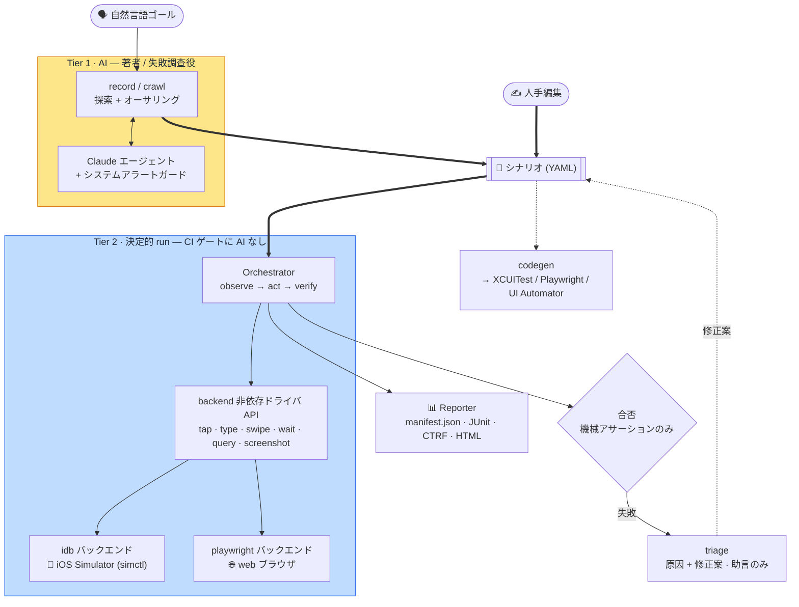

[English](../architecture.md) · **日本語**

# アーキテクチャとモジュール関係

> どのモジュールが何を担当し、どこに依存するか。また **設計（[`DESIGN.md`](../../DESIGN.md)）に
> あるが現状まだ配線されていない機能** を明示します。

関連: [concepts](concepts.md) ・ 各機能ページ（下のリンク）

---

## 全体像（データフロー）

シナリオ（AI または人手で作成）が共有の成果物です。`run` はそれをゲートに AI なしで決定的にリプレイします。`codegen` と `triage` もシナリオを入力として使います。
Tier 1（AI、図では黄）はオーサリングと調査のみを担い、Tier 2（決定的、図では青）は機械アサーションのみで合否を決めます。
この決定的な中核全体はプラットフォーム非依存で、プラットフォーム固有の継ぎ目は orchestrator が駆動する backend（iOS は idb、web は playwright、… いずれも 1 つの `Driver` インターフェースの背後）だけです。新しいプラットフォームは新しい backend であって、コアの fork ではありません。



下の[依存レイヤ図](#依存関係レイヤ)は、同じシステムをデータフローではなくモジュール層として見たものです。

---

## モジュール一覧と役割

`bajutsu/` パッケージ（Python 3.13+、pydantic v2 / typer / anthropic / pyyaml / jinja2）。

| モジュール | 役割 | ページ |
|---|---|---|
| `drivers/base.py` | Driver Protocol + 共通型（`Element`/`Selector`/`Point`）+ **セレクタ解決**（決定性の核） | [selectors](selectors.md) / [drivers](drivers.md) |
| `drivers/fake.py` | インメモリの `FakeDriver`（実機不要テスト用） | [drivers](drivers.md#fakedriver) |
| `drivers/idb.py` | idb バックエンド（iOS Simulator。ヘッドレス、座標 tap） | [drivers](drivers.md#idb) |
| `drivers/xcuitest.py` | XCUITest バックエンド（iOS。安定度ラダーで idb より上位。実機上に常駐する runner が semantic tap・ネイティブ条件待ち・multi-touch を提供し、idb はそのヘッドレスなフォールバック。BE-0019） | [drivers](drivers.md#バックエンド選択と-actuator) |
| `drivers/adb.py` | adb バックエンド（Android。`uiautomator dump` による frame 中心の座標 tap。idb に相当する第 2 プラットフォーム） | [drivers](drivers.md#adb-android) |
| `drivers/playwright.py` | Playwright web バックエンド（ブラウザ。第一段、決定的 run） | [drivers](drivers.md#playwright-web) |
| `scenario/` | シナリオスキーマ（pydantic 厳格検証）+ YAML 読込 / 書出（パッケージ: `models` / `load` / `expand` / `select` / `serialize`） | [scenarios](scenarios.md) |
| `assertions.py` | 機械アサーション評価（総関数。例外を投げない） | [selectors](selectors.md#アサーション評価) |
| `orchestrator/` | 決定的 Tier 2 run ループ（act → wait → verify）（パッケージ: `loop` / `waits` / `substitution` / `evidence_rules` / `actions`） | [run-loop](run-loop.md) |
| `evidence.py` | 証跡の取得（瞬時 / 区間）と Sink | [evidence](evidence.md) |
| `intervals.py` | 区間証跡（video / deviceLog）の simctl 子プロセス管理 | [evidence](evidence.md#区間証跡video--devicelog--apptrace) |
| `report/` | `manifest.json` + JUnit XML + CTRF JSON + インタラクティブ HTML（パッケージ: `format` / `manifest` / `ctrf` / `rows` / `panels` / `html`） | [reporting](reporting.md) |
| `network.py` | ネットワーク collector + プロトコル内の決定的モック | [evidence](evidence.md) |
| `redaction.py` | 証跡の redaction（ラベル / ヘッダ / フィールド + シークレット値） | [evidence](evidence.md) |
| `interp.py` | `${ns.key}` 補間プリミティブ（`params.` / `row.` / `secrets.` / `vars.`） | [scenarios](scenarios.md) |
| `config.py` | チーム既定 × アプリ別の解決（`Effective`） | [configuration](configuration.md) |
| `backends.py` | バックエンド可用性判定、actuator 選択（プラットフォーム対応レジストリ: `ios` / `android` / `web` / `fake`）、Driver 生成 | [drivers](drivers.md#バックエンド選択と-actuator) |
| `simctl.py` | `simctl` ラッパ（erase/boot/launch/openurl/io） | [drivers](drivers.md#環境管理simctl) |
| `preflight.py` | バックエンド別の実行可能ゲート（iOS: 必須 CLI + 起動済みシミュレータ / web: Playwright とその Chromium ブラウザ） | [configuration](configuration.md) |
| `requirements.py` | 単一の宣言的マッピング。backend / capability から pip extra + 外部ツールのプローブ + インストール方法へ（BE-0164）。`preflight` と `provision` が共有する | — |
| `provision.py` | config 対応の環境インストーラ（BE-0164）。config の backend と AI プロバイダを解決し、必要な extra とツールだけを冪等に導入する（`make install`） | — |
| `runner/` | config + シナリオ → レポート。デバイスプール + launch 手順（パッケージ: `pipeline` / `pool` / `launch`） | [run-loop](run-loop.md#runner実行パイプライン) |
| `doctor.py` | 規約充足度スコア（id カバレッジ等） | [configuration](configuration.md#doctor規約充足度スコア) |
| `agent.py` · `agents.py` | オーサリング Agent 抽象（`Observation`/`Proposal`/`Agent`）+ 唯一の SDK エージェントの構築 | [recording](recording.md) |
| `ai/` | ベンダー中立な AI バックエンドのシーム（BE-0104）。`AiBackend` プロトコルと正規化した request/response 型（`base`）、プロバイダレジストリ（`registry`）、`anthropic_client` の上に立つ Anthropic 参照アダプタ（`anthropic`）。Anthropic API、Amazon Bedrock、Anthropic CLI `ant`（BE-0163）を賄います | [configuration](configuration.md#ai-プロバイダai-be-0047) |
| `claude_agent.py` | SDK オーサリングエージェント（ツール強制呼び出し、prompt cache）。プロバイダ非依存で anthropic / bedrock / `ant` を賄います | [recording](recording.md#claude-オーサリングエージェント) |
| `record.py` | record ループ（observe → 提案 → 実行 → 書き出し） | [recording](recording.md#record-ループ) |
| `crawl.py` | 自律的な幅優先クロール → スクリーンマップ（`crawl_guide` / `crawl_tabs` ヘルパ） | [recording](recording.md) |
| `alerts.py` | システムアラートの検出と dismiss（視覚ロケータ） | [recording](recording.md#システムアラートの自動対処) |
| `codegen.py` | シナリオ → ネイティブテスト生成: XCUITest（Swift）、Playwright（TypeScript）、UI Automator（Kotlin） | [codegen](codegen.md) |
| `visual.py` | ビジュアルリグレッションの画像比較（`visual` アサーション） | [evidence](evidence.md) |
| `trace.py` | 保存済み run のテキストタイムライン（`trace` コマンド） | [cli](cli.md) |
| `triage.py` | M4 自己修復: ルールベース `HeuristicTriageAgent` + 構造化 fix（`renameId`/`addIndex`/`raiseTimeout`）、`--apply`/`--write`/`--rerun` | [cli](cli.md) |
| `claude_triage.py` | Claude ベースの `TriageAgent`（`--ai`、失敗スクショ） | [cli](cli.md) |
| `github.py` | GitHub ヘルパ（CI） | [ci](ci.md) |
| `serve/` | ローカル Web UI（`serve` コマンド）: オーサリング / 実行 / レポート / 失敗した run の triage | [cli](cli.md) |
| `mcp/` | MCP サーバ: `run`/`doctor` をツール + 実行証跡をリソースとして公開 | [cli](cli.md) |
| `lint.py` | シナリオ linter + JSON Schema 生成（`lint` / `schema` コマンド） | [cli](cli.md) |
| `audit.py` · `coverage.py` · `stats.py` · `serve/flakiness.py` | 実機も AI も使わない読み取り専用の助言的分析、CI を止めない: 決定性・フレーキネス監査（`audit`、BE-0049）、シナリオの id 名前空間カバレッジ（`coverage`、BE-0050）、集計 run 統計ダッシュボード（`stats`、BE-0102）、クロスランのフレーキネスランキング（`flakiness`、BE-0220） | [cli](cli.md) |
| `cli/` | Typer ベース CLI。コマンドごとに `cli/commands/` の 1 ファイル（`run`/`project`/`doctor`/`audit`/`coverage`/`stats`/`flakiness`/`export`/`trace`/`report`/`triage`/`record`/`crawl`/`codegen`/`approve`/`serve`/`mcp`/`worker`/`lint`/`schema`） | [cli](cli.md) |
| `dotenv.py` | `.env` の最小ローダ（既存環境変数を上書きしない） | [cli](cli.md#環境変数env) |
| `_yaml.py` | `on`/`off`/`yes`/`no` を文字列のまま読む YAML ローダ | [scenarios](scenarios.md#yaml-の注意点) |

## 依存関係（レイヤ）

下層ほど安定で、上層が下層に依存します。中核は `drivers/base.py`（セレクタ解決）で、すべての実行系がここに依存します。

```
                       cli/             ← ユーザ接点（Typer）: run / project / doctor / audit / coverage / stats / flakiness / export / trace / report / triage / record / crawl / codegen / approve / serve / mcp / worker / lint / schema
        ┌─────────────┬───┴───────┬───────────────┬───────────┐
     runner/    record.py / crawl.py  codegen.py   trace.py     triage.py / claude_triage.py
        │       （Tier 1 / AI） （構造マッピング）（タイムライン）（自己修復・助言）
   orchestrator/   agent.py / agents.py / claude_agent.py / alerts.py   serve/ · github.py（Web UI・CI）
        │                 │
   ┌────┼────────┬────────┘
assertions.py  evidence.py ── intervals.py · network.py · visual.py · redaction.py
        │         │
   scenario/    report/      config.py · preflight.py   backends.py   simctl.py
        │ （interp.py）            │              │            │
        └──────────────┬─────────────┴──────────────┴────────────┘
                       ▼
                drivers/base.py  ←── 決定性の核（Element / Selector / resolve_unique）
                       ▲
        ┌──────────────┼───────────────────────────┐
   drivers/fake   drivers/idb・xcuitest・adb   drivers/playwright
```

- `orchestrator/` は `base.Driver` にのみ依存し、**どの具象ドライバとも結合しません**。そのため `FakeDriver` で実機なしにテストでき、本番では同じループが idb（iOS）や playwright（web）を駆動します。
- `runner/` はアプリを起動して準備済みドライバを返す factory を提供し、ループを実機から分離します。
- `scenario/`（オーサリング表現の pydantic モデル）と `drivers/base.py`（実行時の TypedDict）は別物です。`Selector.as_selector()` が前者を後者へ変換します。

### 強制されるレイヤ境界（BE-0112）

上のレイヤ分けは規約にとどまりません。ゲートで**実行可能な契約**として強制します。`make lint-imports`（`make check` の一部であり、CI のステップでもあります）が [import-linter](https://import-linter.readthedocs.io/) を宣言したレイヤに対して実行するので、禁止された import は誰かが気付くまで残らず、その場でゲートを落とします。設定は `pyproject.toml` の `[tool.importlinter]` にあります。3 つのレイヤを宣言します。

1. **決定性コア**：モデルにも periphery のスタックにも触れずに判定と証跡を導く経路です。`orchestrator/`、`runner/`、`drivers/base.py`、`assertions.py`、`evidence.py`、`report/`、`config.py`、`scenario/`、`preflight.py` / `capability_preflight.py` / `capabilities.py`、`doctor.py`、`lint.py` が含まれます。プライムディレクティブを担います。
2. **契約（contract）**：利用者が依存する安定した界面です。シナリオスキーマ（`scenario/`）と `Driver` Protocol（`drivers/base.py`）です。
3. **periphery**：契約の利用側で、いずれもオプションの extra の背後に切り離せます。`serve/`、`mcp/`、codegen のエミッタ、AI / エージェント経路（`agent.py`、`anthropic_client.py`、`record.py`、`enrich.py`、`triage.py`、`crawl_guide.py` など）、`github.py` / `notify.py` / `alerts.py` のヘルパです。

強制する契約は 3 つです。

- **決定性コアは periphery を import してはいけません。** これはプライムディレクティブ 1 と 3 を静的な契約にしたものです。判定と証跡の経路を serve / AI / codegen のスタックから切り離したまま保ち、それらへの依存が黙って増えることを防ぎます。コアのモジュールが必要とする純粋な要素ツリーのヘルパ（`screen_size_from_elements`、`shows_app_ui` など）は、`record.py` のような periphery のモジュールではなくコア（`bajutsu/elements.py`）に置きます。同様に、解決済みの `ai` ブロック（`AiConfig`）は `config.py` に置き、コアは AI クライアントを import せずにそれを読みます。
- **コアはホスト非依存に保ちます（BE-0129）。** マルチテナントなホスティングの関心事（組織、ロール、テナンシー）と、`db`（SQLAlchemy、Alembic、psycopg、cryptography）や `oauth`（Authlib）の extra は、`bajutsu/serve/` だけが持ちます。組織モデル（`OrgConfig`、`org_for_*`、`targets_for_org`、`load_serve_config`）は `config.py` ではなく `bajutsu/serve/orgs.py` にあります。`Config` は `orgs` フィールドを持たず、コアのローダーは検証の前にトップレベルの `orgs:` を取り除くので、組織情報を含む config を読むホスト型構成の run はそのまま動きつつ、コアは組織を一切モデル化しません。同じ仕組みがトップレベルの `ui:` キー（BE-0191）も除去します。serve UI のプレゼンテーション設定（`ui.default_theme`）は serve の関心事であり、`bajutsu/serve/themes.py` で読み取られます。`Config` はモデル化しません。import-linter の forbidden 契約が `config.py`・`drivers/`・`runner/`・`scenario/` をこれらの extra から遠ざけます（`include_external_packages` により外部 import も検出します）。これは、それらを `bajutsu.serve` から遠ざける periphery 契約の上に重ねたものです。
- **シナリオスキーマと `Driver` Protocol は可搬なインナー契約に保ちます。** periphery だけでなく runtime のコア（`orchestrator/`、`runner/`、`config.py` など）からも独立させます。これにより契約は、利用者が runtime を引き込まずに依存できる安定したレイヤになり、バージョンをまたいだスキーマの読み取り（BE-0119）や、将来 periphery をコアから分離する余地を下支えします。

このチェックは import グラフに対する静的解析です。モデルは介在せず、決定的な合否以上のものは `run` / CI の判定経路に載りません。新しいモジュールを追加するときは、そのレイヤが置き場所を決めます。判定と証跡の経路上にあるならコアであり、periphery に到達してはいけません。契約を利用するなら periphery であり、extra の背後に置きます。

## テスト構成

`tests/` に **ユニットテスト一式**（`uv run pytest -q`）があります。すべて実機 Simulator を必要としません。コマンドビルダは純関数として、実行系は `FakeDriver` / 注入ランナー（`RunFn`、`Spawn`、`Clock`）で検証します。showcase アプリに対する実機 E2E は `make -C demos/showcase run-swiftui` / `make -C demos/showcase ui-test` です（[showcase](showcase.md)）。

### driver conformance suite（BE-0114）

プライムディレクティブ 3 は、どの backend も 1 つの `Driver` 界面の背後に置くことを求めます。ですから決定性の中核となる不変条件は、すべての backend で同一に成り立たなければなりません。backend ごとのテストだけでは、これを保証できません。曖昧なセレクタで最初の一致を tap する backend や、0 件の query に成功を返す backend があっても、自身のテストは通り、落とす共通テストがないからです。**driver conformance suite** はこの隙間を埋めます。1 つの実行可能な契約（technology compatibility kit（TCK）に相当します）が、同じテスト本体をすべての backend に対して走らせ、共通の base だけでなく実際のドライバのインスタンス（`drivers/base` を迂回するコードを含みます）を駆動します。

契約（`tests/driver_conformance.py`）は、新しい backend が満たすべき「完了」の定義です。

- 曖昧なセレクタ（2 件以上の一致）は、最初の一致に作用せず失敗します。
- 0 件のセレクタは、成功を報告せず失敗します。
- セレクタの失敗は 1 つのエラー型（`SelectorError`）を共有し、backend をまたいで一様です。
- 一意の一致はエラーなく作用し、`query()` は画面上の要素を報告します。
- `capabilities()` が観測される挙動と一致します。`QUERY` / `ELEMENTS` の baseline を申告し、multi-touch のジェスチャは `MULTI_TOUCH` を申告したときに限り動作します（そうでなければ `UnsupportedAction` を送出します）。
- `wait_for` は現在の画面を 1 回だけ判定し、共有の `wait_until` ループがそれを固定 sleep なしの条件待ちに変えます。

backend をこのスイートに加えるには、`ConformanceHarness`（画面を渡すと、それを表示するドライバを返すもの）を実装し、`DriverConformanceContract` を継承します。すると pytest が、継承した契約をその backend に対して走らせます。`FakeDriver` は高速な Linux ゲート（`make check`）で、Playwright は web CI ジョブで、idb と XCUITest はオンデバイスの E2E 経路（`e2e.yml`）で走ります。契約は同じで、第 2 の仕様はありません。各 harness は画面をそれぞれの方法で実体化します。`FakeDriver` は要素をそのまま受け取り、Playwright は HTML として描画します。オンデバイスの harness は `SHOWCASE_CONFORMANCE` で showcase アプリを一度だけ conformance モードで起動し、以降はアプリがポーリングする spec ファイル（Documents ディレクトリの `conformance-spec.txt`）を書き換えて画面ごとに再シードします。これにより、共有の base だけでなく、実際の idb と XCUITest の query と操作のコードを駆動します。画面ごとの再起動や deeplink ではなくファイル書き込みを使うのは、`simctl openurl` が iOS の「アプリで開きますか?」ダイアログを出し、画面ごとの再起動は数回の `app.launch()` で常駐 XCUITest ランナーをクラッシュさせるためです。このスイートには `ondevice` の pytest マーカーが付いており（ゲートの既定で除外されます）、`make check` では決して走りません。共有する 1 台の Simulator を 1 つの spec ファイルで再シードするため、並列ワーカーどうしが衝突しないよう直列で実行します。

---

## 実装状況

> 設計（[`DESIGN.md`](../../DESIGN.md)）には将来像も含まれます。**現状のコードが実際に動かすもの**と
> **まだ配線されていないもの**を区別します。

### 実装済み（テストあり、経路が通っている）

- セレクタ解決と曖昧検出（決定性の核）
- プラットフォーム対応の backend レジストリ: `--backend` / `backend:` は `ios` / `android` / `web` / `fake` トークンを受け取り、安定度順にそれぞれの actuator へ展開する（`backends.py`）。`ios` は `xcuitest` に展開し、次に `idb` にフォールバックする
- **XCUITest バックエンド**（`drivers/xcuitest.py`）: 安定度ラダーで idb より上位に置かれる既定の iOS actuator。実機上に常駐する runner（`BajutsuKit`）を loopback HTTP 経由で駆動し、semantic（identifier）tap、ネイティブの条件待ち、idb が持たない `pinch`/`rotate` の multi-touch ジェスチャ（idb では `UnsupportedAction`）を追加する。XCUITest が動かせないホストでは idb が座標ベース・ヘッドレスのフォールバックとして残る（BE-0019）
- **Playwright web バックエンド**（`drivers/playwright.py`）: ブラウザに対する決定的 `run` を Linux のゲート上で動かせる（`demos/web`）。リッチ寄りの能力モデルまで引き上げ済み（BE-0054）: `page.route()` によるネイティブな `network` の観測とスタブ、共有の `driver_interval` seam を通した `video` と `deviceLog` 相当（console / page-error）の区間証跡、`multiTouch`（ピンチ / 回転）のエミュレーション、N 個の `BrowserContext` レーンにまたがる並列実行。`appTrace` のみ iOS 専用（`os_log`/simctl 由来）のまま
- **Android adb バックエンド**（`drivers/adb.py` ＋ `adb.py`）: 座標ドライバ（`uiautomator dump` → frame 中心タップ）、`AndroidEnvironment` の起動シーケンス、`doctor` の報告、interval 証跡（`video` は `screenrecord`、`deviceLog` は `logcat`。どちらも driver 供給の `driver_interval` seam を通す）と iOS から再利用するモックネットワーク、取得済み XML フィクスチャに対する fast ゲートのユニットテストまで。実機上での actuation は idb と同等の水準に達しており、システム `back`、deeplink、単一ラウンドトリップの `doubleTap`、スクロールによる要素解決、実行時パーミッションの事前付与を含む（BE-0210）。デバイス制御は `setLocation` とクリップボードの読み書き / クリアの部分集合を、操作ごとの capability トークンで管理する形で実装済みで（BE-0211 / BE-0212）、`push` / `clearKeychain` / ステータスバーの上書き / `background` / `foreground` はエミュレータ側に相当機能がないため未対応のまま残る。codegen は UI Automator（Kotlin）ターゲットを実装済み（BE-0209）。Android の e2e CI レーン（KVM 上のエミュレータ）は進行中で（BE-0208）、adb はまだネイティブのタブバーを操作できないため、タブに紐づくシナリオは BE-0223 が入るまで iOS 専用のまま（BE-0007）。**id の照合**はドライバ内で厳密一致のままです。native な id 構文が SPEC の id を再現できない場合（Android Views の `android:id` は `stable.refresh` を `stable_refresh` に写します）は、シナリオのセレクタが id を**両方の形**で列挙し、共有リゾルバが OR としてどちらにも一致します。ドライバ側の `.`↔`_` 書き換えではなく、シナリオ側の明示的な規約です（BE-0221）
- シナリオスキーマ（厳格検証）と YAML ラウンドトリップ。`id` / `idMatches` はプラットフォーム別の id 形に対応する OR 候補のリストを受け付ける（BE-0221）
- アサーション評価（`exists` / `value` / `label` / `count` / `enabled` / `disabled` / `selected` /
  `request` / `requestSequence` / `event` / `responseSchema` / `visual` / `clipboard` / `golden`）
- Tier 2 run ループ（act → wait → verify）、`FakeDriver` で検証
- DSL（ドメイン固有言語）: `within` セレクタ（幾何スコープ）、`relaunch` ステップ（実機検証済み）、再利用 `setup` 前段、起動時の `locale` 適用、デバイスプール上の並列実行（`--workers`）
- DSL のオーサリング再利用: 再利用可能なパラメータ化コンポーネント（`use` / `${params.*}`）、データ駆動シナリオ（`data` / `dataFile` と `${row.*}`）、シークレット変数（`${secrets.X}`、値マスク）、シナリオタグ + `--tag` / `--exclude` 選択、`setLocation` / `push` デバイスステップ、`doubleTap` アクション、ファイル単位 + シナリオ単位の `description`
- DSL の制御フローとデータ取得: 条件分岐 `if` とループ `forEach`（決定的。条件は機械アサーション）、`extract`（要素の value / label / identifier を `${vars.*}` に取り込む）
- DSL のデバイス / システムアクション（iOS）: `background`、`clearKeychain`、`clearClipboard`、`overrideStatusBar` / `clearStatusBar`（決定的なステータスバー）、テストデータ準備 / Webhook 用の `http` アクション
- 証跡: 瞬時（`screenshot`/`elements`/`actionLog`）+ 区間（`video`/`deviceLog`/`appTrace`）+ ネットワーク collector（`network.json`）+ **ビジュアルリグレッション**（baseline に対する `visual`。`approve` コマンドで baseline を昇格）+ `capturePolicy` 発火 + 書き出し前の **redaction 適用**
- ネットワーク観測 + **決定的モック**（シナリオ `mocks` → プロトコル内スタブ、実機検証済み）: `request` アサーション、`wait: { until: request }`、オフラインのスタブ応答
- レポート（`manifest.json` / `junit.xml` / `ctrf.json` / `report.html`）
- config 解決（defaults × targets、redact マージ）と actuator 選択
- `simctl` コマンド層、idb の出力パーサ、`doctor` スコア + バックエンド別の実行可能ゲート（`preflight.py`: iOS は必須 CLI + 起動済みシミュレータ、web は Playwright とその Chromium ブラウザ）
- `trace` コマンド（`trace.py`）: 保存済み run のテキストタイムライン（steps + network + appTrace）
- M4 自己修復トリアージ（`triage.py` + `claude_triage.py`）: 失敗 run のコンテキスト組み立て + `TriageAgent` 診断（ルールベース `HeuristicTriageAgent`、または `--ai` の Claude で失敗スクショ込み）。エージェントは構造化 fix（`renameId` / `addIndex` / `raiseTimeout`）を提案でき、`--apply`/`--write` でシナリオ source に適用（diff プレビュー、opt-in）、`--rerun` で再実行検証
- CLI: `run` / `project` / `doctor` / `audit` / `coverage` / `stats` / `flakiness` / `export` / `trace` / `report` / `triage` / `record` / `crawl` / `codegen` / `approve` / `serve` / `mcp` / `worker` / `lint` / `schema`。`record` と `crawl` が Tier 1 の AI オーサリング経路で、alert guard を伴う
- 実機も AI も使わない読み取り専用の助言的な分析コマンド（CI を止めない。入力が欠けている・読めないときだけ非ゼロで終了する）: 静的・repeat-and-diff・longitudinal の3モードを持つ決定性・フレーキネス監査（`audit`、BE-0049）、シナリオの id 名前空間カバレッジマップ（`coverage`、BE-0050）、CLI / HTML 出力の集計 run 統計ダッシュボード（`stats`、BE-0102）、runs ディレクトリまたは `serve` のデータベースから見るクロスランのフレーキネスランキング（`flakiness`、BE-0220）、完了した run を持ち運び可能な `.zip` にまとめる export（`export`、BE-0060）、保存済みの run データから再実行なしに `report.html`/`junit.xml`/`ctrf.json` を再生成する report（`report`、BE-0068）
- **config プロジェクトハブ**（`project add`/`ls`/`use`/`rm` と `run --project`、BE-0225）: プロジェクト名を config のソースに束ねる名前付きレジストリで、CLI と `serve` の Web UI が共有する（データベースがあればそこに保存し、なければディスク上の JSON に保存する）。`serve` 側のプロジェクト切り替え UI はまだ配線されていない
- AI **crawl**（`crawl.py`）: アプリを自律的に幅優先で探索し、スクリーンマップ（`screenmap.json`）を作る
- `serve` ローカル Web UI（Tier 1）: ブラウザからシナリオをオーサリング（`record` / `crawl`）、編集、実行し、config + シナリオ + ビルド済みアプリバイナリの **`.zip` バンドルをアクティブな config として開いて**各タブをそこから動かし（BE-0073）、レポートと証跡を閲覧、Record と Replay のフォームで実行前の**準備状況パネル**（`doctor`: 環境の runnability と現在画面の規約スコア）を確認し（BE-0148）、**プラグイン可能なテーマシステム**（ドロップイン方式のビジュアルトークンと差し替え可能なトランジション、ヘッダーのピッカー、ライブプレビュー付きの UI 内エディタとローカル下書き / サーバアップロードの永続化。BE-0191）を備え、ビジュアル baseline を承認、ジョブをライブ配信する（CI 用ではない）
- **MCP サーバ**（`bajutsu mcp`）: `bajutsu_run` と `bajutsu_doctor` を MCP ツールとして、実行証跡をリソースとして公開する。Claude Desktop / Code との連携用（オプション依存 `fastmcp`）
- **シナリオ linter**（`bajutsu lint` / `bajutsu schema`）: 実行せずにシナリオを検証する。エディタ連携用に JSON Schema も出力する
- codegen: シナリオ → ネイティブテスト。共有のシナリオ走査（BE-0083）の上に 3 ターゲット — XCUITest
  （Swift、iOS）、Playwright（TypeScript、web）、UI Automator（Kotlin、Android。BE-0209）

### 実機 Simulator で検証済み（iPhone 17 Pro、近年の iOS）

- idb バックエンドの subprocess 実行（`describe-all` パース、フレーム中心の tap / text / swipe、`simctl` launch 手順）を、インストール済みの `idb` / `idb_companion` に対して確認しています。showcase シナリオの実行、証跡の取得、triage 自己修復ループを実機で走らせて検証しました（`make -C demos/showcase run-swiftui`。`e2e.yml` CI も idb smoke を実行します）。
- XCUITest バックエンドの常駐 runner を実機で検証しています。スナップショットハンドルによる要素解決、semantic tap、idb では動かせない `pinch`/`rotate` の multi-touch ジェスチャを、`e2e.yml` の `xcuitest (multi-touch)` ジョブ（`demos/showcase/scenarios/gestures_multitouch.yaml`、`--backend xcuitest`）で確認済みです。

### ブラウザで検証済み（Linux で動作、Mac 不要）

- Playwright web バックエンドは `demos/web` のシナリオを、CI と同じ `make check` ゲートの中（`ci.yml` の `web-e2e` ジョブ）で決定的に実行します。決定的コアがプラットフォーム非依存であることの裏付けです。リッチ寄りの web 取得（ネットワーク / 動画 / マルチタッチ）は BE-0054 で実装済みです。N 個のブラウザプロセスにまたがる並列 web クロール（[BE-0077](../../roadmaps/BE-0077-parallel-web-crawl/BE-0077-parallel-web-crawl-ja.md)）は、この同じゲートの上で動きます。

### 未配線（スキーマ/フラグはあるが実行時に効かない）

| 機能 | 現状 | 場所 |
|---|---|---|
| `mockServer`（外部モックコマンド） | config スキーマのみ。`cmd`/`port` の外部サーバは**未実装**で、シナリオ `mocks`（宣言的なプロトコル内スタブ、実装済み）で代替する | `config.py` `MockServer` |
| **web** バックエンドでの `appTrace` 区間証跡 | `appTrace` は `os_log`/simctl 由来（iOS 専用）。Playwright バックエンドは代わりに `video` と `deviceLog` 相当（console / page-error）の区間証跡を実装する（BE-0054）が、`appTrace` に相当するものは持たない | `intervals.py` · `drivers/playwright.py` |

これらは各機能ページでも該当箇所に「未実装」と注記しています。
