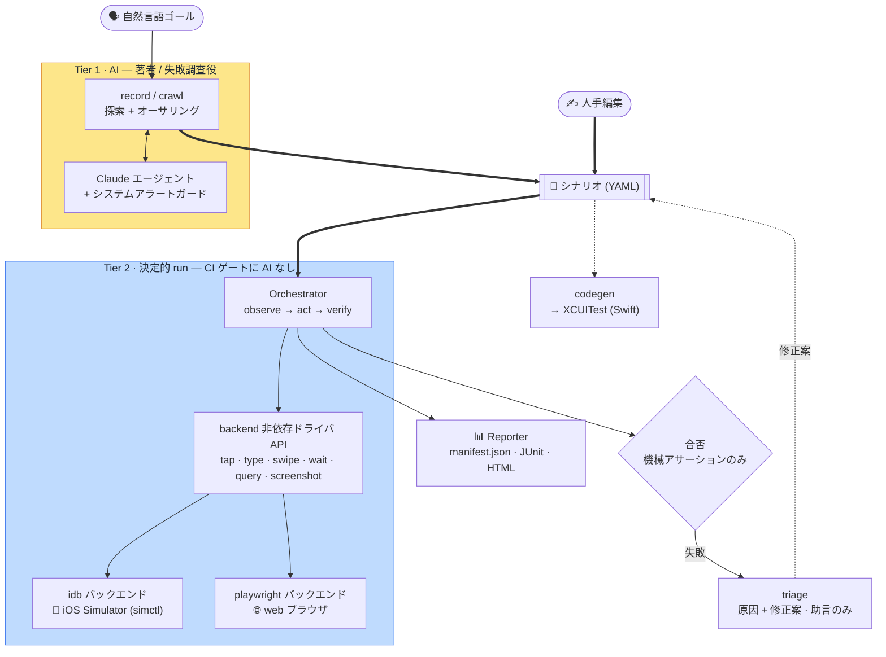

[English](../architecture.md) · **日本語**

# アーキテクチャとモジュール関係

> どのモジュールが何を担当し、どこに依存するか。また **設計（[`DESIGN.md`](../../DESIGN.md)）に
> あるが現状まだ配線されていない機能** を明示します。

関連: [concepts](concepts.md) ・ 各機能ページ（下のリンク）

---

## 全体像（データフロー）

シナリオ（AI または人手で作成）が共有の成果物です。`run` はそれをゲートに AI なしで決定的にリプレイします。`codegen` と `triage` もシナリオを入力として使います。
Tier 1（AI、図では黄）はオーサリングと調査のみを担い、Tier 2（決定的、図では青）は機械アサーションのみで合否を決めます。
この決定的な中核全体はプラットフォーム非依存で、プラットフォーム固有の継ぎ目は orchestrator が駆動する backend（iOS は idb、web は playwright、… いずれも 1 つの `Driver` インターフェースの背後）だけです。新しいプラットフォームは新しい backend であって、コアの fork ではありません。



下の[依存レイヤ図](#依存関係レイヤ)は、同じシステムをデータフローではなくモジュール層として見たものです。

---

## モジュール一覧と役割

`bajutsu/` パッケージ（Python 3.13+、pydantic v2 / typer / anthropic / pyyaml / jinja2）。

| モジュール | 役割 | ページ |
|---|---|---|
| `drivers/base.py` | Driver Protocol + 共通型（`Element`/`Selector`/`Point`）+ **セレクタ解決**（決定性の核） | [selectors](selectors.md) / [drivers](drivers.md) |
| `drivers/fake.py` | インメモリの `FakeDriver`（実機不要テスト用） | [drivers](drivers.md#fakedriver) |
| `drivers/idb.py` | idb バックエンド（iOS Simulator。ヘッドレス、座標 tap） | [drivers](drivers.md#idb) |
| `drivers/playwright.py` | Playwright web バックエンド（ブラウザ。第一段、決定的 run） | [drivers](drivers.md#playwright-web) |
| `scenario/` | シナリオスキーマ（pydantic 厳格検証）+ YAML 読込 / 書出（パッケージ: `models` / `load` / `expand` / `select` / `serialize`） | [scenarios](scenarios.md) |
| `assertions.py` | 機械アサーション評価（総関数。例外を投げない） | [selectors](selectors.md#アサーション評価) |
| `orchestrator/` | 決定的 Tier 2 run ループ（act → wait → verify）（パッケージ: `loop` / `waits` / `substitution` / `evidence_rules` / `actions`） | [run-loop](run-loop.md) |
| `evidence.py` | 証跡の取得（瞬時 / 区間）と Sink | [evidence](evidence.md) |
| `intervals.py` | 区間証跡（video / deviceLog）の simctl 子プロセス管理 | [evidence](evidence.md#区間証跡video--devicelog--apptrace) |
| `report/` | `manifest.json` + JUnit XML + インタラクティブ HTML（パッケージ: `format` / `manifest` / `rows` / `panels` / `html`） | [reporting](reporting.md) |
| `network.py` | ネットワーク collector + プロトコル内の決定的モック | [evidence](evidence.md) |
| `redaction.py` | 証跡の redaction（ラベル / ヘッダ / フィールド + シークレット値） | [evidence](evidence.md) |
| `interp.py` | `${ns.key}` 補間プリミティブ（`params.` / `row.` / `secrets.` / `vars.`） | [scenarios](scenarios.md) |
| `config.py` | チーム既定 × アプリ別の解決（`Effective`） | [configuration](configuration.md) |
| `backends.py` | バックエンド可用性判定、actuator 選択（プラットフォーム対応レジストリ: `ios` / `web` / `fake`）、Driver 生成 | [drivers](drivers.md#バックエンド選択と-actuator) |
| `simctl.py` | `simctl` ラッパ（erase/boot/launch/openurl/io） | [drivers](drivers.md#環境管理simctl) |
| `preflight.py` | バックエンド別の実行可能ゲート（iOS: 必須 CLI + 起動済みシミュレータ / web: Playwright とその Chromium ブラウザ） | [configuration](configuration.md) |
| `runner/` | config + シナリオ → レポート。デバイスプール + launch 手順（パッケージ: `pipeline` / `pool` / `launch`） | [run-loop](run-loop.md#runner実行パイプライン) |
| `doctor.py` | 規約充足度スコア（id カバレッジ等） | [configuration](configuration.md#doctor規約充足度スコア) |
| `agent.py` · `agents.py` | オーサリング Agent 抽象（`Observation`/`Proposal`/`Agent`）+ backend 選択（`--agent api` / `claude-code`） | [recording](recording.md) |
| `claude_agent.py` | Anthropic API エージェント（ツール強制呼び出し、prompt cache） | [recording](recording.md#claude-エージェント) |
| `claude_code_agent.py` | Claude Code エージェント（Claude Code CLI を駆動） | [recording](recording.md) |
| `record.py` | record ループ（observe → 提案 → 実行 → 書き出し） | [recording](recording.md#record-ループ) |
| `crawl.py` | 自律的な幅優先クロール → スクリーンマップ（`crawl_guide` / `crawl_tabs` ヘルパ） | [recording](recording.md) |
| `alerts.py` | システムアラートの検出と dismiss（視覚ロケータ） | [recording](recording.md#システムアラートの自動対処) |
| `codegen.py` | シナリオ → XCUITest（Swift）生成 | [codegen](codegen.md) |
| `visual.py` | ビジュアルリグレッションの画像比較（`visual` アサーション） | [evidence](evidence.md) |
| `trace.py` | 保存済み run のテキストタイムライン（`trace` コマンド） | [cli](cli.md) |
| `triage.py` | M4 自己修復: ルールベース `HeuristicTriageAgent` + 構造化 fix（`renameId`/`addIndex`/`raiseTimeout`）、`--apply`/`--write`/`--rerun` | [cli](cli.md) |
| `claude_triage.py` | Claude ベースの `TriageAgent`（`--ai`、失敗スクショ） | [cli](cli.md) |
| `github.py` | GitHub ヘルパ（CI） | [ci](ci.md) |
| `serve/` | ローカル Web UI（`serve` コマンド）: オーサリング / 実行 / レポート | [cli](cli.md) |
| `mcp/` | MCP サーバ: `run`/`doctor` をツール + 実行証跡をリソースとして公開 | [cli](cli.md) |
| `lint.py` | シナリオ linter + JSON Schema 生成（`lint` / `schema` コマンド） | [cli](cli.md) |
| `cli/` | Typer ベース CLI。コマンドごとに `cli/commands/` の 1 ファイル（`run`/`doctor`/`record`/`crawl`/`codegen`/`trace`/`triage`/`approve`/`serve`/`mcp`/`worker`/`lint`/`schema`） | [cli](cli.md) |
| `dotenv.py` | `.env` の最小ローダ（既存環境変数を上書きしない） | [cli](cli.md#環境変数env) |
| `_yaml.py` | `on`/`off`/`yes`/`no` を文字列のまま読む YAML ローダ | [scenarios](scenarios.md#yaml-の注意点) |

## 依存関係（レイヤ）

下層ほど安定で、上層が下層に依存します。中核は `drivers/base.py`（セレクタ解決）で、すべての実行系がここに依存します。

```
                       cli/             ← ユーザ接点（Typer）: run / doctor / record / crawl / codegen / trace / triage / approve / serve / mcp / worker / lint / schema
        ┌─────────────┬───┴───────┬───────────────┬───────────┐
     runner/    record.py / crawl.py  codegen.py   trace.py     triage.py / claude_triage.py
        │       （Tier 1 / AI） （構造マッピング）（タイムライン）（自己修復・助言）
   orchestrator/   agent.py / agents.py / claude_agent.py / claude_code_agent.py / alerts.py   serve/ · github.py（Web UI・CI）
        │                 │
   ┌────┼────────┬────────┘
assertions.py  evidence.py ── intervals.py · network.py · visual.py · redaction.py
        │         │
   scenario/    report/      config.py · preflight.py   backends.py   simctl.py
        │ （interp.py）            │              │            │
        └──────────────┬─────────────┴──────────────┴────────────┘
                       ▼
                drivers/base.py  ←── 決定性の核（Element / Selector / resolve_unique）
                       ▲
        ┌──────────────┼───────────────┐
   drivers/fake   drivers/idb    drivers/playwright
```

- `orchestrator/` は `base.Driver` にのみ依存し、**どの具象ドライバとも結合しません**。そのため `FakeDriver` で実機なしにテストでき、本番では同じループが idb（iOS）や playwright（web）を駆動します。
- `runner/` はアプリを起動して準備済みドライバを返す factory を提供し、ループを実機から分離します。
- `scenario/`（オーサリング表現の pydantic モデル）と `drivers/base.py`（実行時の TypedDict）は別物です。`Selector.as_selector()` が前者を後者へ変換します。

## テスト構成

`tests/` に **ユニットテスト一式**（`uv run pytest -q`）があります。すべて実機 Simulator を必要としません。コマンドビルダは純関数として、実行系は `FakeDriver` / 注入ランナー（`RunFn`、`Spawn`、`Clock`）で検証します。showcase アプリに対する実機 E2E は `make -C demos/showcase run-swiftui` / `make -C demos/showcase ui-test` です（[showcase](showcase.md)）。

### driver conformance suite（BE-0114）

プライムディレクティブ 3 は、どの backend も 1 つの `Driver` 界面の背後に置くことを求めます。ですから決定性の中核となる不変条件は、すべての backend で同一に成り立たなければなりません。backend ごとのテストだけでは、これを保証できません。曖昧なセレクタで最初の一致を tap する backend や、0 件の query に成功を返す backend があっても、自身のテストは通り、落とす共通テストがないからです。**driver conformance suite** はこの隙間を埋めます。1 つの実行可能な契約（technology compatibility kit（TCK）に相当します）が、同じテスト本体をすべての backend に対して走らせ、共通の base だけでなく実際のドライバのインスタンス（`drivers/base` を迂回するコードを含みます）を駆動します。

契約（`tests/driver_conformance.py`）は、新しい backend が満たすべき「完了」の定義です。

- 曖昧なセレクタ（2 件以上の一致）は、最初の一致に作用せず失敗します。
- 0 件のセレクタは、成功を報告せず失敗します。
- セレクタの失敗は 1 つのエラー型（`SelectorError`）を共有し、backend をまたいで一様です。
- 一意の一致はエラーなく作用し、`query()` は画面上の要素を報告します。
- `capabilities()` が観測される挙動と一致します。`QUERY` / `ELEMENTS` の baseline を申告し、multi-touch のジェスチャは `MULTI_TOUCH` を申告したときに限り動作します（そうでなければ `UnsupportedAction` を送出します）。
- `wait_for` は現在の画面を 1 回だけ判定し、共有の `wait_until` ループがそれを固定 sleep なしの条件待ちに変えます。

backend をこのスイートに加えるには、`ConformanceHarness`（画面を渡すと、それを表示するドライバを返すもの）を実装し、`DriverConformanceContract` を継承します。すると pytest が、継承した契約をその backend に対して走らせます。`FakeDriver` は高速な Linux ゲート（`make check`）で、Playwright は web CI ジョブで、idb と XCUITest はオンデバイスの E2E 経路で走ります。契約は同じで、第 2 の仕様はありません。

---

## 実装状況

> 設計（[`DESIGN.md`](../../DESIGN.md)）には将来像も含まれます。**現状のコードが実際に動かすもの**と
> **まだ配線されていないもの**を区別します。

### 実装済み（テストあり、経路が通っている）

- セレクタ解決と曖昧検出（決定性の核）
- プラットフォーム対応の backend レジストリ: `--backend` / `backend:` は `ios` / `web` / `fake` トークンを受け取り（Android は予定）、安定度順にそれぞれの actuator へ展開する（`backends.py`）
- **Playwright web バックエンド**（`drivers/playwright.py`）: 第一段。ブラウザに対する決定的 `run` を Linux のゲート上で動かせる（`demos/web`）。リッチ寄りの web 取得は予定（BE-0054）
- シナリオスキーマ（厳格検証）と YAML ラウンドトリップ
- アサーション評価（`exists` / `value` / `label` / `count` / `enabled` / `disabled` / `selected` / `request` / `visual`）
- Tier 2 run ループ（act → wait → verify）、`FakeDriver` で検証
- DSL（ドメイン固有言語）: `within` セレクタ（幾何スコープ）、`relaunch` ステップ（実機検証済み）、再利用 `setup` 前段、起動時の `locale` 適用、デバイスプール上の並列実行（`--workers`）
- DSL のオーサリング再利用: 再利用可能なパラメータ化コンポーネント（`use` / `${params.*}`）、データ駆動シナリオ（`data` / `dataFile` と `${row.*}`）、シークレット変数（`${secrets.X}`、値マスク）、シナリオタグ + `--tag` / `--exclude` 選択、`setLocation` / `push` デバイスステップ、`doubleTap` アクション、ファイル単位 + シナリオ単位の `description`
- DSL の制御フローとデータ取得: 条件分岐 `if` とループ `forEach`（決定的。条件は機械アサーション）、`extract`（要素の value / label / identifier を `${vars.*}` に取り込む）
- DSL のデバイス / システムアクション（iOS）: `background`、`clearKeychain`、`clearClipboard`、`overrideStatusBar` / `clearStatusBar`（決定的なステータスバー）、テストデータ準備 / Webhook 用の `http` アクション
- 証跡: 瞬時（`screenshot`/`elements`/`actionLog`）+ 区間（`video`/`deviceLog`/`appTrace`）+ ネットワーク collector（`network.json`）+ **ビジュアルリグレッション**（baseline に対する `visual`。`approve` コマンドで baseline を昇格）+ `capturePolicy` 発火 + 書き出し前の **redaction 適用**
- ネットワーク観測 + **決定的モック**（シナリオ `mocks` → プロトコル内スタブ、実機検証済み）: `request` アサーション、`wait: { until: request }`、オフラインのスタブ応答
- レポート（`manifest.json` / `junit.xml` / `report.html`）
- config 解決（defaults × targets、redact マージ）と actuator 選択
- `simctl` コマンド層、idb の出力パーサ、`doctor` スコア + バックエンド別の実行可能ゲート（`preflight.py`: iOS は必須 CLI + 起動済みシミュレータ、web は Playwright とその Chromium ブラウザ）
- `trace` コマンド（`trace.py`）: 保存済み run のテキストタイムライン（steps + network + appTrace）
- M4 自己修復トリアージ（`triage.py` + `claude_triage.py`）: 失敗 run のコンテキスト組み立て + `TriageAgent` 診断（ルールベース `HeuristicTriageAgent`、または `--ai` の Claude で失敗スクショ込み）。エージェントは構造化 fix（`renameId` / `addIndex` / `raiseTimeout`）を提案でき、`--apply`/`--write` でシナリオ source に適用（diff プレビュー、opt-in）、`--rerun` で再実行検証
- CLI: `run` / `doctor` / `record` / `crawl` / `codegen` / `trace` / `triage` / `approve` / `serve` / `mcp` / `worker` / `lint` / `schema`。`record` と `crawl` が Tier 1 の AI オーサリング経路で、alert guard を伴う
- AI **crawl**（`crawl.py`）: アプリを自律的に幅優先で探索し、スクリーンマップ（`screenmap.json`）を作る
- `serve` ローカル Web UI（Tier 1）: ブラウザからシナリオをオーサリング（`record` / `crawl`）、編集、実行し、config + シナリオ + ビルド済みアプリバイナリの **`.zip` バンドルをアクティブな config として開いて**各タブをそこから動かし（BE-0073）、レポートと証跡を閲覧、ビジュアル baseline を承認、ジョブをライブ配信する（CI 用ではない）
- **MCP サーバ**（`bajutsu mcp`）: `bajutsu_run` と `bajutsu_doctor` を MCP ツールとして、実行証跡をリソースとして公開する。Claude Desktop / Code との連携用（オプション依存 `fastmcp`）
- **シナリオ linter**（`bajutsu lint` / `bajutsu schema`）: 実行せずにシナリオを検証する。エディタ連携用に JSON Schema も出力する
- XCUITest コード生成

### 実機 Simulator で検証済み（iPhone 17 Pro、近年の iOS）

- idb バックエンドの subprocess 実行（`describe-all` パース、フレーム中心の tap / text / swipe、`simctl` launch 手順）を、インストール済みの `idb` / `idb_companion` に対して確認しています。showcase シナリオの実行、証跡の取得、triage 自己修復ループを実機で走らせて検証しました（`make -C demos/showcase run-swiftui`。`e2e.yml` CI も idb smoke を実行します）。

### ブラウザで検証済み（Linux で動作、Mac 不要）

- Playwright web バックエンドは `demos/web` のシナリオを、CI と同じ `make check` ゲートの中（`ci.yml` の `web-e2e` ジョブ）で決定的に実行します。決定的コアがプラットフォーム非依存であることの裏付けです。リッチ寄りの web 取得（ネットワーク / 動画 / マルチタッチ）は予定です（BE-0054）。N 個のブラウザプロセスにまたがる並列 web クロール（[BE-0077](../../roadmaps/BE-0077-parallel-web-crawl/BE-0077-parallel-web-crawl-ja.md)）は、この同じゲートの上で動きます。

### 未配線（スキーマ/フラグはあるが実行時に効かない）

| 機能 | 現状 | 場所 |
|---|---|---|
| `mockServer`（外部モックコマンド） | config スキーマのみ。`cmd`/`port` の外部サーバは**未実装**で、シナリオ `mocks`（宣言的なプロトコル内スタブ、実装済み）で代替する | `config.py` `MockServer` |
| **web** バックエンドでの区間証跡（`video` / `deviceLog` / `appTrace`） | `capturePolicy` ルールはパースされるが、これらは simctl 由来で iOS でのみ動く。Playwright バックエンドは `screenshot` / `elements` を記録する。web のリッチ寄り取得（動画 / ネットワークを含む）は予定（BE-0054） | `intervals.py` · `drivers/playwright.py` |

これらは各機能ページでも該当箇所に「未実装」と注記しています。
