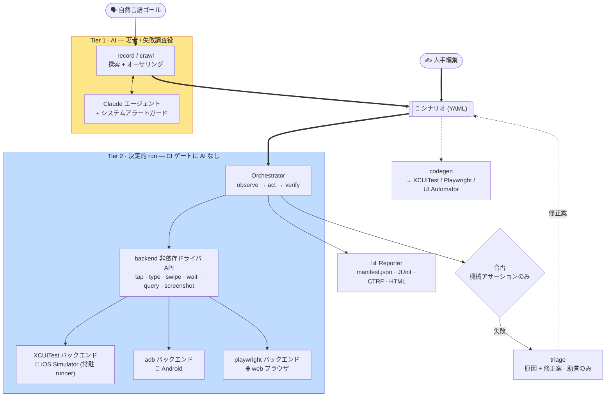
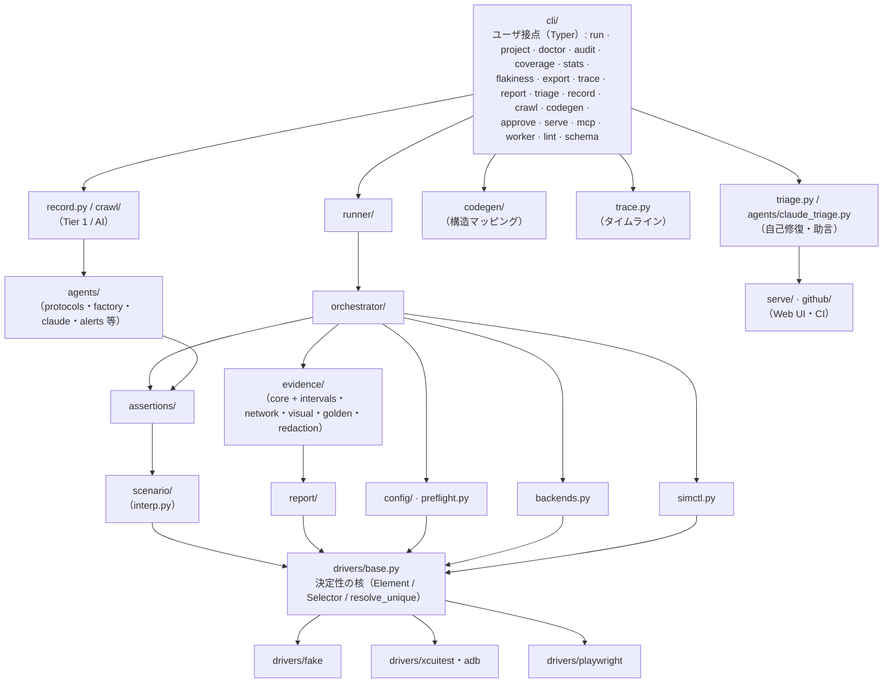

[English](../architecture.md) · **日本語**

# アーキテクチャとモジュール関係

> どのモジュールが何を担当し、どこに依存するか。また **設計（[`DESIGN.md`](../../DESIGN.md)）に
> あるが現状まだ配線されていない機能** を明示します。

関連: [concepts](concepts.md) · 各機能ページ（下のリンク）

---

## 全体像（データフロー）

[シナリオ](glossary.md#シナリオのオーサリング)（AI または人手で作成）が共有の成果物です。`run` は、それをゲートとして AI なしで決定的にリプレイします。`codegen` と `triage` もシナリオを入力として使います。
Tier 1（AI、図では黄）はオーサリングと調査のみを担い、Tier 2（決定的、図では青）は機械アサーションのみで合否を決めます。
この決定的な中核全体はプラットフォーム非依存で、プラットフォーム固有の継ぎ目は orchestrator が駆動する backend（iOS は XCUITest、Android は adb、web は playwright、… いずれも 1 つの `Driver` インターフェースの背後）だけです。新しいプラットフォームは新しい backend であって、コアの fork ではありません。

Mermaid ソース

<!-- mermaid-svg: assets/diagrams/architecture-data-flow-ja.svg -->

下の[依存レイヤ図](#依存関係レイヤ)は、同じシステムをデータフローではなくモジュール層として見たものです。

---

## モジュール一覧と役割

`bajutsu/` パッケージ（Python 3.13+、pydantic v2 / typer / anthropic / pyyaml / jinja2）。

| モジュール | 役割 | ページ |
|---|---|---|
| `drivers/base.py` | Driver Protocol + 共通型（`Element`/`Selector`/`Point`）+ **セレクタ解決**（決定性の核） | [selectors](selectors.md) / [drivers](drivers.md) |
| `drivers/coordinate_tree.py` | `CoordinateTreeDriver`。座標系のバックエンド（adb）が継承する共有基底クラス。一時的空ツリーへのリトライ / 安定キーによる settle / `_resolve` / `wait_for` を提供（BE-0254） | [drivers](drivers.md#adb-android) |
| `drivers/fake.py` | インメモリの `FakeDriver`（実機不要テスト用） | [drivers](drivers.md#fakedriver) |
| `drivers/xcuitest.py` | XCUITest バックエンド（iOS。BE-0290 で idb を撤去して以来、iOS の唯一の backend。実機上に常駐する runner が semantic tap、ネイティブ条件待ち、テキスト選択、multi-touch を提供。BE-0019） | [drivers](drivers.md#xcuitestios) |
| `drivers/adb.py` | adb バックエンド（Android。`uiautomator dump` による frame 中心の座標 tap） | [drivers](drivers.md#adb-android) |
| `drivers/playwright.py` | Playwright web バックエンド（ブラウザ。第一段、決定的 run） | [drivers](drivers.md#playwright-web) |
| `scenario/` | シナリオスキーマ（pydantic 厳格検証）+ YAML 読込 / 書出（パッケージ: `models` / `load` / `load_expanded` / `expand` / `select` / `serialize` / `edit`） | [scenarios](scenarios.md) |
| `assertions/` | 機械アサーション評価（総関数。例外を投げない）（パッケージ: `evaluate` / `network` / `visual` / `schema` / `_common`、BE-0250） | [selectors](selectors.md#アサーション評価) |
| `orchestrator/` | 決定的 Tier 2 run ループ（act → wait → verify）（パッケージ: `loop` / `waits` / `substitution` / `evidence_rules` / `actions`） | [run-loop](run-loop.md) |
| `evidence/` | 証跡の取得を役割ごとに分けたパッケージ（BE-0257）：`core`（瞬時 / 区間の取得と Sink）、`intervals`（video / deviceLog の simctl 子プロセス管理）、`network`（collector + プロトコル内の決定的モック）、`visual`（ビジュアルリグレッションの画像比較）、`golden`（要素ツリー比較）、`redaction`（ラベル / ヘッダ / フィールド + シークレット値の redaction） | [evidence](evidence.md) |
| `report/` | `manifest.json` + JUnit XML + CTRF JSON + インタラクティブ HTML に加え、完了した run の `.zip` エクスポートと再描画用のオフライン再読込（パッケージ: `format` / `manifest` / `ctrf` / `rows` / `panels` / `html` / `richtext` / `archive` / `load`） | [reporting](reporting.md) |
| `interp.py` | `${ns.key}` 補間プリミティブ（`params.` / `row.` / `secrets.` / `vars.`） | [scenarios](scenarios.md) |
| `config/` | チーム既定 × アプリ別の解決（`Effective`）（パッケージ: `schema` / `effective` / `resolve` / `accessors`） | [configuration](configuration.md) |
| `backends.py` | バックエンド可用性判定、actuator 選択（プラットフォーム対応レジストリ: `ios` / `android` / `web` / `fake`）、Driver 生成 | [drivers](drivers.md#バックエンド選択と-actuator) |
| `simctl.py` | `simctl` ラッパ（erase/boot/launch/openurl/io） | [drivers](drivers.md#環境管理simctl) |
| `preflight.py` | バックエンド別の実行可能ゲート（iOS: 必須 CLI + 起動済みシミュレータ / web: Playwright とその Chromium ブラウザ） | [configuration](configuration.md) |
| `requirements.py` | 単一の宣言的マッピング。backend / capability から pip extra + 外部ツールのプローブ + インストール方法へ（BE-0164）。`preflight` と `provision` が共有する | — |
| `provision.py` | config 対応の環境インストーラ（BE-0164）。config の backend と AI プロバイダを解決し、必要な extra とツールだけを冪等に導入する（`make install`） | — |
| `runner/` | config + シナリオ → レポート。デバイスプール + launch 手順。`device_provider` の seam が、run のデバイスをどこから調達するかを解決する（現状はローカルへの pass-through、将来はクラウドのアダプタ）（パッケージ: `pipeline` / `pool` / `launch` / `device_provider`） | [run-loop](run-loop.md#runner実行パイプライン) |
| `doctor.py` | 規約充足度スコア（id カバレッジ等） | [configuration](configuration.md#doctor規約充足度スコア) |
| `agents/` | AI / オーサリングエージェントの periphery（BE-0257）：`protocols` + `factory`（`Observation`/`Proposal`/`Agent` 抽象 + 唯一の SDK エージェントの構築）、`claude`（オーサリングエージェント）、`claude_backed`（共有基底、BE-0246）、`claude_enrich`、`claude_triage`、`ai_config`（プロバイダ/モデル/effort/言語の解決）、`anthropic_client`（SDK クライアント構築）、`availability`（資格情報欠如のメッセージ化）、`enrich`（enrichment ループ）、`alerts`（システムアラートガード） | [recording](recording.md) |
| `ai/` | ベンダー中立な AI バックエンドのシーム（BE-0104）。`AiBackend` プロトコルと正規化した request/response 型（`base`）、プロバイダレジストリ（`registry`）が登録済みの 4 プロバイダを賄います。`agents.anthropic_client` の上に立つ Anthropic 参照アダプタ（`anthropic`）による Anthropic API と Amazon Bedrock、Anthropic CLI `ant`（`ant`、BE-0163）、Claude Code CLI（`claude_code`、BE-0176） | [configuration](configuration.md#ai-プロバイダai-be-0047) |
| `record.py` | record ループ（observe → 提案 → 実行 → 書き出し） | [recording](recording.md#record-ループ) |
| `crawl/` | 自律的な幅優先クロール → スクリーンマップ：`core` エンジン + `serialize`、`guide` / `tabs` / `report` / `repro` / `flows` | [recording](recording.md) |
| `codegen/` | シナリオ → ネイティブテスト生成: XCUITest（Swift）、Playwright（TypeScript）、UI Automator（Kotlin） | [codegen](codegen.md) |
| `trace.py` | 保存済み run のテキストタイムライン（`trace` コマンド） | [cli](cli.md) |
| `triage.py` | M4 自己修復: ルールベース `HeuristicTriageAgent` + 構造化 fix（`renameId`/`addIndex`/`raiseTimeout`）、`--apply`/`--write`/`--rerun` | [cli](cli.md) |
| `github/` | GitHub ヘルパ：`actions`（CI、アノテーション + ジョブサマリ）、`app`（プライベートリポジトリの config source 向けの App インストールトークン）、`errors`（共有するアクセスエラー） | [ci](ci.md) |
| `serve/` | ローカル Web UI（`serve` コマンド）: オーサリング / 実行 / レポート / 失敗した run の triage | [cli](cli.md) |
| `mcp/` | MCP サーバ: `run`/`doctor` をツール + 実行証跡をリソースとして公開 | [cli](cli.md) |
| `lint.py` | シナリオ linter + JSON Schema 生成（`lint` / `schema` コマンド） | [cli](cli.md) |
| `analysis/` · `serve/flakiness.py` | 実機も AI も使わない読み取り専用の助言的分析パッケージ（BE-0257）、CI を止めない: `audit`（決定性・フレーキネス監査、BE-0049）、`coverage`（シナリオの id 名前空間カバレッジ、BE-0050）、`stats`（集計 run 統計ダッシュボード、BE-0102）、加えてクロスランのフレーキネスランキング（`flakiness`、BE-0220） | [cli](cli.md) |
| `cli/` | Typer ベース CLI。コマンドごとに `cli/commands/` の 1 ファイル（`run`/`project`/`doctor`/`audit`/`coverage`/`stats`/`flakiness`/`export`/`trace`/`report`/`triage`/`record`/`crawl`/`codegen`/`approve`/`serve`/`mcp`/`worker`/`lint`/`schema`） | [cli](cli.md) |
| `dotenv.py` | `.env` の最小ローダ（既存環境変数を上書きしない） | [cli](cli.md#環境変数env) |
| `_yaml.py` | `on`/`off`/`yes`/`no` を文字列のまま読む YAML ローダ | [scenarios](scenarios.md#yaml-の注意点) |

## 依存関係（レイヤ）

下層ほど安定で、上層が下層に依存します。中核は `drivers/base.py`（セレクタ解決）で、すべての実行系がここに依存します。

![依存レイヤ図。cli/ がユーザ接点であり、その下に runner/、record.py/crawl/、codegen/、trace.py、triage.py が直接ぶら下がります（codegen/ と trace.py には、これ以上の依存関係が描かれていません）。runner/ は orchestrator/ に、record.py/crawl/ は AI エージェント関連のヘルパーに、triage.py は serve・CI 関連のヘルパーに、それぞれ依存します。orchestrator/ とエージェント関連のヘルパーは assertions/ と evidence/ に依存し、orchestrator/ はさらに config.py、backends.py、simctl.py にも依存します。assertions/ は scenario/ に、evidence/ は report/ に依存し、scenario/、report/、config.py、backends.py、simctl.py はいずれも決定性の核である drivers/base.py に収束します。そこから drivers/fake、iOS 系ドライバ、Playwright ドライバへ分岐します。](assets/diagrams/architecture-dependency-layers-ja.svg)

Mermaid ソース

<!-- mermaid-svg: assets/diagrams/architecture-dependency-layers-ja.svg -->

- `orchestrator/` は `base.Driver` にのみ依存し、**どの具象ドライバとも結合しません**。そのため `FakeDriver` で実機なしにテストでき、本番では同じループが XCUITest（iOS）や playwright（web）を駆動します。
- `runner/` はアプリを起動して準備済みドライバを返す factory を提供し、ループを実機から分離します。
- `scenario/`（オーサリング表現の pydantic モデル）と `drivers/base.py`（実行時の TypedDict）は別物です。`Selector.as_selector()` が前者を後者へ変換します。

### 強制されるレイヤ境界（BE-0112）

上のレイヤ分けは規約にとどまりません。ゲートで**実行可能な契約**として強制します。`make lint-imports`（`make check` の一部であり、CI のステップでもあります）が [import-linter](https://import-linter.readthedocs.io/) を宣言したレイヤに対して実行するので、禁止された import は誰かが気付くまで残らず、その場でゲートを落とします。設定は `pyproject.toml` の `[tool.importlinter]` にあります。3 つのレイヤを宣言します。

1. **決定性コア**：モデルにも periphery のスタックにも触れずに判定と証跡を導く経路です。`orchestrator/`、`runner/`、`drivers/base.py`、`assertions/`、`evidence/`、`report/`、`config/`、`scenario/`、`preflight.py` / `capability_preflight.py` / `capabilities.py`、`doctor.py`、`lint.py` が含まれます。prime directive を担います。
2. **契約（contract）**：利用者が依存する安定した界面です。シナリオスキーマ（`scenario/`）と `Driver` Protocol（`drivers/base.py`）です。
3. **periphery**：契約の利用側で、いずれもオプションの extra の背後に切り離せます。`serve/`、`mcp/`、codegen のエミッタ、AI / エージェント経路（`agents/` 以下の `protocols`、`ai_config`、`anthropic_client`、`enrich`、`alerts` など、加えて `record.py`、`triage.py`、`crawl/guide.py` など）、`github/actions.py` / `notify.py` のヘルパです（`github/` の残り、`app` と `errors` は決定的コアからも参照できるので、`config_source` は periphery を巻き込まずに利用します）。

強制する契約は 3 つです。

- **決定性コアは periphery を import してはいけません。** これはprime directive 1 と 3 を静的な契約にしたものです。判定と証跡の経路を serve / AI / codegen のスタックから切り離したまま保ち、それらへの依存が黙って増えることを防ぎます。コアのモジュールが必要とする純粋な要素ツリーのヘルパ（`screen_size_from_elements`、`shows_app_ui` など）は、`record.py` のような periphery のモジュールではなくコア（`bajutsu/elements.py`）に置きます。同様に、解決済みの `ai` ブロック（`AiConfig`）は `config/` に置き、コアは AI クライアントを import せずにそれを読みます。
- **コアはホスト非依存に保ちます（BE-0129）。** マルチテナントなホスティングの関心事（組織、ロール、テナンシー）と、`db`（SQLAlchemy、Alembic、psycopg、cryptography）や `oauth`（Authlib）の extra は、`bajutsu/serve/` だけが持ちます。組織モデル（`OrgConfig`、`org_for_*`、`targets_for_org`、`load_serve_config`）は `config/` ではなく `bajutsu/serve/orgs.py` にあります。`Config` は `orgs` フィールドを持たず、コアのローダーは検証の前にトップレベルの `orgs:` を取り除くので、組織情報を含む config を読むホスト型構成の run はそのまま動きつつ、コアは組織を一切モデル化しません。同じ仕組みがトップレベルの `ui:` キー（BE-0191）も除去します。serve UI のプレゼンテーション設定（`ui.default_theme`）は serve の関心事であり、`bajutsu/serve/themes.py` で読み取られます。`Config` はモデル化しません。import-linter の forbidden 契約が `config/`・`drivers/`・`runner/`・`scenario/` をこれらの extra から遠ざけます（`include_external_packages` により外部 import も検出します）。これは、それらを `bajutsu.serve` から遠ざける periphery 契約の上に重ねたものです。
- **シナリオスキーマと `Driver` Protocol は可搬なインナー契約に保ちます。** periphery だけでなく runtime のコア（`orchestrator/`、`runner/`、`config/` など）からも独立させます。これにより契約は、利用者が runtime を引き込まずに依存できる安定したレイヤになり、バージョンをまたいだスキーマの読み取り（BE-0119）や、将来 periphery をコアから分離する余地を下支えします。

このチェックは import グラフに対する静的解析です。モデルは介在せず、決定的な合否以上のものは `run` / CI の判定経路に載りません。新しいモジュールを追加するときは、そのレイヤが置き場所を決めます。判定と証跡の経路上にあるならコアであり、periphery に到達してはいけません。契約を利用するなら periphery であり、extra の背後に置きます。

## テスト構成

`tests/` に **ユニットテスト一式**（`uv run pytest -q`）があります。すべて実機 Simulator を必要としません。コマンドビルダは純関数として、実行系は `FakeDriver` / 注入ランナー（`RunFn`、`Spawn`、`Clock`）で検証します。showcase アプリに対する実機 E2E は `make -C demos/showcase run-swiftui` / `make -C demos/showcase ui-test` です（[showcase](showcase.md)）。

### driver conformance suite（BE-0114）

prime directive 3 は、どの backend も 1 つの `Driver` 界面の背後に置くことを求めます。ですから決定性の中核となる不変条件は、すべての backend で同一に成り立たなければなりません。backend ごとのテストだけでは、これを保証できません。曖昧なセレクタで最初の一致を tap する backend や、0 件の query に成功を返す backend があっても、自身のテストは通り、落とす共通テストがないからです。**driver conformance suite** はこの隙間を埋めます。1 つの実行可能な契約（technology compatibility kit（TCK）に相当します）が、同じテスト本体をすべての backend に対して走らせ、共通の base だけでなく実際のドライバのインスタンス（`drivers/base` を迂回するコードを含みます）を駆動します。

契約（`tests/driver_conformance.py`）は、新しい backend が満たすべき「完了」の定義です。

- 曖昧なセレクタ（2 件以上の一致）は、最初の一致に作用せず失敗します。
- 0 件のセレクタは、成功を報告せず失敗します。
- セレクタの失敗は 1 つのエラー型（`SelectorError`）を共有し、backend をまたいで一様です。
- 一意の一致はエラーなく作用し、`query()` は画面上の要素を報告します。
- `capabilities()` が観測される挙動と一致します。`QUERY` / `ELEMENTS` の baseline を申告し、multi-touch のジェスチャは `MULTI_TOUCH` を申告したときに限り、全選択とクリップボードへのコピーは `TEXT_SELECTION` を申告したときに限り動作します（そうでなければそれぞれ `UnsupportedAction` を送出します。BE-0280）。
- フォーカス中のフィールドでテキスト編集が往復します（入力してから削除すると、報告される文字数が減ります）。また `tap_point`（生の座標タップ。アラート消去の経路）は、フィールドの中心を狙うとそのフィールドをフォーカスし、semantic tap と同じ観測可能な効果を持ちます（BE-0280）。
- `wait_for` は現在の画面を 1 回だけ判定し、共有の `wait_until` ループがそれを固定 sleep なしの条件待ちに変えます。

backend をこのスイートに加えるには、`ConformanceHarness`（画面を渡すと、それを表示するドライバを返すもの）を実装し、`DriverConformanceContract` を継承します。すると pytest が、継承した契約をその backend に対して走らせます。`FakeDriver` は高速な Linux ゲート（`make check`）で、Playwright は web CI ジョブで、XCUITest は iOS のオンデバイス E2E 経路（`ios-e2e.yml`）で、**adb backend** は起動済みの Android エミュレータ（`android-e2e.yml` の `conformance (adb)` ジョブ、BE-0270）で走ります。契約は同じで、第 2 の仕様はありません。

各 harness は画面をそれぞれの方法で実体化します。`FakeDriver` は要素をそのまま受け取り、Playwright は HTML として描画します。オンデバイスの harness は `SHOWCASE_CONFORMANCE` で showcase アプリを一度だけ conformance モードで起動し、以降は画面ごとに再シードします。これにより、共有の base だけでなく、実際の backend の query と操作のコードを駆動します。

iOS の harness は、アプリがポーリングする spec ファイル（Documents ディレクトリの `conformance-spec.txt`）を書き換えて再シードします。画面ごとの再起動や deeplink ではなくファイル書き込みにするのは、`simctl openurl` が iOS の「アプリで開きますか?」ダイアログを出し、画面ごとの再起動は数回の `app.launch()` で常駐 XCUITest ランナーをクラッシュさせるためです。

adb の harness はその代わりに、新しい `SHOWCASE_CONFORMANCE` の intent extra を載せてアプリの `singleTask` Activity を起動し直し、`onNewIntent` で届けます。`adb push` はアプリのサンドボックスに届かず、インテントなら `launchEnv`→intent extras の規約（BE-0007）に乗るからです。これは Compose ツールキットに限定します。spec 駆動で任意の id を描く画面を表現できるのは Compose だけです（`testTag` は実行時の任意の文字列を受け取りますが、Views の `resource-id` はコンパイル時の `R` エントリでなければなりません）。

このスイートには `ondevice` の pytest マーカーが付いており（ゲートの既定で除外されます）、`make check` では決して走りません。共有する 1 台のデバイスを 1 つのチャネルで再シードするため、並列ワーカーどうしが衝突しないよう直列で実行します。

---

## 実装状況

> 設計（[`DESIGN.md`](../../DESIGN.md)）には将来像も含まれます。**現状のコードが実際に動かすもの**と
> **まだ配線されていないもの**を区別します。

### 実装済み（テストあり、経路が通っている）

- セレクタ解決と曖昧検出（決定性の核）
- プラットフォーム対応の backend レジストリ: `--backend` / `backend:` は `ios` / `android` / `web` / `fake` トークンを受け取り、それぞれの actuator へ展開します（`backends.py`）。`ios` は `xcuitest` に展開します。BE-0290 で idb を撤去して以来、XCUITest が iOS の唯一の actuator です（`--backend ios` と `--backend xcuitest` は等価）。actuator を複数持つプラットフォームであれば**シナリオごと**にコスト順で解決しますが（BE-0240）、iOS が単一 actuator になった今、どのプラットフォームもコスト順と安定度順が食い違いません
- **XCUITest バックエンド**（`drivers/xcuitest.py`）: iOS の唯一の actuator です（BE-0290）。実機上に常駐する runner（`BajutsuKit`）を loopback HTTP 経由で駆動し、semantic（identifier）tap、ネイティブの条件待ち、テキスト選択、`pinch`/`rotate` の multi-touch ジェスチャを提供し、XCTest のオートメーションスナップショットを読み取ります（このスナップショットはグループコンテナの内側まで降りるので、座標系 backend と違って完全に展開された要素ツリーを描き出します）。汎用の runner（`XCUIApplication(bundleIdentifier:)`）はアプリ側の統合なしに任意のアプリを bundle id で駆動し、Xcode の `xcodebuild` を必要とします（BE-0019）。Simulator を対象にした target は runner の設定を必要としません。`xcuitest.testRunner` と `xcuitest.build` のどちらも指定しないときは、wheel にパッケージデータとして同梱された Simulator 用 runner に解決し、初回利用時にコンテンツハッシュ鍵の書き込み可能なキャッシュへ展開します。明示的な `testRunner` や `build` はこの既定より優先し、`deviceType: device` は引き続き署名済みの runner を明示することを必要とします（BE-0292）
- **Playwright web バックエンド**（`drivers/playwright.py`）: ブラウザに対する決定的 `run` を Linux のゲート上で動かせます（`demos/web`）。リッチ寄りの能力モデルまで引き上げ済み（BE-0054）: `page.route()` によるネイティブな `network` の観測とスタブ、共有の `driver_interval` seam を通した `video` と `deviceLog` 相当（console / page-error）の区間証跡、`multiTouch`（ピンチ / 回転）のエミュレーション、N 個の `BrowserContext` レーンにまたがる並列実行、ターゲット単位の `deviceMode`（既定はデスクトップで、Playwright のデバイスプリセットを指定するとモバイルをエミュレーションします。BE-0228）。`appTrace` のみ iOS 専用（`os_log`/simctl 由来）のまま
- **Android adb バックエンド**（`drivers/adb.py` ＋ `adb.py`）: 座標ドライバ（`uiautomator dump` → frame 中心タップ）、`AndroidEnvironment` の起動シーケンス、`doctor` の報告、interval 証跡（`video` は `screenrecord`、`deviceLog` は `logcat`。どちらも driver 供給の `driver_interval` seam を通す）とアプリ内の**ネットワーク捕捉** — OkHttp インターセプタ（`BajutsuAndroid`）がホストのコレクタへ報告し、そのコレクタを `adb reverse` でエミュレータへ橋渡しする `request` アサーション（BE-0283。`mocks` は追随の課題）、取得済み XML フィクスチャに対する fast ゲートのユニットテストまで。実機上での actuation fidelity は、システム `back`、deeplink、単一ラウンドトリップの `doubleTap`、スクロールによる要素解決、実行時パーミッションの事前付与を含みます（BE-0210）。デバイス制御は `setLocation` とクリップボードの読み書き / クリアの部分集合を、操作ごとの capability トークンで管理する形で実装済みです（BE-0211 / BE-0212）。クリップボードは Android 10 以降シェルプロセスから到達できないため、アプリ内のレシーバ（`BajutsuAndroid`、BE-0233）を経由します。一方、`push` / `clearKeychain` / ステータスバーの上書き / `background` / `foreground` は、エミュレータ側に相当機能がないため未対応のまま残ります。シナリオ単位の `permissions` フィールド（`pm grant`/`pm revoke`、BE-0276）は権限の語彙全体（API 33 以降の `POST_NOTIFICATIONS` を含む `notifications` も）に対応しており、対応する TCC（Transparency, Consent, and Control）サービスを持たない iOS の `simctl privacy` とは異なります。`pinch`/`rotate` の 2 本指マルチタッチは rooted device 限定で実装済み（protocol-B の `sendevent`、単一タッチへのフォールバックなし。BE-0232）。codegen は UI Automator（Kotlin）ターゲットを実装済み（BE-0209）。Android の e2e CI レーン（KVM 上のエミュレータ、`android-e2e.yml`。BE-0208）は実装済みで、モックネットワーク系を除く共有シナリオ一式を実行します。adb ドライバは、iOS と同じ横断バックエンドのセレクタでネイティブのタブバーを操作し、あらゆるタブに到達できます（クリック可能な `NavigationBarItem` が `button` トレイトを持ち、子要素のテキストを `label` として派生させます。BE-0223）。タブバー操作の欠落こそが、タブに紐づくシナリオをレーンから除外していた唯一の移植性の課題でした。**id の照合**はドライバ内で厳密一致のままです。native な id 構文が SPEC の id を再現できない場合（Android Views の `android:id` は `stable.refresh` を `stable_refresh` に写します）は、シナリオのセレクタが id を**両方の形**で列挙し、共有リゾルバが OR としてどちらにも一致します。ドライバ側の `.`↔`_` 書き換えではなく、シナリオ側の明示的な規約です（BE-0221）
- シナリオスキーマ（厳格検証）と YAML ラウンドトリップ。`id` / `idMatches` はプラットフォーム別の id 形に対応する OR 候補のリストを受け付けます（BE-0221）
- アサーション評価（`exists` / `value` / `label` / `count` / `enabled` / `disabled` / `selected` /
  `request` / `requestSequence` / `event` / `responseSchema` / `visual` / `clipboard` / `golden`）
- Tier 2 run ループ（act → wait → verify）、`FakeDriver` で検証
- DSL（ドメイン固有言語）: `within` セレクタ（幾何スコープ）、`relaunch` ステップ（実機検証済み）、再利用 `setup` 前段、起動時の `locale` 適用、デバイスプール上の並列実行（`--workers`）
- DSL のオーサリング再利用: 再利用可能なパラメータ化コンポーネント（`use` / `${params.*}`）、データ駆動シナリオ（`data` / `dataFile` と `${row.*}`）、シークレット変数（`${secrets.X}`、値マスク）、シナリオタグ + `--tag` / `--exclude` 選択、`setLocation` / `push` デバイスステップ、起動前の `permissions` フィールド（`simctl privacy` / `pm grant`|`pm revoke`、BE-0276）、`doubleTap` アクション、ファイル単位 + シナリオ単位の `description`
- DSL の制御フローとデータ取得: 条件分岐 `if` とループ `forEach`（決定的。条件は機械アサーション）、`extract`（要素の value / label / identifier を `${vars.*}` に取り込む）
- DSL の `interrupts`（BE-0314）: config レベル（アプリ全体の既定）とシナリオレベル（追記）の `{ condition, steps }` エントリのリストです。`if` が使うのと同じアサーション DSL の `condition` を再利用し、`screenChanged` ポリシー付きステップや `wait` のポーリングがすでに取得済みのツリーに対して機会をとらえてチェックします。オンボーディング画面や、アクセシビリティツリーから見えるパーミッションプロンプトのように、ステップ列の決まった一箇所ではなく予測できないタイミングで現れる画面が対象です。条件が一致すると、そのエントリの `steps` を実行してから中断していたステップを再開します（`wait` は元の deadline を維持し、act ステップは 1 回だけ再試行します）。再入をキャップし、上限に達するとそのステップ本来の結果にフォールバックします
- DSL のテキスト編集ステップ（BE-0265）: `clear` / `delete` / `select` / `copy` が `type` だけでは埋まらない部分を補います。adb・Playwright・XCUITest・fake の各バックエンドに実装済みで、web コンテキストは `select`/`copy` で `UnsupportedAction` を送出し（codegen 側は代わりに XCUITest へ誘導）、`clear`/`delete` でも同様に非対応です。ステップをまたぐ `SelectionState` が「`copy` の前に `select` が必要」という前提条件を担保し、どのバックエンドも選択状態を照会可能な形で公開しないため、検証は既存の `clipboard` 読み戻しのみで行います
- DSL のデバイス / システムアクション（iOS）: `background`、`clearKeychain`、`clearClipboard`、`overrideStatusBar` / `clearStatusBar`（決定的なステータスバー）、テストデータ準備 / Webhook 用の `http` アクション
- DSL の `handleSystemAlert`（BE-0316）: SpringBoard の権限プロンプトのボタンを、ネイティブなアクセシビリティ照会（ランナーの 2 つ目のオンデマンドな SpringBoard ハンドル）で tap する、決定的で iOS 専用のステップです。解決は Python 側の `resolve_unique` に残るため、リアクティブな視覚 `dismissAlerts` ガードに対する「決定性優先」の対極になります。この能力を宣言するのは XCUITest バックエンドだけなので、Android と web は preflight で失敗します
- 証跡: 瞬時（`screenshot`/`elements`/`actionLog`）+ 区間（`video`/`deviceLog`/`appTrace`）+ ネットワーク collector（`network.json`）+ **ビジュアルリグレッション**（baseline に対する `visual`。`approve` コマンドで baseline を昇格）+ `capturePolicy` 発火 + 書き出し前の **redaction 適用**
- ネットワーク観測 + **決定的モック**（シナリオ `mocks` → プロトコル内スタブ、実機検証済み）: `request` アサーション、`wait: { until: request }`、オフラインのスタブ応答
- **画面遷移シグナル**（BE-0310、iOS）: `BajutsuKit` のオプトインの `BajutsuScreen` が
  `UIViewController.viewDidAppear(_:)` を swizzle し、完了したビューコントローラの出現をそれぞれ
  コレクタの `/transitions` エンドポイントへ報告します。`NavigationStack` の push、シートの提示、タブの
  切り替えはいずれも `UIHostingController` に支えられているため、UIKit と SwiftUI のどちらも同じように覆います。
  同じプロセスにあるネットワーク通信のストアとは独立しています。起動直後の readiness ゲート（`_await_ready`）は、
  BE-0218 の namespace／要素数のヒューリスティックの上に新設した段として、このシグナルを参照します。ただし明示的な
  `readyWhen` はそれより上位で、base 画面の遷移が `readyWhen` の待つモーダルを先取りすることはありません。`settled`
  待ちは、ツリー差分のポーリングに代えて、このシグナルを静止の窓によるデバウンスとして参照します。observer を
  組み込まない（あるいはまだ遷移していない）ターゲットでは、どちらもツリー差分の挙動のまま変わりません。フェイクのシグナル源で
  高速ゲートのテストは済んでいますが、UIKit と SwiftUI の双方でのオンデバイス確認はこの項目自身のゲートであり、
  [`demos/showcase/BE-0310-screen-transition-verification.ja.md`](../../demos/showcase/BE-0310-screen-transition-verification.ja.md)
  で追っています。
- レポート（`manifest.json` / `junit.xml` / `ctrf.json` / `report.html`）
- config 解決（defaults × targets、redact マージ）と actuator 選択
- `simctl` コマンド層、XCUITest のオートメーションスナップショットのパーサ、`doctor` スコア + バックエンド別の実行可能ゲート（`preflight.py`: iOS は必須 CLI + 起動済みシミュレータ、web は Playwright とその Chromium ブラウザ）
- `trace` コマンド（`trace.py`）: 保存済み run のテキストタイムライン（steps + network + appTrace）
- M4 自己修復トリアージ（`triage.py` + `agents/claude_triage.py`）: 失敗 run のコンテキスト組み立て + `TriageAgent` 診断（ルールベース `HeuristicTriageAgent`、または `--ai` の Claude で失敗スクリーンショット込み）。エージェントは構造化 fix（`renameId` / `addIndex` / `raiseTimeout`）を提案でき、`--apply`/`--write` でシナリオ source に適用（diff プレビュー、opt-in）、`--rerun` で再実行検証
- CLI: `run` / `project` / `doctor` / `audit` / `coverage` / `stats` / `flakiness` / `export` / `trace` / `report` / `triage` / `record` / `crawl` / `codegen` / `approve` / `serve` / `mcp` / `worker` / `lint` / `schema`。`record` と `crawl` が Tier 1 の AI オーサリング経路で、alert guard を伴います
- 実機も AI も使わない読み取り専用の助言的な分析コマンド（CI を止めない。入力が欠けている、読めないときだけ非ゼロで終了します）: 静的、repeat-and-diff、longitudinal の 3 モードを持つ決定性・フレーキネス監査（`audit`、BE-0049）、シナリオの id 名前空間カバレッジマップ（`coverage`、BE-0050）、CLI / HTML 出力の集計 run 統計ダッシュボード（`stats`、BE-0102）、runs ディレクトリまたは `serve` のデータベースから見るクロスランのフレーキネスランキング（`flakiness`、BE-0220）、完了した run を持ち運び可能な `.zip` にまとめる export（`export`、BE-0060）、保存済みの run データから再実行なしに `report.html`/`junit.xml`/`ctrf.json` を再生成する report（`report`、BE-0068）
- **config プロジェクトハブ**（`project add`/`ls`/`use`/`rm` と `run --project`、BE-0225）: プロジェクト名を config のソースに束ねる名前付きレジストリで、CLI と `serve` の Web UI が共有します（データベースがあればそこに保存し、なければディスク上の JSON に保存します）。`serve` はヘッダーの**プロジェクト切り替え**と、プロジェクトを一覧・追加・削除・切り替えするトップレベルの **Projects** ページ（BE-0275）を備え、再起動なしにアクティブな config を切り替えます
- **クロスプロジェクトのメトリクス比較ダッシュボード**（BE-0226）: `serve` の **Metrics** タブが、登録済みのプロジェクトを pass 率、flaky 率、p50/p95 の run 所要時間、そしてプロジェクトごとのトレンドスパークラインで横並びに順位付けします。BE-0102 のプロジェクト単位の集計をプロジェクトごとに 1 回ずつ実行して再利用します（`GET /api/metrics/projects`）。BE-0102 と同じく読み取り専用でアドバイザリ
- AI **crawl**（`crawl/`）: アプリを自律的に幅優先で探索し、スクリーンマップ（`screenmap.json`）を作ります
- `serve` ローカル Web UI（Tier 1）: ブラウザからシナリオをオーサリング（`record` / `crawl`）、編集、実行し、config + シナリオ + ビルド済みアプリバイナリの **`.zip` バンドルをアクティブな config として開いて**各タブをそこから動かします（BE-0073）。サーバはこの 3 つをそれぞれ独立した content-addressed な成果物としても受け付け、バインド時にそのツリーへ合成します（`POST /api/artifacts/{config,scenarios,binary}`、BE-0268）。UI にも**Compose & load** パネルを備え、成果物ごとのドロップゾーンでブラウザ側でハッシュ化し、サーバがまだ持たないバイト列だけをアップロードしたうえで、要求に応じてバインド済みの config へ合成します。レポートと証跡を閲覧できます。Replay の履歴タブでも crawl でも、行ごとまたは一括で削除すると、実行は共有の**ゴミ箱**へ移動するだけで、保持期間内であれば復元できます（BE-0239）。過去の crawl のスクリーンマップは、残りのフロンティアを同じ予算とワーカー設定のまま続けて探索するか、剪定済みの 1 つの分岐だけを同じ予算で再探索するかたちで**再開**できます（BE-0181）。集計 **run 統計ダッシュボード**の各軸（日付、backend、シナリオ、step/assertion のホットスポット）から履歴一覧の該当する run へ直接ジャンプできます（BE-0241）。Record と Replay のフォームでは実行前の**準備状況パネル**（`doctor`: 環境の runnability と現在画面の規約スコア）を確認でき（BE-0148）、Replay のフォームでは実行前に選択中のシナリオの生の YAML とランナー解析による構造化ステップを読み取り専用で表示します（config ビューアのシナリオ版で、実行の判定には関与せず AI も使いません。BE-0273）。バインド済みの config が宣言する `${secrets.X}` の名前を一覧する**Scenario secrets** パネルも備え、値をブラウザから書き込み専用で設定でき、そこから起動する Record / Replay / Crawl の run に引き継がれます（BE-0274）。実行中のサーバの解決済み設定（デプロイモード、バインド済み config の来歴、backend、run の保存先・保持期間・並行数の設定）に加え、このビルドが同梱の iOS XCUITest Simulator runner を出荷しているか、出荷しているならどのツールチェーンでビルドしたかを示す、読み取り専用の **Server** 設定タブも備えます（`GET /api/server`、BE-0318）。**プラグイン可能なテーマシステム**（ドロップイン方式のビジュアルトークンと差し替え可能なトランジション、ヘッダーのピッカー、ライブプレビュー付きの UI 内エディタとローカル下書き / サーバアップロードの永続化。BE-0191）を備え、このページを配信している bajutsu 自身のビルドをヘッダーに示す**バージョンバッジ**を持ちます（バージョン文字列は常に表示し、Git チェックアウトから起動しているときは短縮コミット SHA、ブランチ名、dirty 判定も添えます。`.git` を持たないセルフホストの Docker イメージでは、ビルド時に埋め込んだコミット（`BAJUTSU_BUILD_COMMIT`。`source: "build-arg"` として示します）にフォールバックします。ブランチ名は作業中のトピックを含みうるため、チェックアウトの詳細は admin に制限します。`GET /api/version` は公開、`GET /api/version/checkout` は admin で、リクエストのたびに `git` の plumbing コマンドで最新を読み取り（環境変数へのフォールバックつき）、LLM は介しません。BE-0272、BE-0277）。ビジュアル baseline を承認し、ジョブをライブ配信します（CI 用ではありません）
- **MCP サーバ**（`bajutsu mcp`）: `bajutsu_run` と `bajutsu_doctor` を MCP ツールとして、実行証跡をリソースとして公開します。Claude Desktop / Code との連携用（オプション依存 `fastmcp`）
- **シナリオ linter**（`bajutsu lint` / `bajutsu schema`）: 実行せずにシナリオを検証します。エディタ連携用に JSON Schema も出力します
- codegen: シナリオ → ネイティブテスト。共有のシナリオ走査（BE-0083）の上に、XCUITest（Swift、iOS）、
  Playwright（TypeScript、web）、UI Automator（Kotlin、Android。BE-0209）の 3 ターゲット

### 実機 Simulator で検証済み（iPhone 17 Pro、近年の iOS）

- XCUITest バックエンドの常駐 runner（`BajutsuKit`）を実機で検証しています。XCTest のオートメーションスナップショットの読み取り、スナップショットハンドルによる要素解決、semantic（identifier）tap、text / swipe、`simctl` launch 手順、`simctl io` スクリーンショットを、Xcode の `xcodebuild` に対して確認しました。showcase シナリオの実行、証跡の取得、triage 自己修復ループを実機で走らせています（`make -C demos/showcase run-swiftui`。`ios-e2e.yml` CI も smoke 経路を実行します）。[BE-0290](../../roadmaps/BE-0290-xcuitest-default-ios-backend/BE-0290-xcuitest-default-ios-backend-ja.md) で idb を撤去して以来、この経路の iOS backend は XCUITest だけです。
- XCUITest バックエンドの `back` とデバイス制御（`setLocation` / クリップボード / `push`）を実機上で実行しています。`ios-e2e.yml` が PR ごとに検証します（[BE-0281](../../roadmaps/BE-0281-ios-on-device-actuation-coverage/BE-0281-ios-on-device-actuation-coverage-ja.md)）。
- `pinch`/`rotate` の multi-touch ジェスチャを、`ios-e2e.yml` の `gestures (xcuitest)` ジョブ（`demos/showcase/scenarios/gestures_multitouch.yaml`、`--backend ios`）で確認済みです。

### ブラウザで検証済み（Linux で動作、Mac 不要）

- Playwright web バックエンドは `demos/web` のシナリオを、CI と同じ `make check` ゲートの中（`ci.yml` の `web-e2e` ジョブ）で決定的に実行します。決定的コアがプラットフォーム非依存であることの裏付けです。リッチ寄りの web 取得（ネットワーク / 動画 / マルチタッチ）は BE-0054 で実装済みです。N 個のブラウザプロセスにまたがる並列 web クロール（[BE-0077](../../roadmaps/BE-0077-parallel-web-crawl/BE-0077-parallel-web-crawl-ja.md)）は、この同じゲートの上で動きます。
- 実ネットワーク経路（`page.route` の介入、`requestfinished` のキャプチャ、`mocked` の来歴フラグ、実際にキャプチャした証拠の redaction）は、`network (playwright)` ジョブ（`web-e2e.yml`。[BE-0282](../../roadmaps/BE-0282-real-backend-network-coverage/BE-0282-real-backend-network-coverage-ja.md)）が実ブラウザに対して動かします。`network (playwright)` ジョブは `demos/web/scenarios/network.yaml` を **network を有効にして** 実行し、続いて永続化された `network.json` がキャプチャした秘密情報をマスクしていることをアサートします。このジョブはまずシグナルとして着地させましたが、CI で安定を確認できたので、現在は必須の `E2E (web)` ゲートに組み込んでいます。iOS 側（`network_mock.yaml` と `network_live.yaml` を Simulator ジョブとしてつなぐ）はまだ未完です。Android は現在、アプリ側のネットワークキャプチャ（BE-0283）に対応しています。**BajutsuAndroid** の OkHttp インターセプタが、各リクエストを `adb reverse` トンネル経由でホストの collector へ報告する仕組みで、iOS で `BajutsuKit` が使うのと同じアプリ側連携の形です。adb ドライバ自体は、アクチュエーションの対象になるネイティブのネットワークモニタがないため、引き続きネイティブな `NETWORK` capability を宣言しません。そのため `network (adb)` ジョブ（`android-e2e.yml`）は、ドライバの capability を介さず、このアプリ側の経路を直接検証します。

### Android エミュレータで検証済み（Linux で動作、Mac 不要）

- adb バックエンドの subprocess 実行（`uiautomator dump` パース、フレーム中心の tap、`AndroidEnvironment` の起動シーケンス、on-device の actuation fidelity、`pinch`/`rotate` のマルチタッチとデバイス制御のスライスを含む）を、KVM 上で起動した x86_64 API 34 AVD に対して確認しています（`android-e2e.yml`、BE-0208）。iOS が走らせるのと同じ共有シナリオを Compose と Views 両方の showcase ビルドで駆動し、Compose カタログの golden 要素ツリー検査とピクセル単位のビジュアルリグレッション baseline も併せて確認しています。このレーンは常駐 UI Automator サーバ（[BE-0245](../../roadmaps/BE-0245-adb-resident-uiautomator-server/BE-0245-adb-resident-uiautomator-server-ja.md)）もビルドするので、これらの読み取りは既定で常駐チャネル（`adb forward` 越しの `GET /source`。1 回約 2.4 秒の `uiautomator dump` 起動を置き換えます）を通り、`uiautomator dump` 経路はダンプへフォールバックさせた golden の実行で守ります。

### 未配線（スキーマ/フラグはあるが実行時に効かない）

| 機能 | 現状 | 場所 |
|---|---|---|
| `mockServer`（外部モックコマンド） | config スキーマのみ。`cmd`/`port` の外部サーバは**未実装**で、シナリオ `mocks`（宣言的なプロトコル内スタブ、実装済み）で代替する | `config/schema.py` `MockServer` |
| **web** バックエンドでの `appTrace` 区間証跡 | `appTrace` は `os_log`/simctl 由来（iOS 専用）。Playwright バックエンドは代わりに `video` と `deviceLog` 相当（console / page-error）の区間証跡を実装する（BE-0054）が、`appTrace` に相当するものは持たない | `evidence/intervals.py` · `drivers/playwright.py` |

これらは各機能ページでも該当箇所に「未実装」と注記しています。
