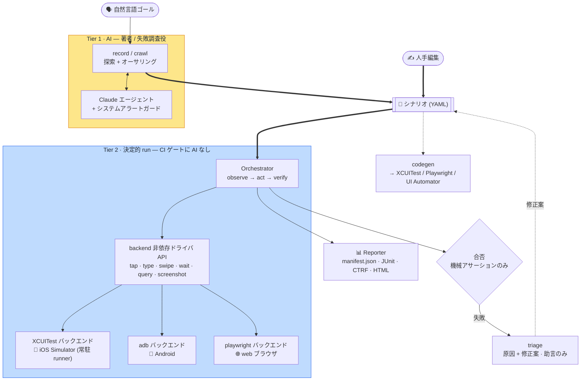
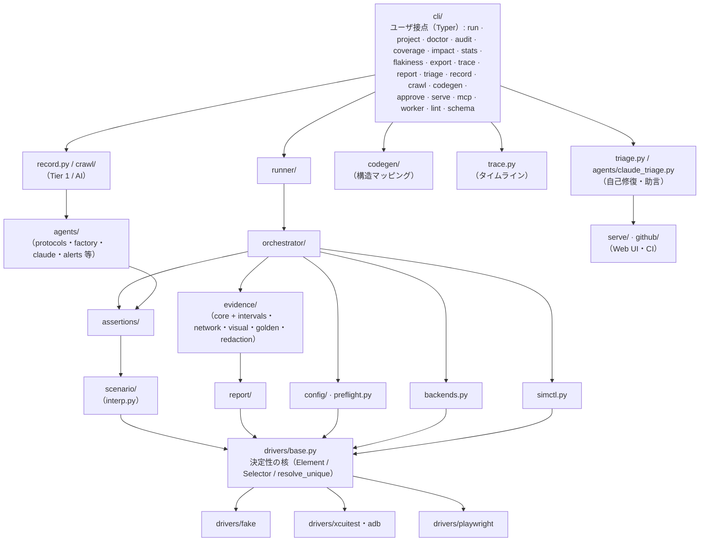

[English](../architecture.md) · **日本語**

# アーキテクチャとモジュール関係

> どのモジュールが何を担当し、どこに依存するか。また **設計（[`DESIGN.md`](../../DESIGN.md)）に
> あるが現状まだ配線されていない機能** を明示します。

関連: [concepts](concepts.md) · 各機能ページ（下のリンク）

---

## 全体像（データフロー）

[シナリオ](glossary.md#シナリオのオーサリング)（AI または人手で作成）が共有の成果物です。`run` は、それをゲートとして AI なしで決定的にリプレイします。`codegen` と `triage` もシナリオを入力として使います。
Tier 1（AI、図では黄）はオーサリングと調査のみを担い、Tier 2（決定的、図では青）は機械アサーションのみで合否を決めます。
この決定的な中核全体はプラットフォーム非依存で、プラットフォーム固有の継ぎ目は orchestrator が駆動する backend（iOS は XCUITest、Android は adb、web は playwright、… いずれも 1 つの `Driver` インターフェースの背後）だけです。新しいプラットフォームは新しい backend であって、コアの fork ではありません。

Mermaid ソース

<!-- mermaid-svg: assets/diagrams/architecture-data-flow-ja.svg -->

```mermaid
flowchart TB
    goal(["🗣️ 自然言語ゴール"])
    hand(["✍️ 人手編集"])
    scenario[["📄 シナリオ (YAML)"]]

    subgraph tier1["Tier 1 · AI — 著者 / 失敗調査役"]
        record["record / crawl<br/>探索 + オーサリング"]
        agent["Claude エージェント<br/>+ システムアラートガード"]
        record <--> agent
    end

    subgraph tier2["Tier 2 · 決定的 run — CI ゲートに AI なし"]
        orch["Orchestrator<br/>observe → act → verify"]
        driver["backend 非依存ドライバ API<br/>tap · type · swipe · wait · query · screenshot"]
        xcuitest["XCUITest バックエンド<br/>📱 iOS Simulator (常駐 runner)"]
        adb["adb バックエンド<br/>🤖 Android"]
        pw["playwright バックエンド<br/>🌐 web ブラウザ"]
        orch --> driver
        driver --> xcuitest
        driver --> adb
        driver --> pw
    end

    verdict{"合否<br/>機械アサーションのみ"}
    report["📊 Reporter<br/>manifest.json · JUnit · CTRF · HTML"]
    codegen["codegen<br/>→ XCUITest / Playwright / UI Automator"]
    triage["triage<br/>原因 + 修正案 · 助言のみ"]

    goal --> record
    record ==> scenario
    hand ==> scenario
    scenario ==> orch
    scenario -.-> codegen
    orch --> verdict
    orch --> report
    verdict -->|失敗| triage
    triage -.->|修正案| scenario

    classDef ai fill:#fde68a,stroke:#d97706,color:#1f2937;
    classDef det fill:#bfdbfe,stroke:#2563eb,color:#1f2937;
    class tier1 ai
    class tier2 det
```

下の[依存レイヤ図](#依存関係レイヤ)は、同じシステムをデータフローではなくモジュール層として見たものです。

---

## モジュール一覧と役割

`bajutsu/` パッケージ（Python 3.13+、pydantic v2 / typer / anthropic / pyyaml / jinja2）。

| モジュール | 役割 | ページ |
|---|---|---|
| `drivers/base.py` | Driver Protocol + 共通型（`Element`/`Selector`/`Point`）+ **セレクタ解決**（決定性の核） | [selectors](selectors.md) / [drivers](drivers.md) |
| `drivers/actuation.py` | `Actuation`/`ActuationLog`。各ドライバがステップの結果へ書き足す具体的なジェスチャーの記録（座標・経路・プラットフォームが受理したか）。`actionLog` 証跡種別を支えます（BE-0345） | [evidence](evidence.md#各ステップが画面に対して実際に行ったことactionlog) |
| `drivers/coordinate_tree.py` | `CoordinateTreeDriver`。座標系のバックエンド（adb）が継承する共有基底クラス。一時的空ツリーへのリトライ / 安定キーによる settle / `_resolve` / `wait_for` を提供（BE-0254） | [drivers](drivers.md#adbandroid) |
| `drivers/fake.py` | インメモリの `FakeDriver`（実機不要テスト用） | [drivers](drivers.md#fakedriver) |
| `drivers/xcuitest.py` | XCUITest バックエンド（iOS。BE-0290 で idb を撤去して以来、iOS の唯一の backend。実機上に常駐する runner が semantic tap、ネイティブ条件待ち、テキスト選択、multi-touch を提供。BE-0019） | [drivers](drivers.md#xcuitestios) |
| `drivers/adb.py` | adb バックエンド（Android。`tap`/`long_press`/`double_tap` は resident server の `POST /act` で端末側にて解決・inject し、channel が使えないときは `uiautomator dump` による frame 中心の座標 tap にフォールバックします。BE-0339） | [drivers](drivers.md#adbandroid) |
| `drivers/playwright.py` | Playwright web バックエンド（ブラウザ。第一段、決定的 run） | [drivers](drivers.md#playwrightweb) |
| `drivers/xcuitest_live.py` | live-route の XCUITest ドライバ。常駐 runner のチャネルの代わりに、予約済みのデバイスクラウド上の iOS デバイスへ W3C WebDriver（Appium の XCUITest ドライバ）で駆動する `appium` デバイスプロバイダ向け（BE-0238）。セッションのライフサイクル、query/tap/screenshot/readiness、ジェスチャ、テキスト入力までを実装済み。`selectAll`/`copy` は Appium 側に相当機能がなく明示的に失敗する。実デバイスクラウドのグリッドに対する検証は未了（[BE-0303](../../roadmaps/BE-0303-xcuitest-live-real-grid-verification/BE-0303-xcuitest-live-real-grid-verification-ja.md)） | — |
| `scenario/` | シナリオスキーマ（pydantic 厳格検証）+ YAML 読込 / 書出（パッケージ: `models` / `load` / `load_expanded` / `expand` / `select` / `serialize` / `edit`） | [scenarios](scenarios.md) |
| `assertions/` | 機械アサーション評価（総関数。例外を投げない）（パッケージ: `evaluate` / `network` / `visual` / `schema` / `_common`、BE-0250） | [selectors](selectors.md#アサーション評価) |
| `orchestrator/` | 決定的 Tier 2 run ループ（act → wait → verify）（パッケージ: `loop` / `waits` / `substitution` / `evidence_rules` / `actions`） | [run-loop](run-loop.md) |
| `cancellation.py` | 協調的キャンセル（BE-0370）。orchestrator の wait ループと runner がポーリングする読み取り専用の `CancelSource`、poll ループが安全な境界まで巻き戻すために投げる `RunCancelled` 例外、`bajutsu run` のエントリポイントが組み込む `SIGTERM` → イベントのブリッジをまとめて持ちます。Bajutsu の他モジュールを一切 import しないため、決定的コア、CLI、`serve` のいずれからも参照できます | [run-loop](run-loop.md) |
| `evidence/` | 証跡の取得を役割ごとに分けたパッケージ（BE-0257）：`core`（瞬時 / 区間の取得と Sink）、`intervals`（video / deviceLog の simctl 子プロセス管理）、`network`（collector + プロトコル内の決定的モック）、`visual`（ビジュアルリグレッションの画像比較）、`golden`（要素ツリー比較）、`redaction`（ラベル / ヘッダ / フィールド + シークレット値の redaction） | [evidence](evidence.md) |
| `report/` | `manifest.json` + JUnit XML + CTRF JSON + インタラクティブ HTML に加え、完了した run の `.zip` エクスポートと再描画用のオフライン再読込（パッケージ: `format` / `manifest` / `ctrf` / `rows` / `panels` / `html` / `richtext` / `archive` / `load`） | [reporting](reporting.md) |
| `interp.py` | `${ns.key}` 補間プリミティブ（`params.` / `row.` / `secrets.` / `vars.`） | [scenarios](scenarios.md) |
| `mailbox.py` | `email` ステップ（BE-0046）向けの純粋でネットワークを使わない照合・抽出ロジック。メールボックスプロバイダのメッセージを正規化し、`to`/`subject`/`subjectMatches` で照合し、ステップ開始後に届いたメッセージだけを選び、正規表現で値を `${vars.*}` に取り出す | [scenarios](scenarios.md) |
| `config/` | チーム既定 × アプリ別の解決（`Effective`）（パッケージ: `schema` / `effective` / `resolve` / `accessors`） | [configuration](configuration.md) |
| `backends.py` | バックエンド可用性判定、actuator 選択（プラットフォーム対応レジストリ: `ios` / `android` / `web` / `fake`）、Driver 生成 | [drivers](drivers.md#バックエンド選択と-actuator) |
| `simctl.py` | `simctl` ラッパ（erase/boot/launch/openurl/io） | [drivers](drivers.md#環境管理simctl) |
| `platform_lifecycle/` | `Environment` の seam（BE-0009）。1 つの `RunEnvironment`/`CrawlEnvironment` Protocol がプラットフォームごとのアプリ起動・readiness・relaunch・デバイス制御・teardown を担い、`runner/` と `cli/commands/crawl.py` は actuator 名で分岐せず iOS/Android/web を同じインターフェースを通じて駆動（パッケージ: `protocols` / `factories` / `readiness` / `relaunchers` / `device_control` / `read_session`、加えて `environments/` ── `ios` / `xcuitest` / `xcuitest_live` / `android` / `web` / `fake`） | — |
| `preflight.py` | バックエンド別の実行可能ゲート（iOS: 必須 CLI + 起動済みシミュレータ / web: Playwright とその Chromium ブラウザ） | [configuration](configuration.md) |
| `requirements.py` | 単一の宣言的マッピング。backend / capability から pip extra + 外部ツールのプローブ + インストール方法へ（BE-0164）。`preflight` と `provision` が共有する | — |
| `provision.py` | config 対応の環境インストーラ（BE-0164）。config の backend と AI プロバイダを解決し、必要な extra とツールだけを冪等に導入する（`make install`） | — |
| `runner/` | config + シナリオ → レポート。デバイスプール + launch 手順。`device_provider` の seam が、run のデバイスをどこから調達するかを解決する（組み込みの `local` pass-through に加え、予約済みの実機 iOS デバイスを Appium/WebDriver エンドポイント越しにエンドツーエンドで駆動する `appium` provider、BE-0238。他のクラウドベンダ種別は今後の追加課題）。`recovery` はバックエンドクラッシュのリトライ回数・wall-clock 予算の判定とインフラ障害の分類を持ち、オンデバイスのドライバ適合性スイートと共有します（BE-0334）。さらに `recovery` は、pool の teardown 箇所・`launch_driver`・オンデバイススイートの lease 破棄が共有する、守られた teardown の方針も持ちます（BE-0342）。`mailbox` は `email` ステップの transport を、`kind` で鍵付けしたレジストリで解決します（出荷済みなのは `http` の JSON アダプタ、BE-0186）。形は `ai/registry.py` を踏襲します（パッケージ: `pipeline` / `pool` / `launch` / `device_provider` / `recovery` / `mailbox`） | [run-loop](run-loop.md#runner実行パイプライン) |
| `doctor.py` | 規約充足度スコア（id カバレッジ等） | [configuration](configuration.md#doctor規約充足度スコア) |
| `agents/` | AI / オーサリングエージェントの periphery（BE-0257）：`protocols` + `factory`（`Observation`/`Proposal`/`Agent` 抽象 + 唯一の SDK エージェントの構築）、`claude`（オーサリングエージェント）、`claude_backed`（共有基底、BE-0246）、`claude_enrich`、`claude_triage`、`ai_config`（プロバイダ/モデル/effort/言語の解決）、`anthropic_client`（SDK クライアント構築）、`availability`（資格情報欠如のメッセージ化）、`enrich`（enrichment ループ）、`alerts`（システムアラートガード） | [recording](recording.md) |
| `ai/` | ベンダー中立な AI バックエンドのシーム（BE-0104）。`AiBackend` プロトコルと正規化した request/response 型（`base`）、プロバイダレジストリ（`registry`）が登録済みの 4 プロバイダを賄います。`agents.anthropic_client` の上に立つ Anthropic 参照アダプタ（`anthropic`）による Anthropic API と Amazon Bedrock、Anthropic CLI `ant`（同じく `anthropic` アダプタ経由、BE-0163）、Claude Code CLI（`claude_code`、BE-0176） | [configuration](configuration.md#ai-プロバイダaibe-0047) |
| `record.py` | record ループ（observe → 提案 → 実行 → 書き出し） | [recording](recording.md#record-ループ) |
| `crawl/` | 自律的な幅優先クロール → スクリーンマップ：`core` エンジン + `serialize`、`guide` / `tabs` / `report` / `repro` / `flows` | [recording](recording.md) |
| `codegen/` | シナリオ → ネイティブテスト生成: XCUITest（Swift）、Playwright（TypeScript）、UI Automator（Kotlin） | [codegen](codegen.md) |
| `trace.py` | 保存済み run のテキストタイムライン（`trace` コマンド） | [cli](cli.md) |
| `triage.py` | M4 自己修復: ルールベース `HeuristicTriageAgent` + 構造化 fix（`renameId`/`addIndex`/`raiseTimeout`）、`--apply`/`--write`/`--rerun` | [cli](cli.md) |
| `github/` | GitHub ヘルパ：`actions`（CI、アノテーション + ジョブサマリ）、`app`（プライベートリポジトリの config source 向けの App インストールトークン）、`errors`（共有するアクセスエラー） | [ci](ci.md) |
| `serve/` | ローカル Web UI（`serve` コマンド）: オーサリング / 実行 / レポート / 失敗した run の triage | [cli](cli.md) |
| `mcp/` | MCP サーバ: `run`/`doctor` をツール + 実行証跡をリソースとして公開 | [cli](cli.md) |
| `lint.py` | シナリオ linter + JSON Schema 生成（`lint` / `schema` コマンド） | [cli](cli.md) |
| `analysis/` · `serve/flakiness.py` | 実機も AI も使わない読み取り専用の助言的分析パッケージ（BE-0257）、CI を止めない: `audit`（決定性・フレーキネス監査、BE-0049）、`coverage`（シナリオの id 名前空間カバレッジ、BE-0050）、`impact`（テスト影響分析。diff から影響ステップを選ぶ、BE-0321）、`stats`（集計 run 統計ダッシュボード、BE-0102）、加えてクロスランのフレーキネスランキング（`flakiness`、BE-0220） | [cli](cli.md) |
| `cli/` | Typer ベース CLI。コマンドごとに `cli/commands/` の 1 ファイル（`run`/`project`/`doctor`/`audit`/`coverage`/`impact`/`stats`/`flakiness`/`export`/`trace`/`report`/`triage`/`record`/`crawl`/`codegen`/`approve`/`serve`/`mcp`/`worker`/`lint`/`schema`） | [cli](cli.md) |
| `dotenv.py` | `.env` の最小ローダ（既存環境変数を上書きしない） | [cli](cli.md#環境変数env) |
| `_yaml.py` | `on`/`off`/`yes`/`no` を文字列のまま読む YAML ローダ | [scenarios](scenarios.md#yaml-の注意点) |

## 依存関係（レイヤ）

下層ほど安定で、上層が下層に依存します。中核は `drivers/base.py`（セレクタ解決）で、すべての実行系がここに依存します。

![依存レイヤ図。cli/ がユーザ接点であり、その下に runner/、record.py/crawl/、codegen/、trace.py、triage.py が直接ぶら下がります（codegen/ と trace.py には、これ以上の依存関係が描かれていません）。runner/ は orchestrator/ に、record.py/crawl/ は AI エージェント関連のヘルパーに、triage.py は serve・CI 関連のヘルパーに、それぞれ依存します。orchestrator/ とエージェント関連のヘルパーは assertions/ と evidence/ に依存し、orchestrator/ はさらに config.py、backends.py、simctl.py にも依存します。assertions/ は scenario/ に、evidence/ は report/ に依存し、scenario/、report/、config.py、backends.py、simctl.py はいずれも決定性の核である drivers/base.py に収束します。そこから drivers/fake、iOS 系ドライバ、Playwright ドライバへ分岐します。](assets/diagrams/architecture-dependency-layers-ja.svg)

Mermaid ソース

<!-- mermaid-svg: assets/diagrams/architecture-dependency-layers-ja.svg -->

```mermaid
flowchart TB
    cli["cli/<br/>ユーザ接点（Typer）: run · project · doctor · audit · coverage · impact · stats ·<br/>flakiness · export · trace · report · triage · record · crawl · codegen ·<br/>approve · serve · mcp · worker · lint · schema"]

    runner["runner/"]
    record["record.py / crawl/<br/>（Tier 1 / AI）"]
    codegen["codegen/<br/>（構造マッピング）"]
    trace["trace.py<br/>（タイムライン）"]
    triage["triage.py / agents/claude_triage.py<br/>（自己修復・助言）"]

    orch["orchestrator/"]
    agentStuff["agents/<br/>（protocols・factory・claude・alerts 等）"]
    serveGh["serve/ · github/<br/>（Web UI・CI）"]

    assertions["assertions/"]
    evidence["evidence/<br/>（core + intervals・network・visual・golden・redaction）"]

    scenario["scenario/<br/>（interp.py）"]
    report["report/"]
    config["config/ · preflight.py"]
    backends["backends.py"]
    simctl["simctl.py"]

    base["drivers/base.py<br/>決定性の核（Element / Selector / resolve_unique）"]

    fake["drivers/fake"]
    ios["drivers/xcuitest・adb"]
    pw["drivers/playwright"]

    cli --> runner
    cli --> record
    cli --> codegen
    cli --> trace
    cli --> triage

    runner --> orch
    record --> agentStuff
    triage --> serveGh

    orch --> assertions
    orch --> evidence
    agentStuff --> assertions

    assertions --> scenario
    evidence --> report
    orch --> config
    orch --> backends
    orch --> simctl

    scenario --> base
    report --> base
    config --> base
    backends --> base
    simctl --> base

    base --> fake
    base --> ios
    base --> pw
```

- `orchestrator/` は `base.Driver` にのみ依存し、**どの具象ドライバとも結合しません**。そのため `FakeDriver` で実機なしにテストでき、本番では同じループが XCUITest（iOS）や playwright（web）を駆動します。
- `runner/` はアプリを起動して準備済みドライバを返す factory を提供し、ループを実機から分離します。
- `scenario/`（オーサリング表現の pydantic モデル）と `drivers/base.py`（実行時の TypedDict）は別物です。`Selector.as_selector()` が前者を後者へ変換します。

### 強制されるレイヤ境界（BE-0112）

上のレイヤ分けは規約にとどまりません。ゲートで**実行可能な契約**として強制します。`make lint-imports`（`make check` の一部であり、CI のステップでもあります）が [import-linter](https://import-linter.readthedocs.io/) を宣言したレイヤに対して実行するので、禁止された import は誰かが気付くまで残らず、その場でゲートを落とします。設定は `pyproject.toml` の `[tool.importlinter]` にあります。3 つのレイヤを宣言します。

1. **決定性コア**：モデルにも periphery のスタックにも触れずに判定と証跡を導く経路です。`orchestrator/`、`runner/`、`drivers/base.py`、`assertions/`、`evidence/`、`report/`、`config/`、`scenario/`、`preflight.py` / `capability_preflight.py` / `capabilities.py`、`doctor.py`、`lint.py` が含まれます。prime directive を担います。
2. **契約（contract）**：利用者が依存する安定した界面です。シナリオスキーマ（`scenario/`）と `Driver` Protocol（`drivers/base.py`）です。
3. **periphery**：契約の利用側で、いずれもオプションの extra の背後に切り離せます。`serve/`、`mcp/`、codegen のエミッタ、AI / エージェント経路（`agents/` 以下の `protocols`、`ai_config`、`anthropic_client`、`enrich`、`alerts` など、加えて `record.py`、`triage.py`、`crawl/guide.py` など）、`github/actions.py` / `notify.py` のヘルパです（`github/` の残り、`app` と `errors` は決定的コアからも参照できるので、`config_source` は periphery を巻き込まずに利用します）。

強制する契約は 3 つです。

- **決定性コアは periphery を import してはいけません。** これはprime directive 1 と 3 を静的な契約にしたものです。判定と証跡の経路を serve / AI / codegen のスタックから切り離したまま保ち、それらへの依存が黙って増えることを防ぎます。コアのモジュールが必要とする純粋な要素ツリーのヘルパ（`screen_size_from_elements`、`shows_app_ui` など）は、`record.py` のような periphery のモジュールではなくコア（`bajutsu/elements.py`）に置きます。同様に、解決済みの `ai` ブロック（`AiConfig`）は `config/` に置き、コアは AI クライアントを import せずにそれを読みます。
- **コアはホスト非依存に保ちます（BE-0129）。** マルチテナントなホスティングの関心事（組織、ロール、テナンシー）と、`db`（SQLAlchemy、Alembic、psycopg、cryptography）や `oauth`（Authlib）の extra は、`bajutsu/serve/` だけが持ちます。組織モデル（`OrgConfig`、`org_for_*`、`targets_for_org`、`load_serve_config`）は `config/` ではなく `bajutsu/serve/orgs.py` にあります。`Config` は `orgs` フィールドを持たず、コアのローダーは検証の前にトップレベルの `orgs:` を取り除くので、組織情報を含む config を読むホスト型構成の run はそのまま動きつつ、コアは組織を一切モデル化しません。同じ仕組みがトップレベルの `ui:` キー（BE-0191）も除去します。serve UI のプレゼンテーション設定（`ui.default_theme`）は serve の関心事であり、`bajutsu/serve/themes.py` で読み取られます。`Config` はモデル化しません。import-linter の forbidden 契約が `config/`・`drivers/`・`runner/`・`scenario/` をこれらの extra から遠ざけます（`include_external_packages` により外部 import も検出します）。これは、それらを `bajutsu.serve` から遠ざける periphery 契約の上に重ねたものです。
- **シナリオスキーマと `Driver` Protocol は可搬なインナー契約に保ちます。** periphery だけでなく runtime のコア（`orchestrator/`、`runner/`、`config/` など）からも独立させます。これにより契約は、利用者が runtime を引き込まずに依存できる安定したレイヤになり、バージョンをまたいだスキーマの読み取り（BE-0119）や、将来 periphery をコアから分離する余地を下支えします。

このチェックは import グラフに対する静的解析です。モデルは介在せず、決定的な合否以上のものは `run` / CI の判定経路に載りません。新しいモジュールを追加するときは、そのレイヤが置き場所を決めます。判定と証跡の経路上にあるならコアであり、periphery に到達してはいけません。契約を利用するなら periphery であり、extra の背後に置きます。

## テスト構成

`tests/` に **ユニットテスト一式**（`uv run pytest -q`）があります。すべて実機 Simulator を必要としません。コマンドビルダは純関数として、実行系は `FakeDriver` / 注入ランナー（`RunFn`、`Spawn`、`Clock`）で検証します。showcase アプリに対する実機 E2E は `make -C demos/showcase run-swiftui` / `make -C demos/showcase ui-test` です（[showcase](showcase.md)）。

### driver conformance suite（BE-0114）

prime directive 3 は、どの backend も 1 つの `Driver` 界面の背後に置くことを求めます。ですから決定性の中核となる不変条件は、すべての backend で同一に成り立たなければなりません。backend ごとのテストだけでは、これを保証できません。曖昧なセレクタで最初の一致を tap する backend や、0 件の query に成功を返す backend があっても、自身のテストは通り、落とす共通テストがないからです。**driver conformance suite** はこの隙間を埋めます。1 つの実行可能な契約（technology compatibility kit（TCK）に相当します）が、同じテスト本体をすべての backend に対して走らせ、共通の base だけでなく実際のドライバのインスタンス（`drivers/base` を迂回するコードを含みます）を駆動します。

契約（`tests/driver_conformance.py`）は、新しい backend が満たすべき「完了」の定義です。

- 曖昧なセレクタ（2 件以上の一致）は、最初の一致に作用せず失敗します。
- 0 件のセレクタは、成功を報告せず失敗します。
- セレクタの失敗は 1 つのエラー型（`SelectorError`）を共有し、backend をまたいで一様です。
- 一意の一致はエラーなく作用し、`query()` は画面上の要素を報告します。
- `capabilities()` が観測される挙動と一致します。`QUERY` / `ELEMENTS` の baseline を申告し、multi-touch のジェスチャは `MULTI_TOUCH` を申告したときに限り、全選択とクリップボードへのコピーは `TEXT_SELECTION` を申告したときに限り、ネイティブな `<select>` を値で設定する操作は `SELECT_OPTION` を申告したときに限り動作します（そうでなければそれぞれ `UnsupportedAction` を送出します。BE-0280）。
- フォーカス中のフィールドでテキスト編集が往復します（入力してから削除すると、報告される文字数が減ります）。また `tap_point`（生の座標タップ。アラート消去の経路）は、フィールドの中心を狙うとそのフィールドをフォーカスし、semantic tap と同じ観測可能な効果を持ちます（BE-0280）。
- `wait_for` は現在の画面を 1 回だけ判定し、共有の `wait_until` ループがそれを固定 sleep なしの条件待ちに変えます。

backend をこのスイートに加えるには、`ConformanceHarness`（画面を渡すと、それを表示するドライバを返すもの）を実装し、`DriverConformanceContract` を継承します。すると pytest が、継承した契約をその backend に対して走らせます。`FakeDriver` は高速な Linux ゲート（`make check`）で、Playwright は web CI ジョブで、XCUITest は iOS のオンデバイス E2E 経路（`ios-e2e.yml`）で、**adb backend** は起動済みの Android エミュレータ（`android-e2e.yml` の `conformance (adb)` ジョブ、BE-0270）で走ります。契約は同じで、第 2 の仕様はありません。

各 harness は画面をそれぞれの方法で実体化します。`FakeDriver` は要素をそのまま受け取り、Playwright は HTML として描画します。オンデバイスの harness は `SHOWCASE_CONFORMANCE` で showcase アプリを一度だけ conformance モードで起動し、以降は画面ごとに再シードします。これにより、共有の base だけでなく、実際の backend の query と操作のコードを駆動します。

iOS の harness は、アプリがポーリングする spec ファイル（Documents ディレクトリの `conformance-spec.txt`）を書き換えて再シードします。画面ごとの再起動や deeplink ではなくファイル書き込みにするのは、`simctl openurl` が iOS の「アプリで開きますか?」ダイアログを出し、画面ごとの再起動は数回の `app.launch()` で常駐 XCUITest ランナーをクラッシュさせるためです。

adb の harness はその代わりに、新しい `SHOWCASE_CONFORMANCE` の intent extra を載せてアプリの `singleTask` Activity を起動し直し、`onNewIntent` で届けます。`adb push` はアプリのサンドボックスに届かず、インテントなら `launchEnv`→intent extras の規約（BE-0007）に乗るからです。これは Compose ツールキットに限定します。spec 駆動で任意の id を描く画面を表現できるのは Compose だけです（`testTag` は実行時の任意の文字列を受け取りますが、Views の `resource-id` はコンパイル時の `R` エントリでなければなりません）。

このスイートには `ondevice` の pytest マーカーが付いており（ゲートの既定で除外されます）、`make check` では決して走りません。共有する 1 台のデバイスを 1 つのチャネルで再シードするため、並列ワーカーどうしが衝突しないよう直列で実行します。

### 障害注入レーン（BE-0305）

ドライバには、実際のデバイス障害のためだけに存在する機構が 2 つあります。そしてここまでのスイートは、そのどちらの条件にも出会いません。conformance スイートは読み取りの前に必ず画面の準備完了を待ち、ランナーを意図的に壊すジョブもないからです。`CoordinateTreeDriver` の transient-empty リトライ（BE-0254）は、デバイスが遷移途中に返すほぼ空の要素ツリーを乗り越えるために存在します。XCUITest チャネルの一過性リトライ（BE-0207）と crash-recovery（BE-0287）は、応答しなくなったランナーを乗り越えるために存在します。高速スイートのテストは、要素数を組み立て、合成した例外を送出します。これは制御フローに対する実質的なカバレッジですが、実際の条件がそこに到達するかどうかの証拠にはなりません。実際のデバイスは Python の例外を送出しませんし、要素数を見る検出ヒューリスティクスは、組み立てた要素数なら通るまま壊れうるからです。

**障害注入レーン**は、代わりに実際の条件を注入します。`fault-injection (adb)`（`android-e2e.yml`）はエミュレータのディスプレイをスリープさせます。すると実際の読み取り元（常駐 UI Automator チャネルと、その背後の `uiautomator dump` フォールバック）が本当に空のツリーを返します。リトライがそこを、誤った「要素が見つからない」を出さずに乗り越えることを検証します。2 つ目のケースはディスプレイを落としたまま保ってリトライ予算を使い切らせ、その結末が静かな失敗ではなく明示的な `ElementNotFound` になることを固定します。`fault-injection (xcuitest)`（`ios-e2e.yml`）はランナー自身のホストプロセスにシグナルを送ります。`SIGSTOP` はソケットを accept できる状態に保ったまま応答を止めます。ホストから見れば、まさに固まったランナーの姿です。そのため短い凍結は一過性リトライが吸収し、リトライ予算を超える凍結は crash-recovery が乗り越えます。`SIGKILL` では、無関係なタイムアウトではなく実行中のランナー障害を名指しするクラッシュ診断で実行が終わらなければなりません。

どちらのレーンも、障害をどれだけ保つかを推測しません。各ケースは、検証対象の層に到達したというドライバ自身のログ記録（`tests/fault_injection.py`）を合図に障害を解除します。したがって、あるケースがどの機構を駆動したかは、sleep の長さではなく観測された挙動が決めます。両レーンは PR ごとのシグナルであり、各レーンの必須集約チェックからは意図的に外してあり、安定を確認してから必須化します。これは BE-0282 が確立した「まずシグナル、のちに必須」の道筋です。意図的にデバイスを壊すレーンは、健全なデバイスを駆動するレーンより本質的にフレーキーになるリスクが高いので、その道筋に乗せます。

### 並行デバイスレーン（BE-0298）

ここまでのジョブはどれもデバイスを 1 台しか起動しません。そのため、`runner/pool.py` の `device_pool` が並列実行に対して主張する保証を、どのジョブも観測できません。その保証とは、`--workers N` のもとで各ワーカーが固有のデバイスを借り受けることです。さらに各ワーカーは、共有された 1 つの run ディレクトリの下にある固有の `run_dir/<sid>` サブディレクトリにだけ証跡を書きます。モックのポートや索引も、ほかのワーカーのシナリオとは共有しません。[`DESIGN.md`](../../DESIGN.md) §3.3 が述べる「状態を共有しない」不変条件です。

高速スイートが証明できるのは、プール自身の記帳についてだけです。`tests/runner/test_pool.py` は `make_driver` を monkeypatch します。そして `FakeDriver` インスタンスに `"UDID-A"` のような架空の udid を渡します。これで示せるのは、**プールが管理するデータ構造のなかで**ワーカー A のリソースがワーカー B のものと分離されていることまでです。そのデータ構造の外側にある OS とサブプロセスのレベルの競合については、何も語りません。起動ロックで競合する 2 つの実際の `simctl` や `adb` の呼び出し、デバイスごとに確保されるホストポート、ワーカーのサブディレクトリが存在する前に計算される成果物パスが、その競合にあたります。

**並行デバイスレーン**は、代わりに実際のデバイスを 2 台起動します。`pool (xcuitest)`（`ios-e2e.yml`）は Simulator を 2 台、`pool (adb)`（`android-e2e.yml`）はエミュレータを 2 台起動します。どちらも、状態に依存しない showcase のシナリオを 1 回の `bajutsu run --workers 2` で走らせます。プールは作業を 2 台へ振り分け、両方のワーカーを同時にビジーに保たなければなりません。Android のジョブが走らせるシナリオファイルは 4 本ですが、iOS のジョブは `smoke.yaml` と `notices.yaml` の 2 本だけです。あわせて専用の [`showcase.pool.config.yaml`](../../demos/showcase/showcase.pool.config.yaml) を使い、タッチマーカーも切ります。Simulator 2 台にデバイスごとの動画記録が重なると、run が終わらないうちに macOS ランナーのキャプチャサービスのキューが行き詰まったためです（BE-0361 と同じ兆候です）。ファイル 2 本でもシナリオドキュメントは 4 本あるので、プールは 2 つのワーカーに同時に仕事を渡します。そのため、次の段落で述べる判定が必要とする同時実行の組み合わせは残ります。

結果を判定に変えるのは `scripts/assert_pool_isolation.py` です。終了した run の `manifest.json` と、run ディレクトリのサブディレクトリ一覧を読みます。ほかのワーカーの slug の下に記録された成果物、1 つの slug を共有する 2 つの結果、どの結果にも属さないサブディレクトリ、結果が記録したのに run が書いていない証跡ディレクトリのいずれかを見つけたら失敗します。片方のデバイスが黙ってすべてのシナリオを引き受けた場合、異なるデバイス上の 2 本のシナリオが実時間で重ならなかった場合も失敗します。この検査はファイルの読み取りと集合の比較にすぎません。`bajutsu run` が自身の判定を返した後に走るので、run の成果物を観測するだけで、どのシナリオの合否にも入力されません。

どちらのレーンも、専用の変更フィルタ（`scripts/e2e_changes.py` の `touches_pool`）で発火します。ほかのすべてのジョブが読む、レーン全体を対象としたシグナルより狭いフィルタです。各レーンのほかのジョブの 2 倍のデバイスを起動し、iOS 側では 10 倍課金の runner を使うからです。

両レーンは PR ごとのシグナルであり、各レーンの必須集約チェックからは外してあります。BE-0282 の「まずシグナル、のちに必須」の道筋に乗せる理由は、障害注入レーンと同じものをさらに強めた形です。BE-0361 は macOS runner を 3 コア・7 GiB と実測しました。Simulator を 1 台起動した時点でゲストプロセスが 257 個立ち上がり、物理メモリの未使用分は 189 MB しか残りません。2 台目のデバイスは、すでに飽和した天井に対してゲストの数を倍にします。そこでの失敗がプールの欠陥ではなくホストの枯渇だったなら、それは 1 つの実測結果です。その 2 つを見分ける材料は、両ジョブがアップロードする診断です。

---

## 実装状況

> 設計（[`DESIGN.md`](../../DESIGN.md)）には将来像も含まれます。**現状のコードが実際に動かすもの**と
> **まだ配線されていないもの**を区別します。

### 実装済み（テストあり、経路が通っている）

- セレクタ解決と曖昧検出（決定性の核）
- プラットフォーム対応の backend レジストリ: `--backend` / `backend:` は `ios` / `android` / `web` / `fake` トークンを受け取り、それぞれの actuator へ展開します（`backends.py`）。`ios` は `xcuitest` に展開します。BE-0290 で idb を撤去して以来、XCUITest が iOS の唯一の actuator です（`--backend ios` と `--backend xcuitest` は等価）。actuator を複数持つプラットフォームであれば**シナリオごと**にコスト順で解決しますが（BE-0240）、iOS が単一 actuator になった今、どのプラットフォームもコスト順と安定度順が食い違いません
- **XCUITest バックエンド**（`drivers/xcuitest.py`）: iOS の唯一の actuator です（BE-0290）。実機上に常駐する runner（`BajutsuKit`）を loopback HTTP 経由で駆動し、semantic（identifier）tap、ネイティブの条件待ち、テキスト選択、`pinch`/`rotate` の multi-touch ジェスチャを提供し、XCTest のオートメーションスナップショットを読み取ります（このスナップショットはグループコンテナの内側まで降りるので、座標系 backend と違って完全に展開された要素ツリーを描き出します）。汎用の runner（`XCUIApplication(bundleIdentifier:)`）はアプリ側の統合なしに任意のアプリを bundle id で駆動し、Xcode の `xcodebuild` を必要とします（BE-0019）。Simulator を対象にした target は runner の設定を必要としません。`xcuitest.testRunner` と `xcuitest.build` のどちらも指定しないときは、wheel にパッケージデータとして同梱された Simulator 用 runner に解決し、初回利用時にコンテンツハッシュ鍵の書き込み可能なキャッシュへ展開します。明示的な `testRunner` や `build` はこの既定より優先し、`deviceType: device` は引き続き署名済みの runner を明示することを必要とします（BE-0292）
- **Playwright web バックエンド**（`drivers/playwright.py`）: ブラウザに対する決定的 `run` を Linux のゲート上で動かせます（`demos/web`）。リッチ寄りの能力モデルまで引き上げ済み（BE-0054）: `page.route()` によるネイティブな `network` の観測とスタブ、共有の `driver_interval` seam を通した `video` と `deviceLog` 相当（console / page-error）の区間証跡、`multiTouch`（ピンチ / 回転）のエミュレーション、N 個の `BrowserContext` レーンにまたがる並列実行、ターゲット単位の `deviceMode`（既定はデスクトップで、Playwright のデバイスプリセットを指定するとモバイルをエミュレーションします。BE-0228）。`appTrace` のみ iOS 専用（`os_log`/simctl 由来）のまま
- **Android adb バックエンド**（`drivers/adb.py` ＋ `adb.py`）: `tap`/`long_press`/`double_tap` は解決した要素の
  identity を resident server の `POST /act` へ送り、server が自身の live なツリーに対して再解決して inject するため、
  ジェスチャは inject する瞬間にデバイスが持つ bounds へ着地します。リトライを使い切るか channel に `/act` エンドポイントが
  ないときは、host 側で計算した frame 中心の座標 tap にフォールバックします（BE-0339、進行中）。`AndroidEnvironment` の起動シーケンス、`doctor` の報告、interval 証跡（`video` は `screenrecord`、`deviceLog` は `logcat`。どちらも driver 供給の `driver_interval` seam を通す）とアプリ内の**ネットワーク捕捉** — OkHttp インターセプタ（`BajutsuAndroid`）がホストのコレクタへ報告し、そのコレクタを `adb reverse` でエミュレータへ橋渡しする `request` アサーション（BE-0283。`mocks` は追随の課題）、取得済み XML フィクスチャに対する fast ゲートのユニットテストまで。実機上での actuation fidelity は、システム `back`、deeplink、単一ラウンドトリップの `doubleTap`、スクロールによる要素解決、実行時パーミッションの事前付与を含みます（BE-0210）。デバイス制御は `setLocation` とクリップボードの読み書き / クリアの部分集合を、操作ごとの capability トークンで管理する形で実装済みです（BE-0211 / BE-0212）。クリップボードは Android 10 以降シェルプロセスから到達できないため、アプリ内のレシーバ（`BajutsuAndroid`、BE-0233）を経由します。一方、`push` / `clearKeychain` / ステータスバーの上書き / `background` / `foreground` は、エミュレータ側に相当機能がないため未対応のまま残ります。シナリオ単位の `permissions` フィールド（`pm grant`/`pm revoke`、BE-0276）は権限の語彙全体（API 33 以降の `POST_NOTIFICATIONS` を含む `notifications` も）に対応しており、対応する TCC（Transparency, Consent, and Control）サービスを持たない iOS の `simctl privacy` とは異なります。`pinch`/`rotate` の 2 本指マルチタッチは rooted device 限定で実装済み（protocol-B の `sendevent`、単一タッチへのフォールバックなし。BE-0232）。codegen は UI Automator（Kotlin）ターゲットを実装済み（BE-0209）。Android の e2e CI レーン（KVM 上のエミュレータ、`android-e2e.yml`。BE-0208）は実装済みで、モックネットワーク系を除く共有シナリオ一式を実行します。adb ドライバは、iOS と同じ横断バックエンドのセレクタでネイティブのタブバーを操作し、あらゆるタブに到達できます（クリック可能な `NavigationBarItem` が `button` トレイトを持ち、子要素のテキストを `label` として派生させます。BE-0223）。タブバー操作の欠落こそが、タブに紐づくシナリオをレーンから除外していた唯一の移植性の課題でした。**id の照合**はドライバ内で厳密一致のままです。native な id 構文が SPEC の id を再現できない場合（Android Views の `android:id` は `stable.refresh` を `stable_refresh` に写します）は、シナリオのセレクタが id を**両方の形**で列挙し、共有リゾルバが OR としてどちらにも一致します。ドライバ側の `.`↔`_` 書き換えではなく、シナリオ側の明示的な規約です（BE-0221）
- **既存の XCUITest / adb backend をそのまま使う Flutter アプリ**（BE-0008）: Flutter は新しい backend を
  追加しません。`Semantics(identifier: …)`（Flutter 3.19 以降）が、XCUITest と adb がすでに読んでいるのと
  同じ OS のアクセシビリティツリーへ写るため、プラットフォーム中立な `id` セレクタはネイティブアプリと
  同じように解決・actuation できます。Flutter 版 showcase の双子アプリで実機確認済みです
  （id 規約、semantics が遅延構築されるという前提、確認済みの制約 — `network`/`mocks` を観測できないことと、
  プラグインなしを保つ Flutter アプリがリンクしない in-app receiver を必要とする Android のクリップボード —
  は [drivers.md#flutterネイティブバックエンド経由](drivers.md#flutterネイティブバックエンド経由) にあります）
- シナリオスキーマ（厳格検証）と YAML ラウンドトリップ。`id` / `idMatches` はプラットフォーム別の id 形に対応する OR 候補のリストを受け付けます（BE-0221）
- アサーション評価（`exists` / `value` / `label` / `count` / `enabled` / `disabled` / `selected` /
  `request` / `requestSequence` / `event` / `responseSchema` / `visual` / `clipboard` / `golden`）
- Tier 2 run ループ（act → wait → verify）、`FakeDriver` で検証
- run パイプラインでの**バックエンドクラッシュ復旧**: シナリオ途中でバックエンドがクラッシュした場合（`base.BackendCrashError`、バックエンドに依存しない）、死んだリースを破棄し、新規に再生成したリースでシナリオ全体をやり直します。上限はリトライ回数（`crash_retries`、既定 1）と、再生成に費やす合計時間の任意の wall-clock 上限（`crash_recovery_budget`、既定は無制限）の 2 つで、クラッシュし続けるシナリオや復旧しないランナーを、黙って合格扱いにしたりジョブをハングさせたりせず、はっきりと失敗させます。再試行は、シナリオが `erase: true` を宣言したときにすでに得られるのと同じ `erase` の precondition を強制します。XCUITest バックエンドでは Simulator 自体の再起動（`simctl shutdown → erase → boot`）、adb バックエンドではアプリレベルのクリーンな状態化であり、直前にクラッシュしたそのデバイスへのその場での respawn ではありません。シナリオが `reinstall: overwrite` を宣言してリースをまたいだアプリのデータ保持を求めている場合、および `erase` の precondition をそもそも受け付けない2つの XCUITest 経路（実機、`xcuitest.deviceType: device`／live WebDriver エンドポイント。そこで強制すれば1シナリオの失敗では済まず run 自体が中断してしまいます）では、この強制をスキップします（単なる `erase: false` では不十分です。CLI はどのシナリオの `erase` も、パイプラインに届く前にすでに具体的な bool 値、多くの場合 `false` に解決してしまっているため、その値だけを見るガードでは、この仕組みがまさに対象としている経路そのもので強制再試行が無効になってしまいます）。強制 erase 用のリース自体がデバイスレベルの不具合（`simctl.DeviceError`/`adb.DeviceError`。`BackendCrashError` とは別系統の型であり、その派生ではありません）で失敗したときは、この不具合をこのループの外まで伝播させて run 全体を中断させるのではなく、同じその場での respawn に切り替えます。もう1つの run 単位の wall-clock 予算（`run_crash_recovery_budget`、こちらも既定は無制限）は、クラッシュ復旧に使う時間をシナリオ単位でリセットせず run 全体を通して上限を設けるもので、劣化し続けるデバイスは、各シナリオが自分の予算を静かに使い切って外部の CI タイムアウトがジョブを打ち切るのを待つ代わりに、run 自体をはっきりと失敗させます。最終的に成功する復旧にこの run 単位の予算を使い切っただけでは、何もラッチされません。それはデバイスがまだ機能していることを示しているにすぎないからです。あるシナリオ自身のクラッシュ再試行ループが、この予算を主因として実際に失敗した後は初めて、以降のどのシナリオも、自身の最初のリースを試す前の時点で即座に失敗します。この確認はクラッシュ再試行ループの中だけでなく、各シナリオの先頭でも行われます。これにより、すでに復旧できないと分かっているデバイスに対して、残る全シナリオが同じ打ち切りに至るまでにコールド起動の試行を1回ずつ余計に払わずに済みます。オンデバイスのドライバ適合性スイートはシナリオ単位の判定を共有しており（`runner/recovery.py`）、Simulator のインフラ障害が起きても、無関係な PR で必須チェックを赤くすることなく同じように復旧します（BE-0334）。Simulator の XCUITest 経路では、再試行は erase より強い段として**デバイスの置き換え**を持ちます（BE-0354）。消えたデバイスを置き換えるときと同じ手順で新しいデバイスを作り、劣化したデバイスはシャットダウンしてプールから外します。erase が消すのはデバイスのデータであって、固まった画面キャプチャの機構ではありません。そのため、強制 erase 付きの再試行がまたクラッシュした場合はこの段へ進みます。映像の録画が書き込みを始めたことを確認できないまま終わった試行も、この段へ直接進みます。その兆候は、erase の効かない劣化を言い当てているからです。置き換えの試行では強制 erase を外します。これから作成するデバイスには消すものがないからです。この段が働くのは、udid を固定しておらず `appPath` を持つ run にかぎるので、`--udid` で名指しした run はそのデバイス上の erase による再試行を保ちます。置き換えが消すものは erase より多いため、erase の段が尊重する `reinstall: overwrite` と `bajutsu run --no-erase` も同じように尊重します
- DSL（ドメイン固有言語）: `within` セレクタ（幾何スコープ）、`relaunch` ステップ（実機検証済み）、再利用 `setup` 前段、起動時の `locale` 適用、デバイスプール上の並列実行（`--workers`）
- DSL のオーサリング再利用: 再利用可能なパラメータ化コンポーネント（`use` / `${params.*}`）、データ駆動シナリオ（`data` / `dataFile` と `${row.*}`）、シークレット変数（`${secrets.X}`、値マスク）、シナリオタグ + `--tag` / `--exclude` 選択、`setLocation` / `push` デバイスステップ、起動前の `permissions` フィールド（`simctl privacy` / `pm grant`|`pm revoke`、BE-0276）、`doubleTap` アクション、ファイル単位 + シナリオ単位の `description`
- DSL の制御フローとデータ取得: 条件分岐 `if` とループ `forEach`（決定的。条件は機械アサーション）、`extract`（要素の value / label / identifier を `${vars.*}` に取り込む）
- DSL の `totp` と `email` ステップ（BE-0046）: `totp` は共有シークレット（多くは `${secrets.*}`）から RFC 6238 のワンタイムパスワードを生成して `${vars.*}` に書き込みます。ネットワークもモデルも使わず、ローカルで決定的です。`email` はメールボックス（config の `targets.<name>.mailbox`。レジストリ方式の transport で、出荷済みなのは `http` アダプタ、BE-0186）をポーリングし、`to` / `subject` / `subjectMatches` に一致するメッセージがステップ開始後に届くまで待ってから、`bodyMatches` の正規表現で値を `${vars.*}` に抽出します。`timeout` で上限を定めた条件待ちであり、固定 sleep ではありません
- DSL の `generate` ステップ（BE-0377）: 乱数（選んだ文字集合による文字列、整数、任意の精度を持つ小数、バージョン4の UUID）または現在日時（任意の `strftime` の `format`、加算される符号付きオフセット、任意の IANA `timezone`。既定は UTC）を計算し、`${vars.*}` に書き込みます。ランナー側で生成器から値を引くか、クロックを読むだけで、ネットワークとモデルのいずれにも触れません。描画できない `format` と未知の `timezone` は、シナリオのロード時に拒否されます。そのため、受理されたステップは常に実行され、常に成功します。生成した値はステップの manifest エントリに記録されてレポートに表示され、どの codegen ターゲットもラベル付きの `// TODO` を出力します
- DSL の `interrupts`（BE-0314）: config レベル（アプリ全体の既定）とシナリオレベル（追記）の `{ condition, steps }` エントリのリストです。`if` が使うのと同じアサーション DSL の `condition` を再利用し、ステップ列の決まった一箇所ではなく予測できないタイミングで現れる画面（オンボーディング画面や、アクセシビリティツリーから見えるパーミッションプロンプトなど）を対象に、機会をとらえてチェックします。この判定が追加コストなしで済むのは、そのステップのために読んだばかりのツリーに乗れる場合だけです。`wait` のポーリングと、持ち越したツリーがないときに `screenChanged` ポリシー付きステップが読む `before` が、これにあたります。残りの `wait` 以外のステップは `driver.query()` を 1 回余分に呼びます。前のステップから持ち越した `prev_after`（BE-0234）を使うステップも、古い可能性があるものとして読み直すため、ここに含まれます。条件が一致すると、そのエントリの `steps` を実行してから中断していたステップを再開します（`wait` は元の deadline を維持し、act ステップは 1 回だけ再試行します）。再入をキャップし、上限に達するとそのステップ本来の結果にフォールバックします
- DSL の `scroll` アクション（BE-0326）: 画面全体、または `within` で指定したコンテナを、対象セレクタのフレーム中心がビューポート内に収まるまでスクロールします。`maxScrolls`（既定 15）の上限に達するか、連続する 2 回の読み取りが領域の静止を示した時点（end-of-content）で、決定的に失敗します。何をもって示したとするかは BE-0329 の主題です。ループが動くのを見た要素が切り取られずにそこへ残って止まっており、しかもスクロールする領域の外のクロームでないこと（折りたたむアプリバーは一度動いてから固定されるので、背後でリストがスクロールし続けていても止まったままになります）。領域の枠が何も切っていないので、動きを隠せる frame がないこと（画面全体を覆うウィンドウや root view を報告するツリーは、これを満たしません）。ツリーがそのどちらも示せない場合（画面より高い要素を画面に切り取って報告するバックエンドでは、背後で内容がスクロールしていても同じ frame を報告します）は、そうしたステップに限って撮影し、連続する 2 枚が一致してから信頼する画面のチェックサムも、ステップの前後で変化していないこと。逆に、ステップの前に視野にあったものがその後どれも画面に残らなかったステップは、行き過ぎの可能性として読みます（一部だけ残っている場合は残ったと数えます）。ループはステップの割合を半分にし（下限 0.125）、通り抜けた範囲を読むために 1 ステップ戻り、下限では行き過ぎを名指して失敗します。Android は、スクロールで内容を動かした後にアクセシビリティ更新を公開します。公開までに読み取ったツリーはスクロール前の画面を表すため、1 回の読み取りでは末尾に達した領域と区別できません。そこで、読み取りが遅れうると申告するバックエンドには、ステップの結果が届くまでの猶予を持たせます（`ReadLagProvider`。現時点で申告するのは adb だけです）。猶予を申告しないバックエンドは、上記の証拠を伴う最初の変化なしの読み取りで失敗するので、同期的なバックエンドは従来どおりの速さで失敗します。この同じ予算は、そうしたバックエンドでさらに 2 つの読み取りを支配します（BE-0332）。内容を動かす `tap` / `longPress` / `doubleTap` の後の座標解決は（pan の後だけでなく）そのアクチュエーションより後になるまでツリーを信用せず、シナリオ途中の `extract` は、写し取る値がそれを生んだアクションより後になるまで待ちます。これにより `gestures` の長押しフレークと `extract.yaml` の古い値フレークを解消します。デバイス側の読み取りマークが、この上限を早期に解放される待ちへ変えます。常駐する Android リーダーは、読み取りごとに、そのダンプ時点で観測した最新のアクセシビリティイベントのデバイス時刻を刻印します。ドライバは、アクチュエーションに先立ってデバイス時刻のマークを取ります。読み取りのマークがアクションより後になった瞬間にその読み取りを信用するので、予算いっぱいまで待つ代わりに即座に解放されます。予算が残るのは、マークを持たない一発の `uiautomator dump` のフォールバックだけです（BE-0332 作業単位 3〜4。[drivers](drivers.md#adbandroid) を参照）。各ステップは非慣性（勢いを残さない有界な移動）で、`Driver.scroll` と `ViewportProvider` の背後でバックエンドごとに実現しています（web と fake は実際のビューポートを直接報告し、ネイティブバックエンドは画面内要素のみを返すツリーがそのままビューポートに相当します）。adb だけがオフスクリーンの `tap` を復旧していた BE-0210 の非対称性を解消するものです。codegen は Playwright の `scrollIntoViewIfNeeded()` と UI Automator の `UiScrollable.scrollIntoView` にネイティブなまま対応付け、単一の堅牢な scroll-to-element プリミティブを持たない XCUITest には `TODO` ラベルを出力します
- タップ対象の到達可能性チェックと有界なスクロール安全網（BE-0349）: `tap` / `double_tap` / `long_press`（および `type` / `clear` / `delete` / `select` 内部のフォーカスタップ）が操作する前に、各バックエンドが自分にもっとも自然な手段で、解決済みの要素が実際にその点で到達可能かを確認します。ローカルの XCUITest ルートはネイティブの `isHittable`、web は `document.elementFromPoint` による祖先要素チェーンのヒットテストを使い、adb と、Appium 経由では `isHittable` を読めない live-route の XCUITest ドライバは、ドキュメント順による幾何学的な近似 `topmost_at_point` を使います（この近似は Compose の `zIndex` には正しく対応しますが、View の `elevation` や、Compose の軽量な offset モディファイアによる frame の陳腐化には既知の死角があります）。この確認に失敗すると、オーケストレータは小さく回数を区切ったスクロール（まず `down`、それでも届かなければ上端に固定された遮蔽物向けに範囲を広げた `up` フォールバック）を試したうえで再確認し、操作をもう一度だけ再試行します。それでも対象へ到達できない場合は、誤解を招く `ElementNotFound` の代わりに、専用の `ElementNotTappable` エラーでステップが失敗します。XCUITest バックエンドでは、対象がすでに画面内にあるためスクロールでは解決できない tap の拒否（たとえば iOS がコンテナの accessibility 要素を、そのコンテナが包む control の上に膨らませて報告する場合）に限り、対象の名前付き子要素を探索します。到達可能な要素がちょうど1つであればそれをタップして `substitution: soleHittableDescendant` を記録し、0個または複数であれば、どちらを選ぶかは決めずに候補を名指ししたうえで失敗します（BE-0373）
- DSL のテキスト編集ステップ（BE-0265）: `clear` / `delete` / `select` / `copy` が `type` だけでは埋まらない部分を補います。adb・Playwright・XCUITest・fake の各バックエンドに実装済みで、web コンテキストは `select`/`copy` で `UnsupportedAction` を送出し（codegen 側は代わりに XCUITest へ誘導）、`clear`/`delete` でも同様に非対応です。ステップをまたぐ `SelectionState` が「`copy` の前に `select` が必要」という前提条件を担保し、どのバックエンドも選択状態を照会可能な形で公開しないため、検証は既存の `clipboard` 読み戻しのみで行います
- DSL のデバイス / システムアクション（iOS）: `background`、`clearKeychain`、`clearClipboard`、`overrideStatusBar` / `clearStatusBar`（決定的なステータスバー）、テストデータ準備 / Webhook 用の `http` アクション
- DSL の `handleSystemAlert`（BE-0316）: SpringBoard の権限プロンプトのボタンを、ネイティブなアクセシビリティ照会（ランナーの 2 つ目のオンデマンドな SpringBoard ハンドル）で tap する、決定的で iOS 専用のステップです。解決は Python 側の `resolve_unique` に残ります。この能力を宣言するのは XCUITest バックエンドだけなので、Android と web は preflight で失敗します。label が決定的になるのは、XCUITest のライフサイクルが cold spawn のたびに **Simulator 自身の**システム言語を run の `locale` に固定するからです。SpringBoard はアプリの launch 引数が届かない別プロセスなので、グローバル設定ドメインへの書き込みと再起動 1 回で行い、warm な runner の再利用はその locale が一致していることを条件にします。`permissions` で先回りできないプロンプト（通知の許可、ATT、そしてプロセスをまたぐペーストの同意。BE-0369）については、`sel` の代わりに `prompt` と `choice` も指定でき、固定した locale が描画する label を run が解決します（BE-0320）
- そのリアクティブな対極である DSL の `systemAlertHandling`（BE-0315）: ステップまたは `wait` がブロックされたときにだけ発火するアラートガードです。`handleSystemAlert` と同じ SpringBoard 照会を独自の間隔（既定 1 秒。wait のポーリング周期からは切り離しています）でポーリングし、決定的な候補ラベルのポリシーで dismiss します — モデル呼び出しはなく、BE-0316 の配管を並行 API を足さずに再利用しています。ネイティブ側が名指しできないケース（能力を宣言しないバックエンド、列挙できないブロック要因、1 つのラベルへ解決できない自由記述の `instruction`）では AI 視覚ガードへフォールバックします。既定で有効で、`false` でシナリオ単位に無効化できます
- 証跡: 瞬時（`screenshot`/`elements`/`actionLog`/`rawTree`。`actionLog` はステップごとの具体的な actuation、つまり送った座標、ジェスチャの形状、それを運んだ経路を持ち、`rawTree` は `elements` の元になった生ダンプで、opt-in、adb と XCUITest が対応します）+ 区間（`video`/`deviceLog`/`appTrace`）+ ネットワーク collector（`network.json`）+ **ビジュアルリグレッション**（baseline に対する `visual`。`approve` コマンドで baseline を昇格）+ `capturePolicy` 発火 + 書き出し前の **redaction 適用** + `bajutsu run --touch-markers`（BE-0371、iOS 限定、`BajutsuKit` をリンクするアプリが必要。アプリの `UIEvent` キューが実際に配送した各タッチをマーカーとして録画と各ステップのスクリーンショットへ描画、ジェスチャが実際に届いた証跡。既定では無効、リポジトリ自身の iOS CI レーンでは有効、verdict がスクリーンショットを比較するシナリオではスキップ）
- ネットワーク観測 + **決定的モック**（シナリオ `mocks` → プロトコル内スタブ、実機検証済み）: `request` アサーション、`wait: { until: request }`、オフラインのスタブ応答
- **画面遷移シグナル**（BE-0310、iOS）: `BajutsuKit` のオプトインの `BajutsuScreen` が
  `UIViewController.viewDidAppear(_:)` を swizzle し、完了したビューコントローラの出現をそれぞれ
  コレクタの `/transitions` エンドポイントへ報告します。`NavigationStack` の push、シートの提示、タブの
  切り替えはいずれも `UIHostingController` に支えられているため、UIKit と SwiftUI のどちらも同じように覆います。
  同じプロセスにあるネットワーク通信のストアとは独立しています。起動直後の readiness ゲート（`_await_ready`）は、
  BE-0218 の namespace／要素数のヒューリスティックの上に新設した段として、このシグナルを参照します。ただし明示的な
  `readyWhen` はそれより上位で、base 画面の遷移が `readyWhen` の待つモーダルを先取りすることはありません。`settled`
  待ちは、ツリー差分のポーリングに代えて、このシグナルを静止の窓によるデバウンスとして参照します。observer を
  組み込まない（あるいはまだ遷移していない）ターゲットでは、どちらもツリー差分の挙動のまま変わりません。フェイクのシグナル源で
  高速ゲートのテストは済んでいますが、UIKit と SwiftUI の双方でのオンデバイス確認はこの項目自身のゲートであり、
  [`demos/showcase/BE-0310-screen-transition-verification.ja.md`](../../demos/showcase/BE-0310-screen-transition-verification.ja.md)
  で追っています。
- レポート（`manifest.json` / `junit.xml` / `ctrf.json` / `report.html`）
- config 解決（defaults × targets、redact マージ）と actuator 選択
- `simctl` コマンド層、XCUITest のオートメーションスナップショットのパーサ、`doctor` スコア + バックエンド別の実行可能ゲート（`preflight.py`: iOS は必須 CLI + 起動済みシミュレータ、web は Playwright とその Chromium ブラウザ）
- `trace` コマンド（`trace.py`）: 保存済み run のテキストタイムライン（steps + network + appTrace）
- M4 自己修復トリアージ（`triage.py` + `agents/claude_triage.py`）: 失敗 run のコンテキスト組み立て + `TriageAgent` 診断（ルールベース `HeuristicTriageAgent`、または `--ai` の Claude で失敗スクリーンショット込み）。エージェントは構造化 fix（`renameId` / `addIndex` / `raiseTimeout`）を提案でき、`--apply`/`--write` でシナリオ source に適用（diff プレビュー、opt-in）、`--rerun` で再実行検証
- CLI: `run` / `project` / `doctor` / `audit` / `coverage` / `impact` / `stats` / `flakiness` / `export` / `trace` / `report` / `triage` / `record` / `crawl` / `codegen` / `approve` / `serve` / `mcp` / `worker` / `lint` / `schema`。`record` と `crawl` が Tier 1 の AI オーサリング経路で、alert guard を伴います
- **解析済みのデバイス OS**（`device_os.py`、BE-0358）: デバイスの OS バージョンを、プラットフォーム、メジャー、マイナーからなる小さな解析済みの事実として持ちます。値は、run がシナリオごとにすでに記録している `device_runtime` のラベルから読みます。ラベルがないか解釈できないときは、推測したバージョンではなく「不明」として解析します。2 つのフレーキネス面はこの値をグループ化のキーに持つので、シナリオの判定履歴は OS バージョンごとに分かれます。バージョン間で再現する差異が、フレーキネスとして採点されることはなくなります。XCUITest ドライバは `make_driver` のキーワード引数として受け取ります。`Driver` のメンバーにすると、すべてのバックエンドとテストダブルが宣言し直すことになるためです。これにより、ドライバ層の失敗は、どの OS で起きたかを名乗れます。**OS を読めることは、OS で分岐してよいという許可ではありません。** 挙動の OS 差はバージョンに依存しない形で直す、というのがこのリポジトリの立場です。OS ごとの分岐は、その代案に対して、それ自身のロードマップ項目で論証する必要があります
- 実機も AI も使わない読み取り専用の助言的な分析コマンド（CI を止めない。入力が欠けている、読めないときだけ非ゼロで終了します）: 静的、repeat-and-diff、longitudinal の 3 モードを持つ決定性・フレーキネス監査（`audit`、BE-0049）、シナリオの id 名前空間カバレッジマップ（`coverage`、BE-0050）、カバレッジ索引を反転して `git` の diff から影響するシナリオステップを選ぶ**テスト影響分析**（`impact`、BE-0321）、CLI / HTML 出力の集計 run 統計ダッシュボード（`stats`、BE-0102）、runs ディレクトリまたは `serve` のデータベースから見るクロスランのフレーキネスランキング（`flakiness`、BE-0220）、完了した run を持ち運び可能な `.zip` にまとめる export（`export`、BE-0060）、保存済みの run データから再実行なしに `report.html`/`junit.xml`/`ctrf.json` を再生成する report（`report`、BE-0068）
- **config プロジェクトハブ**（`project add`/`ls`/`use`/`rm` と `run --project`、BE-0225）: プロジェクト名を config のソースに束ねる名前付きレジストリで、CLI と `serve` の Web UI が共有します（データベースがあればそこに保存し、なければディスク上の JSON に保存します）。`serve` はヘッダーの**プロジェクト切り替え**と、プロジェクトを一覧・追加・削除・切り替えするトップレベルの **Projects** ページ（BE-0275）を備え、再起動なしにアクティブな config を切り替えます
- **データベースを出どころとする org のライフサイクルとメンバーシップ**（BE-0375）: データベースを繋ぐと、org の `members` / `githubOrgs` / `githubTeams` / `editorTeams` は config ファイルの `orgs:` ブロックではなく `orgs` テーブルに置かれます。起動時と config の再 bind のたびに、そのブロックから org ごとに一度だけ書き写し、以後はデータベースが持ちます。これに伴い `serve` は admin 専用の `/api/orgs…` エンドポイントを4つと **Orgs** ページを持ち、再デプロイなしでテナントの作成、メンバーシップの置き換え、soft delete ができます。サインインの解決はテーブルだけを見るので、config が読めなくても全ユーザを拒否することはなくなり、データベースが読めないときはストアを名指しする 5xx で答えます。target の識別子は `(org, target)` になり、同じ名前を2つの org がそれぞれ要求できます。target の所有そのものは config に残り（prime directive 3）、データベースを繋がないデプロイは従来どおり `orgs:` を読みます
- **クロスプロジェクトのメトリクス比較ダッシュボード**（BE-0226）: `serve` の **Metrics** タブが、登録済みのプロジェクトを pass 率、flaky 率、p50/p95 の run 所要時間、そしてプロジェクトごとのトレンドスパークラインで横並びに順位付けします。BE-0102 のプロジェクト単位の集計をプロジェクトごとに 1 回ずつ実行して再利用します（`GET /api/metrics/projects`）。BE-0102 と同じく読み取り専用でアドバイザリ
- AI **crawl**（`crawl/`）: アプリを自律的に幅優先で探索し、スクリーンマップ（`screenmap.json`）を作ります
- `serve` ローカル Web UI（Tier 1）: ブラウザからシナリオをオーサリング（`record` / `crawl`）、編集、実行し、config + シナリオ + ビルド済みアプリバイナリの **`.zip` バンドルをアクティブな config として開いて**各タブをそこから動かします（BE-0073）。サーバはこの 3 つをそれぞれ独立した content-addressed な成果物としても受け付け、バインド時にそのツリーへ合成します（`POST /api/artifacts/{config,scenarios,binary}`、BE-0268）。UI にも**Compose & load** パネルを備え、成果物ごとのドロップゾーンでブラウザ側でハッシュ化し、サーバがまだ持たないバイト列だけをアップロードしたうえで、要求に応じてバインド済みの config へ合成します。パネルを開き直すと、現在バインド中の合成内容から各ゾーンを事前入力する（ゾーンごとの**Clear**操作つき）ため、変更のあった成果物だけを再アップロードすれば済み、`POST /api/compose` はリクエストボディだけで決まる純粋な処理のままです（`GET /api/compose/current`、BE-0325）。レポートと証跡を閲覧できます。Replay の履歴タブでも crawl でも、行ごとまたは一括で削除すると、実行は共有の**ゴミ箱**へ移動するだけで、保持期間内であれば復元できます（BE-0239）。過去の crawl のスクリーンマップは、残りのフロンティアを同じ予算とワーカー設定のまま続けて探索するか、剪定済みの 1 つの分岐だけを同じ予算で再探索するかたちで**再開**できます（BE-0181）。集計 **run 統計ダッシュボード**の各軸（日付、backend、シナリオ、step/assertion のホットスポット）から履歴一覧の該当する run へ直接ジャンプできます（BE-0241）。Record と Replay のフォームでは実行前の**準備状況パネル**（`doctor`: 環境の runnability と現在画面の規約スコア）を確認でき（BE-0148）、Replay のフォームでは実行前に選択中のシナリオの生の YAML とランナー解析による構造化ステップを読み取り専用で表示します（config ビューアのシナリオ版で、実行の判定には関与せず AI も使いません。BE-0273）。同じフォームには**シナリオのアップロード**操作も備えます。ローカルの `.yaml` 1本は、既存の `POST /api/scenario` 経由で追加できます。複数本を束ねた `.zip` は、新設の `POST /api/scenarios/upload` 経由で追加できます。どちらも config の再バインドなしに、バインド済みの config のターゲットスコープへ直接反映されます。同名のファイルは、サイレントに置き換わるのではなく、上書きされたことがレスポンスで報告されます。zip の各エントリは書き込みの前にすべて解析され、1件でも解析に失敗すると何も書き込まずアップロード全体を中止するため、不完全なバッチが部分的に残ることはありません（BE-0340）。バインド済みの config が宣言する `${secrets.X}` の名前を一覧する**Scenario secrets** パネルも備え、値をブラウザから書き込み専用で設定でき、そこから起動する Record / Replay / Crawl の run に引き継がれます（BE-0274）。実行中のサーバの解決済み設定（デプロイモード、バインド済み config の来歴、backend、run の保存先・保持期間・並行数の設定）に加え、このビルドが同梱の iOS XCUITest Simulator runner を出荷しているか、出荷しているならどのツールチェーンでビルドしたかを示す、読み取り専用の **Server** 設定タブも備えます（`GET /api/server`、BE-0318）。**プラグイン可能なテーマシステム**（ドロップイン方式のビジュアルトークンと差し替え可能なトランジション、ヘッダーのピッカー、ライブプレビュー付きの UI 内エディタとローカル下書き / サーバアップロードの永続化。BE-0191）を備え、このページを配信している bajutsu 自身のビルドをヘッダーに示す**バージョンバッジ**を持ちます（バージョン文字列は常に表示し、Git チェックアウトから起動しているときは短縮コミット SHA、ブランチ名、dirty 判定も添えます。`.git` を持たないセルフホストの Docker イメージでは、ビルド時に埋め込んだコミット（`BAJUTSU_BUILD_COMMIT`。`source: "build-arg"` として示します）にフォールバックします。ブランチ名は作業中のトピックを含みうるため、チェックアウトの詳細は admin に制限します。`GET /api/version` は公開、`GET /api/version/checkout` は admin で、リクエストのたびに `git` の plumbing コマンドで最新を読み取り（環境変数へのフォールバックつき）、LLM は介しません。BE-0272、BE-0277）。ビジュアル baseline を承認し、ジョブをライブ配信します（CI 用ではありません）
- **MCP サーバ**（`bajutsu mcp`）: `bajutsu_run` と `bajutsu_doctor` を MCP ツールとして、実行証跡をリソースとして公開します。Claude Desktop / Code との連携用（オプション依存 `fastmcp`）
- **シナリオ linter**（`bajutsu lint` / `bajutsu schema`）: 実行せずにシナリオを検証します。エディタ連携用に JSON Schema も出力します
- codegen: シナリオ → ネイティブテスト。共有のシナリオ走査（BE-0083）の上に、XCUITest（Swift、iOS）、
  Playwright（TypeScript、web）、UI Automator（Kotlin、Android。BE-0209）の 3 ターゲット

### 実機 Simulator で検証済み（iPhone 17 Pro、近年の iOS）

- XCUITest バックエンドの常駐 runner（`BajutsuKit`）を実機で検証しています。XCTest のオートメーションスナップショットの読み取り、スナップショットハンドルによる要素解決、semantic（identifier）tap、text / swipe、`simctl` launch 手順、`simctl io` スクリーンショットを、Xcode の `xcodebuild` に対して確認しました。showcase シナリオの実行、証跡の取得、triage 自己修復ループを実機で走らせています（`make -C demos/showcase run-swiftui`。`ios-e2e.yml` CI も smoke 経路を実行します）。[BE-0290](../../roadmaps/BE-0290-xcuitest-default-ios-backend/BE-0290-xcuitest-default-ios-backend-ja.md) で idb を撤去して以来、この経路の iOS backend は XCUITest だけです。
- XCUITest バックエンドの `back` とデバイス制御（`setLocation` / クリップボード / `push`）を実機上で実行しています。`ios-e2e.yml` が PR ごとに検証します（[BE-0281](../../roadmaps/BE-0281-ios-on-device-actuation-coverage/BE-0281-ios-on-device-actuation-coverage-ja.md)）。
- `pinch`/`rotate` の multi-touch ジェスチャを、`ios-e2e.yml` の `run (xcuitest)` ジョブ（`demos/showcase/scenarios/gestures_multitouch.yaml`、`--backend ios`）で確認済みです。
- `setPickerValue` を、`UIPickerView` とホイール表示の `UIDatePicker` の両方に対して、複数コンポーネントの `within` / `traits` / `index` によるアドレス指定も含めて実機で確認しています。`ios-e2e.yml` の `run (xcuitest)` ジョブ（`demos/showcase/scenarios/picker_wheel.yaml`、BE-0356）が検証します。
- シナリオ作成機能（`extract`、反復のあいだにツリーが変化するリストに対する `forEach`、data-driven の行、`relaunch`）を実機上で実行しています。`ios-e2e.yml` の `actuation (xcuitest)` ジョブが PR ごとに検証するので、どの機能も adb と Playwright だけに依存しなくなりました（[BE-0285](../../roadmaps/BE-0285-scenario-feature-real-backend-coverage/BE-0285-scenario-feature-real-backend-coverage-ja.md)）。

### ブラウザで検証済み（Linux で動作、Mac 不要）

- Playwright web バックエンドは `demos/web` のシナリオを、CI と同じ `make check` ゲートの中（`ci.yml` の `web-e2e` ジョブ）で決定的に実行します。決定的コアがプラットフォーム非依存であることの裏付けです。リッチ寄りの web 取得（ネットワーク / 動画 / マルチタッチ）は BE-0054 で実装済みです。N 個のブラウザプロセスにまたがる並列 web クロール（[BE-0077](../../roadmaps/BE-0077-parallel-web-crawl/BE-0077-parallel-web-crawl-ja.md)）は、この同じゲートの上で動きます。
- 実ネットワーク経路（`page.route` の介入、`requestfinished` のキャプチャ、`mocked` の来歴フラグ、実際にキャプチャした証拠の redaction）は、`network (playwright)` ジョブ（`web-e2e.yml`。[BE-0282](../../roadmaps/BE-0282-real-backend-network-coverage/BE-0282-real-backend-network-coverage-ja.md)）が実ブラウザに対して動かします。`network (playwright)` ジョブは `demos/web/scenarios/network.yaml` を **network を有効にして** 実行し、続いて永続化された `network.json` がキャプチャした秘密情報をマスクしていることをアサートします。このジョブはまずシグナルとして着地させましたが、CI で安定を確認できたので、現在は必須の `E2E (web)` ゲートに組み込んでいます。iOS 側（`network_mock.yaml` と `network_live.yaml` を Simulator ジョブとしてつなぐ）はまだ未完です。Android は現在、アプリ側のネットワークキャプチャ（BE-0283）に対応しています。**BajutsuAndroid** の OkHttp インターセプタが、各リクエストを `adb reverse` トンネル経由でホストの collector へ報告する仕組みで、iOS で `BajutsuKit` が使うのと同じアプリ側連携の形です。adb ドライバ自体は、アクチュエーションの対象になるネイティブのネットワークモニタがないため、引き続きネイティブな `NETWORK` capability を宣言しません。そのため `network (adb)` ジョブ（`android-e2e.yml`）は、ドライバの capability を介さず、このアプリ側の経路を直接検証します。

### Android エミュレータで検証済み（Linux で動作、Mac 不要）

- adb バックエンドの subprocess 実行（`uiautomator dump` パース、resident server の `POST /act` による identity 指定の tap とその frame 中心座標へのフォールバック（BE-0339）、`AndroidEnvironment` の起動シーケンス、on-device の actuation fidelity、`pinch`/`rotate` のマルチタッチとデバイス制御のスライスを含む）を、KVM 上で起動した x86_64 API 34 AVD に対して確認しています（`android-e2e.yml`、BE-0208）。iOS が走らせるのと同じ共有シナリオを Compose と Views 両方の showcase ビルドで駆動し、Compose カタログの golden 要素ツリー検査とピクセル単位のビジュアルリグレッション baseline も併せて確認しています。このレーンは常駐 UI Automator サーバ（[BE-0245](../../roadmaps/BE-0245-adb-resident-uiautomator-server/BE-0245-adb-resident-uiautomator-server-ja.md)）もビルドするので、これらの読み取りは既定で常駐チャネル（`adb forward` 越しの `GET /source`。1 回約 2.4 秒の `uiautomator dump` 起動を置き換えます）を通り、`uiautomator dump` 経路はダンプへフォールバックさせた golden の実行で守ります。

### 実 Postgres で検証済み（Linux で動作、Mac 不要）

- serve の DB 層の Alembic migration を、一時的な `postgres:16` サービスコンテナに対して実行します（`serve db (postgres)` ジョブ、`serve-db.yml`、[BE-0309](../../roadmaps/BE-0309-serve-postgres-ci-lane/BE-0309-serve-postgres-ci-lane-ja.md)）。対象には、migration 0010 の `dialect.name == "postgresql"` による foreign-key 分岐や、`models.py` といくつかの migration が Postgres でのみ選ぶ `JSONB` カラムのバリアントに加え、共有の `serve_engine` フィクスチャにオプトインするファイル（models・repository・OAuth の永続化など）からなる、DB に触れる広いテストスイートも含まれます。これらのテストはすべて、共有の `serve_engine` フィクスチャ（`tests/conftest.py`）を通じて両方の方言でパラメータ化されているため、高速な `check` ゲートは SQLite を、このレーンは `postgres` マーカーの裏で Postgres を検証し（`pytest tests/serve -m postgres -n0`）、migration 0010 の方言固有のコードと、その上位の ORM/repository 層に、ホスト型の運用環境が実際に対象とする方言での初めてのカバレッジを与えます。BE-0282 の前例に従い、まずシグナルとして着地させ、その後**必須チェック**に昇格しました（コードの変更ではなく、リポジトリのルールセット設定によるものです）。これにより、Postgres での回帰は `check` や `E2E (…)` の集約ジョブと同じようにマージをブロックするようになりました。

### 未配線（スキーマ/フラグはあるが実行時に効かない）

| 機能 | 現状 | 場所 |
|---|---|---|
| `mockServer`（外部モックコマンド） | config スキーマのみ。`cmd`/`port` の外部サーバは**未実装**で、シナリオ `mocks`（宣言的なプロトコル内スタブ、実装済み）で代替する | `config/schema.py` `MockServer` |
| **web** バックエンドでの `appTrace` 区間証跡 | `appTrace` は `os_log`/simctl 由来（iOS 専用）。Playwright バックエンドは代わりに `video` と `deviceLog` 相当（console / page-error）の区間証跡を実装する（BE-0054）が、`appTrace` に相当するものは持たない | `evidence/intervals.py` · `drivers/playwright.py` |
| **SwiftUI** と **Jetpack Compose** の画面での `nativeZ` | 報告経路は両方とも実装済みだが（BE-0355）、宣言的な UI ツールキットはどちらも自身でアクセシビリティ要素を生成し、位置の測定元となる実体を外に出さない。SwiftUI は支援技術がプロセスに接続したときに初めて要素を実体化するため、アプリ自身のビューツリーに識別子が現れない。Compose はアプリが宣言した追加データキーを自身のノード生成に通さない。opt-in したアプリの UIKit と Android の `View` による画面は値を報告し、SwiftUI と Compose の画面は `null` になる。診断専用のフィールドで、セレクタも重なり判定もこれを読まない | `BajutsuKit/Sources/BajutsuKit/BajutsuZOrder.swift`・`BajutsuAndroid/…/BajutsuZOrder.kt` |

これらはいずれも各機能ページで該当箇所に注記しています。
