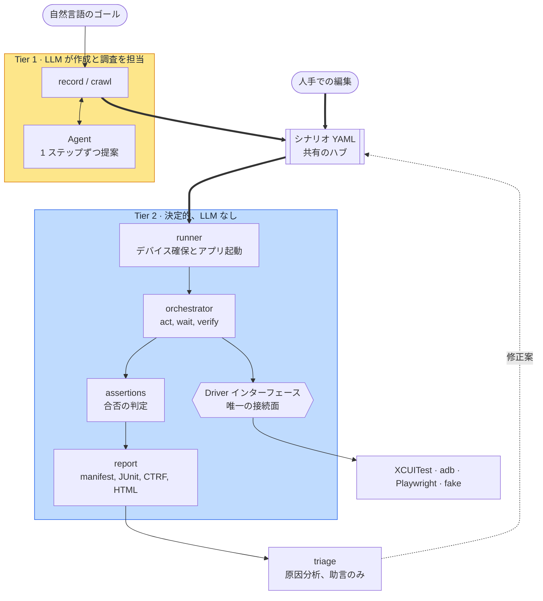
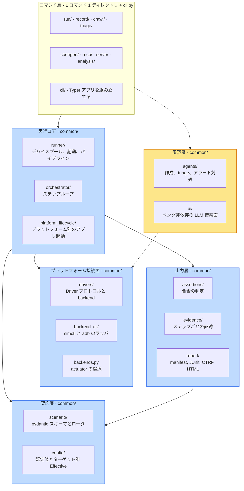
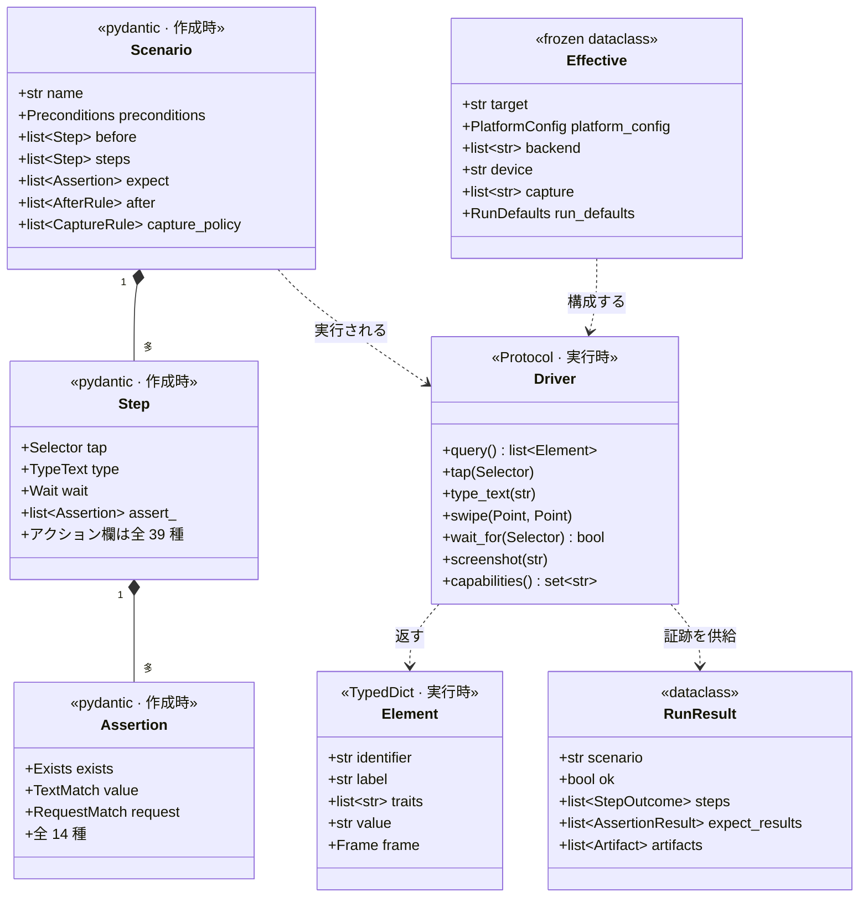
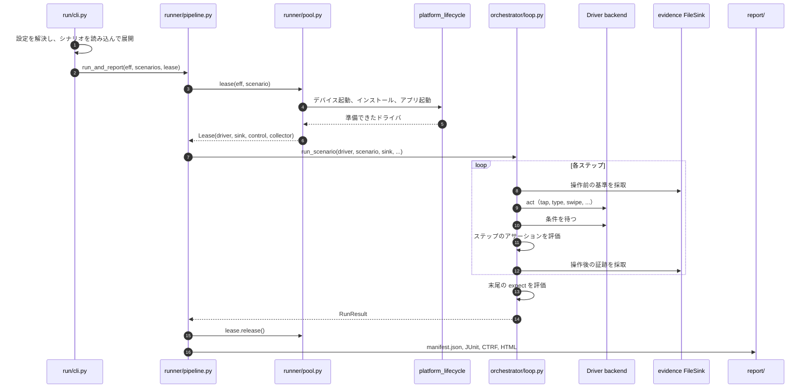
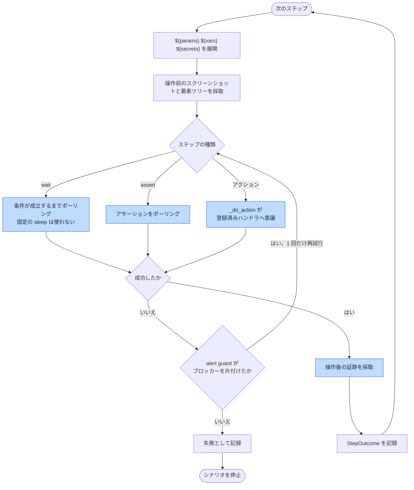
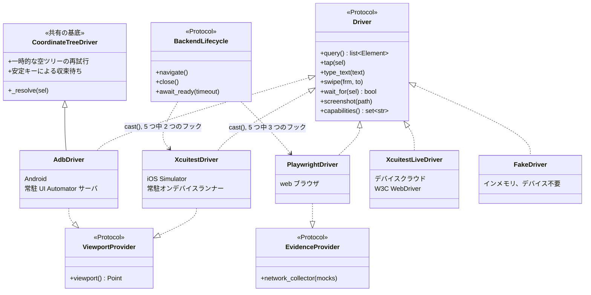
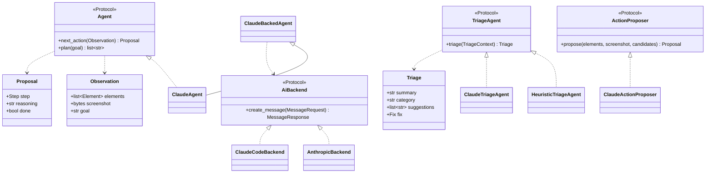

[English](../code-structure.md) · **日本語**

# コード構造：ファイル配置、クラス、実行の流れ

> ソースツリーを読むための案内です。どのファイルがどこにあり、そこにどのクラスが住み、それらの
> クラスがどう組み合わさって Bajutsu の機能になり、シナリオの実行中に各クラスが何をするのかを
> 順に説明します。

関連: [アーキテクチャ](architecture.md) · [中核概念](concepts.md) · [実行ループ](run-loop.md) ·
[ドライバ](drivers.md) · [用語集](glossary.md)

---

## このページの読み方

このページは外側から内側へ、一方向に進みます。最初にシステム全体の絵を置き、次にファイルの位置を
示し、続いて残りのコードを支える少数の型を挙げます。そのあとで 1 つのコマンドを追いかけ、最後に
クラスを順に説明します。先頭から読んで途中で止めても、粗いながら全体像は手元に残ります。

この案内があえて省いた深さは、3 つのページが引き受けています。
[アーキテクチャ](architecture.md)にはモジュール一覧表と依存レイヤの契約があります。
[実行ループ](run-loop.md)は決定的ランナーの意味論を扱います。[ドライバ](drivers.md)は
各 backend のプラットフォーム接続面を扱います。[用語集](glossary.md)はドメインの語を一語ずつ
定義します。

先に語を 2 つだけ決めておきます。**[シナリオ](glossary.md#シナリオのオーサリング)**とは、
ユーザーの操作の流れをステップの並びとして記述した 1 つの YAML ファイルです。
**[backend](glossary.md#driver-backend-actuator-platform)**とは、1 つのプラットフォーム向けのドライバ実装です。
iOS Simulator 向けの XCUITest、Android 向けの adb、web ブラウザ向けの Playwright があります。

---

## 1. システムの全体像

Bajutsu は、混ざり合わない 2 つの層に分かれています。Tier 1 は大規模言語モデル（LLM）を使って
シナリオを**作成**し、失敗を**調査**します。Tier 2 はそのシナリオを決定的に再生し、機械が検査できる
アサーションだけから合否を出します。判定の経路にモデルは 1 つも登場しません。2 つの層をつなぐ
ハブがシナリオファイルです。Tier 1 が書き、以後は人間が所有して編集し、Tier 2 が読みます。


<details>
<summary>Mermaid のソース</summary>

<!-- mermaid-svg: assets/diagrams/code-structure-concept-ja.svg -->


</details>

この絵の 3 つの性質が、コードの形のほとんどを説明します。

- **判定の経路にモデルを置きません。** 第一原則は `run` と継続的インテグレーション（CI）のゲートに
  LLM が入ることを禁じます。そのため Tier 2 の列は AI パッケージから切り離されています。
- **接続面は 1 つ、プラットフォームは複数です。** プラットフォームの差は `Driver`
  インターフェースの背後に隠れます。新しいプラットフォームの追加は、コアの分岐ではなく backend の
  追加になります。
- **永続する成果物はシナリオだけです。** セッションをまたいで残るものが他にないため、シナリオ
  スキーマがそのまま、あらゆる機能が読む契約を兼ねます。

---

## 2. ファイルの配置

### 2.1 リポジトリの最上位

| パス | 中身 |
|---|---|
| [`bajutsu/`](https://github.com/bajutsu-e2e/bajutsu/tree/main/bajutsu) | Python のロジックコア。324 ファイル、およそ 78,000 行。このページが説明する対象です。 |
| [`tests/`](https://github.com/bajutsu-e2e/bajutsu/tree/main/tests) | 決定的なテストスイート。381 ファイル、およそ 125,000 行。対象のコードより大きい規模です。 |
| [`BajutsuKit/`](https://github.com/bajutsu-e2e/bajutsu/tree/main/BajutsuKit) | Swift のテスト支援パッケージ。常駐 XCUITest ランナー、アプリ内コレクタ、WebView と z 順のチャネルが入ります。 |
| `BajutsuAndroid/` · `BajutsuAndroidUIAutomatorServer/` | Kotlin 側の対応物。アプリ内フックと常駐 UI Automator サーバです。 |
| [`demos/`](https://github.com/bajutsu-e2e/bajutsu/tree/main/demos) | 実行できる例。プラットフォームをまたいで 5 回実装した showcase のフィクスチャを含みます。 |
| [`scenarios/`](https://github.com/bajutsu-e2e/bajutsu/tree/main/scenarios) | リポジトリ自身のフィクスチャに対して実行するシナリオ YAML です。 |
| [`docs/`](https://github.com/bajutsu-e2e/bajutsu/tree/main/docs) · `docs/ja/` | このドキュメント。英語と、その日本語ミラーです。 |
| [`roadmaps/`](https://github.com/bajutsu-e2e/bajutsu/tree/main/roadmaps) | ロードマップ項目 1 件につき 1 ディレクトリ。二言語で、各決定の根拠を残します。 |
| [`scripts/`](https://github.com/bajutsu-e2e/bajutsu/tree/main/scripts) | リポジトリの道具立て。各種リンタ、図のレンダラ、リポジトリマップが入ります。 |

### 2.2 `bajutsu/` パッケージ

パッケージは、共有される `common/` のコアと、ユーザーが直接使うコマンドごとのディレクトリに
分かれます。コマンドのディレクトリには、そのコマンド自身のロジックと、Typer にコマンドを登録する
`cli.py` が入ります。次の図は、アルファベット順ではなく役割ごとにディレクトリをまとめたものです。


<details>
<summary>Mermaid のソース</summary>

<!-- mermaid-svg: assets/diagrams/code-structure-packages-ja.svg -->


</details>

`common/` にはこのほか、目的を 1 つに絞ったサブパッケージが並びます。`capability/`（backend が
何を支えられるか）、`run_meta/`（run の同一性と成果物の保管）、`analytics/`（トークンとコストの
集計）、`evidence/`、`devices/`、`provisioning/`、`github/`、`cloud/` です。それぞれの役割は
[アーキテクチャのモジュール一覧表](architecture.md#モジュール一覧と役割)に 1 行ずつあります。

### 2.3 パッケージの完全な一覧

上の図はディレクトリを役割ごとにまとめたものです。以下の表は、その一つひとつを
`make repo-map ARGS="--code"` が報告するファイル数・行数・中身とともに列挙します。図の枠には
収まらなかった、より細かい目録です。

**コマンド層** — ユーザー向けの機能ごとに 1 ディレクトリ、それぞれ自分の `cli.py` を持ちます。

| パッケージ | ファイル数・行数 | 中身 |
|---|---|---|
| `cli/` | 4 ファイル、786 行 | Typer アプリの組み立て：`_shared`、`dotenv`、`handoff` |
| `cli/commands/` | 5 ファイル、448 行 | どの機能にも属さないコマンド：`doctor`、`lint`、`report`、`schema` |
| `run/` | 3 ファイル、1,701 行 | `cli`（`run` コマンド本体）、`notify` |
| `record/` | 4 ファイル、1,318 行 | `capture`、`cli`、`loop` |
| `crawl/` | 9 ファイル、3,109 行 | `cli`、`core`、`flows`、`guide`、`report`、`repro`、`serialize`、`tabs` |
| `triage/` | 3 ファイル、1,203 行 | `cli`、`heuristic` |
| `codegen/` | 7 ファイル、2,623 行 | `cli`、`common`、`xcuitest`、`playwright`、`uiautomator` |
| `mcp/` | 4 ファイル、327 行 | `cli`、`resources`、`tools` |
| `analysis/` | 7 ファイル、2,543 行 | `audit`、`coverage`、`flakiness`、`impact`、`stats`、`trace` |
| `analysis/cli/` | 8 ファイル、870 行 | レポートごとに 1 つの Typer コマンド |
| `serve/` | 28 ファイル、8,457 行 | web UI 自身の最上位モジュール（`state`、`routes`、`handler`、`executor`、`jobs` など）。`cli/`・`operations/`・`server/` は以下で別立てします |
| `serve/cli/` | 4 ファイル、873 行 | `serve`、`worker`、`approve` |
| `serve/operations/` | 27 ファイル、6,997 行 | web UI の操作ごとに 1 モジュール：`capture`、`codegen`、`coverage`、`doctor`、`enrich`、`evidence`、`lint`、`metrics`、`runs`、`triage`、`upload` など |
| `serve/server/` | 17 ファイル、3,691 行 | ホスティング（マルチテナント）版の backend：`app`、`db`、`executor`、`models`、`oauth`、`artifacts`、`baselines`、`sessions`、`secrets` |

**実行コア** — デバイスプール、ステップループ、プラットフォームごとのアプリ起動です。

| パッケージ | ファイル数・行数 | 中身 |
|---|---|---|
| `common/runner/` | 11 ファイル、3,122 行 | `pipeline`、`pool`、`launch`、`device_provider`、`recovery`、`mailbox`、`build`、`types` |
| `common/orchestrator/` | 6 ファイル、3,534 行 | `loop`、`waits`、`substitution`、`evidence_rules`、`types` |
| `common/orchestrator/actions/` | 2 ファイル、139 行 | アクションのハンドラレジストリ（`_registry`） |
| `common/orchestrator/actions/handlers/` | 10 ファイル、1,254 行 | `gestures`、`scroll`、`device`、`navigation`、`http`、`generate`、`totp`、`manual` |
| `common/platform_lifecycle/` | 7 ファイル、968 行 | `protocols`、`factories`、`readiness`、`relaunchers`、`device_control`、`read_session` |
| `common/platform_lifecycle/environments/` | 8 ファイル、3,115 行 | `ios`、`xcuitest`、`xcuitest_live`、`android`、`web`、`fake` |

**プラットフォーム接続面** — `Driver` プロトコルと、その背後の各 backend です。

| パッケージ | ファイル数・行数 | 中身 |
|---|---|---|
| `common/drivers/` | 14 ファイル、7,198 行 | `base`、`actuation`、`coordinate_tree`、`fake`、`xcuitest`、`adb`、`playwright`、`xcuitest_live`、`elements`、`dom`、`web_network`、`webview`、`zorder` |
| `common/backend_cli/` | 4 ファイル、2,428 行 | `simctl`、`adb`、`adb_resident` |
| `common/devices/` | 4 ファイル、181 行 | `errors`、`id`、`os` |
| `common/capability/` | 4 ファイル、548 行 | `capabilities`、`capability_preflight`、`preflight` |

**契約層** — シナリオスキーマと、解決済み設定の形です。

| パッケージ | ファイル数・行数 | 中身 |
|---|---|---|
| `common/scenario/` | 9 ファイル、1,232 行 | `load`、`load_expanded`、`expand`、`select`、`serialize`、`edit`、`interp`、`system_alerts` |
| `common/scenario/models/` | 9 ファイル、1,942 行 | `scenario`、`steps`、`actions`、`assertions`、`selector`、`evidence`、`mocks`、`_base` |
| `common/config/` | 5 ファイル、1,234 行 | `schema`、`effective`、`resolve`、`accessors` |

**出力層** — 合否、採取した証跡、描画されたレポートです。

| パッケージ | ファイル数・行数 | 中身 |
|---|---|---|
| `common/assertions/` | 6 ファイル、1,225 行 | `evaluate`、`network`、`visual`、`schema`、`_common` |
| `common/evidence/` | 9 ファイル、3,440 行 | `core`、`golden`、`intervals`、`media`、`network`、`redaction`、`sink`、`visual` |
| `common/report/` | 11 ファイル、2,176 行 | `manifest`、`ctrf`、`format`、`rows`、`panels`、`html`、`richtext`、`archive`、`load`、`from_grouping` |

**周辺層** — モデルに届く経路です。

| パッケージ | ファイル数・行数 | 中身 |
|---|---|---|
| `common/agents/` | 12 ファイル、2,386 行 | `protocols`、`factory`、`claude`、`claude_backed`、`claude_enrich`、`claude_triage`、`ai_config`、`anthropic_client`、`availability`、`enrich`、`alerts` |
| `common/ai/` | 8 ファイル、1,072 行 | `base`、`registry`、`anthropic`、`claude_code`、`disabled`、`prompts`、`banner` |

**`common/` 配下の共有ユーティリティ** — 他のどの群にも属さない、目的を 1 つに絞ったヘルパです。

| パッケージ | ファイル数・行数 | 中身 |
|---|---|---|
| `common/`（直下のファイル） | 14 ファイル、2,652 行 | `backends`、`doctor`、`lint`、`mailbox`、`totp`、`cancellation`、`config_source`、`deprecations`、`diagnostics`、`handoff`、`screenshots`、`stall_diagnostics`、`_yaml` |
| `common/analytics/` | 4 ファイル、862 行 | `ledger`、`stats`、`usage` |
| `common/run_meta/` | 6 ファイル、602 行 | `files`、`id`、`root`、`artifact_perms`、`object_store` |
| `common/provisioning/` | 3 ファイル、364 行 | `provision`、`requirements` |
| `common/cloud/` | 2 ファイル、678 行 | `devicefarm` |
| `common/github/` | 4 ファイル、232 行 | `actions`、`app`、`errors` |

### 2.4 ツリーを読まずにファイルを探す

3 つのコマンドが、実行のたびに最新の地図を出力します。コミットされた索引が古びる余地はありません。

```bash
make repo-map ARGS="--code"              # パッケージと最上位モジュールの一覧
make repo-map ARGS="--docs"              # docs の各ページと、その要約
make repo-map ARGS="--headings docs/x.md" # 1 ファイルの見出しと行範囲
```

---

## 3. 土台になる 4 つの契約

負荷を受け止めているのは 4 つの型です。残りのクラスのほとんどは、4 つのどれかを作るか、使うか、
境界をまたいで運ぶために存在します。先に 4 つを覚えると、あとのクラスがすべて読めるようになります。


<details>
<summary>Mermaid のソース</summary>

<!-- mermaid-svg: assets/diagrams/code-structure-contracts-ja.svg -->


</details>

**`Scenario`**（[`common/scenario/models/`](https://github.com/bajutsu-e2e/bajutsu/tree/main/bajutsu/common/scenario/models)）は
作成時のモデルです。pydantic の `extra="forbid"` で組んであるので、未知のキーは黙って通らず読み込みで
失敗します。`Step` は 39 のアクション欄のうち 1 つを、`Assertion` は 14 種のうち 1 種を持ちます。
この厳しさが効くのは、シナリオがセッションをまたいで残る唯一の成果物だからです。

**`Driver`**（[`common/drivers/base.py`](https://github.com/bajutsu-e2e/bajutsu/blob/main/bajutsu/common/drivers/base.py)）は
実行時の契約です。すべての backend が満たす、23 メソッドの `Protocol` です。その隣に実行時の
`Element` と `Selector` が並びます。どちらも pydantic モデルではなく `TypedDict` です。ステップ
ループが 1 回の run で何千回も触るためです。作成時の `Selector` は `as_selector()` で実行時の
`Selector` に変換されます。

**`Effective`**（[`common/config/effective.py`](https://github.com/bajutsu-e2e/bajutsu/blob/main/bajutsu/common/config/effective.py)）は
1 ターゲット分の解決済み設定です。チーム既定値の上にそのターゲットのブロックを重ね、下流が書き換え
られないよう凍結してあります。プラットフォーム固有のつまみは、プラットフォームごとの欄を並べる
のではなく、`platform_config: PlatformConfig` という 1 つの欄に絞ります。`IosConfig | WebConfig |
AndroidConfig` の判別可能な共用型で、新しいプラットフォームを足すときは共用型にメンバーを 1 つ
加えるだけで済み、読み手が無視し続けなければならない兄弟欄が増えることはありません。アプリ固有の
差分はすべてここに集まります。だからツール本体はアプリに依存せずに済みます。

**`RunResult`**（[`common/orchestrator/types.py`](https://github.com/bajutsu-e2e/bajutsu/blob/main/bajutsu/common/orchestrator/types.py)）は
1 シナリオの結果です。判定、ステップごとの `StepOutcome`、末尾のアサーション結果、途中で採取した
成果物が入ります。reporter が描画する対象は、この `RunResult` の並びだけです。

---

## 4. シナリオ DSL：シナリオファイルの見た目

シナリオはただの YAML です。第 3 節の `Scenario`・`Step`・`Assertion` モデルに対して `extra="forbid"`
で検証されるので、キーの綴りを間違えると読み込みで失敗します。黙って何も起きない、ということは
ありません。この節では実在する 1 本のシナリオを最初から最後まで読み、そこで使われている語彙を
表にまとめます。正式な文法の全体は [DSL 文法](dsl-grammar.md)にあります。実例つきのオーサリング
ガイドは [シナリオ](scenarios.md)と[クックブック](cookbook.md)です。

### 4.1 1 本のシナリオを最初から最後まで読む

[`scenarios/smoke.yaml`](https://github.com/bajutsu-e2e/bajutsu/blob/main/scenarios/smoke.yaml)は、
このドキュメントサイト自身のランディングページが描画されることを確認する、手を加えていない
シナリオです。

```yaml
description: >-
  Docs-site smoke — the landing page loads and shows its "Get started" and "GitHub"
  hero buttons. The fastest check that the Playwright backend reaches the live site.
scenarios:
  - name: the landing page shows its hero calls-to-action
    description: Wait for the "Get started" hero, then assert both hero buttons and a populated page.
    steps:
      - wait: { for: { label: "Get started" }, timeout: 15 }
    expect:
      - exists: { label: "Get started" }
      - exists: { labelMatches: "GitHub" }
      - count: { sel: { traits: [link] }, atLeast: 5 }
```

どのシナリオにも共通する部分が 3 つあります。`steps` はステップループ（第 6 節）が実行する順序
付きの並びです。ここでは `wait` ステップが 1 つあり、固定時間の sleep ではなく、そのヒーロー
ボタンが現れるまでポーリングします（第二原則）。`expect` はシナリオ末尾のアサーション
ブロックで、最後のステップのあとに 1 回だけ検査されます。ここでは独立した 3 つのチェックがあり、
すべてが通らなければなりません。`{ label: … }`・`{ labelMatches: … }`・`{ traits: […] }` という
オブジェクトは `Selector`（第 3 節）です。`tap` や `type` ステップの対象が取るのと同じ形です。

### 4.2 操作する要素を選ぶ：`Selector`

ほとんどのステップとアサーションは、画面上の 1 要素を対象にします。その対象はすべて
`Selector` です。第 3 節で 4 つの契約の 1 つとして紹介したのと同じ型です。この節はオーサリング
側の視点です。どの欄があり、どれから使うべきかを扱います。実行時の側、つまり `Selector` が
`query()` のスナップショットをちょうど 1 要素まで絞り込む仕組みと、絞り込めなかったときに
何が起きるかは、第 7.2 節の `resolve_unique` にあります。完全なリファレンスは
[セレクタ](selectors.md)です。

指定した欄はすべて AND で結ばれます。例外が 2 つあります。`within` は残りとは別に適用される
空間的なフィルタで、`index` は他のすべての欄で絞り込めるだけ絞り込んだあとに、最後の手段として
だけ適用されます。

| 欄 | 一致条件 | 役割 |
|---|---|---|
| `id` | 正確なアクセシビリティ識別子です。並びを渡すと OR として一致します。プラットフォームごとの id の綴りの違いを 1 つずつ並べます（例：Android View の `android:id` はピリオドを持てないため `[stable.refresh, stable_refresh]`）。 | 第一候補です。安定していて、ローカライズされず、データに由来します。 |
| `idMatches` | 識別子に対する glob パターンです（glob の並びを渡すと OR として一致します）。 | 意図的に複数一致させたいとき：`count` アサーションや `forEach` ステップの `sel` です。 |
| `label` | 正確なアクセシビリティラベルです。 | 補助的です。ラベルはローカライズされうるので、判別専用です。 |
| `labelMatches` | ラベルに対する部分一致または正規表現です。 | 同じ理由で補助的です。 |
| `traits` | 要素の正規化されたトレイト（下の表）に対する部分集合テストです。 | 補助的です。種類で絞り込みます（例：`traits: [button]`）。 |
| `value` | 正確なアクセシビリティ値です。 | 補助的です。 |
| `within` | フレームが、入れ子の `Selector` が解決するコンテナの内側に収まる要素です。Bajutsu が読むアクセシビリティツリーは平坦なので、「親」は構造ではなく幾何学的な意味で決まります。`within` は入れ子にできます。 | 判別用です。他のすべての欄が一致する候補が 2 つあるときに使います。 |
| `index` | 内容の異なる複数候補のうち n 番目です（負の値は末尾から数えます）。 | 最後の手段です。ペイント順に依存するので不安定です。 |

`traits` は、backend 間で正規化された小さな語彙から選びます（`common/drivers/base.py` の
`Trait` クラス）。

| トレイト | 意味 |
|---|---|
| `button` | タップできるボタンです。 |
| `link` | ハイパーリンクです。 |
| `notEnabled` | 要素が無効です。`disabled`・`enabled` アサーションを支えます。 |
| `selected` | 要素が選択またはトグルされています。`selected` アサーションを支えます。 |
| `other` | 汎用的で未分類の要素です。解決アルゴリズムはこれを特別扱いします（第 7.2 節）。 |
| `secureTextField` | プラットフォーム自身がそのフィールドを秘密だと印付けているので、設定なしで値をマスクします。 |

`id`・`label`・`traits` より先に `index` へ手を伸ばす作成者は、順序を取り違えています。`id` は
画面上で要素が動くだけの改修を生き延びますが、`index` は画面がきょうだい要素を 1 つ増減した
瞬間に壊れます。

### 4.3 39 種のステップ

`Step` は必ず 39 のアクション欄のうち 1 つを持ちます（`common/scenario/models/steps.py`）。慣習
ではなく pydantic のバリデーションによる強制です。そのうち `wait` と `assert` の 2 つはステップ
ループが直接ポーリングする条件で、残りはアクションレジストリ（第 7.5 節）を通して実行されます。

| 分類 | 欄 | すること |
|---|---|---|
| ジェスチャー | `tap`、`tapPoint`、`doubleTap`、`longPress`、`swipe`、`drag`、`scroll`、`pinch`、`rotate`、`back` | タッチとナビゲーションの入力です。 |
| テキストと選択 | `type`、`select`、`clear`、`delete`、`copy`、`selectOption`、`setPickerValue` | テキストの入力・選択・コピーです。`copy` は事前の `select` を必要とします（第 7.5 節）。 |
| 条件 | `wait`、`assert` | 条件やアサーションブロックをポーリングします。固定時間の sleep は使いません。 |
| アプリとデバイスのライフサイクル | `relaunch`、`setLocation`、`push`、`clearKeychain`、`clearClipboard`、`setClipboard`、`background`、`foreground`、`overrideStatusBar`、`clearStatusBar`、`handleSystemAlert` | アプリのライフサイクルと、その周りのシミュレートされたデバイスを操作します。 |
| データと値 | `http`、`totp`、`generate`、`email` | 値を作るか取得します。HTTP 呼び出し、時刻ベースのワンタイムパスワード（TOTP）コード、乱数、メールボックスの検索です。 |
| 合成と制御構文 | `use`、`web`、`manual`、`if`、`forEach` | コンポーネントを展開する、ブロックを WebView に絞る、人手の引き継ぎを記録する、分岐・繰り返しをします。 |

### 4.4 14 種のアサーション

`Assertion`（`common/scenario/models/assertions.py`）は必ず 14 の欄のうち 1 つを持ち、
`assertions/evaluate.py`（第 7.6 節）が評価します。例外を投げずに失敗した結果を返す全域関数です。

| 分類 | 欄 | 検査すること |
|---|---|---|
| 要素の状態と内容 | `exists`、`value`、`label`、`count`、`enabled`、`disabled`、`selected` | 要素の存在、テキスト、件数、トグル状態です。 |
| ネットワーク | `request`、`event`、`requestSequence`、`responseSchema` | 観測した HTTP 通信です。単一の通信、順序つきの並び、スキーマに対する応答本文のいずれかです。 |
| 画面の比較 | `visual`、`golden` | スクリーンショットを基準画像と、要素ツリーを記録済みのツリーと比較します。 |
| クリップボード | `clipboard` | デバイスのクリップボードの現在のテキストです。 |

### 4.5 制御構文・合成・データ

| 構文 | 欄 | すること |
|---|---|---|
| 条件分岐 | `if` ステップ（`condition`、`then`、`else`） | `Assertion` で分岐します。`expect` と同じ方法で評価されます。 |
| 繰り返し | `forEach` ステップ（`sel`、`as`、`steps`） | `Selector` が一致した要素ごとに `steps` を 1 回ずつ繰り返します。 |
| コンポーネント | `use` ステップ、別立てのコンポーネントファイル | 名前付きでパラメータ化されたステップの並びをコンパイル時に展開します。run が始まる前に解決済みです（`expand.py`、第 7.1 節）。ステップループが `use` ステップを目にすることはありません。 |
| WebView のスコープ | `web` ステップ（`within`、`steps`） | `within` の `Selector` で届く WebView に、入れ子のステップの並びを絞ります。 |
| 割り込みハンドラ | シナリオ直下の `interrupts:` | 許可ダイアログやアプリ更新のプロンプトのような、run の途中で予測できない位置に現れうる割り込み画面を片付けます。囲むシナリオの `vars.*` を共有します。 |
| セットアップ・ティアダウンのフェーズ | シナリオ直下の `before:` / `after:` | `steps` の前と、判定が出たあとに走るステップです。本体のステップの並びとは別に報告されます。 |
| データ駆動の行 | `data:` / `dataFile:` | インラインの並びまたは CSV ファイルの行ごとに 1 つのシナリオを実体化し、`${row.*}` に代入します。 |

### 4.6 補間：`${namespace.key}`

シナリオが行うすべての代入は、1 つのプリミティブ（`common/scenario/interp.py`）が支えています。
呼び出し側が渡す、平坦な `bindings` マップをキーにします。

| 名前空間 | 出どころ | 解決される時点 |
|---|---|---|
| `params.*` | コンポーネントの `with:` ブロック | コンポーネント展開の時点。run が始まる前です。 |
| `row.*` | データ駆動シナリオの `data:` / `dataFile:` の行 | データ展開の時点。run が始まる前です。 |
| `secrets.*` | ターゲット設定の解決済みシークレット値 | run 時点。`Effective` 設定（第 3 節）からです。 |
| `vars.*` | `extract` ステップが捕捉した値 | run 時点。ステップループの実行中です。run の途中で変わる唯一の名前空間です。 |

### 4.7 証跡の採取：`capturePolicy`

シナリオの `capturePolicy`（`common/scenario/models/evidence.py`）は、単発の指示ではなく、
ステップループが繰り返し発火する規則を挙げます。だから 2 回目の run でも、AI を挟まずに同じ
証跡が集まります。各規則の `on` トリガーは `action`（id が一致するステップが実行された）・
`event: screenChanged`・`result: error` のうちちょうど 1 つです。`capture` の並びは、トリガーが
発火したときに採取する成果物の種類を挙げます。仕組みの全体は[証跡](evidence.md)にあります。
`capturePolicy` の有無にかかわらずどのステップにも付く、基準の `capture` 保証も含みます。

---

## 5. レイヤと、ゲートが強制する境界

パッケージは 3 つのレイヤに仕分けられ、その仕分けをゲートが検査します。`make lint-imports` が
`pyproject.toml` に宣言したレイヤに対して
[import-linter](https://import-linter.readthedocs.io/) を走らせます。禁じた import は誰かが
気付くまで生き延びることなく、`make check` を落とします。

| レイヤ | 構成要素 | 規則 |
|---|---|---|
| **決定的コア** | `orchestrator/`、`runner/`、`drivers/base.py`、`assertions/`、`evidence/`、`report/`、`config/`、`scenario/`、`capability/` | 周辺層を import しません。ホスティング用の extra にも触れません。 |
| **契約** | `scenario/` と `drivers/base.py` | 実行時コアを import しません。利用側が runner を引き込まずにスキーマへ依存できます。 |
| **周辺** | `serve/`、`mcp/`、`codegen/`、`agents/`、`ai/`、`record/`、`crawl/`、`triage/` | それぞれ任意の extra の背後に置き、外せる形にします。 |

「コアは周辺を import しない」という規則が、第一原則を静的に強制します。コアのモジュールが必要と
する純粋な要素ツリーのヘルパは `record/` ではなくコアに置きます。解決済みの AI 設定も `config/` に
素の `AiConfig` として置きます。そのためコアは AI クライアントを import せずに設定を読めます。契約の
全体像は[アーキテクチャ](architecture.md#強制されるレイヤ境界be-0112)にあります。

---

## 6. シナリオを実行すると何が起きるか

`bajutsu run` は、Tier 2 の他の経路もなぞる代表的なコマンドです。1 度追いかければ、runner と
orchestrator とドライバ層と reporter をまとめて理解できます。


<details>
<summary>Mermaid のソース</summary>

<!-- mermaid-svg: assets/diagrams/code-structure-run-sequence-ja.svg -->


</details>

次の番号付きの流れは、各矢印の裏にあるファイルを示します。

1. **設定を解決します。** `run/cli.py` が設定ファイルを読み、ターゲットのブロックを重ね、凍結した
   `Effective` を 1 つ作ります。コマンドラインのフラグはファイルより優先されます。
2. **シナリオを読み込んで展開します。** `common/scenario/load.py` が各 YAML を `Scenario` モデルに
   します。続いて `expand.py` がコンパイル時の構文を解きます。`use:` マクロはコンポーネントの
   ステップに展開され、データ駆動のシナリオはデータ行ごとの実体になります。
3. **backend を選びます。** `common/backends.py` が actuator を選びます。候補が複数あるときは、
   シナリオが必要とする能力を満たすもののうち、最も安価なものを選びます。
4. **デバイスを確保します。** `common/runner/pool.py` が同時実行数を抑え、`Lease` を渡します。
   `Lease` は、生きたドライバに、そのデバイスの証跡シンク、再起動関数、デバイス操作、ネットワーク
   コレクタを束ねたものです。プラットフォーム固有の起動処理は `common/platform_lifecycle/` が
   1 つの `RunEnvironment` プロトコルの裏で行います。そのためプールは actuator の名前で分岐しません。
5. **シナリオを実行します。** `common/orchestrator/loop.py` がステップの並びを実行します。1 ステップの
   詳細は 6.1 で扱います。
6. **合否を決めます。** `common/assertions/evaluate.py` がすべてのアサーションを評価します。この関数は
   全域関数です。例外を投げずに失敗した `AssertionResult` を返すので、1 つのアサーションが run 全体を
   中断させることはありません。
7. **レポートを書きます。** `common/report/` が `RunResult` の並びを `manifest.json`、JUnit XML、
   Common Test Report Format（CTRF）の JSON、単体で開ける HTML ページにします。manifest が唯一の
   正本で、残りの 3 つはそこから導かれます。

### 6.1 1 ステップの内側

どのステップも、act、wait、verify という同じ 3 拍を踏みます。orchestrator はその拍の周りで証跡を
採取し、拍と拍のあいだで画面が邪魔されていないかを見張ります。


<details>
<summary>Mermaid のソース</summary>

<!-- mermaid-svg: assets/diagrams/code-structure-step-loop-ja.svg -->


</details>

このループの 2 つの規則は、第二原則である決定性優先から直接導かれます。wait は固定時間の sleep を
しません。条件が成立するか予算が尽きるまでポーリングします。曖昧なセレクタは、最初に一致した要素を
操作せず、その場で失敗します。

---

## 7. レイヤごとのクラス

### 7.1 シナリオモデル

[`common/scenario/`](https://github.com/bajutsu-e2e/bajutsu/tree/main/bajutsu/common/scenario) は、
作成時のスキーマを `models/` に置き、その周りにテキストを実行可能なオブジェクトへ変える処理を
並べています。

| ファイル | クラスと関数 | 役割 |
|---|---|---|
| `models/scenario.py` | `Scenario`、`Component`、`ScenarioFile`、`Preconditions`、`SystemAlertHandling` | 文書の最上位と、シナリオごとの前提設定です。 |
| `models/steps.py` | `Step`、`If`、`ForEach`、`Use`、`Web`、`Interrupt`、`AfterRule`、`Extract` | 1 ステップと、制御構文やライフサイクルの包みです。 |
| `models/assertions.py` | `Assertion`、`Exists`、`TextMatch`、`CountMatch`、`RequestMatch`、`VisualMatch`、`GoldenMatch` | 14 種のアサーションです。 |
| `models/actions.py` | `TypeText`、`Swipe`、`Scroll`、`HttpRequest`、`Generate`、`Email`、`Totp` ほか | アクションごとの引数モデルです。 |
| `models/selector.py` | `Selector` | 作成時のセレクタです。`as_selector()` で実行時の形に変えます。 |
| `load.py` · `load_expanded.py` | `load_scenario_file`、`load_scenarios` | YAML を解析し、スキーマ版数を確かめます。 |
| `expand.py` | `expand_components`、`expand_data`、`apply_setups` | 実行前に `use:` マクロとデータ行を解きます。 |
| `interp.py` | `interpolate` | `${params.x}`、`${row.x}`、`${secrets.x}`、`${vars.x}` を差し替えます。 |
| `select.py` · `edit.py` · `serialize.py` | 絞り込み、機械的な編集、YAML 出力 | `--only`、triage の修正、作成経路を支えます。 |

コンパイル時と実行時の分離が効いています。`expand.py` はデバイスに触れる前に 1 度だけ走ります。
そのため orchestrator が見るステップの並びにマクロは残りません。実行ループがシナリオの途中で
コンポーネントを解決する必要は生じません。

### 7.2 ドライバ層

[`common/drivers/base.py`](https://github.com/bajutsu-e2e/bajutsu/blob/main/bajutsu/common/drivers/base.py)
は決定性の核であり、通して読む価値のある唯一のファイルです。`Driver` プロトコルに加えて、すべての
backend が共有する解決の関数が入っています。

![ドライバ層のクラス図。Driver プロトコルが query、tap、type_text、swipe、wait_for、screenshot、capabilities を宣言します。XcuitestDriver、AdbDriver、PlaywrightDriver、XcuitestLiveDriver、FakeDriver がこれを満たします。AdbDriver はさらに共有の基底クラス CoordinateTreeDriver を継承し、座標系 backend 向けの再試行、収束待ち、解決の処理を受け取ります。主プロトコルの隣には、EvidenceProvider や ViewportProvider のような狭い任意プロトコルが並び、その振る舞いを支える backend だけが構造的に満たします。BackendLifecycle は別扱いです。5 つのライフサイクルフックを backend 間で互いに素に分担する型付けの傘であり、isinstance ではなく明示的な cast で届くため、PlaywrightDriver と XcuitestDriver はそれぞれ自分の担当分のフックだけを実装します。](assets/diagrams/code-structure-driver-classes-ja.svg)

<details>
<summary>Mermaid のソース</summary>

<!-- mermaid-svg: assets/diagrams/code-structure-driver-classes-ja.svg -->


</details>

**`resolve_unique(elements, sel)`** が第二原則を単独で背負っています。`query()` の 1 スナップ
ショットを、ちょうど 1 つの要素まで絞り込みます。一致がなければ `ElementNotFound`、内容の異なる
一致が 2 件以上あれば `AmbiguousSelector` を送出します。この関数が**自分の判断で**位置で勝者を
決めることはありません。最初に一致した要素を操作する振る舞いこそ、この設計全体が防ごうとしている
不安定さだからです。作成者が明示した `index` だけが例外で、内容の異なる複数候補のうち n 番目を選べ
ます。[セレクタ](selectors.md)が定める、あくまで最後の手段です。規則を弱めずに角を落とす工夫が
2 つあります。報告内容がまったく同じ候補は 1 つにまとめます。作成者が区別できる材料がないためです。
また、分類済みの兄弟要素と同じラベルを持つ汎用の `other` 特性の包みは、候補から落とします。

**狭い任意プロトコル**が、プラットフォーム間の能力差を引き受けます。すべての backend が空実装を
並べる巨大なインターフェースを置く代わりに、`base.py` は小さなプロトコルを宣言します。
`EvidenceProvider`、`ViewportProvider`、`ReadLagProvider`、`ReadOrderProvider`、
`SettledReadProvider`、`RawSourceProvider`、`SettledCacheInvalidator` です。呼び出し側は実行時に
所属を確かめます。backend は、そのプラットフォームが実際に支える振る舞いに限って狭いプロトコルを
実装します。`BackendLifecycle` はあえての例外です。5 つのフックを実装側の backend が互いに素な
部分集合として分担するので（`PlaywrightDriver` は `navigate`・`close`・`reset_context` を、
`XcuitestDriver` は `await_ready`・`health_ready` を実装します）、どの backend も構造的な
`isinstance` を満たしません。`platform_lifecycle` の環境は各フックに `cast(BackendLifecycle,
driver)` で届きます。呼び出し箇所のための型付けの傘であって、適合の対象ではありません。

**`FakeDriver`** には独立した説明が要ります。インメモリの backend があるおかげで、orchestrator 全体を
デバイスなしで動かせます。決定的なゲートが Linux 上で数秒で終わり、Simulator を必要としないのは
このためです。

### 7.3 環境層

[`common/platform_lifecycle/`](https://github.com/bajutsu-e2e/bajutsu/tree/main/bajutsu/common/platform_lifecycle)
は、ドライバがあえて答えない問いを引き受けます。アプリはどうやってデバイスに載り、操作できる状態に
なるのか、という問いです。`protocols.py` が `RunEnvironment` と `CrawlEnvironment` を宣言し、
`environments/` がプラットフォームごとの実装を置きます。`ios`、`xcuitest`、`xcuitest_live`、
`android`、`web`、`fake` の 6 つです。

プロトコルが覆う範囲は、起動（`start`）、準備完了の判定、再起動、デバイス操作、後片付けです。加えて
runner が知りたい問いにも答えます。そのプラットフォームは動画を先行して録るのか、ネットワークを
ドライバ経由で観測するのか、常駐ランナーはシナリオをまたいで生き残るのか、といった問いです。答えが
プロトコルの裏にあるので、`runner/pool.py` と `crawl/cli.py` は actuator の名前で分岐せず、iOS と
Android と web を 1 つのインターフェースで動かせます。

### 7.4 runner

[`common/runner/`](https://github.com/bajutsu-e2e/bajutsu/tree/main/bajutsu/common/runner) は、
設定とシナリオの並びをレポートに変えます。

| ファイル | 主なクラス | 役割 |
|---|---|---|
| `pipeline.py` | `_ScenarioRunner`、`run_all`、`run_and_report`、`run_matrix_and_report` | 1 回の run が共有する文脈を、各シナリオに順に適用します。 |
| `pool.py` | `device_pool` | 同時実行数を抑え、リースを配り、きれいに後片付けします。 |
| `types.py` | `Lease` | 生きたドライバに、シンク、再起動、デバイス操作、コレクタを束ねたものです。 |
| `device_provider.py` | `DeviceProvider`、`DeviceLease`、`_LocalProvider`、`_AppiumProvider` | run のデバイスの出どころです。ローカルか、予約したクラウド端末かを決めます。 |
| `recovery.py` | `RetryDecision`、`CrashRecoveryBudget`、`RunCrashRecoveryBudget` | クラッシュした backend に再試行を与えるか、回復に何秒まで費やせるかを決めます。 |
| `launch.py` · `launch_server.py` | `launch_driver` | ドライバを組み立て、アプリを立ち上げます。 |
| `mailbox.py` | 転送方式のレジストリ | `email` ステップの転送方式を種類で解決します。 |

**`_ScenarioRunner`** は、1 回の run が共有する文脈を持つ凍結 dataclass です。解決済みの設定、リースの
生成関数、redactor、能力の集合、出力の設定が入ります。凍結してあること、そしてシナリオごとの値を
`run_one` の局所に閉じ込めてあることが、`workers > 1` のときに複数の `ThreadPoolExecutor` ワーカで
1 つのインスタンスを安全に共有できる理由です。

**クラッシュ回復は判定の隣にあり、判定の内側には入りません。** backend のクラッシュはテスト結果では
なくインフラの事象です。そこで `recovery.py` は、回数と実時間の両方に上限を置いたうえで、新しく確保
したデバイスでシナリオを再実行します。上限を使い切るとシナリオははっきり失敗します。本当にクラッシュを
誘発するシナリオが見えなくなることはありません。

### 7.5 orchestrator

[`common/orchestrator/`](https://github.com/bajutsu-e2e/bajutsu/tree/main/bajutsu/common/orchestrator)
がステップループを持ちます。`loop.py` はコアで最大のファイルです。構造を押さえておくと読み進め
やすくなります。

| クラスまたは関数 | 役割 |
|---|---|
| `run_scenario()` | 入口です。要求された区間証跡を開始し、`before`、本体、`after` の各フェーズを走らせ、末尾の `expect` を評価し、`RunResult` を組み立てます。 |
| `StepLoopState` | 1 フェーズが持ち回る可変の状態です。蓄積した変数バインディング、直前のステップの要素ツリー、読み取り回数が入ります。 |
| `_LoopConfig` | 不変の側です。ドライバ、シンク、時計、alert guard、シナリオが入ります。 |
| `_StepRunner` | 振り分け役です。`exec_steps` が並びを歩き、`_handle_if`、`_handle_for_each`、`_handle_web`、`_handle_action` が各ステップ形状を処理します。 |
| `_run_step_body()` | 1 ステップの効果を実行し、`(ok, reason, assertion_results, snapshot)` を返します。想定内の失敗で例外を投げません。 |
| `_InterruptGuard` | 実行中に割り込み画面が出たとき、シナリオの `interrupts` ハンドラを発火します。 |
| `_ScreenRead` | 要素ツリーの遅延キャッシュです。1 ステップが同じ画面を二度読むことを防ぎます。 |

`types.py` はループの語彙を持ちます。`StepOutcome`、`RunResult`、`AlertEvent`、`AlertGuardConfig`、
`SelectionState`、そしてテストが実時間の sleep なしで走るための `Clock` プロトコルです。`waits.py` は
ポーリングの仕組みと `WaitTrace` を持ちます。`WaitTrace` は待機のポーリング履歴を記録するので、
タイムアウトの原因を成果物だけから追えます。

**アクションの振り分けは条件分岐の連なりではなくレジストリです。**
[`actions/_registry.py`](https://github.com/bajutsu-e2e/bajutsu/blob/main/bajutsu/common/orchestrator/actions/_registry.py)
は実行時アクションの一覧を `Step` モデル自身から導きます。そのため `Step` に欄を宣言するだけで、
アクションは自動的に見えるようになります。ハンドラは `actions/handlers/` にテーマ別に置きます。
`gestures`、`scroll`、`device`、`navigation`、`http`、`generate`、`totp`、`manual` の 8 つで、
`@_handler(kind)` デコレータで自分を登録します。テキスト選択の約束も、この振り分け役が 1 か所で
持ちます。`copy` は有効な選択を必要とし、`select` は選択を確立し、他のアクションは選択を無効に
します。おかげでハンドラは backend をまたいで状態を持たずに済みます。

### 7.6 アサーションの評価

[`common/assertions/`](https://github.com/bajutsu-e2e/bajutsu/tree/main/bajutsu/common/assertions)
は合否だけを持ち、他は持ちません。`evaluate.py` は種類ごとの評価関数を `@_evaluator("kind")`
デコレータの背後に並べます。アクションのレジストリと同じ形です。`network.py` は `request`、`event`、
`requestSequence` を観測した通信と突き合わせます。`visual.py` は画像を比較し、`schema.py` は応答
本文を検証し、`_common.py` は共有の `AssertionResult` を定義します。

個々の評価関数より大事な性質が 2 つあります。**評価は全域関数です。** 例外を投げずに失敗の結果を
返すので、壊れたアサーションは自分の検査だけを落とし、run を中断させません。そして
**`EvalContext` が周辺の入力を束ねます。** 視覚比較の基準画像ディレクトリ、スキーマの
ディレクトリ、golden のディレクトリ、クリップボードが入ります。ステップ内の `assert` は、あえて
狭めた文脈を受け取ります。ステップの途中には、視覚比較が読むべき新しいスクリーンショットが存在
しないからです。

### 7.7 証跡（evidence）

[`common/evidence/`](https://github.com/bajutsu-e2e/bajutsu/tree/main/bajutsu/common/evidence) は、
run が何を残すのかに答えます。

- **`core.py`** が `EvidenceSink` プロトコルと 2 つの実装を宣言します。`NullSink` は何も記録せず
  費用も生みません。実行ループは余分な `query()` を払う前に `NullSink` かどうかを確かめます。
  `FileSink` は run のディレクトリに成果物を書きます。
- **`intervals.py`** はシナリオ全体にまたがる録画とデバイスログを子プロセスとして走らせます。最初の
  ステップの前に開始し、検証のあとに確定します。どの区間の種類も要求制で、何も要求しないシナリオは
  何も記録しません。
- **`network.py`** は `NetworkExchange` を持ちます。アプリ内コレクタと Playwright のフックが共通で
  作る観測モデルです。プロトコル内で完結する決定的なモックもここにあります。
- **`redaction.py`** は `Redactor` を持ちます。秘密の値、設定したラベル、ヘッダ、フィールドを、
  ディスクに届く前に伏せます。
- **`visual.py`** と **`golden.py`** は、スクリーンショットを基準画像と、要素ツリーを記録済みの
  ツリーと比較します。

証跡の採取は、単発の指示ではなく繰り返し発火する規則として書きます。シナリオの `capturePolicy` が
トリガーを挙げ、ループが毎ステップで一致した規則を発火します。そのため 2 回目の実行でも、AI を
挟まずに同じ証跡が集まります。

### 7.8 レポート

[`common/report/`](https://github.com/bajutsu-e2e/bajutsu/tree/main/bajutsu/common/report) は
`RunResult` の並びを 4 通りに描画します。`manifest.py` が `manifest.json` と JUnit XML を、
`ctrf.py` が CTRF の JSON を書きます。`html.py`、`rows.py`、`panels.py`、`richtext.py` が対話的な
HTML ページを組み立てます。`archive.py` と `load.py` は、終わった run を `.zip` に書き出し、
オフラインで読み直して再描画します。`manifest.json` が唯一の正本であり、CI は HTML を解析せずに
manifest を読みます。

---

## 8. Tier 1 の経路：作成と調査

モデルに届く経路は 3 つあります。どれもモデルを狭いプロトコルの背後に閉じ込めるので、決定的コアが
モデルを目にすることはありません。

![Tier 1 の経路のクラス図。Agent プロトコルは、Observation を受け取って Proposal を返す next_action と、ゴールを受け取る plan を宣言します。ClaudeAgent が ClaudeBackedAgent の上でこれを実装し、ClaudeBackedAgent は AiBackend プロトコルと会話します。AiBackend の実装は 3 つで、API と Bedrock 向けの AnthropicBackend、Claude Code CLI 向けの ClaudeCodeBackend、そして生成時に例外を送出する無効化 backend です。record のループが Agent を動かします。crawl のエンジンは ActionProposer を動かし、決定的な実装と ClaudeActionProposer のいずれかが応えます。triage コマンドは TriageAgent を動かし、規則ベースの HeuristicTriageAgent か ClaudeTriageAgent が応え、どちらも summary・category・平文の suggestions・高々 1 件の構造化された Fix を持つ Triage の判定を返します。](assets/diagrams/code-structure-tier1-ja.svg)

<details>
<summary>Mermaid のソース</summary>

<!-- mermaid-svg: assets/diagrams/code-structure-tier1-ja.svg -->


</details>

**`record/`** は自然言語のゴールからシナリオを書き起こします。
[`loop.py`](https://github.com/bajutsu-e2e/bajutsu/blob/main/bajutsu/record/loop.py) が
observe、propose、execute、emit の順で回ります。画面を読んで `Observation` にし、`Agent` に
`Proposal` を求め、提案された `Step` を決定的ループと同じ `_do_action` で実行し、育ちつつある
シナリオに追記します。同じ振り分け役を使い回すからこそ、記録したステップはそのまま再生できます。
`capture.py` は代理操作による記録の経路です。人間がアプリを操作し、記録側がそこからステップを
起こします。

**`crawl/`** はアプリを幅優先で探索し、画面地図を出力します。
[`core.py`](https://github.com/bajutsu-e2e/bajutsu/blob/main/bajutsu/crawl/core.py) がグラフの型
（`Fingerprint`、`Node`、`Edge`、`Action`、`ScreenMap`）と、それらを歩く `_Coordinator` を持ちます。
画面の `Fingerprint` が既訪かどうかを決めるので、探索は停止します。`guide.py` は `ActionProposer` を
宣言し、決定的な実装をモデル任せの `ClaudeActionProposer` の隣に置きます。そのおかげで、資格情報が
まったくなくても crawl は動きます。

**`triage/`** は失敗した run を調査します。
[`heuristic.py`](https://github.com/bajutsu-e2e/bajutsu/blob/main/bajutsu/triage/heuristic.py) が
run のディレクトリから `TriageContext` を組み立て、`HeuristicTriageAgent` が規則だけから `Triage` を
導きます。`Fix` は散文ではなく構造を持ちます。`renameId`、`addIndex`、`raiseTimeout` といった形です。
だから `--apply` がシナリオを書き換え、`--rerun` が書き換えを検証できます。`triage --ai` は同じ
プロトコルの背後で `ClaudeTriageAgent` に差し替えます。どちらの形でも triage は助言に留まり、修正案を
出すだけで判定を変えません。

**`common/ai/`** はベンダを 1 つの接続面の裏に置きます。`AiBackend` が要求と応答の型を正規化し、
`registry.py` がプロバイダ名を adapter に対応づけます。`anthropic.py` が Anthropic API と Amazon
Bedrock を、`claude_code.py` が Claude Code のコマンドラインインターフェース（CLI）を担当します。
`disabled` プロバイダの生成関数は例外を送出するので、AI 経路が誤って backend を作ることはありません。

---

## 9. codegen、serve、mcp、analysis

**`codegen/`** は通過したシナリオをネイティブテストに変えます。
[`common.py`](https://github.com/bajutsu-e2e/bajutsu/blob/main/bajutsu/codegen/common.py) が
`CodeGenerator` プロトコル（`file_preamble`、`scenario_open`、`step_lines`、`assertion_lines`、
`scenario_close`、`file_footer`）を宣言し、`render_test_file` がシナリオを 1 度だけ歩いて
プロトコルを呼びます。実装は 3 つです。Swift 向けの `xcuitest.py`、TypeScript 向けの
`playwright.py`、Kotlin 向けの `uiautomator.py` です。実行時にしか意味を持たないステップは、
誤ったコードを黙って吐かずに例外を送出します。

**`serve/`** はブラウザ用のアプリケーションです。`state.py` の `ServeState` がプロセス全体の状態を
束ねます。ジョブレジストリ、セッション管理、シナリオストア、プロバイダ設定が入ります。`routes.py` は
経路をデータとして宣言します。そのため標準ライブラリのハンドラ（`handler.py`）と FastAPI の
アプリケーション（`server/app.py`）が同じ経路表を配れます。`executor.py` は `RunExecutor` という
接続面を宣言します。ローカル配置とホスティング配置が分かれるのはここだけです。`LocalExecutor` は
各ジョブをデーモンスレッドで走らせ、`DbQueueExecutor` は遠隔の `bajutsu worker` 向けに積みます。
実行の本体である `jobs.py` は、どちらの側でも同じです。

**`mcp/`** は `run` と `doctor` を Model Context Protocol（MCP）のツールとして、run の証跡を MCP の
リソースとして公開します。エディタ側のエージェントが、シェルを介さず決定的な経路に届きます。

**`analysis/`** は読み取り専用の助言レポートを持ちます。どれも CI を止めません。`audit`（決定性と
不安定さの監査）、`coverage`（識別子の名前空間の網羅率）、`impact`（差分が影響するステップ）、
`stats`（run の集計統計）、`flakiness`（run をまたぐ不安定さの順位付け）、`trace`（1 回の run の
時系列）です。

---

## 10. 機能の追加・修正：開発と動作確認のルーチン

### 10.1 変更の種類ごとの出発点

上の構造を、よくある変更の出発点に翻訳したのが次の表です。

| やりたいこと | まずここ | 次に |
|---|---|---|
| 新しいプラットフォームに対応する | `common/drivers/` に `Driver` を満たすクラス | `platform_lifecycle/environments/` に `RunEnvironment` を足し、`backends.py` に actuator を登録し、ドライバ適合スイートを走らせます。 |
| ステップのアクションを足す | `common/scenario/models/steps.py` の `Step` に欄を足す | `orchestrator/actions/handlers/` にハンドラを足し、`codegen/` の各生成器に出力の分岐を足します。 |
| アサーションの種類を足す | `common/scenario/models/assertions.py` | `assertions/evaluate.py` に `@_evaluator` 付きの評価関数を足します。 |
| 設定項目を足す | `common/config/schema.py`、続いて `effective.py` | 解決済みの `Effective` がすでに届いている場所で読みます。 |
| CLI コマンドを足す | 対応する機能の隣に `cli.py` | `cli/__init__.py` のモジュール一覧に登録し、`capability/capabilities.py` で分類します。 |
| 証跡の種類を足す | `common/evidence/core.py` | `capturePolicy` のスキーマとレポートの描画を広げます。 |

どの行にも共通する規則が 2 つあります。判定の経路に加える変更は AI パッケージに触れてはならず、
ゲートがそれを機械的に検査します。そして振る舞いを足す変更には、それがなければ落ちるテストが必要
です。決定的なテストスイートが退行を防ぐ網だからです。

### 10.2 開発のルーチン

```mermaid
flowchart LR
    branch(["ブランチまたは worktree<br/>claude/&lt;topic&gt;"])
    implement["1 つのレイヤの内側で<br/>変更を実装"]
    test["テストを足す・更新する"]
    fast["速い検査<br/>format · lint · typecheck · test"]
    gate{"make check<br/>green か？"}
    verify["スイートの外側で確認<br/>適合スイート・実機・make docs"]
    preflight["make preflight<br/>fetch + rebase + ゲート"]
    push["push<br/>pre-push フックが make check を再実行"]
    noverify(["git push --no-verify<br/>例外なく禁止"])
    pr["プルリクエストを開く"]
    ci{"CI"}
    done(["マージ"])

    branch --> implement --> test --> fast --> gate
    gate -->|いいえ| implement
    gate -->|はい| verify --> preflight --> push --> pr --> ci
    push -.->|してはならない| noverify
    ci -->|red| implement
    ci -->|green・レビュー済み| done

    classDef det fill:#bfdbfe,stroke:#2563eb,color:#1f2937;
    classDef warn fill:#fecaca,stroke:#dc2626,color:#1f2937;
    class gate,ci det
    class noverify warn
```


<details>
<summary>Mermaid のソース</summary>

<!-- mermaid-svg: assets/diagrams/code-structure-routine-ja.svg -->


</details>

1. **セッションを隔離します。** `main` から `claude/<topic>` としてブランチを切ります（人間の
   場合は `<user>/<topic>`）。`make worktree TOPIC=<topic>` が、ブランチと worktree を 1 コマンド
   で作るので、2 つのセッションが同じチェックアウトを共有することはありません。Claude Code は
   自分専用の worktree を `.claude/worktrees/` の下に持ちます。
2. **変更を実装します。** 第 5 節の表が指すレイヤの内側にとどめます。境界をまたぐ変更（決定的
   コアが周辺層を import する、など）は、誰かが気付くのを待たず `make lint-imports` がその場で
   落とします。
3. **テストを足すか更新します。** 決定的なテストスイート（`tests/`）が退行を防ぐ網です。それが
   なければ落ちるテストのない変更は、まだ完了していません。
   [`tests/driver_conformance.py`](https://github.com/bajutsu-e2e/bajutsu/blob/main/tests/driver_conformance.py)は、
   すべての backend が共有する唯一の仕様です。`Driver` プロトコル向けの技術適合性キット
   （technology compatibility kit、TCK）で、新しい backend は `ConformanceHarness` を 1 度実装
   すれば、自分でテストを書かずにスイート全体を受け継ぎます。
4. **反復作業中は速い検査を走らせます。** 毎回フルのゲートを走らせるのではなく、`make format`・
   `make lint`・`make typecheck`・`make test` はそれぞれ 1 つのことだけを検査し、すぐに終わり
   ます。`make check` はこれらに加えて、より重い構造的な検査（import のレイヤ、docstring、
   ロードマップ、シークレットの走査）を CI と同じ順序で走らせます。「ローカルで green」が
   「CI でも green」を予言する、という前提が成り立つのはこのためです。
5. **テストスイートの外側でも手を動かして確認します。** ドライバ・backend・図に触れた変更には、
   下の 10.3 節が何のコマンドを使うかを示します。
6. **push の前にリベースします。** `make preflight` が `origin/main` を fetch し、その上に
   リベースし、ゲートを走らせ、「完了の定義」のリマインダーを表示します。pre-push フックが
   結局は強制する内容を、先回りしてやっておく形です。コンフリクトや red な検査が、push まで
   持ち越されずその場で見つかります。
7. **push してから、プルリクエスト（PR）を開きます。** 追跡対象の pre-push フックは、
   push のたびに `make check` を走らせ、red なら拒否します。`git push --no-verify` は例外なく
   禁止です。それはローカルで捕まえるはずの red な結果を、共有 PR に持ち越すだけだからです。
   セッションと人間のどちらが PR を開くか、Draft で開くか Ready for review で開くかは、
   作業の種類によります。[`CLAUDE.md`](../../CLAUDE.md) の「Who opens the PR depends on the
   work」と「PRs created by Claude Code always start as Draft」を参照してください。並行開発の
   全体像（リベースの規律、git 側の防御、worktree による隔離）は
   [AI 開発](ai-development.md)にあります。

### 10.3 触った対象ごとの動作確認

| 触った対象 | 速い検査 | より深い確認 |
|---|---|---|
| シナリオスキーマ、ステップのアクション、アサーション | `make test`（デバイス不要の `FakeDriver` ベースのユニットテスト） | `tests/orchestrator/` と `tests/scenario/` がステップループとモデルを覆います。end-to-end の例が要るなら `scenarios/` にシナリオを 1 本足します。 |
| ドライバまたは backend | `uv run pytest tests/test_driver_conformance.py`（共有の適合契約。速いゲート上では `FakeDriver` に対して走ります） | 実機での確認：iOS なら `make -C demos/showcase run-swiftui`（先に `make deps` が必要、macOS と Simulator が要ります）。web トラックなら `uv run bajutsu run --backend web --target web --config demos/web/demo.config.yaml`（Mac は不要です）。 |
| 設定スキーマまたは解決処理 | `make test` | 実際の設定に対して `uv run bajutsu doctor --target <name> --config <path>` を走らせ、変更が生む解決済み `Effective` を確かめます。 |
| CLI コマンド | `make test` | フィクスチャ設定に対してコマンドを手で走らせます。`capability/capabilities.py` 自身のテストが、登録済みのコマンドすべてが分類されていることを確かめます。 |
| ドキュメント（図を含む） | `make lint-roadmap`、textlint（`tools/textlint/`） | `make docs`（`mkdocs build --strict`）。mermaid フェンスを変えたときは `make docs-diagrams` でチェックイン済みの SVG を再レンダリングします。このページ自身の図が従っている慣例です。 |

カバレッジは変更のあとではなく、変更と並行して棘を締めます。`make lint-pr` は、計測カバレッジが
総合フロアより 2 ポイント以上上振れしたときに知らせます。`make coverage-floors` は、あるファイルの
カバレッジが実際に上がったときに、ファイルごとのフロアのスナップショット
（`coverage-floors.json`）を引き上げます。低下をごまかす手段ではなく、上昇を記録するための、
意図的でレビュー可能な手順です。

---

## 11. さらに読む

- [アーキテクチャ](architecture.md)：モジュール一覧表、依存レイヤ、設計が述べる機能の実装状況を
  扱います。
- [実行ループ](run-loop.md)：決定的ランナーの意味論を詳しく扱います。
- [ドライバ](drivers.md)：各 backend の接続面と能力の集合を扱います。
- [セレクタ](selectors.md)：決定性の核である一意解決を詳しく扱います。
- [シナリオ](scenarios.md)と [DSL 文法](dsl-grammar.md)：作成のリファレンスと、規範的な文法です。
- [API リファレンス](../api/index.md)：docstring と型付きシグネチャから生成します。
- [`DESIGN.md`](https://github.com/bajutsu-e2e/bajutsu/blob/main/DESIGN.md)：設計の根拠を日本語で
  記した文書です。
