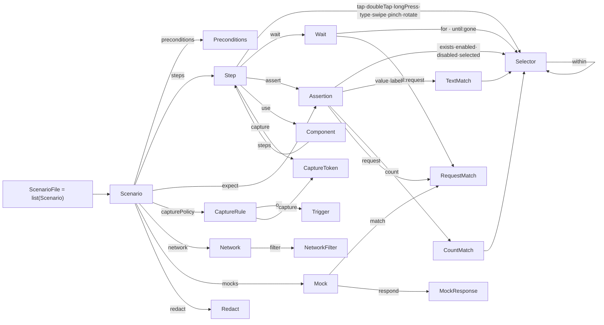

[English](../dsl-grammar.md) · **日本語**

# シナリオ DSL 文法（形式リファレンス）

> シナリオ DSL の **規範的な文法** —— すべての生成規則・型・既定値・検証制約を、`bajutsu/scenario.py`
> の pydantic モデル（`extra="forbid"` なので未知キーは拒否）から直接導いたもの。
> [scenarios](scenarios.md) が散文の *オーサリングガイド*（例つきでシナリオの書き方）であるのに対し、
> このページは *言語仕様*（何がパースされ、何が拒否されるか）。コア文法を取り巻く
> テンプレート + マクロ層（コンポーネント・データ駆動の行・`setup` プレリュード）も扱う。

関連: [scenarios](scenarios.md)（オーサリングガイド）・ [selectors](selectors.md)（セレクタ/アサーションの評価）・ [evidence](evidence.md)・ [getting-started](getting-started.md)

---

## 1. 記法

DSL は YAML ノードの木なので、文法は文字列ではなく **抽象構造**（マッピング / シーケンス / スカラ）
の上で書く。

| 形 | 意味 |
|---|---|
| `X ::= …` | 生成規則: `X` を … と定義する |
| `A \| B` | 選択: `A` または `B` |
| `T?`（値に付く） | 省略可能な値 |
| `{ k: T }` | キー `k`（型 `T`）を持つ YAML マッピング |
| `{ k?: T }` | キー `k` は省略可能 |
| `A & B` | `A` と `B` **両方**のキーを持つマッピング |
| `list(T)` | 要素が `T` の YAML シーケンス |
| `map(K, V)` | `K` → `V` の YAML マッピング |
| `"literal"` | 厳密な文字列（キー名または列挙値） |
| `<Name>` | 非終端記号（このページの別の場所で定義） |

スカラ終端: `string`・`integer`・`number`（整数か浮動小数）・`boolean`（**`true` / `false` のみ** ——
[§3](#3-字句レイヤyaml) 参照）・`any`（任意の YAML 値）。

どのマッピングも、宣言していないキーは拒否する（`_Model`, `scenario.py:41`）。

---

## 2. 文法の全体像

まず **参照グラフ** —— どの非終端がどれを参照するか。下の EBNF テキストでは追いにくい再帰と共有が
一目で見える: `Selector` の `within` 自己ループ、`RequestMatch` が `request` アサーション・
`until: { request }` 待機・`Mock.match` で共有される様子。（`relaunch` / `setLocation` / `push` は
スカラのみで共有非終端を参照しないため省略。）



そして生成規則の全体:

```ebnf
# ── ファイル ────────────────────────────────────────────────────────────
ScenarioFile  ::= list(<Scenario>)          # トップレベルは必ずシーケンス
ComponentFile ::= <Component>               # 単一マッピング（別ロード）

# ── Scenario ───────────────────────────────────────────────────────────
Scenario ::= {
  name:            string,                  # 必須
  tags?:           list(string),            # 既定 []  — 選択（§6.4）
  data?:           list(map(string,string)),# インライン行  ┐ XOR
  dataFile?:       string,                  # CSV パス      ┘ （§6.3）
  preconditions?:  <Preconditions>,         # 既定 {}
  steps:           list(<Step>),            # 必須
  expect?:         list(<Assertion>),       # 既定 []  — 最終チェック
  capturePolicy?:  list(<CaptureRule>),     # 既定 []
  network?:        <Network>,
  mocks?:          list(<Mock>),            # 既定 []
  redact?:         <Redact>,
}

Component ::= { params?: list(string), steps: list(<Step>) }

# ── Preconditions ──────────────────────────────────────────────────────
Preconditions ::= {
  erase?:      boolean,                     # 既定 true  — 先頭で simctl erase
  launchArgs?: list(string),                # 既定 []
  launchEnv?:  map(string,string),          # 既定 {}    — SIMCTL_CHILD_* として注入
  deeplink?:   string,
  locale?:     string,
  setup?:      string,                      # 再利用プレリュードファイル（§6.4）
}

# ── Step = ちょうど 1 アクション + 任意の修飾子 ─────────────────────────
Step      ::= <Action> & <StepMods>
StepMods  ::= { capture?: list(<CaptureToken>), name?: string }
Action    ::=
    { tap:         <Selector> }
  | { doubleTap:   <Selector> }
  | { longPress:   { sel: <Selector>, duration: number } }
  | { type:        { text: string, into?: <Selector>, submit?: boolean } }   # submit 既定 false
  | { swipe:       <Swipe> }
  | { pinch:       { sel: <Selector>, scale: number } }    # scale > 0  （>1 拡大, <1 縮小）
  | { rotate:      { sel: <Selector>, radians: number } }  # >0 時計回り
  | { wait:        <Wait> }
  | { assert:      list(<Assertion>) }
  | { relaunch:    { env?: map(string,string), args?: list(string) } }
  | { setLocation: { lat: number, lon: number } }
  | { push:        { payload: map(string,any) } }          # APNs ペイロード 例 {aps:{alert:"…"}}
  | { use:         { component: string, with?: map(string,string) } }   # マクロ（§6.2）

Swipe ::=
    { on: <Selector>, direction: ("up"|"down"|"left"|"right") }   # セレクタ形  ┐ XOR
  | { from: <Point>,  to: <Point> }                               # 座標形      ┘
Point ::= [ number, number ]

# ── Selector（1 条件以上・指定フィールドは AND）────────────────────────
Selector ::= {
  id?:           string,
  idMatches?:    string,        # id に対するグロブ（fnmatch, 例 "list.row.*"）
  label?:        string,
  labelMatches?: string,        # label に対する正規表現
  traits?:       list(string),
  value?:        string,
  within?:       <Selector>,    # コンテナの部分木に限定
  index?:        integer,       # 意図的に非一意なとき k 番目を選ぶ
}

# ── Wait（for / until のどちらか一方）──────────────────────────────────
Wait  ::= { for: <Selector>, timeout: number }
        | { until: <Until>,   timeout: number }
Until ::= "screenChanged" | "settled"
        | { gone: <Selector> }
        | { request: <RequestMatch> }

# ── Assertions（1 項目につき 1 種類）───────────────────────────────────
Assertion ::=
    { exists:   <Selector> & { negate?: boolean } }   # セレクタはインライン・negate 既定 false
  | { value:    <TextMatch> }
  | { label:    <TextMatch> }
  | { count:    <CountMatch> }
  | { enabled:  <Selector> }
  | { disabled: <Selector> }
  | { selected: <Selector> }
  | { request:  <RequestMatch> }

TextMatch  ::= { sel: <Selector> } & ( {equals:string} | {contains:string} | {matches:string} )
CountMatch ::= { sel: <Selector> } & ( {equals:integer} | {atLeast:integer} | {atMost:integer} )

RequestMatch ::= {              # 下記マッチフィールドの 1 つ以上
  method?:      string,
  url?:         string,         # 完全一致 URL（エンドポイント）
  urlMatches?:  string,         # URL への正規表現/部分一致（クエリはここ）
  path?:        string,         # 完全一致パス（クエリ無視）
  pathMatches?: string,         # パスへの正規表現
  status?:      integer,
  bodyMatches?: string,         # リクエストボディへの正規表現/部分一致
  count?:       integer,        # アサーション → 厳密一致数 / wait → 下限
}

# ── 証跡キャプチャ ─────────────────────────────────────────────────────
CaptureToken ::= <Kind> ( "." <Modifier> )?
Kind     ::= "screenshot" | "elements" | "actionLog" | "deviceLog" | "network" | "video" | "appTrace"
Modifier ::= "before" | "after" | "around" | "onError"

CaptureRule ::= { on: <Trigger>, capture: list(<CaptureToken>) }
Trigger ::=                                    # action / event / result のどれか 1 つ
    { action: string, idMatches?: string }     # idMatches は action と併用のときだけ
  | { event: "screenChanged" }
  | { result: "error" }

# ── Network / mocks / redact ───────────────────────────────────────────
Network ::= { filter?: { domains?: list(string) } }
Redact  ::= { labels?: list(string), headers?: list(string), fields?: list(string) }
Mock    ::= { match: <RequestMatch>, respond?: <MockResponse> }   # match はリクエスト側フィールドのみ
MockResponse ::= { status?: integer, headers?: map(string,string), body?: string, delayMs?: number }
```

> **文法と配線は別。** このページは何が **パースされ検証されるか** を規定する。各アクションが
> バックエンドでどこまで実行されるか、各証跡種別がどこで取得されるかは別問題で、
> [drivers](drivers.md) と [architecture の実装状況](architecture.md#実装状況) が扱う。

---

## 3. 字句レイヤ（YAML）

シナリオファイルは YAML で、Bajutsu のローダ（`_yaml.py`）が読む。YAML 1.1 から **意図的に 1 点だけ
逸脱**している。

- **boolean は `true` / `false` のみ。** `on` / `off` / `yes` / `no` は **文字列**のまま。これにより
  `capturePolicy` のトリガキー `on:` が（boolean の `True` ではなく）キーのまま保たれ、`on` のような
  id/label 値も壊れない（[scenarios](scenarios.md#yaml-の注意点)）。

スカラ対応: YAML 文字列 → `string`、整数 → `integer`、整数/浮動小数 → `number`、`<Point>` は 2 要素の
フローシーケンス `[x, y]`。

---

## 4. 個数と排他の制約

形だけでなく、モデルは次の規則も課す（各 `model_validator`。違反はロードエラー）。この表が
**「ちょうど 1 つ / 1 つ以上 / 両方不可」の正本**。

| 構文 | 規則 | 出典 |
|---|---|---|
| `Selector` | **1 条件以上** | `scenario.py:67` |
| `Step` | アクションキー（`tap` … `use`）**ちょうど 1 つ**。`capture`/`name` は修飾子でアクションではない | `scenario.py:321` |
| `Swipe` | 形は **ちょうど 1 つ**: `{on,direction}` か `{from,to}` —— 混在・片側欠落は不可 | `scenario.py:129` |
| `Pinch` | `scale` **> 0** | `scenario.py:103` |
| `Wait` | `for` / `until` の **どちらか一方** | `scenario.py:190` |
| `Assertion` | 種類（`exists` … `request`）**ちょうど 1 つ** | `scenario.py:277` |
| `TextMatch`（`value`/`label`） | `equals` / `contains` / `matches` の **ちょうど 1 つ** | `scenario.py:243` |
| `CountMatch`（`count`） | `equals` / `atLeast` / `atMost` の **ちょうど 1 つ** | `scenario.py:258` |
| `RequestMatch` | `method`/`url`/`urlMatches`/`path`/`pathMatches`/`status`/`bodyMatches` の **1 つ以上**（`count` はマッチフィールドではない） | `scenario.py:160` |
| `Trigger`（`capturePolicy[].on`） | `action` / `event` / `result` の **ちょうど 1 つ**。`idMatches` は `action` と **併用時のみ** | `scenario.py:338` |
| `Scenario` | `data` と `dataFile` は **両方不可** | `scenario.py:414` |
| すべてのマッピング | **未知キー不可**（`extra="forbid"`） | `scenario.py:41` |

`exists` は特別: セレクタを **インライン**で書き（`exists: { id: home.title }`）、任意の `negate: true`
で *不在* を確認する。ローダは検証前にこれを `{ sel, negate }` へ書き換える
（`Exists._inline`, `scenario.py:225`）。

---

## 5. 既定値

省略した任意キーは次の値を取る（最小シナリオは `name` + `steps` だけ）。

| フィールド | 既定値 |
|---|---|
| `Scenario.tags` / `expect` / `capturePolicy` / `mocks` | `[]` |
| `Scenario.preconditions` | `{}`（= `erase: true`） |
| `Preconditions.erase` | `true` |
| `Preconditions.launchArgs` | `[]` |
| `Preconditions.launchEnv` | `{}` |
| `TypeText.submit` | `false` |
| `Exists.negate` | `false` |
| `MockResponse.status` | `200` |
| `MockResponse.headers` | `{}` |
| `Component.params` | `[]` |

最小シナリオの全体:

```yaml
- name: opens home
  steps:
    - tap:  { id: onboarding.start }
    - wait: { for: { id: home.title }, timeout: 5 }
  expect:
    - exists: { id: home.title }
```

---

## 6. テンプレートとマクロ層

コア文法の周りに、小さな置換 + 展開層がある。これはロード時、決定的 run の **前**に走るので、
ランナーは常に展開済みのプレーンなシナリオしか見ない。

### 6.1 `${namespace.key}` 補間

実装: `bajutsu/interp.py`。トークンは `${namespace.key}`（波括弧内の空白は除去）。置換は
**端で型を保つ**。

- **ちょうど 1 トークン**だけの文字列（`"${row.qty}"`）は **生の束縛値**になる（数値は数値のまま）。
- 大きな文字列に **埋め込まれた**トークンはテキストとして差し込まれる（`"item-${row.id}"`）。
- いま置換していない名前空間のトークンは **そのまま残る** ので、各層は自分の名前空間だけを埋める。

名前空間: `params.*`（コンポーネント・§6.2）、`row.*`（データ駆動・§6.3）、`vars.*` / `secrets.*`
（run ループが後で解決）。

### 6.2 コンポーネント（`use` → 再利用ステップ）

`<Component>` は別ファイル（`ComponentFile`）。`params` のリストと、それを `${params.<name>}` で
参照する `steps` のリストからなる。`use` ステップが、`with` で params を束縛して呼び出す。

```yaml
# login.component.yaml
params: [email, password]
steps:
  - type: { text: "${params.email}",    into: { id: auth.email } }
  - type: { text: "${params.password}", into: { id: auth.password } }
  - tap:  { id: auth.submit }
```

```yaml
# シナリオ側
steps:
  - use: { component: login.component.yaml, with: { email: "a@b.com", password: "pw" } }
```

`expand_components`（`scenario.py:455`）は各 `use` をコンポーネントの置換済みステップに **置き換える**。
再帰的で（コンポーネントが別のコンポーネントを `use` でき、深さ ≤ 25）、params 不足・未知 params・
未宣言を指す残留 `${params.*}`・循環参照ではエラーになる。展開は純粋でコンパイル時なので、
**`use` は run に残らない** —— 決定性に影響しない。

### 6.3 データ駆動シナリオ（`data` / `dataFile`）

`data`（インライン行）か `dataFile`（CSV パス。両者は排他）を持つシナリオは、`${row.<column>}` を
置換して **1 行 1 シナリオ**に展開される（`expand_data`, `scenario.py:518`）。派生シナリオは
`"<name> [row N: col=val, …]"` に改名され、**元の preconditions を保つ**（`erase` も既定 true のまま ——
各行が自分のクリーンな環境で走る）。

```yaml
- name: search returns a result
  data:
    - { q: apple,  expect: "1 result" }
    - { q: banana, expect: "2 results" }
  steps:
    - type: { text: "${row.q}", into: { id: home.search }, submit: true }
  expect:
    - label: { sel: { id: home.status }, equals: "${row.expect}" }
```

### 6.4 `setup` プレリュードとタグ選択

- **`setup`**（`Preconditions` のキー、またはアプリ/config の既定）: 再利用シナリオファイルを指し、
  その steps をこのシナリオ自身の前に **前置**する（`apply_setups`, `scenario.py:587`）—— 共有のログイン /
  ナビゲーション手順を 1 度だけ書く。
- **`tags`** + CLI の `--tag` / `--exclude` で実行対象を絞る。`exclude` が `include` に優先する
  （`select_scenarios`, `scenario.py:541`）。

### 6.5 展開順

ロードパイプライン（`cli.py`）はこれらを決定的に、この順で適用する。

```
load_scenarios        # この文法に対しパース + 検証
  → select_scenarios  # --tag / --exclude
  → apply_setups      # setup プレリュードを前置（プレリュード自体も use 可）
  → expand_components  # use → コンポーネントステップ（${params.*}）
  → expand_data        # 1 行 1 シナリオ（${row.*}）
  → run               # 決定的ループは展開済みシナリオだけを見る
```

---

## 7. 検証とラウンドトリップ

- `load_scenarios(text) -> list[Scenario]` は上記すべてに対して検証する。トップレベルはシーケンス
  必須で、[§4](#4-個数と排他の制約) のいずれかの規則違反はロードエラー（`scenario.py:432`）。
- `dump_scenarios(scenarios) -> str` は YAML へ戻す。可読性のため `None` / 空リスト / 空辞書を刈り取り、
  エイリアスキー（`idMatches`・`launchEnv` …）で出力する。出力は **そのまま再ロード可能** ——
  `record` が依存するラウンドトリップ（`scenario.py:582`）。

形の背後にある *意味論* —— セレクタが 0/1/2+ 件にどう解決するか、各アサーションがどう比較するか、
wait がどうタイムアウトするか —— は [selectors](selectors.md) と [run-loop](run-loop.md) へ。例で
シナリオを書き始めるなら [scenarios](scenarios.md)。
