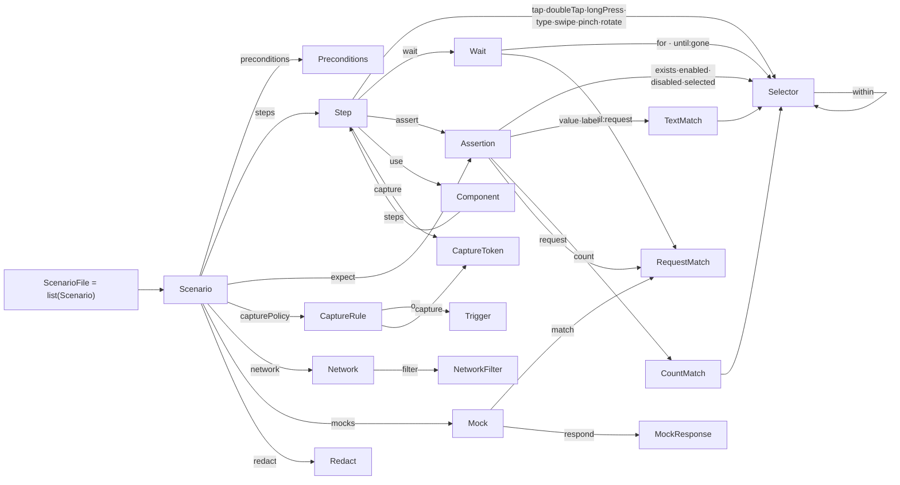

[English](../dsl-grammar.md) · **日本語**

# シナリオ DSL 文法（形式リファレンス）

このページはシナリオ DSL（ドメイン固有言語）の **規範的な文法**です。すべての生成規則、型、既定値、検証制約を、`bajutsu/scenario/`（`models/` サブパッケージ。`extra="forbid"` で未知キーは拒否）の pydantic モデルから直接導いています。[scenarios](scenarios.md) がオーサリングガイド（例つきでシナリオの書き方を説明）であるのに対し、このページは言語仕様（何がパースされ、何が拒否されるか）です。コア文法を取り巻くテンプレートとマクロ層、すなわちコンポーネント、データ駆動の行、`setup` プレリュードも扱います。

関連: [scenarios](scenarios.md)（オーサリングガイド） · [selectors](selectors.md)（セレクタ/アサーションの評価） · [evidence](evidence.md) · [getting-started](getting-started/index.md)

---

## 1. 記法

DSL は YAML ノードの木なので、文法は文字列ではなく **抽象構造**（マッピング / シーケンス / スカラ）の上で記述します。

| 形 | 意味 |
|---|---|
| `X ::= …` | 生成規則: `X` を … と定義する |
| `A \| B` | 選択: `A` または `B` |
| `T?`（値に付く） | 省略可能な値 |
| `{ k: T }` | キー `k`（型 `T`）を持つ YAML マッピング |
| `{ k?: T }` | キー `k` は省略可能 |
| `A & B` | `A` と `B` **両方**のキーを持つマッピング |
| `list(T)` | 要素が `T` の YAML シーケンス |
| `map(K, V)` | `K` → `V` の YAML マッピング |
| `"literal"` | 厳密な文字列（キー名または列挙値） |
| `<Name>` | 非終端記号（このページの別の場所で定義） |

スカラ終端は `string`、`integer`、`number`（整数か浮動小数）、`boolean`（**`true` / `false` のみ**。[§3](#3-字句レイヤyaml) を参照）、`any`（任意の YAML 値）です。

どのマッピングも、宣言していないキーは拒否します（`_Model`, `scenario/models/_base.py`）。

---

## 2. 文法の全体像

以下の **参照グラフ**は、どの非終端がどれを参照するかを示します。下の EBNF テキストでは追いにくい再帰と共有が見て取れます。`Selector` の `within` が自分自身へループする点や、`RequestMatch` を三箇所（`request` アサーション、`until: { request }` 待機、`Mock.match`）が共有する点です。（スカラのみを持ち共有の非終端を参照しないアクション、すなわち `relaunch`、`setLocation`、`push`、`http` とデバイス / ステータスバー系のステップは省略しています。）



そして生成規則の全体:

```ebnf
# ── ファイル ────────────────────────────────────────────────────────────
ScenarioFile  ::= list(<Scenario>)          # トップレベルは必ずシーケンス
ComponentFile ::= <Component>               # 単一マッピング（別ロード）

# ── Scenario ───────────────────────────────────────────────────────────
Scenario ::= {
  name:            string,                  # 必須
  tags?:           list(string),            # 既定 []  — 選択（§6.4）
  data?:           list(map(string,string)),# インライン行  ┐ XOR
  dataFile?:       string,                  # CSV パス      ┘ （§6.3）
  preconditions?:  <Preconditions>,         # 既定 {}
  steps:           list(<Step>),            # 必須
  expect?:         list(<Assertion>),       # 既定 []  — 最終チェック
  capturePolicy?:  list(<CaptureRule>),     # 既定 []
  network?:        <Network>,
  mocks?:          list(<Mock>),            # 既定 []
  redact?:         <Redact>,
  dismissAlerts?:  <DismissAlerts>,         # アラートガード; 未指定で ON
  permissions?:    <Permissions>,           # 起動前の OS 権限状態; 既定 {}
}

Component ::= { params?: list(string), steps: list(<Step>) }

# ── Preconditions ──────────────────────────────────────────────────────
Preconditions ::= {
  erase?:      boolean,                     # 既定 false — 先頭で simctl erase
  reinstall?:  ("clean" | "overwrite"),     # 既定 "clean" — config が appPath 指定時の再インストール
  launchArgs?: list(string),                # 既定 []
  launchEnv?:  map(string,string),          # 既定 {}    — SIMCTL_CHILD_* として注入
  deeplink?:   string,
  locale?:     string,
  setup?:      string,                      # 再利用プレリュードファイル（§6.4）
}

# ── DismissAlerts（視覚アラートガード; 既定 ON）────────────────────────
DismissAlerts ::= boolean                                   # { enabled: <bool> } の短縮形
               | { enabled?: boolean,                       # 既定 true
                   instruction?: string }                   # 押すボタン（無指定なら dismiss）

Permissions ::= map(PermissionService, PermissionAction)    # アプリの起動前に適用する
PermissionService ::= "location" | "camera" | "microphone" | "contacts"
                     | "photos" | "calendar" | "notifications"
PermissionAction  ::= "grant" | "revoke"

# ── Step = ちょうど 1 アクション + 任意の修飾子 ─────────────────────────
Step      ::= <Action> & <StepMods>
StepMods  ::= { capture?: list(<CaptureToken>), extract?: map(string, <Extract>), name?: string }
Extract   ::= { sel: <Selector>, prop?: ("value"|"label"|"identifier") }   # 既定 "value"
Action    ::=
    { tap:         <Selector> }
  | { tapPoint:    { x: number, y: number } }   # 正規化座標 0..1（左上原点）。ツリーに現れない要素（ID なしアプリのタブバーのタブなど）への画像フォールバック
  | { doubleTap:   <Selector> }
  | { longPress:   { sel: <Selector>, duration: number } }
  | { type:        { text: string, into?: <Selector>, submit?: boolean } }   # submit 既定 false
  | { clear:       { into: <Selector> } }                  # フィールドをフォーカスして現在の内容をすべて削除（web コンテキストは非対応）
  | { delete:      { into: <Selector>, count: integer } }  # フィールドをフォーカスして末尾から count 文字削除（count > 0。web コンテキストは非対応）
  | { select:      { into: <Selector>, mode?: "all" } }    # フィールドをフォーカスして内容を選択（mode 既定 "all"。idb / web コンテキストは非対応で codegen 経由の XCUITest に誘導）
  | { copy:        {} }                                    # 選択中の内容をクリップボードにコピー（事前に select が必要。idb / web コンテキストは非対応）
  | { selectOption:{ sel: <Selector>, option: string } }   # web の <select> をこの value を持つ option に設定（web 専用。iOS/Android は非対応）
  | { swipe:       <Swipe> }                          # 方向指定形式はスクロール。座標形式は素のドラッグ
  | { drag:        <Drag> }                           # 掴んだ要素（ハンドル / 仕切り / スライダー）をポインタドラッグする。スクロールではない
  | { back:        {} }                               # 前の画面へ戻る（Android はシステムキー / iOS は OS 戻るボタン / web は履歴）
  | { pinch:       { sel: <Selector>, scale: number } }    # scale > 0  （>1 拡大, <1 縮小）
  | { rotate:      { sel: <Selector>, radians: number } }  # >0 時計回り
  | { handleSystemAlert: { sel: <Selector>, timeout: number } }  # iOS SpringBoard の権限プロンプトを tap（iOS/XCUITest 専用）。sel は label/labelMatches/index のみ
  | { wait:        <Wait> }
  | { assert:      list(<Assertion>) }
  | { relaunch:    { env?: map(string,string), args?: list(string) } }
  | { setLocation: { lat: number, lon: number } }
  | { push:        { payload: map(string,any) } }          # APNs ペイロード 例 {aps:{alert:"…"}}
  | { http:        { method?: string, url: string, headers?: map(string,string), body?: string, status?: integer, saveBody?: string } }  # method 既定 GET; saveBody → vars.<name>
  | { totp:        { secret: string, into: { var: string } } }  # RFC 6238 OTP → vars.<var>（secret は base32）
  | { email:       { match: { to?: string, subject?: string, subjectMatches?: string }, extract: { var: string, bodyMatches: string }, timeout: number } }  # メールボックスをポーリング → vars.<var>
  | { background:       {} }                               # Home ボタン（SpringBoard 経由でバックグラウンド化。終了はしない）
  | { clearKeychain:    {} }                               # 保存済みパスワード / 証明書をリセット
  | { clearClipboard:   {} }                               # ペーストボードをクリア
  | { overrideStatusBar: { time?: string, batteryLevel?: integer, batteryState?: string, cellularBars?: integer, wifiBars?: integer } }
  | { clearStatusBar:   {} }                               # ライブのステータスバーに戻す
  | { use:         { component: string, with?: map(string,string) } }   # マクロ（§6.2）
  | { if:          <If> }                                               # 条件分岐（capture/extract 不可）
  | { forEach:     <ForEach> }                                          # ループ（capture/extract 不可）
  | { manual:      { label: string, bypass?: string } }                # `record` 中に記録される人による操作の引き取り（BE-0185）。決定的な等価物がないため、`bypass` を配線しない限り実行時に明示的に失敗する

If ::= { condition: <Assertion>, then: list(<Step>), else?: list(<Step>) }
ForEach ::= { sel: <Selector>, as: string, steps: list(<Step>) }

Swipe ::=
    { on: <Selector>, direction: ("up"|"down"|"left"|"right"), amount?: number }   # セレクタ形  ┐ XOR
  | { from: <Point>,  to: <Point> }                                                # 座標形      ┘
    # amount（セレクタ形のみ）: 画面に対する移動量の割合。0 < amount ≤ 1。省略時は小さめの既定割合（0.125）
Drag ::= { on: <Selector>, direction: ("up"|"down"|"left"|"right"), amount?: number }   # 要素アンカーのポインタドラッグ（BE-0227）。amount は Swipe と同じ
Point ::= [ number, number ]

# ── Selector（1 条件以上・指定フィールドは AND）────────────────────────
Selector ::= {
  id?:           string,
  idMatches?:    string,        # id に対するグロブ（fnmatch, 例 "list.row.*"）
  label?:        string,
  labelMatches?: string,        # label に対する正規表現
  traits?:       list(string),
  value?:        string,
  within?:       <Selector>,    # コンテナの部分木に限定
  index?:        integer,       # 意図的に非一意なとき k 番目を選ぶ
}

# ── Wait（for / until のどちらか一方）──────────────────────────────────
Wait  ::= { for: <Selector>, timeout: number }
        | { until: <Until>,   timeout: number }
Until ::= "screenChanged" | "settled"
        | { gone: <Selector> }
        | { request: <RequestMatch> }

# ── Assertions（1 項目につき 1 種類）───────────────────────────────────
Assertion ::=
    { exists:   <Selector> & { negate?: boolean } }   # セレクタはインライン・negate 既定 false
  | { value:    <TextMatch> }
  | { label:    <TextMatch> }
  | { count:    <CountMatch> }
  | { enabled:  <Selector> }
  | { disabled: <Selector> }
  | { selected: <Selector> }
  | { request:  <RequestMatch> }
  | { visual:   <VisualMatch> }
  | { clipboard: <ClipboardMatch> }   # デバイスのペーストボードの読み戻し（simctl pbpaste）

TextMatch  ::= { sel: <Selector> } & ( {equals:string} | {contains:string} | {matches:string} )
CountMatch ::= { sel: <Selector> } & ( {equals:integer} | {atLeast:integer} | {atMost:integer} )
ClipboardMatch ::= ( {equals:string} | {matches:string} )   # ちょうど 1 つ。matches は正規表現

VisualMatch ::= {                  # 画面をベースライン画像とピクセル比較する
  baseline:   string,             # --baselines 内で解決されるファイル名（既定: シナリオ隣の baselines/）
  element?:   <Selector>,         # 比較対象をこの要素のフレームに絞る（BE-0171、既定: 画面全体）
  compare?:   "exact" | "pixelmatch",  # 比較エンジン（既定: config または "exact"、BE-0165）
  threshold?: number,             # 許容差分（ピクセルの%、既定 0.0 = 完全一致）
  colorTolerance?: number,        # ピクセル単位の知覚的色差許容値、0–1（pixelmatch 用、既定 0.1）
  antialiasing?: boolean,         # アンチエイリアスピクセルを差分から除外する（pixelmatch 用、既定 true）
  exclude?:   list(<ExcludeRegion> | <SelectorRegion>),  # 比較前にマスクする領域（ステータスバー・時計など）
}
ExcludeRegion  ::= { x: number, y: number, w: number, h: number }   # スクリーンショットのピクセル
SelectorRegion ::= { selector: <Selector> }   # 要素のフレームをマスクする（BE-0171）。曖昧なら失敗、不一致なら何もしない

RequestMatch ::= {              # 下記マッチフィールドの 1 つ以上
  method?:      string,
  url?:         string,         # 完全一致 URL（エンドポイント）
  urlMatches?:  string,         # URL への正規表現/部分一致（クエリはここ）
  path?:        string,         # 完全一致パス（クエリ無視）
  pathMatches?: string,         # パスへの正規表現
  status?:      integer,
  bodyMatches?: string,         # リクエストボディへの正規表現/部分一致
  count?:       integer,        # アサーション → 厳密一致数 / wait → 下限
}

# ── 証跡キャプチャ ─────────────────────────────────────────────────────
CaptureToken ::= <Kind> ( "." <Modifier> )?
Kind     ::= "screenshot" | "elements" | "actionLog" | "deviceLog" | "network" | "video" | "appTrace"
Modifier ::= "before" | "after" | "around" | "onError"

CaptureRule ::= { on: <Trigger>, capture: list(<CaptureToken>) }
Trigger ::=                                    # action / event / result のどれか 1 つ
    { action: string, idMatches?: string }     # idMatches は action と併用のときだけ
  | { event: "screenChanged" }
  | { result: "error" }

# ── Network / mocks / redact ───────────────────────────────────────────
Network ::= { filter?: { domains?: list(string) } }
Redact  ::= { labels?: list(string), headers?: list(string), fields?: list(string) }
Mock    ::= { match: <RequestMatch>, respond?: <MockResponse> }   # match はリクエスト側フィールドのみ
MockResponse ::= { status?: integer, headers?: map(string,string), body?: string, delayMs?: number }
```

> **文法と配線は別の問題です。** このページは何が **パースされ検証されるか** を規定します。各アクションがバックエンドでどこまで実行されるか、各証跡種別がどこで取得されるかは、[drivers](drivers.md) と [architecture の実装状況](architecture.md#実装状況) で扱います。

---

## 3. 字句レイヤ（YAML）

シナリオファイルは YAML で、Bajutsu のローダ（`_yaml.py`）が読みます。YAML 1.1 から **意図的に 1 点だけ逸脱**しています。

- **boolean は `true` / `false` のみです。** `on` / `off` / `yes` / `no` は **文字列**のまま扱います。これにより `capturePolicy` のトリガキー `on:` が（boolean の `True` ではなく）キーのまま保たれ、`on` のような id/label 値も壊れません（[scenarios](scenarios.md#yaml-の注意点)）。

スカラ対応: YAML 文字列 → `string`、整数 → `integer`、整数/浮動小数 → `number`、`<Point>` は 2 要素のフローシーケンス `[x, y]` です。

---

## 4. 個数と排他の制約

形だけでなく、モデルは次の規則も課します（各 `model_validator` で強制。違反はロードエラー）。この表が **「ちょうど 1 つ / 1 つ以上 / 両方不可」の正本**です。

| 構文 | 規則 | 出典 |
|---|---|---|
| `Selector` | **1 条件以上** | `scenario/models/selector.py` |
| `Step` | アクションキー（`tap` … `use`）**ちょうど 1 つ**。`capture`/`name` は修飾子でアクションではない | `scenario/models/steps.py` |
| `Swipe` | 形は `{on,direction}` か `{from,to}` の **ちょうど 1 つ**（混在も片側だけの指定も不可） | `scenario/models/actions.py` |
| `Pinch` | `scale` **> 0** | `scenario/models/actions.py` |
| `HandleSystemAlert` | `sel` を `label` / `labelMatches` / `index` に限定（`id`/`idMatches`/`traits`/`value`/`within` を拒否） | `scenario/models/actions.py` |
| `Wait` | `for` / `until` の **どちらか一方** | `scenario/models/assertions.py` |
| `Assertion` | 種類（`exists` … `request` … `visual`）**ちょうど 1 つ** | `scenario/models/assertions.py` |
| `TextMatch`（`value`/`label`） | `equals` / `contains` / `matches` の **ちょうど 1 つ** | `scenario/models/assertions.py` |
| `CountMatch`（`count`） | `equals` / `atLeast` / `atMost` の **ちょうど 1 つ** | `scenario/models/assertions.py` |
| `ClipboardMatch`（`clipboard`） | `equals` / `matches` の **ちょうど 1 つ** | `scenario/models/assertions.py` |
| `RequestMatch` | `method`/`url`/`urlMatches`/`path`/`pathMatches`/`status`/`bodyMatches` の **1 つ以上**（`count` はマッチフィールドではない） | `scenario/models/assertions.py` |
| `Trigger`（`capturePolicy[].on`） | `action` / `event` / `result` の **ちょうど 1 つ**。`idMatches` は `action` と **併用時のみ** | `scenario/models/evidence.py` |
| `Scenario` | `data` と `dataFile` は **両方不可** | `scenario/models/scenario.py` |
| すべてのマッピング | **未知キー不可**（`extra="forbid"`） | `scenario/models/_base.py` |

`exists` は特別です。セレクタを **インライン**で書き（`exists: { id: home.title }`）、任意の `negate: true` で不在を確認します。ローダは検証前にこれを `{ sel, negate }` へ書き換えます（`Exists._inline`, `scenario/models/assertions.py`）。

---

## 5. 既定値

省略した任意キーは次の値をとります（最小シナリオは `name` + `steps` だけで記述できます）。

| フィールド | 既定値 |
|---|---|
| `Scenario.tags` / `expect` / `capturePolicy` / `mocks` | `[]` |
| `Scenario.preconditions` | `{}`（= `erase: false`, `reinstall: clean`） |
| `Scenario.dismissAlerts` | 未指定（アラートガード ON; プロンプトを dismiss） |
| `Scenario.permissions` | `{}`（起動前の権限状態を適用しない） |
| `Preconditions.erase` | `false` |
| `Preconditions.reinstall` | `clean` |
| `Preconditions.launchArgs` | `[]` |
| `Preconditions.launchEnv` | `{}` |
| `DismissAlerts.enabled` | `true` |
| `TypeText.submit` | `false` |
| `Exists.negate` | `false` |
| `MockResponse.status` | `200` |
| `MockResponse.headers` | `{}` |
| `Component.params` | `[]` |

最小シナリオの全体:

```yaml
- name: opens home
  steps:
    - tap:  { id: onboarding.start }
    - wait: { for: { id: home.title }, timeout: 5 }
  expect:
    - exists: { id: home.title }
```

---

## 6. テンプレートとマクロ層

コア文法の周りに、小さな置換と展開層があります。これはロード時、決定的 run の **前**に実行されるため、ランナーは常に展開済みのプレーンなシナリオだけを見ます。

### 6.1 `${namespace.key}` 補間

実装は `bajutsu/interp.py` です。トークンは `${namespace.key}` の形をとります（波括弧内の空白は除去します）。置換は **端で型を保ちます**。

- **ちょうど 1 トークン**だけの文字列（`"${row.qty}"`）は **生の束縛値**になります（数値は数値のまま）。
- 大きな文字列に **埋め込まれた**トークンはテキストとして差し込まれます（`"item-${row.id}"`）。
- いま置換していない名前空間のトークンは **そのまま残る**ため、各層は自分の名前空間だけを埋めます。

名前空間は次の 4 つです。`params.*`（コンポーネント、§6.2）、`row.*`（データ駆動、§6.3）、`secrets.*`（config の `secrets:` で宣言し、run ループがアクション時に環境変数から解決する、§6.4）、`vars.*`（ランタイムキャプチャ。`extract` 経由、§6.5）。

### 6.2 コンポーネント（`use` → 再利用ステップ）

`<Component>` は別ファイル（`ComponentFile`）です。`params` のリストと、それを `${params.<name>}` で参照する `steps` のリストからなります。`use` ステップが `with` で params を束縛して呼び出します。

```yaml
# login.component.yaml
params: [email, password]
steps:
  - type: { text: "${params.email}",    into: { id: auth.email } }
  - type: { text: "${params.password}", into: { id: auth.password } }
  - tap:  { id: auth.submit }
```

```yaml
# シナリオ側
steps:
  - use: { component: login.component.yaml, with: { email: "a@b.com", password: "pw" } }
```

`expand_components`（`scenario/expand.py`）は各 `use` をコンポーネントの置換済みステップに **置き換えます**。展開は再帰的で、コンポーネントが別のコンポーネントを `use` でき、深さは 25 までです。params の不足、未知の params、未宣言を指す残留した `${params.*}`、循環参照のいずれかがあるとエラーになります。展開は純粋でコンパイル時に行われるため、**`use` は run に残らず**、決定性に影響しません。

### 6.3 データ駆動シナリオ（`data` / `dataFile`）

`data`（インライン行）か `dataFile`（CSV パス。両者は排他）を持つシナリオは、`${row.<column>}` を置換して **1 行 1 シナリオ**に展開されます（`expand_data`, `scenario/expand.py`）。派生シナリオは `"<name> [row N: col=val, …]"` に改名され、**元の preconditions を保ちます**。そのためどの行も、元の preconditions（`erase` / `reinstall`）を継承した状態でアプリを準備します。

```yaml
- name: search returns a result
  data:
    - { q: apple,  expect: "1 result" }
    - { q: banana, expect: "2 results" }
  steps:
    - type: { text: "${row.q}", into: { id: home.search }, submit: true }
  expect:
    - label: { sel: { id: home.status }, equals: "${row.expect}" }
```

### 6.4 `setup` プレリュード、secrets、タグ選択

- **`setup`**（`Preconditions` のキー、またはアプリや config の既定）：再利用シナリオファイルを指し、その steps をこのシナリオ自身の前に **前置**します（`apply_setups`, `scenario/expand.py`）。共有のログインやナビゲーション手順を 1 度だけ記述する用途に使います。
- **`secrets`**（config の `secrets:` で宣言する、環境変数名のリスト）：宣言した各名 `X` は `os.environ[X]` から解決され `${secrets.X}` に束縛され、**アクション時**に実行ステップへ置換されます（`cli/commands/run.py`, `orchestrator/substitution.py` `_interp_step`）。シナリオは `${secrets.X}` トークンを保ち値は持たず、リテラル値は証跡で自動マスクされます（`Redactor`）。`params.*` / `row.*` と異なり、この名前空間はロード時ではなく run ループが解決します。
- **`tags`** と CLI の `--tag` / `--exclude` で実行対象を絞ります。`exclude` が `include` より優先されます（`select_scenarios`, `scenario/select.py`）。

### 6.5 展開順

ロードパイプライン（`cli/commands/run.py`）はこれらを決定的に、この順で適用します。

```
load_scenarios        # この文法に対しパース + 検証
  → select_scenarios  # --tag / --exclude
  → apply_setups      # setup プレリュードを前置（プレリュード自体も use 可）
  → expand_components  # use → コンポーネントステップ（${params.*}）
  → expand_data        # 1 行 1 シナリオ（${row.*}）
  → run               # 決定的ループは展開済みシナリオだけを見る
```

---

## 7. 検証とラウンドトリップ

- `load_scenarios(text) -> list[Scenario]` は上記すべてに対して検証します。トップレベルはシーケンスが必須で、[§4](#4-個数と排他の制約) のいずれかの規則違反はロードエラーになります（`scenario/load.py`）。
- `dump_scenarios(scenarios) -> str` は YAML へ戻します。可読性のため `None` / 空リスト / 空辞書を刈り取り、エイリアスキー（`idMatches`、`launchEnv` など）で出力します。出力は **そのまま再ロード可能**で、`record` が依存するラウンドトリップです（`scenario/serialize.py`）。

形の背後にある意味論（セレクタが 0/1/2+ 件にどう解決するか、各アサーションがどう比較するか、wait がどうタイムアウトするか）は [selectors](selectors.md) と [run-loop](run-loop.md) を参照してください。例でシナリオを書き始めるには [scenarios](scenarios.md) を参照してください。
