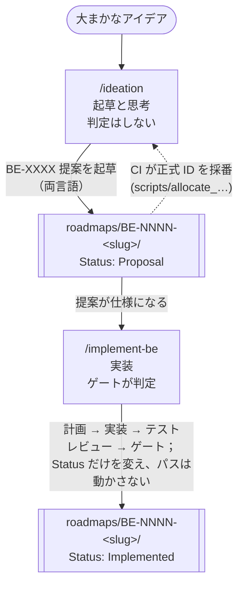

[English](../roadmap-workflow.md) · **日本語**

# ロードマップのワークフロー：着想から実装まで

> 大まかなアイデアが、出荷されゲートを通過したコードになるまでの道のりです。**`ideation`** スキルが
> ロードマップ項目（BE 項目）を *起草* し、**`implement-be`** スキルがそれを *出荷* します。この 2 つは
> 意図的に対をなしていて、片方が[ロードマップ](../../roadmaps/README-ja.md)を満たし、もう片方がそれを
> 消化します。両者が合わさって、Bajutsu への自明でない変更がすべて通る循環を形づくります。このページは
> その循環を説明します。前提となる BE ID の仕組みは
> [ai-development](ai-development.md#ロードマップ項目-be-id厳守) が規定します。

> **貢献が初めての方は、[コントリビューターワークフローチュートリアル](contributor-workflow-tutorial.md)から
> 始めてください。** 一つのアイデアをこの循環全体に通す、手を動かしながらの段階的な walkthrough です
> （`propose-and-build` で畳むときも示します）。このページは、その背後にある考え方の概観です。

Bajutsu のロードマップは、ざっと眺めて通り過ぎるバックログではありません。テストにとってシナリオ YAML が
共有ハブであるのと同じように、ロードマップは計画の **共有ハブ** です。機能はまず BE（*Bajutsu Evolution*）
項目として [`roadmaps/`](../../roadmaps/README-ja.md) の下に書き留められ、提案として議論され洗練されてから、
ようやく作られます。この道のりの両半分にはそれぞれ専用のスキルがあるので、歩くのが人間でもエージェントでも
道筋は同じです。

## 循環の全体像

Mermaid ソース

<!-- mermaid-svg: assets/diagrams/roadmap-workflow-cycle-ja.svg -->

2 つのスキルは同じ 3 つの **絶対指針**（[`CLAUDE.md`](../../CLAUDE.md)）を共有します。AI は起草と調査を担い
判定はしないこと、決定性を最優先すること、アプリ非依存であること、の 3 つです。両者は無関係な 2 つの道具では
なく、1 本のパイプラインの両端だからです。指針の枠内で作れないアイデアはよい提案ではないので、`ideation` は
それを捨てるのではなく枠に収まる形に作り直します。`implement-be` も、作りかけの項目が指針に反すると判明した
ときに、黙って迂回することを拒みます。

## 起草：`ideation` スキル

`/ideation` で起動します。Bajutsu が次に何をできるかを考えたいとき、または大まかなアイデアを BE 項目に
仕立てたいときに使います。これは白紙ではなく **相談相手** です。どの提案も、すでに計画済み、進行中、あるいは
意図的に採用しないと決めたものに結びつけられます。

1. **既存のロードマップに足場を置く**：[ロードマップ索引](../../roadmaps/README-ja.md)、
   [`architecture.md#実装状況`](architecture.md#実装状況)（出荷済みのものを「提案」しないため）、トピックに
   近い BE 項目を読みます。
2. **一緒に着想する**：具体的で範囲の定まったアイデアを示し、範囲を絞る問い（誰のためか、どの Tier か、
   *機械チェック可能* な成果は何か）を投げかけ、隣接する項目を参照点として引き込みます。
3. **残ったアイデアを分類する**：3 つの行き先のどれかに振り分け、どれを選んだかを伝えます。**既存の項目と
   重なる**（重複を作らずその項目を補強する）、**新規で範囲が定まっている**（新しい項目を起草する）、**まだ
   形になっていない**（両索引 README の *未整理のアイデア* に箇条書きで残し、後で昇格する）の 3 つです。
4. **プレースホルダー ID で新項目を起草する**：`make new-roadmap-item SLUG=… TITLE="…"` が
   `roadmaps/BE-XXXX-<slug>/` を、両言語のファイルとともに正規の Swift Evolution 形式で生成します。
   スキルは `TBD` の節を埋め、日本語側を自然な日本語に書き直します。`BE-XXXX` というプレースホルダーは意図的
   です。**ID を人手で当て推量することはありません。**
5. **CI のレビュー契約に照らしてセルフレビューする**：この起草の会話を見ていない新規サブエージェントに、
   「Claude review」ワークフローが使うのと同じ契約（[`.github/claude-review-prompt.md`](../../.github/claude-review-prompt.md)、
   BE-0203）を、ステージ済みの差分に適用させます。CI のレビュアーが起草の経緯を知らない状態からレビューする
   のと同じ条件にするためです。見つかった指摘は基本的にすべて直しますが、誤検知や説明済みのトレードオフは
   理由を書き添えて見送り、設計そのものに関わる指摘は直そうとせずユーザーにエスカレーションします。3 回
   繰り返しても指摘が収束しない場合も、ユーザーに判断を仰ぎます。
6. **検証し、依頼されたときだけ PR を開く**：ドキュメントだけの変更でも `make check` でゲートを緑に保ちます。
   PR 本文には、正式 ID を CI が採番することを書き添えます。

プレースホルダーを使うのは、ID が永続で単調増加であり、同時に多数のブランチが進行しているからです。
番号を人手で選ぶと競合します。2 つの PR が同じ番号をつかんでしまうからです。
[`roadmap-id`](../../.github/workflows/roadmap-id.yml) ワークフローが PR 時に
[`scripts/allocate_roadmap_ids.py`](../../scripts/allocate_roadmap_ids.py) を走らせ、次に空いている ID を
アトミックに確保し、`BE-XXXX` を `BE-NNNN` にすべて書き換えて、結果をブランチに押し戻します。こうして起草は
競合と無縁でいられます。詳しい仕組みは [ai-development](ai-development.md#ロードマップ項目-be-id厳守) に
あります。

## 出荷：`implement-be` スキル

`/implement-be BE-0066`（完全な ID、数字だけ、あるいは slug の一部）で起動します。既存の提案を出荷済みの
コードに変えたいときに使います。提案の **Detailed design**（詳細設計）が仕様であり、判定するのは決定的な
ゲート（`make check`）であって、LLM ではありません。

1. **項目を特定する**：**両方** の言語ファイルを読みます。`Proposal` を実装することは、それを *受理* する
   ことを意味し、この PR が状態を `Implemented` に切り替えます。スキルはそれを最初に伝えます。すでに
   `Implemented` の項目や `Proposal (deferred)`（保留中の提案）の項目では、いったん止まって本当に何を望むかを
   確認します。
2. **仕様とコードに足場を置く**：Detailed design と *Alternatives considered*（検討した代替案）を読みます。
   後者は却下済みの道筋（多くは指針上の理由による）を記録しているので、蒸し返しません。提案がリンクする
   ファイルをすべて開き、[実装状況](architecture.md#実装状況)を確認し、前提となる BE 項目がそれ自体まだ提案の
   ままでないかを検証します。
3. **集中したブランチを用意する**：最新の `origin/main` から `claude/be-NNNN-<slug>` を切り、この項目に必要な
   ファイルだけに手を入れます。
4. **計画し、コードを書く前に合意を得る**：ロードマップ項目を丸ごと実装するのは大きく、後戻りが難しい作業
   なので、まず具体的な計画への同意を得ます。手を入れるファイル、動くことを証明する *機械チェック可能* な成果
   （と、AI に任せてよい箇所とよくない箇所）、テスト、両言語で動かすべきドキュメント、絶対指針との緊張、を
   計画に挙げます。
5. **実装する**：設計どおりに、コードベースの流儀（既存のスタイル）に合わせて作ります。厳格な `mypy`、設定済みの `ruff`、
   `sleep` ではなく条件待ち、新しいつまみは `targets.<name>` 設定へ、回帰の網としてのテスト、文書化された
   挙動には両言語のドキュメント、を守ります。
6. **差分をレビューして洗練する**：組み込みの [`simplify`](../../.claude/skills) と
   [`code-review`](../../.claude/skills) スキル、そして自明でない変更では **pr-review-toolkit** のエージェント
   を使います。これらは *起草の補助* です。著者に助言するだけで判定はしないので、指針 1 が保たれ、`run`/CI の
   経路に LLM が触れることはありません。
7. **項目を Implemented に切り替える**：両言語のファイルで `Status: Implemented` にし、`Implementing PR` の行を
   加えます。ダッシュボードが項目のメタデータから `Status` を直接読み取るため、ほかに再生成するものは
   ありません。ディレクトリは移動しません（BE-0159）。変わるのは `Status` とそのダッシュボードのバケットだけです。
8. **検証（ゲート）**：`make check` は緑でなければなりません。赤のまま push しません。正しさが本当に
   Simulator やブラウザでの実行に依存する場合は、未検証で動くと主張せず、[`verify`](../../.claude/skills)
   スキルがそれを実行します。
9. **PR は依頼されたときだけ**：ブランチに push します。PR は通常、人間が開きます。タイトルには `[BE-NNNN]`
   接頭辞を付け、`Implementing PR` の行に実際の番号を埋めます。

## なぜ 1 つではなく 2 つのスキルなのか

起草と出荷を分けることは、Bajutsu 自身の中核的な境界を映しています。`ideation` は **著者** の役割にいて、
考え、提案し、作り直します。その出力である提案は、けっして判定ではありません。`implement-be` は **作り手** の
役割にいて、仕様を、決定的なゲートが合否を下すコードに変えます。Bajutsu がテスト実行の合否判定から AI を
締め出すのと同じように、このワークフローは計画の *開かれた* 部分（何を作るべきか、このアイデアは健全か）を、
出荷の *閉じた* 部分（このコードは仕様を満たしゲートを通るか）からはっきり切り離します。議論を重ねて形になった
提案は、一行のチケットよりはるかによい仕様です。そしてその仕様に枠づけられた実装は、行き当たりばったりの変更
よりはるかにレビューしやすいものです。

## 関連項目

- [ai-development](ai-development.md)：並行作業の規則、ゲート、そして両スキルが依存する **BE ID の厳格な
  ライフサイクル**（`Status` が index バケットを決める、1 ディレクトリのフラット構成、永続 ID）。
- [roadmaps/README](../../roadmaps/README-ja.md)：すべての BE 項目の索引と、項目ごとの提案形式。
- [concepts](concepts.md)：絶対指針が体現する、決定性と AI の境界の原則。
- [`CLAUDE.md`](../../CLAUDE.md)：絶対指針の出どころである working agreement。
