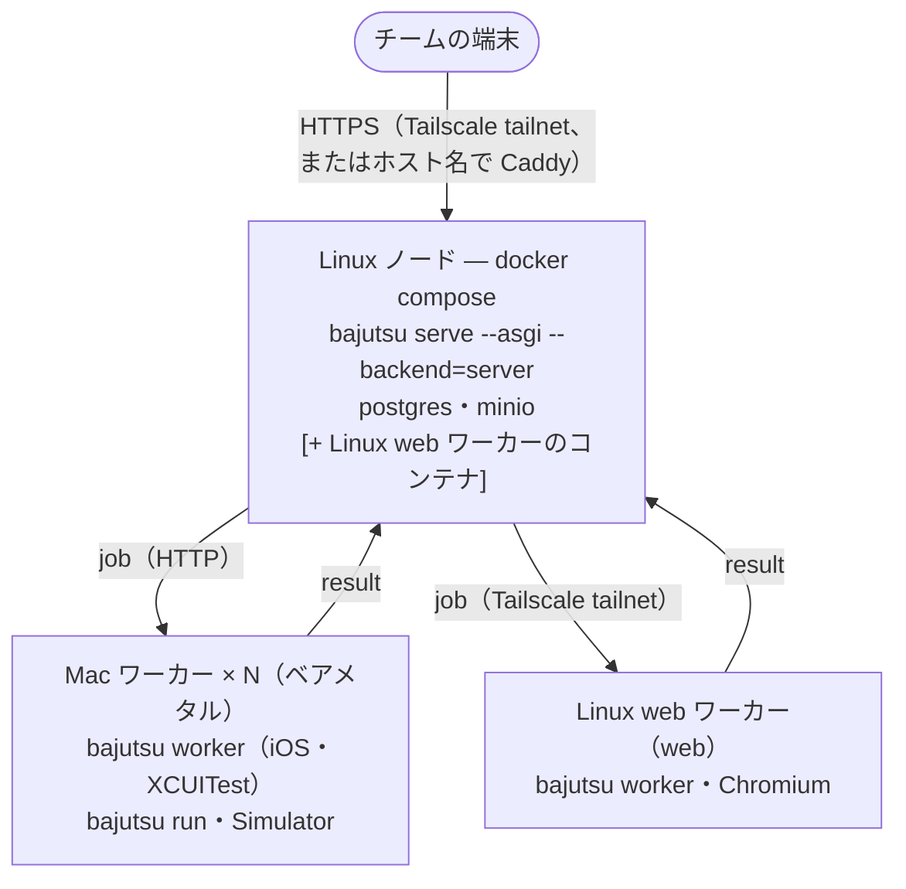

[English](../self-hosting.md) · **日本語**

# Web UI のセルフホスティング

> bajutsu の Web UI（[cli](cli.md#serve)）を、自前のハードウェア上で、プライベートな Tailscale ネットワーク
> 越しにチームから到達できるよう動かします（セルフホスティングロードマップ
> [BE-0016](../../roadmaps/BE-0016-web-ui-self-hosting/BE-0016-web-ui-self-hosting-ja.md)）。今日使える
> 段階は 2 つあり、どちらも
> [BE-0051](../../roadmaps/BE-0051-serve-hardening-for-hosting/BE-0051-serve-hardening-for-hosting-ja.md)
> の認証と入力検証で公開を安全にしています。
>
> - **Tier A、単一 Mac。** トークン認証付きの `bajutsu serve` を 1 プロセス、1 台の Mac で動かします。本ページの
>   「Tier B」節より前がこれを扱います。
> - **Tier B、セルフホストのサーバ backend。** BE-0015 のコントロールプレーン（FastAPI、Postgres、
>   S3 互換ストレージ、GitHub OAuth、RBAC、クォータ）を Linux ノードで動かし、Mac をワーカーにします。既定では
>   シングルテナントで動き、config で org を宣言すれば**複数 org**に対応します（後述の「Tier B、サーバ backend の
>   セルフホスティング」節を参照）。
>
> フルマネージドの公開クラウド提供（ホスト型の Mac ワーカープール＋IaC）は将来のままです
> （[BE-0015](../../roadmaps/BE-0015-web-ui-public-hosting/BE-0015-web-ui-public-hosting-ja.md)）。

## macOS の制約

ランナーは **iOS Simulator** を駆動し、Simulator は **GUI ログインセッション**（Aqua セッション）を必要と
します。ヘッドレスな daemon では動きません。以下の選択はすべてここから来ます:

- serve は per-user の **`LaunchAgent`**（GUI セッション）として動かします。**`LaunchDaemon` ではありません**。
- 再起動後に GUI セッションを回復するよう Mac を **auto-login** にします（FileVault はコールドブート後、
  auto-login が進む前に一度だけ対話ログインが必要）。
- セッションを生かし続けるためスリープを無効化します: `sudo pmset -a sleep 0 disablesleep 1`。

これらの制約は **iOS Simulator（XCUITest）** backend に固有のものです。**web（Playwright）** backend はヘッドレスの
ブラウザを動かすため、どれも必要ありません。Mac でも Linux でも（Tier B のノード上でも）serve でき、web だけの
構成ならこの節は読み飛ばせます。

## 1. LaunchAgent を生成する

> **先に、この agent が使う venv へ backend のランタイム依存を入れてください。** agent は
> `python -m bajutsu serve` を直接起動するため、`make serve` と違って依存をオンデマンドでは入れません。
> 入れるのは backend の**ランタイムクロージャ**、つまり実行が到達するものをすべて名前で束ねた 1 つの
> extra です。ここには `visual`（スクリーンショット）と `schema`（`responseSchema`）のアサーション依存も
> 含まれます（BE-0173）。web（Playwright）backend なら `uv sync --extra worker-web && playwright install
> chromium`、iOS Simulator（XCUITest）backend なら `uv sync --extra worker-ios` です（XCUITest backend は
> backend の pip extra を必要としません。`xcodebuild` は Xcode が供給し、target が事前ビルドの
> `xcuitest.testRunner` を供給するので、`worker-ios` は `visual` / `schema` のアサーション依存だけです）。
> backend の extra 単体（たとえば `web`）では入れ足りず、その実行は
> アサーションの時点で遅延的に失敗します。クロージャをまったく入れずに飛ばすと、実行のディスパッチ時に
> `no available actuator` で失敗します。

`bajutsu serve --emit-launchagent` は、渡した serve フラグに対応する launchd plist を出力して、サーバを
起動せずに終了します。強いトークンを選び、plist を LaunchAgents に書き出します:

```bash
export TOKEN="$(python3 -c 'import secrets; print(secrets.token_urlsafe(32))')"
bajutsu serve --emit-launchagent --config bajutsu.config.yaml --token "$TOKEN" \
  > ~/Library/LaunchAgents/com.bajutsu.serve.plist
chmod 600 ~/Library/LaunchAgents/com.bajutsu.serve.plist   # plist はトークンを含む
```

出力される plist は、次のように動きます:

- `python -m bajutsu serve --host 127.0.0.1 --port 8765 --config …` を、**`RunAtLoad`** + **`KeepAlive`**
  付きで実行します（コマンドを動かしたのと同じインタプリタ、つまりあなたの venv を使います）。
- トークンを **`EnvironmentVariables`**（`BAJUTSU_SERVE_TOKEN`）に入れます。argv には載せないので、`ps` からは
  見えません。
- stdout/stderr を `~/Library/Logs/bajutsu-serve.{out,err}.log` に書きます。

出力された plist が設定しない項目が 2 つあり、どちらも `EnvironmentVariables` に追記します。

- `ANTHROPIC_API_KEY`：AI パス（`record`、`--alert-handling`）に必要です（自動では埋め込みません）。Bedrock
  プロバイダを使うなら、代わりにここへ `BAJUTSU_AI_PROVIDER` と `BAJUTSU_BEDROCK_MODEL`、AWS の認証情報を置きます。
- `PATH`：iOS（XCUITest）backend のときだけ必要です。launchd は最小の `PATH` で agent を起動し、bajutsu は
  `xcodebuild` / `xcrun` / `simctl` を `PATH` 経由で探すため、これがないと実行が `no available actuator` で
  失敗します。Xcode のコマンドラインツールの bin、Homebrew の bin、venv の bin を含めてください（web backend は
  Playwright を import で見つけるので `PATH` の追記は要りません）。

XML を手で編集せずに、PlistBuddy で両方を追記できます（`.venv` が解決できるよう、リポジトリ root で実行してください）。

```bash
PLIST=~/Library/LaunchAgents/com.bajutsu.serve.plist
/usr/libexec/PlistBuddy -c "Add :EnvironmentVariables:ANTHROPIC_API_KEY string sk-ant-…" "$PLIST"
/usr/libexec/PlistBuddy -c "Add :EnvironmentVariables:PATH string $(brew --prefix)/bin:/usr/bin:/bin:/usr/sbin:/sbin:$(pwd)/.venv/bin" "$PLIST"
```

serve のバインドは `127.0.0.1` のままで、これを到達可能にするのは次の手順です。

## 2. ロードする

```bash
launchctl bootstrap gui/$(id -u) ~/Library/LaunchAgents/com.bajutsu.serve.plist
launchctl print gui/$(id -u)/com.bajutsu.serve        # ロード確認
```

plist を編集した後に再読み込みするには、`launchctl bootout gui/$(id -u)/com.bajutsu.serve` の後で再度 bootstrap します。

## 3. Tailscale で公開する（推奨）

serve は `127.0.0.1` のままで、**Tailscale** が tailnet 内にだけ公開します。identity ベースのアクセスと
自動 TLS が備わり、公開面はありません:

```bash
tailscale serve --bg 8765    # → https://<machine>.<tailnet>.ts.net（tailnet 内のみ到達可能）
```

チームがその URL を開くと、初回に UI がトークンを尋ねます（以後はブラウザがセッション Cookie を持ちます）。
API クライアントは `Authorization: Bearer $TOKEN` を送ります。

> **`0.0.0.0` をインターネットに公開しないでください。** トークンがあっても、安全な既定はプライベートな
> tailnet です。serve はトークン無しの非 loopback `--host` を拒否しますが、公開バインドは不必要に面を広げます。
> 本当に内部ホスト名が必要なら、serve の前段に **Caddy** を置いて TLS（+ basic auth）を付け、オープンな
> インターネットからは隔離してください。

## セキュリティのまとめ（BE-0051）

セルフホストの serve は
[BE-0051](../../roadmaps/BE-0051-serve-hardening-for-hosting/BE-0051-serve-hardening-for-hosting-ja.md)
のハードニングに依存します。全リクエストのトークン認証、`/api/run` と `/api/record` をアプリの scenarios dir
に限定して `backend`/`udid` を検証すること、CSRF Origin チェックとセキュリティヘッダ、run dispatch の同時実行上限です。
トークンは秘匿し、Mac は tailnet 上に置き、OS は更新し続けてください。

CSRF の Origin チェックと **`Host` ヘッダの許可リスト**は、トークンが設定されているときだけでなく**無条件で**動きます
（[BE-0121](../../roadmaps/BE-0121-serve-csrf-host-allowlist/BE-0121-serve-csrf-host-allowlist-ja.md)）。これがいちばん
効くのは `make serve` の既定（ループバック、トークンなし）です。別タブで開いたページからのクロスオリジンの `POST` は
ブロックされ、`Host` がバインド済みのインタフェースを指さないリクエストは拒否されるので、リバインドされたホスト名では
`GET /api/apikey` のようなループバックのエンドポイントに到達できません。`Origin` ヘッダを持たない非ブラウザの
クライアントは影響を受けません。`Host` の許可リストは `serve` がバインドするインタフェースから導かれます。ループバックに
バインドすればループバックの名前、それ以外はそのホストです。ワイルドカードのバインド（`0.0.0.0` や `::`）は到達しうる
名前を列挙できないため `Host` チェックを無効化し、クロスオリジンの防御は CSRF が担います。

## アップロードされた config のコマンド実行（BE-0090）

アップロードされた `.zip` バンドルは、テスト対象アプリを起動するシェルコマンドを `launchServer.cmd`
（および、配線され次第 `mockServer.cmd`）に持つ config を同梱できます。このコマンドは**信頼できない入力**なので、
`serve` がホスト上で直接実行することはありません。**アップロードされた**バンドルの run がこのコマンドを必要とする
ときの挙動は、`--upload-exec` オプション（ホスト型 backend では環境変数 `BAJUTSU_UPLOAD_EXEC`）で選びます。これが
効くのはアップロード由来の config だけで、ローカルや Git 由来の config は運用者が信頼しているため影響を受けません。

- **`sandbox`**（既定）：コマンドを使い捨ての **Docker** コンテナの中で実行し、`serve` ホストには決して触れさせません。
  バンドルはランタイムを、`dockerImage`（公開済みのベースイメージ。例 `node:20-slim`）か `dockerfile`（バンドル相対の
  パスで、`serve` が `docker build` でビルドします）のどちらか一方で宣言し、加えて `port`（コンテナ内の待ち受けポート）
  を指定します。コンテナはハードニングされ（`--rm`、全ケーパビリティの剥奪、権限昇格の禁止、読み取り専用ルート
  ファイルシステムと `tmpfs` のスクラッチ、非 root ユーザ、CPU・メモリ・pid の上限、そして単一のポートだけを
  **ループバック**のホストポートへ publish）、run の後に破棄します。`serve` ホストには Docker が必要です。
- **`reuse`**：アップロードされたコマンドは実行せず、`baseUrl` ですでに応答している運用者提供のサーバをプローブする
  だけです。何も応答しなければ、何かを起動するのではなく run を fail loud させます。
- **`deny`**：アップロードされたコマンドをきっぱり拒否します。`reuse` と同様、外部で応答するサーバがあれば受け入れ、
  なければ run を fail loud させます。

どのモードもアップロードされたコマンドをホスト上で実行することはなく、黙ってそこへフォールバックすることも
ありません。ブロックされた、あるいは設定の誤った `launchServer` は、flaky に見える run ではなく明確なエラーで
失敗します。その判断（denied / reused / sandboxed、sandbox のときは使ったイメージ）は run の `manifest.json` の
provenance に記録されるので、「この run は何を実行し、何を抑止したのか」に、あとから答えられる状態を保てます。

## リモート config のコマンド実行（BE-0121）

起動時に `--config` でバインドした config（自分で入力したローカルパスや `github:` の spec）は**運用者が信頼している**ため、
`serve` はその `build:` コマンドを通常どおり実行します。あとから **UI の「from Git」ピッカー**でバインドした Git config
（`git` の spec を伴う `POST /api/config`）は信頼のレベルが違います。クロスオリジンのリクエストがそれをバインドした
可能性があるので、アップロードされたバンドルと同じ扱いにし、その `build:` コマンドは**既定ではホスト上で実行しません**。
UI からバインドした Git config でその build を信頼して run を回したいときは、`--allow-remote-build`（または環境変数
`BAJUTSU_ALLOW_REMOTE_BUILD=1`）で明示的に opt-in してください。opt-in がなければ、アップロードされたバンドルの build が
抑止されるのと同じように build を抑止したまま run が進みます。ネットワーク越しに届いた config から、黙ってホスト側で
コマンドが実行されることはありません。

## Git config source の非公開リポジトリへのアクセス（BE-0224）

`serve`（や CLI）が config を **非公開**の GitHub リポジトリから読むとき、すなわち `github:` の spec
（[BE-0063](../../roadmaps/BE-0063-git-config-source/BE-0063-git-config-source-ja.md)）のときは、読み取りを
許可する資格情報が要ります。公開リポジトリには要りません。資格情報は**取得のたびに**解決するので、
ローテーションしても再起動なしで反映されます。解決の順序は次のとおりです。

1. 設定済みの **GitHub App installation**（無人ホストではこれを推奨します。下記参照）
2. Web UI の「From a Git repository」ダイアログで入力した資格情報（`BAJUTSU_GIT_CONFIG_TOKEN` に保持します。下記参照）
3. 環境変数の `GITHUB_TOKEN` / `GH_TOKEN`
4. `gh auth token`（自分のマシンで対話的な `gh` セッションを持つ開発者向け）
5. いずれも無ければ匿名（公開リポジトリのみ）

**最小権限で付与してください。** classic の `repo` スコープの個人アクセストークン（PAT）は、その人が見える
**すべての**非公開リポジトリに読み書きを与えます。「テスト用リポジトリを 1 つ読む」には過剰です。対象の
リポジトリだけに **Contents: read** 権限だけで絞った**細粒度（fine-grained）**の PAT、または GitHub App
installation を選んでください。

### 無人のデーモンへトークンを渡す

launchd や systemd の `serve` には対話的な `gh` セッションが無いので、デーモンのレベルでトークンを注入します。
[手順 1](#1-launchagent-を生成する) の LaunchAgent なら plist の `EnvironmentVariables` に加えます。Linux や
systemd では unit の `Environment=`（または誰でも読めるわけではない `EnvironmentFile=`）を使います。ただし PAT は
**人**に紐づき、その人のアクセスを帯び、ローテーションや離任で失効します。無人で非公開リポジトリを読むサービスは、
**サービス自身として**認証すべきで、それが GitHub App です。

### GitHub App（サービスに推奨）

GitHub App の installation トークンは短命で、その installation のリポジトリに限定され、人ではなくサービスに紐づきます。
**Contents: read** を持つ App を作り、対象のリポジトリにインストールしたうえで、次を与えます。

```bash
export BAJUTSU_GITHUB_APP_ID=123456
export BAJUTSU_GITHUB_APP_PRIVATE_KEY_FILE=/etc/bajutsu/app.pem   # または BAJUTSU_GITHUB_APP_PRIVATE_KEY で直接
# 任意: installation を固定する。無ければ取得対象のリポジトリから解決します
export BAJUTSU_GITHUB_APP_INSTALLATION_ID=7654321
```

App 経路は、秘密鍵で短命な RS256 の JSON Web Token（JWT）に署名し、それを installation トークンと交換します。
署名には `cryptography` を使い、`githubapp` extra でオンデマンドに導入します（`uv sync --extra githubapp`）。PAT で
認証するデプロイがこれを読み込むことはありません。

App の資格情報はプロセスの環境から読むので、設定した App は**すべての**リクエストに適用され、PAT より**優先**します。
Web UI で入力したものも含みますし、ホスト型の複数組織のデプロイでは各組織の保存した資格情報よりも優先します。App の
identity ですべての取得を認証させたいのでなければ、どちらか一方だけを設定してください。

### Web UI から資格情報を入力する

「Open config」ダイアログの **「From a Git repository」** ソースには資格情報の入力欄があります。細粒度の PAT や
App トークンを入力すると、serve の秘密ストアを通じて **write-once** で保存します。[Claude API キー](#オペレータのシークレットclaude-api-キー)
と同じストアで、値はマスクして表示し、読み出すことはありません。**ローカル**の serve では、bajutsu 専用の変数
（`BAJUTSU_GIT_CONFIG_TOKEN`）にプロセスの寿命のあいだ保持し、取得時には環境の `GITHUB_TOKEN` より先に読みます。あえて
`GITHUB_TOKEN` そのものは使いません。UI で資格情報を入力したり消したりしても、起動時にエクスポートしたトークンに
触れないためです。**ホスト型**バックエンドでは保存時に暗号化し、**組織ごと**にスコープするので、各テナントの保存した
資格情報はそれぞれ独立です。その組織ごとの値をホスト型コントロールプレーンのインプロセスのバインドに渡すのは後続の作業で、
今のところホスト型の非公開バインドはプロセス共通の App / 環境の資格情報で解決します。アクセス不足で
バインドが失敗したときは、ダイアログ内にその場で診断を表示します。メッセージは、レート制限、組織のシングルサインオン
（SSO）の認可不足、トークンの拒否、あるいは「`<owner>/<repo>` に Contents: read を持つ資格情報を用意してください」
といった、**本当の原因**を名指します。素の 404 では終わりません。

## Tier B、サーバ backend のセルフホスティング

Tier A は 1 台の Mac で動く 1 プロセスです。**Tier B** は BE-0015 の**サーバ backend**、すなわち FastAPI の
コントロールプレーン（Postgres、S3 互換ストレージ（MinIO）、GitHub OAuth、RBAC、per-user クォータ）を Linux
ノードで動かし、1 台以上の Mac をワーカーにします。既定では**シングルテナント**（全ユーザが 1 つの
default org）で動き、config で org を宣言すれば**複数 org**に対応します（後述の「複数 org」を参照）。すぐ動かせる
一式は [`deploy/self-host/`](../../deploy/self-host/)（compose、Dockerfile、`.env.example`）にあります。


<details>
<summary>Mermaid ソース</summary>

<!-- mermaid-svg: assets/diagrams/self-hosting-tier-b-topology-ja.svg -->


</details>

Linux のコントロールプレーンは安価で、**Mac ワーカー**が Simulator の run を担う希少な部分です。フリートは
**backend ごとに異なる構成**になります。Mac の iOS ワーカーは iOS Simulator のために Aqua の GUI セッションが
要るので **ベアメタル**で動かし（Tier A と同じ）、**Linux の web（Playwright）ワーカーはヘッドレスなので
コンテナで動かします**（BE-0173）。web backend には GUI セッションの制約がないためです。どちらも同じ
コントロールプレーンから HTTP でリースを受けます。web ワーカーのコンテナは cloud SDK もオブジェクトストレージの
秘密情報も不要で（BE-0160）、必要なのはコントロールプレーンの URL とトークンだけです。混在フリートは任意です。
既定は iOS だけの構成で、これは変わりません。web の run をホストするときに web ワーカーを足してください
（[§ Linux web ワーカーを足す](#5-linux-web-ワーカーを足すコンテナ任意)）。

**config のソースはデプロイ形態で変わります（BE-0108）。**「Open config」ダイアログは、アクティブな config
を最大3つのソースからバインドします。**Git リポジトリ**、アップロードした **`.zip` バンドル**、そして
serve ホストの `--root` を辿る**ファイルブラウザ**です。サーバ backend（この Tier）ではファイルブラウザを
外します。UI から隠すだけでなくサーバ側でも拒否し（`/api/fs` と `POST /api/config` の path ブランチは `403`
を返します）、Git とアップロードの2つだけを残します。ホスト型のユーザは共有ワーカーのファイルシステムと
関係を持たないため、オペレータの `--root` を辿っても自分が所有する config はバインドできません。ファイル
ブラウザを外すことで、ログイン済みの全ユーザにそのツリーのディレクトリ一覧を見せてしまう露出も避けられ
ます。ローカル backend（Tier A、セルフホストの単一 Mac）では3つのソースすべてを残します。そこではファイル
システムがオペレータ自身のものだからです。

### config、シナリオ、アプリバイナリ全体で見る、ローカルとホスト型の違い

ここまでの説明は「どうデプロイするか」を軸にしています。ここでは視点を変え、`serve` が管理する状態の種類
ごとに何が変わるかをまとめます。
以下の「ローカル」は、Tier A と、ノート PC 上で素の `make serve` を動かす場合の両方を指します。どちらも
`hosted: false` で動作し、`hosted: true` になるのは Tier B のサーバ backend だけです。

| 状態 | ローカル（`hosted: false`。Tier A、または素の `make serve`） | ホスト型（`hosted: true`。Tier B のサーバ backend） |
|---|---|---|
| **config** | ファイルブラウザ + Git + アップロード。自分のファイルシステムで、パスの閉じ込めなし | Git とアップロードのみ。ファイルブラウザは無効、403（BE-0108） |
| **シナリオと run の成果物** | `scenarios/`、`runs/` をディスク上に保持。ソフトデリートは `runs/.trash/` へ移動 | オブジェクトストレージ（S3/GCS）+ Postgres。ソフトデリートは `deleted_at` を設定（BE-0239） |
| **アプリバイナリ** | `appPath` をディスク上に保持。存在しないときだけ build | worker がチェックアウトまたはバンドルから build。リモート build はゲート付き（BE-0121） |

- **config。** どちらの側も最大3つのソースからバインドしますが、`hosted` が true になった瞬間にファイル
  ブラウザだけが消えます（前述のとおりです）。パスの閉じ込めを決めるのは Tier ではなく**ソース**です。ローカル
  ファイルの config は自分自身のディレクトリを基準に解決し、閉じ込めはありません（兄弟ディレクトリを指すことも
  できます）。一方、Git またはアップロード由来の config は信頼できない入力として扱われ、`scenarios` /
  `baselines` / `appPath` は、どちらの Tier でバインドしたかに関わらずチェックアウトまたはバンドルのルートに
  閉じ込められます（[configuration](configuration.md)の「Git リポジトリからの config」の節を参照してください）。
  ホスト型ではローカルファイルのソースをそもそも提供しないため、ホスト型の config は結果としてすべて閉じ込め
  られます。これはファイルブラウザを外したことの副作用であり、別立てのルールではありません。
- **シナリオと run の成果物。** ローカルでは、シナリオストアと run の履歴がふつうのディレクトリツリー
  （`scenarios/`、`runs/`）を読み書きします。ソフトデリートした run は `runs/.trash/` へ移動します。ホスト型
  では、両方ともコントロールプレーンのオブジェクトストレージ（`BAJUTSU_SERVER_STORE`。S3 互換または GCS）と、
  run ごとの Postgres の行に置かれます。そのためソフトデリートは、ディスク上でバイトを移動させる代わりに
  `deleted_at` を設定するだけです（後述の「run の削除と、ゴミ箱の保持期間」を参照してください）。
- **アプリバイナリ。** どちらの側にも、汎用のバイナリアップロード用エンドポイントはありません。バインドした
  config から `appPath` を解決し、それが存在しなければ config の `build:` コマンドを実行する点は共通です。
  ホスト型では、Mac の worker が、コントロールプレーンがその job 用に解決したのと同じチェックアウトまたは
  バンドルの素材から build します。共有ファイルシステムではなく、署名した presigned URL 経由でバイトを
  やり取りします（前述の BE-0160）。リモート build のゲートは Tier とは独立しています。**UI の「from Git」
  ピッカー**で後からバインドした config は、その UI がノート PC 上の Tier A にあるか Tier B のコントロール
  プレーンにあるかに関わらず、`build:` が既定で抑止されます。起動時に与えた config だけがオペレータ信頼として
  扱われます（前述の「リモート config のコマンド実行」を参照してください）。web（Playwright）backend には
  どちらの側にもバイナリという概念自体がなく、ブラウザエンジンがオンデマンドでインストールされるだけです。

### 1. コントロールプレーンを起動する

```bash
cd deploy/self-host
cp .env.example .env            # BAJUTSU_SERVE_TOKEN, POSTGRES_PASSWORD, AWS_*（MinIO）, bucket を設定
mkdir -p config && cp /path/to/bajutsu.config.yaml config/   # 公開する app/project の一覧
docker compose up -d            # postgres + minio + migrate（alembic upgrade head）+ bajutsu
```

`migrate` が `bajutsu` の起動前に Alembic マイグレーションを head まで適用し、`minio-init` がバケットを
作成します。コントロールプレーンは `:8765` で待ち受けます。

web UI のバージョンバッジ（BE-0272）に、このイメージが動作しているコミットを表示したい場合は、そのコミットを
ビルド時に渡します（BE-0277）。イメージには読み取れる `.git` が含まれないため、バッジはこの埋め込み値に
フォールバックします。

```bash
GIT_COMMIT=$(git rev-parse HEAD) docker compose build bajutsu   # そのあと `docker compose up -d`
```

`docker-compose.yml` は、呼び出し元のシェル（または `.env` のエントリ）から `GIT_COMMIT` を解決し、
`bajutsu` サービスのビルド引数に渡します。設定しなければ、バッジは従来どおりバージョンだけを表示します。
compose を通さずコントロールプレーンのイメージを直接ビルドする場合は次のようにします。

```bash
docker build --build-arg GIT_COMMIT=$(git rev-parse HEAD) -f deploy/self-host/Dockerfile .
```

公開ポートは `BIND_ADDR`（既定は `127.0.0.1`）にバインドします。Mac の worker が別ホストから MinIO に届く
ようにするには、`.env` の `BIND_ADDR` をノードの tailnet IP に設定してください。公開インターフェースを
持つホストで `0.0.0.0` にはしないでください。成果物バケットを露出させてしまいます。

アーティファクト／シナリオ／ベースラインに加え、アップロードされた zip バンドル（BE-0243）のストアも、
`BAJUTSU_SERVER_STORE` という1本の URI で選びます（BE-0204）。`s3://bucket/prefix`（S3 互換。
この compose が同梱する MinIO）と `gs://bucket/prefix`
（Google Cloud Storage）のどちらかを指定できます。すでに Google Cloud 上で他のスタックを動かしているなら、
`docker-compose.yml` から `minio` と `minio-init` サービスを外し、`BAJUTSU_SERVER_STORE` を GCS バケットに
向けて、コントロールプレーンのイメージの [`deploy/self-host/Dockerfile`](../../deploy/self-host/Dockerfile)
のインストール行に `gcs` extra を追加してください（`.[server,worker,db,oauth,gcs]`）。S3 互換バケットを
別途用意する必要はなくなります。

以前の `BAJUTSU_S3_BUCKET` / `BAJUTSU_S3_PREFIX` の組み合わせを使っていた環境からアップグレードするときは、
prefix を URI のパスに畳み込んでください。`BAJUTSU_S3_BUCKET=bajutsu` と `BAJUTSU_S3_PREFIX=tenant/` の
組み合わせは `BAJUTSU_SERVER_STORE=s3://bajutsu/tenant/` になります。prefix を畳み込まずに設定すると、
その prefix 配下にあった既存のキーが解決できなくなります。

### 2. GitHub OAuth を足す（任意）

オペレータが数人なら共有トークン（`BAJUTSU_SERVE_TOKEN`）だけで十分です。ユーザごとのブラウザログインには、
GitHub OAuth アプリを作り（callback は `https://<your-host>/api/oauth/callback`）、`.env` に
`BAJUTSU_OAUTH_GITHUB_CLIENT_ID`／`_SECRET`／`_REDIRECT_URI` を設定します。

OAuth を構成すると、アクセスは手作業の login リストではなく **GitHub organization と Team のメンバーシップ**に
従います（[BE-0313](../../roadmaps/BE-0313-github-org-team-rbac/BE-0313-github-org-team-rbac-ja.md)）。

- **サインインと viewer ロール**は org メンバーシップに従います。構成済みの org のメンバー（明示の
  `members`、または `githubOrgs` に挙げた GitHub org の一員。[`orgs:`](configuration.md#orgorgsマルチテナントのサーバ-backend)
  を参照）だけがサインインでき、成功すると **viewer**（閲覧のみ）が付きます。どの org にも一致しない login は
  拒否されるので、OAuth を使う構成では `orgs:` ブロックの宣言が必須です。
- **editor** は org の `editorTeam` に従います。その 1 つのフラットな GitHub Team の直接メンバーが、run、record、
  scenario の編集をできます。
- **admin** はサーバ全体で 1 つの GitHub Team、`BAJUTSU_OAUTH_ADMIN_TEAM`（`"<github-org>/<team-slug>"` の形）に
  従います。そのメンバーはサーバ設定（config、API キー、provider）も変更できます。admin はデプロイ全体で 1 段の
  ロールなので、どの org を越えても信頼できるメンバーの Team を指定します。ただし admin も、まず上記のサインイン
  のゲートを通過する必要があります。`BAJUTSU_OAUTH_ADMIN_TEAM` は、login がいずれかの `orgs:` エントリに一致した
  後にしか確認されません。そのため admin Team が属する GitHub organization 自体を、どこかの org の `githubOrgs`
  に含める（または、そのメンバーを `members` に列挙する）必要があります。含めなければ、意図した admin もサイン
  インの時点で拒否され、admin Team は確認すらされません。

メンバーシップはログインのたびに読み直されるので、GitHub org や Team を抜けると、対象ユーザの次のサインインで
反映されます。サーバ側のリストを編集する必要はありません。ログインは常にこれらのメンバーシップを読むために
`read:org` scope を要求するので、同意画面には organization へのアクセスが表示されます。

**ログインリストからの移行にあたって。** ロールの由来が変わること以外にも、2 点変わります。1 つ目は、サインインが
今後は構成済みの `githubOrgs`／`members` の**全員**を通すようになることです。旧来の `BAJUTSU_OAUTH_ALLOWED_USERS`
がその org の全メンバーより狭い範囲を許可していたなら、切り替え前に `orgs:` を絞ってください。org のゲートだけに
なると、その分アクセスが広がります。2 つ目は、`BAJUTSU_OAUTH_ALLOWED_USERS`／`_ADMINS`／`_VIEWERS` が単純に無視さ
れるようになることです。切り替える前に、admin と editor のそれぞれを Team メンバーシップとして宣言し直してくだ
さい。`editorTeam` や `BAJUTSU_OAUTH_ADMIN_TEAM` でまだカバーされていない login は、次のログインで viewer に落ちます。

3 つ目は、セッションそのものです。`POST /api/login` を無効にするのは、OAuth を構成した後に**新たな**トークン
Cookie セッションが発行されなくなるだけで、それ以前にすでに発行されたセッションは無効になりません。OAuth を
有効にする前に共有トークンでサインインしていたブラウザは、そのセッションが持つ完全な権限（トークンで発行された
セッションには identity が無く、role のゲートがそもそも適用されないため）を、既定 7 日間の有効期限
（`BAJUTSU_SESSION_TTL`）が切れるまで保ち続けます。トークンのみの運用から OAuth に切り替えるデプロイは、この
7 日間の失効を待つのではなく、切り替え時にセッションストアをローテーションする（既存の Cookie を強制的に無効化
する）ことをお勧めします。

OAuth を構成すると、共有トークンは**ワーカーの通信だけ**に狭まります。ワーカーのコントロールプレーンの route
（`/api/worker/*` の endpoint と、run のエビデンスアップロード URL の要求）を認可し、それ以外には効きません。ブラウザのトークンログイン（`POST /api/login`）は無効になり（人間の
サインインは GitHub OAuth だけになります）、生の `Authorization: Bearer <token>` はワーカー以外のどの endpoint にも
届きません。トークンでワーカー以外の endpoint をスクリプト運用していたデプロイは、OAuth を有効にするとその経路を
失います。OAuth を使わない構成（単一 Mac の閉じたネットワーク）では、トークンは従来どおりすべてに届きます。

### オペレータのシークレット（Claude API キー）

管理者が設定パネルから登録する **API キー**は*オペレータのシークレット*であり、ホスト型のコントロール
プレーンでは **write-once かつ保存時に暗号化**されます
（[BE-0136](../../roadmaps/BE-0136-serve-write-once-secrets/BE-0136-serve-write-once-secrets-ja.md)）。
どのエンドポイントも平文を再び返すことはなく（管理者を含めどのロールでも）、返すのはマスクした
プレビューだけです。キーを更新するときは管理者が上書きし、古い値を読み出すことはありません。値は
データベースの `secrets` テーブルに認証付き暗号（Fernet）で暗号化して保存し、org ごとにスコープするので、
再起動をまたいで残り、コントロールプレーンの複数レプリカで共有されます。

この暗号化にはマスターキーが必要で、`BAJUTSU_DATABASE_URL` と同じくデータベースの外側で用意します。

```bash
# 一度だけ生成し、.env やプラットフォーム自身のシークレットストアに保管する
python3 -c 'from cryptography.fernet import Fernet; print(Fernet.generate_key().decode())'
export BAJUTSU_SECRETS_KEY=…
```

データベースを使うコントロールプレーンは `BAJUTSU_SECRETS_KEY` を**必須**とし、設定されていなければ
起動を拒否します。シークレットをプロセスのメモリだけで保持する形へ黙って後退しないためです。データベースが
なければシークレットは serve プロセスの環境に残り（ローカルバックエンドと同じ形）、キーは不要です。この
キーはデータベースのパスワードと同様に扱ってください。失うと保存済みのシークレットは復元できず、更新した
キーは古いキーで書いた値を復号できないので、更新後は各シークレットを入力し直します。

設定パネルは二つ目の write-once なオペレータのシークレットも同じ形で保持します。**Claude Code の OAuth
トークン**（`CLAUDE_CODE_OAUTH_TOKEN`）で、ブラウザの無いホストで `claude-code` プロバイダを動かすため
`claude setup-token` の対話的なサインインを完了できないデプロイのためのものです
（[BE-0215](../../roadmaps/BE-0215-claude-code-oauth-token-credential/BE-0215-claude-code-oauth-token-credential-ja.md)）。
保存もマスク表示も更新も、上の API キーとまったく同じように扱います。

同じストアは、シナリオが**自身**で宣言するシークレットも保持します
（[BE-0274](../../roadmaps/BE-0274-serve-scenario-secrets/BE-0274-serve-scenario-secrets-ja.md)）。config が
`${secrets.X}` のために `secrets:` に並べる名前のことです。これまでは値を供給する手段が、プロセスが
引き継ぐ `.env` しかありませんでした。今は管理者が設定パネルの **Scenario secrets** セクションから各値を
設定でき、ホスト型のコントロールプレーンでは、オペレータの認証情報と同じ org ごとの暗号化された `secrets`
テーブルに（上ですでに必須の `BAJUTSU_SECRETS_KEY` を再利用し、新しい鍵は不要で）、write-once かつマスクして
保存します。セルフホストのデプロイでまだ配線されていないのは、保存済みのシナリオシークレットを**消費**する
部分です。run はコントロールプレーンのプロセスではなくリモートの Mac ワーカーで実行されるため、保存した値を
ワーカーが spawn する `bajutsu run` まで届ける部分は追跡中の follow-up です。平文をジョブキューに載せるのか、
ワーカー自身が復号するのかという信頼境界の判断も、そこに含まれます。Git config ソース用トークンについて
[BE-0224](../../roadmaps/BE-0224-github-private-repo-config-auth/BE-0224-github-private-repo-config-auth-ja.md)
が残しているギャップと同じものです。保存はどちらのバックエンドでも今すぐ動きます。**ローカル**の `serve`
では、値はプロセスの環境に保持され、spawn される run がそのまま引き継ぎます。

### 3. Mac ワーカーを動かす

各 Mac で（Tier A と同じ Aqua セッション設定。auto-login と `caffeinate`/`pmset`）、iOS ワーカーの
ランタイムクロージャ `bajutsu[worker-ios]`（iOS（XCUITest）ワーカーは backend の pip extra を必要としないので、
実行が到達する `visual` / `schema` のアサーション依存だけ。BE-0173）をインストールし、tailnet 越しに
コントロールプレーンへ向けます:

```bash
export BAJUTSU_SERVER_URL=http://<linux-node>.<tailnet>.ts.net:8765
export BAJUTSU_TOKEN=…         # コントロールプレーンと同じ operator トークン
export ANTHROPIC_API_KEY=…     # シナリオが AI パス（record / --alert-handling）を使う場合のみ
bajutsu worker
```

worker はオブジェクトストレージの認証情報を**一切持ちません**（BE-0160）。`BAJUTSU_SERVER_STORE` /
`BAJUTSU_S3_ENDPOINT` / `AWS_*` も、クラウド SDK も不要です。run のベースラインのダウンロード、完了した
`runs/<id>/` ツリーのアップロード、`record` ジョブが生成したシナリオの保存は、いずれもコントロールプレーンが
署名した presigned URL 経由で行います。オブジェクトストレージの認証情報が置かれる場所はコントロールプレーン
だけです。バイト列は worker からストレージへ直接流れます（署名済み URL は MinIO を指します）ので、worker には
オブジェクトストレージへの到達性は必要ですが、その秘密は不要です。

再起動を越えるよう、Tier A と同じく `LaunchAgent` で包みます。worker はコントロールプレーンの
`/api/worker/lease` エンドポイントを HTTP でポーリングし（Redis は不要です）、各ジョブをクリーンな
Simulator で実行し、`runs/<id>/` ツリー（`console.log` 含む）をアップロードし、結果を
`/api/worker/result` へ返します。コントロールプレーンが完了した run を Postgres に記録するので、
worker はデータベースへのアクセスを必要としません。

### 4. 公開する

Tier A と同様に前段を置きます。`tailscale serve --bg 8765`（tailnet 内のみ、推奨）、または実ホスト名なら Caddy
（`docker compose --profile caddy up -d`、`BAJUTSU_PUBLIC_HOST` を設定）。ワーカーは tailnet 越しに
コントロールプレーン（`:8765`）と MinIO（`:9000`）へ到達するので、ノードはプライベートな tailnet 上に置いて
ください。

### 5. Linux web ワーカーを足す（コンテナ、任意）

web（Playwright）backend は Linux 上でヘッドレスに動くので、そのワーカーはベアメタルの Mac ではなく
**コンテナ**になります（BE-0173）。compose 一式には任意の `worker-web` サービスが含まれ、**既定では無効**
（profile の裏）なので、iOS だけの構成は変わりません。Linux ノード上でも、コントロールプレーンへ到達できる
別の Docker ホスト上でも、次のように有効化します:

```bash
cd deploy/self-host
# BAJUTSU_SERVE_TOKEN を .env に設定しておくこと（web ワーカーはこれを operator トークンとして再利用します）
docker compose --profile web-worker up -d --build
```

このサービスは [`worker-web.Dockerfile`](../../deploy/self-host/worker-web.Dockerfile) をビルドします。これは
マルチステージのイメージで、ワーカーのランタイムクロージャ（`bajutsu[worker-web]` = `web` backend +
`visual` + `schema`）と、ブラウザに必要なヘッドレス Chromium だけを入れます。コントロールプレーンのスタック
（`server` / `db` / `oauth`）、cloud SDK、AI SDK は入れません。ワーカーはコントロールプレーンとオブジェクト
ストレージへ HTTP で話し、BE-0160 のとおりオブジェクトストレージの認証情報を**一切持たない**ためです
（必要なのは `BAJUTSU_SERVER_URL` と `BAJUTSU_TOKEN` だけです）。イメージを小さく保つため、フルの headed
ビルドではなく Chromium の**ヘッドレスシェル**を入れます（`playwright install --with-deps --only-shell
chromium`）。シェルは Playwright がヘッドレス実行で既定として使うものなので実行の挙動は変わらず、ブラウザの
容量を数十 MB 削り、システムライブラリの依存も軽くなります。Linux のワーカーは常にヘッドレスなので、シェルが
落とす headed 専用の機能は関係しません。イメージが入れるのは **Chromium** のシェルだけなので、Chromium の
web run（既定のエンジン）を担います。Firefox や WebKit に固定したシナリオ（BE-0076）には、それらのブラウザを
持つワーカーが必要で、このスリムなイメージでは動きません。

compose の外（たとえば別の Linux マシン）で web ワーカーを動かすときは、イメージを直接ビルドして実行します:

```bash
docker build -f deploy/self-host/worker-web.Dockerfile -t bajutsu-worker-web .
docker run -d --rm \
  -e BAJUTSU_SERVER_URL=http://<linux-node>.<tailnet>.ts.net:8765 \
  -e BAJUTSU_TOKEN=… \
  bajutsu-worker-web
```

web ワーカーは **web** ジョブだけを、Mac の iOS ワーカーは **iOS** ジョブだけをリースします。プールは
capability でルーティングするので、backend が混在するフリートでも安全です（下記の[能力に基づくキューの
振り分け](#能力に基づくキューの振り分けbe-0166)を参照）。

### 能力に基づくキューの振り分け（BE-0166）

現実の Mac プールが均一であることはまれです。マシンごとにインストールされている iOS ランタイムは異なり、
iPad 向けに整えたものもあれば iPhone 向けのものもあり、web ワーカーはそもそも別の backend を動かします。
区別のない単一キューでは、どのワーカーもどのジョブもリースできてしまうため、iOS 18 を必要とするジョブが
iOS 17 のワーカーに渡って失敗しかねません。それは本物の欠陥ではなく、誤ったマシンへ振り分けられたことによる
失敗です。**能力に基づくルーティング**はこれを防ぎます。ジョブは、それを実際に実行できるワーカーからのみ
リースされます。

各ワーカーは仕事をポーリングするときに **capability トークン**の集合を広告し、ジョブは自分が**必要とする**
集合を持ちます。コントロールプレーンは、ワーカーがジョブの必要とするトークンをすべて広告している場合に限り、
そのジョブをリースします。ルーティングが決めるのは*どの*空きワーカーがジョブを取り上げるかだけで、決定的な
`run` の判定は変わりません。

- **ワーカーの広告集合**は、その `--platform`（backend 軸。Mac の iOS ワーカーは `platform:ios`、Playwright の
  コンテナは `platform:web`）に、iOS ワーカーではインストール済みの Simulator 在庫（ランタイムごとの `iosNN`
  トークンと、`iphone` / `ipad` のデバイス種別）を加えたものです。`--capabilities` または
  `$BAJUTSU_WORKER_CAPABILITIES`（カンマまたは空白区切り）で追加のトークンを固定できます。たとえば
  `bajutsu worker --platform ios --capabilities ios18,ipad` です。web ワーカーのコンテナは `--platform web` を
  組み込んであるので、`web` を広告し、フラグは要りません。
- **ジョブの必要集合**は、ターゲットの解決済みプラットフォーム軸に、その `requires:` の設定リスト
  （[configuration](configuration.md)）を加えたものです。`targets.<name>.requires: [ios18, ipad]`（または
  チーム全体の `defaults.requires`）を設定して、ランタイムやデバイス種別を固定します。`requires` の無い
  ターゲットは、プラットフォーム軸だけでルーティングされます。
- **振り分け不能のジョブ**、すなわち必要とする capability を稼働中のどのワーカーも広告していないジョブは、
  非互換のワーカーにリースされたり捨てられたりせず、キューに残ります。そして `bajutsu_unroutable_jobs`
  メトリクス（下記）で顕在化するので、運用者は不足している capability を持つワーカーを足せばよいと分かります。
  同一構成のプールは影響を受けません。どのワーカーも同じ軸を広告するので、どのジョブもこれまでどおり
  ルーティングされます。

> [!NOTE]
> **ワーカーはコントロールプレーンと同時か、それより先に更新してください。** 投入されるジョブはすべて
> 少なくとも `platform:*` を必要とするようになり、能力ルーティング以前のビルドのワーカーは広告集合を
> 送りません。そのため何も広告できず、実ジョブを一つもリースできません。誤配送はしない安全側の挙動ですが、
> 更新済みのコントロールプレーンに古いワーカーを残すと、そのワーカーは黙ってリースを止め、`bajutsu_unroutable_jobs`
> の増加としてのみ現れます。ワーカーのバイナリを先に（または同時に）更新し、あとにしないでください。

### オブジェクトストレージへの証跡アップロード（任意、BE-0110）

上記のワーカーのアップロードは、コントロールプレーンがレポートを配信する**アーティファクトストア**に各 run
ツリーを書き込むものです。これとは別に、各 run の**証跡**をライフサイクル管理されたバケットへアーカイブでき
ます。main ブランチの証跡は監査のために保持し、feature ブランチの証跡は数日で失効させる、といった運用です。
コントロールプレーンに URI を一つ設定するだけです。

```bash
# コントロールプレーン側（docker compose の環境変数、または serve プロセス）
export BAJUTSU_EVIDENCE_STORE=s3://audit-bucket/evidence/   # gs://… も可。--evidence-store でも指定できます
```

証跡ストアは、アーティファクトストアとは独立した2つ目の保存先です。別のアカウントにも、より厳しい権限で
ライフサイクル管理したバケットにもできます。どちらのバケットも worker にとっては認証情報が不要です。
コントロールプレーンが各バケットの認証情報を保持してファイルごとに **presigned PUT URL** を発行し、worker は
平文 HTTP でアップロードします（証跡は BE-0110、アーティファクトストアは BE-0160）。`s3` または `gcs` extra は
**コントロールプレーン側**に入れます（`uv sync --extra s3` または `--extra gcs`）。worker にはどちらも不要です。

CI ジョブは run を開始するときに `evidence_prefix` を渡して、run ごとのパス、つまりライフサイクルポリシーを
選びます。

```bash
curl -X POST "$SERVER/api/run" -H "Authorization: Bearer $TOKEN" \
  -d '{"scenario": "smoke.yaml", "target": "demo", "evidence_prefix": "main/abc1234/"}'
```

コントロールプレーンは `evidence_prefix` を安全な相対セグメントとして検証し、自分のバケットとベースプレフィッ
クスを前置します。最終的なキーは `evidence/main/abc1234/<runId>/…` となり、run ID が必ずパスに含まれるので run
同士が衝突せず、呼び出し元がベースプレフィックスの外へ出ることもできません。アップロードは判定の**後**に走るの
で、失敗してもログに記録するだけで pass/fail は変わりません。`BAJUTSU_EVIDENCE_STORE` が未設定なら、ワーカーは
問い合わせるだけで何もアップロードしません。

### 複数 org

1 つの backend で複数チームをホストするには、マウントした config に org を宣言します。各 org に所属メンバー
（GitHub login や GitHub org）と、その org が持つ targets を指定します（[configuration](configuration.md#orgsマルチテナントのサーバ-backend)を参照）。

```yaml
orgs:
  acme:
    members: [alice, bob]
    githubOrgs: [acme-gh]    # この GitHub org の全員（ログインは read:org scope を要求）
    targets: [demo, checkout]
  globex:
    members: [carol]
    targets: [other]
```

各ユーザは自分の org にスコープされます。自 org の targets だけが見え、別 org の run／scenario／成果物は not-found
または 403 になり、各 org の artifacts／scenarios／baselines はその org 専用のオブジェクトストレージ prefix の下に
置かれます。`orgs:` ブロックが無ければ backend はシングルテナント（1 つの default org）のままで、共有トークンと
GitHub 許可リストがアクセス境界です。フルマネージドの公開クラウド提供（ホスト型の Mac ワーカープール＋IaC）は
BE-0015 で今後の作業です。

**Mac プールを org 間で公平に保つ。** `BAJUTSU_MAX_CONCURRENT_PER_ORG` を設定すると、1 つの org が同時に
持てる run 数の上限を決められます。各ユーザがそれぞれの `BAJUTSU_MAX_CONCURRENT_PER_USER` 以内にとどまって
いても、忙しい org が希少なデバイスを独占することを防げます。どちらも既定は無制限（`0`）で、いずれもグローバルな
`--max-concurrent-runs` の下に効きます。上限を超えたリクエストはキューに入れず拒否します（HTTP 429）。（org を
またぐ公平な*スケジューリング*、つまり拒否した分を org 別キューで保留してラウンドロビンで投入する仕組みは、まだ
今後の作業です。今日は上限で拒否します。）

**run の削除と、ゴミ箱の保持期間。** run（とそのレポート）は API から削除できます（BE-0239）。`DELETE /api/runs/{id}`
はソフトデリートで、run は履歴一覧から消えますがゴミ箱へ移るだけなので、`POST /api/runs/{id}/restore` で復元できます。
`DELETE /api/runs/{id}?purge=true` はゴミ箱を経ずに実体を即座に削除します。ソフトデリートと復元は **editor**、即時の完全削除は
**admin** の操作です。`POST /api/runs/bulk-delete`（本文 `{"ids": [...], "purge": <bool>}`）は複数をまとめて処理します。
ソフトデリートした run は、ゴミ箱に入ってから保持期間を過ぎると完全に削除されます。判定は次に履歴を読むときに都度おこない、
バックグラウンドのジョブはありません。

| 変数 | 既定 | 意味 |
|---|---|---|
| `BAJUTSU_RUN_RETENTION_DAYS` | `30` | ソフトデリートした run を完全削除するまでゴミ箱に置く日数。`0` 以下にすると自動削除を無効にし、`?purge=true` で明示的に消すまでゴミ箱を保持します。 |

（行ごとの削除ボタンやゴミ箱ビューといった Web UI 側の導線はこれからですが、上記の API はすでに使えます。）

## 運用ログ

ホスト型の serve は、自身の診断トレースを出力します。**構造化された JSON を標準出力に書き出し、秘密情報は
マスクします**。これにより、1 つのユーザ操作をコントロールプレーンとワーカーをまたいで追跡できます。これは、すでに
ある 3 つのログ面とは別物です。テスト対象の**証跡（evidence）**、ライブの**実行出力**ストリーム、そして
誰が何をしたかの**監査ログ**のいずれでもありません。出力された行を集約する作業（標準出力をログ基盤へ送る作業）は
デプロイ側の責務で、ツールは行を生成するだけです。

形式と詳細度は、起動時に一度だけ読まれる 2 つの環境変数で選びます。

| 変数 | 既定値 | 意味 |
|---|---|---|
| `BAJUTSU_LOG_FORMAT` | `json` | 構造化された serve チャネルなら `json`、人が読みやすい 1 行なら `text`。 |
| `BAJUTSU_LOG_LEVEL` | `INFO` | 標準のレベル名（`DEBUG`／`INFO`／`WARNING`／`ERROR`／`CRITICAL`）。 |

決定的な `run`／CI 経路はこのチャネルを設定しないので、影響を受けません。静かなまま、標準ライブラリだけで動きます。

**相関付け。** 各 JSON 行は、1 つの操作を端から端まで追うための id を持ちます。リクエスト境界で発番される
`request_id` と、ワーカーで束縛される `job_id`／`org`／`actor`／`run_id` です。コントロールプレーンのリクエストと、それが
起動したワーカーの run が、プロセスをまたいで同じ id の**値**を共有します。行は次のような形です。

```json
{"ts": "2026-06-28T12:00:00+00:00", "level": "INFO", "logger": "bajutsu.serve.operations",
 "event": "run.dispatched", "msg": "job dispatched", "request_id": "…", "org": "acme",
 "job_id": "…"}
```

`event` フィールドは安定したイベント名（`run.dispatched`、`quota.rejected`、`worker.job.started`、
`worker.job.finished`、`artifact.upload.failed` など）を示すので、これを対象に grep やアラートを設定できます。

**マスクは構造的です。** 1 つのフィルタがルートロガーに置かれるので、書き出される前に**すべての**行が
スキャンされます。サードパーティのライブラリが出した行も対象です。正しさは、各呼び出し箇所がマスクを
忘れないことに依存しません。既知の秘密の**値**（オペレータトークン、OAuth クライアントシークレット、
`ANTHROPIC_API_KEY`、および run の実行中はその run が解決した `${secrets.X}`）と、機微なフィールド**名**
（`authorization`、`token`、`secret`、`password`、`cookie`、`api_key`）をマスクし、`[REDACTED]` に置き換えます。

## メトリクスと可観測性（BE-0169）

構造化ログ（前節）が記録するのはイベントです。一方の**メトリクス**は、プールが飽和していないか、いまどの
org が消費しているか、run がふだんより長引いていないか、ワーカーが生きているかを示す時系列です。
コントロールプレーンはこれらを Prometheus のテキスト形式で **`GET /metrics`** に公開します。値はすでに
追跡している状態（jobs テーブルとリースおよびハートビートの記録）から導くので、新しい記帳は増えません。

| メトリクス | 種別 | 意味 |
|---|---|---|
| `bajutsu_in_flight_jobs{org}` | gauge | コントロールプレーン自身が実行中の job 数（ローカル serve）。org ごと。 |
| `bajutsu_queue_depth{org}` | gauge | キューで待機している job 数（サーバ backend）。org ごと。 |
| `bajutsu_leased_jobs{org}` | gauge | ワーカーにリースされ実行中の job 数（サーバ backend）。org ごと。 |
| `bajutsu_worker_heartbeat_age_seconds{worker}` | gauge | 各ワーカーの最後のハートビートからの経過秒。リースタイムアウトを超えて増え続けるとワーカーの停止を意味します。 |
| `bajutsu_oldest_in_flight_seconds` | gauge | 実行中でもっとも古い job がキューに投入されてからの経過秒（キューでの待機時間を含みます）。run が遅い、または詰まっている兆候です。 |
| `bajutsu_unroutable_jobs` | gauge | 稼働中のどのワーカーも実行できないキュー中の job。必要な capability がどのワーカーの広告集合にも一致しません（[能力に基づくルーティング](#能力に基づくキューの振り分けbe-0166)）。増え続けるときは「不足している capability を持つワーカーを足す」合図です。 |
| `bajutsu_max_concurrent` | gauge | 同時実行 job 数の上限（0 は無制限）。 |

`/metrics` は公開の面ではありません。serve の他の面と同じ認証ゲート（BE-0051）の背後に置かれるので、
トークンを設定していればスクレイパは `Authorization: Bearer <token>` を送る必要があります。出力に含まれるのは
カウント、経過時間、org やワーカーの識別子だけで、job の spec や結果、トークンは一切含みません。したがって
スクレイプが秘密を漏らすことはありません。ローカル serve（データベースなし）では実行中と上限の系列だけが
現れ、キュー・リース・ワーカーの系列はデータベースを配線したときに加わります。

compose スタックには、Prometheus と Grafana の**任意**のプロファイルを（`caddy` と同じように）同梱しています。

```sh
docker compose --profile metrics up -d
```

Grafana は `:3000` で起動し（`admin` / `GRAFANA_ADMIN_PASSWORD`）、Prometheus のデータソースと、初期の
**Bajutsu serve** ダッシュボードをあらかじめ組み込んだ状態になります。Prometheus は `BAJUTSU_SERVE_TOKEN` を
使って `/metrics` をスクレイプします。ホスト型のスクレイパをこのエンドポイントに向けても構いません。compose
スタックの他の部分と同様、このプロファイルは CI ではなく手元で検証します。起動したうえで、Prometheus の
`bajutsu-serve` ターゲットが `UP` であること、ダッシュボードが系列を描画することを確認してください。
