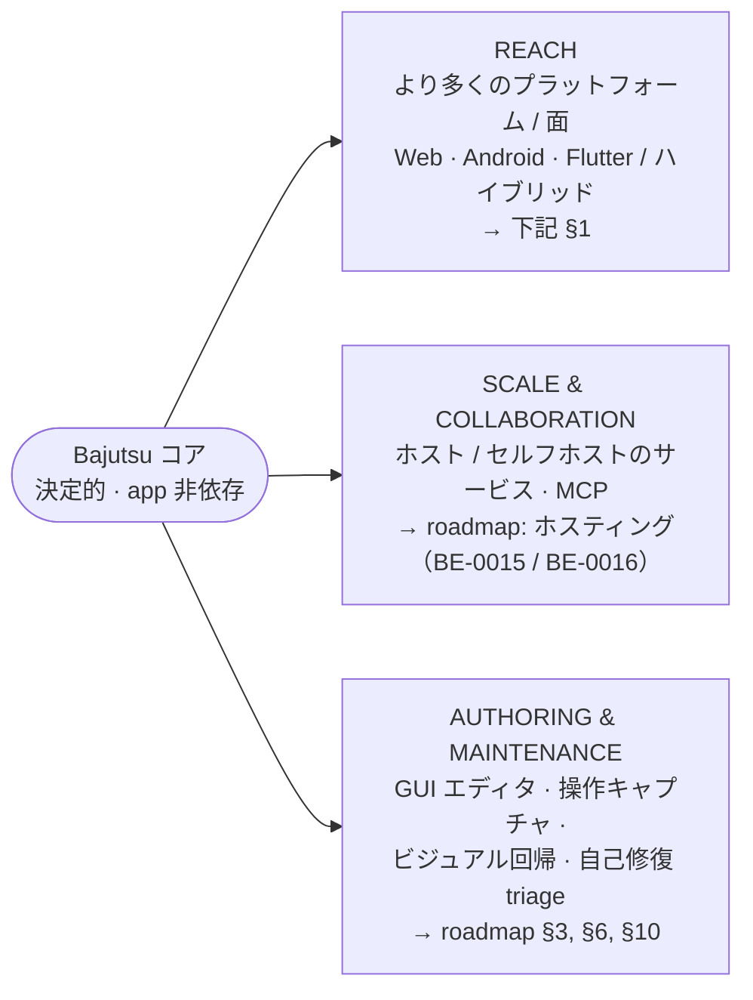

[English](../vision.md) · **日本語**

# 将来構想

> Bajutsu が向かう全体的な方向と、すべての方向が守るべき唯一の制約を扱うページです。個別の
> ロードマップ項目を横断する戦略的な概観であり、各軸がすでにどこまで進んでいるか（計画中のことだけでなく）も
> 扱います。粒度の細かい優先順位付きバックログは [roadmap](../../roadmaps/README-ja.md) に、今日の設計の根拠は
> [`DESIGN.md`](../../DESIGN.md) にあります。ここを読めば各ピースがどう組み合わさるかを掴めます。各計画の詳細は
> リンク先を参照してください。

関連: [concepts](concepts.md) · [drivers](drivers.md) · [selectors](selectors.md) · [roadmap](../../roadmaps/README-ja.md) · [ロードマップダッシュボード → ホスティング](https://bajutsu-e2e.github.io/bajutsu/api/roadmap.html)

---

## 不変条件: 何が決して変わらないか

すべての将来方向は **prime directive**（[CLAUDE.md](../../CLAUDE.md) · [concepts](concepts.md) ·
[DESIGN §2](../../DESIGN.md)）に照らして評価します。これらは以下のどの方向でも固定されたままです。

1. **AI は著者であり失敗時の調査役であって、決して判定者ではありません。** どの将来機能も、Tier-2 の `run`/CI
   （継続的インテグレーション）ゲートに LLM（大規模言語モデル）を入れてはなりません。合否は常に
   機械チェック可能なままにします。
2. **決定性ファースト。** 固定 sleep は使わず、曖昧なセレクタは即失敗させます。どの新しい
   [プラットフォーム](glossary.md#driver-backend-actuator-platform)、ホスト、オーサリングツールもこれを継承します。
   到達範囲や利便性のために譲ることはありません。
3. **app-agnostic / backend-agnostic。** アプリ別、プラットフォーム別の差分は config と、`Driver` や
   環境の継ぎ目の背後に置きます。決定的コアはどこでも同じです。

> どのロードマップ項目でも、判定基準は「AI をゲートの外に保ち、ゲートを決定的に保つか」です。そうでないなら、
> その項目は **Tier 1（オーサリング）か triage（調査）** というゲートの外側に属するか、そもそも Bajutsu に属しません。

---

## 成長の 3 軸

Bajutsu は 3 つの独立した軸に沿って広がります。これらは合成可能で（どれも他をブロックしません）、
それぞれが具体的なページに対応します。

Mermaid ソース

<!-- mermaid-svg: assets/diagrams/vision-three-axes-ja.svg -->

### 1. Reach：より多くのプラットフォームと面

`Driver`、環境、id 規約の継ぎ目は、設定で調整できるだけでなく **丸ごと差し替え**られるよう作ってあり、
その結果 **同じ決定的コアが今日すでに iOS、Android、Web を駆動しています**。各プラットフォームは、
自分の actuator と環境、安定 id 規約だけを足しています。**iOS**（XCUITest）、**web**
（Playwright）、**Android**（adb）backend はいずれも実装済みで end-to-end に検証されています
（[architecture → 実装状況](architecture.md#実装状況) 参照）。残るは **Flutter** です。

**抽象はすでにプラットフォームの境界に沿った形をしています。** プラットフォーム固有なのは 3 つの継ぎ目だけです。
UI を駆動する **actuator**（`drivers/xcuitest.py`、`drivers/adb.py` など）、boot / erase / launch を
担う **environment manager**（iOS の `simctl.py`、Android の対応物）、そして **安定 id の規約**
（iOS の `accessibilityIdentifier`、Android の `resource-id`、web の `data-testid` —
[concepts §4](concepts.md#4-安定セレクタaccessibilityidentifier-優先)）です。それ以外
（シナリオ DSL、セレクタ解決、機械アサーション、orchestrator、証跡、レポータ）は一切プラットフォームを
名指ししません。1 つ追加するとは新しい三点セットを足すことであり、コアを分岐させることではありません。
これは、設計がすでに 2 つ目の iOS actuator（XCUITest）で行った動きと同じです。

セレクタの可搬性が核心です。 シナリオがプラットフォーム間で可搬なのは、そのセレクタが `id` による
場合に限ります。各プラットフォームの `accessibilityIdentifier` に相当するものは、同じ `Selector`
フィールドへ写像します。

| `Selector` フィールド | iOS | Android | Web |
|---|---|---|---|
| `id`（主） | `accessibilityIdentifier` | `resource-id`（Compose: `testTag`） | `data-testid` |
| `label`（補助） | `accessibilityLabel` | `content-desc` / `text` | アクセシブル名 / `aria-label` |
| `traits`（role フィルタ） | UI traits | widget クラス | ARIA `role` |

YAML のセレクタ `{ id: settings.reindex }` はすでにプラットフォーム中立です。異なるのは
*backend がそれを満たすためにアプリ側のどの属性を読むか* だけで、それは Driver の内部に閉じ、
シナリオには出てきません。一点だけ事情があります。プラットフォーム本来の id 構文が SPEC の id を
**そのまま**再現できないことがあります。Android の `android:id`（Views）は `.` も `-` も許さないので、
`stable.refresh` は `stable_refresh` として現れます。`Driver` の側で暗黙に書き換えるのではなく、
シナリオが **id 候補のリスト**（`id: [stable.refresh, stable_refresh]`。OR として照合）で差異を
**明示的に**保ちます。これにより showcase の共有シナリオが両 Android UI toolkit でそのまま走ります
（BE-0221。[scenarios](scenarios.md#プラットフォームをまたぐ-id候補のリストbe-0221) 参照）。

| 段階 | 範囲 | 状態 |
|---|---|---|
| 共有抽象 | プラットフォーム対応の backend レジストリ + `Environment` Protocol | 実装済み（[BE-0042](../../roadmaps/BE-0042-platform-backend-registry/BE-0042-platform-backend-registry-ja.md)、[BE-0009](../../roadmaps/BE-0009-cross-platform-abstractions/BE-0009-cross-platform-abstractions-ja.md)） |
| Web | Playwright。既存の Linux ゲートで動き、Mac もエミュレータも不要 | 実装済み（[BE-0041](../../roadmaps/BE-0041-web-playwright-backend/BE-0041-web-playwright-backend-ja.md)、[BE-0054](../../roadmaps/BE-0054-web-backend-completion/BE-0054-web-backend-completion-ja.md)） |
| Android | adb + UI Automator。座標駆動の backend | 実装済み（[BE-0007](../../roadmaps/BE-0007-android-backend/BE-0007-android-backend-ja.md)、[BE-0208](../../roadmaps/BE-0208-android-emulator-e2e-ci/BE-0208-android-emulator-e2e-ci-ja.md)、[BE-0209](../../roadmaps/BE-0209-android-codegen-emitter/BE-0209-android-codegen-emitter-ja.md)） |
| Flutter / ハイブリッド | 新しい actuator や semantics ブリッジではなく、既存の iOS / Android backend 上の id 規約 | 計画（[BE-0008](../../roadmaps/BE-0008-flutter-support/BE-0008-flutter-support-ja.md)） |

Android のほうが座標駆動の backend に構造的に近いにもかかわらず、Web が先に出荷されました。Web は macOS も
デバイスエミュレータも不要な唯一のプラットフォームで、初日から [`make check`](../../CLAUDE.md) /
[CI](ci.md) ゲートの内側に収まったからです。コアがプラットフォーム中立であることを最小コストで
証明できました。その後 Android が、一般化済みのコアの上で同じ lean / 座標パスを裏づけました。
裏づけは自前のエミュレータ付きゲートによります。プラットフォーム別の詳細は [drivers](drivers.md)、
[ロードマップダッシュボード → プラットフォーム対応](https://bajutsu-e2e.github.io/bajutsu/api/roadmap.html) を参照してください。

### 2. Scale & Collaboration：ローカルツールから共有サービスへ

`bajutsu serve` はローカルで動く単一ユーザのランチャとして始まりましたが、今では **共有サービス**
としても動きます。安価な Linux コントロールプレーン（認証、履歴、キュー、レポートビューア）を、
高価なデバイスワーカープールから切り離し、チームがブラウザから実行とレビューを行えるようにします。

- **[BE-0015（公開 / クラウドホスティング）](../../roadmaps/BE-0015-web-ui-public-hosting/BE-0015-web-ui-public-hosting-ja.md)**
  と **[BE-0016（セルフホスティング）](../../roadmaps/BE-0016-web-ui-self-hosting/BE-0016-web-ui-self-hosting-ja.md)**
  はどちらも実装済みです。control-plane ⇄ Mac ワーカープールの分離、ジョブキュー、複数 org 対応、
  そして公開時に必須となるセキュリティ堅牢化です。自前のハードウェアで今すぐ動かす方法は
  [self-hosting](self-hosting.md) を参照してください。
- **MCP（Model Context Protocol）サーバ**（[BE-0017](../../roadmaps/BE-0017-mcp-server/BE-0017-mcp-server-ja.md)）
  は実装済みです。`run`/`doctor` を MCP ツールとして、run の証跡を MCP リソースとして公開し、
  エージェントが直接 Bajutsu を駆動できます。これは Tier-1 の境界の内側に収まります。エージェントは
  著者と調査役であり、ゲートは決定的なままです。

### 3. Authoring & Maintenance：テストを所有するコストを下げる

シナリオは人間が所有するただの YAML です。この軸は、ゲートを一切緩めずに、書くコストと保つコストを
下げます。

- **GUI（graphical user interface）エディタと非 AI 操作キャプチャ**
  （[BE-0012](../../roadmaps/BE-0012-action-capture-record/BE-0012-action-capture-record-ja.md)、
  [BE-0013](../../roadmaps/BE-0013-scenario-gui-editor/BE-0013-scenario-gui-editor-ja.md)）は
  `bajutsu serve` に実装済みです。シナリオを画面上で編集し、スクリーンショット上でセレクタを選び、
  実際の tap や type を LLM なしでシナリオに取り込めます。
- **ビジュアル回帰アサーション**（[BE-0029](../../roadmaps/BE-0029-visual-regression-assertions/BE-0029-visual-regression-assertions-ja.md)）
  は実装済みです。新しい決定的アサーション種別（ベースライン差分。`approve` が新しいベースラインを
  昇格します）で、AI が判定するのではなく機械でチェックするので、directive に適合します。
- **自己修復 triage**（[BE-0021](../../roadmaps/BE-0021-ai-triage/BE-0021-ai-triage-ja.md)）は
  実装済みです。AI が失敗証跡を読んで **最小差分**を提案し、人間がレビューして `--write` で適用します。
  コミット済みテストを自動で緩めないというガードレールが、これを directive の内側に保ちます。

この軸は今も広がり続けています（例えば
[ロードマップダッシュボード → オーサリング体験](https://bajutsu-e2e.github.io/bajutsu/api/roadmap.html)
にある継続中の作業）が、基盤となる能力（画面上での編集、AI なしのキャプチャ、失敗の自己修復）は
すでに整っています。

---

## 3 軸すべてで固定されるもの

下表のすべては **共有され、決定的で、プラットフォームとホストに中立**であり、Bajutsu が成長しても分岐しません。
3 軸が独立でいられるのはこのためです。各軸は縁を伸ばすだけで、コアには手を付けません。

| 固定コア | どこ |
|---|---|
| シナリオ DSL（domain-specific language）と文法 | [scenarios](scenarios.md) · [dsl-grammar](dsl-grammar.md) |
| セレクタモデルと決定的解決 | [selectors](selectors.md) |
| 機械アサーション（唯一の判定者） | `assertions/` · [concepts](concepts.md) |
| observe → act → verify オーケストレータ | [run-loop](run-loop.md) |
| 証跡サブシステム（capturePolicy / manifest） | [evidence](evidence.md) |
| レポーター（manifest / JUnit / HTML） | [reporting](reporting.md) |
| 設定の階層（`defaults × targets`） | [configuration](configuration.md) |

新しいプラットフォームは `Driver` の継ぎ目の背後に backend を足します。新しいホスティングは `run` を
どこで起動するかを変えるだけで、何をするかは変えません。新しいオーサリングは同じ YAML を生みます。コアは一定のままです。

---

## 各軸の現在地

このページがかつて推奨していた直近の順序（Playwright による Web、MCP サーバ、ビジュアル回帰
アサーション）は、いずれもすでに出荷済みです。scale 軸の公開・セルフホストの両トポロジーも、
authoring 軸の GUI エディタと非 AI キャプチャも同様です。Reach 軸で残っているのは Flutter
（[BE-0008](../../roadmaps/BE-0008-flutter-support/BE-0008-flutter-support-ja.md)）で、他の 2 軸は
1 つの大きな残作業を中心にではなく、少しずつ広がり続けています。実際に次に何をやるかは
[roadmap](../../roadmaps/README-ja.md) が優先順位付きの生きたバックログとして持っています。
本ページが扱うのは根拠と方向性であり、順序付けではありません。ロードマップの項目が出荷されると
[architecture 実装状況](architecture.md#実装状況) へ移ります。3 者は同期させます。
