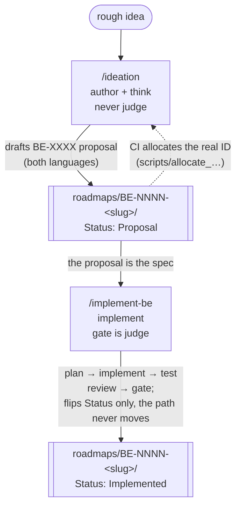

**English** · [日本語](ja/roadmap-workflow.md)

# The roadmap workflow: ideation → implementation

> How a feature travels from a rough idea to shipped, green code: the **`ideation`** skill
> *authors* a roadmap (BE) item, the **`implement-be`** skill *ships* it. The two are deliberate
> counterparts — one fills the [roadmap](../roadmaps/README.md), the other empties it — and together
> they form the loop every non-trivial change to Bajutsu runs through. This page explains that loop;
> the BE-ID mechanics it relies on are specified in [ai-development](ai-development.md#roadmap-items-be-ids-strict).

> **New to contributing? Start with the [contributor workflow tutorial](contributor-workflow-tutorial.md)** —
> a hands-on, step-by-step walkthrough that runs one idea through this whole loop (and shows when to
> fold it into a single PR with `propose-and-build`). This page is the conceptual overview behind it.

Bajutsu's roadmap is not a backlog you skim past — it is the **shared hub** for planning, the same
way a scenario YAML is the shared hub for a test. A feature is first written down as a BE
(*Bajutsu Evolution*) item under [`roadmaps/`](../roadmaps/README.md), discussed and refined as a
proposal, and only then built. Both halves of that journey have a dedicated skill, so the path is
the same whether a human or an agent walks it.

## The cycle

Mermaid source

<!-- mermaid-svg: assets/diagrams/roadmap-workflow-cycle.svg -->

The two skills share the same three **prime directives** ([`CLAUDE.md`](../CLAUDE.md)) — AI authors
and investigates but never judges, determinism first, app-agnostic — because they are two ends of
one pipeline, not two unrelated tools. An idea that cannot be built within the directives is not a
good proposal, so `ideation` reshapes it to fit rather than dropping it, and `implement-be` refuses
to silently work around a directive a half-built item turns out to violate.

## Authoring: the `ideation` skill

Invoke it with `/ideation` when you want to brainstorm what Bajutsu could do next, or turn a rough
idea into a BE item. It is a **sounding board**, not a blank page: every suggestion is anchored to
what is already planned, in progress, or deliberately not adopted.

1. **Ground in the existing roadmap.** It reads [`roadmaps/README.md`](../roadmaps/README.md) (what's
   already out of scope, unsorted ideas awaiting a BE number),
   [`architecture.md#implementation-status`](architecture.md#implementation-status) (so it does not
   "propose" something already shipped), and the BE items near your topic.
2. **Ideate with you.** It offers concrete, bounded ideas and asks the questions that sharpen scope —
   who is it for, which tier, what is the *machine-checkable* outcome — pulling in adjacent items as
   reference points.
3. **Classify each surviving idea** into one of three landings, noting which it chose:
   **overlaps an existing item** (augment that item rather than duplicate it), **novel and scoped**
   (draft a new item), or **still unformed** (a bullet under *Unsorted ideas* in both language
   READMEs, to promote later).
4. **Draft the new item with a placeholder ID.** `make new-roadmap-item SLUG=… TITLE="…"` scaffolds
   `roadmaps/BE-XXXX-<slug>/` with both language files in the canonical Swift-Evolution
   format; the skill fills the `TBD` sections and rewrites the Japanese side into natural Japanese.
   The literal `BE-XXXX` placeholder is intentional — **IDs are never guessed by hand.**
5. **Self-review against the CI review contract.** A fresh subagent — blind to the authoring
   conversation, mirroring the CI reviewer's own cold start — applies the same contract the
   "Claude review" GitHub Actions workflow uses
   ([`.github/claude-review-prompt.md`](../.github/claude-review-prompt.md), BE-0203) to the
   staged diff. Every finding gets fixed, except a false positive or an already-explained
   trade-off (noted and left as-is), or a finding that calls for a genuine design change
   (escalated to you instead of attempted); capped at 3 rounds, escalating to you if it still
   hasn't converged by then.
6. **Verify and (only if you ask) open the PR.** `make check` keeps the gate green even for a
   docs-only change; the PR body notes that CI will allocate the real ID.

The placeholder exists because IDs are permanent and monotonic, and many branches are in flight at once.
Picking a number by hand races — two PRs grab the same one. The
[`roadmap-id`](../.github/workflows/roadmap-id.yml) workflow runs
[`scripts/allocate_roadmap_ids.py`](../scripts/allocate_roadmap_ids.py) at PR time, claims the next
free IDs atomically, renames `BE-XXXX` → `BE-NNNN` everywhere, and pushes the result back to the
branch. Authoring stays conflict-free. The full mechanics are in
[ai-development](ai-development.md#roadmap-items-be-ids-strict).

## Shipping: the `implement-be` skill

Invoke it with `/implement-be BE-0066` (a full ID, a bare number, or a slug fragment) when you want
to turn an existing proposal into shipped code. The proposal's **Detailed design** is the spec; the
deterministic gate (`make check`) is the judge — never an LLM.

1. **Resolve the item** and read **both** language files. Implementing a `Proposal` *accepts* it —
   this PR flips it to `Implemented` — so the skill says so up front. An already-`Implemented` or a
   `Proposal (deferred)` item makes it stop and confirm what you actually want.
2. **Ground in the spec and the code.** It reads the Detailed design and *Alternatives considered*
   (the latter records paths already rejected, often for directive reasons — do not re-propose them),
   opens every file the proposal links, checks [implementation status](architecture.md#implementation-status),
   and verifies any prerequisite BE item is not itself still a proposal.
3. **Set up a focused branch** off the latest `origin/main` (`claude/be-NNNN-<slug>`), staying in
   its lane — only the files this item needs.
4. **Plan, then confirm before writing code.** A whole roadmap item is large and hard to reverse, so
   it gets your go-ahead on a concrete plan first: the files it will touch, the *machine-checkable*
   outcome that proves it works (and where AI is and is not allowed to sit), the tests, the docs that
   must move in both languages, and any tension with the prime directives.
5. **Implement** to the design, matching the codebase grain — strict `mypy`, configured `ruff`,
   condition waits not `sleep`, new knobs in `targets.<name>` config, tests as the regression net,
   and bilingual docs for any documented behavior.
6. **Review and refine the diff** with the built-in [`simplify`](../.claude/skills) and
   [`code-review`](../.claude/skills) skills, and — for a non-trivial change — the **pr-review-toolkit**
   agents. These are *authoring aids*: they advise the author and never judge, so directive #1 holds
   and no LLM touches the `run`/CI path.
7. **Flip the item to Implemented.** In both language files set `Status: Implemented` and add the
   `Implementing PR` line — nothing else to regenerate, since the dashboard reads `Status` straight
   off the item's metadata. The directory never moves (BE-0159): only the `Status` and its dashboard
   bucket change.
8. **Verify — the gate.** `make check` must be green; never push red. If correctness genuinely
   depends on a Simulator/browser run, the [`verify`](../.claude/skills) skill drives it rather than
   claiming it works untested.
9. **PR only when asked.** Push to the branch; the human usually opens the PR. The title carries the
   `[BE-NNNN]` prefix, and the `Implementing PR` line is filled with the real number.

## Why two skills, not one

Keeping authoring and shipping separate mirrors Bajutsu's own core boundary. `ideation` lives in the
**author** role — it thinks, proposes, and reshapes, and its output (a proposal) is never a verdict.
`implement-be` lives in the **builder** role — it turns a spec into code that a deterministic gate
either passes or fails. The same way Bajutsu keeps AI out of the pass/fail judgment of a test run, the
workflow keeps the *open-ended* part of planning (what should we build, is this idea sound) cleanly
apart from the *closed* part of shipping (does this code meet the spec and pass the gate). A proposal
that has been argued into shape is a far better spec than a one-line ticket, and an implementation
bounded by that spec is far easier to review than a freehand change. The loop is the point.

## See also

- [ai-development](ai-development.md) — the parallel-work rules, the gate, and the **strict BE-ID
  lifecycle** (`Status` ⇒ dashboard bucket, flat one-directory layout, permanent IDs) both skills depend on.
- [roadmaps/README](../roadmaps/README.md) — how to add a roadmap item, what's already out of scope,
  and unsorted ideas awaiting a BE number.
- [concepts](concepts.md) — the determinism and AI-boundary principles the prime directives encode.
- [`CLAUDE.md`](../CLAUDE.md) — the working agreement the prime directives come from.
