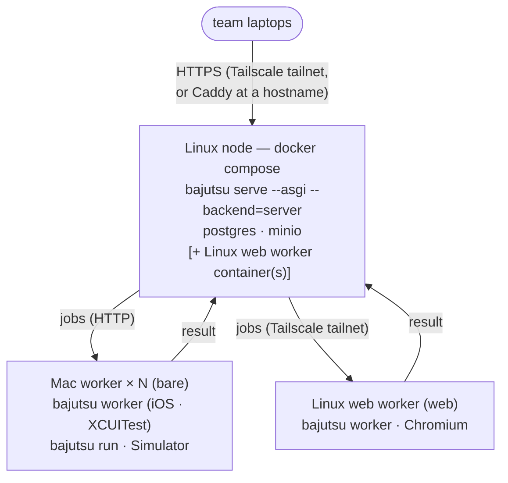

**English** · [日本語](ja/self-hosting.md)

# Self-hosting the web UI

> The self-hosting roadmap
> ([BE-0016](../roadmaps/BE-0016-web-ui-self-hosting/BE-0016-web-ui-self-hosting.md)) covers running
> the bajutsu web UI ([cli](cli.md#serve)) on hardware you own, reachable by your team over a
> private Tailscale network.
> Two tiers are available today, both made safe to expose by
> [BE-0051](../roadmaps/BE-0051-serve-hardening-for-hosting/BE-0051-serve-hardening-for-hosting.md)'s
> auth + input validation:
>
> - **Tier A — a single Mac.** One `bajutsu serve` process, token-authenticated, on one Mac. The
>   rest of this page up to *Tier B* covers it.
> - **Tier B — a self-hosted server backend.** BE-0015's control plane (FastAPI + Postgres +
>   S3-compatible storage + GitHub OAuth + RBAC + quotas) on a Linux node, with Mac workers. It runs
>   single-tenant by default and supports **multiple orgs** when you declare them in config (see
>   *[Tier B — self-hosting the server backend](#tier-b--self-hosting-the-server-backend)*).
>
> The fully managed public cloud offering (a hosted MacStadium worker pool + IaC) remains future
> ([BE-0015](../roadmaps/BE-0015-web-ui-public-hosting/BE-0015-web-ui-public-hosting.md)).

## The macOS constraint

The runner drives an **iOS Simulator**, which needs a **GUI login session** (the Aqua session) —
it will not run from a headless daemon. Every choice below follows from that:

- Run serve as a per-user **`LaunchAgent`** (GUI session), **not** a `LaunchDaemon`.
- **Auto-login** the Mac so a GUI session is recovered after a reboot (FileVault needs one
  interactive login after a cold boot before auto-login proceeds).
- **Disable sleep** so the session stays alive: `sudo pmset -a sleep 0 disablesleep 1`.

These constraints are specific to the **iOS Simulator (XCUITest)** backend. The **web (Playwright)**
backend runs a headless browser and needs none of them — it can serve from any Mac or Linux host
(including the Tier B node), so a web-only deployment skips this section.

## 1. Generate the LaunchAgent

> **First install the backend's runtime dependencies into the venv the agent will use.** The agent
> runs `python -m bajutsu serve` directly, so — unlike `make serve` — it does **not** install them
> on demand. Install the backend's **runtime closure** — the single extra that names everything a run
> reaches, including the `visual` (screenshot) and `schema` (`responseSchema`) assertion deps
> (BE-0173): for the web (Playwright) backend, `uv sync --extra worker-web && playwright install
> chromium`; for the iOS Simulator (XCUITest) backend, `uv sync --extra worker-ios` (the XCUITest
> backend needs no backend pip extra — Xcode supplies `xcodebuild`, and the target supplies its
> prebuilt `xcuitest.testRunner` — so `worker-ios` is just the `visual` + `schema` assertion deps).
> Installing a bare backend extra (e.g. `web`) under-installs — such a run fails lazily at assertion
> time — and skipping the closure entirely makes runs fail at dispatch with `no available actuator`.

`bajutsu serve --emit-launchagent` prints a launchd plist matching the serve flags you pass, then
exits without starting a server. Pick a strong token and write the plist into your LaunchAgents:

```bash
export TOKEN="$(python3 -c 'import secrets; print(secrets.token_urlsafe(32))')"
bajutsu serve --emit-launchagent --config bajutsu.config.yaml --token "$TOKEN" \
  > ~/Library/LaunchAgents/com.bajutsu.serve.plist
chmod 600 ~/Library/LaunchAgents/com.bajutsu.serve.plist   # the plist holds the token
```

The emitted plist:

- runs `python -m bajutsu serve --host 127.0.0.1 --port 8765 --config …` (the same interpreter you
  ran the command with, so it uses your venv) with **`RunAtLoad`** + **`KeepAlive`**;
- puts the token in **`EnvironmentVariables`** (`BAJUTSU_SERVE_TOKEN`) — never in the argv, so it
  isn't visible in `ps`;
- writes stdout/stderr to `~/Library/Logs/bajutsu-serve.{out,err}.log`.

Two settings the emitted plist leaves out, both added under `EnvironmentVariables`:

- **`ANTHROPIC_API_KEY`** — needed for the AI paths (`record`, `--dismiss-alerts`); it isn't baked
  in for you. (For the Bedrock provider, set `BAJUTSU_AI_PROVIDER` / `BAJUTSU_BEDROCK_MODEL` and the
  AWS credentials here instead.)
- **`PATH`** — for the iOS (XCUITest) backend only. launchd starts the agent with a minimal `PATH`,
  and bajutsu locates `xcodebuild` / `xcrun` / `simctl` through `PATH`, so without it a run fails with
  `no available actuator`. Include the Xcode command-line tools' bin, Homebrew's bin, and the venv's
  bin. (The web backend finds Playwright by import, not `PATH`, so it needs no `PATH` entry.)

PlistBuddy makes both edits without hand-editing XML (run from the repo root so `.venv` resolves):

```bash
PLIST=~/Library/LaunchAgents/com.bajutsu.serve.plist
/usr/libexec/PlistBuddy -c "Add :EnvironmentVariables:ANTHROPIC_API_KEY string sk-ant-…" "$PLIST"
/usr/libexec/PlistBuddy -c "Add :EnvironmentVariables:PATH string $(brew --prefix)/bin:/usr/bin:/bin:/usr/sbin:/sbin:$(pwd)/.venv/bin" "$PLIST"
```

serve stays bound to `127.0.0.1`; the next step is what makes it reachable.

## 2. Load it

```bash
launchctl bootstrap gui/$(id -u) ~/Library/LaunchAgents/com.bajutsu.serve.plist
launchctl print gui/$(id -u)/com.bajutsu.serve        # verify it's loaded
```

To reload after editing the plist: `launchctl bootout gui/$(id -u)/com.bajutsu.serve` then
bootstrap again.

## 3. Expose it over Tailscale (recommended)

serve stays on `127.0.0.1`; **Tailscale** publishes it inside your tailnet only — identity-based
access plus automatic TLS, no public surface:

```bash
tailscale serve --bg 8765    # → https://<machine>.<tailnet>.ts.net (reachable only in the tailnet)
```

Teammates open that URL; the UI prompts for the token on first load (the browser then carries a
session cookie). API clients send `Authorization: Bearer $TOKEN`.

> **Do not bind `0.0.0.0` to the public internet.** Even with a token, the safe default is a
> private tailnet. serve refuses a non-loopback `--host` without a token, but a public bind widens
> the surface needlessly. If you need a real internal hostname, front serve with **Caddy** for TLS
> (+ basic auth) and keep it off the open internet.

## Security recap (BE-0051)

A self-hosted serve relies on the hardening from
[BE-0051](../roadmaps/BE-0051-serve-hardening-for-hosting/BE-0051-serve-hardening-for-hosting.md):
token auth on every request, `/api/run` and `/api/record` confined to the app's scenarios dir with
validated `backend`/`udid`, a CSRF Origin check plus security headers, and a concurrency cap on run
dispatch. Keep the token secret, keep the Mac on a tailnet, and keep the OS patched.

The CSRF/Origin check and a **`Host`-header allowlist** run **unconditionally**
([BE-0121](../roadmaps/BE-0121-serve-csrf-host-allowlist/BE-0121-serve-csrf-host-allowlist.md)) —
not only when a token is set. Running these checks unconditionally matters most for the common
`make serve` default (loopback, no token): a cross-origin `POST` from a page open in another tab is blocked, and a request whose `Host`
does not name a bound interface is refused, so a rebound hostname can't reach a loopback endpoint
such as `GET /api/apikey`. A non-browser client (no `Origin` header) is unaffected. The
`Host` allowlist is derived from the interface `serve` binds — the loopback names for a loopback
bind, that host otherwise; a wildcard bind (`0.0.0.0` / `::`), whose reachable names can't be
enumerated, disables the `Host` check and leaves CSRF as the cross-origin guard.

## Uploaded-config command execution (BE-0090)

An uploaded `.zip` bundle can carry a config whose `launchServer.cmd` (and, once wired,
`mockServer.cmd`) names a shell command to bring up the app under test. That command is **untrusted
input**, so `serve` never runs it on the bare host. The `--upload-exec` option (or the
`BAJUTSU_UPLOAD_EXEC` environment variable, for the hosted backend) chooses what happens when an
*uploaded* bundle's run needs that command — it applies only to upload-sourced configs; a local or
Git-sourced config is operator-trusted and unaffected:

- **`sandbox`** (the default) — run the command inside a throwaway **Docker** container, never on the
  `serve` host. The bundle declares its runtime with **exactly one** of `dockerImage` (a published
  base image, e.g. `node:20-slim`) or `dockerfile` (a bundle-relative path that `serve` builds with
  `docker build`), plus a `port` (the in-container listen port). The container is hardened —
  `--rm`, all capabilities dropped, no new privileges, a read-only root filesystem with a `tmpfs`
  scratch, a non-root user, CPU/memory/pid caps, and only its one port published to a **loopback**
  host port — and torn down after the run. Docker must be installed on the `serve` host.
- **`reuse`** — never run the uploaded command; only probe an operator-provisioned server already
  answering at `baseUrl`. If nothing answers, the run fails loud rather than starting anything.
- **`deny`** — refuse the uploaded command outright; like `reuse`, an externally-answering server is
  accepted, otherwise the run fails loud.

No mode ever runs an uploaded command on the bare host, and none silently falls back to doing so — a
blocked or misconfigured `launchServer` fails with a clear error, never a flaky-looking run. The
decision (denied / reused / sandboxed, and the image when sandboxed) is recorded in the run's
`manifest.json` provenance, so "what did this run execute, and what was suppressed?" stays answerable.

## Remote-config command execution (BE-0121)

A config bound at startup with `--config` (a local path or a `github:` spec you typed yourself) is
**operator-trusted**: `serve` runs its `build:` command normally. A Git config bound **later,
through the UI's "from Git" picker** (`POST /api/config` with a `git` spec), is a different trust
level — a cross-origin request could have bound it — so it is treated like an uploaded bundle: its
`build:` command is **never run on the host by default**. Pass `--allow-remote-build` (or set
`BAJUTSU_ALLOW_REMOTE_BUILD=1`) to opt in when you deliberately drive runs off a UI-bound Git config
whose build you trust. Without the opt-in the run proceeds with the build suppressed, exactly as an
uploaded bundle's build is suppressed — no silent host-side command execution from a config that
arrived over the network.

## Private-repository access for the Git config source (BE-0224)

When `serve` (or the CLI) reads its config from a **private** GitHub repository — a `github:` spec,
[BE-0063](../roadmaps/BE-0063-git-config-source/BE-0063-git-config-source.md) — it needs a credential
that grants read access. A public repository needs none. The credential is resolved **per fetch** in
this order (so rotating it takes effect without a restart):

1. a configured **GitHub App installation** (recommended for an unattended host — see below);
2. a credential entered via the web UI's "From a Git repository" dialog (held in `BAJUTSU_GIT_CONFIG_TOKEN` — see below);
3. `GITHUB_TOKEN` / `GH_TOKEN` from the environment;
4. `gh auth token`, for a developer with an interactive `gh` session on their own machine;
5. otherwise anonymous (public repositories only).

**Grant least privilege.** A classic personal access token (PAT) with the `repo` scope grants
read/write to *every* private repository the person can see — far more than "read one test repo".
Prefer a **fine-grained** PAT (or a GitHub App installation) scoped to only the target repositories
with the single **Contents: read** permission.

### Supplying a token to an unattended daemon

A launchd / systemd `serve` has no interactive `gh` session, so inject the token at the daemon level.
For the LaunchAgent in [step 1](#1-generate-the-launchagent), add it to the plist's
`EnvironmentVariables`; on Linux/systemd use the unit's `Environment=` (or an `EnvironmentFile=` that
is not world-readable). A PAT is tied to a *person*, though: it carries that person's access and stops
working when they rotate it or leave. A service that reads private repos unattended should
authenticate **as itself** — a GitHub App.

### GitHub App (recommended for a service)

A GitHub App installation token is short-lived, limited to the installation's repositories, and tied
to the service rather than a person. Create an App with **Contents: read**, install it on the target
repositories, then supply:

```bash
export BAJUTSU_GITHUB_APP_ID=123456
export BAJUTSU_GITHUB_APP_PRIVATE_KEY_FILE=/etc/bajutsu/app.pem   # or BAJUTSU_GITHUB_APP_PRIVATE_KEY inline
# optional: pin the installation; otherwise it is resolved from the repository being fetched
export BAJUTSU_GITHUB_APP_INSTALLATION_ID=7654321
```

The App path signs a short-lived RS256 JSON Web Token (JWT) with the private key and exchanges it for
an installation token. It uses `cryptography`, installed on demand with the `githubapp` extra
(`uv sync --extra githubapp`); a deployment that authenticates with a PAT never loads it.

Because the App credentials come from the process environment, a configured App applies to **every**
request and **takes precedence** over any PAT — including one entered in the web UI, and, on a hosted
multi-organization deployment, over every organization's own stored credential. Configure one or the
other, not both, unless you intend the App identity to authenticate all fetches.

### Entering a credential from the web UI

The "Open config" dialog's **"From a Git repository"** source has a credential field. Enter a
fine-grained PAT or App token and it is stored **write-once** through serve's secret store — the same
store as the [Claude API key](#operator-secrets-the-claude-api-key): masked, never echoed back. On a
**local** serve it is held for the lifetime of the process in a bajutsu-owned variable
(`BAJUTSU_GIT_CONFIG_TOKEN`) that the fetch reads ahead of an ambient `GITHUB_TOKEN` — deliberately
*not* `GITHUB_TOKEN` itself, so entering or clearing a UI credential never disturbs a token you
exported at launch. On the **hosted** backend it is encrypted at rest and scoped **per organization**,
so each tenant's stored credential is its own; wiring that per-organization value into the hosted
control plane's in-process bind is a follow-up, so a hosted private bind resolves through the
process-global App / env credential today. When a bind fails for
lack of access, the dialog shows the diagnostic inline — the message names the real cause (a rate
limit, an organization single sign-on (SSO) authorization gap, a rejected token, or "provide a
credential with Contents: read for `<owner>/<repo>`") rather than a bare 404.

## Tier B — self-hosting the server backend

Tier A is one process on one Mac. **Tier B** runs BE-0015's **server backend** — the FastAPI control
plane with Postgres, S3-compatible storage (MinIO), GitHub OAuth, RBAC, and a per-user quota — on a
Linux node, with one or more Macs as workers. It runs **single-tenant** by default (every
user in one default org) and supports **multiple orgs** once you declare them in config — see
*[Multiple orgs](#multiple-orgs)* below. The ready-to-run stack is in
[`deploy/self-host/`](../deploy/self-host/) (compose + Dockerfile + `.env.example`).


<details>
<summary>Mermaid source</summary>

<!-- mermaid-svg: assets/diagrams/self-hosting-tier-b-topology.svg -->


</details>

The Linux control plane is cheap; the **Mac workers** carry the Simulator runs and are the scarce
part. The fleet is **heterogeneous by backend**: a Mac iOS worker runs **bare metal** because it needs
the Aqua GUI session for the iOS Simulator (exactly like Tier A), while a **Linux web (Playwright)
worker runs headless in a container** (BE-0173) — the web backend has no GUI-session constraint. Both
lease from the same control plane over HTTP; the web-worker container needs **no cloud SDK or
object-store secrets** (BE-0160), only the control-plane URL and a token. Running a mixed fleet is
optional — an iOS-only deploy is the default and unchanged; add web workers when you host web runs
([§ Add a Linux web worker](#5-add-a-linux-web-worker-container-optional)).

**Config sources are deployment-aware (BE-0108).** The "Open config" dialog binds the active config
from up to three sources: a **Git repository**, an **uploaded `.zip` bundle**, and a **file browser
over the serve host's `--root`**. On the server backend (this tier) the file browser is dropped —
both hidden in the UI and refused server-side (`/api/fs` and the path branch of `POST /api/config`
return `403`) — leaving only Git and upload. A hosted user has no filesystem relationship to the
shared worker, so browsing the operator's `--root` could bind nothing they own; removing it also
avoids handing every logged-in user a directory listing of that tree. The local backend (Tier A, a
self-hosted single Mac) keeps all three: there the filesystem is the operator's own.

### Local vs. hosted, across config, scenario, and the app binary

The walkthrough above is organized by *how you deploy*; this box collects *what changes for each kind
of state `serve` manages*, so the tier-by-tier detail is easier to place. "Local" below covers both
Tier A and a bare `make serve` on a laptop — both run with `hosted: false`; only Tier B's server
backend sets `hosted: true`.

| State | Local (`hosted: false` — Tier A, or a bare `make serve`) | Hosted (`hosted: true` — Tier B server backend) |
|---|---|---|
| **Config** | File browser + Git + upload; own filesystem, paths unconfined | Git + upload only; file browser disabled, 403 (BE-0108) |
| **Scenario and run artifacts** | `scenarios/` and `runs/` on disk; soft-delete moves to `runs/.trash/` | Object store (S3/GCS) + Postgres; soft-delete sets `deleted_at` (BE-0239) |
| **App binary** | `appPath` on disk; build only when missing | Worker builds from checkout/bundle; remote build gated (BE-0121) |

- **Config.** Both sides bind from up to three sources, but the file browser disappears the moment
  `hosted` is true (just above). Path confinement follows the *source*, not the tier: a local-file
  config resolves against its own directory and is unconfined (it may point at a sibling), while a Git-
  or upload-sourced config is untrusted and its `scenarios` / `baselines` / `appPath` are confined to
  the checkout or bundle root regardless of which tier bound it
  ([configuration.md → Config from a Git repository](configuration.md#config-from-a-git-repository-be-0063)).
  Hosted mode never offers the local-file source, so every hosted config ends up confined — a side
  effect of dropping the file browser, not a separate rule.
- **Scenario and run artifacts.** Locally, the scenario store and the run history read and write a
  plain directory tree (`scenarios/`, `runs/`); a soft-deleted run moves to `runs/.trash/`. Hosted, both
  live in the control plane's object store (`BAJUTSU_SERVER_STORE`, S3-compatible or GCS) plus a
  Postgres row per run, so a soft-delete sets `deleted_at` instead of moving bytes on disk (see
  *Deleting runs, and how long the trash is kept*, below).
- **App binary.** Neither side has a generic binary-upload endpoint: both resolve `appPath` from the
  bound config and, if it's missing, run the config's `build:` command. Hosted, a Mac worker builds
  from the same checkout or bundle materials the control plane resolved for the job, exchanging bytes
  over presigned URLs rather than a shared filesystem (BE-0160, above). The remote-build gate is
  orthogonal to the tier: any config bound later through the UI's "from Git" picker has its `build:`
  suppressed by default, whether the UI sits on a laptop's Tier A or Tier B's control plane — only a
  config supplied at startup is operator-trusted (see *Remote-config command execution*, above). The
  web (Playwright) backend has no binary concept on either side; the browser engine installs on demand
  instead.

### 1. Bring up the control plane

```bash
cd deploy/self-host
cp .env.example .env            # set BAJUTSU_SERVE_TOKEN, POSTGRES_PASSWORD, AWS_* (MinIO), bucket
mkdir -p config && cp /path/to/bajutsu.config.yaml config/   # the app/project list to expose
docker compose up -d            # postgres + minio + migrate (alembic upgrade head) + bajutsu
```

`migrate` runs the Alembic migrations to head before `bajutsu` starts, and `minio-init` creates the
bucket. The control plane then listens on `:8765`.

To have the web UI's version badge (BE-0272) show which commit this image is running, pass that
commit at build time (BE-0277) — the image ships no `.git` to read, so the badge falls back to this
embedded value:

```bash
GIT_COMMIT=$(git rev-parse HEAD) docker compose build bajutsu   # then `docker compose up -d`
```

`docker-compose.yml` resolves `GIT_COMMIT` from the invoking shell (or a `.env` entry) into the
`bajutsu` service's build arg. Leave it unset and the badge simply shows the version alone, as
before. To build the control-plane image directly instead of through compose:

```bash
docker build --build-arg GIT_COMMIT=$(git rev-parse HEAD) -f deploy/self-host/Dockerfile .
```

Published ports bind to `BIND_ADDR` (default `127.0.0.1`). For a Mac worker to reach MinIO from
another host, set `BIND_ADDR` in `.env` to the node's **tailnet IP** — never `0.0.0.0` on a host
with a public interface, since a public bind would expose the artifacts bucket.

The artifact/scenario/baseline store — and, since BE-0243, uploaded zip bundles too — is named by
one URI, `BAJUTSU_SERVER_STORE` (BE-0204) — `s3://bucket/prefix` (S3-compatible; MinIO, as shipped
in this compose) or
`gs://bucket/prefix` for a Google Cloud Storage bucket instead. Already running the rest of your
stack on Google Cloud? Drop the `minio` / `minio-init` services from `docker-compose.yml`, point
`BAJUTSU_SERVER_STORE` at your GCS bucket, and add the `gcs` extra to the control plane image's
install line in [`deploy/self-host/Dockerfile`](../deploy/self-host/Dockerfile)
(`.[server,worker,db,oauth,gcs]`) — no S3-compatible bucket needed at all.

Upgrading from a deployment that set the older `BAJUTSU_S3_BUCKET` / `BAJUTSU_S3_PREFIX` pair? Fold
the prefix into the URI's path — `BAJUTSU_S3_BUCKET=bajutsu` + `BAJUTSU_S3_PREFIX=tenant/` becomes
`BAJUTSU_SERVER_STORE=s3://bajutsu/tenant/`; otherwise existing keys under that prefix stop resolving
once the prefix is dropped.

### 2. Add GitHub OAuth (optional)

The shared token (`BAJUTSU_SERVE_TOKEN`) alone is enough for a couple of operators. For per-user
browser login, create a GitHub OAuth app (callback `https://<your-host>/api/oauth/callback`) and set
in `.env`: `BAJUTSU_OAUTH_GITHUB_CLIENT_ID` / `_SECRET` / `_REDIRECT_URI`, plus the allowlist
`BAJUTSU_OAUTH_ALLOWED_USERS` (and optionally `BAJUTSU_OAUTH_ADMINS` / `BAJUTSU_OAUTH_VIEWERS`).
Allowlisted users are **editors** by default (they can run); admins also change server settings
(config / API key / provider); viewers are read-only. The token stays the operator/CI credential
(full access); OAuth is the team's per-user login.

Login always requests the `read:org` scope so a user can be mapped to an org by GitHub org
membership (config `githubOrgs`); the consent screen therefore mentions organization access either way. A
single-tenant deploy (no `orgs:` block) just ignores the org info.

### Operator secrets (the Claude API key)

The **API key** an admin sets through the settings panel is an *operator secret*, and on the hosted
control plane it is **write-once and encrypted at rest**
([BE-0136](../roadmaps/BE-0136-serve-write-once-secrets/BE-0136-serve-write-once-secrets.md)). No
endpoint ever returns the plaintext again — for any role, admin included — only a masked preview; to
rotate a key an admin overwrites it, never reading the old one back. The value is stored in the
database's `secrets` table encrypted with authenticated encryption (Fernet) and scoped per org, so it
survives a restart and is shared across control-plane replicas.

That encryption needs a master key, provisioned outside the database like `BAJUTSU_DATABASE_URL`:

```bash
# generate once, then keep it in .env / your platform's own secret store
python3 -c 'from cryptography.fernet import Fernet; print(Fernet.generate_key().decode())'
export BAJUTSU_SECRETS_KEY=…
```

A database-backed control plane **requires** `BAJUTSU_SECRETS_KEY` and refuses to start without one,
rather than silently degrading to holding the secret only in process memory. Without a database,
secrets stay in the serve process's environment (the local-backend shape) and no key is needed. Treat
the key like the database password: losing it makes the stored secrets unrecoverable, and a rotated
key cannot decrypt values written under the old one, so re-enter each secret after rotating.

The settings panel holds a second write-once operator secret the same way: the **Claude Code OAuth
token** (`CLAUDE_CODE_OAUTH_TOKEN`), for a deployment that runs the `claude-code` provider on a
browser-less host and so can't complete `claude setup-token`'s interactive sign-in
([BE-0215](../roadmaps/BE-0215-claude-code-oauth-token-credential/BE-0215-claude-code-oauth-token-credential.md)).
It is stored, masked, and rotated exactly like the API key above.

The same store also holds a scenario's **own** declared secrets
([BE-0274](../roadmaps/BE-0274-serve-scenario-secrets/BE-0274-serve-scenario-secrets.md)) — the
`secrets:` names a config lists for `${secrets.X}`. Previously the only way to supply these was the
`.env` the process inherited; now an admin sets each one from the settings panel's **Scenario
secrets** section, and on the hosted control plane it lands in the same per-org encrypted `secrets`
table (reusing `BAJUTSU_SECRETS_KEY`, already required above — no new key), write-once and masked
like the operator credentials. What is **not yet wired** on a self-hosted deployment is *consuming* a
stored scenario secret: a run executes on a remote Mac worker, not in the control-plane process, so
threading the stored value into the worker's spawned `bajutsu run` (and the trust-boundary decision
of whether the plaintext rides the job queue or the worker decrypts it itself) is a tracked
follow-up — the same gap [BE-0224](../roadmaps/BE-0224-github-private-repo-config-auth/BE-0224-github-private-repo-config-auth.md)
leaves for the Git config-source token. Storing works on both backends today; on a **local** `serve`
the value is held in the process environment and a spawned run inherits it directly.

### 3. Run a Mac worker

On each Mac (the same Aqua-session setup as Tier A — auto-login, `caffeinate`/`pmset`), install the
iOS worker's runtime closure `bajutsu[worker-ios]` (the iOS (XCUITest) worker needs no backend pip
extra, so this is just the `visual` / `schema` assertion deps a run reaches, BE-0173) and point it at
the control plane over the tailnet:

```bash
export BAJUTSU_SERVER_URL=http://<linux-node>.<tailnet>.ts.net:8765
export BAJUTSU_TOKEN=…         # the same operator token the control plane uses
export ANTHROPIC_API_KEY=…     # only if scenarios use the AI paths (record / --dismiss-alerts)
bajutsu worker
```

The worker holds **no object-store credentials** (BE-0160): no `BAJUTSU_SERVER_STORE` /
`BAJUTSU_S3_ENDPOINT` / `AWS_*`, and no cloud SDK. It downloads the run's baselines, uploads the
finished `runs/<id>/` tree, and persists a `record` job's authored scenario over **presigned URLs
the control plane signs** — the control plane is the only place the object store's credentials live.
The bytes still flow worker→storage directly (the signed URL points at MinIO), so the worker needs
network reachability to the object store, just not its secrets.

Wrap it in a `LaunchAgent` (as in Tier A) so it survives reboots. The worker polls the control
plane's `/api/worker/lease` endpoint over HTTP (no Redis needed), runs each job on a fresh
Simulator, uploads the `runs/<id>/` tree (including `console.log`), and posts the result back to
`/api/worker/result`. The control plane records the finished run into Postgres — the worker needs no
database access.

### 4. Expose it

Front the control plane like Tier A: `tailscale serve --bg 8765` (tailnet-only, recommended), or
Caddy for a real hostname (`docker compose --profile caddy up -d`, with `BAJUTSU_PUBLIC_HOST` set).
The worker reaches the control plane (`:8765`) and MinIO (`:9000`) over the tailnet, so keep the
node on the private tailnet.

### 5. Add a Linux web worker container (optional)

The web (Playwright) backend runs headless on Linux, so its worker is a **container** rather than a
bare-metal Mac (BE-0173). The compose stack ships an optional `worker-web` service, **off by default**
(behind a profile), so an iOS-only deploy is unchanged. Enable it — on the Linux node or any other
Docker host that can reach the control plane — with:

```bash
cd deploy/self-host
# BAJUTSU_SERVE_TOKEN must be set in .env — the web worker reuses it as its operator token
docker compose --profile web-worker up -d --build
```

The service builds [`worker-web.Dockerfile`](../deploy/self-host/worker-web.Dockerfile), a multi-stage
image that installs only the worker's runtime closure (`bajutsu[worker-web]` = the `web` backend +
`visual` + `schema`) and the headless Chromium the browser needs. It deliberately omits the control
plane's stack (`server` / `db` / `oauth`), the cloud SDKs, and the AI SDK — the worker talks to the
control plane and object store over plain HTTP and, per BE-0160, holds **no object-store credentials**
(it needs only `BAJUTSU_SERVER_URL` and `BAJUTSU_TOKEN`). To keep the image small it installs
Chromium's **headless shell** (`playwright install --with-deps --only-shell chromium`) instead of the
full headed build: the shell is what Playwright already uses for headless runs, so nothing in a run
changes, and it saves tens of MB of browser plus a lighter system-library set. A Linux worker is
always headless, so the headed-only features the shell drops don't apply. The image installs only the
**Chromium** shell, so it serves Chromium web runs (the default engine); a scenario pinned to Firefox
or WebKit (BE-0076) needs a worker with those browsers, not this slim image.

To run a web worker outside compose (e.g. a separate Linux box), build and run the image directly:

```bash
docker build -f deploy/self-host/worker-web.Dockerfile -t bajutsu-worker-web .
docker run -d --rm \
  -e BAJUTSU_SERVER_URL=http://<linux-node>.<tailnet>.ts.net:8765 \
  -e BAJUTSU_TOKEN=… \
  bajutsu-worker-web
```

A web worker leases only **web** jobs and a Mac iOS worker only **iOS** jobs — the pool routes by
capability, so a mixed-backend fleet is safe (see [capability-routed
queues](#capability-routed-queues-be-0166) below).

### Capability-routed queues (BE-0166)

A real Mac pool is rarely uniform: machines carry different iOS runtimes, some are set up for iPad
and others for iPhone, and a web worker runs a different backend entirely. With one undifferentiated
queue any worker could lease any job, so a job needing iOS 18 could land on an iOS-17 worker and fail
— not for a real defect, but because it was routed to the wrong machine. **Capability routing** stops
that: a job is only ever leased by a worker that can actually run it.

Each worker advertises a set of **capability tokens** when it polls for work, and a job carries the
set it **requires**; the control plane leases a job to a worker only when the worker advertises every
token the job requires. Routing decides *which* idle worker picks a job up — it never changes the
deterministic `run` verdict.

- **A worker's advertised set** comes from its `--platform` (the backend axis: `platform:ios` for a
  Mac iOS worker, `platform:web` for the Playwright container), plus — for an iOS worker — the
  installed Simulator inventory (an `iosNN` token per runtime, and `iphone` / `ipad` device classes).
  Pin extra tokens with `--capabilities` or `$BAJUTSU_WORKER_CAPABILITIES` (comma/space separated),
  e.g. `bajutsu worker --platform ios --capabilities ios18,ipad`. The web-worker container bakes in
  `--platform web`, so it advertises `web` and needs no flag.
- **A job's required set** is the target's resolved platform axis plus its `requires:` config list
  ([configuration](configuration.md)) — set `targets.<name>.requires: [ios18, ipad]` (or team-wide
  `defaults.requires`) to pin a runtime or device class. A target with no `requires` routes on its
  platform axis alone.
- **An unroutable job** — one whose required capabilities no live worker advertises — stays queued
  rather than being leased to an incompatible worker or dropped, and is surfaced by the
  `bajutsu_unroutable_jobs` metric (below) so the operator knows to add a worker with the missing
  capability. A homogeneous pool is unaffected: every worker advertises the same axis, so every job
  routes as before.

> [!NOTE]
> **Upgrade the workers alongside or before the control plane.** Every dispatched job now carries at
> least its `platform:*` requirement, and a worker on a pre-capability-routing build sends no
> advertised set — so it advertises nothing and can lease no real job. It fails safe (it never
> mis-routes), but an old worker left running against an upgraded control plane silently stops
> leasing, showing up only as a rising `bajutsu_unroutable_jobs`. Roll the worker binaries first (or
> together), not after.

### Evidence upload to object storage (optional, BE-0110)

The worker upload above writes each run tree to the **artifact store** the control plane serves reports
from. Separately, you can archive every run's **evidence** to a lifecycle-managed bucket — retain
main-branch evidence for audit, expire feature-branch evidence after a few days — by setting one URI
on the control plane:

```bash
# on the control plane (docker compose env, or the serve process)
export BAJUTSU_EVIDENCE_STORE=s3://audit-bucket/evidence/   # or gs://…; --evidence-store also works
```

The evidence store is a **second, independent destination** from the artifact store: it can be a
separate account or a stricter-permissioned, lifecycle-managed bucket. Both are credential-free for
the worker — the control plane holds each bucket's credentials and signs a **presigned PUT URL per
file**, and the worker uploads over plain HTTP (BE-0110 for evidence, BE-0160 for the artifact
store). Install the `s3` or `gcs` extra **on the control plane** (`uv sync --extra s3` or
`--extra gcs`); the worker needs neither.

A CI job picks the per-run path — and thus the lifecycle policy — by passing `evidence_prefix` when it
starts a run:

```bash
curl -X POST "$SERVER/api/run" -H "Authorization: Bearer $TOKEN" \
  -d '{"scenario": "smoke.yaml", "target": "demo", "evidence_prefix": "main/abc1234/"}'
```

The control plane validates `evidence_prefix` as a safe relative segment and prepends its own bucket +
base prefix, so the final key is `evidence/main/abc1234/<runId>/…` — the run id is always in the path,
so runs never collide, and a caller can't escape the base prefix. The upload runs **after** the verdict,
so a failure is logged and never changes pass/fail. When `BAJUTSU_EVIDENCE_STORE` is unset the worker
still asks and simply uploads nothing.

### Multiple orgs

To host more than one team on one backend, declare orgs in the mounted config — each with its member
GitHub logins and/or GitHub orgs, plus the targets it owns (see
[configuration](configuration.md#orgs-the-multi-tenant-server-backend)):

```yaml
orgs:
  acme:
    members: [alice, bob]
    githubOrgs: [acme-gh]    # everyone in this GitHub org (login requests the read:org scope)
    targets: [demo, checkout]
  globex:
    members: [carol]
    targets: [other]
```

Each user is then scoped to their org: they see only that org's targets, a cross-org run/scenario/
artifact reads as not-found or returns 403, and each org's artifacts/scenarios/baselines live under
its own object-store prefix. With no `orgs:` block the backend stays single-tenant (one default org),
and the shared token plus the GitHub allowlist are the access boundary. The fully managed public
cloud offering (a hosted Mac worker pool + IaC) is still future work in BE-0015.

**Keeping the Mac pool fair across orgs.** Set `BAJUTSU_MAX_CONCURRENT_PER_ORG` to cap how many runs
one org may have in flight at once, so a busy org can't monopolize the scarce devices even when its
users each stay under their own `BAJUTSU_MAX_CONCURRENT_PER_USER`. Both default to unlimited (`0`),
and both sit under the global `--max-concurrent-runs`; an over-cap request is rejected (HTTP 429)
rather than queued. (Fair *scheduling* across orgs — holding the rejected work in a per-org queue and
dispatching it round-robin — is still future work; today the cap rejects.)

**Deleting runs, and how long the trash is kept.** A run (and its report) can be deleted through the
API (BE-0239): `DELETE /api/runs/{id}` soft-deletes it — the run drops out of the history list but is
moved to a trash and stays restorable via `POST /api/runs/{id}/restore`; `DELETE /api/runs/{id}?purge=true`
skips the trash and removes the bytes immediately. Soft-delete and restore are **editor** actions; the
immediate purge is **admin**. `POST /api/runs/bulk-delete` (body `{"ids": [...], "purge": <bool>}`) does
many at once. A soft-deleted run is purged for good once it has been in the trash longer than the
retention window, checked opportunistically on the next history read (there is no background job).

| Variable | Default | Meaning |
|---|---|---|
| `BAJUTSU_RUN_RETENTION_DAYS` | `30` | Days a soft-deleted run stays in the trash before it is permanently purged. `0` (or less) disables the automatic purge — the trash is then kept until an explicit `?purge=true`. |

(The Web UI surface for this — a per-row delete affordance and a Trash view — is still to come; the API above is live today.)

## Operational logging

The hosted serve emits its own diagnostic trace — **structured JSON, written to stdout, with
secrets redacted** — so you can follow one user action across the control plane and its workers.
This trace is separate from the three log surfaces you already have: the test subject's **evidence**, the
live **run output** stream, and the **audit log** of who-did-what. Aggregating these lines (shipping
stdout to your log stack) is the deployment's job — the tool only produces them.

Two environment variables select the format and verbosity (read once at startup):

| Variable | Default | Meaning |
|---|---|---|
| `BAJUTSU_LOG_FORMAT` | `json` | `json` for the structured serve channel, or `text` for a human-readable line. |
| `BAJUTSU_LOG_LEVEL` | `INFO` | Standard level name (`DEBUG` / `INFO` / `WARNING` / `ERROR` / `CRITICAL`). |

The deterministic `run` / CI path is unaffected: it never configures this channel, so it stays
quiet and stdlib-only.

**Correlation.** Each JSON line carries the ids that let you trace one action end to end —
`request_id` minted at the request boundary, and `job_id` / `org` / `actor` / `run_id` bound on the
worker — so a control-plane request and the worker run it triggered share the same id *values*
across processes. A line looks like:

```json
{"ts": "2026-06-28T12:00:00+00:00", "level": "INFO", "logger": "bajutsu.serve.operations",
 "event": "run.dispatched", "msg": "job dispatched", "request_id": "…", "org": "acme",
 "job_id": "…"}
```

The `event` field names a stable event (`run.dispatched`, `quota.rejected`, `worker.job.started`,
`worker.job.finished`, `artifact.upload.failed`, …) so you can grep and alert on it.

**Redaction is structural.** A single filter sits at the root logger, so *every* line — including
ones from third-party libraries — is scrubbed before it is written; correctness does not depend on
each call site remembering to mask. It masks known secret **values** (the operator token, the OAuth
client secret, `ANTHROPIC_API_KEY`, and a run's resolved `${secrets.X}` while that run is in flight)
and sensitive field **names** (`authorization`, `token`, `secret`, `password`, `cookie`, `api_key`),
replacing them with `[REDACTED]`.

## Metrics and observability (BE-0169)

Structured logs (above) are events; **metrics** are the time series that show whether the pool is
saturated, which org is consuming it, whether runs are taking longer than usual, and whether a worker
is alive. The control plane exposes them in Prometheus text format at **`GET /metrics`**, derived from
state it already tracks (the jobs table and lease/heartbeat records) — so it adds no bookkeeping:

| Metric | Type | Meaning |
|---|---|---|
| `bajutsu_in_flight_jobs{org}` | gauge | Jobs the control plane is running itself, by org (local serve). |
| `bajutsu_queue_depth{org}` | gauge | Jobs waiting in the queue, by org (server backend). |
| `bajutsu_leased_jobs{org}` | gauge | Jobs leased to a worker — in flight — by org (server backend). |
| `bajutsu_worker_heartbeat_age_seconds{worker}` | gauge | Seconds since a worker's last heartbeat; rising past the lease timeout means a dead worker. |
| `bajutsu_oldest_in_flight_seconds` | gauge | Seconds since the oldest in-flight job was enqueued (includes time it waited in the queue) — a slow / stuck-run signal. |
| `bajutsu_unroutable_jobs` | gauge | Queued jobs no live worker can serve — their required capabilities match no worker's advertised set ([capability routing](#capability-routed-queues-be-0166)). A rising count means "add a worker with the missing capability." |
| `bajutsu_max_concurrent` | gauge | Configured cap on concurrent jobs (0 = unlimited). |

`/metrics` is **not** a public surface: it sits behind the same auth gate as the rest of serve
(BE-0051), so with a token configured a scraper must send `Authorization: Bearer <token>`. The
output carries only counts, ages, and org / worker identifiers — never a job spec, a result, or the
token — so a scrape cannot leak a secret. On local serve (no database) only the in-flight and
capacity series appear; the queue / lease / worker series are added when a database is wired.

The compose stack ships an **optional** Prometheus + Grafana profile (like `caddy`):

```sh
docker compose --profile metrics up -d
```

Grafana lands on `:3000` (`admin` / `GRAFANA_ADMIN_PASSWORD`) with the Prometheus datasource and a
starter **Bajutsu serve** dashboard already provisioned; Prometheus scrapes `/metrics` with
`BAJUTSU_SERVE_TOKEN`. Point a hosted scraper at the endpoint instead if you prefer. Like the rest of
the compose stack this profile is verified by hand, not by CI: bring it up, then check Prometheus's
`bajutsu-serve` target is `UP` and the dashboard charts the series.

