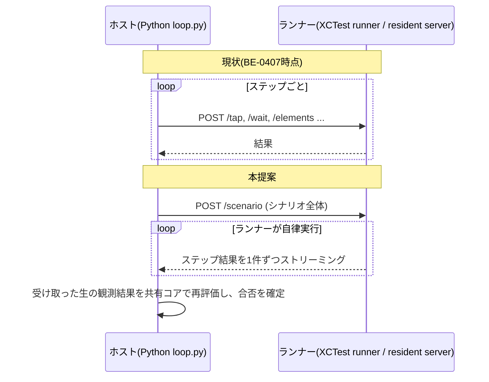

# 共有Rustコアによるオンデバイス・シナリオ実行

> ステータス: ドラフト
> 対象: `bajutsu/common/orchestrator/`、`bajutsu/common/drivers/base/`、`bajutsu/common/drivers/xcuitest.py`、
> `bajutsu/common/drivers/adb.py`、`BajutsuKit`、`BajutsuAndroidUIAutomatorServer`
> 関連: [BE-0407](../../roadmaps/BE-0407-step-latency-driver-internal-tuning/BE-0407-step-latency-driver-internal-tuning.md)、
> [BE-0408](../../roadmaps/BE-0408-step-latency-device-executor-protocol/BE-0408-step-latency-device-executor-protocol.md)、
> [BE-0409](../../roadmaps/BE-0409-step-latency-ios-device-executor/BE-0409-step-latency-ios-device-executor.md)、
> [BE-0410](../../roadmaps/BE-0410-step-latency-android-device-executor/BE-0410-step-latency-android-device-executor.md)、
> [BE-0365](../../roadmaps/BE-0365-in-app-control-channel/BE-0365-in-app-control-channel.md)、
> [BE-0114](../../roadmaps/BE-0114-driver-conformance-suite/BE-0114-driver-conformance-suite.md)

シナリオの決定論的な解釈(セレクタ解決、待機・アサーションの評価、制御フロー)を1つのRustクレートとして
書きます。ホスト(Python、PyO3経由)とデバイス上のランナー(iOS/Android、WASM経由)の両方が、同じ
バイナリの判定ロジックを呼びます。これにより、ステップ実行のホスト・デバイス間の往復をなくします。
BE-0408〜0410が提案する段階的ロールアウトの代替案であり、どちらを採るかの比較材料として並記します。

## 1. なにをつくるのか

新しいRustクレート(`rust/bajutsu_core/`)を1つ作ります。このクレートは、次の判定を今日のPythonと
同じ規則で実装します。

- シナリオの展開(`bajutsu/common/scenario/expand.py`が持つ`if`/`for_each`/コンポーネント展開/変数補完)
- セレクタ解決(`bajutsu/common/drivers/base/_functions.py`の`find_all`・`resolve_unique`)
- 1ステップのact→wait→verifyの判定(`bajutsu/common/orchestrator/loop/_functions.py`の`_run_step_body`・`run_scenario`)
- システムアラートによるブロック時の1回リトライ判定(`_step_runner.py`の`alert_guard`呼び出し)
- 証跡ルールの発火判定(`bajutsu/common/orchestrator/evidence_rules.py`の`_rule_fires`・`_collect_captures`)

このクレートは2つの形でビルドします。

- **PyO3バインディング**: Pythonの拡張モジュール(`bajutsu_core`)としてビルドし、ホスト側の
  `bajutsu/common/orchestrator/`から呼べるようにします。ただしホストはこれを使って新しい対象を
  自ら操作するのではなく、後述のとおりデバイスが返した生の観測結果から合否を再計算する用途に限って
  使います。
- **WASMバイナリ**: `wasm32-unknown-unknown`向けにビルドします。iOSでは`XCUITest`ランナープロセス
  (`BajutsuKit`)に埋め込みます。Androidではresident UI Automatorサーバー
  (`BajutsuAndroidUIAutomatorServer`)に埋め込みます。タップ・型入力・スワイプ・ツリー読み取り・
  スクリーンショットといった実際のデバイス操作は、各プラットフォームがWASMのホスト関数として
  クレートへ提供します。クレート自身はどちらのOS APIも呼びません。

ホストは、対応するアクチュエータの準備が整った時点で、シナリオ全体(`before`/`steps`/`expect`/
`after`のすべて)を1回のリクエストでランナーへ渡します。ランナーはクレートを使って、それを自律的に
最後まで実行します。各ステップが完了するたびに、結果を1件ずつホストへストリーミングで返します。
ホストはそれをCLIのライブ出力と`serve`のログバス経由で Web UI へ、今日と同じ見え方で流し込みます。
合否の最終判定は、デバイスが返した生の観測結果(選択された要素、アサーション対象の値)を、ホスト側の
同じクレートで再評価して下します。デバイス自身が計算した`ok`は、そのまま信用しません。

### やらないこと

- **Playwright・FakeDriverの置き換えはしません。** 既存ループ
  (`bajutsu/common/orchestrator/loop/_functions.py`)はそのまま残します。新しいオンデバイス経路は、
  `Capability`(`bajutsu/common/drivers/base/capability.py:6`)で明示的にオプトインした
  バックエンドだけが使います。対象を今回iOS・Androidの2バックエンドに絞る理由は「4. 検討した代替案」に
  書きます。
- **区間証跡(video・deviceLog)の開始・終了の判断は変えません。** これらは`simctl io recordVideo`の
  ようなホスト側のOSプロセス制御を要します。デバイス内では完結できません。今回もホストが従来どおり
  区間の開始・終了を判断し、ステップ実行の合間に軽量な同期コマンドとしてランナーへ送ります。頻度は
  低くポーリングでもないため、本提案が削減したい往復には数えません。
- **`http`・`email`・`generate`・`visual`・`golden`・`request`アサーションはデバイスに移しません。**
  いずれもデバイスの画面を読まない検証です。BE-0408の境界分けをそのまま踏襲します。
- **セレクタ解決ロジックの意味論そのものは変えません。** `find_all`・`resolve_unique`の現在の規則を
  そのままRustへ移します。規則には`within`・`idMatches`・`labelMatches`・トレイト導出、Androidの
  派生ラベルのフォールバックを含みます。判定基準は新設・変更しません。

## 2. なぜつくるのか

[BE-0407](../../roadmaps/BE-0407-step-latency-driver-internal-tuning/BE-0407-step-latency-driver-internal-tuning.md)は
実機計測により、1回の`tap`ステップがiOSで0.95〜1.07秒、Androidで3.25〜3.32秒かかることを示しました。
目標は250〜500ミリ秒であり、ホスト・デバイス間の往復そのものが支配的なコストでした。原因は、
ホストが50ミリ秒間隔でポーリングしながら条件を評価し、そのたびにHTTPラウンドトリップを払っている
ことにあります。[BE-0408](../../roadmaps/BE-0408-step-latency-device-executor-protocol/BE-0408-step-latency-device-executor-protocol.md)は、
この往復を減らすため、セレクタ解決と待機・アサーションの判定ロジックをSwiftとKotlinへそれぞれ
独立に移植する設計を示しました。

この独立移植には、BE-0408自身が明言しているとおり、意味論的ドリフトのリスクが伴います。ホスト側の
Python実装、iOS向けのSwift実装、Android向けのKotlin実装という3つの独立したコードが、同じ
セレクタに対して常に同じ判定を返し続けなければなりません。BE-0408はこれを
[BE-0114](../../roadmaps/BE-0114-driver-conformance-suite/BE-0114-driver-conformance-suite.md)の
ドライバ適合スイートを拡張して検知する計画です。だがこれは「ズレを検知するテストを書き足す」
対策であって、「ズレがそもそも起こらない」構造ではありません。`find_all`・`resolve_unique`の判定
基準は`bajutsu/common/drivers/base/_functions.py:152,274`にあります。これを将来変更するとき、
変更した人は3つの言語で同じ変更をします。しかも、それぞれが正しいことを確認しなければなりません。
この責任は、BE-0408が対象を2バックエンドに絞ってもなお消えない継続コストです。

もう1つの動機は、往復の削減幅そのものにあります。BE-0408の段階的ロールアウトは、「待機の条件評価」
「アサーション評価」を個別にデバイスへ移します。その後、最終段階(ステージ4)で初めてステップ列を
まとめて1回のリクエストで送る設計にたどり着きます。裏を返せば、ステージ1〜3の期間は往復の一部しか
削減されません。ステップをまたいだ判定は、ステージ4に至っても引き続きホストの役目のまま残ります。
例えばシステムアラートを検出したときの1回リトライ判定(`_step_runner.py`の`alert_guard`呼び出し)
です。シナリオ全体を最初からランナーへ渡します。そこに含まれる制御フローとステップ間の再試行判定
まで、まとめてデバイス側で解釈実行させます。こうすればホスト・デバイス間の往復は「フェーズの境界」
と「区間証跡の開始・終了」だけになります。これはBE-0408のステージ4がまだ持ち越している往復の残りを、
追加の段階を経ることなく一度に削る設計です。

## 3. どう実現するか



### 新設するRustクレート

`rust/bajutsu_core/`に、次の責務を持つモジュールを置きます。

- **シナリオ展開**: `bajutsu/common/scenario/expand.py`の`expand_components`・`expand_data`・
  `apply_setups`が行う`if`/`for_each`展開、コンポーネント展開、`vars.*`補完を移植します。
- **セレクタ解決**: `bajutsu/common/drivers/base/_functions.py`の`find_all`・`resolve_unique`を
  移植します。
- **ステップループ**: `bajutsu/common/orchestrator/loop/_functions.py`の`run_scenario`・
  `_run_step_body`が行うact→wait→verifyの流れ、`_step_runner.py`が持つ
  システムアラートの1回リトライ判定を移植します。
- **証跡ルール判定**: `bajutsu/common/orchestrator/evidence_rules.py`の`_rule_fires`・
  `_collect_captures`を移植し、どのステップでスクリーンショット・要素ツリーを取るべきかを
  デバイス側で自己完結して判断できるようにします。
- **`Driver`トレイト**: `bajutsu/common/drivers/base/driver.py`の`Driver`プロトコルに対応する
  Rustのトレイトを定義します。具体的な実装は持たず、`tap`・`query`・`type_text`・`swipe`・
  `screenshot`をWASMのホスト関数呼び出しとして宣言するだけにとどめます。

セレクタ解決とステップループの判定基準は、ホストのPyO3バインディングとデバイスのWASMバイナリの
両方を同じソースからビルドします。ただし、同じソースからビルドしたことは、両者が常に同じ結果を
返す保証にはなりません。PyO3バインディングはネイティブターゲット向け、WASMバイナリは
`wasm32-unknown-unknown`向けです。`usize`の幅(64ビット対32ビット)、浮動小数点の丸めと
文字列化、`HashMap`の反復順といったターゲット依存の差が、判定を分けることがあります。
`resolve_unique`の重複畳み込み
([`bajutsu/common/drivers/base/_functions.py:274`](../../bajutsu/common/drivers/base/_functions.py))
のように順序が判定に効く箇所では、この差が非決定性になりえます。ホストとデバイスが別の要素を
選ぶ形です。そこでクレートは、順序が判定に効く箇所を`BTreeMap`のような決定的な型に限ります。
両ターゲットが
[BE-0114](../../roadmaps/BE-0114-driver-conformance-suite/BE-0114-driver-conformance-suite.md)の
ドライバ適合スイートの同じフィクスチャに対して同一の結果を返すことを、CIで継続的に突き合わせます。
この差分検査を前提とすることで、BE-0408が抱える3実装間の意味論的ドリフトのリスクを、実装を1つに
絞る形で大きく減らします。適合スイートは、`FakeDriver`など既存の`Driver`実装と同じフィクスチャに
対してこのクレートを検証する用途に加えて、この2ターゲット間の差分検査を担います。

### ホスト側の変更

`bajutsu/common/orchestrator/loop/_functions.py`の`run_scenario`の先頭に、分岐を1つ加えます。
対象の`Driver`がオンデバイス実行の`Capability`を宣言しているかどうかを見る分岐です。
宣言していなければ、既存のステップループは、コードと挙動のどちらも変更しません。宣言していれば、
シナリオ全体を新設のPyO3バインディング経由で対象のランナーへ渡します。返ってくるステップ結果の
ストリームを1件ずつ受け取ります。今日`StepOutcome`を`push`している箇所と同じ経路(レポート
書き込み、CLIのライブ出力、`serve`のログバスへの中継)に流し込みます。

デバイスが返す各ステップの結果には、判定済みの真偽値だけでなく、判定の根拠になった生の観測結果
(解決された要素の属性、アサーション対象として読んだ値)を含めます。ホストは、受け取った生の観測
結果を同じRustクレート(PyO3バインディング)へ渡し、合否をホスト側で再計算します。デバイスが
計算した`ok`は、そのまま採用しません。加えて、シナリオの展開もデバイス側へ移すため(前述)、
ホストは同じPyO3バインディングでシナリオをローカルにも展開し、デバイスから返ってきたステップ列が
その展開結果と一致することを確認します。一致しなければ、デバイス側の制御フロー(`if`の分岐や
`for_each`の反復回数など)がホストの想定と食い違っている証拠であり、その時点で失敗として扱います。
こう確認しない場合、デバイス側の制御フローに誤りがあってステップが黙って飛ばされても、報告された
各ステップの`ok`だけを見て合格と判定してしまいかねません。合否を最終的に下すのは常にホストで
あるという原則(prime directive 1)は、この二重の確認によって成り立ちます。

### iOS側の変更

`BajutsuKit/Sources/BajutsuRunner/APIHandler.swift`に`POST /scenario`エンドポイントを追加します。
BE-0409が同名で提案している設計と、意図的に同じ名前にします。どちらを採るとしても、この
エンドポイント名の周辺で積んだ実装の一部を転用できるようにするためです。ランナープロセス内で
WASMランタイムを1つ動かし、`bajutsu_core`のWASMバイナリをロードします。ホスト関数としては、
`XcuitestElementProvider.swift`が持つ`tap`・`snapshot`・`type`・`swipe`・スクリーンショット
取得を提供します。`APIHandler`は`BajutsuKit`の全操作をランナーのメインスレッドへ直列化して
います(BE-0323の非再入性)。そのためWASM側からのホスト関数呼び出しも、同じスレッド上で同期的に
実行します。

この直列化は`operations`という直列キューと、`serialized(_:)`内の`DispatchQueue.main.sync`が
担っています
([`APIHandler.swift:51,354-366`](../../BajutsuKit/Sources/BajutsuRunner/APIHandler.swift))。
シナリオ全体を実行する`POST /scenario`は、実行中このキューを占有し続けます。そのため
`POST /scenario/cancel`や区間証跡の開始・終了を伝えるコマンドを同じキュー経由で届けると、
シナリオが終わるまで処理されません。今日`health`・`setInterruptionPolicy`がこのキューを迂回して
いるのと同じ扱いを、この2つの新しいエンドポイントにも与える必要があります。

WASMランタイムの候補は、Bytecode Allianceのwasmtimeに対するSwiftバインディング、または
純Swift実装のWasmKitのいずれかになります。どちらが埋め込みやすいか、`xcodebuild`のテスト
ターゲットに追加の依存としてどこまで軽く収まるかは、実装に着手する前の実現可能性の検証が要ります。
「5. 作業手順」の最初のiOS向けステップで検証します。

### Android側の変更

`BajutsuAndroidUIAutomatorServer`のresident instrumentationサーバーに、同じく`POST /scenario`
エンドポイントを追加します。JVM上で動くWASMランタイムを1つ組み込みます。純JVM実装で追加の
ネイティブライブラリ署名を要しないChicoryなどを候補とします。ホスト関数として、既存の
`UiAutomation`セッションと`AccessibilityNodeInfo`アクセスをそのまま提供します。
`ResidentServerTest.kt`が持つ`POSTDATE_BUDGET_MS`のような固定待機は、Rustクレート側の
イベント駆動の待機判定に置き換わります。この置き換えはBE-0410の設計をそのまま引き継ぎます。

### 進捗のCLI/Web UIへの配信

`POST /scenario`のレスポンスは、BE-0409が提案するのと同じチャンク転送を使います。1行1件の
改行区切りJSON(NDJSON)として、ステップが完了するたびに1件ずつ書き出します。

```json
{"index": 3, "action": "tap", "ok": true, "durationMs": 42, "artifacts": [...]}
```

ホストは接続を開いたまま、この行が届くたびに読み取ります。既存の`StepOutcome`と同じ形へ変換し、
今日CLIのライブ出力と`serve`のログバスが読んでいるのと同じ経路に渡します。CLIのライブ出力と
Web UI のReplayタブの見え方は変えません。進捗の生成元が「ホストのforループ内で同期的に計算される」
ものから「ストリーミングで届く」ものへ変わるだけです。

### 既存機構との整合

- **キャンセル([BE-0370](../../roadmaps/BE-0370-graceful-run-cancel/BE-0370-graceful-run-cancel.md))**:
  `POST /scenario`と対になる`POST /scenario/cancel`を追加します。同じ認証トークンで保護し、
  ランナー内のRustループがステップの境界ごとにポーリングするフラグを立てます。iOS側は上述のとおり、
  このエンドポイントを直列キューの外で処理します。ホストが`SIGTERM`や Web UI の停止ボタンを受けたら、
  この認証済みリクエストを送ってからストリームの終端を待ちます。シナリオ全体を1回で渡す設計でも、
  キャンセルの反応点はステップ境界のまま変わりません。
- **バックエンドのクラッシュ復旧([BE-0291](../../roadmaps/BE-0291-xcuitest-runner-reuse-across-scenarios/BE-0291-xcuitest-runner-reuse-across-scenarios.md)、
  BE-0407の`recovery.py`)**: ランナープロセスがシナリオの途中で落ちる場合を考えます。ホストは
  接続断として、今日と同じ`BackendCrashError`を検出します。既存の再リースとリトライの判断を
  そのまま使います。この経路は変更しません。
- **区間証跡**: 上の「やらないこと」に書いたとおり、開始・終了の判断はホストに残します。この
  開始・終了コマンドも、iOS側では上述の直列キューの外で処理する必要があります。

## 4. 検討した代替案と、採らなかった理由

| 案 | 概要 | 採らなかった理由 |
|---|---|---|
| BE-0408〜0410のとおり、SwiftとKotlinへ個別に移植する | セレクタ解決と判定ロジックを各言語へ手作業で移植し、BE-0114の適合スイートで検証する | 実装の初期コストは小さいです。だが3つの独立実装(ホストのPython、iOSのSwift、AndroidのKotlin)が同じ判定を返し続ける保証を、将来のあらゆる変更のたびにテストで確認し続けるコストを払い続けます。本提案はRust/WASMという別種のツールチェイン導入コストを1回払う代わりに、このコストを構造的に減らします |
| PythonそのものをWASM化する(Pyodideなど) | CPythonをWASMにコンパイルしたランタイムをランナー・サーバーへ埋め込む | 却下します。CPythonのWASMランタイムは数十MB級であり、XCTestランナーやAndroidインストゥルメンテーションのプロセスに埋め込むには重すぎます。CPythonのグローバルインタプリタロックとスレッドモデルも、`APIHandler`がすべての操作をメインスレッドへ直列化する設計(BE-0323)と相性が悪いです |
| 宣言的な仕様(IR/DSL)からSwift・Kotlinのコードを生成する | 判定ロジックを1つの記述から書き、ビルド時にネイティブコードへ変換する | 却下します。ランタイム依存を増やさない利点はあります。だが生成後のコードは結局2つの独立したネイティブコードとして存在し、実行時の一致は「生成器が正しく変換したことを信頼する」形にとどまります。本提案が狙う、両ターゲットをCIで継続的に突き合わせる検証にはなりません。しかも生成器自体の保守コストが、WASMランタイムの組み込みコストと同程度かかります |
| Rustコアで`loop.py`全体を置き換え、Playwright・FakeDriverも含めて統一する | ホスト側の実行経路もRustコア経由に一本化する | 却下します(今回のスコープでは)。対象範囲が「iOS/Androidの往復削減」という検証したい問いを越えて広がり、既存の全バックエンドのテスト資産を巻き込みます。まずiOS/Androidのオンデバイス経路だけで実証します。置き換え範囲の拡大は、実証結果を見てから別途判断します |

## 5. 作業手順

| # | やること | 触るファイル | 完了条件 | 前提 |
|---|---|---|---|---|
| 1 | `rust/bajutsu_core/`にクレートを新設し、シナリオ展開(`expand_components`・`expand_data`・`apply_setups`相当)を移植します | `rust/bajutsu_core/` | 既存の`bajutsu/common/scenario/expand.py`のテスト用フィクスチャと同じ入力を与え、Rust側の出力をJSONへシリアライズしたものが一致することをゴールデンファイル比較で確認します | なし |
| 2 | セレクタ解決(`find_all`・`resolve_unique`)を移植します | `rust/bajutsu_core/` | BE-0114のドライバ適合スイートのフィクスチャをRust側でも読み、既存の期待結果と一致することを確認します | 1 |
| 3 | ステップループ(act→wait→verify)とシステムアラートの1回リトライ判定、証跡ルール判定を移植し、Rustクレート内のフェイクドライバに対して動かします | `rust/bajutsu_core/` | クレート単体のテストが、`bajutsu/common/drivers/fake.py`が持つ既存シナリオのいくつかについて、Python版`run_scenario`と同じ`RunResult`(合否・失敗理由)を返します | 2 |
| 4 | PyO3バインディングをビルドし、`Capability`とホスト側の再評価ロジック(デバイスが返す生の観測結果から合否を再計算し、ローカルに展開したステップ列と突き合わせる処理)を`loop.py`に追加します。この`Capability`を宣言しない既存ドライバの挙動は変更しません | `bajutsu/common/drivers/base/capability.py`、`bajutsu/common/orchestrator/loop/_functions.py` | 既存のドライバ適合スイート・回帰テストが無変更で通ります(新しい`Capability`は誰も宣言していないため経路に入りません) | 3 |
| 5 | iOS向けにWASMランタイムの実現可能性を検証します(候補: wasmtimeのSwiftバインディング、WasmKit)。1つの単純なシナリオ(`smoke.yaml`相当)をWASM経由で最後まで実行できることを確認します | `BajutsuKit/Runner/` | 実機シミュレータ上で、選んだランタイムがXCTestのテストターゲットにビルドでき、クレートの1関数呼び出しが成功します | なし(他のどの手順よりも先に着手します) |
| 6 | iOSの`APIHandler`に`POST /scenario`を追加し、ホスト関数(タップ・スナップショット・型入力・スワイプ・スクリーンショット)を配線して、1つの単純なシナリオをエンドツーエンドで通します | `BajutsuKit/Sources/BajutsuRunner/APIHandler.swift`、`BajutsuKit/Runner/Sources/XcuitestElementProvider.swift` | `make -C demos/showcase run-swiftui`の`smoke`シナリオが、新しい経路で合格として終わります | 4、5 |
| 7 | 進捗のNDJSONストリーミングをホスト側で受け取り、CLIのライブ出力・`serve`のログバスへ中継する配線を実装します | `bajutsu/common/orchestrator/`、`bajutsu/serve/logbus/` | `bajutsu run`実行中、ステップが完了するたびにCLIの出力行が増える見え方が、既存の(非オンデバイス)経路と同じになります | 6 |
| 8 | `POST /scenario/cancel`を、`operations`の直列キューを迂回する形で追加し、`SIGTERM`・Web UIの停止ボタンからのキャンセルが、オンデバイス実行中のシナリオに対しても`RunResult(ok=False, failure="cancelled")`を返すことを確認します | `BajutsuKit/Sources/BajutsuRunner/APIHandler.swift`、`bajutsu/common/orchestrator/control_channel.py` | BE-0370の既存キャンセルテストと同等のテストを、オンデバイス経路に対しても追加し、通します | 6 |
| 9 | Android向けにWASMランタイムの実現可能性を検証します(候補: Chicoryなど純JVM実装)。1つの単純なシナリオをWASM経由で最後まで実行できることを確認します | `BajutsuAndroidUIAutomatorServer/` | Android実機・エミュレータ上で、選んだランタイムがinstrumentationテストターゲットにビルドでき、クレートの1関数呼び出しが成功します | なし(他のどの手順よりも先に着手します) |
| 10 | Androidのresident UI Automatorサーバーに、手順6〜8と同じ範囲の作業(`POST /scenario`の追加、進捗ストリーミング、`POST /scenario/cancel`)を行います | `BajutsuAndroidUIAutomatorServer/` | Android実機・エミュレータ上で、iOSと同じ`smoke`シナリオがオンデバイス経路で合格します | 4、9 |
| 11 | `controls.yaml`(BE-0407・BE-0409・BE-0410が使う実機計測の物差し)を新しい経路で計測し、BE-0409・BE-0410が見積もる1タップあたりの目標値(iOS 200〜350ミリ秒、Android 150〜300ミリ秒)と比較できる数値を記録します | `roadmaps/`配下の本項目のディレクトリ | 実機トレースの結果を本仕様書またはBE番号を割り当てた後の項目のProgressに記録します | 6、10 |
| 12 | この比較結果を踏まえ、BE-0408〜0410とどちらを採るかの判断材料として、英語・日本語両方のドキュメント(`docs/drivers.md`・`docs/run-loop.md`とその日本語版)へ反映します | `docs/drivers.md`、`docs/run-loop.md`、`docs/ja/`配下 | 両言語の該当ページが、本提案とBE-0408〜0410のどちらが採用されたかを反映します | 11 |
| 13 | CI・`make check`のゲートにRust/WASMのビルドを組み込む方法(`maturin`をuvのビルドフローにどう統合するか、`wasm32-unknown-unknown`ターゲットのビルドをどのジョブで行うか)を決めます | `Makefile`、`.github/workflows/` | 新しいクレートに対する`cargo test`・型検査が、既存の`make check`と同じくフルクローンから再現できる形でCIに載ります | 1 |

現時点で詰め切れていない箇所は、手順5・9のWASMランタイム選定(実現可能性を確認する前の仮の候補に
とどまります)と、手順13のCI統合方法です。どちらも実装に着手する前の調査が要ります。
