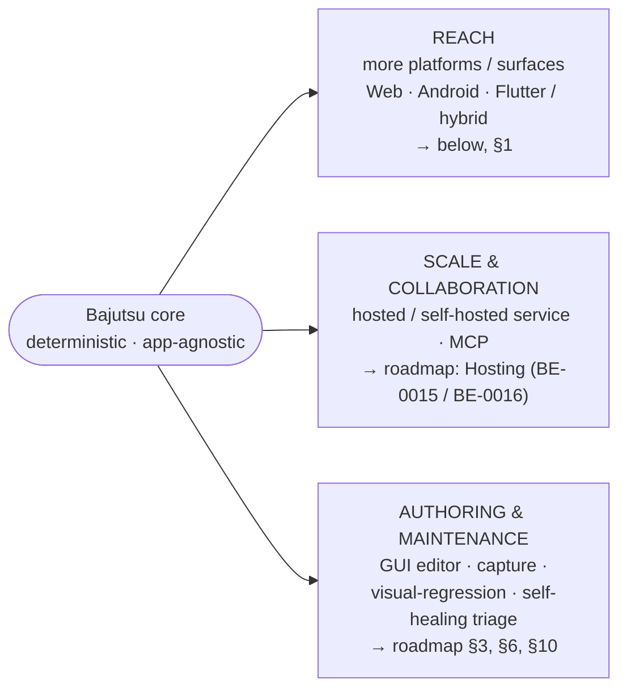

**English** · [日本語](ja/vision.md)

# Future vision

> The overall direction Bajutsu is heading, and the one constraint every direction must respect.
> This page gives the strategic overview across the individual roadmap items — including how far
> each axis has already progressed, not just what is planned; the granular, prioritized backlog is in
> [roadmap](../roadmaps/README.md), and the rationale behind today's design is in
> [`DESIGN.md`](../DESIGN.md). Read this to understand how the pieces fit together, then follow the
> links for each plan.

Related: [concepts](concepts.md) · [drivers](drivers.md) · [selectors](selectors.md) · [roadmap](../roadmaps/README.md) · [roadmap dashboard → Hosting](https://bajutsu-e2e.github.io/bajutsu/api/roadmap.html)

---

## The invariant: what never changes

Every future direction is evaluated against the **prime directives**
([CLAUDE.md](../CLAUDE.md) · [concepts](concepts.md) · [DESIGN §2](../DESIGN.md)). They stay fixed
across every direction below:

1. **AI is the author and the failure investigator, never the judge.** No future feature may put
   an LLM (large language model) into the Tier-2 `run`/CI (continuous integration) gate. Pass/fail
   stays machine-checkable, always.
2. **Determinism first.** No fixed sleeps; an ambiguous selector fails fast. Every new
   [platform](glossary.md#driver-backend-actuator-platform), host, or authoring tool inherits this
   — it is not negotiable for reach or convenience.
3. **App-agnostic / backend-agnostic.** Per-app and per-platform differences live in config and
   behind the `Driver` / environment seams; the deterministic core stays the same everywhere.

> The test of any roadmap item is whether it keeps AI out of the gate and the gate
> deterministic. If not, it belongs in **Tier 1 (authoring) or triage (investigation)**,
> outside the gate, or it does not belong in Bajutsu.

---

## Three axes of growth

Bajutsu expands along three independent axes. They compose (none blocks the others), and each
maps to concrete pages.

Mermaid source

<!-- mermaid-svg: assets/diagrams/vision-three-axes.svg -->

### 1. Reach — more platforms and surfaces

The `Driver` / environment / id-convention seams were built to be replaced, not just configured, so
**the same deterministic core drives iOS, Android, and the Web** today, with each platform adding
only its own actuator + environment + stable-id convention. **iOS** (XCUITest), **web**
(Playwright), and **Android** (adb) backends have all landed and are validated end-to-end (see
[architecture → implementation status](architecture.md#implementation-status)); **Flutter** is the
remaining phase.

**The abstraction is already platform-shaped.** Only three seams are platform-specific: the
**actuator** (drives the UI — `drivers/xcuitest.py`, `drivers/adb.py`, …), the **environment manager**
(boot / erase / launch — `simctl.py` on iOS, its Android counterpart), and the **stable-id
convention** (`accessibilityIdentifier` on iOS, `resource-id` on Android, `data-testid` on the web —
[concepts §4](concepts.md#4-stable-selectors-prefer-accessibilityidentifier)). Everything else —
scenario DSL, selector resolution, machine assertions, the orchestrator, evidence, the reporter —
never names a platform. Adding one means adding a new triple, not forking the core; this pattern is the
same move the design already made for a second iOS actuator (XCUITest).

**The crux is selector portability.** A scenario is portable across platforms only to the extent
its selectors are by `id`. Each platform's native equivalent of `accessibilityIdentifier` maps onto
the same `Selector` field:

| `Selector` field | iOS | Android | Web |
|---|---|---|---|
| `id` (primary) | `accessibilityIdentifier` | `resource-id` (Compose: `testTag`) | `data-testid` |
| `label` (auxiliary) | `accessibilityLabel` | `content-desc` / `text` | accessible name / `aria-label` |
| `traits` (role filter) | UI traits | widget class | ARIA `role` |

The YAML selector `{ id: settings.reindex }` is already platform-neutral — only *which app-side
attribute the backend reads to satisfy it* differs, and that lives entirely inside the Driver, never
in the scenario. One wrinkle: a platform's native id syntax may not reproduce the SPEC id
**verbatim** — Android's `android:id` (Views) allows neither `.` nor `-`, so `stable.refresh`
surfaces as `stable_refresh`. Rather than a hidden driver-side rewrite, the scenario keeps the
difference **explicit** with a **list of id candidates** (`id: [stable.refresh, stable_refresh]`,
matched as an OR) — the explicit list is what lets the showcase's shared scenarios run unchanged on both Android
UI toolkits (BE-0221; see [scenarios](scenarios.md#cross-platform-ids-a-candidate-list-be-0221)).

| Phase | Scope | Status |
|---|---|---|
| Shared abstractions | Platform-aware backend registry + `Environment` Protocol | Implemented ([BE-0042](../roadmaps/BE-0042-platform-backend-registry/BE-0042-platform-backend-registry.md), [BE-0009](../roadmaps/BE-0009-cross-platform-abstractions/BE-0009-cross-platform-abstractions.md)) |
| Web | Playwright; runs on the existing Linux gate, no Mac / emulator | Implemented ([BE-0041](../roadmaps/BE-0041-web-playwright-backend/BE-0041-web-playwright-backend.md), [BE-0054](../roadmaps/BE-0054-web-backend-completion/BE-0054-web-backend-completion.md)) |
| Android | adb + UI Automator, a coordinate-driven backend | Implemented ([BE-0007](../roadmaps/BE-0007-android-backend/BE-0007-android-backend.md), [BE-0208](../roadmaps/BE-0208-android-emulator-e2e-ci/BE-0208-android-emulator-e2e-ci.md), [BE-0209](../roadmaps/BE-0209-android-codegen-emitter/BE-0209-android-codegen-emitter.md)) |
| Flutter / hybrids | An id convention on the existing iOS / Android backends, not a new actuator or a semantics bridge | Planned ([BE-0008](../roadmaps/BE-0008-flutter-support/BE-0008-flutter-support.md)) |

Web landed before Android, even though Android is architecturally closer to a coordinate backend: Web needed no
macOS and no device emulator, so it fit inside the [`make check`](../CLAUDE.md) / [CI](ci.md) gate
from day one — proving the core platform-neutral at the lowest possible cost. Android then confirmed
the same lean / coordinate path on an already-generalized core, on its own emulator-backed gate.
Full per-platform detail: [drivers](drivers.md), [roadmap dashboard → Platform support](https://bajutsu-e2e.github.io/bajutsu/api/roadmap.html).

### 2. Scale & collaboration — from local tool to shared service

`bajutsu serve` started as a local, single-user launcher; it now also runs as a **shared service**:
a cheap Linux control plane (auth, history, queue, report viewer) split from an expensive
device-worker pool, so a team runs and reviews from a browser.

- **[BE-0015 — public / cloud hosting](../roadmaps/BE-0015-web-ui-public-hosting/BE-0015-web-ui-public-hosting.md)**
  and **[BE-0016 — self-hosting](../roadmaps/BE-0016-web-ui-self-hosting/BE-0016-web-ui-self-hosting.md)**
  are both implemented: the control-plane ⇄ Mac-worker-pool split, a job queue, multi-org support,
  and the security hardening public exposure mandates. See [self-hosting](self-hosting.md) for
  running it yourself, on your own hardware, today.
- **MCP (Model Context Protocol) server** ([BE-0017](../roadmaps/BE-0017-mcp-server/BE-0017-mcp-server.md))
  is implemented: `run`/`doctor` as MCP tools and run evidence as MCP resources, so agents drive
  Bajutsu directly. The MCP server stays on the Tier-1 side of the boundary — agents author and investigate,
  the gate stays deterministic.

### 3. Authoring & maintenance — lower the cost of owning tests

The scenario is just YAML owned by humans; this axis makes writing and maintaining it cheaper
without softening the gate.

- **GUI (graphical user interface) editor & non-AI action capture**
  ([BE-0012](../roadmaps/BE-0012-action-capture-record/BE-0012-action-capture-record.md),
  [BE-0013](../roadmaps/BE-0013-scenario-gui-editor/BE-0013-scenario-gui-editor.md)) are implemented
  in `bajutsu serve`: visually edit scenarios, pick selectors on a screenshot, and capture real
  taps/types into a scenario with no LLM involved.
- **Visual-regression assertions** ([BE-0029](../roadmaps/BE-0029-visual-regression-assertions/BE-0029-visual-regression-assertions.md))
  are implemented: a deterministic assertion type (baseline diff, `approve` promotes a new
  baseline). It fits the directives because it is machine-checked, not AI-judged.
- **Self-healing triage** ([BE-0021](../roadmaps/BE-0021-ai-triage/BE-0021-ai-triage.md)) is
  implemented: AI reads failure evidence and proposes a **minimal diff**, which a human reviews and
  applies with `--write`. The guardrail (never auto-soften a committed test) is what keeps self-healing triage
  inside the directives.

This axis keeps extending — e.g. the ongoing work cataloged under
[roadmap dashboard → Authoring experience](https://bajutsu-e2e.github.io/bajutsu/api/roadmap.html) —
but the foundational capability (edit visually, capture without AI, self-heal a failure) is in
place on all three fronts.

---

## What stays fixed across all three

Everything in the table below is **shared, deterministic, and platform-/host-neutral**, and it does
not fork as Bajutsu grows. This shared core is what makes the three axes independent: they extend the edges,
not the core.

| Fixed core | Where |
|---|---|
| Scenario DSL (domain-specific language) & grammar | [scenarios](scenarios.md) · [dsl-grammar](dsl-grammar.md) |
| Selector model & deterministic resolution | [selectors](selectors.md) |
| Machine assertions (the only judges) | `assertions/` · [concepts](concepts.md) |
| observe → act → verify orchestrator | [run-loop](run-loop.md) |
| Evidence subsystem (capturePolicy / manifest) | [evidence](evidence.md) |
| Reporter (manifest / JUnit / HTML) | [reporting](reporting.md) |
| Config layering (`defaults × targets`) | [configuration](configuration.md) |

New platforms add backends behind the `Driver` seam; new hosting changes where `run` is invoked,
not what it does; new authoring produces the same YAML. The core stays constant.

---

## Where each axis stands

Web (Playwright), the MCP server, and visual-regression assertions — the near-term sequence this
page once recommended — have all landed, along with both the public and self-hosted topologies of
the scale axis and the GUI editor / non-AI capture piece of the authoring axis. Reach's open item is
Flutter ([BE-0008](../roadmaps/BE-0008-flutter-support/BE-0008-flutter-support.md)); the other two
axes keep extending incrementally rather than converging on one big remaining piece. For what is
next, the [roadmap](../roadmaps/README.md) is the prioritized, living backlog — this page explains
the rationale and direction, not the sequencing. When a roadmap item ships, it moves to the
[architecture status table](architecture.md#implementation-status); keep the three in sync.
