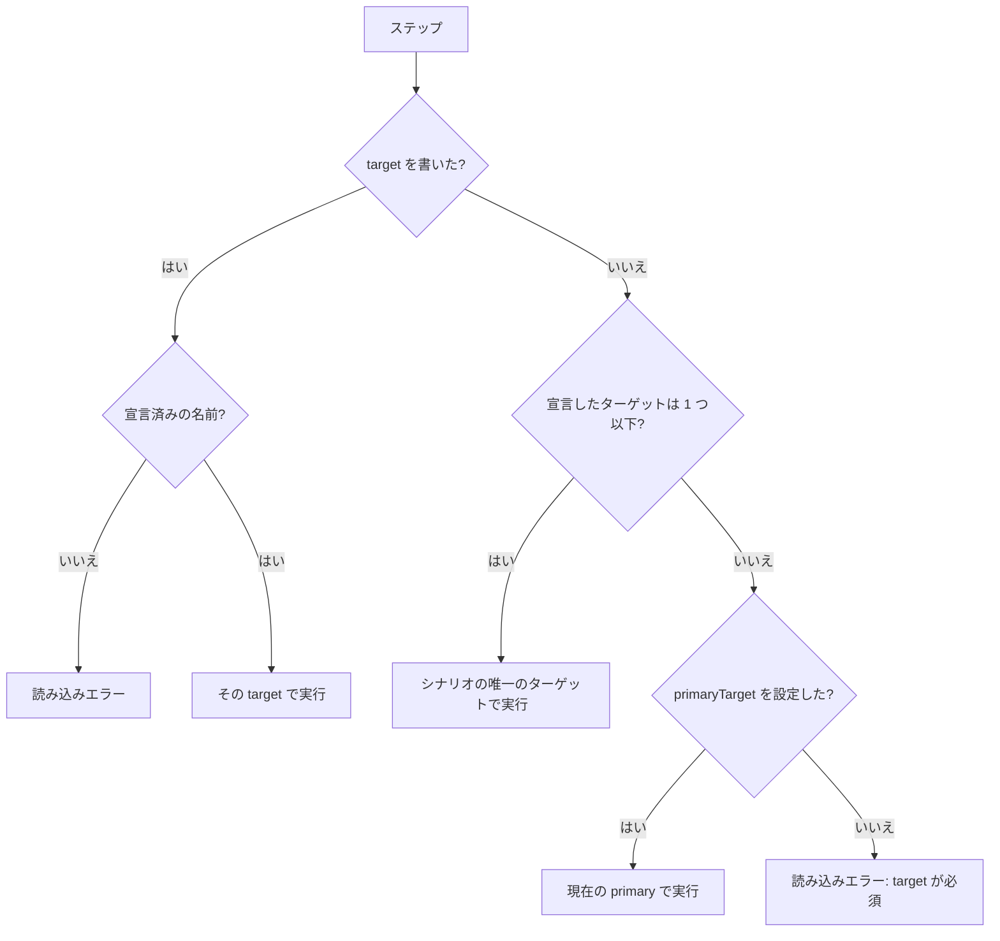
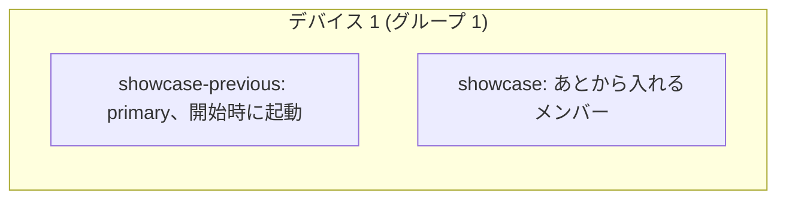
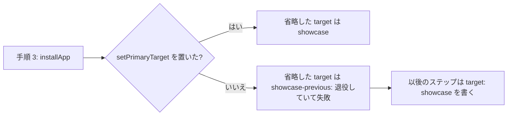
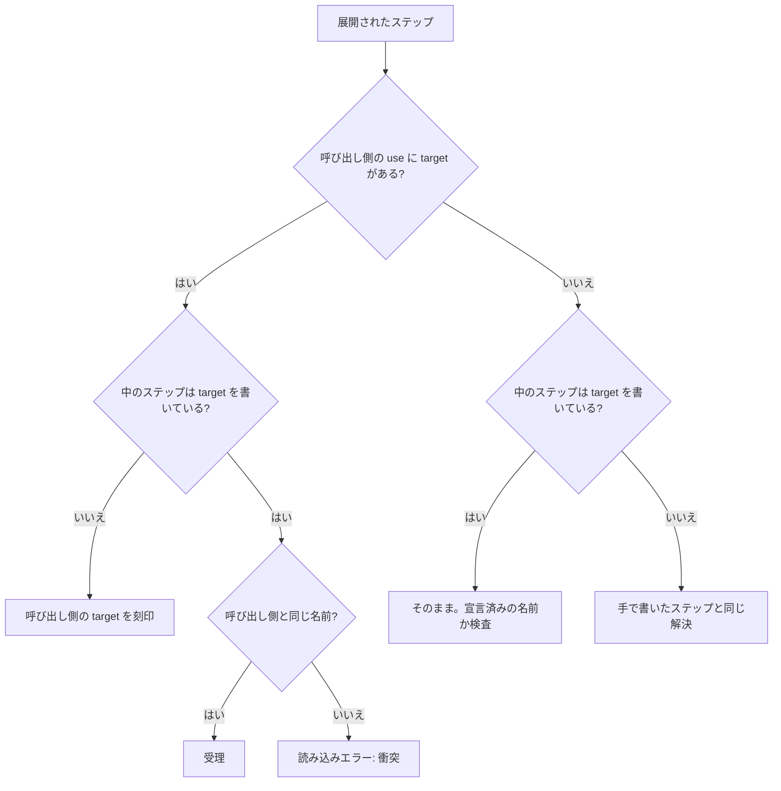

[English](BE-0447-install-app-step.md) · **日本語**

# BE-0447 — シナリオ内で複数のアプリをインストールできるようにする

<!-- BE-METADATA -->
| 項目 | 値 |
|---|---|
| 提案 | [BE-0447](BE-0447-install-app-step-ja.md) |
| 提案者 | [@0x0c](https://github.com/0x0c) |
| 状態 | **実装中** |
| トラッキング Issue | [検索](https://github.com/bajutsu-e2e/bajutsu/issues?q=is%3Aissue+label%3Aroadmap-tracking+in%3Atitle+"BE-0447") |
| トピック | シナリオの記述機能 |
<!-- /BE-METADATA -->

## はじめに

Bajutsu のターゲットは、1 つのアプリと、それを操作する設定のまとまりです。シナリオは、宣言した各ターゲットに、それぞれ専用のデバイスを与えます。この項目では、シナリオに 4 つの構成要素を追加します。1 つ目は `targets` に書く入れ子の配列で、1 台のデバイスを共有するターゲットを列挙します。2 つ目は `installs` キーで、primary に加えて、最初のステップの前にインストールするメンバーを指名します。primary は、常にインストールされます。3 つ目は `installApp` ステップで、残りを、流れが必要とする位置であとからインストールします。4 つ目は `setPrimaryTarget` ステップで、`target` を省略したときの解決先を、別のメンバー（たとえば `installApp` で入れたビルド）へ移します。これまで書けなかった 2 つの流れが書けるようになります。1 つは、テスト対象のアプリと同じデバイスに置く多要素認証（MFA）アプリのような、補助のアプリです。もう 1 つは、旧版のアプリでデータを作り、その上に新版をインストールするアップデートです。config のスキーマは変わらないので、既存の config とシナリオは、修正なしでそのまま動きます。

## 動機

現在の `targets.<name>.appPath` は 1 つのバイナリを指し、`run` がそれを事前条件の段階でインストールします。`reinstall: overwrite` を指定すればインストールをまたいでアプリのデータコンテナが残り、`relaunch` ステップでプロセスも再起動できます。しかし、シナリオの実行中に 2 つ目のバイナリをインストールする手段はありません。版 1 が書いたデータを版 2 が移行できるかを確かめたいテスターは、それを 1 つのシナリオで書けません。回避策は、同じデバイス上で 2 つのシナリオを続けて実行することです。この方法は 1 つのユーザーの流れを 2 つに分け、実行順序を書かれない前提として残します。

マルチターゲットのシナリオでも、この隙間は埋まりません。シナリオの `targets` は宣言した全ターゲットを最初のステップの前に起動し、各ターゲットが自分のデバイスを占有します。iOS のターゲットが 2 つあれば、デバイスも 2 台必要です（`docs/scenarios.md` の「Limits」）。アップデートには 1 台のデバイス上の同じバンドルの 2 つのビルドが要り、MFA アプリの併用には 1 台のデバイス上の 2 つのアプリが要ります。

導入後に確かめられる変化は次のとおりです。showcase デモに、旧版で起動してデータを作り、現行版をインストールして、アップデート後もデータが残っていることを検証する 1 つのシナリオを置きます。このシナリオが iOS と Android の両方で通り、既存の config もシナリオも、修正は要りません。

## 詳細設計

### アプリを表す単位は、これまでどおりターゲットである

config のスキーマは何も変わりません。ターゲットはすでに、1 つのアプリを識別しインストールするものを持っています。バンドル識別子またはパッケージ名、`appPath`、`build` コマンド、そしてアプリを操作する設定です。同じアプリの 2 つのビルドは、識別子を共有し、`appPath` だけが異なる 2 つのターゲットになります。補助のアプリは、それ自身のターゲットです。ビルドが共有する設定は、config がすでにすべてのターゲットへ重ねる `defaults` の層へ移します（`docs/configuration.md` の「Config layering」）。

```yaml
targets:
  showcase-previous:                      # シナリオが起動する旧版
    backend: xcuitest
    bundleId: com.example.showcase
    appPath: build/Showcase-1.app
  showcase:                               # 現行版
    backend: xcuitest
    bundleId: com.example.showcase
    appPath: build/Showcase-2.app
  authenticator:                          # 補助のアプリ
    backend: xcuitest
    bundleId: com.example.authenticator
    appPath: build/Authenticator.app
```

### デバイスを共有する：`targets` の入れ子の配列

シナリオの `targets` に、1 つの形を加えます。要素は、従来どおりのターゲット名か、ターゲット名の配列です。配列は**デバイスグループ**を表します。同じグループのターゲットは 1 台のデバイスで動けて、シナリオはターゲットごとではなく、グループごとに 1 台のデバイスを確保します。名前だけの要素は、メンバーが 1 つのグループです。配列を書かないシナリオは、これまでと完全に同じに動きます。

シナリオのモデルが 3 つの規則を、run の事前検査が 4 つ目の規則を強制します。名前は、リスト全体で 1 回だけ現れます。これは従来どおりです。グループは 2 つ以上の名前を持ちます。名前 1 つの配列は、名前だけの要素に何も足さないからです。`primaryTarget` は、最初の要素と等しくなければならない規則を保ちます。これは、最初のグループの最初のメンバーを指すことになります。config を参照できる run の事前検査は、グループのメンバーが 1 台のデバイスを共有できることを検査します。ネイティブのバックエンドのプラットフォームが同じであること（Web のターゲットには共有するデバイスがないので、2 つ以上のメンバーを持つグループに入れられません）、デバイスの経路（`deviceProvider`、`device`、`xcuitest.deviceType`）が同じであること、実効の `locale` が同じであること（iOS はシミュレータのシステムロケールを固定するためです）です。メンバーが食い違うグループは、デバイスを取得する前に拒否します。run が要するデバイス数は、バックエンドごとのグループの数です。デバイス数の不足を、開始前に拒否する検査も、グループを数えます。`--udid a,b` は、グループごとに 1 台を与えます。

平らにした列が 2 つ以上の名前を持つとき、既存の規則が適用されます。`target` を省略したステップには `primaryTarget` が要ります。そのため、グループを使うシナリオは、下の 2 つの例のように、それを設定します。

`Scenario.targets` を読む既存のコード（`bajutsu/common/scenario/models/scenario/_targets.py`、`bajutsu/common/runner/pipeline.py`、`bajutsu/run/cli.py`、`bajutsu/serve/operations/reads.py`、`bajutsu/analysis/cli/audit.py`）は、名前だけを要する場合、平らにする 1 つのアクセサ経由で読みます。シナリオのモデルでの検証、run の事前検査、リースの処理は、グループの構造そのものを読みます。平らにした列では、不正なグループを拒否できないからです。

### 最初にインストールするものを選ぶ：`installs`

1 つのグループは複数のアプリのターゲットを持てますが、開始時にデバイスへ置くべきものは、その一部です。最初のグループの最初のメンバーである primary は、`primaryTarget` の宣言の有無にかかわらず、ランナーが primary として扱うので、常に開始時にインストールして起動します。それに加えて開始時に入れるメンバーを、別のトップレベルのキー `installs`（ターゲット名の列）で指名します。`targets` の文法は、上のままです。

| 状況 | 規則 |
|---|---|
| primary（最初のグループの最初のメンバー） | 最初のステップの前に自分の `appPath` をインストールし、開始時に起動します。`installs` への列挙は省略できます。 |
| メンバーが 1 つの、それ以外のグループ（名前だけの要素） | これまでどおり、そのメンバーを開始時にインストールします。列挙は省略できます。 |
| メンバーが 2 つ以上の、それ以外のグループ | シナリオは、少なくとも 1 つのメンバーを列挙しなければなりません。1 つも列挙しないグループは読み込みに失敗します。primary を含まないグループで、どのメンバーを入れるかが暗黙に決まることはありません。 |
| 列挙したメンバー | 最初のステップの前に自分の `appPath` をインストールし、開始時に起動します。宣言済みのターゲットと同じです。 |
| メンバーが 2 つ以上のグループで、primary 以外の列挙しなかったメンバー | あとから入れるメンバーです。開始時には、何もインストールも起動もしません。下の `installApp` ステップと `foreground` ステップで、動き出します。 |

`installs` のすべての名前は、`targets` のメンバーです。1 つのグループで開始時に入れるメンバー同士は、バンドル識別子またはパッケージ名を共有してはなりません。両方をインストールすると、デバイスにはビルドが 1 つしか残らないからです。この検査は config を要するので、run の事前検査が行います。開始時に入れるメンバーは宣言の逆順に起動するので、最初のステップが動くときには、各グループの、開始時に入れるうちで最初のメンバーが前面にあります。

アップデートのシナリオは、旧版で始め、新版を控えさせます。

```yaml
- name: 版 1 から 2 へのアップデートでメモが残る
  targets: [[showcase-previous, showcase]]
  primaryTarget: showcase-previous
  steps:
    - tap: { id: notes.add }
    - type: { text: hello, into: { id: notes.field } }
    - installApp: { from: showcase }
    - setPrimaryTarget: { target: showcase }
    - foreground: {}                 # 省略した target は showcase になっている
    - assert:
        - exists: { id: notes.item, label: hello }
```

補助アプリのシナリオは、primary の開始に認証アプリを加え、Web のクライアント用に 2 台目のデバイスを持ちます。

```yaml
- name: 認証アプリでコードを読み、対象アプリへ入力する
  targets:
    - [showcase, authenticator]     # 2 つのアプリを持つ 1 台のデバイス
    - showcase-web                  # 別のデバイス
  primaryTarget: showcase
  installs: [authenticator]
  steps:
    - target: authenticator
      foreground: {}
    - target: authenticator
      tap: { id: code.show }
      extract: { code: { sel: { id: code.value } } }
    - target: showcase
      foreground: {}
    - target: showcase
      type: { text: "${vars.code}", into: { id: login.otp } }
```

### グループのデバイスを準備する

1 つのグループのメンバーは 1 台のデバイスを共有するので、デバイス全体の準備は、メンバーごとではなくグループごとに 1 回だけ行います。起動、消去（erase）、システムロケールの固定、写真の投入が該当します。準備には、シナリオの事前条件を使います。そのあと各メンバーは、インストール、ドライバーの接続、起動だけを行う、メンバーごとの経路をたどります。この経路は `erase` を繰り返さず、自分がインストールしていないアプリに `reinstall: clean` を適用しません。開始時に入れるメンバーのインストールは、そのメンバー自身に対する `reinstall` に従います。あとから入れるメンバーの `foreground` は、`installApp` ステップが入れたばかりのビルドを、アンインストールも消去もしません。`erase: true` の補助アプリのグループでは、どのメンバーがインストールするよりも前に、デバイスを 1 回だけ消去します。そのため、2 つ目に開始するメンバーが、1 つ目のアプリを消すことはありません。

### `installApp` ステップ

| ステップ | 意味 |
|---|---|
| `installApp: { from: <target>, keepData?: boolean }` | グループのメンバー `from` のビルドを、ステップが対象にするデバイスへインストールします。そのデバイスは、ステップ自身の `target` 修飾子が指すグループで選び、省略すれば primary のグループです。`keepData` の既定値は `true` で、既存のビルドの上にインストールし、データコンテナが残ります。`false` なら、同じ識別子を先にアンインストールします。 |

`from` は、ステップのターゲットと同じグループの、あとから入れるメンバーを指します。あとから入れるメンバーとは、primary でも、`installs` に列挙したメンバーでもなく、名前だけの要素（メンバーが 1 つのグループ）でもないメンバーです。開始時のメンバーを指す `from` は、シナリオのモデルが拒否するので、このステップが動いているメンバーを再インストールすることはありません。あとから入れるメンバーは、1 つのシナリオで 1 回だけインストールされます。同じメンバーへの最上位の `installApp` が 2 つあれば、シナリオのモデルが拒否します。`forEach`、`if`、2 回目に走る `interrupts` の復旧の中の `installApp` は、実行時に、原因を明示したエラーで失敗します。シナリオのモデルが、シナリオだけでこれを検査します。`targets` と経路の規則が、すでにシナリオにあるからです。読み手は、シナリオがインストールできるすべてのビルドを、先頭で確認できます。`installApp` ステップは `web:` と `app:` ブロックの中では拒否します。`interrupts` の復旧ステップで `target` を省略したときは、そのエントリーの `target`（省略時は primary）でグループを決めます。残りの検査は、`run` の事前検査が config に対して行います。対象のターゲットが存在する `appPath` を持つこと、Web のターゲットでないこと、Git から取得した config では、今の primary ターゲットと同様に、必要に応じてバイナリをビルドすることです。シナリオが指すのはターゲット名であってパスではないので、ビルド成果物は config に閉じます（原則 3）。

ステップは、`from` の識別子で動いているアプリがあれば終了させ、ビルドをインストールして、起動はシナリオに任せます。例のように、次にそのメンバーの `foreground` ステップを置きます。退役は、識別子だけで決まります。`from` が、すでに動いているメンバーとバンドル識別子またはパッケージ名が同じとき、インストールはそのメンバーのアプリを置き換えます。古いほうのメンバーは使われなくなり、以後それを対象にしたステップは、新しいビルドに届かず、原因を明示したエラーで失敗します。`from` の識別子が異なるときは、インストールは 1 つ目のアプリの隣に 2 つ目を足すだけで、どのメンバーも退役せず、両方を `target` で指せます。あとから入れるメンバーは、インストールされていない、インストール済みで未起動、起動中の 3 つの状態を取ります。このシナリオでそのメンバーへの `installApp` が実行されるまでは、対象にできるのは `installApp` と `setPrimaryTarget` だけで、`foreground` は、まだインストールされていないと明示したエラーで失敗します。デバイスを再利用したときに前のシナリオが残した古いビルドを、`foreground` が起動することはありません。インストールから `foreground` までのあいだは、対象にできるのは `foreground` と `setPrimaryTarget` だけです。それ以外のステップは、まだ起動していないと明示し、`foreground` を示すエラーで失敗します。開始時のメンバーと同じく、起動中のあとから入れるメンバーも、同じ識別子の別のメンバーがインストールされると退役します。退役の規則は、「まだインストールされていない」規則と同じく、デバイスを選ぶだけの `installApp` ステップの `target` には適用されません。退役したメンバーを指名する `setPrimaryTarget` は、読み込みで拒否します。

### 既定のターゲットを移す：`setPrimaryTarget`

| ステップ | 意味 |
|---|---|
| `setPrimaryTarget: { target: <target> }` | このステップ以降、`target` を省略したステップ、`interrupts` のエントリー、最上位の `expect` のエントリーは、指名したターゲットに解決されます。 |

両方のビルドが 1 つの識別子を共有するアップデートのあとは、宣言した primary が退役したメンバーになります。このステップがなければ、以後のすべてのステップ、アサーション、割り込みが、インストールしたメンバーを名指しすることになります。このステップが変えるのは、経路だけです。`target` を省略した `interrupts` のエントリーが、どのメンバーを見張るかも、経路に含まれます。今は、ランナーが最初の primary からエントリーを 1 回だけ割り当てるので、この項目で、割り当てが現在の primary に従うようにします。`target` には、宣言済みのどのターゲットも指名できます。リース、証跡のディレクトリ、クラッシュからの復旧は、開始時に確定するので（BE-0428）、引き続き最初のグループの最初のメンバーが決めます。各メンバーは自分の config、ドライバー、環境を持ち続けるので、実行途中で入れ替わるものはありません。このステップは、名指ししたステップにすでに適用されていた `launchEnv`、`locale`、`ready_when`、基準画像を持つメンバーへ、既定を移します。

このステップを置けるのは、シナリオの最上位の `steps` の中だけで、`if`、`forEach`、ターゲットグループ（BE-0437）、`web:`、`app:`、`interrupts` のエントリーの中には置けません。そのため、シナリオのモデルは現在の primary を順に追跡でき、以後の省略した `target` と、すべての `installApp.from` を、静的に検査できます。例外は、`interrupts` の復旧ステップの中の `installApp` です。そのグループは、エントリーが発火する時点で決まるからです。`setPrimaryTarget` を含むシナリオでは、そこのステップは、ステップかエントリーでデバイスを明示しなければならず、明示しなければ読み込みに失敗します。このステップは「まだインストールされていない」規則の例外なので、そのメンバーの `installApp` や `foreground` より前にも置けます。`target` を省略した最上位の `expect` のエントリーは、最後のステップのあとに有効な primary に解決されます。`target` を書いたものを含め、最上位のすべての `expect` のエントリーには、ステップと同じ「インストール済みで起動中」の保護が働きます。インストールされていない、退役した、または前面にないメンバーに解決されるエントリーは、古いアプリやバックグラウンドのアプリを調べずに、原因を明示したエラーで失敗し、バックグラウンドのメンバーには `foreground` を示します。そのため、グループを使うシナリオが最後の状態を検査できるのは、最後のステップのあとに前面にあるメンバーだけです。`target` を省略した `interrupts` のエントリーは、実行時の現在の primary に従い、あとから入れるメンバーに解決されるエントリーは、そのメンバーの `foreground` まで監視されず、退役したメンバーに解決されるエントリーは、以後監視されません。`before` と `after` のルールは、省略した `target` を宣言した primary に解決します。後始末は、実行が止まった位置にかかわらず走るからです。アップデートのシナリオでは、その primary が退役したメンバーなので、`after` のステップは `target` を書きます。

### コンポーネントの中でこれらのステップを使う

`use:` と `group:` は読み込み時に展開され、展開は、`target` を省略した展開後のステップへ、呼び出し側の `target` を刻印します（BE-0446）。新しいステップをこれと整合させる規則は 3 つです。`setPrimaryTarget` は、ターゲットをステップの修飾子ではなく引数に取るので、明示的な除外が要ります。`use:`・`group:` の呼び出し側による刻印とターゲットグループによる刻印は、どちらもこのステップを飛ばし、呼び出し側の `target` はこれに届きません。ローダーは、手で書いた修飾子の `target` を拒否します。`setPrimaryTarget` を最上位のステップにだけ置ける規則は、展開のあとで判定します。コンポーネントの中の `setPrimaryTarget` は、それを呼ぶ `use:` または `group:` が最上位の `steps` にあれば有効で、`if` や `forEach` の中にあれば拒否します。コンポーネントの中の `installApp` は、`from` を名指しし、デバイスをステップの `target` に任せます。刻印や解決は、ほかの展開後のステップと同じです。`from` がその `target` のグループの、あとから入れるメンバーかは、展開のあと、呼び出しの位置で検査し、エラーはコンポーネントの連鎖とステップを示します。展開は、生成した各ステップにコンポーネントの連鎖を記録するので、展開後の検査がそれを示せます。展開の前の読み込み時の検査は、コンポーネントの中の `setPrimaryTarget` を見られないので、最初の最上位の `use:` または `group:` ステップより後は、省略した `target` の解決と `installApp.from` の検査をやめ、どちらも展開のあとの検査に任せます。

### 1 台のデバイス上でアプリを切り替える

1 台のデバイスが一度に見せるアプリは 1 つなので、シナリオが明示的に切り替えます。`foreground` ステップにメンバーの `target` を与えると、そのメンバーのアプリを、終了させずに前面へ出します。`target` を省略すれば primary を指します。連続するステップの `target` が変わっても、ランナーが自分で切り替えることはありません。切り替えのたびに、読み手に見える 1 行が入ります。

`foreground` は iOS にはすでにあり、Android では「未対応」を送出します。そのためこの項目で Android の実装を足し、状態を消さずにメンバーのランチャーのアクティビティを起動させます。capability の事前検査は、`background` と `foreground` を 1 つのトークン `deviceControl.appLifecycle` でまとめて判定し、Android はこれを広告しません。そのためトークンを 2 つに分け、adb のバックエンドは `foreground` だけを広告します。

`foreground` は、両プラットフォームで 2 つ目の挙動も得ます。`installApp` のあとのように、動いていなかったアプリを起動するときは、終了を除いた `relaunch` の起動を行います。起動環境と引数（config、シナリオの事前条件、ロケール、コレクターの URL のような環境自身の追加の環境変数）、クラッシュの帰属のための起動マーカーの記録（BE-0424）、準備完了の待ちは同じで、Android ではさらに、安定化キャッシュと exit-info のリセットも行います。アプリがすでに動いているときは、前面へ出すだけです。`relaunch` は、`env` と `args` を含め、動いているアプリを再起動するシナリオのために、今の意味のまま残します。

2 つ以上のメンバーが共有するデバイスでは、各メンバーのドライバーが、セレクターを解決する前に、別のメンバーではなく自分のアプリが前面にあることを、そのステップの既存の条件待ちの中で確かめます。Android ではダンプのノードのパッケージ名で、iOS では他のメンバーのアプリケーションの状態で確かめます。その待ちの間に前面へ来ないアプリのメンバーへのステップは、`foreground` が必要だと明示したエラーで失敗し、別のアプリのツリーに対しては動きません。別のアプリのツリーに対して解決すると、ステップが意図しない要素を操作してしまうからです（原則 2）。ターゲットを 1 つだけ持つデバイスでは、この確認を省くので、既存のシナリオ、`app:` ブロック、システムのダイアログは、今までどおりに動きます。識別子を共有するメンバーは、デバイス上では区別できません。そのためランナーは、どのメンバーのビルドを最後にインストールしたかを自分で記録し、退役したメンバーへのステップは、その記録で失敗させます。デバイスでの確認は、識別子が異なるメンバーを対象にします。

### 具体例：`target` が解決される流れ

この節は、解決の規則を 1 か所に集め、アップデートのシナリオがそれをどうたどるかを示します。最初の図は、今ある規則です（BE-0428、BE-0436）。この項目が変えるのは、「現在の primary」の意味だけです。



primary は、`setPrimaryTarget` ステップが移すまで、最初のグループの最初のメンバーです。デバイスグループは 1 台のデバイスを複数のターゲットに与えます。



表は、アップデートのシナリオをステップごとにたどります。3 列目は、省略した `target` の解決先です。最後の 2 列は、2 つのメンバーの状態です。ここでは両方のビルドが 1 つのバンドル識別子を共有するので、インストールで `showcase-previous` が退役します。別の識別子のビルドなら、その隣にインストールされ、どのメンバーも退役しません。

| # | ステップ | 省略した `target` の解決先 | `showcase-previous` | `showcase` |
|---|---|---|---|---|
| 1 | `tap` | `showcase-previous` | 起動中 | 未インストール |
| 2 | `type` | `showcase-previous` | 起動中 | 未インストール |
| 3 | `installApp: { from: showcase }` | `showcase-previous` | 退役 | インストール済み・未起動 |
| 4 | `setPrimaryTarget: { target: showcase }` | `showcase` | 退役 | インストール済み・未起動 |
| 5 | `foreground` | `showcase` | 退役 | 起動中 |
| 6 | `assert` | `showcase` | 退役 | 起動中 |
| – | 最上位の `expect` | `showcase`（最後のステップのあとに有効な primary） | 退役 | 起動中 |
| – | `after` のステップ | `showcase-previous`（宣言した primary）。そのため `target: showcase` を書く | 退役 | 起動中 |

`setPrimaryTarget` ステップがなければ、手順 5 と 6 は退役したメンバーに解決されて失敗します。そのため、以後のすべてのステップ、アサーション、割り込みが、`target: showcase` を書かなければなりません。



コンポーネントの中では、呼び出し側の `target` と、展開されたステップ自身の `target` が、次のように組み合わさります（BE-0446）。`setPrimaryTarget` だけは、置かれた位置にかかわらず、展開が刻印しない種類のステップです（`web:` や `app:` ブロックの中のステップは、ブロックを通して `target` を受け取ります）。



ステップが `target` を書くのは、次の場合だけです。

| 状況 | ステップは `target` を書くか |
|---|---|
| ターゲットが 1 つのシナリオ | 書きません |
| 2 つ以上で、`primaryTarget` を設定した | 現在の primary 以外のメンバーを対象にするステップだけ |
| 2 つ以上で、`primaryTarget` を設定していない | すべてのステップと、すべての `expect` のエントリー |
| `setPrimaryTarget` のあと | 新しい primary 以外のメンバーを対象にするステップだけ |
| 同じグループの補助アプリを操作する | 書きます。その `foreground` と、操作するステップが名指しします |
| 宣言した primary が退役したあとの `before` / `after` のステップ | 書きます |
| グループを使うシナリオの最上位の `expect` のエントリー | メンバーを名指しする。最後のステップのあとに前面にあるものだけを検査できる |
| コンポーネントの中 | 単一ターゲットのコンポーネントでは書きません（呼び出し側の `target` が刻印されます）。複数ターゲットをまたぐものでは、各ステップが自分で書きます |

### バックエンドごとの挙動

| バックエンド | 挙動 |
|---|---|
| XCUITest（iOS Simulator） | 既存のバンドルの上への `simctl install` は、データコンテナを保ちます。`reinstall: overwrite` がすでに依存している性質です（`xcuitest_environment.py:974`）。digest による省略は事前条件の最適化にとどまり、明示的なステップには適用しません。`installApp` ステップは、そのデバイス上のすべてのメンバーの環境で、記録済みの digest を破棄します。インストールしたメンバーだけではありません。各メンバーが、デバイスに属する状態を自分で記録しているからです。これにより、後続の `reinstall: overwrite` の事前条件が、ステップの入れたビルドの上へのインストールを省略することはありません。 |
| Android（adb） | `adb install -r` は、アプリのデータを保ちます。旧版への変更は Android では失敗するので、ダウングレードには `keepData: false` が要ります。環境は、その原因をエラーに書きます。 |
| Web | どのデバイスもリースする前に、各ターゲットのステップがすでに通る capability の検査で拒否します。 |
| インストール済みのビルドを渡すデバイスクラウドのリース | 原因を明示して拒否します。プロバイダーがバイナリを持っており、ローカルのパスが存在しないためです（BE-0236）。 |
| コード生成（XCUITest、UIAutomator） | 各ジェネレーターの通常の未対応ステップのマーカーを出力します。生成するテストに対応する記述がありません。 |

同じバンドルのインストールで、OS が動作中のプロセスを終了させるかどうかはプラットフォームで異なります。実装は仮定せず、実機で確かめます。明示的な終了があるので、どちらの場合も結果は同じになります。

### 先に実機で確かめる事実

デバイスグループには、設計を確定する前に、実機で確かめる事実がいくつかあります。iOS では、1 台のシミュレータで 2 つの XCUITest のランナーを同時に動かせるかどうかです。Android では、1 台のデバイスで、パッケージごとに 2 つのドライバーを動かせるかどうかです。どちらかができない場合、グループのメンバーは 1 つのドライバーを共有し、`app:` ブロックが今そうしているように、ステップの間で操作対象のアプリを切り替えます。上の文法はどちらの場合も同じで、グループの内側のライフサイクルだけが変わります。

同じ確認で、さらに 4 つの事実も調べます。新しい Android の `foreground` がメンバーのアプリを前面へ出せること、上のドライバーの確認が依存する、各プラットフォームが前面のアプリを報告する方法、`foreground` が、動いていないアプリとバックグラウンドのアプリを見分ける方法、そして、あとから入れるメンバーのドライバーがいつ起動するか（2 つのドライバーが成り立つ場合は、`installApp` のあとの最初の `foreground`）です。さらに、`erase: true` の補助アプリのグループが両方のアプリを保つこと、`installApp` のあとの `foreground` でデータが残ることも確かめます。

### スコープ

`installApp` ステップが primary を移すことはありません。移すのは、シナリオが書く `setPrimaryTarget` ステップです。経路が変わる位置が、読み手に見える 1 行になります。それまでは、`target` を省略したステップは、シナリオが宣言した primary に解決され、`installApp` がその primary 自身のビルドを置き換えたとき（識別子が同じとき）は、その primary が退役したメンバーです。そのため、インストールのあとのステップは、インストールしたメンバーを名指しするか、`setPrimaryTarget` のあとに書きます。`keepData: false` を超える Android のダウングレード経路も追加しません。config のフィールドは、削除も名称変更もしません。`app:` ブロックも変えません。ステップが判定を決めることはないので、決定的なゲートには影響しません。

### 作業の分割

1. シナリオモデル：`targets` の入れ子の形、`installs`、それらの規則、`targets` を読むすべての処理が移る、平らにするアクセサ。
2. リースとライフサイクル：グループごとに 1 台のデバイス、バックエンドごとのデバイス数、グループごとに 1 回のデバイス全体の準備、共有するデバイス上での、破壊的な事前条件を繰り返さない経路による、開始時に入れる各メンバーの環境の起動、あとから入れるメンバーの環境の、最初の `foreground` での起動、`setPrimaryTarget` が実行時に移す現在の primary、その移動に合わせた `target` を省略した `interrupts` のエントリーの付け替え（今は最初の primary から 1 回だけ割り当てられます）、あとから入れるメンバーの `foreground` までの監視の停止、およびその両方の回帰テスト。この単位は、上の実機での確認から始めます。
3. シナリオモデル：`installApp` ステップの形と、`from` がステップのターゲットのグループの、あとから入れるメンバーであることの検査（`web:`・`app:`・`interrupts` の中での置き場所の規則を含む）と、`setPrimaryTarget` ステップ（最上位のステップにだけ置け、現在の primary を順に追跡する）、およびコンポーネントとグループが展開するときの両ステップの挙動。追跡する現在の primary は、走査のローカルな値であり、`primary_target` への書き込みではありません。`primaryTarget` は複数の箇所で最初の要素と照合されるからです。`target` を省略した最上位の `expect` のエントリーも、これで解決します。今は、実行時の固定の primary にまとめています。両方の刻印箇所は `setPrimaryTarget` を飛ばし、展開はコンポーネントの連鎖を記録します。
4. run の事前検査：各 `installApp.from` のターゲットを config に対して検査し（`appPath` の存在。run がすでにビルドする場合はビルドする）、識別子を共有する、1 つのグループの開始時のメンバーを拒否し、バックエンドのプラットフォーム、デバイスの経路、システムロケールが食い違うメンバーを持つグループと、2 つ以上のメンバーを持つグループに入った Web のターゲットも拒否します。
5. XCUITest の環境とドライバー：インストール動作、digest の破棄、終了、`foreground` の起動、準備完了の待ち、起動マーカー（実効 config、シナリオ、ドライバーをすでに持つ relauncher の隣に作る）、`xcuitest_driver` での前面のアプリの確認。
6. Android の環境とドライバー：ダウングレードのエラーを含むインストール動作、`foreground` の起動、準備完了の待ち、起動マーカー（relauncher の隣に作る）、`adb_driver` での前面のアプリの確認、`deviceControl.appLifecycle` の分割。
7. バックエンドごとの扱い：Web とデバイスクラウドの拒否、コード生成のマーカー。
8. 両言語のドキュメント：`docs/scenarios.md`、`docs/dsl-grammar.md`、`docs/architecture.md`。
9. showcase デモ：旧版を独立したターゲットとして置いたアップデートのシナリオと、補助アプリのシナリオを、両プラットフォームで書きます。

## 検討した代替案

| 案 | 採らなかった理由 |
|---|---|
| 各ターゲットの中に `apps` マップを置き、`primaryApp` と `startApp` の事前条件を足す | `targets` の隣に、ターゲットごとのアプリの台帳をもう 1 つ作ることになります。識別子はアプリの属性なので `bundleId` と `appPath` をターゲットから移すことになり、既存のすべての config が壊れ、90 を超えるファイルに影響します。`primaryTarget` の隣に primary の規則も増えます。 |
| グループの外にあるビルド元のヘッダー一覧 `installSources: [showcase]` | シナリオが 2 台以上のデバイスを持つと、どのデバイスにビルドを入れるかを表せません。インストール元をデバイスグループのメンバーにすると、各ビルドがデバイスに結び付きます。 |
| `targets` の中に、メンバーを `{ start, later }` のオブジェクトで書く | `targets` が 3 つの形（名前、配列、オブジェクト）を持ち、すべての読み手が変わります。別の `installs` キーなら、`targets` は今の平らな、または入れ子のリストのままです。 |
| ある宣言済みターゲットが、別のターゲットのデバイスを共有すると表す `on: <target>` キー | `targets` の隣にキーワードが増えます。入れ子の配列は、新しいキーなしで同じ事実を表します。 |
| 補助のアプリを `app: { bundleId, steps }` ブロックだけで操作する | 変更は要りません。しかしこのブロックは iOS 専用で、バンドル識別子をシナリオに出すので、原則 3 に反します。Android では補助のアプリをまったく操作できません。 |
| ステップにパスを直接書く `installApp: { path }` | シナリオがビルド成果物のパスを持つことになります。アプリごとの事情がシナリオへ漏れ、別のマシンで壊れ、アプリ非依存の原則にも反します。 |
| `reinstall: overwrite` で 2 つのシナリオを順に実行する | DSL は変わりませんが、1 つの流れが 2 つに分かれます。実行順序が書かれない約束になり、失敗も 1 つの流れとして読めなくなります。 |
| 両方のビルドを 1 つのグループに並べ、どちらも開始時にインストールする | 後のインストールが先のものを上書きするので、シナリオは旧版から始められません。開始時に入るのは primary と `installs` が列挙したメンバーだけなので、新版は `installApp` まで控えます。また、事前検査は、1 つの識別子を持つ、開始時の 2 つのメンバーを拒否します。 |
| アップデートのあとの、すべてのステップでインストールしたメンバーを名指しする | 正しく動きますが、以後のすべてのステップ、アサーション、割り込みが同じ名前を繰り返し、書き忘れたものは退役したメンバーに解決されて失敗します。 |
| `installApp` が、明示的に（`becomes: primary`）、または識別子が一致するときに、primary を自分で切り替える | 経路が変わる位置が、インストールに見えるステップの中に隠れます。識別子の一致では、補助アプリも表せません。別の `setPrimaryTarget` ステップなら、切り替えが独立した 1 行に現れます。各メンバーがすでに自分の config、ドライバー、環境を持つので、実行途中の config の入れ替えも要りません。 |

## 進捗

> 作業の進行に合わせて更新します。チェックリストは「詳細設計」の作業分割（MECE）に対応し、作業の単位ごとに 1 つのボックスを持ちます。ログには、何がいつ変わったかを古い順に書き、PR へリンクします。

- [x] 単位 1：`targets` の入れ子の形、`installs`、平らにするアクセサ
- [ ] 単位 2：デバイスグループのリースとライフサイクル（実機での確認のあと）
- [ ] 単位 3：`installApp` と `setPrimaryTarget` ステップ
- [ ] 単位 4：run の事前検査と検証
- [ ] 単位 5：XCUITest の環境とドライバー
- [ ] 単位 6：Android の環境、ドライバー、`foreground`
- [ ] 単位 7：バックエンドごとの扱い
- [ ] 単位 8：両言語のドキュメント
- [ ] 単位 9：showcase デモ、アップデートと補助アプリのシナリオ

ログ：

- 単位 1。`Scenario.targets` は、名前に加えて 2 つ以上の名前の配列（デバイスグループ）を受け付けるように
  なりました。新しい `installs` キーには、primary と一緒に最初から起動するメンバーを挙げます。シナリオの
  モデルは次の 6 つを拒否します。
  - グループをまたいで重複する名前
  - 名前が 2 つ未満の配列
  - 最初のグループの先頭メンバー以外を指す `primaryTarget`
  - 宣言していない名前を挙げる `installs`
  - 同じ名前を 2 回以上挙げる `installs`
  - primary を含まないのに、メンバーを `installs` に 1 つも挙げないグループ

  新しいアクセサ `device_groups` と `target_names` を追加しました。ランナーのパイプライン、`run` と
  `audit` の CLI、serve のエビデンス検索は、`targets` を直接読まずに、この 2 つを使います。単位 2 が
  グループごとに 1 台のデバイスをリースするまでは、`run_all` と `run` の CLI が、デバイスグループを
  宣言したシナリオを拒否します。そのまま平らにして実行すると、メンバーごとにデバイスをリースし、
  全メンバーを最初に起動してしまうからです。

## 参考

- [BE-0428](../BE-0428-multi-target-scenario-execution/BE-0428-multi-target-scenario-execution-ja.md)、[BE-0436](../BE-0436-primary-target-default/BE-0436-primary-target-default-ja.md)：この設計が土台にするマルチターゲットのシナリオと primary ターゲット。
- [BE-0365](../BE-0365-in-app-control-channel/BE-0365-in-app-control-channel-ja.md)：起動後にアプリの状態を変える前例。
- [BE-0236](../BE-0236-device-cloud-provider-abstraction/BE-0236-device-cloud-provider-abstraction-ja.md)：デバイスクラウドのリースが持つプロビジョニングのプロファイル。
