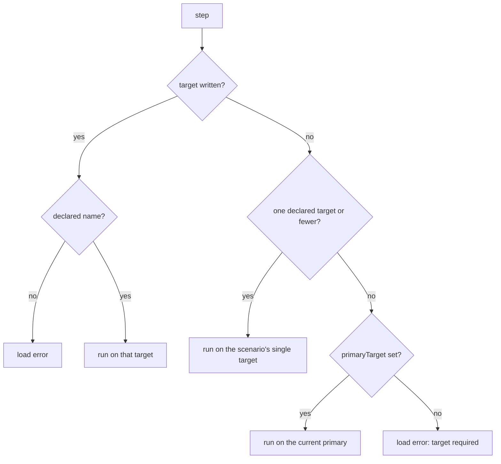
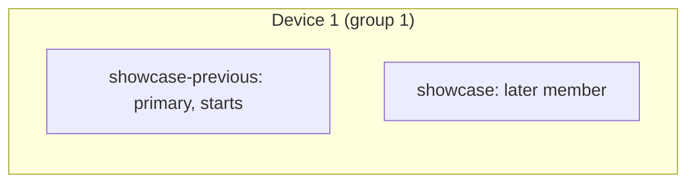
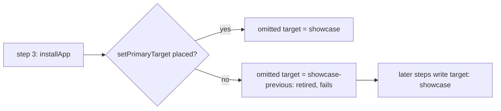
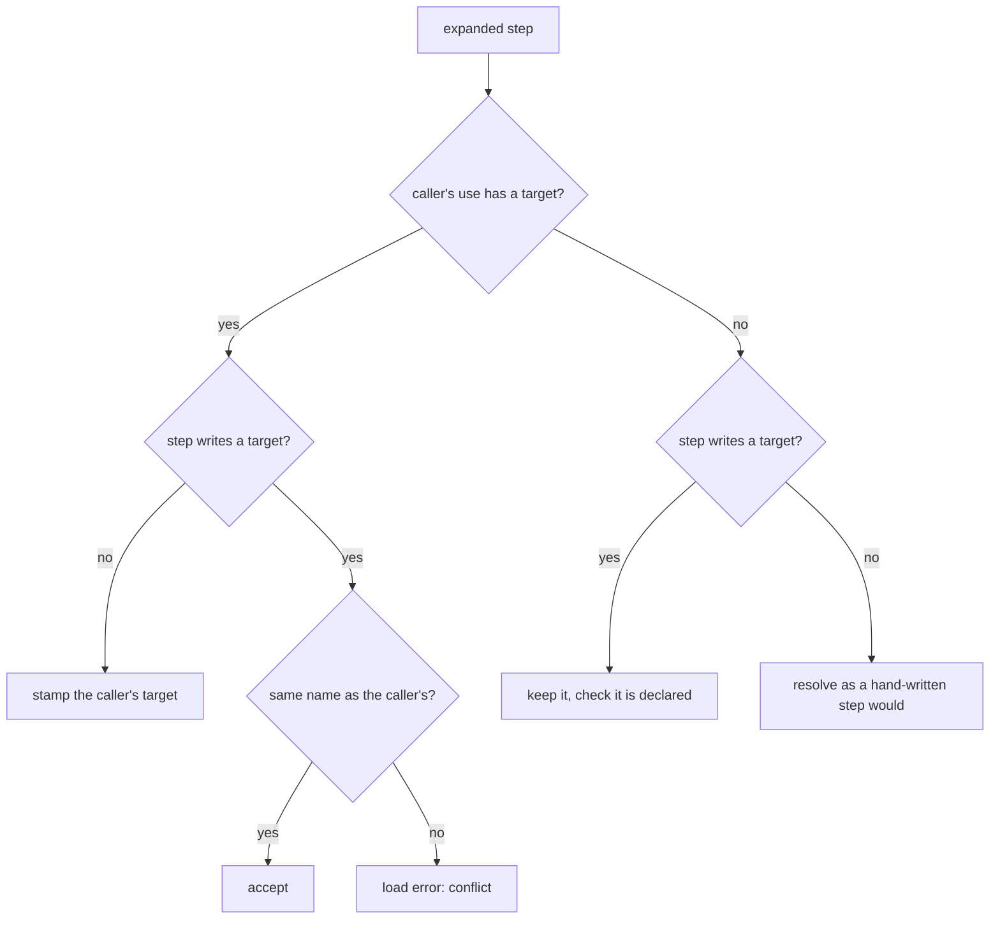

**English** · [日本語](BE-0447-install-app-step-ja.md)

# BE-0447 — Let a scenario install several apps

<!-- BE-METADATA -->
| Field | Value |
|---|---|
| Proposal | [BE-0447](BE-0447-install-app-step.md) |
| Author | [@0x0c](https://github.com/0x0c) |
| Status | **In progress** |
| Tracking issue | [Search](https://github.com/bajutsu-e2e/bajutsu/issues?q=is%3Aissue+label%3Aroadmap-tracking+in%3Atitle+"BE-0447") |
| Implementing PR | [#2104](https://github.com/bajutsu-e2e/bajutsu/pull/2104) (unit 1) |
| Topic | Scenario authoring features |
<!-- /BE-METADATA -->

## Introduction

A Bajutsu target is one app plus the settings that drive it. A scenario gives each target it
declares its own device. This item adds four constructs to the scenario:

- A nested array in `targets` lists targets that share one device.
- An `installs` key names the members that install before the first step besides the primary,
  which always does.
- An `installApp` step installs the others later, at the point where the journey needs them.
- A `setPrimaryTarget` step moves the default target to another member, such as the build an
  `installApp` step installed.

Two journeys become expressible that are not today. The first is a companion app, such as a
multi-factor authentication (MFA) app that shares the device with the app under test. The second is
an app update, where an old build creates data and a new build installs over it. The config schema
does not change, so every existing config and scenario keeps working unchanged.

## Motivation

Today `targets.<name>.appPath` names one binary, and `run` installs it during preconditions. The
`reinstall: overwrite` precondition keeps the app's data container across that install. The
`relaunch` step restarts the process. Yet nothing installs a second binary once the scenario is
running. A tester who wants to check that version 2 migrates the data version 1 wrote cannot say it
in one scenario. The one workaround is two scenarios run back to back on the same device. That
workaround splits one user journey in two and leaves the run order as an unwritten assumption.

Multi-target scenarios do not close the gap. A scenario's `targets` list launches every declared
target before the first step. Each target holds its own device, so two iOS targets need two devices
(`docs/scenarios.md`, "Limits"). An update needs two builds of the same bundle on one device, and an
MFA companion needs two apps on one device.

The observable outcome is a single scenario in the showcase demo. The scenario starts on an old
build, creates data, installs the current build over it, and asserts that the data survived the
update. That scenario passes on iOS and on Android, and no existing config or scenario needs an edit.

## Detailed design

### Targets stay the unit that describes an app

Nothing about the config schema changes. A target already carries what identifies and installs one
app. That means its bundle identifier or package, its `appPath`, its `build` command, and the
settings that drive it. Two builds of one app are two targets that share an identifier and differ
in `appPath`. A companion app is a target of its own. Settings the builds share move to the
`defaults` layer. The config already merges that layer into every target (`docs/configuration.md`,
"Config layering").

```yaml
targets:
  showcase-previous:                      # the old build the scenario starts on
    backend: xcuitest
    bundleId: com.example.showcase
    appPath: build/Showcase-1.app
  showcase:                               # the current build
    backend: xcuitest
    bundleId: com.example.showcase
    appPath: build/Showcase-2.app
  authenticator:                          # a companion app
    backend: xcuitest
    bundleId: com.example.authenticator
    appPath: build/Authenticator.app
```

### Sharing a device: a nested array in `targets`

The scenario's `targets` list gains one form. An element is a target name, as today, or an array of
target names. An array is a device group. Its members can run on one device. The scenario leases
one device for the group instead of one per member. A bare name is a group of one, so a scenario
that writes no array behaves as it does today.

The scenario model enforces three rules:

- A name appears once across the whole list, as today.
- A group holds two or more names, since a one-name array adds nothing over a bare name.
- `primaryTarget` still must equal the first entry, which now means the first member of the first
  group.

Run preflight, which sees the config, enforces a fourth: the members of a group can share one
device. They need each of the following:

- The same native backend platform. A web target has no device to share, so it cannot belong to a
  group of two or more.
- The same device route (`deviceProvider`, `device`, and `xcuitest.deviceType`).
- The same effective `locale`, since iOS pins the Simulator's system locale.

Preflight refuses a group whose members disagree before it acquires any device. The device count a
run needs is the number of groups per backend. The up-front check that refuses a pool with too few
devices counts groups. `--udid a,b` supplies one device per group.

Once the flattened list holds two or more names, the existing rule applies: a step that omits
`target` needs `primaryTarget`. For that reason a grouped scenario sets it, as both examples below
do.

Existing code that reads `Scenario.targets` reads it through one flattening accessor when it needs
the names alone. That code lives in these modules:

- `bajutsu/common/scenario/models/scenario/_targets.py`
- `bajutsu/common/runner/pipeline.py`
- `bajutsu/run/cli.py`
- `bajutsu/serve/operations/reads.py`
- `bajutsu/analysis/cli/audit.py`

Validation in the scenario model, run preflight, and the lease step read the group structure
itself. A flattened list could not catch a malformed group.

### Choosing what installs first: `installs`

A group can hold two or more app targets, and not all of them belong on the device at the start.
The primary, the first member of the first group, always installs and launches at the start. That
holds whether the scenario declares `primaryTarget` or not, since the runner treats it as the
primary in either case. A separate top-level key, `installs`, adds the other members that start
with the primary. `installs` is a list of target names. `targets` keeps the grammar above.

| Situation | Rule |
|---|---|
| The primary (the first member of the first group) | Installs its `appPath` before the first step and launches at the start. Listing it in `installs` is optional. |
| Any other group of one member (a bare name) | The member installs at the start, as today. Listing it is optional. |
| Any other group of two or more members | The scenario must list at least one member. A group with none listed fails to load, so the choice is never implicit where the primary does not anchor it. |
| A listed member | Installs its `appPath` before the first step and launches at the start, like any declared target. |
| Any other member of a group of two or more, left out of `installs` | The later member: it installs and launches nothing at the start. It comes alive through an `installApp` step and a `foreground` step, below. |

Every name in `installs` is a member of `targets`. Members that start in one group must not share a
bundle identifier or package. Installing both would leave one build on the device. That check needs
the config, so the run's preflight makes it. Members that start launch in reverse declared order.
Each group's first starting member is then in front when the first step runs.

An update scenario starts on the old build and holds the new one back:

```yaml
- name: notes survive the 1 to 2 update
  targets: [[showcase-previous, showcase]]
  primaryTarget: showcase-previous
  steps:
    - tap: { id: notes.add }
    - type: { text: hello, into: { id: notes.field } }
    - installApp: { from: showcase }
    - setPrimaryTarget: { target: showcase }
    - foreground: {}                 # the omitted target is now showcase
    - assert:
        - exists: { id: notes.item, label: hello }
```

A companion scenario starts the authenticator alongside the primary. It keeps a second device for a
web client:

```yaml
- name: read the code in the authenticator, enter it in the app
  targets:
    - [showcase, authenticator]     # one device holding both apps
    - showcase-web                  # a separate device
  primaryTarget: showcase
  installs: [authenticator]
  steps:
    - target: authenticator
      foreground: {}
    - target: authenticator
      tap: { id: code.show }
      extract: { code: { sel: { id: code.value } } }
    - target: showcase
      foreground: {}
    - target: showcase
      type: { text: "${vars.code}", into: { id: login.otp } }
```

### Preparing a group's device

A group's members share one device, so device-wide preparation runs once per group, not once per
member. The preparation covers booting, the erase, the system locale pin, and seeded photos. It
uses the scenario's preconditions. Each member then takes a per-member path with three steps:
install, attach its driver, and launch. That path never repeats `erase`. It never applies
`reinstall: clean` to an app it did not install itself. A starting member's install at the start
follows `reinstall` for that member. A later member's `foreground` never uninstalls or clears the
build that an `installApp` step put there. Take a companion group with `erase: true`. The
preparation wipes the device once, before any member installs. The second starting member does not
wipe the first.

### The `installApp` step

| Step | Meaning |
|---|---|
| `installApp: { from: <target>, keepData?: boolean }` | Installs the build of the group member `from` onto the device the step runs against. The step's own `target` modifier picks the device through its group, and an omitted one means the primary. `keepData` defaults to `true`: the build installs over an existing one and the data container survives. `false` uninstalls the same identifier first. |

`from` names a later member of the same group as the step's target. A later member is neither the
primary nor listed in `installs`, and it does not sit in a group of one. The scenario model refuses
a `from` that names a starting member, so this step never reinstalls a member that is running.

A later member installs once per scenario. The scenario model refuses two top-level `installApp`
steps for one member. An `installApp` inside `forEach`, `if`, or an `interrupts` recovery that runs
a second time fails at run time with a named error. The scenario model checks these rules from the
scenario alone, since `targets` and the routing rule already live there. The reader thus sees every
build a scenario can install in its header.

`web:` and `app:` blocks refuse an `installApp` step. In an `interrupts` entry's recovery steps, an
omitted `target` resolves the group through the entry's own `target`. When the entry omits one, the
primary resolves the group. `run` preflight checks the rest against the config:

- The target defines an `appPath` that exists.
- The target is not a web target.
- On a Git-sourced config, the binary builds on demand, as it does for the primary target today.

The scenario names a target, never a path, so the build artifact stays in config (prime directive
3).

The step terminates any running app with `from`'s identifier and installs the build. It leaves the
launch to the scenario: a `foreground` step for the member follows, as in the examples.

Retirement follows the identifier alone:

- When `from` has the same bundle identifier or package as a member that already runs, the install
  replaces that member's app. The older member retires. A step addressed to it afterwards fails
  with a named cause instead of reaching the new build.
- When `from` has a different identifier, the install adds a second app beside the first. No member
  retires, and both stay addressable by `target`.

A later member has three states: not installed, installed but not launched, and running.

- Until this scenario has run its `installApp`, `installApp` and `setPrimaryTarget` alone may
  address the member. `foreground` fails with a named not-installed error. It never launches a
  stale build that an earlier scenario left on a reused device.
- Between the install and its `foreground`, `foreground` and `setPrimaryTarget` alone may address
  the member. Any other step fails with a named error. The error says the member has not launched
  yet and points at `foreground`.

Like a starting member, a running later member retires when another member with its identifier
installs. The retired rule, like the not-installed rule, does not apply to an `installApp` step's
`target`, which merely picks the device. The load refuses a `setPrimaryTarget` that names a retired
member.

### Moving the default target: `setPrimaryTarget`

| Step | Meaning |
|---|---|
| `setPrimaryTarget: { target: <target> }` | From this step on, a step, an `interrupts` entry, or a top-level `expect` entry that omits `target` resolves to the named target. |

After an update whose builds share one identifier, the declared primary is the retired member.
Without this step, every later step, assertion, and interrupt would name the installed member. The
step changes routing and nothing else. Routing here includes the member that each `interrupts`
entry omitting `target` guards. Today the runner assigns those entries once from the initial
primary. This item makes the assignment follow the current primary. `target` names any declared
target.

The first member of the first group still governs leasing, evidence directories, and crash
recovery. The run fixes all three at the start (BE-0428). Each member keeps its own config, driver,
and environment, so the step swaps nothing mid-run. It moves the default to a member whose
`launchEnv`, `locale`, `ready_when`, and baselines already applied to the steps that named it.

`setPrimaryTarget` may appear among a scenario's top-level `steps` alone, never inside any of these:

- `if` or `forEach`
- a target group (BE-0437)
- `web:` or `app:`
- an `interrupts` entry

That placement lets the scenario model follow the current primary in order. The model can then
check every later omitted `target` and every `installApp.from` statically. The exception is an
`installApp` in an `interrupts` entry's recovery steps, whose group depends on when the entry runs.
Once a scenario contains a `setPrimaryTarget`, such a step must name its device explicitly, on the
step or on the entry. Otherwise the load fails. The not-installed rule does not apply to
`setPrimaryTarget`, so the step can precede the member's `installApp` and `foreground`.

A top-level `expect` entry that omits `target` resolves to the primary in force after the last
step. Every top-level `expect` entry, whether it omits `target` or names one, passes the same
installed-and-running guard as a step. An entry fails with the named error when it resolves to a
member that is not installed, retired, or not in front. For a backgrounded member, the error points
at `foreground`. The entry fails instead of polling a stale or background app. A grouped scenario
can thus assert the end state of one member alone: the member in front after the last step.

An `interrupts` entry that omits `target` follows the current primary at run time. The runner does
not poll an entry that resolves to a later member until that member's `foreground`. The runner
stops polling an entry that resolves to a retired member. The `before` and `after` rules resolve an
omitted `target` to the declared primary, since teardown runs wherever the run stopped. In an
update scenario that primary is the retired member, so its `after` steps name their target.

### Using these steps inside components

`use:` and `group:` expand at load time. Expansion stamps the caller's `target` onto expanded steps
that omit one (BE-0446). Three rules keep the new steps consistent with that stamping:

- `setPrimaryTarget` takes its target as an argument, not as the step modifier, so it needs an
  explicit exemption. Both stamping points skip it: a `use:` or `group:` caller's, and a target
  group's. A caller's `target` never reaches it. The loader refuses a modifier `target` written on
  it by hand.
- The top-level-only rule for `setPrimaryTarget` applies after expansion. A component's
  `setPrimaryTarget` is valid when the `use:` or `group:` that calls it is itself among the
  top-level `steps`. The component's `setPrimaryTarget` is invalid when the call sits inside `if`
  or `forEach`.
- An `installApp` inside a component names `from` and leaves the device to the step's `target`. That
  `target` gets stamped or resolved like any expanded step's. The check that `from` is a later
  member of that target's group runs after expansion, at the call site. Its error names the
  component chain and the step.

Expansion records the component chain on each step it produces, so the post-expansion check can
name it. Before expansion, the load-time pass cannot see a component's `setPrimaryTarget`. For that
reason, after the first top-level `use:` or `group:` step, the pass stops resolving omitted targets
and checking `installApp.from`. It leaves both to the pass that runs after expansion.

### Switching between apps on one device

A device shows one app at a time, so the scenario switches explicitly. Given a member's `target`,
the `foreground` step brings that member's app to the front without terminating it. An omitted
`target` means the primary. The runner never switches on its own when the `target` of consecutive
steps changes. Every hop is thus a line the reader can see.

`foreground` exists on iOS today and raises "not supported" on Android. This item adds the Android
implementation, which starts the member's launcher activity without clearing its state. The
capability preflight gates `background` and `foreground` under one token,
`deviceControl.appLifecycle`, which Android does not advertise. The token splits in two, and the
adb backend advertises `foreground` alone.

`foreground` also gains a second behavior on both platforms. It may launch an app that was not
running, as after an `installApp`. It then performs `relaunch`'s launch without the terminate,
which brings the following:

- The same launch environment and arguments: config, scenario preconditions, locale, and the
  environment's own extra environment such as the collector URL.
- The same launch-marker stamp for crash attribution (BE-0424).
- The readiness wait.
- On Android, the settle-cache and exit-info resets.

When the app already runs, `foreground` merely brings the app to the front. `relaunch` keeps its
own meaning, including its `env` and `args`, for scenarios that restart a running app.

On a device shared by two or more members, each member's driver checks that its own app, not
another member's, is in front. The check runs before the driver resolves a selector, as part of
that step's existing condition wait. On Android the check reads the packages on the dump's nodes.
On iOS it reads its own app's state after pointing the shared runner at that app. A step addressed
to a member whose app does not come to the front within that wait fails with a named cause
pointing at `foreground`.
The step never runs against another app's tree, since resolving there would act on an element the
step never meant (prime directive 2). A device that holds one target skips the check. Existing
scenarios, the `app:` block, and system dialogs thus behave as today.

The device cannot distinguish members that share an identifier. For those members, the runner
keeps its own record of which member's build installed last. A step addressed to a retired member
fails by that record. The device check covers members with distinct identifiers.

### Worked example: how `target` resolves

This section gathers the resolution rules in one place and follows the update scenario through them.
The first diagram is the rule that exists today (BE-0428, BE-0436). This item changes one thing in
it: what "the current primary" means.



The primary is the first member of the first group until a `setPrimaryTarget` step moves it. A
device group gives one device to two or more targets:



The table follows the update scenario step by step. The third column shows what an omitted `target`
resolves to. The last two columns show the state of the two members. Both builds here share one
bundle identifier, so the install retires `showcase-previous`. A build with another identifier
would install beside it and retire nothing.

| # | Step | Omitted `target` resolves to | `showcase-previous` | `showcase` |
|---|---|---|---|---|
| 1 | `tap` | `showcase-previous` | running | not installed |
| 2 | `type` | `showcase-previous` | running | not installed |
| 3 | `installApp: { from: showcase }` | `showcase-previous` | retired | installed, not launched |
| 4 | `setPrimaryTarget: { target: showcase }` | `showcase` | retired | installed, not launched |
| 5 | `foreground` | `showcase` | retired | running |
| 6 | `assert` | `showcase` | retired | running |
| – | top-level `expect` | `showcase`, the primary in force after the last step | retired | running |
| – | an `after` step | `showcase-previous`, the declared primary, so it names `target: showcase` | retired | running |

Without the `setPrimaryTarget` step, steps 5 and 6 resolve to the retired member and fail. Every
later step, assertion, and interrupt must then write `target: showcase`:



Inside a component, the caller's `target` and the expanded step's own `target` combine as follows
(BE-0446). `setPrimaryTarget` is the one step kind that expansion never stamps, wherever it sits.
Steps inside a `web:` or `app:` block receive the target through their block:



A step writes `target` in the cases below and no others:

| Situation | Whether the step writes `target` |
|---|---|
| A scenario with one target | No |
| Two or more targets, `primaryTarget` set | Only a step for a member other than the current primary |
| Two or more targets, no `primaryTarget` | Every step and every `expect` entry |
| After a `setPrimaryTarget` | Only a step for a member other than the new primary |
| Driving a companion app in the same group | Yes: its `foreground` and the steps that drive it name it |
| A `before` or `after` step once the declared primary is retired | Yes |
| A top-level `expect` entry in a scenario with a device group | Name the member; it can assert only what is in front after the last step |
| Inside a component | A single-target component: no, the caller's `target` is stamped. A cross-target component: yes, each step names its own |

### Backend behavior

| Backend | Behavior |
|---|---|
| XCUITest (iOS Simulator) | `simctl install` over the existing bundle keeps the data container, which `reinstall: overwrite` already relies on (`xcuitest_environment.py:974`). Digest skipping stays a precondition optimization and never applies to the step, since the step is explicit. An `installApp` step resets the tracked digest on every member's environment on that device, not only on the member it installed, since each member tracks device-scoped state of its own. A later `reinstall: overwrite` precondition therefore never skips installing over a build the step put there. |
| Android (adb) | `adb install -r` keeps app data. Going to an older build fails on Android, so a downgrade needs `keepData: false`, and the environment names that cause in the error. |
| Web | Rejected before any device is leased, through the capability check each target's steps already pass. |
| Device-cloud lease that hands over an installed build | Rejected with a named cause, since the provider holds the binary and the local path does not exist (BE-0236). |
| Code generation (XCUITest, UIAutomator) | Emits the generator's usual unsupported-step marker; the generated test has no equivalent. |

Whether the OS stops the running process on a same-bundle install differs by platform. The
implementation confirms the behavior on a device instead of assuming it. The explicit terminate
makes the outcome the same either way.

### Facts to confirm on a device first

A device group needs some facts confirmed on a device before the design is final:

- On iOS, whether one Simulator can run two XCUITest runners at once.
- On Android, whether one device can serve two drivers, one per package.

If either cannot, the group's members share one driver that switches the app under test between
steps, the way the `app:` block does today. The grammar above stays the same in both cases. The
change stays inside a group's lifecycle.

The same check covers four more facts:

- That the new Android `foreground` brings a member's app to the front.
- How each platform reports which app is in front. The driver check above depends on it.
- How `foreground` tells a not-running app from a backgrounded one.
- When a later member's driver starts: at its first `foreground` after the `installApp`, if the
  two-driver case holds.

The check also confirms that a companion group with `erase: true` keeps both apps. It confirms, too,
that data survives an `installApp` followed by `foreground`.

### Scope

An `installApp` step never moves the primary by itself. The scenario says so with
`setPrimaryTarget`, so the point where routing changes is a line the reader can see. Until then,
steps that omit `target` resolve to the primary the scenario declared. When the `installApp`
replaced that primary's own build (the same identifier), the primary is the retired member. A step
after the install then either names the installed member or follows a `setPrimaryTarget`.

This item does not add an Android downgrade path beyond `keepData: false`. It does not remove or
rename any config field, and it does not change the `app:` block. The step never chooses a verdict,
so the deterministic gate stays untouched.

### Work breakdown

1. Scenario model: the nested `targets` form, `installs`, and their rules. The unit also adds the
   flattening accessor that every reader of `targets` moves to.
2. Lease and lifecycle. This unit opens with the on-device checks above. It covers:
   - one device per group, and the device count per backend;
   - one device-wide preparation per group;
   - each starting member's environment, started on the shared device by a path that repeats no
     destructive precondition;
   - a later member's environment, started at its first `foreground`;
   - the current primary, which `setPrimaryTarget` moves at run time;
   - the reassignment of omitted-target `interrupts` entries when the primary moves (today the
     runner assigns each entry once from the initial primary);
   - polling suppressed until a later member's `foreground`;
   - a regression test for both the reassignment and the suppressed polling.
3. Scenario model, for the `installApp` and `setPrimaryTarget` steps:
   - the `installApp` step's shape, and its check that `from` is a later member of the step
     target's group, including its placement rules inside `web:`/`app:` and `interrupts`;
   - the `setPrimaryTarget` step, with its top-level-only placement and the in-order tracking of the
     current primary;
   - how both steps behave when a component or group expands them.

   The tracked primary is a local of the walk. It never writes to `primary_target`, since several
   points check `primaryTarget` against the first entry. Top-level `expect` entries that omit `target`
   resolve with the tracked primary, where today they group under the run's fixed primary. Both
   stamping points skip `setPrimaryTarget`, and expansion records the component chain.
4. Run preflight:
   - check each `installApp.from` target against the config: its `appPath` exists, and the run
     builds it where the run already builds one;
   - refuse starting members of one group that share an identifier;
   - refuse a group whose members differ in backend platform, device route, or system locale;
   - refuse any web target in a group of two or more.
5. XCUITest environment and driver:
   - the install action, the digest reset, and the terminate;
   - `foreground`'s launch, readiness wait, and launch marker. The unit builds them beside the
     relauncher, which already holds the effective config, scenario, and driver;
   - the front-app check in `xcuitest_driver`.
6. Android environment and driver:
   - the install action with the downgrade error;
   - `foreground`'s launch, readiness wait, and launch marker, built beside the relauncher;
   - the front-app check in `adb_driver`;
   - the split of `deviceControl.appLifecycle`.
7. Backend handling: web and device-cloud rejection, and the code-generation marker.
8. Documentation in both languages: `docs/scenarios.md`, `docs/dsl-grammar.md`, `docs/architecture.md`.
9. Showcase demo on both platforms. It adds an older build as its own target, the update scenario,
   and a companion-app scenario.

## Alternatives considered

| Option | Why not |
|---|---|
| An `apps` map inside each target, with `primaryApp` and a `startApp` precondition | Builds a second, per-target registry of apps beside `targets`. Identifiers belong to apps, so `bundleId` and `appPath` would move off the target, which breaks every existing config and touches more than 90 files, and it adds a primary rule beside `primaryTarget`. |
| A header list of build sources outside the groups, `installSources: [showcase]` | Cannot say which device receives the build once a scenario holds more than one. Making the install sources members of a device group ties each build to its device. |
| Members written as `{ start, later }` objects inside `targets` | Gives `targets` three shapes (a name, an array, an object) and changes every reader. A separate `installs` key leaves `targets` as the flat-or-nested list it already is. |
| An `on: <target>` key that makes one declared target share another's device | Adds a keyword beside `targets`. The nested array states the same fact with no new key. |
| Drive a companion app only through the `app: { bundleId, steps }` block | Changes nothing, but the block is iOS only and puts a bundle identifier in the scenario, against prime directive 3. Android could not drive a companion app at all. |
| `installApp: { path }` with the path written in the step | The scenario would carry a build artifact path. That leaks a per-app detail into the scenario, breaks on another machine, and violates the app-agnostic principle. |
| Two scenarios run in sequence with `reinstall: overwrite` | No DSL change, but the journey splits in two, the run order becomes an unwritten contract, and a failing run no longer reads as one journey. |
| List both builds in a group and install both at the start | The second install overwrites the first, so the scenario could never begin on the old build. Only the primary and the members `installs` lists start, so the new build waits for its `installApp`, and preflight refuses two starting members with one identifier. |
| Name the installed member on every step after an update | Correct, but every later step, assertion, and interrupt repeats the same name, and a forgotten one resolves to the retired member and fails. |
| Let `installApp` switch the primary target by itself, explicitly (`becomes: primary`) or when the identifiers match | Hides the point where routing changes inside a step that reads as an install, and an identifier match cannot express a companion. A separate `setPrimaryTarget` step names the switch on its own line, and needs no mid-run config swap because each member already owns its config, driver, and environment. |

## Progress

> Keep this current as work proceeds. The checklist mirrors the MECE work breakdown in
> *Detailed design* (one box per unit of work); the log records what changed and when
> (oldest first), linking the PRs.

- [x] Unit 1: nested `targets` form, `installs`, and flattening accessor
- [x] Unit 2: device-group lease and lifecycle, after the on-device checks
- [x] Unit 3: `installApp` and `setPrimaryTarget` steps
- [x] Unit 4: run preflight and validation
- [x] Unit 5: XCUITest environment and driver
- [x] Unit 6: Android environment, driver, and `foreground`
- [x] Unit 7: backend handling
- [ ] Unit 8: documentation in both languages
- [ ] Unit 9: showcase demo, update and companion scenarios

Log:

- [#2104](https://github.com/bajutsu-e2e/bajutsu/pull/2104) — Unit 1. `Scenario.targets` now accepts a
  device group (an array of two or more names) alongside a bare name, and a new `installs` key
  names the members that start with the primary. The scenario model refuses six things: a name
  repeated anywhere in `targets`, an array of fewer than two names, a `primaryTarget` that is not
  the first member of the first group, an `installs` entry naming no declared target, a repeated
  `installs` entry, and a group outside the primary's that lists none of its own members. Two
  accessors, `device_groups` and `target_names`, replace direct reads of `targets` in the runner
  pipeline, the `run` and `audit` CLIs, and the serve evidence lookup. Until unit 2 leases one
  device per group, `run_all` and the `run` CLI refuse a scenario that declares a device group,
  since a flattened run would lease a device per member and start every one of them.
- Unit 2. The members of a device group share one driver, the fallback the design names for
  devices that cannot serve two drivers. The code already settles that question without a device
  run: the XCUITest runner's discard terminates the XCTRunner bundle every runner shares, and the
  Android resident server is one per device with a fixed device port. The environment seam gains
  `start_member` / `end_member`, the pool's lease gains `join`, and a new `deviceGroup` capability
  gates a group in preflight; only the fake backend advertises it until units 5 and 6. The
  pipeline leases one device per group for its last starting member, joins the others in reverse
  declared order, and stops every member's app before the device returns to the pool. `run`
  counts devices per group. A `TargetRoster` holds each later member's lifecycle and the current
  primary: a step addressed to a member that is not running fails with a named cause, a later
  member comes up at its first `foreground`, and an `interrupts` entry that omits `target` polls
  on the current primary, while a member that is not running polls nothing. The members share
  the group's network collector, so its traffic is written once; telling one member's requests
  from another's waits for units 5 and 6.
- Unit 3. The `installApp: { from, keepData }` and `setPrimaryTarget: { target }` steps. The
  scenario model follows the current primary through the top-level steps in order, so every later
  step and `expect` entry that omits `target` resolves to it. It refuses a `setPrimaryTarget` off
  the top level, an `installApp.from` that is not a later member of the step's own device group,
  a member installed twice at the top level, an `installApp` inside `web:` / `app:`, and a
  recovery `installApp` that leaves its device implicit once the primary moves. Expansion never
  stamps a caller's `target` onto `setPrimaryTarget` and refuses one inside a target group. At run
  time the step loop drives the target roster: `installApp` installs through the environment's new
  `install_member` (the fake backend only until units 5 and 6), retires every installed member
  sharing the build's identifier, and refuses a second install of one member; `setPrimaryTarget`
  moves the primary that `interrupts` entries omitting `target` and the final `expect` follow, and
  an `expect` entry resolving to a member that is not running fails by name. Two deviations. An
  error inside an expanded component names the `group:` it came from but not a `use:` chain, since
  expansion records only the former on a step. And whether a `setPrimaryTarget` names a retired
  member depends on identifiers, which only the config holds, so the run refuses it with a named
  cause instead of the load; unit 4's preflight can add the static check.
- Unit 4. `run` checks every device group against the config before any device is acquired, and
  exits 2 with each cause named. A group's members must share one platform, one device route
  (`deviceProvider`, `device`, `xcuitest.deviceType`), and one effective system locale, and none
  may be a web target. Starting members of one group must not share a bundle identifier or
  package. Each `installApp.from` target must define an `appPath` that exists, and a Git-sourced
  config builds it on demand, as it already does for the primary. The check also closes unit 3's
  deviation as a `run` preflight rather than at load, since the identifier lives in config: walking
  `before` and the top-level steps in order, it refuses a `setPrimaryTarget` that names a member an
  earlier `installApp` retired. Each build is checked once for the whole run. `Effective.app_identifier` names the identifier both this
  check and the runner's retirement read.
- Unit 7. A web target in a device group is already refused before any device is leased, by unit
  4's preflight and by the `deviceGroup` capability web never advertises. A device provider that
  hands its device over with the app preinstalled now refuses a group on it, once the device is
  reserved and inside the region that releases every reservation: the provider holds the binary,
  so there is no local build to install beside it. Every code generator (XCUITest, UI Automator,
  Playwright) renders `installApp` and `setPrimaryTarget` as a labeled `// TODO`, though `codegen`
  already refuses any scenario declaring two or more targets before it reaches them.
- Unit 6. Android shares a device between a group's members. The emulator environment gives each
  member its own `AdbDriver` over the one resident channel. A starting member installs under its
  own reinstall mode without the device-wide clears, and a later member starts launch-only.
  `installApp` force-stops the app and runs `install -r`, uninstalling first for
  `keepData: false`; it names the cause when Android refuses a downgrade that keeps data.
  `foreground` resumes a running app, and launches one that is not running the way `relaunch`
  would, without the terminate: launch env, launch marker, settle-cache and exit-info resets, and
  the readiness wait. Once a device holds a second member, each member's driver reads the
  packages on the dump's nodes and raises a named `AppNotInFront` for another app's tree, never an
  empty one, so no check can pass on a screen it was not looking at. The readiness wait treats it
  as transient. `deviceControl.appLifecycle` splits into `deviceControl.background` and
  `deviceControl.foreground`, and adb advertises `foreground` and `deviceGroup`. One deviation: a
  step addressed to a member that is not in front fails at its first read rather than polling
  within its condition wait, since every action settles through that read; the `foreground` that
  brings a member up does wait, and fails by name if the app never reaches the front. Two gaps
  remain: the app-crash sweeps (exit-info aside) still read the primary's app, so a member's
  native crash can be attributed to the primary; and on the `uiautomator dump` fallback, which
  reads the active window alone, a system dialog over a member reads as another app in front. And
  an `installApp` with `keepData: false` re-grants the config's `grantPermissions` but not the
  scenario's own `permissions`.
- Unit 5. iOS shares a Simulator between a group's members through the lease's one XCUITest
  runner. The runner gains `/app/target`, which replaces the base of its app stack with another
  bundle and activates nothing; an `/app/enter` block stays above the new base. Each member's
  driver retargets the runner to its own app only when another member was the last to address it,
  and once a second member joins, every member's read first asks `/app/state` and raises a named
  `AppNotInFront` unless its own app is `runningForeground`. `start_member` installs a member under
  its own reinstall mode (the device-wide erase already ran), applies its permissions, and
  launches it with its own launch env; a later member starts launch-only. `installApp`
  terminates, installs over the existing bundle (uninstalling first for `keepData: false`), and
  resets the tracked digest, so a later lease's `reinstall: overwrite` never skips its own
  install. `foreground` resumes a running app as before and launches one that is not running with
  `relaunch`'s env and args and a fresh launch marker; on a shared device it then waits for the
  app to reach the front and fails by name if it never does. A warm runner a previous lease's
  group retargeted is pointed back at the next lease's app. A real iPhone drops `deviceGroup`,
  since nothing installs a second build there. The same two gaps as Android hold: the `.ips` crash
  sweep still reads the lease's own app, and a member's driver carries no `nativeZ` responder.

## References

- [BE-0428](../BE-0428-multi-target-scenario-execution/BE-0428-multi-target-scenario-execution.md) and [BE-0436](../BE-0436-primary-target-default/BE-0436-primary-target-default.md): multi-target scenarios and the primary target this design builds on.
- [BE-0365](../BE-0365-in-app-control-channel/BE-0365-in-app-control-channel.md): the precedent for changing the app's state after launch.
- [BE-0236](../BE-0236-device-cloud-provider-abstraction/BE-0236-device-cloud-provider-abstraction.md): the provisioning profile a device-cloud lease carries.
