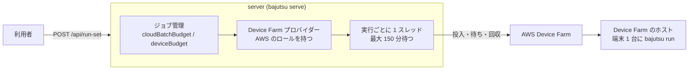
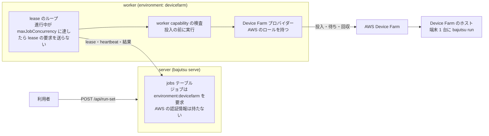

[English](BE-0448-devicefarm-worker-dispatch.md) · **日本語**

# BE-0448 — Device Farm へジョブを投入する worker

<!-- BE-METADATA -->
| 項目 | 値 |
|---|---|
| 提案 | [BE-0448](BE-0448-devicefarm-worker-dispatch-ja.md) |
| 提案者 | [@0x0c](https://github.com/0x0c) |
| 状態 | **承認済み** |
| トラッキング Issue | [検索](https://github.com/bajutsu-e2e/bajutsu/issues?q=is%3Aissue+label%3Aroadmap-tracking+in%3Atitle+"BE-0448") |
| トピック | Device-cloud execution |
<!-- /BE-METADATA -->

## はじめに

`environment` が `devicefarm` の worker が、Device Farm への投入そのものを行います。worker は、キューからシナリオごとのジョブを lease し、AWS Device Farm に実行を投入して待ち、判定を返します。AWS の認証情報は、その worker が持ちます。現在は同じ投入処理が server のプロセスの中で動くため、server が AWS のロールを持ち、長い待ちのたびにスレッドを 1 つ占有します。本項目は、その投入を、ホスト型がローカル実行にすでに使っている worker のモデルに移します。別の種類の worker は作りません。worker は worker であり、何を担当できるかは、worker capability で宣言します。

**ジョブ同時実行の予算**も worker が持ち、worker capability のファイルで述べます。`worker.yaml` の最上位の `maxJobConcurrency` が、worker が同時に進行できるジョブの数です。worker は、満杯のあいだ lease の要求を送りません。lease するかどうかの判断とデバイスを確保するかどうかの判断が、1 か所での 1 つの判断になります。worker と server は、同じマシンで動かせます。

本項目は、`worker.yaml`、`--worker-config`、`maxJobConcurrency`、`maxTargetsPerJob` を定義する worker capability の項目の上に成り立ちます。また、server がジョブを一切実行しないようにする項目と一体です。server がジョブを実行しなくなれば、Device Farm の投入は、worker の経路以外を持たなくなります。

## 動機

[BE-0336](../BE-0336-serve-device-farm-bounded-fan-out/BE-0336-serve-device-farm-bounded-fan-out-ja.md) の Device Farm へのファンアウトは、現在、server が自分のプロセスの中で投入の全体を実行するときだけ動きます。その Unit 5 で、worker 経由の経路の部品はすでに用意されました。依頼はジョブの仕様（`Job.batch`）に載って運ばれ、予約した実行の識別子（ARN）は DB に保存されるので、再度 lease されたジョブは、投入し直さずに待ちを再開します。ただし経路は完成していません。[`jobs.py`](../../bajutsu/serve/jobs.py) の `_run_batch_job` の docstring によれば、worker はパッケージの置き場を持たない状態を自分で作るので、キューから lease した Device Farm のジョブは、サービスのパッケージ検証で失敗します。`run-set` のエンドポイントは、ファンアウトがまだ分割構成で動かないため、[BE-0431](../BE-0431-job-scoped-artifact-override/BE-0431-job-scoped-artifact-override-ja.md) のジョブ単位のアーティファクトの上書きも拒否します（[`dispatch.py`](../../bajutsu/serve/operations/dispatch.py)）。

投入を server に置いたままにすると、3 つの問題が残ります。

- **認証情報が置かれるプロセスが違います。** `DEVICEFARM_PROJECT_ARN` が設定されていると、server が Device Farm のプロバイダーを登録します（[`batch_bootstrap.py`](../../bajutsu/serve/batch_bootstrap.py)）。利用者に面するプロセスが、AWS のロールも持つことになります。[BE-0432](../BE-0432-devicefarm-pretest-extension-hook/BE-0432-devicefarm-pretest-extension-hook-ja.md) はすでに、AWS の認証情報で動くものに、クライアントが渡した値を届かせないようにしています。ロールを持つプロセスが少ないほど、その境界は守りやすくなります。
- **長い待ちが server を占有します。** 1 回の実行は最大 150 分かかり、その間、server のスレッドを 1 つ使います。
- **予算を数える場所が、デバイスを確保する場所から離れています。** デバイス予算 `K` は server のジョブ管理の上限であり、確保は投入の中で後から行われます。上限がすでに判断してしまっているので、worker は、lease してよいかを問い合わせられません。

実装後に確認できる違いは 3 つあります。ホスト型のバックエンドと Device Farm 用に設定した 1 台の worker で、Device Farm の target に `POST /api/run-set` を送ると、worker がジョブを lease し、それぞれが、`manifest.json` から判定を決めた実行を残します。待ちの途中で server または worker を再起動しても、ARN が保存されていれば、二度目の投入をせず、同じ Device Farm の実行が再開します。worker が server に HTTP でしか届かない構成でも同じです。実行の予約と ARN の保存のあいだに止まると、二度目の実行が生じうるので、この区間は「詳細設計」に未解決として記録します。そして server のプロセスは、AWS の認証情報を持ちません。

## 詳細設計

### 変更の前後

変更前は、server が投入の全体を自分のプロセスの中で行います。AWS のロールを持ち、予算をジョブ管理で数え、待ちの間、実行ごとに 1 本のスレッドを保ちます。

変更後は、server はジョブをキューに入れるだけです。`environment` が `devicefarm` の worker がそれを lease し、worker capability に照らして検査してから投入します。AWS のロールは worker が持ち、進行中のジョブを `maxJobConcurrency` と比べて、lease してよいかを判断します。server と worker は、同じマシンで 2 つのプロセスとして動かせます。

### worker でのプロバイダーの登録

`worker.yaml` の `environment` にプロバイダー名（たとえば `devicefarm`）を書いた worker は、起動時に、現在 server が行っているプロバイダーの登録（`register_batch_providers`）を呼びます。この関数は、環境変数から `DEVICEFARM_PROJECT_ARN` とリージョンを読み、`BAJUTSU_BATCH_HOOKS` が名指しする batch のライフサイクルフック（[BE-0435](../BE-0435-devicefarm-batch-lifecycle-hook/BE-0435-devicefarm-batch-lifecycle-hook-ja.md)）も読み込みます。したがってフックは、プロバイダーと一緒に移ります。`DEVICEFARM_PROJECT_ARN` が未設定であるなど、プロバイダーを登録できないときは、worker は明確なエラーで終了します。登録できたら、worker はルーティング用トークン `environment:<name>`（たとえば `environment:devicefarm`）を広告します。接頭辞 `environment:` は予約されます。広告できるのはこの登録だけで、非推奨のトークンの入力にこの接頭辞のトークンがあれば、worker capability の項目が拒否します。server は、バックエンドを問わず、プロバイダーを登録しなくなります。

worker は、Device Farm の端末を自分では操作しません。端末は Device Farm のホストのもので、ホストがその端末に対して `bajutsu run` を実行します。したがって環境が `local` でない worker は、`platform:*` トークンを広告せず、`--platform` の既定値を使わず、明示された `--platform` を、起動時に環境を名指ししたメッセージで拒否します。1 つの worker の環境は 1 つなので、1 台のマシンでローカルのジョブと Device Farm のジョブの両方を担当するには、worker が 2 つ要ります。端末の platform（`android` か `ios`）は、依頼に残ります。

### ルーティング

`Job.batch` を持つジョブは、target の `cloudBatch` フィールドから導いた `environment:<name>` の 1 つだけを要求します。`platform:*` トークンも、`host:<os>` トークンも、target の `requires` のトークンも要求しません。端末とそのホストは、Device Farm のものだからです。環境のトークンを要求するのは、`Job.batch` を持つジョブだけです。同じ target からローカルで動くジョブは、ローカルの要求のままです。既存の capability によるルーティング（[BE-0166](../BE-0166-capability-routed-queues/BE-0166-capability-routed-queues-ja.md)）が、広告する集合がその要求を覆う worker にだけ、ジョブを渡します。空の必須集合はどの worker でも担当できるので、部分集合の判定だけでは、ローカルのジョブが Device Farm の worker に渡ってしまいます。そこで `can_serve` のルーティング判定に規則を 1 つ加えます。`environment:*` トークンを広告する worker は、そのトークンを要求するジョブだけを担当します。lease とルーティング不能の数は `can_serve` を共有するので、どちらにもこの規則が効きます。どの worker にも処理できない Device Farm のジョブは、他のジョブと同じく、待機したまま、ルーティング不能として表示されます。

### 認証情報

AWS の認証情報とプロジェクトの ARN は、プロバイダーを登録する worker の環境にだけ置きます。これは、worker にオブジェクトストレージの認証情報を持たせない [BE-0160](../BE-0160-worker-credential-free-uploads/BE-0160-worker-credential-free-uploads-ja.md) の趣旨から外れます。ただし外れる範囲は狭く、認証情報を持つのは、運用者がプロバイダーを設定して起動した worker だけです。証跡は、引き続き署名付き URL で運ばれます。worker と server は、1 台のマシンで 2 つのプロセスとして動かせます。同じホストを共有しても、認証情報は server の環境には置かれません。

### パッケージとアプリの受け取り

Device Farm のパッケージは、Bajutsu 自身のソースツリー（`pyproject.toml`、`tests/`、`bajutsu/`）を根にします。テストの仕様が、そこから Bajutsu をインストールするからです。lease のバンドルのワークスペースには target の config とシナリオしかなく、パッケージの根にはなれません。これが現状の検証失敗の原因です。したがって worker にはソースのチェックアウトが要ります。インストール済みの Bajutsu には `pyproject.toml` と `tests/` がないので、`bajutsu_source_root` は何も返さず、worker は、プロバイダーの登録を、起動時に明確なエラーで拒否します。

ソースルートはすべてのジョブで共有されるので、worker はそこに書き込みません。ジョブごとに専用のパッケージを作ります。ソースツリーの `pyproject.toml`、`tests/`、`bajutsu/` に、そのジョブ専用のバンドルのディレクトリを足して組み立てます。`build_package` は、すでにソースとアーカイブ名の組の一覧を受け取れます。したがってジョブのパッケージには、そのジョブの config とシナリオだけが入り、他のジョブのものは入りません。

server は、依頼のパスを、自分のパッケージの根ではなくバンドルからの相対で作ります。また、materials を伴うシナリオを受け付けます。ホスト型のストレージのスコープは常に materials を返し、`run-set` は現在、Device Farm のジョブでそれを拒否します（[`dispatch.py`](../../bajutsu/serve/operations/dispatch.py)）。アプリのバイナリは、lease の署名付き URL（[BE-0413](../BE-0413-worker-app-binary-delivery/BE-0413-worker-app-binary-delivery-ja.md)）からローカルのパスにダウンロードし、`BatchRequest` は、server のホスト上の絶対パスの代わりに、論理的な参照を運びます。

### worker が持つ同時実行の予算

予算は、コマンドラインのオプションではなく、worker の `worker.yaml` の最上位の `maxJobConcurrency` です。worker は、進行中の自分のジョブが `maxJobConcurrency` に等しいあいだ、lease の要求を送りません。要求からトークンを外す方法は使えません。lease の要求のたびに、worker の登録済みの集合が置き換わるので、待ちのジョブがあるまさにそのときに、待機中の Device Farm のジョブがルーティング不能と表示されます。しかも worker は、残ったトークンが覆うジョブの担当候補のままです。満杯のあいだ、スロットのハートビートが worker を生きたものとして登録し続けるので、広告する集合は変わりません。lease してから結果を送信するまでのジョブを進行中と数えるので、証跡をアップロードしているだけのスロットは `maxJobConcurrency` に数えられなくなり、worker は lease の要求を再開できます。`maxJobConcurrency` を省略すると 1 つずつのジョブになります。これは今の worker と同じ動作で、既定でも Device Farm のクォータを守れます。使用中の Device Farm の端末数は、worker の進行中のジョブの合計になり、運用者は、`maxJobConcurrency` の合計をクォータ内に収めます。worker が 1 台のときは、`maxJobConcurrency` が正確な上限です。

並行実行は、worker のループの実質的な変更です。現在のループは、ジョブを 1 つ lease し、結果と証跡が終わるまで待ちます。環境がデバイスクラウドで、`maxJobConcurrency` が 1 を超える worker は、スロットのモデルを使います。

- ジョブが進行中なのは、lease してから結果を送信するまでです。スロットは、lease した 1 つのジョブ、そのハートビート、専用のワークスペースのディレクトリ、専用のパッケージ、専用のログバスを持つ 1 本のスレッドです。スロット同士は、変更可能なものを共有しません。
- lease のループは、進行中のジョブの数が `maxJobConcurrency` 未満のあいだ動きます。結果を送信し終えたスロットは、数えずに証跡をアップロードします。
- 停止時には、worker は lease をやめ、進行中の lease を切れるままにします。再起動した worker や別の worker が、保存された識別子から各実行を再開するためです。予約済みの Device Farm の実行は取り消しません。
- バンドルのダウンロードはスロットごとに 1 つ動き、運用者は、その個数のバイナリが同時に載るディスクとメモリに、証跡をアップロード中のスロットの実行のツリーを加えて見積もります。

`maxJobConcurrency` を既定のままにした worker は、今の単一スロットのループのままです。`local` の worker が受け付けるのは 1 だけです。worker capability の項目のとおり、ローカルで並行して動くジョブには、ジョブごとに割り当てるデバイスが要り、それは別の作業だからです。

したがって、Device Farm の数を絞っていた server 側の設定はなくなります。target ごとの `cloudBatchBudget`、依頼ごとの `deviceBudget`、ジョブ管理の `max_concurrent_batch`、`try_register(device_budget=…)` は、server が投入を実行していたから存在したもので、`maxJobConcurrency` が 4 つとも置き換えます。`cloudBatchBudget` を設定した config や、`deviceBudget` を送る依頼は、1 リリースのあいだ非推奨とし、`maxJobConcurrency` を名指しした通知を出します。そのあいだは、今の server 側の上限として引き続き効かせ、その後、同じ名前を添えて拒否します。ジョブ管理の全体、ユーザー単位、組織単位の上限は、待機中のジョブも数えるので、大きな実行の集合を切り詰めることがあります。Device Farm のファンアウトについてそれらを引き上げるかどうかは、ここでは決めません。

### 再起動と lease の喪失

lease のハートビートは待ちの間も動くので、150 分続く実行も lease を保ちます。保存した ARN は、worker が失われても残らなければなりません。現状、その保存先に届くのは、データベースの接続を持つプロセスだけです（[`jobs.py`](../../bajutsu/serve/jobs.py)）。HTTP で server に届く worker は、その接続を持ちません。そこで、lease の応答が保存済みの ARN を運び、実行を予約した時点で ARN を保存する worker 用の新しい経路を加えます。この経路は、ハートビートの経路と同じ方法で lease の持ち主を検査するので、lease を回収された worker が上書きすることはありません。worker は、保存に成功するか、経路が lease の喪失を報告するまで、保存を再試行します。lease を失ったときに予約済みの Device Farm の実行を止めるのは、ARN が保存されていない場合だけです。そのような実行は、他の worker が再開できないからです。ARN が保存済みなら、worker は実行に手を触れず、lease を回収した worker が再開します。実行の予約と ARN の保存のあいだに止まった worker は、その実行を持ち主のないものにします。再度 lease されたジョブは投入し直し、最初の実行は、Device Farm が終わらせるまで端末を保ちます。worker は、各実行にジョブの ID の名前を付けるので、運用者はそれを見つけて止められます。その名前で実行を探して再開する方法には、Device Farm のクライアントの `list_runs` が要るので、後続の項目に回します。ハートビートの応答のキャンセルのフラグ、または `bajutsu worker --once` での SIGINT や SIGTERM は、`stop_run` で予約済みの Device Farm の実行を止め、結果をキャンセル済みとして送信します。lease を切れるままにする上の停止の方針は、キャンセルなしに止まる worker にだけ適用します。再度 lease されたジョブは、同じ実行の待ちを再開し、判定の読み方は何も変わりません。すべての worker にデータベースの接続を要求する方法でも動きますが、BE-0160 が取り除いた種類の認証情報を、worker がもう 1 つ持つことになります。

### 結果と実行の取り込み

worker は、実行のツリーを一時ディレクトリにダウンロードして取り込み、結果の送信と証跡のアップロードを、通常の worker の経路で行います。server は Device Farm の実行を自分で取り込まなくなります。worker capability の検査に通らないシナリオは、何かを投入する前に、同じ結果の経路で、名指しした理由を付けて送信します。

### target の設定を再構成する項目との関係

提案中の、target の設定を再構成する項目があります（slug `target-config-restructure`）。この項目は、どこで実行するかの選択を target から外し、本項目が入ってから着手します。この項目が入ると、本項目の次の3点が変わります。

- **`cloudBatch` が target から外れます。** 再構成の項目は、Device Farm への送り先を実行の要求へ移します。serve の fan-out の要求が `environment` フィールドを持ちます。現在、Device Farm に送るコマンドラインのコマンドはないので、CLI のオプションは足しません。`Job.batch` を持つジョブは、`environment:<name>` を target ではなくこの要求から導きます。「ルーティング」も広がります。本項目の作業単位2が扱うのは `Job.batch` だけですが、batch を持たない `appium` のジョブを含め、`environment` を持つ要求はすべてそのトークンを求めるようになります。
- **worker が投入の前に `runsOn` の条件を確かめます。** 再構成の項目には、Device Farm の実行の前に読める端末がありません。そのため、有効な `runsOn` が条件を持つシナリオは、何かを投入する前に worker の側で、既存の結果の経路を通じて失敗します。Device Farm のホスト上の `bajutsu run` は、自分がどこで動いているかを知る必要がありません。
- **`cloudBatchBudget` がスキーマから消えます。** 本項目が先に入るので、その時点で作業単位5は `cloudBatchBudget` を非推奨にしていますが、まだ取り除いていません。そのあと再構成の項目の新しい target のスキーマには `cloudBatchBudget` がなく、このキーは未知のキーとして読み込みに失敗します。

この調整は、再構成の項目の「スキーマの切り替え」という作業単位が受け持ちます。この項目が入ると、本項目の「プライムディレクティブへの適合」で `cloudBatch` を target ごとの違いとして挙げている箇所は当てはまらなくなります。送り先は実行ごとの選択になるためです。

### 境界

本項目は、server のプロセス内の投入（`_run_batch_job` と、server による `register_batch_providers` の呼び出し）を取り除きます。これは、server がジョブを実行しないようにする項目の `run-set` の段階です。本項目は、BE-0431 のアーティファクトの上書きも、`run-set` で拒否したままにします。各上書きを Device Farm の依頼に対応づける作業は、別の作業です。Device Farm のホスト、テストの仕様、`manifest.json` から判定を読む方法は変えません。コマンドの名前は `bajutsu serve` のままで、本項目は概念を server と呼びます。

### プライムディレクティブへの適合

- **AI による判定の排除。** worker は、決定的な実行をクラウドに運んで戻すだけです。判定は、マニフェストから読む Bajutsu 自身のものです。
- **決定性優先。** Device Farm のジョブは、実行できる worker にだけ渡り、ARN が保存済みなら、失われた lease は、二度目の投入ではなく同じ実行を再開します。
- **アプリ非依存。** target ごとの違いは `targets.<name>`（`cloudBatch`）に残り、worker のコードはアプリごとに変わりません。

### 作業分解（MECE）

1. **worker でのプロバイダーの登録。** `bajutsu worker` で、worker の `environment` が指すプロバイダーとフックを登録し、予約されたトークン `environment:<name>` を広告し、ローカルでない環境の `--platform` の規則を適用し、server でのプロバイダーの登録をやめます。
2. **ルーティング。** `Job.batch` を持つジョブに、必須トークン `environment:<name>` だけを付け、この規則を `can_serve` に加え、lease とルーティング不能の数の両方が、環境のトークンを広告する worker に、それを要求するジョブだけを渡すようにします。
3. **パッケージの根とアプリの受け取り。** ソースのチェックアウトを要求し、ソースルートに書き込まずにジョブごとのパッケージを作り、server でバンドルからの相対の依頼パスを作り、Device Farm のジョブで materials を伴うシナリオを受け付け、`BatchRequest` に論理的なアプリの参照を持たせます。`bajutsu worker --once` では、仕様のアプリの参照はローカルのパスで、ARN は保存されません。
4. **並行スロット。** `maxJobConcurrency` が 1 を超えるデバイスクラウドの worker について、そのループを、スロットごとのワークスペース、パッケージ、ログバス、ハートビート、停止時の方針を持つスロットのモデルに組み替えます。
5. **宣言からの予算。** `worker.yaml` の最上位の `maxJobConcurrency` を読み、満杯のあいだ lease の要求を送らず、もう一方の項目の worker capability の検査を、投入の前に lease した各シナリオに対して実行し、`cloudBatchBudget`、`deviceBudget`、`max_concurrent_batch`、`try_register(device_budget=…)` を、非推奨の期間を経て取り除きます。
6. **HTTP 経由のチェックポイント。** 保存済みの ARN を lease の応答に載せ、再試行つきでそれを保存する、lease の持ち主を検査する経路を加え、各実行にジョブの ID の名前を付け、Device Farm のクライアントに `stop_run` を加えます。
7. **結果の経路。** 実行の取り込みと結果の送信を worker の経路で行います。
8. **テストとドキュメント。** データベースのキューと worker を通して、ファンアウトを、待ちの途中の再起動を含めて、模擬した Device Farm に対してエンドツーエンドで動かし、`docs/devicefarm.md` とその日本語ミラーを更新します。

## 検討した代替案

| 案 | 概要 | 採らなかった理由 |
|---|---|---|
| 投入を server に残す | BE-0336 の現状のままにします。 | AWS のロールが利用者に面するプロセスに残り、長い待ちが server のスレッドを占有し、分割構成が未対応のままになります。 |
| 認証情報を持たない worker が、AWS の呼び出しを server に頼む | server が認証情報を持ち、仲介します。 | ロールが server に残り、worker が自分でできる呼び出しのために、新しい内部インターフェースが必要になります。 |
| 予算を server のジョブ管理に残す | worker が実行し、server が数えます。 | worker は、lease してよいかを判断できず、数える場所が、守るはずの確保から離れます。 |
| 別の `--batch-budget` オプション | 予算を worker のコマンドラインオプションにします。 | worker capability のファイルがすでに worker の上限を述べており、同じ種類の数を置く場所が 2 つあると、両者が食い違います。 |
| 満杯のあいだ環境のトークンを外す | 満杯のあいだ、lease の要求からトークンを外します。 | 要求のたびに登録済みの集合が置き換わるので、待ちがあるときに待機中のジョブがルーティング不能と表示され、worker は残りのトークンが覆うジョブの担当候補のままです。 |
| `N` 個の単一スロットの worker | `maxJobConcurrency` を `N` にした 1 つの worker の代わりに、スロット 1 つの worker のプロセスを `N` 個動かします。 | ループの変更が要らず、有効な構成としては残ります。それでもスロットのモデルを加えるのは、`N` 個のプロセスが AWS の環境、ソースルート、プロセスの負荷を `N` 回繰り返すからです。 |
| 専用の投入デーモン | worker のモデルの外に、新しい常駐プロセスを置きます。 | lease、ハートビート、回収を、worker がすでに提供しているのに、作り直すことになります。 |

## 進捗

> 開発の進行に合わせて常に最新の状態に保ってください。チェックリストは *詳細設計* の MECE な
> 作業分解（作業の単位ごとに 1 つ）に対応し、ログには変更内容と時期（古い順）を PR へのリンクと
> ともに記録します。

- [ ] worker でのプロバイダーの登録
- [ ] ルーティング
- [ ] パッケージの根とアプリの受け取り
- [ ] 並行スロット
- [ ] 宣言からの予算
- [ ] HTTP 経由のチェックポイント
- [ ] 結果の経路
- [ ] テストとドキュメント

## 参考

- [BE-0336](../BE-0336-serve-device-farm-bounded-fan-out/BE-0336-serve-device-farm-bounded-fan-out-ja.md)：本項目が worker に移す、serve 駆動の Device Farm 投入。
- [BE-0235](../BE-0235-aws-device-farm-submitter/BE-0235-aws-device-farm-submitter-ja.md)：シナリオ 1 つをパッケージ化して実行する submitter。
- [BE-0166](../BE-0166-capability-routed-queues/BE-0166-capability-routed-queues-ja.md)：capability によるルーティング。
- [BE-0160](../BE-0160-worker-credential-free-uploads/BE-0160-worker-credential-free-uploads-ja.md)：worker にオブジェクトストレージの認証情報を持たせない規則。本項目は、その趣旨から狭く逸脱します。
- [BE-0431](../BE-0431-job-scoped-artifact-override/BE-0431-job-scoped-artifact-override-ja.md)：`run-set` が引き続き拒否する、ジョブ単位のアーティファクトの上書き。
- [BE-0435](../BE-0435-devicefarm-batch-lifecycle-hook/BE-0435-devicefarm-batch-lifecycle-hook-ja.md)：プロバイダーと一緒に移る batch のライフサイクルフック。
- [BE-0413](../BE-0413-worker-app-binary-delivery/BE-0413-worker-app-binary-delivery-ja.md)：worker へのアプリのバイナリの受け渡し。
- [BE-0432](../BE-0432-devicefarm-pretest-extension-hook/BE-0432-devicefarm-pretest-extension-hook-ja.md)：AWS のロールを囲む信頼の境界。
- [BE-0106](../BE-0106-post-completion-worker-model/BE-0106-post-completion-worker-model-ja.md)：worker の lease モデル。
- target の設定を再構成する項目（slug `target-config-restructure`）：`cloudBatch` を実行の要求へ移します。また、新しい target のスキーマとともに `cloudBatchBudget` を取り除きます。
