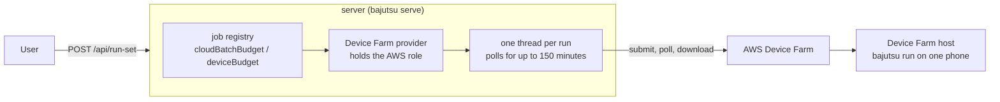
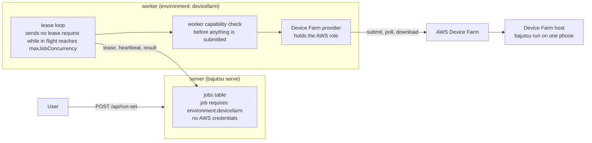

**English** · [日本語](BE-0448-devicefarm-worker-dispatch-ja.md)

# BE-0448 — A worker that submits jobs to Device Farm

<!-- BE-METADATA -->
| Field | Value |
|---|---|
| Proposal | [BE-0448](BE-0448-devicefarm-worker-dispatch.md) |
| Author | [@0x0c](https://github.com/0x0c) |
| Status | **Approved** |
| Tracking issue | [Search](https://github.com/bajutsu-e2e/bajutsu/issues?q=is%3Aissue+label%3Aroadmap-tracking+in%3Atitle+"BE-0448") |
| Topic | Device-cloud execution |
<!-- /BE-METADATA -->

## Introduction

A worker whose `environment` is `devicefarm` runs the Device Farm dispatch itself. It leases a per-scenario job from the queue, submits the run to AWS Device Farm, polls it, and posts the verdict back. It holds the AWS credentials. Today the same dispatch runs inside the server process, so the server holds the AWS role and blocks a thread for each long poll. This item moves the dispatch onto the worker model that the hosted deployment already uses for local runs. It introduces no separate kind of worker: a worker is a worker, and what it can serve is declared in its worker capability.

The worker also owns the **job-concurrency budget**, and it states the budget in the worker capability file. The top-level `maxJobConcurrency` of `worker.yaml` is the number of jobs the worker may have in flight. The worker sends no lease request while it is full, so the decision to lease and the decision to reserve a device are one decision, made in one place. The worker and the server may run on the same machine.

This item builds on the worker capability item, which defines `worker.yaml`, `--worker-config`, `maxJobConcurrency`, and `maxTargetsPerJob`. It goes together with the item that stops the server from executing any job: once the server runs no job, the Device Farm dispatch has no path except the worker.

## Motivation

The Device Farm fan-out of [BE-0336](../BE-0336-serve-device-farm-bounded-fan-out/BE-0336-serve-device-farm-bounded-fan-out.md) works today only when the server runs the whole dispatch in its own process. Its Unit 5 already put the pieces of a worker route in place: the request travels in the job spec (`Job.batch`), and the scheduled run's identifier (its ARN) is stored in the database so a re-leased job resumes polling instead of submitting again. The route is not finished. The docstring of `_run_batch_job` in [`jobs.py`](../../bajutsu/serve/jobs.py) states that a worker builds its own state without a package root, so a Device Farm job leased from the queue fails the service's package validation. The `run-set` endpoint also refuses the per-job artifact overrides of [BE-0431](../BE-0431-job-scoped-artifact-override/BE-0431-job-scoped-artifact-override.md), because the fan-out does not yet run on the split topology ([`dispatch.py`](../../bajutsu/serve/operations/dispatch.py)).

Three problems follow from leaving the dispatch in the server.

- **The credential sits in the wrong process.** The server registers the Device Farm provider when `DEVICEFARM_PROJECT_ARN` is set ([`batch_bootstrap.py`](../../bajutsu/serve/batch_bootstrap.py)), so the process that faces users also holds the AWS role. [BE-0432](../BE-0432-devicefarm-pretest-extension-hook/BE-0432-devicefarm-pretest-extension-hook.md) already keeps client-supplied values away from anything that runs with the AWS credentials, and a smaller set of processes holding the role makes that boundary easier to keep.
- **A long poll ties up the server.** One run can take up to 150 minutes, and each run occupies a thread in the server for that time.
- **The budget is counted away from where the device is reserved.** The device budget `K` is a cap in the server's job registry, while the reservation happens later, in the dispatch. A worker cannot ask whether it may lease, since the cap already decided.

The observable difference has three parts. With the hosted backend and one worker configured for Device Farm, a `POST /api/run-set` on a Device Farm target yields jobs that the worker leases, and each lands a run whose verdict comes from `manifest.json`. Restarting the server or the worker during a poll resumes the same Device Farm run without a second submission once its ARN is saved, even when the worker reaches the server only over HTTP. A stop between scheduling a run and saving its ARN can still cost a second run; the Detailed design records that window as open. And the server process holds no AWS credential.

## Detailed design

### Before and after

Before, the server runs the whole dispatch in its own process. It holds the AWS role, counts the budget in its job registry, and keeps one thread per run for the whole poll.

After, the server only queues the job. A worker whose `environment` is `devicefarm` leases it, checks it against its worker capability, and submits it. The worker holds the AWS role and compares its jobs in flight with `maxJobConcurrency` to decide whether it may lease. The server and the worker may run on one machine as two processes.

### Registering the provider on the worker

At startup, a worker whose `worker.yaml` names a provider as its `environment`, for example `devicefarm`, calls the provider registration that the server runs today (`register_batch_providers`). That call reads `DEVICEFARM_PROJECT_ARN` and the region from the environment, and it loads the batch lifecycle hooks named by `BAJUTSU_BATCH_HOOKS` ([BE-0435](../BE-0435-devicefarm-batch-lifecycle-hook/BE-0435-devicefarm-batch-lifecycle-hook.md)), so the hooks move with the provider. The worker exits with a clear error when the provider cannot register, for example when `DEVICEFARM_PROJECT_ARN` is unset. Once registered, the worker advertises the routing token `environment:<name>`, for example `environment:devicefarm`. The prefix `environment:` is reserved: only this registration can advertise it, and the worker capability item rejects a token with that prefix in the deprecated token inputs. The server no longer registers a provider, whatever its backend.

The worker does not drive the Device Farm phone itself. The phone belongs to the Device Farm host, which runs `bajutsu run` on it. A worker whose environment is not `local` therefore advertises no `platform:*` token, ignores the default of `--platform`, and rejects an explicit `--platform` at startup with a message that names the environment. One worker has one environment, so serving both local and Device Farm jobs on one machine takes two workers. The platform of the phone (`android` or `ios`) stays in the request.

### Routing

A job that carries `Job.batch` requires exactly one token, `environment:<name>`, derived from the target's `cloudBatch` field. It requires no `platform:*` token, no `host:<os>` token, and none of the target's `requires` tokens, since the phone and its host belong to Device Farm. Only a job that carries `Job.batch` requires the environment token: a job from the same target that runs locally keeps its local requirement. The existing capability-routed leasing ([BE-0166](../BE-0166-capability-routed-queues/BE-0166-capability-routed-queues.md)) hands the job only to a worker whose advertised set covers it. An empty required set is servable by any worker, so the subset test alone would hand a local job to a Device Farm worker. The routing test in `can_serve` therefore gains one rule: a worker that advertises an `environment:*` token serves only jobs that require that token. The lease and the unroutable count share `can_serve`, so both apply the rule. A Device Farm job that no worker can serve stays queued and shows as unroutable, as any other job does.

### Credentials

The AWS credentials and the project ARN live only in the environment of a worker that registers the provider. This departs from the spirit of [BE-0160](../BE-0160-worker-credential-free-uploads/BE-0160-worker-credential-free-uploads.md), which keeps object-storage credentials off workers. The departure is narrow: a worker holds them only when the operator starts it with a provider configured, and evidence still travels through presigned URLs. A worker and the server may run on one machine as two processes. The credentials stay out of the server's environment, whether or not the two share a host.

### Package and application delivery

The Device Farm package is rooted at Bajutsu's own source tree, with `pyproject.toml`, `tests/`, and `bajutsu/`, because the test spec installs Bajutsu from it. The bundle workspace of a lease holds only the target's config and scenarios, so it cannot be the package root. That is the cause of the validation failure today. The worker therefore needs a source checkout: an installed Bajutsu carries no `pyproject.toml` or `tests/`, so `bajutsu_source_root` returns nothing for it, and the worker refuses to register the provider at startup with a clear error.

The source root is shared by every job, so the worker never writes into it. Each job gets its own package: the worker composes it from the source tree's `pyproject.toml`, `tests/`, and `bajutsu/` plus the job's own bundle directory, since `build_package` already takes a list of source and archive-name pairs. A job's package therefore carries its own config and scenarios and no other job's.

The server builds the request paths relative to the bundle instead of to its own package root. It also accepts scenarios that come with materials, which is what the hosted storage scope always yields, and which `run-set` refuses for a Device Farm job today ([`dispatch.py`](../../bajutsu/serve/operations/dispatch.py)). The application binary is downloaded through the presigned URL of the lease ([BE-0413](../BE-0413-worker-app-binary-delivery/BE-0413-worker-app-binary-delivery.md)) to a local path, and `BatchRequest` carries a logical reference in place of an absolute path on the server host.

### The concurrency budget on the worker

The budget is the top-level `maxJobConcurrency` of the worker's `worker.yaml`, not a command-line option. The worker sends no lease request while the number of its jobs in flight equals `maxJobConcurrency`. Leaving the token out of the request would not work: each lease request replaces the worker's registered set, so the queued Device Farm jobs would show as unroutable exactly when a backlog exists, and the worker would still be eligible for any job the remaining tokens cover. A slot's heartbeat keeps the worker registered as live while it is full, so its advertised set never changes. A job counts as in flight from its lease until its result is posted, so a slot that is only uploading evidence no longer counts against `maxJobConcurrency`, and the worker may lease again. An omitted `maxJobConcurrency` means one job at a time, which is what a worker does today and keeps the Device Farm quota safe by default. The number of Device Farm devices in use is the sum of the workers' in-flight jobs, and an operator keeps the sum of their `maxJobConcurrency` values within the quota. With one worker, `maxJobConcurrency` is the exact cap.

Concurrent jobs are a real change to the worker loop, which today leases one job and blocks until its result and evidence are done. A worker whose environment is a device cloud and whose `maxJobConcurrency` is above one uses a slot model:

- A job is in flight from its lease until its result is posted. A slot is one thread that owns one leased job, its heartbeat, its own workspace directory, its own package, and its own log bus. Slots share nothing mutable.
- The lease loop runs while the number of jobs in flight is below `maxJobConcurrency`; a slot that has posted its result uploads its evidence without counting.
- On shutdown the worker stops leasing and lets the in-flight leases lapse, so that a restart or another worker resumes each run from its stored identifier. It does not cancel a Device Farm run that is already scheduled.
- Bundle downloads run one per slot, and the operator sizes the disk and memory for that many binaries at once, plus the run trees of slots still uploading evidence.

A worker that leaves `maxJobConcurrency` at its default keeps today's single-slot loop unchanged. A `local` worker accepts a value of one only, as the worker capability item states, because concurrent local jobs need a device allocated to each job and are separate work.

The server-side settings that bounded the Device Farm count therefore go away. The per-target `cloudBatchBudget`, the per-request `deviceBudget`, the registry's `max_concurrent_batch`, and `try_register(device_budget=…)` existed only because the server ran the dispatch, and `maxJobConcurrency` replaces all four. A config that still sets `cloudBatchBudget`, or a request that still sends `deviceBudget`, is deprecated for one release with a notice that names `maxJobConcurrency`, during which it is still honored as today's server-side cap, then rejected with the same name. The global, per-user, and per-org caps of the registry count queued jobs too, and they may still truncate a large run set; raising them for Device Farm fan-out is a decision left open here.

### Restart and lease loss

The lease heartbeat runs during the poll, so a run that lasts 150 minutes holds its lease. The stored ARN must survive the loss of a worker, and today the store is reachable only by a process that holds a database connection ([`jobs.py`](../../bajutsu/serve/jobs.py)). A worker that reaches the server over HTTP has no such connection. The lease response therefore carries the stored ARN, and a new worker route saves it once the run is scheduled. That route is checked against the lease owner in the way the heartbeat route is, so a worker whose lease was reclaimed cannot overwrite it. The worker retries the save until it succeeds or the route reports the lease lost. A lost lease stops the scheduled run only when the ARN was never stored, because no other worker can resume such a run. Once the ARN is stored, the worker leaves the run alone and the reclaiming worker resumes it. A worker that stops between scheduling a run and saving its ARN leaves that run unowned: the re-leased job submits again, and the first run holds its device until Device Farm ends it. The worker names each run after its job id, so an operator can find and stop it. Looking a run up by that name to resume it instead of submitting again needs a `list_runs` call on the Device Farm client and is left to a later item. A cancel flag on the heartbeat response, or SIGINT or SIGTERM under `bajutsu worker --once`, stops the scheduled Device Farm run through `stop_run` and posts the result as cancelled; the shutdown policy above, which lets leases lapse, applies only to a worker that stops without a cancel. A re-leased job resumes polling the same run, and nothing about how the verdict is read changes. Requiring a database connection on every worker would work too, but it would give the worker a second credential of the kind BE-0160 removes.

### Result and run landing

The worker downloads the run tree under a temporary directory and lands it, then posts the result and uploads the evidence through the ordinary worker path. The server stops landing Device Farm runs itself. A scenario that fails the worker capability check is posted through the same result route with the named reason, before anything is submitted.

### Interaction with the target-config restructure item

The proposed target-config restructure item has the slug `target-config-restructure`. It takes
the choice of where a run happens out of the target, and it starts after this item has landed.
Three parts of this item change when it lands.

- **`cloudBatch` leaves the target.** The Device Farm destination moves to the run request.
  The serve fan-out request gains an `environment` field; no command-line command dispatches
  Device Farm today, so no CLI option is added. A job with `Job.batch` derives `environment:<name>` from that request, not from the
  target. The fan-out request (`run-set`) keeps accepting batch-provider kinds alone. *Routing* also
  widens: the plain run request gains an `environment` that accepts `appium`, and a job made from
  it requires that token, where unit 2 here covers `Job.batch` alone.
- **The worker checks `runsOn` conditions before it submits.** The restructure has no device to
  read before a Device Farm run, so a scenario whose effective `runsOn` declares conditions fails on the worker, through
  the existing result route, before anything is submitted. The `bajutsu run` on the Device Farm
  host stays unaware of where it runs.
- **`cloudBatchBudget` disappears from the schema.** This item lands first, so by then
  unit 5 has deprecated `cloudBatchBudget` without yet removing it. The restructure's new target schema then has no
  `cloudBatchBudget` at all, and the key fails at load as unknown.

The restructure item's schema switch-over unit carries the coordination. Once it lands, the
*Prime-directive compliance* line here that names `cloudBatch` as a per-target difference no longer
applies: the destination becomes a per-run choice.

### Boundaries

This item removes the in-process dispatch of the server (`_run_batch_job` and the server's call to `register_batch_providers`); it is the `run-set` step of the item that stops the server from executing jobs. This item leaves the artifact overrides of BE-0431 refused on `run-set`; mapping each override onto a Device Farm request is separate work. It does not change the Device Farm host, the test spec, or how the verdict is read from `manifest.json`. The command keeps its name, `bajutsu serve`; this item calls the concept the server.

### Prime-directive compliance

- **AI never judges.** The worker only ferries a deterministic run to the cloud and back. The verdict stays Bajutsu's own, read from the manifest.
- **Determinism first.** A Device Farm job routes only to a worker that can run it, and a lost lease resumes the same run instead of submitting a second one once the run's ARN is stored.
- **App-agnostic.** Per-target differences stay in `targets.<name>` (`cloudBatch`), and the worker code does not change per application.

### Work breakdown (MECE)

1. **Provider registration on the worker.** Register the provider named by the worker's `environment` and its hooks in `bajutsu worker`, advertise the reserved token `environment:<name>`, apply the `--platform` rules for a non-local environment, and stop registering the provider in the server.
2. **Routing.** Give a job that carries `Job.batch` exactly the required token `environment:<name>`, and add the rule to `can_serve`, so the lease and the unroutable count both give a worker that advertises an environment token only jobs that require it.
3. **Package root and application delivery.** Require a source checkout, compose a package per job without writing into the source root, build bundle-relative request paths on the server, accept scenarios with materials for Device Farm jobs, and carry a logical application reference in `BatchRequest`. Under `bajutsu worker --once`, the spec's application reference is a local path and no ARN is stored.
4. **Concurrent slots.** Refactor the worker loop into the slot model for a device-cloud worker whose `maxJobConcurrency` is above one, with per-slot workspace, package, log bus, and heartbeat, and the shutdown policy.
5. **Budget from the declaration.** Read the top-level `maxJobConcurrency` from `worker.yaml`, send no lease request while full, run the worker capability check of the other item on each leased scenario before it submits, and remove `cloudBatchBudget`, `deviceBudget`, `max_concurrent_batch`, and `try_register(device_budget=…)` after a deprecation.
6. **Checkpoint over HTTP.** Carry the stored ARN in the lease response, add the lease-owner-checked route that saves it with retry, name each run after its job id, and add `stop_run` to the Device Farm client.
7. **Result path.** Land the run and post the result through the worker path.
8. **Tests and documentation.** Drive the fan-out end to end through the database queue and a worker against the faked Device Farm, including a mid-poll restart, and update `docs/devicefarm.md` with its Japanese mirror.

## Alternatives considered

| Option | Summary | Why not |
|---|---|---|
| Keep the dispatch in the server | The status quo of BE-0336. | The AWS role stays in the process that faces users, long polls occupy server threads, and the split topology stays unsupported. |
| A worker without credentials that asks the server to call AWS | The server keeps the credential and acts as a broker. | It leaves the role in the server and adds a new internal interface for a call the worker can make itself. |
| Keep the budget in the server's job registry | The worker executes, and the server counts. | The worker cannot tell whether a lease is allowed, and the count is taken away from the reservation it guards. |
| A separate `--batch-budget` option | The budget is a command-line option on the worker. | The worker capability file already states the worker's limits, and a second place for the same kind of number would let the two disagree. |
| Withhold the environment token when full | The worker leaves the token out of its lease requests while it is full. | Each request replaces the registered set, so queued jobs show as unroutable during a backlog, and the worker stays eligible for any job the other tokens cover. |
| `N` single-slot workers | Run `N` worker processes, each with one slot, instead of one worker with `maxJobConcurrency` set to `N`. | It needs no change to the loop, and it stays a valid deployment. The item still adds the slot model, since `N` processes repeat the AWS environment, the source root, and the process overhead `N` times. |
| A separate dispatch daemon | A new long-running process outside the worker model. | It would reimplement lease, heartbeat, and reclaim, which a worker already provides. |

## Progress

> Keep this section current as work proceeds. The checklist mirrors the MECE work breakdown in
> *Detailed design* (one entry per unit of work), and the log records what changed and when, oldest
> first, each with a link to its PR.

- [ ] Provider registration on the worker
- [ ] Routing
- [ ] Package root and application delivery
- [ ] Concurrent slots
- [ ] Budget from the declaration
- [ ] Checkpoint over HTTP
- [ ] Result path
- [ ] Tests and documentation

## References

- [BE-0336](../BE-0336-serve-device-farm-bounded-fan-out/BE-0336-serve-device-farm-bounded-fan-out.md): the serve-driven Device Farm dispatch this item moves onto a worker.
- [BE-0235](../BE-0235-aws-device-farm-submitter/BE-0235-aws-device-farm-submitter.md): the submitter that packages and runs one scenario.
- [BE-0166](../BE-0166-capability-routed-queues/BE-0166-capability-routed-queues.md): capability-routed leasing.
- [BE-0160](../BE-0160-worker-credential-free-uploads/BE-0160-worker-credential-free-uploads.md): the rule that keeps object-storage credentials off workers, which this item departs from narrowly.
- [BE-0431](../BE-0431-job-scoped-artifact-override/BE-0431-job-scoped-artifact-override.md): the per-job artifact overrides that `run-set` still refuses.
- [BE-0435](../BE-0435-devicefarm-batch-lifecycle-hook/BE-0435-devicefarm-batch-lifecycle-hook.md): the batch lifecycle hooks that move with the provider.
- [BE-0413](../BE-0413-worker-app-binary-delivery/BE-0413-worker-app-binary-delivery.md): application binary delivery to a worker.
- [BE-0432](../BE-0432-devicefarm-pretest-extension-hook/BE-0432-devicefarm-pretest-extension-hook.md): the trust boundary around the AWS role.
- [BE-0106](../BE-0106-post-completion-worker-model/BE-0106-post-completion-worker-model.md): the worker lease model.
- `target-config-restructure` (the target-config restructure item): moves `cloudBatch` to the run request. It also removes `cloudBatchBudget` with the new target schema.
